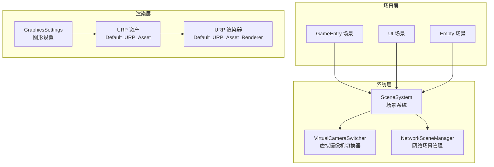
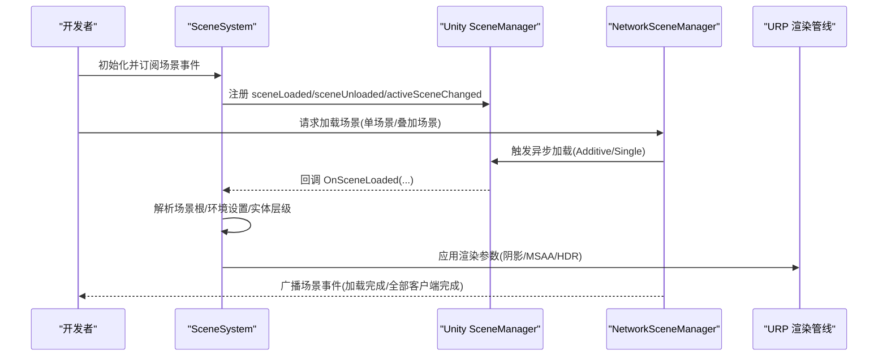
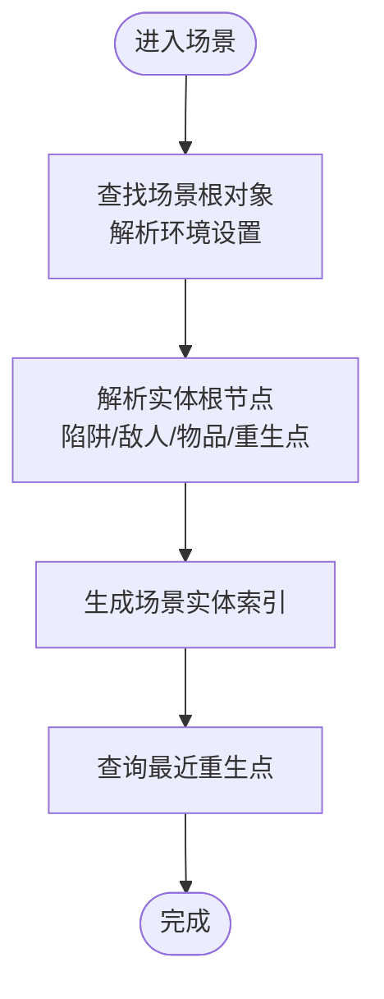
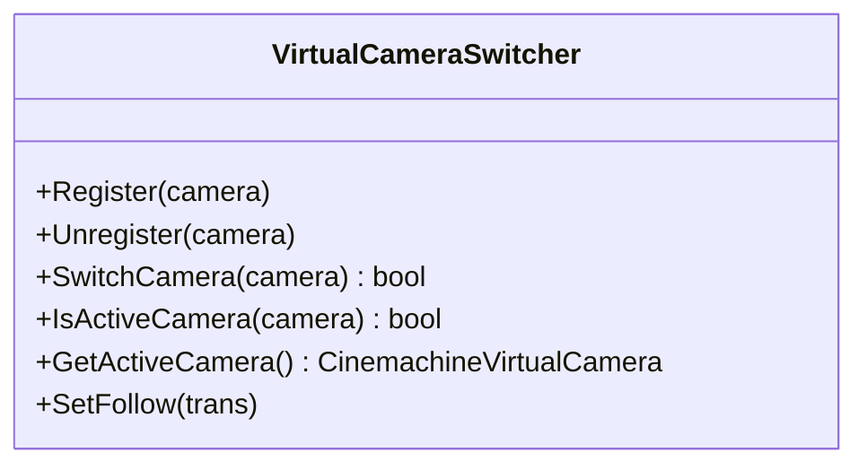
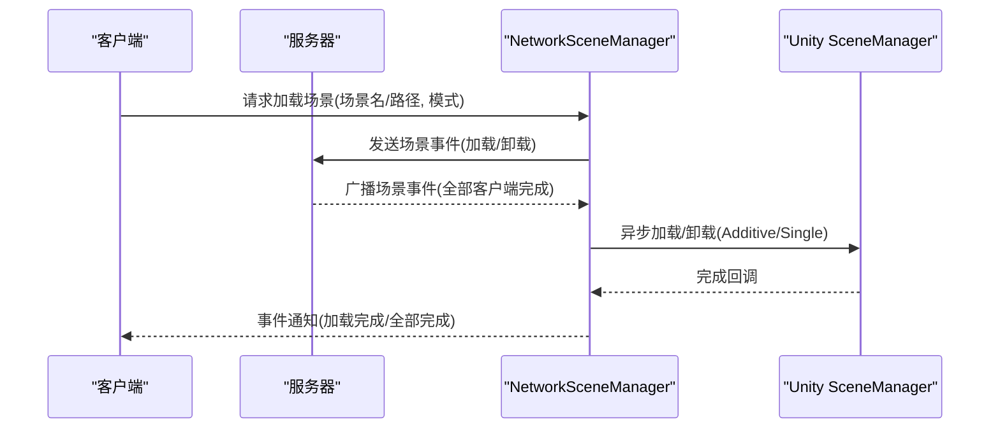
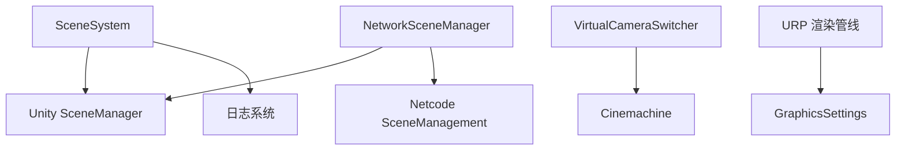

# 场景设计

<cite>
**本文引用的文件**
- [Assets/Scenes/GameEntry.unity](file://Assets/Scenes/GameEntry.unity)
- [Assets/Scenes/UI.unity](file://Assets/Scenes/UI.unity)
- [Assets/Scenes/Empty.unity](file://Assets/Scenes/Empty.unity)
- [Assets/Scripts/Systems/Implement/SceneSystem/SceneSystem.cs](file://Assets/Scripts/Systems/Implement/SceneSystem/SceneSystem.cs)
- [Assets/Scripts/Camera/VirtualCameraSwitcher.cs](file://Assets/Scripts/Camera/VirtualCameraSwitcher.cs)
- [Assets/Art/RenderingAsset/Default_URP_Asset.asset](file://Assets/Art/RenderingAsset/Default_URP_Asset.asset)
- [Assets/Art/RenderingAsset/Default_URP_Asset_Renderer.asset](file://Assets/Art/RenderingAsset/Default_URP_Asset_Renderer.asset)
- [ProjectSettings/GraphicsSettings.asset](file://ProjectSettings/GraphicsSettings.asset)
- [LocalPackages/com.unity.netcode.gameobjects@1.14.1/Runtime/SceneManagement/NetworkSceneManager.cs](file://LocalPackages/com.unity.netcode.gameobjects@1.14.1/Runtime/SceneManagement/NetworkSceneManager.cs)
- [LocalPackages/com.unity.netcode.gameobjects@1.14.1/Runtime/SceneManagement/DefaultSceneManagerHandler.cs](file://LocalPackages/com.unity.netcode.gameobjects@1.14.1/Runtime/SceneManagement/DefaultSceneManagerHandler.cs)
- [LocalPackages/com.unity.netcode.gameobjects@1.14.1/Documentation~/basics/scenemanagement/scene-events.md](file://LocalPackages/com.unity.netcode.gameobjects@1.14.1/Documentation~/basics/scenemanagement/scene-events.md)
- [LocalPackages/com.unity.netcode.gameobjects@1.14.1/Documentation~/advanced-topics/reconnecting-mid-game.md](file://LocalPackages/com.unity.netcode.gameobjects@1.14.1/Documentation~/advanced-topics/reconnecting-mid-game.md)
- [Assets/Settings/Resources/ALINE.asset](file://Assets/Settings/Resources/ALINE.asset)
</cite>

## 目录
1. [简介](#简介)
2. [项目结构](#项目结构)
3. [核心组件](#核心组件)
4. [架构总览](#架构总览)
5. [详细组件分析](#详细组件分析)
6. [依赖分析](#依赖分析)
7. [性能考虑](#性能考虑)
8. [故障排查指南](#故障排查指南)
9. [结论](#结论)
10. [附录](#附录)

## 简介
本文件面向ProjectR项目的场景设计与实现，系统性阐述场景的组织结构、加载机制与切换策略；说明主场景（GameEntry）、UI场景与游戏场景的设计原则与落地方式；覆盖光照与渲染管线配置、性能优化要点；并给出场景脚本化、动态加载与热更新的实践建议，以及测试、调试与性能分析方法。目标是为场景设计师与开发者提供一套完整、可操作的场景开发与优化指南。

## 项目结构
ProjectR在场景层面采用“主场景+UI场景+若干游戏场景”的分层组织：
- 主场景（GameEntry）：承载全局相机、主摄像机、环境光照与场景根对象，作为游戏世界的主要容器。
- UI场景（UI）：独立的UI画布与事件系统，用于界面展示与交互。
- 空场景（Empty）：最小化场景，常用于资源加载或占位。
- 渲染管线：使用URP（通用渲染管线），通过全局渲染设置与渲染器资产统一配置渲染参数。
- 场景管理：基于Unity内置SceneManager与Netcode SceneManagement扩展，支持单场景与多场景加载、同步与卸载。

图示来源
- [Assets/Scenes/GameEntry.unity](file://Assets/Scenes/GameEntry.unity)
- [Assets/Scenes/UI.unity](file://Assets/Scenes/UI.unity)
- [Assets/Scenes/Empty.unity](file://Assets/Scenes/Empty.unity)
- [Assets/Scripts/Systems/Implement/SceneSystem/SceneSystem.cs](file://Assets/Scripts/Systems/Implement/SceneSystem/SceneSystem.cs)
- [Assets/Scripts/Camera/VirtualCameraSwitcher.cs](file://Assets/Scripts/Camera/VirtualCameraSwitcher.cs)
- [ProjectSettings/GraphicsSettings.asset](file://ProjectSettings/GraphicsSettings.asset)
- [Assets/Art/RenderingAsset/Default_URP_Asset.asset](file://Assets/Art/RenderingAsset/Default_URP_Asset.asset)
- [Assets/Art/RenderingAsset/Default_URP_Asset_Renderer.asset](file://Assets/Art/RenderingAsset/Default_URP_Asset_Renderer.asset)
- [LocalPackages/com.unity.netcode.gameobjects@1.14.1/Runtime/SceneManagement/NetworkSceneManager.cs](file://LocalPackages/com.unity.netcode.gameobjects@1.14.1/Runtime/SceneManagement/NetworkSceneManager.cs)

章节来源
- [Assets/Scenes/GameEntry.unity](file://Assets/Scenes/GameEntry.unity)
- [Assets/Scenes/UI.unity](file://Assets/Scenes/UI.unity)
- [Assets/Scenes/Empty.unity](file://Assets/Scenes/Empty.unity)
- [ProjectSettings/GraphicsSettings.asset](file://ProjectSettings/GraphicsSettings.asset)

## 核心组件
- 场景系统（SceneSystem）
  - 订阅Unity场景事件（加载、卸载、激活场景变更），并提供注册回调接口。
  - 在场景激活时解析场景根节点与环境设置，建立陷阱、敌人、物品等场景实体的层级索引。
  - 提供最近重生点查询等辅助能力。
- 虚拟摄像机切换器（VirtualCameraSwitcher）
  - 维护Cinemachine虚拟摄像机列表，按优先级切换当前激活摄像机，并统一对跟随目标赋值。
- 渲染资产（URP）
  - 全局渲染设置与渲染器资产集中定义阴影、MSAA、HDR、批处理等渲染参数。
- 网络场景管理（NetworkSceneManager）
  - 基于场景哈希与构建索引进行场景加载/卸载/同步，支持服务端与客户端事件通知与进度跟踪。

章节来源
- [Assets/Scripts/Systems/Implement/SceneSystem/SceneSystem.cs](file://Assets/Scripts/Systems/Implement/SceneSystem/SceneSystem.cs)
- [Assets/Scripts/Camera/VirtualCameraSwitcher.cs](file://Assets/Scripts/Camera/VirtualCameraSwitcher.cs)
- [Assets/Art/RenderingAsset/Default_URP_Asset.asset](file://Assets/Art/RenderingAsset/Default_URP_Asset.asset)
- [Assets/Art/RenderingAsset/Default_URP_Asset_Renderer.asset](file://Assets/Art/RenderingAsset/Default_URP_Asset_Renderer.asset)
- [LocalPackages/com.unity.netcode.gameobjects@1.14.1/Runtime/SceneManagement/NetworkSceneManager.cs](file://LocalPackages/com.unity.netcode.gameobjects@1.14.1/Runtime/SceneManagement/NetworkSceneManager.cs)

## 架构总览
下图展示了从场景加载到渲染输出的整体流程，包括本地场景事件与网络场景事件的协同：

图示来源
- [Assets/Scripts/Systems/Implement/SceneSystem/SceneSystem.cs](file://Assets/Scripts/Systems/Implement/SceneSystem/SceneSystem.cs)
- [LocalPackages/com.unity.netcode.gameobjects@1.14.1/Runtime/SceneManagement/NetworkSceneManager.cs](file://LocalPackages/com.unity.netcode.gameobjects@1.14.1/Runtime/SceneManagement/NetworkSceneManager.cs)
- [Assets/Art/RenderingAsset/Default_URP_Asset.asset](file://Assets/Art/RenderingAsset/Default_URP_Asset.asset)

## 详细组件分析

### 场景系统（SceneSystem）
- 设计原则
  - 单例系统，集中管理场景生命周期事件与场景内实体根节点索引。
  - 通过标签与命名约定识别场景根对象，自动解析陷阱、敌人、物品、重生点等层级。
- 关键行为
  - 场景加载回调：记录日志、广播给订阅者。
  - 激活场景变更：触发一次主动态场景变更回调，便于UI与逻辑联动。
  - 实体生成：在进入场景时扫描场景根下的实体根节点，建立列表以供后续使用。
  - 重生点查询：根据参考点计算最近重生点，返回坐标。
- 适用场景
  - 主场景（GameEntry）：作为游戏世界容器，解析场景根与环境设置，驱动后续实体生成与UI联动。
  - 游戏场景：遵循相同约定，确保实体层级一致。

图示来源
- [Assets/Scripts/Systems/Implement/SceneSystem/SceneSystem.cs](file://Assets/Scripts/Systems/Implement/SceneSystem/SceneSystem.cs)

章节来源
- [Assets/Scripts/Systems/Implement/SceneSystem/SceneSystem.cs](file://Assets/Scripts/Systems/Implement/SceneSystem/SceneSystem.cs)

### 虚拟摄像机切换器（VirtualCameraSwitcher）
- 设计原则
  - 统一管理Cinemachine虚拟摄像机优先级，避免多摄像机同时生效。
  - 提供跟随目标批量设置，简化摄像机切换后的绑定。
- 关键行为
  - 注册/注销：维护摄像机列表，清理已销毁实例。
  - 切换：将目标摄像机优先级提升至最高，其他摄像机降权。
  - 查询：判断是否为当前激活摄像机，返回当前激活摄像机。
- 适用场景
  - 主场景（GameEntry）：在不同玩法阶段（如过场、战斗、探索）切换摄像机视角。

图示来源
- [Assets/Scripts/Camera/VirtualCameraSwitcher.cs](file://Assets/Scripts/Camera/VirtualCameraSwitcher.cs)

章节来源
- [Assets/Scripts/Camera/VirtualCameraSwitcher.cs](file://Assets/Scripts/Camera/VirtualCameraSwitcher.cs)

### 渲染管线与光照配置
- 渲染管线
  - 使用URP（通用渲染管线），全局渲染设置与渲染器资产集中配置。
  - 关键参数：MSAA、HDR、阴影分辨率、阴影级联数、软阴影质量、批处理开关等。
- 光照设置
  - 场景光照由Unity光照贴图与环境光共同决定，可通过场景设置与渲染资产统一调整。
  - 建议在主场景（GameEntry）中统一配置环境光照与天空盒，保证视觉一致性。
- 后处理与调试
  - 可通过渲染器资产启用后处理数据与调试着色器，便于定位渲染问题。

图示来源
- [ProjectSettings/GraphicsSettings.asset](file://ProjectSettings/GraphicsSettings.asset)
- [Assets/Art/RenderingAsset/Default_URP_Asset.asset](file://Assets/Art/RenderingAsset/Default_URP_Asset.asset)
- [Assets/Art/RenderingAsset/Default_URP_Asset_Renderer.asset](file://Assets/Art/RenderingAsset/Default_URP_Asset_Renderer.asset)

章节来源
- [ProjectSettings/GraphicsSettings.asset](file://ProjectSettings/GraphicsSettings.asset)
- [Assets/Art/RenderingAsset/Default_URP_Asset.asset](file://Assets/Art/RenderingAsset/Default_URP_Asset.asset)
- [Assets/Art/RenderingAsset/Default_URP_Asset_Renderer.asset](file://Assets/Art/RenderingAsset/Default_URP_Asset_Renderer.asset)

### 网络场景管理与切换策略
- 加载模式
  - 单场景（Single）：替换当前场景，适合主场景切换。
  - 叠加场景（Additive）：在当前场景上叠加新场景，适合副本、临时区域或UI场景。
- 事件与进度
  - 支持加载/卸载事件、客户端完成通知、全部客户端完成通知。
  - 通过场景哈希与构建索引进行场景定位，确保跨端一致性。
- 切换策略
  - 主场景切换：使用单场景加载，确保资源与状态重置。
  - UI场景：使用叠加场景，避免影响主场景状态。
  - 多场景同步：注意客户端断线重连时的场景同步差异，必要时在断开前切换或卸载附加场景。

图示来源
- [LocalPackages/com.unity.netcode.gameobjects@1.14.1/Runtime/SceneManagement/NetworkSceneManager.cs](file://LocalPackages/com.unity.netcode.gameobjects@1.14.1/Runtime/SceneManagement/NetworkSceneManager.cs)
- [LocalPackages/com.unity.netcode.gameobjects@1.14.1/Documentation~/basics/scenemanagement/scene-events.md](file://LocalPackages/com.unity.netcode.gameobjects@1.14.1/Documentation~/basics/scenemanagement/scene-events.md)

章节来源
- [LocalPackages/com.unity.netcode.gameobjects@1.14.1/Runtime/SceneManagement/NetworkSceneManager.cs](file://LocalPackages/com.unity.netcode.gameobjects@1.14.1/Runtime/SceneManagement/NetworkSceneManager.cs)
- [LocalPackages/com.unity.netcode.gameobjects@1.14.1/Runtime/SceneManagement/DefaultSceneManagerHandler.cs](file://LocalPackages/com.unity.netcode.gameobjects@1.14.1/Runtime/SceneManagement/DefaultSceneManagerHandler.cs)
- [LocalPackages/com.unity.netcode.gameobjects@1.14.1/Documentation~/advanced-topics/reconnecting-mid-game.md](file://LocalPackages/com.unity.netcode.gameobjects@1.14.1/Documentation~/advanced-topics/reconnecting-mid-game.md)

### 场景脚本化、动态加载与热更新
- 场景脚本化
  - 通过SceneSystem在场景加载完成后执行初始化逻辑，解析场景根与实体层级，避免硬编码依赖。
- 动态加载
  - 使用NetworkSceneManager按需加载/卸载场景，结合事件回调实现渐进式加载与状态同步。
- 热更新
  - 建议将场景加入构建列表并通过场景哈希进行加载，避免运行时动态打包导致的加载失败。
  - 断线重连场景同步注意事项详见“断线重连场景同步”文档片段。

章节来源
- [Assets/Scripts/Systems/Implement/SceneSystem/SceneSystem.cs](file://Assets/Scripts/Systems/Implement/SceneSystem/SceneSystem.cs)
- [LocalPackages/com.unity.netcode.gameobjects@1.14.1/Runtime/SceneManagement/NetworkSceneManager.cs](file://LocalPackages/com.unity.netcode.gameobjects@1.14.1/Runtime/SceneManagement/NetworkSceneManager.cs)
- [LocalPackages/com.unity.netcode.gameobjects@1.14.1/Documentation~/advanced-topics/reconnecting-mid-game.md](file://LocalPackages/com.unity.netcode.gameobjects@1.14.1/Documentation~/advanced-topics/reconnecting-mid-game.md)

### 测试、调试与性能分析
- 场景事件监听
  - 订阅NetworkSceneManager.OnSceneEvent，区分加载、卸载、完成等事件类型，记录进度与耗时。
- 场景调试
  - 使用ALINE等工具对场景进行可视化调试，观察场景元素与渲染状态。
- 性能分析
  - 通过编辑器工具采集批次、三角面数、顶点数与纹理内存，评估场景复杂度。
  - 结合URP渲染参数（如MSAA、阴影质量、批处理）进行针对性优化。

章节来源
- [LocalPackages/com.unity.netcode.gameobjects@1.14.1/Documentation~/basics/scenemanagement/scene-events.md](file://LocalPackages/com.unity.netcode.gameobjects@1.14.1/Documentation~/basics/scenemanagement/scene-events.md)
- [Assets/Settings/Resources/ALINE.asset](file://Assets/Settings/Resources/ALINE.asset)

## 依赖分析
- 场景系统依赖Unity SceneManager与日志系统，负责场景生命周期与实体索引。
- 虚拟摄像机切换器依赖Cinemachine，负责摄像机优先级与跟随目标。
- 渲染管线依赖URP资产与全局图形设置，统一控制渲染参数。
- 网络场景管理依赖Netcode SceneManagement，负责跨端场景同步与事件广播。

图示来源
- [Assets/Scripts/Systems/Implement/SceneSystem/SceneSystem.cs](file://Assets/Scripts/Systems/Implement/SceneSystem/SceneSystem.cs)
- [Assets/Scripts/Camera/VirtualCameraSwitcher.cs](file://Assets/Scripts/Camera/VirtualCameraSwitcher.cs)
- [ProjectSettings/GraphicsSettings.asset](file://ProjectSettings/GraphicsSettings.asset)
- [LocalPackages/com.unity.netcode.gameobjects@1.14.1/Runtime/SceneManagement/NetworkSceneManager.cs](file://LocalPackages/com.unity.netcode.gameobjects@1.14.1/Runtime/SceneManagement/NetworkSceneManager.cs)

章节来源
- [Assets/Scripts/Systems/Implement/SceneSystem/SceneSystem.cs](file://Assets/Scripts/Systems/Implement/SceneSystem/SceneSystem.cs)
- [Assets/Scripts/Camera/VirtualCameraSwitcher.cs](file://Assets/Scripts/Camera/VirtualCameraSwitcher.cs)
- [ProjectSettings/GraphicsSettings.asset](file://ProjectSettings/GraphicsSettings.asset)
- [LocalPackages/com.unity.netcode.gameobjects@1.14.1/Runtime/SceneManagement/NetworkSceneManager.cs](file://LocalPackages/com.unity.netcode.gameobjects@1.14.1/Runtime/SceneManagement/NetworkSceneManager.cs)

## 性能考虑
- 渲染参数
  - MSAA与阴影质量直接影响帧率，建议在移动设备降低MSAA与阴影分辨率，在PC端适度提高。
  - 批处理（SRP Batcher）开启可减少Draw Call，建议保持开启。
- 场景复杂度
  - 控制场景内网格面数与纹理数量，避免过多的透明与粒子效果。
  - 使用叠加场景承载临时内容，减少主场景常驻资源。
- 网络同步
  - 尽量使用单场景切换进行主场景切换，避免频繁叠加/卸载带来的同步成本。
  - 对断线重连场景同步进行预处理（断开前切换或卸载附加场景），减少重复加载。

## 故障排查指南
- 场景无法加载
  - 确认场景已在构建列表中，且名称/路径正确；检查场景哈希映射与构建索引。
- 断线重连场景异常
  - 注意服务器与客户端场景不一致的情况，必要时在断开前切换或卸载附加场景。
- 摄像机冲突
  - 检查虚拟摄像机优先级，确保仅有一个摄像机处于激活状态。
- 渲染异常
  - 检查URP资产与全局图形设置，确认阴影、MSAA与HDR配置是否合理。

章节来源
- [LocalPackages/com.unity.netcode.gameobjects@1.14.1/Documentation~/advanced-topics/reconnecting-mid-game.md](file://LocalPackages/com.unity.netcode.gameobjects@1.14.1/Documentation~/advanced-topics/reconnecting-mid-game.md)
- [Assets/Art/RenderingAsset/Default_URP_Asset.asset](file://Assets/Art/RenderingAsset/Default_URP_Asset.asset)
- [Assets/Art/RenderingAsset/Default_URP_Asset_Renderer.asset](file://Assets/Art/RenderingAsset/Default_URP_Asset_Renderer.asset)

## 结论
ProjectR的场景体系以“主场景+UI场景+多场景叠加”为核心，配合SceneSystem与NetworkSceneManager实现稳定的场景生命周期与跨端同步。通过URP统一渲染参数与Cinemachine摄像机管理，可在保证视觉品质的同时兼顾性能。建议在实际开发中严格遵循场景命名与层级约定，合理选择加载模式，并结合事件回调与性能工具持续优化。

## 附录
- 场景配置参数
  - 渲染：MSAA、HDR、阴影分辨率、阴影级联数、软阴影质量、批处理开关。
  - 光照：环境光、天空盒、光照贴图与方向光设置。
- 加载顺序与依赖
  - 主场景（GameEntry）优先加载，随后按需叠加UI场景与游戏场景。
  - 断线重连时，先处理附加场景的同步与卸载，再进行主场景切换。

章节来源
- [Assets/Art/RenderingAsset/Default_URP_Asset.asset](file://Assets/Art/RenderingAsset/Default_URP_Asset.asset)
- [Assets/Art/RenderingAsset/Default_URP_Asset_Renderer.asset](file://Assets/Art/RenderingAsset/Default_URP_Asset_Renderer.asset)
- [LocalPackages/com.unity.netcode.gameobjects@1.14.1/Documentation~/advanced-topics/reconnecting-mid-game.md](file://LocalPackages/com.unity.netcode.gameobjects@1.14.1/Documentation~/advanced-topics/reconnecting-mid-game.md)