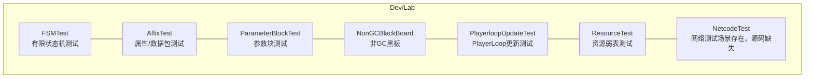
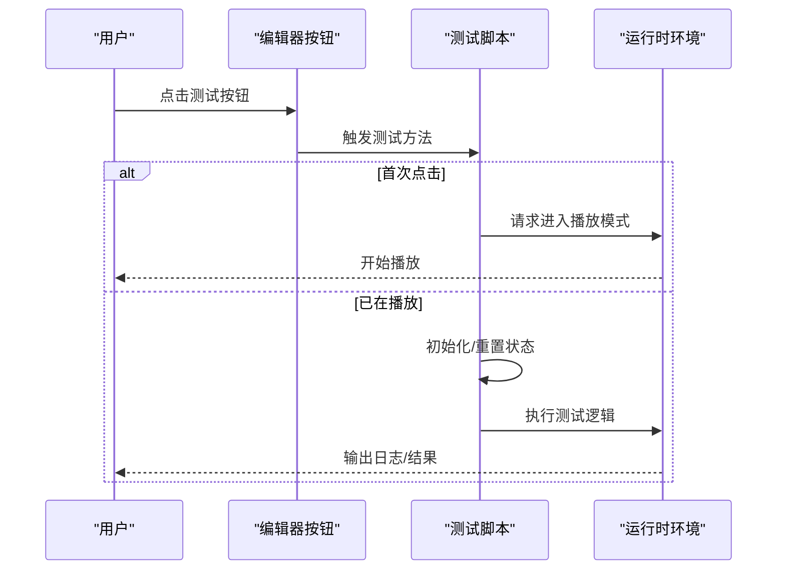
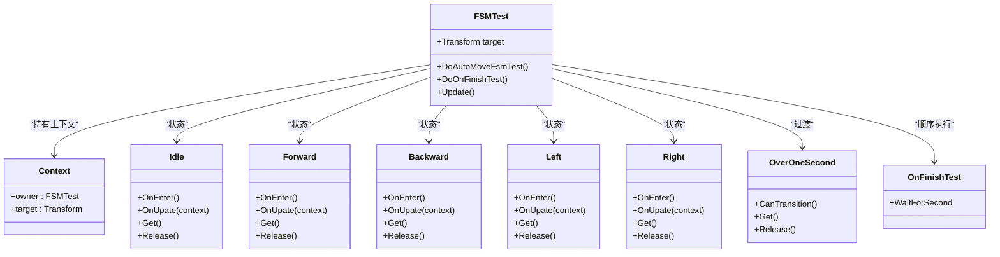
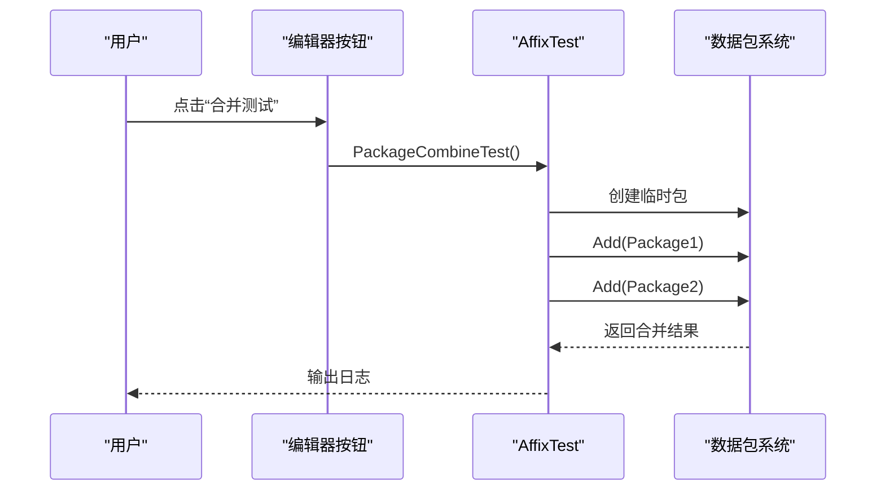
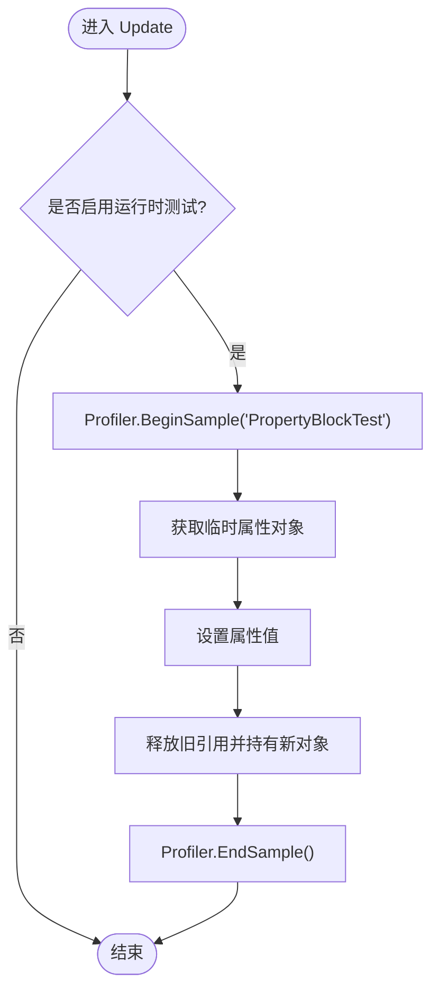
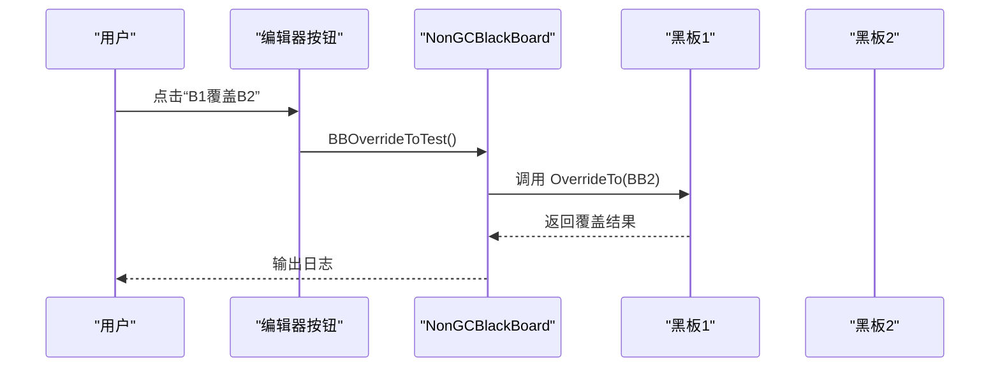
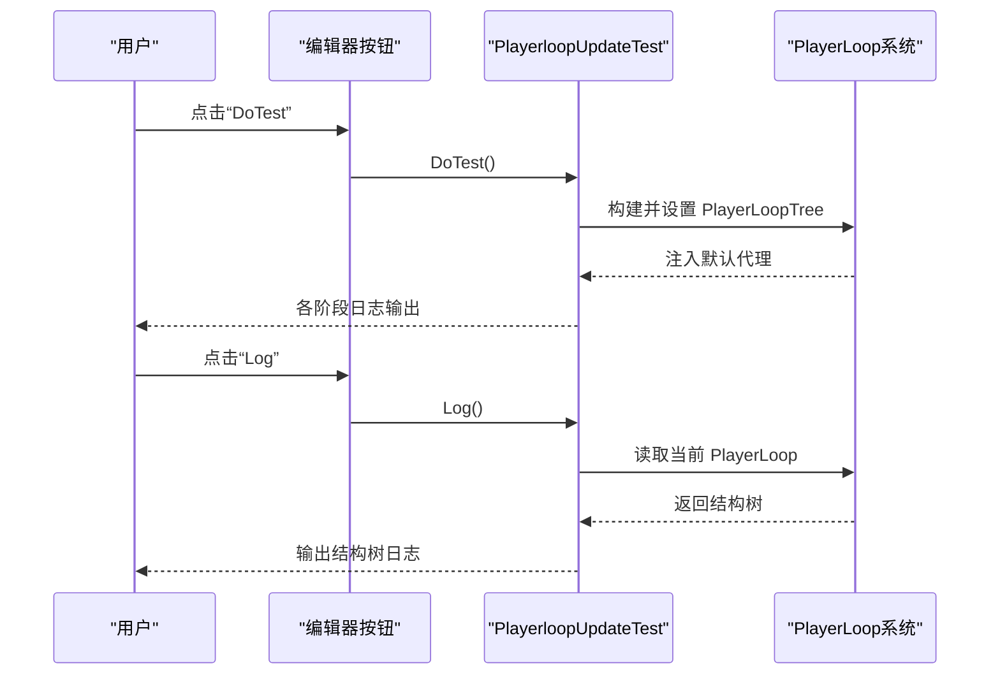
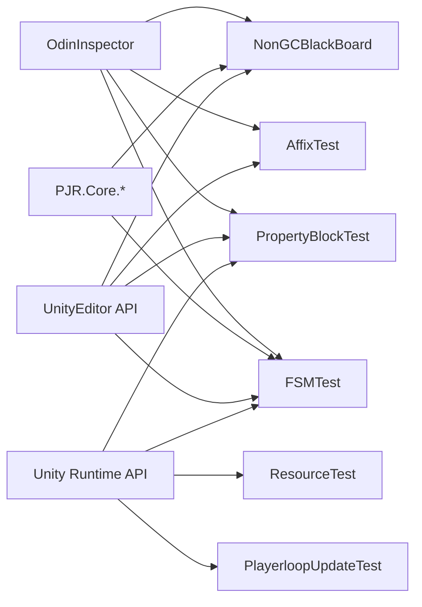

# 实验室工具

<cite>
**本文档引用的文件**
- [FSMTest.cs](file://Assets/Dev/Lab/FSMTest/FSMTest.cs)
- [AffixTest.cs](file://Assets/Dev/Lab/AffixTest/AffixTest.cs)
- [PropertyBlockTest.cs](file://Assets/Dev/Lab/ParameterBlockTest/PropertyBlockTest.cs)
- [NonGCBlackBoard.cs](file://Assets/Dev/Lab/NonCGBlackBoard/NonGCBlackBoard.cs)
- [PlayerloopUpdateTest.cs](file://Assets/Dev/Lab/PlayerloopUpdate/PlayerloopUpdateTest.cs)
- [ResourceTest.cs](file://Assets/Dev/Lab/ResourceTest/ResourceTest.cs)
- [__info__.json](file://Assets/Dev/Lab/__info__.json)
</cite>

## 目录
1. [简介](#简介)
2. [项目结构](#项目结构)
3. [核心组件](#核心组件)
4. [架构总览](#架构总览)
5. [详细组件分析](#详细组件分析)
6. [依赖关系分析](#依赖关系分析)
7. [性能考虑](#性能考虑)
8. [故障排查指南](#故障排查指南)
9. [结论](#结论)
10. [附录](#附录)

## 简介
本文件系统性梳理 ProjectR 项目中“实验室工具”（Dev/Lab）的各类实验性功能与测试工具，重点覆盖以下主题：
- 有限状态机测试（FSMTest）
- 属性测试（AffixTest）
- 网络测试（NetcodeTest，仓库中未发现对应源码，仅列出可用场景与扩展建议）
- 其他专项测试：参数块测试（ParameterBlockTest）、非 GC 黑板（NonGCBlackBoard）、PlayerLoop 更新测试（PlayerloopUpdateTest）、资源弱表测试（ResourceTest）

这些工具旨在帮助开发者快速验证技术概念、进行功能与性能验证，并提供可扩展的框架以便二次开发。

## 项目结构
Dev/Lab 目录下包含多个独立的测试脚本与场景，每个脚本通常挂载于场景中的空对象上，通过按钮触发测试流程。整体采用“按功能分组”的组织方式，便于快速定位与复用。

图表来源
- [FSMTest.cs:1-181](file://Assets/Dev/Lab/FSMTest/FSMTest.cs#L1-L181)
- [AffixTest.cs:1-64](file://Assets/Dev/Lab/AffixTest/AffixTest.cs#L1-L64)
- [PropertyBlockTest.cs:1-80](file://Assets/Dev/Lab/ParameterBlockTest/PropertyBlockTest.cs#L1-L80)
- [NonGCBlackBoard.cs:1-57](file://Assets/Dev/Lab/NonCGBlackBoard/NonGCBlackBoard.cs#L1-L57)
- [PlayerloopUpdateTest.cs:1-225](file://Assets/Dev/Lab/PlayerloopUpdate/PlayerloopUpdateTest.cs#L1-L225)
- [ResourceTest.cs:1-20](file://Assets/Dev/Lab/ResourceTest/ResourceTest.cs#L1-L20)
- [__info__.json:1-3](file://Assets/Dev/Lab/__info__.json#L1-L3)

章节来源
- [__info__.json:1-3](file://Assets/Dev/Lab/__info__.json#L1-L3)

## 核心组件
- FSMTest：基于轻量级有限状态机框架，演示状态切换、过渡条件与顺序执行，适合验证状态机在运行时的行为与性能。
- AffixTest：围绕数据包（DataPackage）与临时数据包（TempDataPackage）进行合并与增量添加测试，适合验证数据聚合与内存管理。
- ParameterBlockTest：基于效果属性（EffectProperty）与 PropertyBlock 的运行时性能测试，适合验证参数块的分配与释放模式。
- NonGCBlackBoard：展示缓存值黑板（CacheableValueBoard）的定义、字段声明与覆盖机制，适合验证黑板在编辑器与运行时的行为。
- PlayerloopUpdateTest：注册默认代理到 Unity PlayerLoop 的各个阶段，用于观察与验证更新时机与顺序。
- ResourceTest：使用 ConditionalWeakTable 验证弱引用句柄的生命周期与释放行为，适合验证资源回收策略。

章节来源
- [FSMTest.cs:1-181](file://Assets/Dev/Lab/FSMTest/FSMTest.cs#L1-L181)
- [AffixTest.cs:1-64](file://Assets/Dev/Lab/AffixTest/AffixTest.cs#L1-L64)
- [PropertyBlockTest.cs:1-80](file://Assets/Dev/Lab/ParameterBlockTest/PropertyBlockTest.cs#L1-L80)
- [NonGCBlackBoard.cs:1-57](file://Assets/Dev/Lab/NonCGBlackBoard/NonGCBlackBoard.cs#L1-L57)
- [PlayerloopUpdateTest.cs:1-225](file://Assets/Dev/Lab/PlayerloopUpdate/PlayerloopUpdateTest.cs#L1-L225)
- [ResourceTest.cs:1-20](file://Assets/Dev/Lab/ResourceTest/ResourceTest.cs#L1-L20)

## 架构总览
实验室工具遵循统一的“编辑器驱动 + 运行时验证”范式：
- 编辑器入口：通过 Odin Inspector 的 Button 特性暴露一键测试按钮。
- 运行时控制：首次点击进入 Play 模式；后续点击直接执行测试逻辑。
- 资源管理：大量使用对象池（如 GenerialPool）与临时对象（using 作用域）降低 GC 压力。
- 可观测性：通过 Debug.Log 输出关键信息，便于快速定位问题。

图表来源
- [FSMTest.cs:18-44](file://Assets/Dev/Lab/FSMTest/FSMTest.cs#L18-L44)
- [AffixTest.cs:31-58](file://Assets/Dev/Lab/AffixTest/AffixTest.cs#L31-L58)
- [PropertyBlockTest.cs:18-46](file://Assets/Dev/Lab/ParameterBlockTest/PropertyBlockTest.cs#L18-L46)
- [NonGCBlackBoard.cs:36-47](file://Assets/Dev/Lab/NonCGBlackBoard/NonGCBlackBoard.cs#L36-L47)
- [PlayerloopUpdateTest.cs:21-42](file://Assets/Dev/Lab/PlayerloopUpdate/PlayerloopUpdateTest.cs#L21-L42)

## 详细组件分析

### 有限状态机测试（FSMTest）
- 功能概述
  - 提供自动移动状态序列的演示：Idle → Forward → Right → Backward → Left → Forward 循环。
  - 支持顺序执行（SequentialExecute）与过渡条件（OverOneSecond）组合，验证状态持续时间与切换逻辑。
  - 使用对象池管理状态与过渡实例，减少 GC 抖动。
- 关键接口与流程
  - 状态类：Idle/Forward/Backward/Left/Right，均继承自支持过渡的基类，实现 Enter/Update 生命周期。
  - 过渡类：OverOneSecond 基于当前状态时间判断是否满足切换条件。
  - 测试入口：DoAutoMoveFsmTest/DoOnFinishTest，分别启动循环序列或顺序等待序列。
- 使用步骤
  1) 在场景中创建空对象并挂载 FSMTest。
  2) 将一个可移动的目标物体赋给 target 字段。
  3) 点击“自动移动 FSM 测试”按钮，观察目标按顺序移动。
  4) 点击“完成回调测试”，观察顺序状态完成后输出完成日志。
- 性能与扩展
  - 对象池化：所有状态与过渡均通过 GenerialPool 获取/释放，避免频繁分配。
  - 可扩展：新增状态/过渡只需实现相应基类并注册到 Fsm 构造参数或 AddTransition。

图表来源
- [FSMTest.cs:11-181](file://Assets/Dev/Lab/FSMTest/FSMTest.cs#L11-L181)

章节来源
- [FSMTest.cs:1-181](file://Assets/Dev/Lab/FSMTest/FSMTest.cs#L1-L181)

### 属性测试（AffixTest）
- 功能概述
  - 面向数据包（DataPackage）与临时数据包（TempDataPackage）的合并与增量添加测试。
  - 通过 Odin 序列化在编辑器中直观地查看与修改测试数据。
- 关键接口与流程
  - PackageCombineTest：将两个数据包合并到临时包并输出结果。
  - PackageAddTest：向现有临时包追加新包并输出结果。
  - 使用 using 语义确保临时包及时释放。
- 使用步骤
  1) 在场景中创建空对象并挂载 AffixTest。
  2) 在编辑器中填充 Package1/Package2 或 TempPackage。
  3) 点击“Package 合并测试”或“Package data 添加测试”按钮，观察控制台输出。
- 性能与扩展
  - 适合验证数据聚合的正确性与内存占用。
  - 可扩展为批量处理、去重策略或类型安全的数据校验。

图表来源
- [AffixTest.cs:31-44](file://Assets/Dev/Lab/AffixTest/AffixTest.cs#L31-L44)

章节来源
- [AffixTest.cs:1-64](file://Assets/Dev/Lab/AffixTest/AffixTest.cs#L1-L64)

### 参数块测试（ParameterBlockTest）
- 功能概述
  - 基于 EffectProperty 与 PropertyBlock 的运行时性能测试，演示临时对象的获取与释放。
  - 使用 Profiler.BeginSample/EndSample 包裹测试片段，便于性能分析。
- 关键接口与流程
  - RuntimeTest：切换运行时测试开关，每帧执行一次参数块操作。
  - NewTemp2：创建临时属性对象并赋值后替换持久引用。
  - Update：在开启测试时，每帧创建临时对象并释放，验证无泄漏。
- 使用步骤
  1) 在场景中创建空对象并挂载 PropertyBlockTest。
  2) 点击“运行时测试”按钮，观察控制台输出与帧间变化。
  3) 点击“NewTemp2”按钮，观察属性块赋值与引用替换。
- 性能与扩展
  - 建议结合 Unity Profiler 分析分配热点。
  - 可扩展为多属性块对比、不同数据规模下的吞吐测试。

图表来源
- [PropertyBlockTest.cs:18-46](file://Assets/Dev/Lab/ParameterBlockTest/PropertyBlockTest.cs#L18-L46)

章节来源
- [PropertyBlockTest.cs:1-80](file://Assets/Dev/Lab/ParameterBlockTest/PropertyBlockTest.cs#L1-L80)

### 非 GC 黑板（NonGCBlackBoard）
- 功能概述
  - 展示如何定义缓存值黑板（CacheableValueBoard），如何声明可缓存字段（CacheableField），以及如何进行黑板覆盖（OverrideTo）。
  - 通过 Odin 序列化与编辑器按钮进行可视化操作。
- 关键接口与流程
  - BBOverrideToTest：将一个黑板覆盖到另一个黑板，便于对比与调试。
  - Test2：读取字符串字段并输出其值与内部缓存值。
- 使用步骤
  1) 在场景中创建空对象并挂载 NonGCBlackBoard。
  2) 在编辑器中配置两个黑板与字符串字段。
  3) 点击“B1 覆盖 B2”按钮，观察覆盖结果。
  4) 点击“Test2”按钮，观察字符串字段的读取结果。
- 性能与扩展
  - 适合验证黑板缓存命中率与覆盖策略。
  - 可扩展为多层黑板链、条件覆盖与动态刷新。

图表来源
- [NonGCBlackBoard.cs:36-47](file://Assets/Dev/Lab/NonCGBlackBoard/NonGCBlackBoard.cs#L36-L47)

章节来源
- [NonGCBlackBoard.cs:1-57](file://Assets/Dev/Lab/NonCGBlackBoard/NonGCBlackBoard.cs#L1-L57)

### PlayerLoop 更新测试（PlayerloopUpdateTest）
- 功能概述
  - 将一组默认代理注册到 PlayerLoop 的各个阶段（Initialization/EarlyUpdate/FixedUpdate/Update/PreLateUpdate/PostLateUpdate 等），用于观察与验证更新时机。
  - 提供打印当前 PlayerLoop 结构的能力，便于理解 Unity 的更新顺序。
- 关键接口与流程
  - DoTest：构建 PlayerLoopTree 并注入默认代理节点，然后应用到当前 PlayerLoop。
  - Log：递归遍历并输出当前 PlayerLoop 的结构树。
  - 内部代理：DefaultAgents.* 实现 ILocatedAgent，指定插入位置与更新委托。
- 使用步骤
  1) 在场景中创建空对象并挂载 PlayerloopUpdateTest。
  2) 点击“DoTest”按钮，观察各阶段日志输出。
  3) 点击“Log”按钮，查看当前 PlayerLoop 的结构树。
- 性能与扩展
  - 适合排查更新顺序问题与性能瓶颈。
  - 可扩展为自定义代理、条件注入与可视化面板。

图表来源
- [PlayerloopUpdateTest.cs:21-107](file://Assets/Dev/Lab/PlayerloopUpdate/PlayerloopUpdateTest.cs#L21-L107)

章节来源
- [PlayerloopUpdateTest.cs:1-225](file://Assets/Dev/Lab/PlayerloopUpdate/PlayerloopUpdateTest.cs#L1-L225)

### 资源弱表测试（ResourceTest）
- 功能概述
  - 使用 ConditionalWeakTable 在 GameObject 与自定义句柄（AnyHandle）之间建立弱引用映射，验证句柄的生命周期与释放行为。
- 关键接口与流程
  - AnyHandle：实现 IDisposable，在 Dispose 中输出日志，用于确认释放路径。
  - ResourceTest：持有 WeakTable，作为资源映射容器。
- 使用步骤
  1) 在场景中创建空对象并挂载 ResourceTest。
  2) 在外部代码中向 WeakTable 添加条目（GameObject → AnyHandle）。
  3) 触发 GC 或销毁 GameObject，观察 AnyHandle.Dispose 是否被调用。
- 性能与扩展
  - 适合验证资源回收与弱引用策略。
  - 可扩展为批量清理、统计泄漏与可视化监控。

章节来源
- [ResourceTest.cs:1-20](file://Assets/Dev/Lab/ResourceTest/ResourceTest.cs#L1-L20)

### 网络测试（NetcodeTest）
- 当前状态
  - 场景文件存在于 Dev/NetcodeTest/Scene_NetcodeTest.unity，但未发现对应的源码文件（NetcodeTest.cs）。
- 可用场景与扩展建议
  - 可基于现有 NetcodeForGameObjects 的集成测试框架（来自本地包）设计端到端网络测试，涵盖同步、延迟、丢包与重连等场景。
  - 建议参考 NetcodeTest 的场景布局，编写测试脚本以验证 RPC、NetworkVariable 与 NetworkTransform 的行为。
- 使用步骤（建议）
  1) 打开 Scene_NetcodeTest.unity。
  2) 在场景中放置网络对象与测试控制器。
  3) 编写测试脚本，使用 NetworkManager 与 NetworkObject 进行同步验证。
  4) 运行多实例（主机/客户端）以模拟真实网络环境。
- 注意事项
  - 确保网络配置与传输层设置符合预期。
  - 使用断言与超时辅助工具验证同步一致性。

章节来源
- [NetcodeTest 场景](file://Assets/Dev/NetcodeTest/Scene_NetcodeTest.unity)

## 依赖关系分析
- 组件耦合
  - 各测试脚本彼此独立，仅共享项目内的通用库（如 PJR.Core.*）。
  - 通过 Odin Inspector 提供一致的编辑器体验。
- 外部依赖
  - Sirenix.OdinInspector：用于可视化与按钮交互。
  - Unity 编辑器 API：EditorApplication.isPlaying、Undo、EditorUtility 等。
  - Unity 运行时 API：PlayerLoop、Profiler、ConditionalWeakTable 等。
- 潜在风险
  - 编辑器与运行时差异：部分测试需在播放模式下执行。
  - 资源管理：务必正确释放临时对象与取消注册代理，避免内存泄漏。

图表来源
- [FSMTest.cs:1-10](file://Assets/Dev/Lab/FSMTest/FSMTest.cs#L1-L10)
- [AffixTest.cs:1-6](file://Assets/Dev/Lab/AffixTest/AffixTest.cs#L1-L6)
- [PropertyBlockTest.cs:1-9](file://Assets/Dev/Lab/ParameterBlockTest/PropertyBlockTest.cs#L1-L9)
- [NonGCBlackBoard.cs:1-8](file://Assets/Dev/Lab/NonCGBlackBoard/NonGCBlackBoard.cs#L1-L8)
- [PlayerloopUpdateTest.cs:1-6](file://Assets/Dev/Lab/PlayerloopUpdate/PlayerloopUpdateTest.cs#L1-L6)
- [ResourceTest.cs:1-4](file://Assets/Dev/Lab/ResourceTest/ResourceTest.cs#L1-L4)

## 性能考虑
- 对象池化：优先使用对象池（GenerialPool）减少 GC 压力，适用于状态机、过渡与临时对象。
- 临时对象：使用 using 语义确保短生命周期对象及时释放。
- Profiling：在关键路径使用 Profiler 样本，量化分配与耗时。
- PlayerLoop：合理安排代理注册位置，避免阻塞关键阶段。
- 弱引用：使用 ConditionalWeakTable 管理资源映射，防止强引用导致的泄漏。

## 故障排查指南
- 编辑器按钮无效
  - 确认已进入播放模式；首次点击会触发播放。
  - 检查 Odin 序列化字段是否正确初始化。
- 状态机不切换
  - 确认过渡条件（如 OverOneSecond）满足；检查状态持续时间计算。
  - 验证对象池释放与获取是否成对出现。
- 参数块异常
  - 确认临时对象在 using 作用域内创建与释放。
  - 检查属性索引与类型是否匹配。
- PlayerLoop 无输出
  - 确认已点击“DoTest”完成注入；检查代理是否注册成功。
  - 使用“Log”按钮查看当前 PlayerLoop 结构。
- 资源未释放
  - 确认 AnyHandle.Dispose 是否被调用；检查弱引用映射是否被移除。

章节来源
- [FSMTest.cs:18-44](file://Assets/Dev/Lab/FSMTest/FSMTest.cs#L18-L44)
- [PropertyBlockTest.cs:18-46](file://Assets/Dev/Lab/ParameterBlockTest/PropertyBlockTest.cs#L18-L46)
- [PlayerloopUpdateTest.cs:21-56](file://Assets/Dev/Lab/PlayerloopUpdate/PlayerloopUpdateTest.cs#L21-L56)
- [ResourceTest.cs:12-18](file://Assets/Dev/Lab/ResourceTest/ResourceTest.cs#L12-L18)

## 结论
ProjectR 的实验室工具提供了从状态机、数据包、参数块、黑板、PlayerLoop 到资源管理的全栈验证能力。它们以简洁的编辑器按钮为核心入口，结合对象池与弱引用等技术手段，兼顾易用性与性能。对于网络测试（NetcodeTest），建议基于现有场景与 NetcodeForGameObjects 的测试框架进行扩展，以覆盖更复杂的网络场景。

## 附录
- 扩展与自定义开发建议
  - 新增测试脚本时，遵循“编辑器按钮 + 运行时执行”的模式。
  - 优先采用对象池与临时对象，避免长期驻留对象。
  - 使用 Profiler 与日志双轨验证，确保可观测性。
  - 对于复杂流程，绘制序列图/流程图辅助设计与评审。