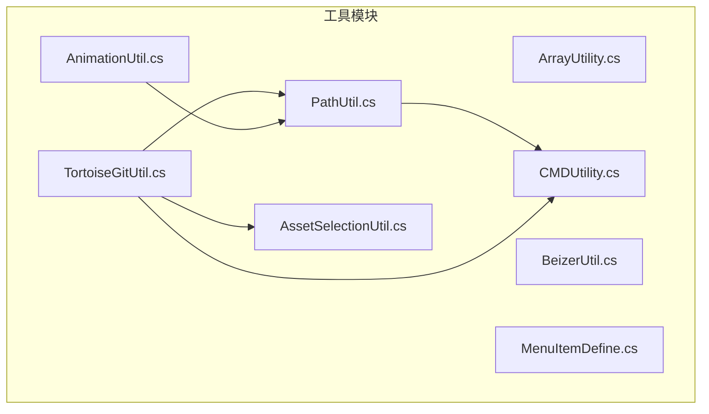
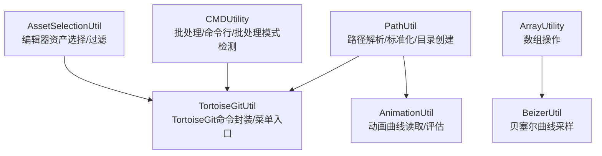
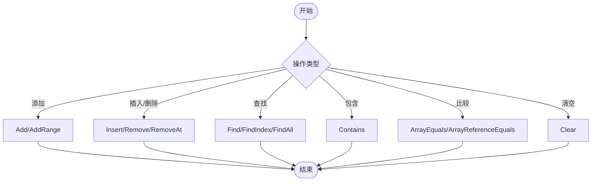
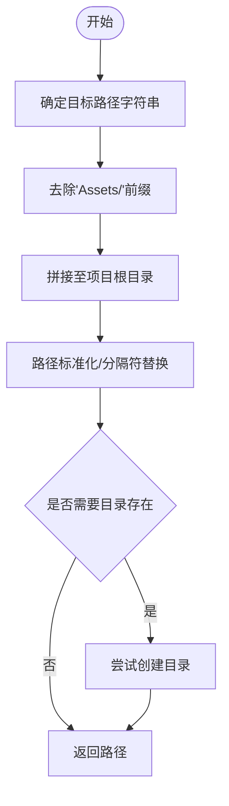
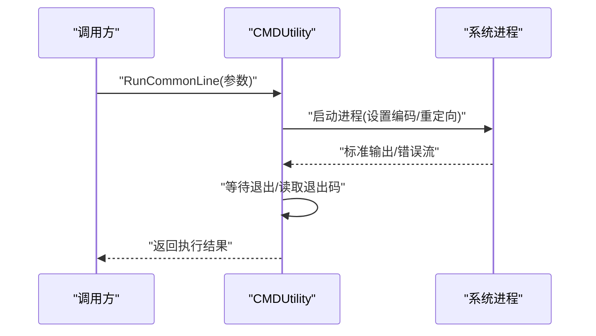
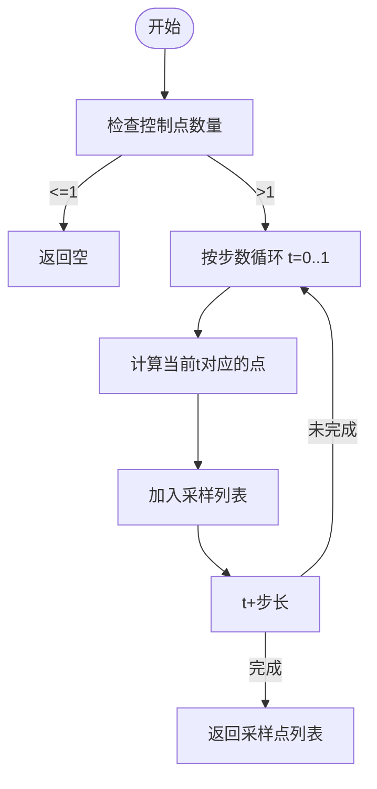
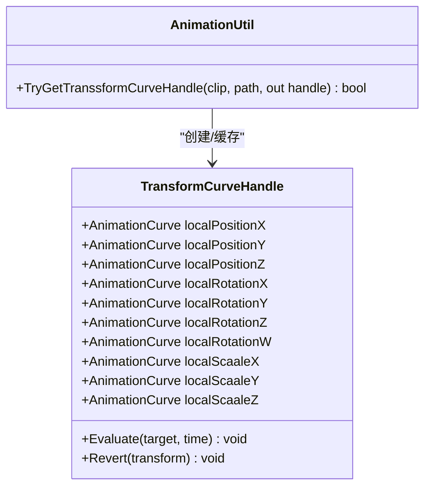
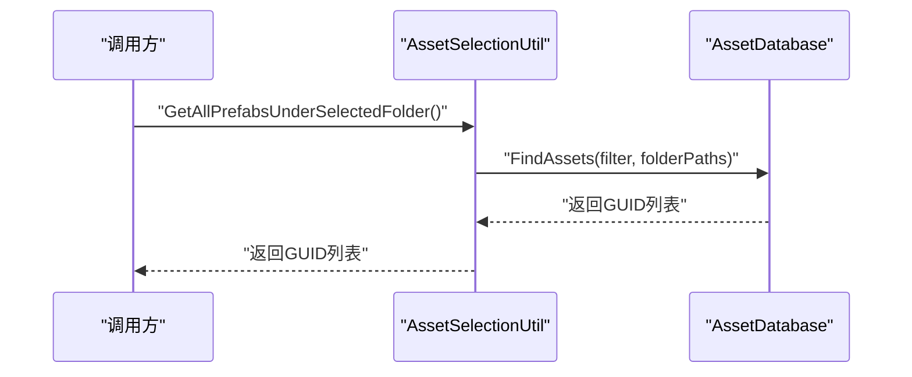
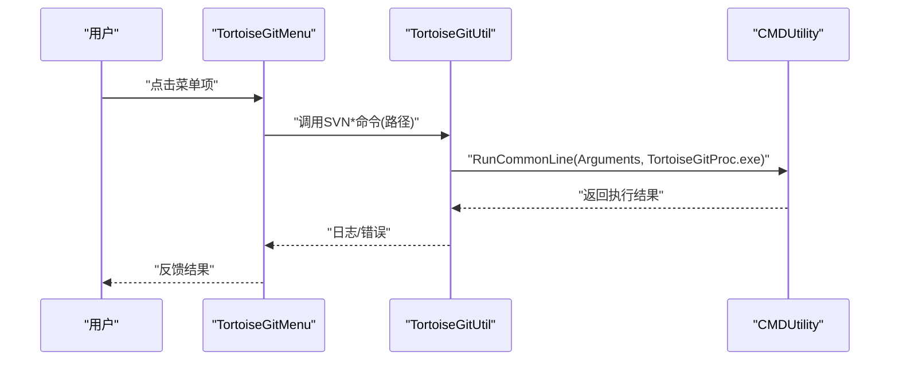
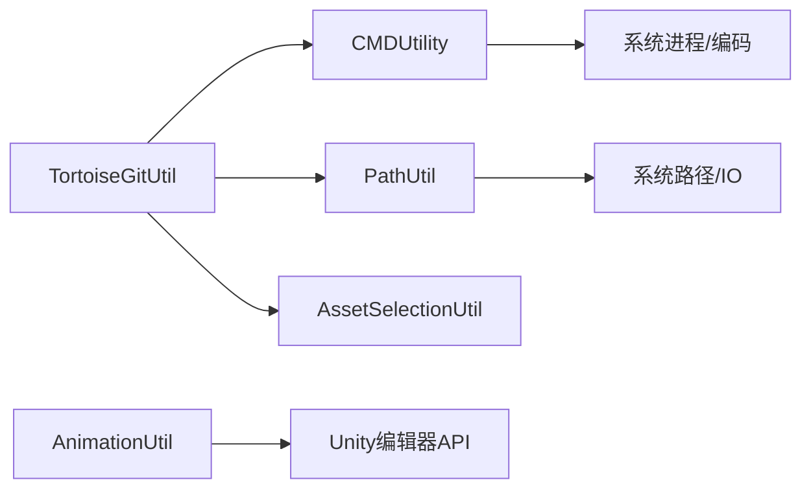

# 开发实用工具

<cite>
**本文引用的文件**
- [ArrayUtility.cs](file://Assets/Scripts/Utility/ArrayUtility.cs)
- [PathUtil.cs](file://Assets/Scripts/Utility/PathUtil.cs)
- [CMDUtility.cs](file://Assets/Scripts/Utility/CMDUtility.cs)
- [BeizerUtil.cs](file://Assets/Scripts/Utility/BeizerUtil.cs)
- [AssetSelectionUtil.cs](file://Assets/Scripts/Utility/AssetSelectionUtil.cs)
- [TortoiseGitUtil.cs](file://Assets/Scripts/Utility/TortoiseGitUtil.cs)
- [AnimationUtil.cs](file://Assets/Scripts/Utility/AnimationUtil.cs)
- [MenuItemDefine.cs](file://Assets/Scripts/Utility/MenuItemDefine.cs)
</cite>

## 目录
1. [简介](#简介)
2. [项目结构](#项目结构)
3. [核心组件](#核心组件)
4. [架构总览](#架构总览)
5. [详细组件分析](#详细组件分析)
6. [依赖关系分析](#依赖关系分析)
7. [性能考量](#性能考量)
8. [故障排查指南](#故障排查指南)
9. [结论](#结论)
10. [附录](#附录)

## 简介
本文件面向ProjectR项目的开发团队，系统性梳理与说明项目中的开发实用工具集，涵盖数组工具、路径与构建辅助、命令行与批处理、贝塞尔曲线采样、动画曲线处理以及版本控制（TortoiseGit）工具。文档从设计理念、API接口、典型使用场景、集成方式、配置选项、性能优化与常见问题等方面进行说明，帮助开发者在日常开发中高效使用这些工具，提升开发效率与质量。

## 项目结构
开发实用工具集中于 Assets/Scripts/Utility 目录下，按功能域划分如下：
- 数组与集合工具：ArrayUtility
- 路径与目录工具：PathUtil
- 命令行与批处理：CMDUtility
- 贝塞尔曲线采样：BeizerUtil
- 动画曲线处理：AnimationUtil
- 资源选择与批量操作：AssetSelectionUtil
- 版本控制（TortoiseGit）：TortoiseGitUtil
- 菜单项定义占位：MenuItemDefine

图表来源
- [PathUtil.cs:19-87](file://Assets/Scripts/Utility/PathUtil.cs#L19-L87)
- [CMDUtility.cs:6-150](file://Assets/Scripts/Utility/CMDUtility.cs#L6-L150)
- [TortoiseGitUtil.cs:8-127](file://Assets/Scripts/Utility/TortoiseGitUtil.cs#L8-L127)
- [AssetSelectionUtil.cs:9-128](file://Assets/Scripts/Utility/AssetSelectionUtil.cs#L9-L128)
- [AnimationUtil.cs:8-113](file://Assets/Scripts/Utility/AnimationUtil.cs#L8-L113)

章节来源
- [ArrayUtility.cs:7-135](file://Assets/Scripts/Utility/ArrayUtility.cs#L7-L135)
- [PathUtil.cs:6-87](file://Assets/Scripts/Utility/PathUtil.cs#L6-L87)
- [CMDUtility.cs:6-150](file://Assets/Scripts/Utility/CMDUtility.cs#L6-L150)
- [BeizerUtil.cs:6-59](file://Assets/Scripts/Utility/BeizerUtil.cs#L6-L59)
- [AssetSelectionUtil.cs:9-128](file://Assets/Scripts/Utility/AssetSelectionUtil.cs#L9-L128)
- [TortoiseGitUtil.cs:8-127](file://Assets/Scripts/Utility/TortoiseGitUtil.cs#L8-L127)
- [AnimationUtil.cs:8-113](file://Assets/Scripts/Utility/AnimationUtil.cs#L8-L113)
- [MenuItemDefine.cs:1-4](file://Assets/Scripts/Utility/MenuItemDefine.cs#L1-L4)

## 核心组件
本节对各工具模块进行概览式介绍，明确其职责边界与适用场景。

- ArrayUtility：提供数组增删改查、比较、清空等常用操作，内部通过List/ArrayList桥接实现，便于在编辑器与运行时安全使用。
- PathUtil：封装路径拼接、规范化、目录创建等能力，统一资源描述文件路径与项目根路径解析，支持跨平台分隔符转换。
- CMDUtility：封装批处理与命令行调用，支持编码设置、输出捕获、退出码判断与批处理模式检测，便于自动化构建与脚本集成。
- BeizerUtil：提供贝塞尔曲线N次递归采样与线性插值计算，内置缓存以降低重复计算开销，适合轨迹生成与平滑过渡。
- AnimationUtil：基于Unity AnimationUtility提取动画剪辑中的Transform曲线，提供Evaluate/Revert等接口，用于根运动或动画驱动的定位/旋转/缩放同步。
- AssetSelectionUtil：在编辑器中基于Unity Selection与AssetDatabase实现资产选择、路径收集与批量查询，支持按类型过滤。
- TortoiseGitUtil：在编辑器中封装TortoiseGit命令调用，提供日志、提交、回滚、拉取、推送等菜单入口，支持.meta文件合并打包。
- MenuItemDefine：菜单项占位定义，便于后续扩展统一注册。

章节来源
- [ArrayUtility.cs:7-135](file://Assets/Scripts/Utility/ArrayUtility.cs#L7-L135)
- [PathUtil.cs:19-87](file://Assets/Scripts/Utility/PathUtil.cs#L19-L87)
- [CMDUtility.cs:6-150](file://Assets/Scripts/Utility/CMDUtility.cs#L6-L150)
- [BeizerUtil.cs:6-59](file://Assets/Scripts/Utility/BeizerUtil.cs#L6-L59)
- [AnimationUtil.cs:8-113](file://Assets/Scripts/Utility/AnimationUtil.cs#L8-L113)
- [AssetSelectionUtil.cs:9-128](file://Assets/Scripts/Utility/AssetSelectionUtil.cs#L9-L128)
- [TortoiseGitUtil.cs:8-127](file://Assets/Scripts/Utility/TortoiseGitUtil.cs#L8-L127)
- [MenuItemDefine.cs:1-4](file://Assets/Scripts/Utility/MenuItemDefine.cs#L1-L4)

## 架构总览
工具模块之间存在清晰的职责边界与协作关系：
- PathUtil为上层工具提供路径解析与标准化能力；
- CMDUtility为构建与外部进程交互提供统一入口；
- TortoiseGitUtil在编辑器环境下组合PathUtil与AssetSelectionUtil，形成“选中资产→路径拼接→TortoiseGit命令”的工作流；
- AnimationUtil在编辑器中使用AnimationUtility读取曲线数据，不直接依赖其他工具；
- ArrayUtility与BeizerUtil为纯数学/集合工具，可独立使用。

图表来源
- [PathUtil.cs:19-87](file://Assets/Scripts/Utility/PathUtil.cs#L19-L87)
- [CMDUtility.cs:6-150](file://Assets/Scripts/Utility/CMDUtility.cs#L6-L150)
- [AssetSelectionUtil.cs:9-128](file://Assets/Scripts/Utility/AssetSelectionUtil.cs#L9-L128)
- [TortoiseGitUtil.cs:8-127](file://Assets/Scripts/Utility/TortoiseGitUtil.cs#L8-L127)
- [AnimationUtil.cs:8-113](file://Assets/Scripts/Utility/AnimationUtil.cs#L8-L113)
- [ArrayUtility.cs:7-135](file://Assets/Scripts/Utility/ArrayUtility.cs#L7-L135)
- [BeizerUtil.cs:6-59](file://Assets/Scripts/Utility/BeizerUtil.cs#L6-L59)

## 详细组件分析

### 数组工具：ArrayUtility
- 设计理念：提供轻量、易用的数组操作API，内部通过List/ArrayList桥接，避免频繁Resize导致的内存抖动；提供值比较与引用比较两种策略。
- 关键API与行为
  - 添加元素/范围：Add/AddRange
  - 插入/删除/移除指定索引：Insert/Remove/RemoveAt
  - 查找：Find/FindIndex/FindAll
  - 包含性：Contains
  - 比较：ArrayEquals/ArrayReferenceEquals
  - 清空：Clear
- 复杂度与性能
  - 插入/删除/查找在最坏情况下为O(n)，由底层List/ArrayList决定；Add/AddRange在扩容时可能触发拷贝。
  - 建议：批量插入使用AddRange，避免多次扩容；频繁删除建议转为链表或使用索引标记回收。
- 使用场景
  - 运行时动态数组维护、配置项列表、事件订阅者管理等。

图表来源
- [ArrayUtility.cs:9-133](file://Assets/Scripts/Utility/ArrayUtility.cs#L9-L133)

章节来源
- [ArrayUtility.cs:7-135](file://Assets/Scripts/Utility/ArrayUtility.cs#L7-L135)

### 路径与构建工具：PathUtil
- 设计理念：统一路径解析与标准化，提供PlayerBuild默认目录常量，简化资源描述文件路径拼接与目录创建。
- 关键API与行为
  - 资源描述文件路径：GetDescFilePath
  - 绝对路径拼接：GetFullPath（自动去除“Assets/”前缀）
  - 路径标准化：RegularPath（统一斜杠）、ReplaceToDirectorySeparatorChar（系统分隔符）
  - 目录创建：CreateDirectoryIfNoExist（带异常捕获）
- 配置与约定
  - PlayerBuild根目录与默认调试目录通过静态字段定义，便于集中管理。
- 使用场景
  - 构建产物输出、资源打包路径、日志文件落盘等。

图表来源
- [PathUtil.cs:25-52](file://Assets/Scripts/Utility/PathUtil.cs#L25-L52)
- [PathUtil.cs:57-68](file://Assets/Scripts/Utility/PathUtil.cs#L57-L68)
- [PathUtil.cs:70-85](file://Assets/Scripts/Utility/PathUtil.cs#L70-L85)

章节来源
- [PathUtil.cs:6-87](file://Assets/Scripts/Utility/PathUtil.cs#L6-L87)

### 命令行与批处理：CMDUtility
- 设计理念：封装ProcessStartInfo，统一编码、输出捕获与异常处理，提供批处理模式检测与命令行参数解析。
- 关键API与行为
  - 执行批处理：RunBatchFile（自动设置编码与重定向）
  - 执行命令行：RunCommonLine（支持自定义可执行文件名）
  - 批处理模式检测：IsBatchMode（识别-batchmode/-executeMethod）
  - 参数解析：ExistArgumentKey/GetArgumentValue
- 性能与健壮性
  - 输出/错误流采用ReadToEnd，适合短时任务；长时任务建议改为异步读取。
  - 编码设置为gb2312，适配Windows控制台输出。
- 使用场景
  - 自动化构建、资源打包、外部工具调用、CI流水线集成。

图表来源
- [CMDUtility.cs:55-99](file://Assets/Scripts/Utility/CMDUtility.cs#L55-L99)

章节来源
- [CMDUtility.cs:6-150](file://Assets/Scripts/Utility/CMDUtility.cs#L6-L150)

### 贝塞尔曲线采样：BeizerUtil
- 设计理念：提供N次贝塞尔曲线的递归采样与线性插值，内置向量缓存以减少临时对象分配。
- 关键API与行为
  - 曲线采样：SampleBeizerCurve（按步数均匀采样）
  - 递归计算：DegNBeizer（降次递归）
  - 线性插值：LinearBeizer
- 性能与复杂度
  - 采样复杂度近似O(n*m)，n为点数，m为步数；递归深度与点数成正比。
  - 通过vec3Cache复用中间结果，降低GC压力。
- 使用场景
  - 轨迹规划、动画平滑、UI动效路径生成。

图表来源
- [BeizerUtil.cs:16-34](file://Assets/Scripts/Utility/BeizerUtil.cs#L16-L34)
- [BeizerUtil.cs:43-57](file://Assets/Scripts/Utility/BeizerUtil.cs#L43-L57)

章节来源
- [BeizerUtil.cs:6-59](file://Assets/Scripts/Utility/BeizerUtil.cs#L6-L59)

### 动画曲线工具：AnimationUtil
- 设计理念：在编辑器中读取AnimationClip的Transform曲线，提供Evaluate/Revert接口，便于根运动或动画驱动的定位/旋转/缩放同步。
- 关键API与行为
  - 获取曲线句柄：TryGetTranssformCurveHandle
  - 句柄类：TransformCurveHandle（本地位置/旋转/缩放曲线）
  - 评估与还原：Evaluate/Revert
- 依赖与限制
  - 仅在编辑器可用（条件编译），依赖Unity AnimationUtility与AnimationClip。
- 使用场景
  - 根运动驱动、动画预览同步、动画数据导出。

图表来源
- [AnimationUtil.cs:12-26](file://Assets/Scripts/Utility/AnimationUtil.cs#L12-L26)
- [AnimationUtil.cs:31-109](file://Assets/Scripts/Utility/AnimationUtil.cs#L31-L109)

章节来源
- [AnimationUtil.cs:8-113](file://Assets/Scripts/Utility/AnimationUtil.cs#L8-L113)

### 资产选择与批量操作：AssetSelectionUtil
- 设计理念：在编辑器中基于Unity Selection与AssetDatabase实现资产选择、路径收集与批量查询，支持按类型过滤。
- 关键API与行为
  - 获取首个文件夹：GetSeletedFirstFolder/GetSeletedFirstFolderObject/GetSeletedFirstFolderPath
  - 获取多个文件夹：GetSeletedFolders/GetSeletedFolderPaths
  - 查询子资产：GetAllAssetsUnderSelectedFolder/GetAllPrefabsUnderSelectedFolder
- 使用场景
  - 批量处理、资源扫描、元数据生成、自动化校验。

图表来源
- [AssetSelectionUtil.cs:112-124](file://Assets/Scripts/Utility/AssetSelectionUtil.cs#L112-L124)

章节来源
- [AssetSelectionUtil.cs:9-128](file://Assets/Scripts/Utility/AssetSelectionUtil.cs#L9-L128)

### 版本控制工具：TortoiseGitUtil
- 设计理念：在编辑器中封装TortoiseGit命令调用，提供日志、提交、回滚、拉取、推送等菜单入口，支持.meta文件合并打包。
- 关键API与行为
  - 常用命令：SVNLog/SVNCommit/SVNRevert/SVNPull/SVNPush
  - 进程调用：RunTortoiseGitProc（委托CMDUtility执行）
  - 资产路径：GetSeletedAssetPaths（支持.meta合并）
  - 菜单项：TortoiseGitMenu（编辑器菜单）
- 依赖与限制
  - 仅在编辑器可用；依赖Unity Editor与TortoiseGitProc.exe。
- 使用场景
  - 快速版本控制、批量操作、可视化流程。

图表来源
- [TortoiseGitUtil.cs:31-39](file://Assets/Scripts/Utility/TortoiseGitUtil.cs#L31-L39)
- [CMDUtility.cs:55-99](file://Assets/Scripts/Utility/CMDUtility.cs#L55-L99)

章节来源
- [TortoiseGitUtil.cs:8-127](file://Assets/Scripts/Utility/TortoiseGitUtil.cs#L8-L127)
- [MenuItemDefine.cs:1-4](file://Assets/Scripts/Utility/MenuItemDefine.cs#L1-L4)

## 依赖关系分析
- 内部依赖
  - TortoiseGitUtil 依赖 CMDUtility（执行命令）、PathUtil（路径拼接）、AssetSelectionUtil（选中资产路径）。
  - AnimationUtil 依赖 Unity 编辑器API（AnimationUtility）。
  - PathUtil 为其他工具提供基础路径能力。
- 外部依赖
  - CMDUtility 依赖系统进程与编码设置。
  - TortoiseGitUtil 依赖 TortoiseGitProc.exe 与Unity编辑器环境。
- 耦合与内聚
  - 工具模块内聚度高、耦合度低，便于独立测试与替换。
  - 建议：新增工具尽量遵循现有命名空间与异常处理风格，保持一致性。

图表来源
- [TortoiseGitUtil.cs:31-39](file://Assets/Scripts/Utility/TortoiseGitUtil.cs#L31-L39)
- [PathUtil.cs:19-52](file://Assets/Scripts/Utility/PathUtil.cs#L19-L52)
- [CMDUtility.cs:13-52](file://Assets/Scripts/Utility/CMDUtility.cs#L13-L52)
- [AnimationUtil.cs:49-72](file://Assets/Scripts/Utility/AnimationUtil.cs#L49-L72)

章节来源
- [TortoiseGitUtil.cs:8-127](file://Assets/Scripts/Utility/TortoiseGitUtil.cs#L8-L127)
- [PathUtil.cs:6-87](file://Assets/Scripts/Utility/PathUtil.cs#L6-L87)
- [CMDUtility.cs:6-150](file://Assets/Scripts/Utility/CMDUtility.cs#L6-L150)
- [AnimationUtil.cs:8-113](file://Assets/Scripts/Utility/AnimationUtil.cs#L8-L113)

## 性能考量
- 数组工具
  - 批量插入优先使用AddRange，避免多次扩容。
  - 频繁删除建议考虑使用索引标记回收或链表结构。
- 路径工具
  - 路径标准化与分隔符替换为O(n)，建议在初始化阶段完成，避免在热路径重复调用。
- 命令行工具
  - 输出/错误流ReadToEnd适合短时任务；长时任务建议改为异步读取，避免阻塞。
  - 批处理模式检测可用于跳过非必要逻辑，提升CI效率。
- 贝塞尔曲线
  - 控制点较多时，采样步数应合理设置；可考虑缓存采样结果以复用。
- 动画曲线
  - Evaluate/Revert在每帧调用时注意避免频繁创建临时对象；可复用TransformCurveHandle实例。
- TortoiseGit
  - 批量操作时合并路径参数，减少进程启动次数。

[本节为通用指导，无需列出具体文件来源]

## 故障排查指南
- CMDUtility执行失败
  - 检查批处理文件路径与权限；确认编码设置与控制台输出。
  - 使用ExistArgumentKey/GetArgumentValue验证命令行参数传递。
- TortoiseGit菜单无响应
  - 确认已选中有效资产；检查TortoiseGitProc.exe是否可用。
  - 在日志中查看警告与错误信息，定位路径拼接问题。
- PathUtil创建目录失败
  - 检查目录是否存在与权限；捕获异常后记录错误日志。
- AnimationUtil曲线为空
  - 确认AnimationClip与路径匹配；检查曲线绑定是否正确。
- ArrayUtility操作异常
  - 注意空引用与越界访问；在关键路径添加防御性检查。

章节来源
- [CMDUtility.cs:47-52](file://Assets/Scripts/Utility/CMDUtility.cs#L47-L52)
- [TortoiseGitUtil.cs:33-39](file://Assets/Scripts/Utility/TortoiseGitUtil.cs#L33-L39)
- [PathUtil.cs:76-85](file://Assets/Scripts/Utility/PathUtil.cs#L76-L85)
- [AnimationUtil.cs:12-26](file://Assets/Scripts/Utility/AnimationUtil.cs#L12-L26)
- [ArrayUtility.cs:79-84](file://Assets/Scripts/Utility/ArrayUtility.cs#L79-L84)

## 结论
ProjectR的开发实用工具体系以“简洁、可复用、易扩展”为目标，覆盖数组操作、路径与构建、命令行与批处理、贝塞尔曲线、动画曲线、资产选择与版本控制等关键领域。通过统一的API设计与一致的异常处理风格，开发者可以快速集成并高效使用这些工具，显著提升开发效率与工程质量。建议在实际项目中结合性能考量与故障排查经验，持续优化工具使用方式与集成流程。

[本节为总结性内容，无需列出具体文件来源]

## 附录
- 配置选项
  - PlayerBuild默认目录：通过PathDefine静态字段集中管理。
  - 批处理模式：通过CMDUtility.IsBatchMode检测。
- 最佳实践
  - 在热路径避免频繁创建临时对象；优先使用缓存与复用。
  - 对外部进程调用进行超时与异常兜底。
  - 在编辑器工具中严格区分编辑器与运行时逻辑，避免误用。

[本节为补充性内容，无需列出具体文件来源]