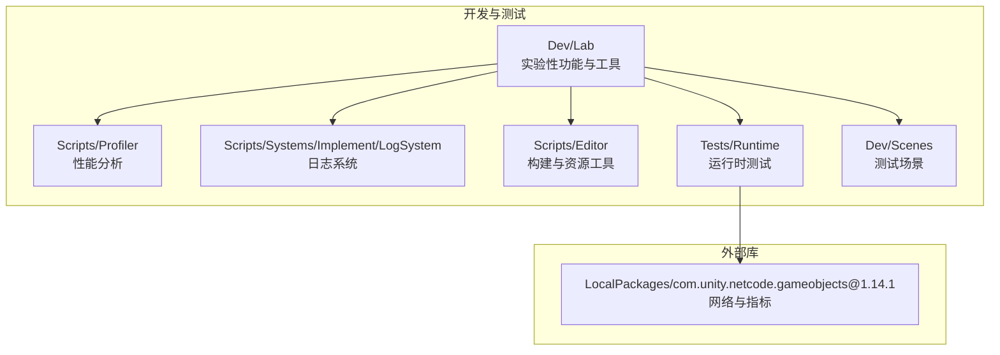
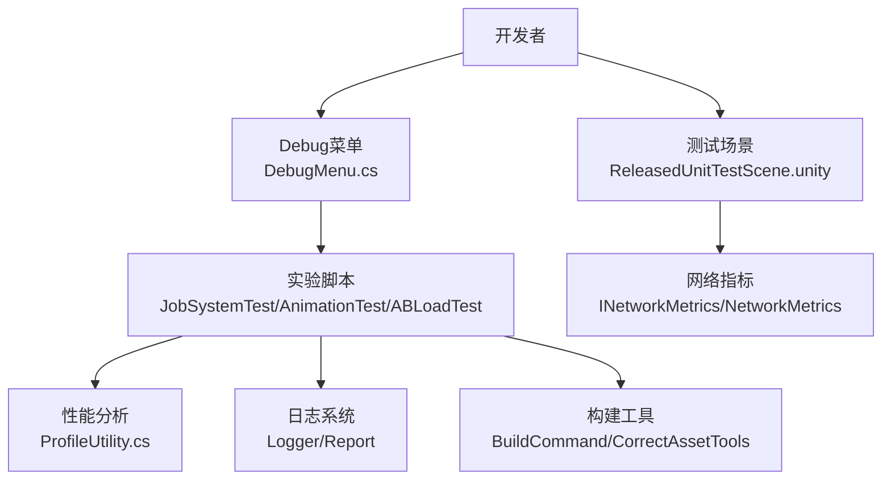
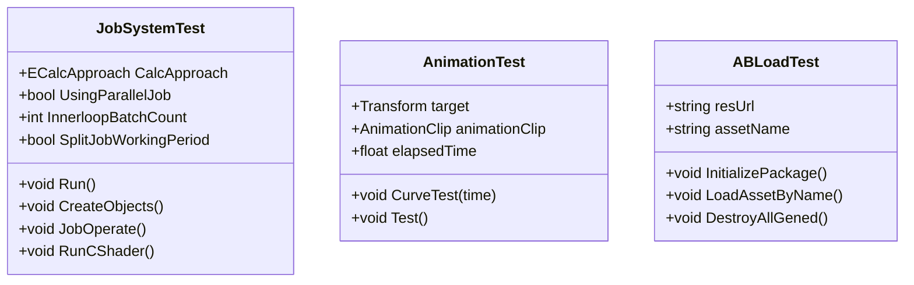
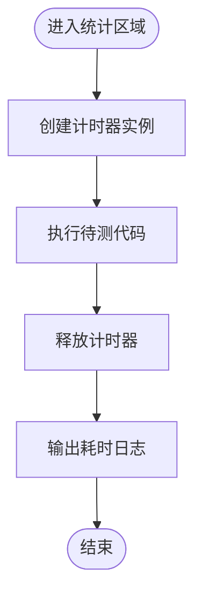
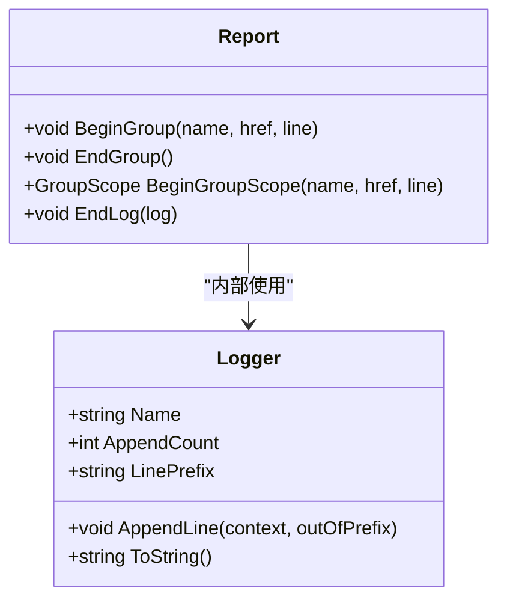
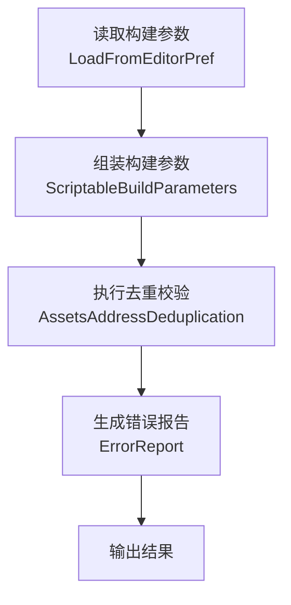
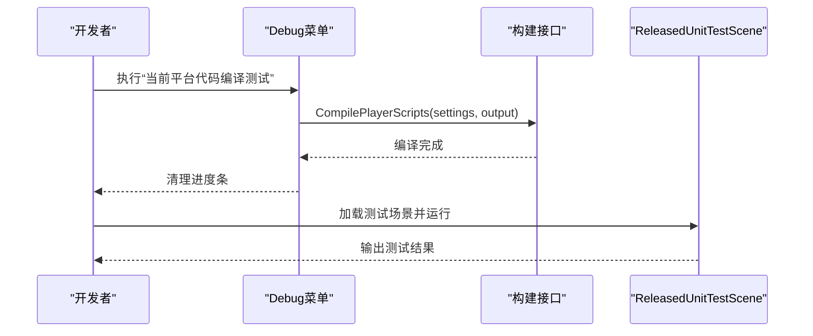
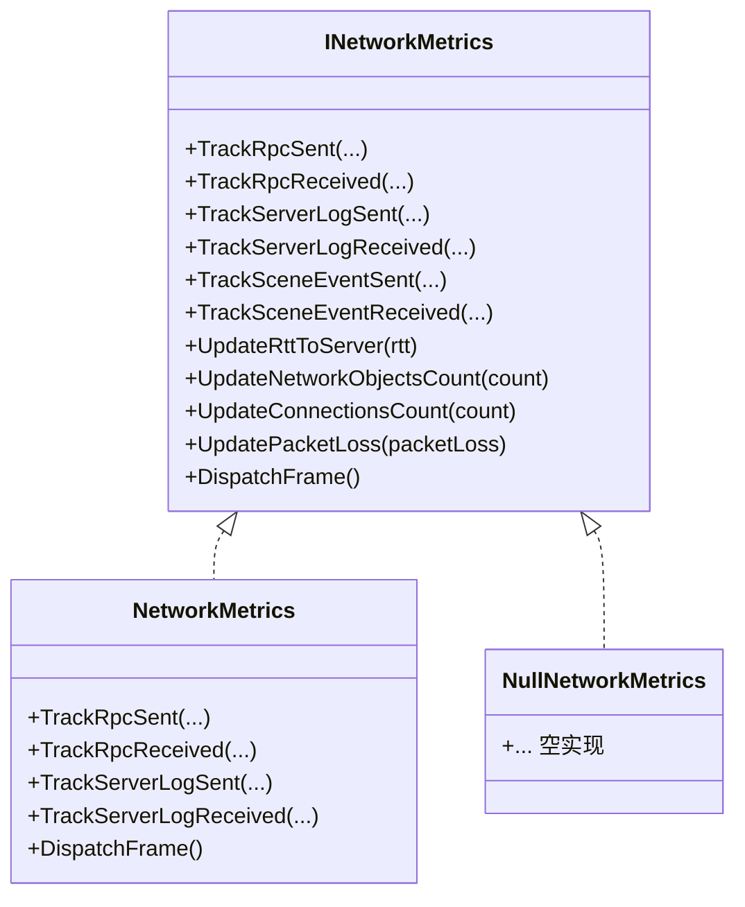
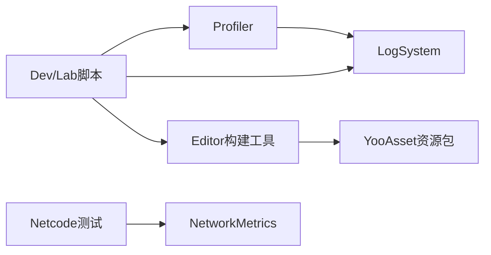

# 开发工具与测试

<cite>
**本文引用的文件**
- [DebugMenu.cs](file://Assets/Scripts/RuntimeEditor/DebugMenu.cs)
- [EditorPrefKey.cs](file://Assets/Scripts/Const/EditorPrefKey.cs)
- [ProfileUtility.cs](file://Assets/Scripts/Profiler/ProfileUtility.cs)
- [Logger.cs](file://Assets/Scripts/Systems/Implement/LogSystem/Logger.cs)
- [Report.cs](file://Assets/Scripts/Systems/Implement/LogSystem/Report.cs)
- [BuildCommand.cs](file://Assets/Scripts/Editor/PlayerBuild/BuildCommand.cs)
- [CorrectAssetTools.cs](file://Assets/Scripts/Editor/AssetBundleBuild/CorrectAssetTools.cs)
- [ReleasedUnitTestScene.unity](file://Assets/Dev/Scenes/ReleasedUnitTestScene.unity)
- [JobSystemTest.cs](file://Assets/Dev/Lab/Scripts/JobSystemTest.cs)
- [AnimationTest.cs](file://Assets/Dev/Lab/Scripts/AnimationTest.cs)
- [ABLoadTest.cs](file://Assets/Dev/Lab/Scripts/ABLoadTest.cs)
- [PJR.Lab.Editor.asmdef](file://Assets/Dev/Lab/PJR.Lab.Editor.asmdef)
- [__info__.json（Dev/Lab）](file://Assets/Dev/Lab/__info__.json)
- [__info__.json（Profiler）](file://Assets/Scripts/Profiler/__info__.json)
- [__info__.json（UnitTest）](file://Assets/Scripts/UnitTest/__info__.json)
- [INetworkMetrics.cs](file://LocalPackages/com.unity.netcode.gameobjects@1.14.1/Runtime/Metrics/INetworkMetrics.cs)
- [NetworkMetrics.cs](file://LocalPackages/com.unity.netcode.gameobjects@1.14.1/Runtime/Metrics/NetworkMetrics.cs)
- [NullNetworkMetrics.cs](file://LocalPackages/com.unity.netcode.gameobjects@1.14.1/Runtime/Metrics/NullNetworkMetrics.cs)
- [ServerLogsMetricTests.cs](file://LocalPackages/com.unity.netcode.gameobjects@1.14.1/Tests/Runtime/Metrics/ServerLogsMetricTests.cs)
- [UniversalRpcTests.cs](file://LocalPackages/com.unity.netcode.gameobjects@1.14.1/Tests/Runtime/UniversalRpcTests.cs)
- [command-line-helper.md](file://LocalPackages/com.unity.netcode.gameobjects@1.14.1/Documentation~/tutorials/command-line-helper.md)
</cite>

## 目录
1. [简介](#简介)
2. [项目结构](#项目结构)
3. [核心组件](#核心组件)
4. [架构总览](#架构总览)
5. [详细组件分析](#详细组件分析)
6. [依赖关系分析](#依赖关系分析)
7. [性能考量](#性能考量)
8. [故障排查指南](#故障排查指南)
9. [结论](#结论)
10. [附录](#附录)

## 简介
本文件面向ProjectR项目的开发者，系统化梳理并说明项目提供的开发辅助工具、实验性功能与测试场景，覆盖以下方面：
- 实验室工具（Lab）的使用方法与典型场景
- 性能分析工具与日志系统
- 错误跟踪与指标采集（含网络指标）
- 自动化测试、单元测试与集成测试实践
- 资源打包与构建命令行工具
- 开发流程、代码规范与质量保证建议

目标是帮助开发者快速上手开发与测试环境，高效定位问题，稳定推进迭代。

## 项目结构
ProjectR在Assets下划分了大量开发与测试相关目录，其中Dev/Lab用于存放实验性功能与工具；Scripts/Profiler与Scripts/Systems/Implement/LogSystem提供性能与日志能力；Tests/Runtime中包含Netcode的运行时测试示例；Editor目录下提供构建与资源校验工具；Scenes中包含专用的单元测试场景。

图示来源
- [PJR.Lab.Editor.asmdef:1-48](file://Assets/Dev/Lab/PJR.Lab.Editor.asmdef#L1-L48)
- [__info__.json（Dev/Lab）:1-3](file://Assets/Dev/Lab/__info__.json#L1-L3)
- [__info__.json（Profiler）:1-3](file://Assets/Scripts/Profiler/__info__.json#L1-L3)
- [__info__.json（UnitTest）:1-3](file://Assets/Scripts/UnitTest/__info__.json#L1-L3)

章节来源
- [PJR.Lab.Editor.asmdef:1-48](file://Assets/Dev/Lab/PJR.Lab.Editor.asmdef#L1-L48)
- [__info__.json（Dev/Lab）:1-3](file://Assets/Dev/Lab/__info__.json#L1-L3)
- [__info__.json（Profiler）:1-3](file://Assets/Scripts/Profiler/__info__.json#L1-L3)
- [__info__.json（UnitTest）:1-3](file://Assets/Scripts/UnitTest/__info__.json#L1-L3)

## 核心组件
- 实验室工具集（Dev/Lab）：提供Job系统、动画曲线、资源加载等实验脚本，便于在编辑器中快速验证性能与行为。
- 性能分析工具（Profiler）：提供轻量计时器，用于统计代码段耗时。
- 日志系统（LogSystem）：提供可分组、可链接的日志记录与输出能力。
- 构建与资源工具（Editor）：提供资源包构建参数、复制策略、去重校验等工具。
- 测试场景（Dev/Scenes/ReleasedUnitTestScene.unity）：提供独立的单元测试入口场景。
- 网络指标（Netcode Metrics）：提供RPC、场景事件、日志、RTT、丢包等指标采集接口与实现。

章节来源
- [ProfileUtility.cs:1-28](file://Assets/Scripts/Profiler/ProfileUtility.cs#L1-L28)
- [Logger.cs:1-51](file://Assets/Scripts/Systems/Implement/LogSystem/Logger.cs#L1-L51)
- [Report.cs:49-84](file://Assets/Scripts/Systems/Implement/LogSystem/Report.cs#L49-L84)
- [BuildCommand.cs:544-585](file://Assets/Scripts/Editor/PlayerBuild/BuildCommand.cs#L544-L585)
- [CorrectAssetTools.cs:1-51](file://Assets/Scripts/Editor/AssetBundleBuild/CorrectAssetTools.cs#L1-L51)
- [ReleasedUnitTestScene.unity:1-170](file://Assets/Dev/Scenes/ReleasedUnitTestScene.unity#L1-L170)
- [INetworkMetrics.cs:65-100](file://LocalPackages/com.unity.netcode.gameobjects@1.14.1/Runtime/Metrics/INetworkMetrics.cs#L65-L100)
- [NetworkMetrics.cs:357-398](file://LocalPackages/com.unity.netcode.gameobjects@1.14.1/Runtime/Metrics/NetworkMetrics.cs#L357-L398)
- [NullNetworkMetrics.cs:84-131](file://LocalPackages/com.unity.netcode.gameobjects@1.14.1/Runtime/Metrics/NullNetworkMetrics.cs#L84-L131)

## 架构总览
下图展示了开发工具与测试在项目中的交互关系：开发者通过Debug菜单触发编译与运行；实验脚本在编辑器中进行性能与行为验证；日志与性能工具贯穿开发与测试；资源构建工具负责打包与校验；Netcode指标用于网络层可观测性。

图示来源
- [DebugMenu.cs:115-139](file://Assets/Scripts/RuntimeEditor/DebugMenu.cs#L115-L139)
- [JobSystemTest.cs:1-395](file://Assets/Dev/Lab/Scripts/JobSystemTest.cs#L1-L395)
- [AnimationTest.cs:1-90](file://Assets/Dev/Lab/Scripts/AnimationTest.cs#L1-L90)
- [ABLoadTest.cs:1-157](file://Assets/Dev/Lab/Scripts/ABLoadTest.cs#L1-L157)
- [ProfileUtility.cs:1-28](file://Assets/Scripts/Profiler/ProfileUtility.cs#L1-L28)
- [Logger.cs:1-51](file://Assets/Scripts/Systems/Implement/LogSystem/Logger.cs#L1-L51)
- [Report.cs:49-84](file://Assets/Scripts/Systems/Implement/LogSystem/Report.cs#L49-L84)
- [BuildCommand.cs:544-585](file://Assets/Scripts/Editor/PlayerBuild/BuildCommand.cs#L544-L585)
- [CorrectAssetTools.cs:1-51](file://Assets/Scripts/Editor/AssetBundleBuild/CorrectAssetTools.cs#L1-L51)
- [ReleasedUnitTestScene.unity:1-170](file://Assets/Dev/Scenes/ReleasedUnitTestScene.unity#L1-L170)
- [INetworkMetrics.cs:65-100](file://LocalPackages/com.unity.netcode.gameobjects@1.14.1/Runtime/Metrics/INetworkMetrics.cs#L65-L100)

## 详细组件分析

### 实验室工具（Dev/Lab）
- 组件职责
  - 提供Job系统、动画曲线、资源加载等实验脚本，支持在编辑器中进行性能与行为验证。
  - 通过按钮与可视化控件驱动实验，便于快速切换不同计算方式（主线程、Job、Compute Shader）与参数。
- 使用要点
  - 在场景中挂载相应脚本，使用编辑器按钮启动/停止实验。
  - 注意资源加载与内存释放，避免测试期间产生泄漏。
- 关键文件
  - JobSystemTest：支持主线程、Job、Compute Shader三种计算方式，可选并行Job与分阶段执行。
  - AnimationTest：基于动画曲线评估目标变换。
  - ABLoadTest：演示远程资源包初始化与按名加载。

图示来源
- [JobSystemTest.cs:1-395](file://Assets/Dev/Lab/Scripts/JobSystemTest.cs#L1-L395)
- [AnimationTest.cs:1-90](file://Assets/Dev/Lab/Scripts/AnimationTest.cs#L1-L90)
- [ABLoadTest.cs:1-157](file://Assets/Dev/Lab/Scripts/ABLoadTest.cs#L1-L157)

章节来源
- [JobSystemTest.cs:1-395](file://Assets/Dev/Lab/Scripts/JobSystemTest.cs#L1-L395)
- [AnimationTest.cs:1-90](file://Assets/Dev/Lab/Scripts/AnimationTest.cs#L1-L90)
- [ABLoadTest.cs:1-157](file://Assets/Dev/Lab/Scripts/ABLoadTest.cs#L1-L157)

### 性能分析工具（Profiler）
- 组件职责
  - 提供轻量计时器，以“开始-结束”对的方式统计某段逻辑耗时，并输出到Unity控制台。
- 使用建议
  - 将耗时统计包裹在using作用域或显式Dispose，确保日志输出时机明确。
  - 对热点路径进行分段统计，结合日志系统输出进行聚合分析。

图示来源
- [ProfileUtility.cs:1-28](file://Assets/Scripts/Profiler/ProfileUtility.cs#L1-L28)

章节来源
- [ProfileUtility.cs:1-28](file://Assets/Scripts/Profiler/ProfileUtility.cs#L1-L28)

### 日志系统（LogSystem）
- 组件职责
  - Logger：可追加文本、带前缀、统计追加次数。
  - Report：支持分组日志、超链接标记、自动前缀生成，便于输出结构化报告。
- 使用建议
  - 在复杂流程中使用BeginGroup/EndGroup组织日志，配合超链接快速定位。
  - 避免在热路径频繁分配字符串，必要时复用StringBuilder。

图示来源
- [Logger.cs:1-51](file://Assets/Scripts/Systems/Implement/LogSystem/Logger.cs#L1-L51)
- [Report.cs:49-84](file://Assets/Scripts/Systems/Implement/LogSystem/Report.cs#L49-L84)

章节来源
- [Logger.cs:1-51](file://Assets/Scripts/Systems/Implement/LogSystem/Logger.cs#L1-L51)
- [Report.cs:49-84](file://Assets/Scripts/Systems/Implement/LogSystem/Report.cs#L49-L84)

### 构建与资源工具（Editor）
- 组件职责
  - BuildCommand：定义资源包构建参数与命令行参数键值，支持增量构建、文件名风格、内置文件拷贝策略、压缩选项与多路径复制。
  - CorrectAssetTools：对资源包收集配置进行去重校验与参数组装，输出错误报告。
- 使用建议
  - 在命令行或CI中统一使用参数键值，确保构建一致性。
  - 对资源包进行去重校验，避免重复打包与冗余资源。

图示来源
- [BuildCommand.cs:544-585](file://Assets/Scripts/Editor/PlayerBuild/BuildCommand.cs#L544-L585)
- [CorrectAssetTools.cs:1-51](file://Assets/Scripts/Editor/AssetBundleBuild/CorrectAssetTools.cs#L1-L51)

章节来源
- [BuildCommand.cs:544-585](file://Assets/Scripts/Editor/PlayerBuild/BuildCommand.cs#L544-L585)
- [CorrectAssetTools.cs:1-51](file://Assets/Scripts/Editor/AssetBundleBuild/CorrectAssetTools.cs#L1-L51)

### 测试场景与调试入口
- 组件职责
  - ReleasedUnitTestScene：提供单元测试入口对象，便于在场景中直接运行测试。
  - DebugMenu：提供“当前平台代码编译测试”等菜单项，支持一键触发编译与临时输出目录清理。
- 使用建议
  - 在需要验证平台编译与脚本完整性时，使用Debug菜单项进行快速验证。
  - 单元测试场景中仅放置最小必要对象，避免干扰测试。

图示来源
- [DebugMenu.cs:115-139](file://Assets/Scripts/RuntimeEditor/DebugMenu.cs#L115-L139)
- [ReleasedUnitTestScene.unity:130-170](file://Assets/Dev/Scenes/ReleasedUnitTestScene.unity#L130-L170)

章节来源
- [DebugMenu.cs:115-139](file://Assets/Scripts/RuntimeEditor/DebugMenu.cs#L115-L139)
- [ReleasedUnitTestScene.unity:1-170](file://Assets/Dev/Scenes/ReleasedUnitTestScene.unity#L1-L170)

### 网络指标与测试（Netcode）
- 组件职责
  - INetworkMetrics：定义RPC、场景事件、日志、RTT、连接数、丢包等指标采集接口。
  - NetworkMetrics：具体实现，记录发送/接收事件与度量值。
  - NullNetworkMetrics：空实现，便于在不需要指标时替换。
  - ServerLogsMetricTests/UniversalRpcTests：运行时测试样例，验证指标上报与断言。
- 使用建议
  - 在开发阶段启用NetworkMetrics，生产环境可切换为空实现以降低开销。
  - 结合命令行工具查看日志输出，定位网络异常。

图示来源
- [INetworkMetrics.cs:65-100](file://LocalPackages/com.unity.netcode.gameobjects@1.14.1/Runtime/Metrics/INetworkMetrics.cs#L65-L100)
- [NetworkMetrics.cs:357-398](file://LocalPackages/com.unity.netcode.gameobjects@1.14.1/Runtime/Metrics/NetworkMetrics.cs#L357-L398)
- [NullNetworkMetrics.cs:84-131](file://LocalPackages/com.unity.netcode.gameobjects@1.14.1/Runtime/Metrics/NullNetworkMetrics.cs#L84-L131)

章节来源
- [INetworkMetrics.cs:65-100](file://LocalPackages/com.unity.netcode.gameobjects@1.14.1/Runtime/Metrics/INetworkMetrics.cs#L65-L100)
- [NetworkMetrics.cs:357-398](file://LocalPackages/com.unity.netcode.gameobjects@1.14.1/Runtime/Metrics/NetworkMetrics.cs#L357-L398)
- [NullNetworkMetrics.cs:84-131](file://LocalPackages/com.unity.netcode.gameobjects@1.14.1/Runtime/Metrics/NullNetworkMetrics.cs#L84-L131)
- [ServerLogsMetricTests.cs:67-95](file://LocalPackages/com.unity.netcode.gameobjects@1.14.1/Tests/Runtime/Metrics/ServerLogsMetricTests.cs#L67-L95)
- [UniversalRpcTests.cs:1025-1063](file://LocalPackages/com.unity.netcode.gameobjects@1.14.1/Tests/Runtime/UniversalRpcTests.cs#L1025-L1063)

## 依赖关系分析
- 实验脚本依赖Unity编辑器API与第三方库（如Odin Inspector），用于可视化与性能验证。
- 日志系统与性能工具解耦，可在不引入其他模块的情况下独立使用。
- 构建工具与资源包系统（YooAsset）配合，形成从参数到产物的完整链路。
- Netcode指标与测试相互独立，既可作为开发期观测手段，也可在CI中进行断言。

图示来源
- [JobSystemTest.cs:1-395](file://Assets/Dev/Lab/Scripts/JobSystemTest.cs#L1-L395)
- [ProfileUtility.cs:1-28](file://Assets/Scripts/Profiler/ProfileUtility.cs#L1-L28)
- [Logger.cs:1-51](file://Assets/Scripts/Systems/Implement/LogSystem/Logger.cs#L1-L51)
- [BuildCommand.cs:544-585](file://Assets/Scripts/Editor/PlayerBuild/BuildCommand.cs#L544-L585)
- [CorrectAssetTools.cs:1-51](file://Assets/Scripts/Editor/AssetBundleBuild/CorrectAssetTools.cs#L1-L51)
- [INetworkMetrics.cs:65-100](file://LocalPackages/com.unity.netcode.gameobjects@1.14.1/Runtime/Metrics/INetworkMetrics.cs#L65-L100)

章节来源
- [JobSystemTest.cs:1-395](file://Assets/Dev/Lab/Scripts/JobSystemTest.cs#L1-L395)
- [ProfileUtility.cs:1-28](file://Assets/Scripts/Profiler/ProfileUtility.cs#L1-L28)
- [Logger.cs:1-51](file://Assets/Scripts/Systems/Implement/LogSystem/Logger.cs#L1-L51)
- [BuildCommand.cs:544-585](file://Assets/Scripts/Editor/PlayerBuild/BuildCommand.cs#L544-L585)
- [CorrectAssetTools.cs:1-51](file://Assets/Scripts/Editor/AssetBundleBuild/CorrectAssetTools.cs#L1-L51)
- [INetworkMetrics.cs:65-100](file://LocalPackages/com.unity.netcode.gameobjects@1.14.1/Runtime/Metrics/INetworkMetrics.cs#L65-L100)

## 性能考量
- 计时与采样
  - 使用Profiler工具对关键路径进行分段计时，避免在高频帧中频繁创建计时器实例。
- 内存与GC
  - 实验脚本中注意原生数组与缓冲区的生命周期，及时释放ComputeBuffer与NativeArray。
- 并行与批处理
  - Job系统支持并行Job与批处理，合理设置InnerloopBatchCount可提升吞吐。
- 资源加载
  - 使用资源包时，避免在热路径重复初始化与加载；利用日志系统记录加载耗时与错误。

## 故障排查指南
- 编译与运行
  - 使用Debug菜单的“当前平台代码编译测试”，检查临时输出目录是否生成，确认编译无错误。
- 日志与报告
  - 使用Report.BeginGroup/EndGroup组织日志，结合超链接快速定位问题。
  - 对异常分支使用Logger.AppendLine记录上下文，便于回溯。
- 网络指标
  - 启用NetworkMetrics后，结合命令行工具查看日志输出，定位RTT、丢包与RPC异常。
- 资源包
  - 使用CorrectAssetTools进行去重校验，避免重复打包导致的资源冲突与体积膨胀。

章节来源
- [DebugMenu.cs:115-139](file://Assets/Scripts/RuntimeEditor/DebugMenu.cs#L115-L139)
- [Report.cs:49-84](file://Assets/Scripts/Systems/Implement/LogSystem/Report.cs#L49-L84)
- [Logger.cs:1-51](file://Assets/Scripts/Systems/Implement/LogSystem/Logger.cs#L1-L51)
- [command-line-helper.md:120-172](file://LocalPackages/com.unity.netcode.gameobjects@1.14.1/Documentation~/tutorials/command-line-helper.md#L120-L172)

## 结论
ProjectR提供了完善的开发工具与测试环境：实验脚本用于快速验证性能与行为；Profiler与LogSystem支撑可观测性；Editor工具保障构建一致性；Netcode指标与测试样例提升网络层质量。建议在日常开发中结合这些工具形成“验证—观测—修复”的闭环，持续提升开发效率与工程质量。

## 附录
- 开发流程建议
  - 新功能先在Dev/Lab中以脚本形式验证可行性与性能影响。
  - 使用Profiler定位瓶颈，使用LogSystem输出结构化报告。
  - 通过ReleasedUnitTestScene运行单元测试，必要时启用Netcode指标进行网络回归。
- 代码规范与质量保证
  - 控制台日志优先使用Logger/Report，避免散落的Debug输出。
  - 资源包构建参数通过命令行参数统一管理，避免手工修改。
  - 对关键路径进行定时采样，形成性能基线，纳入版本对比。