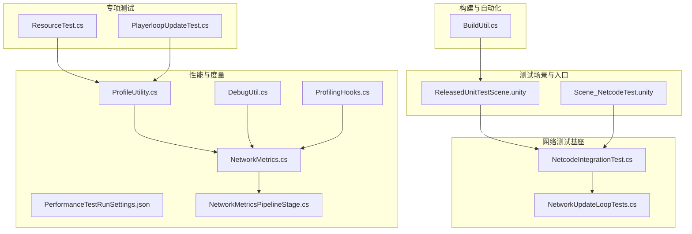
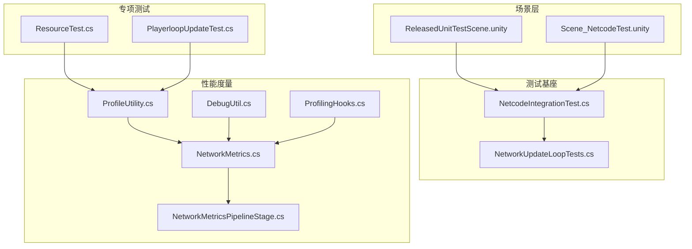
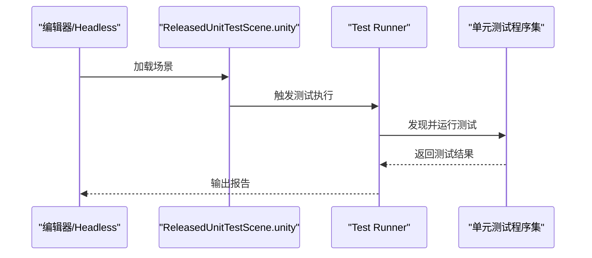
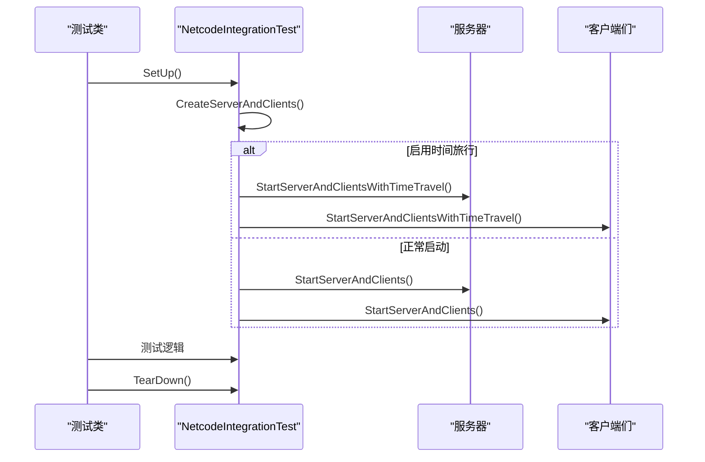
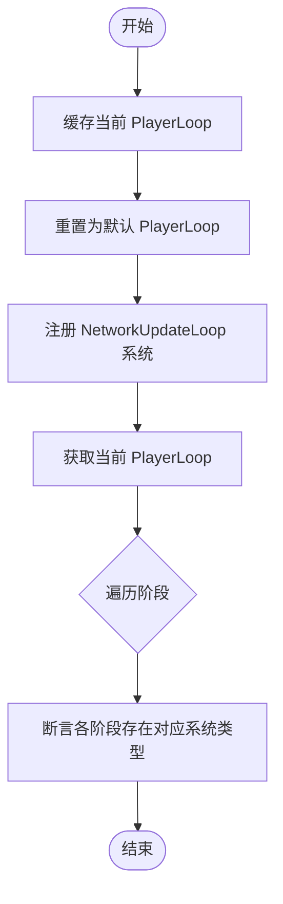
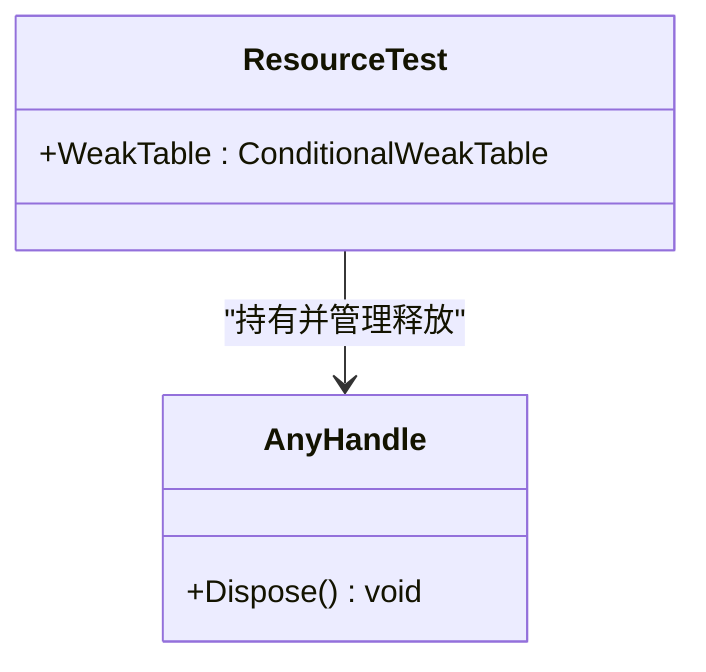
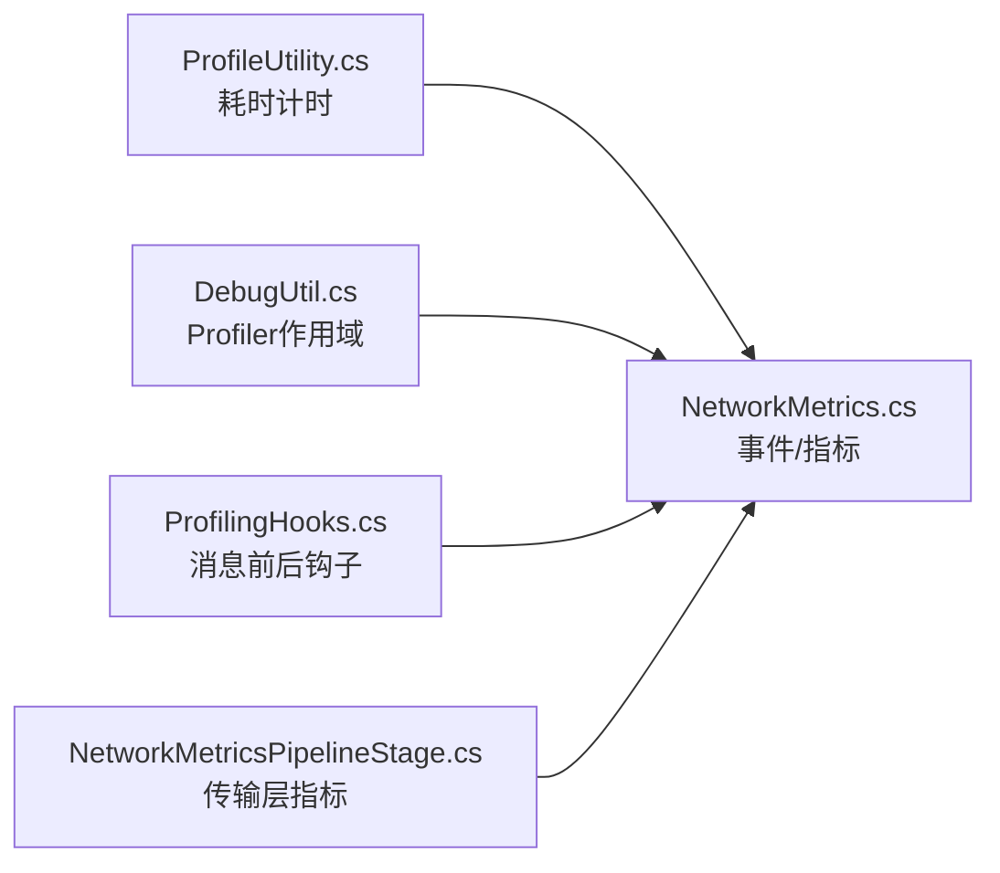
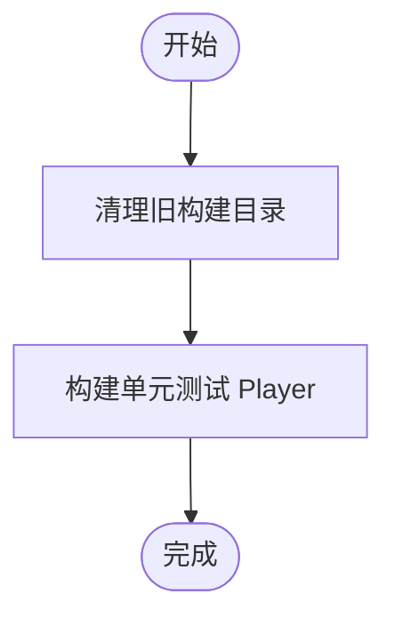
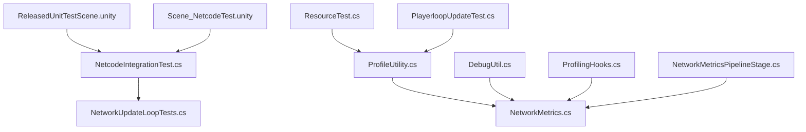

# 测试框架

<cite>
**本文引用的文件**
- [ResourceTest.cs](file://Assets/Dev/Lab/ResourceTest/ResourceTest.cs)
- [PlayerloopUpdateTest.cs](file://Assets/Dev/Lab/PlayerloopUpdate/PlayerloopUpdateTest.cs)
- [NetcodeIntegrationTest.cs](file://LocalPackages/com.unity.netcode.gameobjects@1.14.1/TestHelpers/Runtime/NetcodeIntegrationTest.cs)
- [NetworkUpdateLoopTests.cs](file://LocalPackages/com.unity.netcode.gameobjects@1.14.1/Tests/Runtime/NetworkUpdateLoopTests.cs)
- [ProfileUtility.cs](file://Assets/Scripts/Profiler/ProfileUtility.cs)
- [DebugUtil.cs](file://Assets/Scripts/RuntimeEditor/DebugUtil.cs)
- [PerformanceTestRunSettings.json](file://Assets/Resources/PerformanceTestRunSettings.json)
- [BuildUtil.cs](file://Assets/Scripts/Utility/BuildUtil.cs)
- [ReleasedUnitTestScene.unity](file://Assets/Dev/Scenes/ReleasedUnitTestScene.unity)
- [Scene_NetcodeTest.unity](file://Assets/Dev/Lab/NetcodeTest/Scene_NetcodeTest.unity)
- [NetworkMetrics.cs](file://LocalPackages/com.unity.netcode.gameobjects@1.14.1/Runtime/Metrics/NetworkMetrics.cs)
- [NetworkMetricsPipelineStage.cs](file://LocalPackages/com.unity.netcode.gameobjects@1.14.1/Runtime/Transports/UTP/NetworkMetricsPipelineStage.cs)
- [ProfilingHooks.cs](file://LocalPackages/com.unity.netcode.gameobjects@1.14.1/Runtime/Profiling/ProfilingHooks.cs)
- [UniversalRpcTests.cs](file://LocalPackages/com.unity.netcode.gameobjects@1.14.1/Tests/Runtime/UniversalRpcTests.cs)
- [MetricsDispatchTests.cs](file://LocalPackages/com.unity.netcode.gameobjects@1.14.1/Tests/Runtime/Metrics/MetricsDispatchTests.cs)
- [__info__.json（单元测试）](file://Assets/Scripts/UnitTest/__info__.json)
- [__info__.json（性能分析）](file://Assets/Scripts/Profiler/__info__.json)
</cite>

## 目录
1. [引言](#引言)
2. [项目结构](#项目结构)
3. [核心组件](#核心组件)
4. [架构总览](#架构总览)
5. [详细组件分析](#详细组件分析)
6. [依赖关系分析](#依赖关系分析)
7. [性能考量](#性能考量)
8. [故障排查指南](#故障排查指南)
9. [结论](#结论)
10. [附录](#附录)

## 引言
本文件系统化梳理 ProjectR 项目的测试框架与实践，覆盖单元测试、集成测试、性能测试与专项测试工具，并给出配置、用例编写规范、执行流程、覆盖率与基准测试建议、自动化与持续集成思路以及测试报告生成指引。目标是帮助开发者建立完善的测试策略与质量保证体系。

## 项目结构
测试相关能力主要分布在以下区域：
- 单元测试与场景入口：Assets/Dev/Scenes/ReleasedUnitTestScene.unity、Assets/Scripts/UnitTest
- 网络集成测试与辅助基类：LocalPackages/com.unity.netcode.gameobjects@1.14.1/TestHelpers/Runtime/NetcodeIntegrationTest.cs
- 网络更新循环与运行时测试：LocalPackages/com.unity.netcode.gameobjects@1.14.1/Tests/Runtime/NetworkUpdateLoopTests.cs
- 资源与生命周期专项测试：Assets/Dev/Lab/ResourceTest、Assets/Dev/Lab/PlayerloopUpdate
- 性能分析与度量：Assets/Scripts/Profiler、Assets/Scripts/RuntimeEditor/DebugUtil、Assets/Resources/PerformanceTestRunSettings.json
- 构建与自动化：Assets/Scripts/Utility/BuildUtil.cs
- 场景与示例：Assets/Dev/Lab/NetcodeTest/Scene_NetcodeTest.unity



**图表来源**
- [ReleasedUnitTestScene.unity:1-170](file://Assets/Dev/Scenes/ReleasedUnitTestScene.unity#L1-L170)
- [Scene_NetcodeTest.unity:1-552](file://Assets/Dev/Lab/NetcodeTest/Scene_NetcodeTest.unity#L1-L552)
- [NetcodeIntegrationTest.cs:204-237](file://LocalPackages/com.unity.netcode.gameobjects@1.14.1/TestHelpers/Runtime/NetcodeIntegrationTest.cs#L204-L237)
- [NetworkUpdateLoopTests.cs:1-134](file://LocalPackages/com.unity.netcode.gameobjects@1.14.1/Tests/Runtime/NetworkUpdateLoopTests.cs#L1-L134)
- [ResourceTest.cs:1-20](file://Assets/Dev/Lab/ResourceTest/ResourceTest.cs#L1-L20)
- [PlayerloopUpdateTest.cs:1-225](file://Assets/Dev/Lab/PlayerloopUpdate/PlayerloopUpdateTest.cs#L1-L225)
- [ProfileUtility.cs:1-28](file://Assets/Scripts/Profiler/ProfileUtility.cs#L1-L28)
- [DebugUtil.cs:1-34](file://Assets/Scripts/RuntimeEditor/DebugUtil.cs#L1-L34)
- [PerformanceTestRunSettings.json:1-1](file://Assets/Resources/PerformanceTestRunSettings.json#L1-L1)
- [NetworkMetrics.cs:52-104](file://LocalPackages/com.unity.netcode.gameobjects@1.14.1/Runtime/Metrics/NetworkMetrics.cs#L52-L104)
- [NetworkMetricsPipelineStage.cs:25-56](file://LocalPackages/com.unity.netcode.gameobjects@1.14.1/Runtime/Transports/UTP/NetworkMetricsPipelineStage.cs#L25-L56)
- [ProfilingHooks.cs:30-66](file://LocalPackages/com.unity.netcode.gameobjects@1.14.1/Runtime/Profiling/ProfilingHooks.cs#L30-L66)
- [BuildUtil.cs:438-468](file://Assets/Scripts/Utility/BuildUtil.cs#L438-L468)

**章节来源**
- [ReleasedUnitTestScene.unity:1-170](file://Assets/Dev/Scenes/ReleasedUnitTestScene.unity#L1-L170)
- [Scene_NetcodeTest.unity:1-552](file://Assets/Dev/Lab/NetcodeTest/Scene_NetcodeTest.unity#L1-L552)
- [NetcodeIntegrationTest.cs:204-237](file://LocalPackages/com.unity.netcode.gameobjects@1.14.1/TestHelpers/Runtime/NetcodeIntegrationTest.cs#L204-L237)
- [NetworkUpdateLoopTests.cs:1-134](file://LocalPackages/com.unity.netcode.gameobjects@1.14.1/Tests/Runtime/NetworkUpdateLoopTests.cs#L1-L134)
- [ResourceTest.cs:1-20](file://Assets/Dev/Lab/ResourceTest/ResourceTest.cs#L1-L20)
- [PlayerloopUpdateTest.cs:1-225](file://Assets/Dev/Lab/PlayerloopUpdate/PlayerloopUpdateTest.cs#L1-L225)
- [ProfileUtility.cs:1-28](file://Assets/Scripts/Profiler/ProfileUtility.cs#L1-L28)
- [DebugUtil.cs:1-34](file://Assets/Scripts/RuntimeEditor/DebugUtil.cs#L1-L34)
- [PerformanceTestRunSettings.json:1-1](file://Assets/Resources/PerformanceTestRunSettings.json#L1-L1)
- [NetworkMetrics.cs:52-104](file://LocalPackages/com.unity.netcode.gameobjects@1.14.1/Runtime/Metrics/NetworkMetrics.cs#L52-L104)
- [NetworkMetricsPipelineStage.cs:25-56](file://LocalPackages/com.unity.netcode.gameobjects@1.14.1/Runtime/Transports/UTP/NetworkMetricsPipelineStage.cs#L25-L56)
- [ProfilingHooks.cs:30-66](file://LocalPackages/com.unity.netcode.gameobjects@1.14.1/Runtime/Profiling/ProfilingHooks.cs#L30-L66)
- [BuildUtil.cs:438-468](file://Assets/Scripts/Utility/BuildUtil.cs#L438-L468)

## 核心组件
- 单元测试场景与入口：通过 ReleasedUnitTestScene.unity 启动，便于在编辑器或运行时执行单元测试。
- 网络集成测试基类：NetcodeIntegrationTest 提供服务器/客户端生命周期、时间旅行、帧率控制等集成测试能力。
- 网络更新循环测试：验证 NetworkUpdateLoop 在 PlayerLoop 中的注入与阶段调用顺序。
- 资源与生命周期专项测试：ResourceTest 展示弱表与资源释放；PlayerloopUpdateTest 验证 PlayerLoop 阶段与自定义代理注册。
- 性能分析与度量：ProfileUtility 提供耗时计时；DebugUtil 提供 Profiler 样本与内存成本作用域；NetworkMetrics/NetworkMetricsPipelineStage/ProfilingHooks 提供网络消息与传输指标采集。
- 构建与自动化：BuildUtil 提供单元测试 Player 的清理与重建工具链。

**章节来源**
- [ReleasedUnitTestScene.unity:126-170](file://Assets/Dev/Scenes/ReleasedUnitTestScene.unity#L126-L170)
- [NetcodeIntegrationTest.cs:204-237](file://LocalPackages/com.unity.netcode.gameobjects@1.14.1/TestHelpers/Runtime/NetcodeIntegrationTest.cs#L204-L237)
- [NetworkUpdateLoopTests.cs:14-134](file://LocalPackages/com.unity.netcode.gameobjects@1.14.1/Tests/Runtime/NetworkUpdateLoopTests.cs#L14-L134)
- [ResourceTest.cs:7-20](file://Assets/Dev/Lab/ResourceTest/ResourceTest.cs#L7-L20)
- [PlayerloopUpdateTest.cs:21-107](file://Assets/Dev/Lab/PlayerloopUpdate/PlayerloopUpdateTest.cs#L21-L107)
- [ProfileUtility.cs:6-28](file://Assets/Scripts/Profiler/ProfileUtility.cs#L6-L28)
- [DebugUtil.cs:5-34](file://Assets/Scripts/RuntimeEditor/DebugUtil.cs#L5-L34)
- [NetworkMetrics.cs:52-104](file://LocalPackages/com.unity.netcode.gameobjects@1.14.1/Runtime/Metrics/NetworkMetrics.cs#L52-L104)
- [NetworkMetricsPipelineStage.cs:33-56](file://LocalPackages/com.unity.netcode.gameobjects@1.14.1/Runtime/Transports/UTP/NetworkMetricsPipelineStage.cs#L33-L56)
- [ProfilingHooks.cs:40-66](file://LocalPackages/com.unity.netcode.gameobjects@1.14.1/Runtime/Profiling/ProfilingHooks.cs#L40-L66)
- [BuildUtil.cs:438-468](file://Assets/Scripts/Utility/BuildUtil.cs#L438-L468)

## 架构总览
下图展示测试框架在项目中的角色与交互路径，包括场景驱动、网络基座、专项测试与性能度量。



**图表来源**
- [ReleasedUnitTestScene.unity:126-170](file://Assets/Dev/Scenes/ReleasedUnitTestScene.unity#L126-L170)
- [Scene_NetcodeTest.unity:539-552](file://Assets/Dev/Lab/NetcodeTest/Scene_NetcodeTest.unity#L539-L552)
- [NetcodeIntegrationTest.cs:204-237](file://LocalPackages/com.unity.netcode.gameobjects@1.14.1/TestHelpers/Runtime/NetcodeIntegrationTest.cs#L204-L237)
- [NetworkUpdateLoopTests.cs:14-134](file://LocalPackages/com.unity.netcode.gameobjects@1.14.1/Tests/Runtime/NetworkUpdateLoopTests.cs#L14-L134)
- [ResourceTest.cs:7-20](file://Assets/Dev/Lab/ResourceTest/ResourceTest.cs#L7-L20)
- [PlayerloopUpdateTest.cs:58-107](file://Assets/Dev/Lab/PlayerloopUpdate/PlayerloopUpdateTest.cs#L58-L107)
- [ProfileUtility.cs:6-28](file://Assets/Scripts/Profiler/ProfileUtility.cs#L6-L28)
- [DebugUtil.cs:5-34](file://Assets/Scripts/RuntimeEditor/DebugUtil.cs#L5-L34)
- [NetworkMetrics.cs:52-104](file://LocalPackages/com.unity.netcode.gameobjects@1.14.1/Runtime/Metrics/NetworkMetrics.cs#L52-L104)
- [NetworkMetricsPipelineStage.cs:33-56](file://LocalPackages/com.unity.netcode.gameobjects@1.14.1/Runtime/Transports/UTP/NetworkMetricsPipelineStage.cs#L33-L56)
- [ProfilingHooks.cs:40-66](file://LocalPackages/com.unity.netcode.gameobjects@1.14.1/Runtime/Profiling/ProfilingHooks.cs#L40-L66)

## 详细组件分析

### 单元测试场景与执行流程
- 入口场景：ReleasedUnitTestScene.unity 提供一个空场景，挂载 UnitTestEntry，用于启动编辑器或运行时的单元测试。
- 执行方式：可在编辑器中播放并触发测试；也可通过命令行/CI 运行 Unity Headless 执行测试集。
- 建议：将所有单元测试置于独立程序集，避免与运行时代码耦合；使用 [Unity Test Runner](https://docs.unity3d.com/Packages/com.unity.test-framework@1.1/manual/index.html) 管理用例与结果。



**图表来源**
- [ReleasedUnitTestScene.unity:126-170](file://Assets/Dev/Scenes/ReleasedUnitTestScene.unity#L126-L170)

**章节来源**
- [ReleasedUnitTestScene.unity:126-170](file://Assets/Dev/Scenes/ReleasedUnitTestScene.unity#L126-L170)
- [__info__.json（单元测试）:1-3](file://Assets/Scripts/UnitTest/__info__.json#L1-L3)

### 网络集成测试基座（NetcodeIntegrationTest）
- 能力概览：支持服务器/客户端启动、可选时间旅行、帧率控制、连接超时旁路、玩家预制体创建钩子等。
- 使用要点：在 SetUp 中创建服务器与客户端；如需旁路连接等待，可设置相应标志；通过 OnCreatePlayerPrefab/OnPlayerPrefabGameObjectCreated 钩子定制玩家对象。



**图表来源**
- [NetcodeIntegrationTest.cs:440-481](file://LocalPackages/com.unity.netcode.gameobjects@1.14.1/TestHelpers/Runtime/NetcodeIntegrationTest.cs#L440-L481)

**章节来源**
- [NetcodeIntegrationTest.cs:204-237](file://LocalPackages/com.unity.netcode.gameobjects@1.14.1/TestHelpers/Runtime/NetcodeIntegrationTest.cs#L204-L237)
- [NetcodeIntegrationTest.cs:440-481](file://LocalPackages/com.unity.netcode.gameobjects@1.14.1/TestHelpers/Runtime/NetcodeIntegrationTest.cs#L440-L481)

### 网络更新循环测试（NetworkUpdateLoopTests）
- 目标：验证 NetworkUpdateLoop 在 PlayerLoop 各阶段的注入与调用顺序是否符合预期。
- 方法：缓存当前 PlayerLoop，重置为默认循环，注册系统后断言各阶段存在对应系统类型。



**图表来源**
- [NetworkUpdateLoopTests.cs:14-134](file://LocalPackages/com.unity.netcode.gameobjects@1.14.1/Tests/Runtime/NetworkUpdateLoopTests.cs#L14-L134)

**章节来源**
- [NetworkUpdateLoopTests.cs:14-134](file://LocalPackages/com.unity.netcode.gameobjects@1.14.1/Tests/Runtime/NetworkUpdateLoopTests.cs#L14-L134)

### 资源与生命周期专项测试（ResourceTest）
- 目的：演示弱表与资源释放模式，确保对象销毁时正确释放托管/非托管资源。
- 建议：在测试中模拟对象创建/销毁路径，验证 Dispose 行为与日志输出。



**图表来源**
- [ResourceTest.cs:7-20](file://Assets/Dev/Lab/ResourceTest/ResourceTest.cs#L7-L20)

**章节来源**
- [ResourceTest.cs:7-20](file://Assets/Dev/Lab/ResourceTest/ResourceTest.cs#L7-L20)

### 玩家循环更新专项测试（PlayerloopUpdateTest）
- 目的：验证 PlayerLoop 各阶段（Initialization、EarlyUpdate、FixedUpdate、PreUpdate、Update、PreLateUpdate、PostLateUpdate）的注入与回调顺序。
- 方法：通过树形结构注册默认代理节点，打印当前 PlayerLoop 结构，断言阶段顺序。

```mermaid
sequenceDiagram
participant User as "用户操作"
participant Test as "PlayerloopUpdateTest"
participant Tree as "PlayerLoopTree"
participant Loop as "PlayerLoop"
User->>Test : DoTest()
Test->>Tree : AddNode(DefaultAgents.*)
Tree->>Loop : SetPlayerLoop()
User->>Test : Log()
Test->>Loop : GetCurrentPlayerLoop()
Test-->>User : 输出阶段列表
```

**图表来源**
- [PlayerloopUpdateTest.cs:21-107](file://Assets/Dev/Lab/PlayerloopUpdate/PlayerloopUpdateTest.cs#L21-L107)

**章节来源**
- [PlayerloopUpdateTest.cs:21-107](file://Assets/Dev/Lab/PlayerloopUpdate/PlayerloopUpdateTest.cs#L21-L107)

### 性能分析与度量
- ProfileUtility：提供基于时间戳的耗时计时器，适合粗粒度性能观测。
- DebugUtil：提供 Profiler.BeginSample/EndSample 作用域与内存成本作用域，便于局部性能剖析。
- NetworkMetrics/NetworkMetricsPipelineStage/ProfilingHooks：提供网络消息发送/接收、批次发送、打包/解包等指标与埋点钩子，适合网络层性能分析。



**图表来源**
- [ProfileUtility.cs:6-28](file://Assets/Scripts/Profiler/ProfileUtility.cs#L6-L28)
- [DebugUtil.cs:5-34](file://Assets/Scripts/RuntimeEditor/DebugUtil.cs#L5-L34)
- [NetworkMetrics.cs:52-104](file://LocalPackages/com.unity.netcode.gameobjects@1.14.1/Runtime/Metrics/NetworkMetrics.cs#L52-L104)
- [NetworkMetricsPipelineStage.cs:33-56](file://LocalPackages/com.unity.netcode.gameobjects@1.14.1/Runtime/Transports/UTP/NetworkMetricsPipelineStage.cs#L33-L56)
- [ProfilingHooks.cs:40-66](file://LocalPackages/com.unity.netcode.gameobjects@1.14.1/Runtime/Profiling/ProfilingHooks.cs#L40-L66)

**章节来源**
- [ProfileUtility.cs:6-28](file://Assets/Scripts/Profiler/ProfileUtility.cs#L6-L28)
- [DebugUtil.cs:5-34](file://Assets/Scripts/RuntimeEditor/DebugUtil.cs#L5-L34)
- [NetworkMetrics.cs:52-104](file://LocalPackages/com.unity.netcode.gameobjects@1.14.1/Runtime/Metrics/NetworkMetrics.cs#L52-L104)
- [NetworkMetricsPipelineStage.cs:33-56](file://LocalPackages/com.unity.netcode.gameobjects@1.14.1/Runtime/Transports/UTP/NetworkMetricsPipelineStage.cs#L33-L56)
- [ProfilingHooks.cs:40-66](file://LocalPackages/com.unity.netcode.gameobjects@1.14.1/Runtime/Profiling/ProfilingHooks.cs#L40-L66)

### 构建与自动化（BuildUtil）
- 功能：清理/重建单元测试 Player，更新 DLL，支持按名称清理构建目录。
- 用途：在 CI 或本地快速准备测试运行环境，减少手工操作。



**图表来源**
- [BuildUtil.cs:438-468](file://Assets/Scripts/Utility/BuildUtil.cs#L438-L468)

**章节来源**
- [BuildUtil.cs:438-468](file://Assets/Scripts/Utility/BuildUtil.cs#L438-L468)

## 依赖关系分析
- 测试场景依赖测试基座（NetcodeIntegrationTest）以获得统一的网络生命周期。
- 专项测试（ResourceTest、PlayerloopUpdateTest）依赖性能分析工具进行观测。
- 网络度量贯穿传输层与消息层，形成端到端的可观测性闭环。



**图表来源**
- [ReleasedUnitTestScene.unity:126-170](file://Assets/Dev/Scenes/ReleasedUnitTestScene.unity#L126-L170)
- [Scene_NetcodeTest.unity:539-552](file://Assets/Dev/Lab/NetcodeTest/Scene_NetcodeTest.unity#L539-L552)
- [NetcodeIntegrationTest.cs:204-237](file://LocalPackages/com.unity.netcode.gameobjects@1.14.1/TestHelpers/Runtime/NetcodeIntegrationTest.cs#L204-L237)
- [NetworkUpdateLoopTests.cs:14-134](file://LocalPackages/com.unity.netcode.gameobjects@1.14.1/Tests/Runtime/NetworkUpdateLoopTests.cs#L14-L134)
- [ResourceTest.cs:7-20](file://Assets/Dev/Lab/ResourceTest/ResourceTest.cs#L7-L20)
- [PlayerloopUpdateTest.cs:58-107](file://Assets/Dev/Lab/PlayerloopUpdate/PlayerloopUpdateTest.cs#L58-L107)
- [ProfileUtility.cs:6-28](file://Assets/Scripts/Profiler/ProfileUtility.cs#L6-L28)
- [DebugUtil.cs:5-34](file://Assets/Scripts/RuntimeEditor/DebugUtil.cs#L5-L34)
- [NetworkMetrics.cs:52-104](file://LocalPackages/com.unity.netcode.gameobjects@1.14.1/Runtime/Metrics/NetworkMetrics.cs#L52-L104)
- [NetworkMetricsPipelineStage.cs:33-56](file://LocalPackages/com.unity.netcode.gameobjects@1.14.1/Runtime/Transports/UTP/NetworkMetricsPipelineStage.cs#L33-L56)
- [ProfilingHooks.cs:40-66](file://LocalPackages/com.unity.netcode.gameobjects@1.14.1/Runtime/Profiling/ProfilingHooks.cs#L40-L66)

**章节来源**
- [NetcodeIntegrationTest.cs:204-237](file://LocalPackages/com.unity.netcode.gameobjects@1.14.1/TestHelpers/Runtime/NetcodeIntegrationTest.cs#L204-L237)
- [NetworkUpdateLoopTests.cs:14-134](file://LocalPackages/com.unity.netcode.gameobjects@1.14.1/Tests/Runtime/NetworkUpdateLoopTests.cs#L14-L134)
- [ProfileUtility.cs:6-28](file://Assets/Scripts/Profiler/ProfileUtility.cs#L6-L28)
- [DebugUtil.cs:5-34](file://Assets/Scripts/RuntimeEditor/DebugUtil.cs#L5-L34)
- [NetworkMetrics.cs:52-104](file://LocalPackages/com.unity.netcode.gameobjects@1.14.1/Runtime/Metrics/NetworkMetrics.cs#L52-L104)
- [NetworkMetricsPipelineStage.cs:33-56](file://LocalPackages/com.unity.netcode.gameobjects@1.14.1/Runtime/Transports/UTP/NetworkMetricsPipelineStage.cs#L33-L56)
- [ProfilingHooks.cs:40-66](file://LocalPackages/com.unity.netcode.gameobjects@1.14.1/Runtime/Profiling/ProfilingHooks.cs#L40-L66)

## 性能考量
- 计时与采样：使用 ProfileUtility 进行粗粒度耗时统计；使用 DebugUtil 的 Profiler 作用域进行细粒度采样；结合 NetworkMetrics/ProfilingHooks 获取网络层指标。
- 设置与阈值：PerformanceTestRunSettings.json 控制测量次数等参数，建议在 CI 中固定测量次数以保证稳定性。
- 建议：
  - 将热点路径拆分为可独立测量的片段，避免跨函数边界干扰。
  - 对比基线版本，关注回归指标（帧时、内存峰值、RPC 次数、丢包率）。
  - 在高负载场景下重复多次测量，取中位数或分位数作为报告依据。

**章节来源**
- [ProfileUtility.cs:6-28](file://Assets/Scripts/Profiler/ProfileUtility.cs#L6-L28)
- [DebugUtil.cs:5-34](file://Assets/Scripts/RuntimeEditor/DebugUtil.cs#L5-L34)
- [NetworkMetrics.cs:52-104](file://LocalPackages/com.unity.netcode.gameobjects@1.14.1/Runtime/Metrics/NetworkMetrics.cs#L52-L104)
- [ProfilingHooks.cs:40-66](file://LocalPackages/com.unity.netcode.gameobjects@1.14.1/Runtime/Profiling/ProfilingHooks.cs#L40-L66)
- [PerformanceTestRunSettings.json:1-1](file://Assets/Resources/PerformanceTestRunSettings.json#L1-L1)

## 故障排查指南
- 网络集成测试未连接：检查 NetcodeIntegrationTest 的连接超时与旁路设置；必要时开启详细日志。
- PlayerLoop 注入失败：确认 PlayerLoop 已被替换且阶段顺序正确；使用 PlayerloopUpdateTest 的 Log 功能核对当前循环结构。
- 性能指标缺失：检查 NetworkMetrics 是否启用、PipelineStage 是否接入、ProfilingHooks 是否生效。
- 构建失败或 Player 无法运行：使用 BuildUtil 清理并重建单元测试 Player，确保 DLL 更新成功。

**章节来源**
- [NetcodeIntegrationTest.cs:204-237](file://LocalPackages/com.unity.netcode.gameobjects@1.14.1/TestHelpers/Runtime/NetcodeIntegrationTest.cs#L204-L237)
- [PlayerloopUpdateTest.cs:44-107](file://Assets/Dev/Lab/PlayerloopUpdate/PlayerloopUpdateTest.cs#L44-L107)
- [NetworkMetrics.cs:52-104](file://LocalPackages/com.unity.netcode.gameobjects@1.14.1/Runtime/Metrics/NetworkMetrics.cs#L52-L104)
- [ProfilingHooks.cs:40-66](file://LocalPackages/com.unity.netcode.gameobjects@1.14.1/Runtime/Profiling/ProfilingHooks.cs#L40-L66)
- [BuildUtil.cs:438-468](file://Assets/Scripts/Utility/BuildUtil.cs#L438-L468)

## 结论
ProjectR 的测试框架以场景驱动的单元测试为基础，配合 Netcode 集成测试基座与专项测试工具，形成了从逻辑到网络、从功能到性能的全栈测试能力。通过性能度量与构建自动化，可进一步完善持续集成与回归保障体系。建议在团队内推广统一的测试规范与报告模板，持续优化测试效率与质量。

## 附录
- 测试用例编写规范（建议）
  - 单元测试：小而快，隔离外部依赖；使用 [SetUp]/[TearDown] 管理状态；断言清晰明确。
  - 集成测试：遵循 NetcodeIntegrationTest 的生命周期；合理设置帧率与时间旅行；关注多客户端一致性。
  - 性能测试：固定输入与环境；重复测量取稳定值；记录基线与回归阈值。
- 自动化与持续集成（建议）
  - 使用 Unity Test Runner 的命令行接口执行测试集；结合 BuildUtil 完成 Player 构建与清理。
  - 在 CI 中生成测试报告（如 NUnit XML），并上传覆盖率与性能指标。
- 测试报告生成（建议）
  - 单元测试：导出 NUnit XML 报告；聚合失败用例与堆栈信息。
  - 集成测试：记录连接耗时、帧率、丢包率、RPC 指标。
  - 性能测试：输出平均/中位数/分位数与可视化图表。