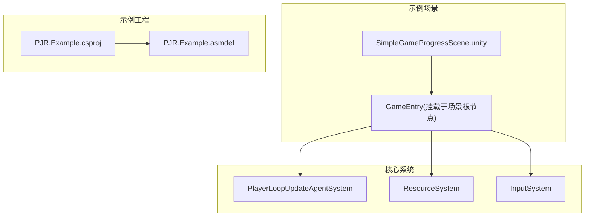
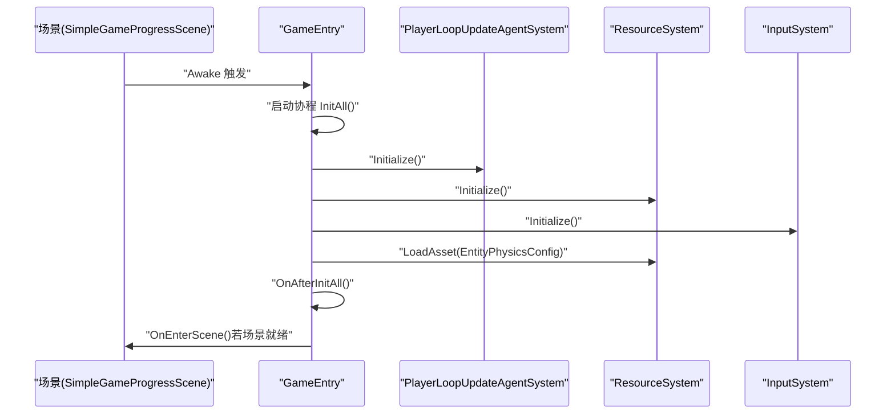
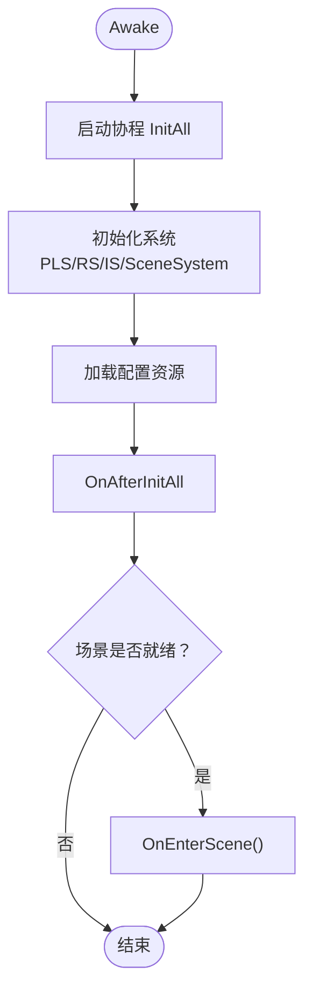
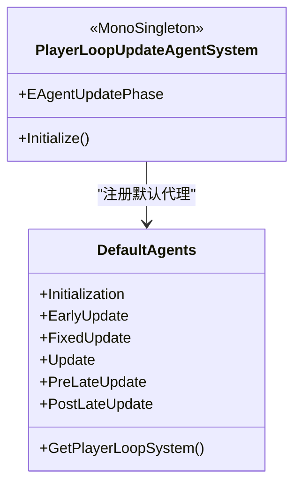
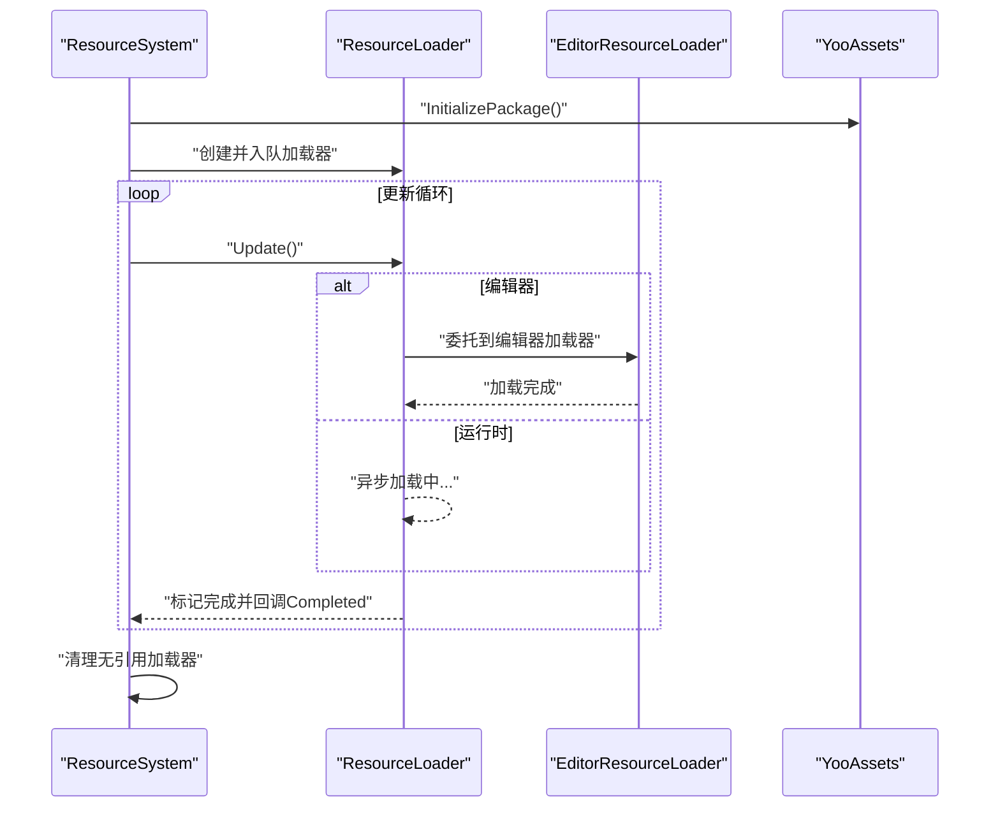
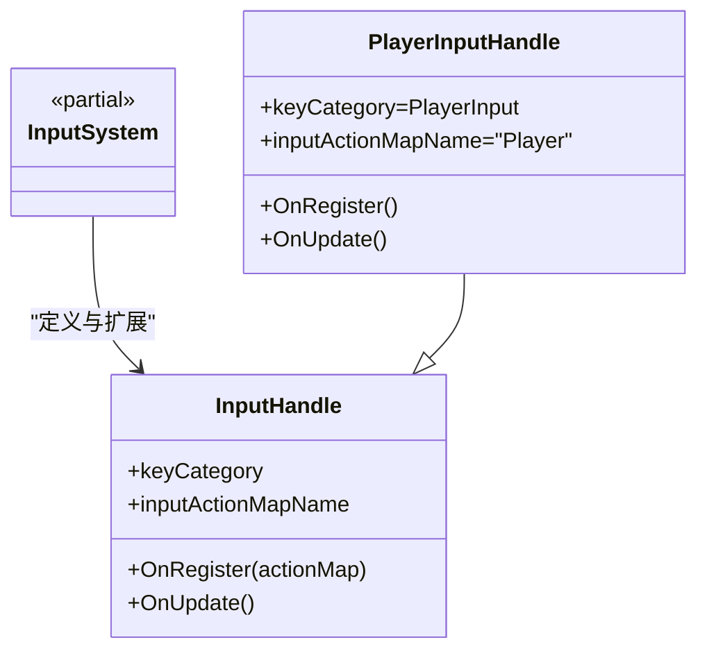
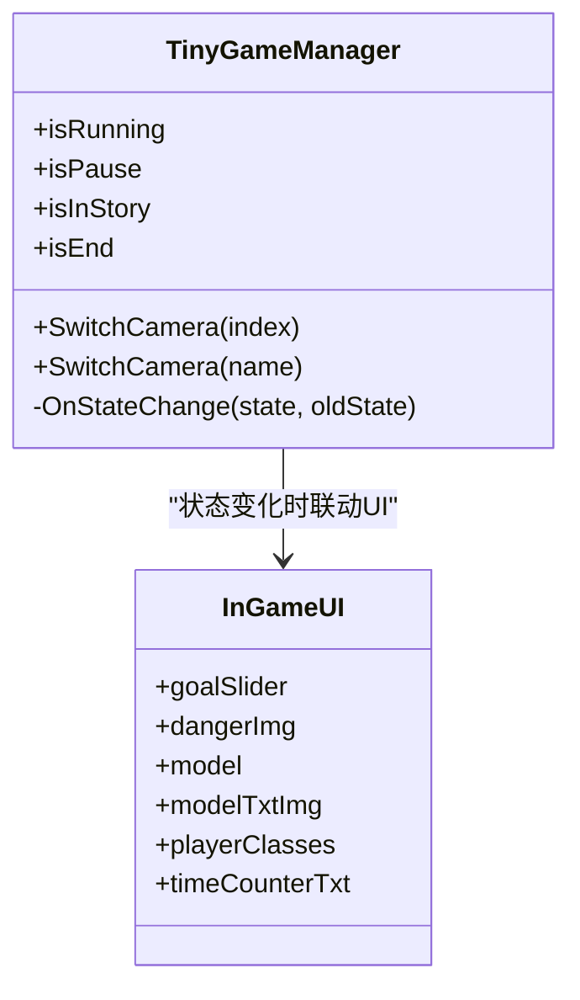
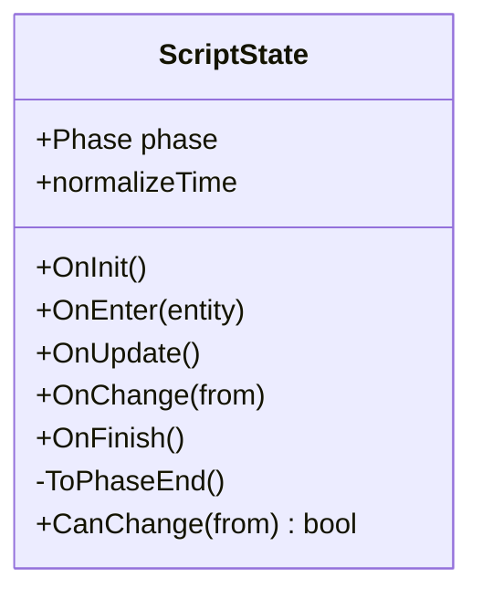
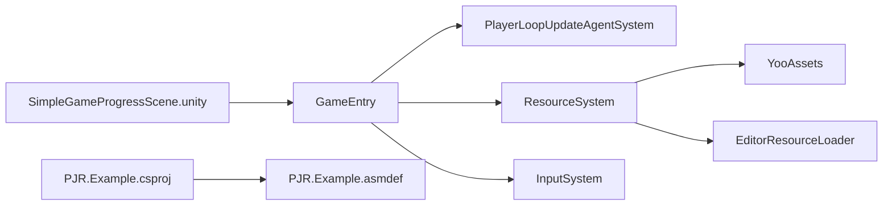

# 示例代码

<cite>
**本文引用的文件**
- [SimpleGameProgressScene.unity](file://Assets/Dev/Example/SimpleGameProgress/SimpleGameProgressScene.unity)
- [GameEntry.cs](file://Assets/Dev/Scripts/Runtime/GameEntry.cs)
- [GameEntry.Editor.cs](file://Assets/Dev/Scripts/Runtime/GameEntry.Editor.cs)
- [PJR.Example.csproj](file://PJR.Example.csproj)
- [PJR.Example.asmdef](file://Assets/Dev/Example/PJR.Example.asmdef)
- [PlayerLoopUpdateAgentSystem.cs](file://Assets/Scripts/Systems/Implement/UpdateAgent/PlayerLoopUpdateAgentSystem.cs)
- [PlayerLoopUpdateAgentSystem.DefaultAgents.cs](file://Assets/Scripts/Systems/Implement/UpdateAgent/PlayerLoopUpdateAgentSystem.DefaultAgents.cs)
- [ResourceSystem.cs](file://Assets/Scripts/Systems/Implement/ResourceSystem/ResourceSystem.cs)
- [ResourceSystem.Update.cs](file://Assets/Scripts/Systems/Implement/ResourceSystem/ResourceSystem.Update.cs)
- [ResourceLoader.cs](file://Assets/Scripts/Systems/Implement/ResourceSystem/ResourceLoader.cs)
- [EditorResourceLoader.cs](file://Assets/Scripts/Systems/Implement/ResourceSystem/EditorResourceLoader.cs)
- [InputSystem.cs](file://Assets/Scripts/Systems/Implement/InputSystem/InputSystem.Define.cs)
- [PlayerInputHandle.cs](file://Assets/Scripts/Systems/Implement/InputSystem/PlayerInputHandle.cs)
- [TinyGameManager.cs](file://Assets/Scripts/Game/Manager/TinyGameManager.cs)
- [InGameUI.cs](file://Assets/Scripts/UI/InGameUI/InGameUI.cs)
- [ScriptState.cs](file://Assets/Scripts/StateMachine/ScriptState/ScriptState.cs)
</cite>

## 目录
1. [简介](#简介)
2. [项目结构](#项目结构)
3. [核心组件](#核心组件)
4. [架构总览](#架构总览)
5. [详细组件分析](#详细组件分析)
6. [依赖关系分析](#依赖关系分析)
7. [性能考虑](#性能考虑)
8. [故障排查指南](#故障排查指南)
9. [结论](#结论)
10. [附录](#附录)

## 简介
本文件围绕 ProjectR 的示例工程“SimpleGameProgress”进行系统化说明，目标是帮助开发者快速理解并复用该示例中的基础框架设计与实现思路。示例通过一个最小化的运行入口（GameEntry）串联起系统初始化流程，并在场景中挂载一个名为“GameEntry”的根对象以驱动后续模块加载与状态切换。示例还展示了输入系统、资源系统以及玩家循环更新系统的协作方式，便于在此基础上扩展为更复杂的玩法。

## 项目结构
示例位于开发资源目录下，主要由以下部分组成：
- 场景文件：SimpleGameProgressScene.unity，其中包含一个名为“GameEntry”的根节点，挂载了运行入口脚本。
- 运行入口：GameEntry.cs，负责按序初始化系统与配置，并在场景就绪后进入场景逻辑。
- 编辑器辅助：GameEntry.Editor.cs，提供编辑器快捷入口，一键生成“GameEntry”节点。
- 示例工程编译配置：PJR.Example.csproj 与 PJR.Example.asmdef，用于声明示例工程的程序集边界与引用。
- 系统实现：PlayerLoopUpdateAgentSystem（玩家循环更新）、ResourceSystem（资源加载）、InputSystem（输入处理）等。

图表来源
- [SimpleGameProgressScene.unity:126-170](file://Assets/Dev/Example/SimpleGameProgress/SimpleGameProgressScene.unity#L126-L170)
- [GameEntry.cs:8-64](file://Assets/Dev/Scripts/Runtime/GameEntry.cs#L8-L64)
- [PJR.Example.csproj:43-46](file://PJR.Example.csproj#L43-L46)
- [PJR.Example.asmdef:1-45](file://Assets/Dev/Example/PJR.Example.asmdef#L1-L45)

章节来源
- [SimpleGameProgressScene.unity:126-170](file://Assets/Dev/Example/SimpleGameProgress/SimpleGameProgressScene.unity#L126-L170)
- [GameEntry.cs:8-64](file://Assets/Dev/Scripts/Runtime/GameEntry.cs#L8-L64)
- [PJR.Example.csproj:43-46](file://PJR.Example.csproj#L43-L46)
- [PJR.Example.asmdef:1-45](file://Assets/Dev/Example/PJR.Example.asmdef#L1-L45)

## 核心组件
- GameEntry：示例的启动入口，负责顺序初始化系统与配置，并在场景就绪后进入场景逻辑。
- PlayerLoopUpdateAgentSystem：将一组“代理任务”注入 Unity PlayerLoop 的不同阶段，形成稳定的更新调度。
- ResourceSystem：封装资源加载管线，支持编辑器与运行时两种加载路径，并提供异步加载与生命周期管理。
- InputSystem：基于 Unity InputSystem 的输入处理抽象，提供可扩展的输入映射与处理接口。
- TinyGameManager 与 InGameUI：演示游戏中状态机与 UI 绑定的基本用法，便于在示例基础上扩展玩法。

章节来源
- [GameEntry.cs:8-64](file://Assets/Dev/Scripts/Runtime/GameEntry.cs#L8-L64)
- [PlayerLoopUpdateAgentSystem.cs:1-42](file://Assets/Scripts/Systems/Implement/UpdateAgent/PlayerLoopUpdateAgentSystem.cs#L1-L42)
- [ResourceSystem.cs:1-248](file://Assets/Scripts/Systems/Implement/ResourceSystem/ResourceSystem.cs#L1-L248)
- [InputSystem.cs:1-14](file://Assets/Scripts/Systems/Implement/InputSystem/InputSystem.Define.cs#L1-L14)
- [TinyGameManager.cs:223-335](file://Assets/Scripts/Game/Manager/TinyGameManager.cs#L223-L335)
- [InGameUI.cs:1-17](file://Assets/Scripts/UI/InGameUI/InGameUI.cs#L1-L17)

## 架构总览
示例采用“场景驱动 + 入口初始化”的轻量架构：
- 场景中放置一个“GameEntry”根节点，挂载 GameEntry 脚本。
- GameEntry 在 Awake 中启动协程，依次初始化 PlayerLoopUpdateAgentSystem、ResourceSystem、InputSystem、SceneSystem。
- 初始化完成后，尝试加载实体物理配置资源并进入场景逻辑。
- 玩家循环更新系统将多个代理任务注入 Unity PlayerLoop 的固定阶段，确保稳定更新。
- 资源系统通过异步加载器完成资源加载与回调，支持编辑器与运行时环境。
- 输入系统提供输入映射与处理接口，便于扩展角色控制或菜单交互。

图表来源
- [SimpleGameProgressScene.unity:126-170](file://Assets/Dev/Example/SimpleGameProgress/SimpleGameProgressScene.unity#L126-L170)
- [GameEntry.cs:10-56](file://Assets/Dev/Scripts/Runtime/GameEntry.cs#L10-L56)
- [PlayerLoopUpdateAgentSystem.cs:27-41](file://Assets/Scripts/Systems/Implement/UpdateAgent/PlayerLoopUpdateAgentSystem.cs#L27-L41)
- [ResourceSystem.cs:238-232](file://Assets/Scripts/Systems/Implement/ResourceSystem/ResourceSystem.cs#L238-L232)
- [InputSystem.cs:1-14](file://Assets/Scripts/Systems/Implement/InputSystem/InputSystem.Define.cs#L1-L14)

## 详细组件分析

### GameEntry：运行入口与初始化流程
- 职责
  - 在 Awake 中启动协程 InitAll，按序初始化系统与配置。
  - 在初始化完成后尝试进入场景逻辑。
- 关键流程
  - InitSystems：依次初始化 PlayerLoopUpdateAgentSystem、ResourceSystem、InputSystem、SceneSystem。
  - InitConfig：加载实体物理配置资源。
  - OnAfterInitAll：异常捕获与场景进入。
- 扩展建议
  - 可在 InitGame 中加入业务初始化逻辑。
  - 可在 OnAfterInitGame 后注册场景事件或 UI 初始化。

图表来源
- [GameEntry.cs:10-56](file://Assets/Dev/Scripts/Runtime/GameEntry.cs#L10-L56)

章节来源
- [GameEntry.cs:8-64](file://Assets/Dev/Scripts/Runtime/GameEntry.cs#L8-L64)

### PlayerLoopUpdateAgentSystem：注入 Unity PlayerLoop 的更新代理
- 设计要点
  - 将若干默认代理节点（Initialization、EarlyUpdate、FixedUpdate、Update、PreLateUpdate、PostLateUpdate 等）注入 PlayerLoop。
  - 通过统一的 Internal_OnPlayerLoopPhase 分发到各阶段。
- 使用建议
  - 将需要在特定 PlayerLoop 阶段执行的任务注册为代理，避免直接耦合到 MonoBehaviour 生命周期。
  - 注意阶段顺序与性能开销，避免在 FixedUpdate/Update 中执行耗时操作。

图表来源
- [PlayerLoopUpdateAgentSystem.cs:1-42](file://Assets/Scripts/Systems/Implement/UpdateAgent/PlayerLoopUpdateAgentSystem.cs#L1-L42)
- [PlayerLoopUpdateAgentSystem.DefaultAgents.cs:12-93](file://Assets/Scripts/Systems/Implement/UpdateAgent/PlayerLoopUpdateAgentSystem.DefaultAgents.cs#L12-L93)

章节来源
- [PlayerLoopUpdateAgentSystem.cs:1-42](file://Assets/Scripts/Systems/Implement/UpdateAgent/PlayerLoopUpdateAgentSystem.cs#L1-L42)
- [PlayerLoopUpdateAgentSystem.DefaultAgents.cs:12-93](file://Assets/Scripts/Systems/Implement/UpdateAgent/PlayerLoopUpdateAgentSystem.DefaultAgents.cs#L12-L93)

### ResourceSystem：资源加载与生命周期管理
- 设计要点
  - 通过 ResourceLoader 抽象加载过程，支持编辑器与运行时两种实现。
  - 提供异步加载队列与完成回调，自动释放无引用的加载器。
  - 支持包初始化与资源查询服务。
- 关键流程
  - InitializePackage：根据环境选择离线或在线模式初始化资源包。
  - UpdateAllLoader：遍历正在更新的加载器，触发 Update 并在完成后回调 Completed。
  - EditorResourceLoader：在编辑器中直接从资源数据库加载。

图表来源
- [ResourceSystem.cs:238-232](file://Assets/Scripts/Systems/Implement/ResourceSystem/ResourceSystem.cs#L238-L232)
- [ResourceSystem.Update.cs:10-43](file://Assets/Scripts/Systems/Implement/ResourceSystem/ResourceSystem.Update.cs#L10-L43)
- [ResourceLoader.cs:19-42](file://Assets/Scripts/Systems/Implement/ResourceSystem/ResourceLoader.cs#L19-L42)
- [EditorResourceLoader.cs:11-29](file://Assets/Scripts/Systems/Implement/ResourceSystem/EditorResourceLoader.cs#L11-L29)

章节来源
- [ResourceSystem.cs:1-248](file://Assets/Scripts/Systems/Implement/ResourceSystem/ResourceSystem.cs#L1-L248)
- [ResourceSystem.Update.cs:10-43](file://Assets/Scripts/Systems/Implement/ResourceSystem/ResourceSystem.Update.cs#L10-L43)
- [ResourceLoader.cs:19-42](file://Assets/Scripts/Systems/Implement/ResourceSystem/ResourceLoader.cs#L19-L42)
- [EditorResourceLoader.cs:11-29](file://Assets/Scripts/Systems/Implement/ResourceSystem/EditorResourceLoader.cs#L11-L29)

### InputSystem：输入映射与处理接口
- 设计要点
  - 基于 Unity InputSystem，提供 InputHandle 抽象与 PlayerInputHandle 实现。
  - 通过输入动作映射名称与键类别组织输入处理。
- 使用建议
  - 在 PlayerInputHandle 中注册具体动作映射，按需覆盖 OnUpdate 以处理输入帧逻辑。

图表来源
- [InputSystem.cs:1-14](file://Assets/Scripts/Systems/Implement/InputSystem/InputSystem.Define.cs#L1-L14)
- [PlayerInputHandle.cs:6-18](file://Assets/Scripts/Systems/Implement/InputSystem/PlayerInputHandle.cs#L6-L18)

章节来源
- [InputSystem.cs:1-14](file://Assets/Scripts/Systems/Implement/InputSystem/InputSystem.Define.cs#L1-L14)
- [PlayerInputHandle.cs:6-18](file://Assets/Scripts/Systems/Implement/InputSystem/PlayerInputHandle.cs#L6-L18)

### TinyGameManager 与 InGameUI：状态与 UI 绑定示例
- TinyGameManager
  - 提供状态切换与相机切换逻辑，演示如何在不同状态间切换相机视角。
  - 提供 isRunning/isPause/isInStory/isEnd 等便捷属性。
- InGameUI
  - 展示 UI 组件绑定（如进度条、危险提示、时间显示等），便于在示例基础上扩展游戏内 UI。

图表来源
- [TinyGameManager.cs:223-335](file://Assets/Scripts/Game/Manager/TinyGameManager.cs#L223-L335)
- [InGameUI.cs:6-15](file://Assets/Scripts/UI/InGameUI/InGameUI.cs#L6-L15)

章节来源
- [TinyGameManager.cs:223-335](file://Assets/Scripts/Game/Manager/TinyGameManager.cs#L223-L335)
- [InGameUI.cs:1-17](file://Assets/Scripts/UI/InGameUI/InGameUI.cs#L1-L17)

### ScriptState：状态机基类
- 设计要点
  - 提供状态生命周期（OnInit、OnEnter、OnUpdate、OnChange、OnFinish）与阶段枚举（Running、End）。
  - 支持状态切换条件判断与归一化时间。
- 使用建议
  - 在具体 ScriptState 子类中实现状态逻辑，利用阶段与生命周期钩子完成状态切换与渲染/逻辑分离。

图表来源
- [ScriptState.cs:1-23](file://Assets/Scripts/StateMachine/ScriptState/ScriptState.cs#L1-L23)

章节来源
- [ScriptState.cs:1-23](file://Assets/Scripts/StateMachine/ScriptState/ScriptState.cs#L1-L23)

## 依赖关系分析
- 示例工程编译配置
  - PJR.Example.csproj 指定示例目录为包含项，并引用 UnityEngine/UnityEditor 程序集。
  - PJR.Example.asmdef 声明示例程序集的引用与平台排除策略，确保示例仅在编辑器环境下编译。
- 场景与入口
  - SimpleGameProgressScene.unity 中挂载 GameEntry，作为示例运行的起点。
- 系统耦合
  - GameEntry 依赖 PlayerLoopUpdateAgentSystem、ResourceSystem、InputSystem、SceneSystem。
  - ResourceSystem 内部使用 YooAssets 与编辑器资源加载器。
  - PlayerLoopUpdateAgentSystem 注入 Unity PlayerLoop，不直接依赖业务逻辑。

图表来源
- [SimpleGameProgressScene.unity:126-170](file://Assets/Dev/Example/SimpleGameProgress/SimpleGameProgressScene.unity#L126-L170)
- [GameEntry.cs:24-30](file://Assets/Dev/Scripts/Runtime/GameEntry.cs#L24-L30)
- [ResourceSystem.cs:238-232](file://Assets/Scripts/Systems/Implement/ResourceSystem/ResourceSystem.cs#L238-L232)
- [EditorResourceLoader.cs:11-29](file://Assets/Scripts/Systems/Implement/ResourceSystem/EditorResourceLoader.cs#L11-L29)
- [PJR.Example.csproj:43-55](file://PJR.Example.csproj#L43-L55)
- [PJR.Example.asmdef:4-44](file://Assets/Dev/Example/PJR.Example.asmdef#L4-L44)

章节来源
- [PJR.Example.csproj:43-55](file://PJR.Example.csproj#L43-L55)
- [PJR.Example.asmdef:4-44](file://Assets/Dev/Example/PJR.Example.asmdef#L4-L44)
- [SimpleGameProgressScene.unity:126-170](file://Assets/Dev/Example/SimpleGameProgress/SimpleGameProgressScene.unity#L126-L170)
- [GameEntry.cs:24-30](file://Assets/Dev/Scripts/Runtime/GameEntry.cs#L24-L30)

## 性能考虑
- PlayerLoop 阶段选择
  - 将物理相关逻辑放入 FixedUpdate，行为逻辑放入 Update，避免在 LateUpdate 中做重计算。
- 资源加载
  - 使用异步加载器批量加载，避免主线程阻塞；及时释放无引用的加载器。
  - 编辑器环境直接从资源数据库加载，减少 IO 开销。
- 输入处理
  - 在 InputSystem 中按需注册动作映射，避免不必要的输入轮询。

## 故障排查指南
- 场景未正确进入
  - 检查场景是否就绪与 SceneSystem 是否可用。
  - 确认 GameEntry.OnAfterInitAll 后是否调用 OnEnterScene。
- 资源加载失败
  - 查看 EditorResourceLoader 的错误日志，确认资源路径与类型匹配。
  - 检查 ResourceSystem.UpdateAllLoader 的回调异常日志。
- PlayerLoop 未生效
  - 确认 PlayerLoopUpdateAgentSystem 已成功注入默认代理节点。
  - 检查 PlayerLoop 树是否被正确设置。

章节来源
- [GameEntry.cs:35-56](file://Assets/Dev/Scripts/Runtime/GameEntry.cs#L35-L56)
- [EditorResourceLoader.cs:23-27](file://Assets/Scripts/Systems/Implement/ResourceSystem/EditorResourceLoader.cs#L23-L27)
- [ResourceSystem.Update.cs:35-43](file://Assets/Scripts/Systems/Implement/ResourceSystem/ResourceSystem.Update.cs#L35-L43)
- [PlayerLoopUpdateAgentSystem.cs:27-41](file://Assets/Scripts/Systems/Implement/UpdateAgent/PlayerLoopUpdateAgentSystem.cs#L27-L41)

## 结论
SimpleGameProgress 示例以最小代价展示了 ProjectR 的系统初始化与运行框架，适合初学者快速上手并在此基础上扩展复杂玩法。通过 GameEntry 的初始化流程、PlayerLoop 的更新调度、资源系统的异步加载与输入系统的映射接口，开发者可以迅速搭建出可维护、可扩展的游戏原型。

## 附录
- 快速上手步骤
  - 打开 SimpleGameProgressScene.unity，确认场景中存在“GameEntry”节点。
  - 在编辑器中使用 GameEntry.Editor.cs 提供的快捷入口生成“GameEntry”节点。
  - 修改 GameEntry.InitGame 或 OnAfterInitGame 添加业务初始化逻辑。
  - 在 PlayerLoopUpdateAgentSystem 中注册自定义代理任务。
  - 使用 ResourceSystem 加载所需配置与资源，注意区分编辑器与运行时加载路径。
  - 使用 InputSystem 的 PlayerInputHandle 注册输入映射并处理输入帧逻辑。
- 扩展建议
  - 将状态机与 UI 解耦，参考 ScriptState 与 InGameUI 的组合方式。
  - 在 TinyGameManager 的状态切换中增加相机与 UI 的联动逻辑。
  - 对资源加载进行分层与缓存策略优化，结合 YooAssets 的包管理能力。