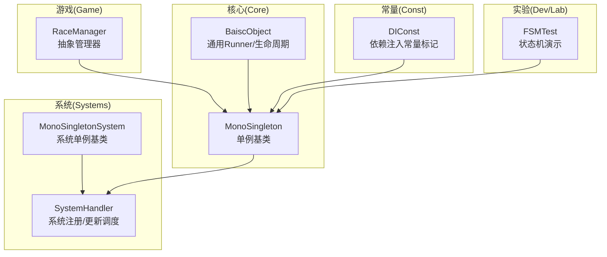
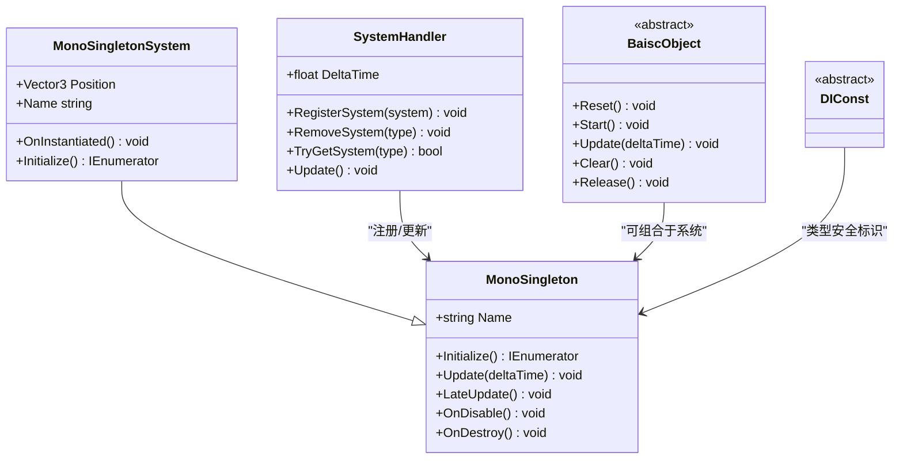
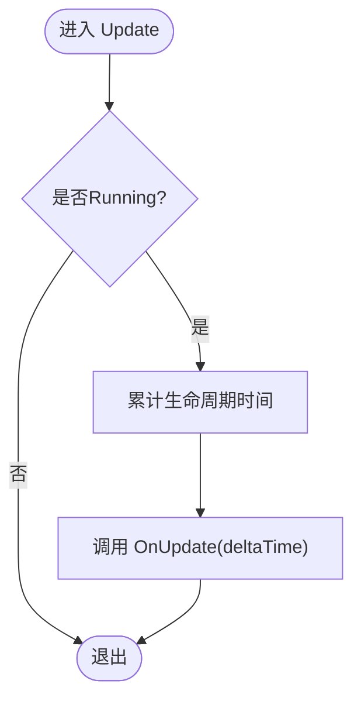
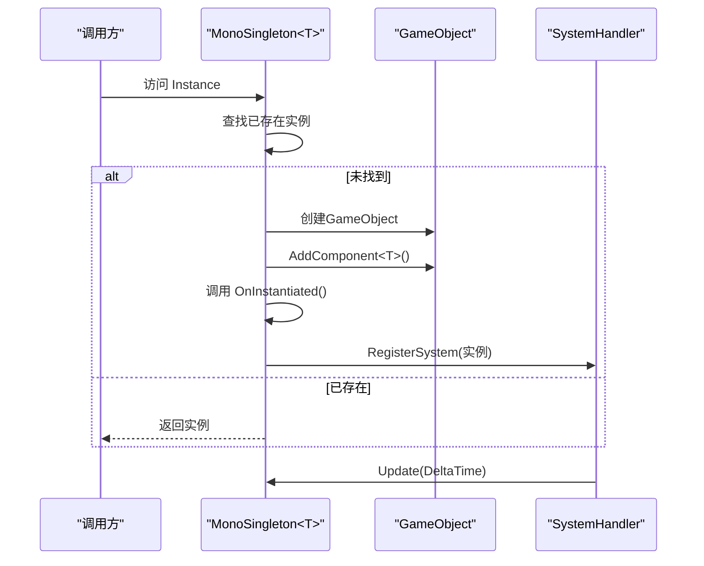
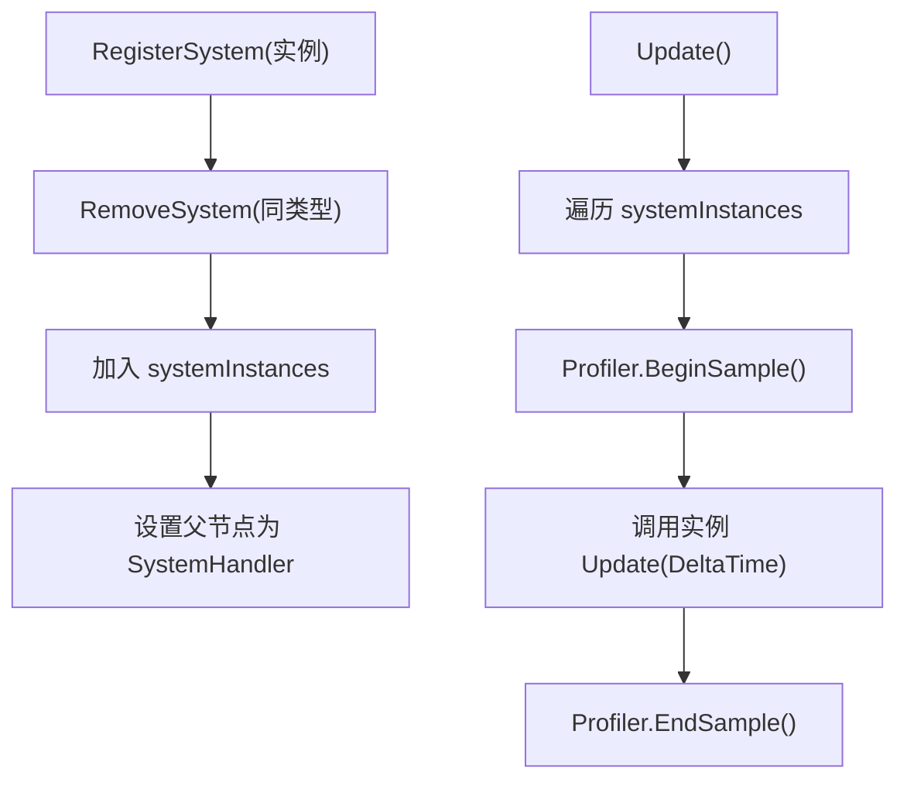
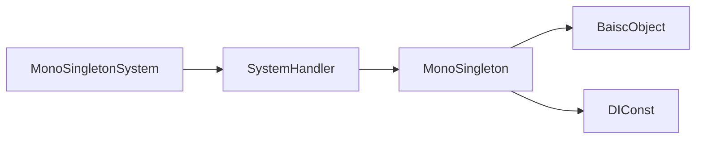

# 开发者指南

<cite>
**本文引用的文件**
- [Assets/Scripts/Core/BaiscObject.cs](file://Assets/Scripts/Core/BaiscObject.cs)
- [Assets/Scripts/Core/MonoSingleton.cs](file://Assets/Scripts/Core/MonoSingleton.cs)
- [Assets/Scripts/Systems/SystemHandler.cs](file://Assets/Scripts/Systems/SystemHandler.cs)
- [Assets/Scripts/Systems/MonoSingletonSystem.cs](file://Assets/Scripts/Systems/MonoSingletonSystem.cs)
- [Assets/Scripts/Const/DIConst.cs](file://Assets/Scripts/Const/DIConst.cs)
- [Assets/Dev/Lab/FSMTest/FSMTest.cs](file://Assets/Dev/Lab/FSMTest/FSMTest.cs)
- [Assets/Scripts/Game/Manager/RaceManager.cs](file://Assets/Scripts/Game/Manager/RaceManager.cs)
</cite>

## 目录
1. [简介](#简介)
2. [项目结构](#项目结构)
3. [核心组件](#核心组件)
4. [架构总览](#架构总览)
5. [详细组件分析](#详细组件分析)
6. [依赖关系分析](#依赖关系分析)
7. [性能考虑](#性能考虑)
8. [故障排查指南](#故障排查指南)
9. [结论](#结论)
10. [附录](#附录)

## 简介
本指南面向ProjectR项目的开发者，旨在提供从目录结构、编码规范到开发流程、测试与文档维护的完整实践说明。内容覆盖：
- 目录与文件命名约定
- 核心架构与组件职责
- 新功能开发、修改与Bug修复流程
- 代码审查、测试与文档维护要点
- 团队协作、版本控制与发布管理建议
- 开发工具使用与效率提升技巧

## 项目结构
ProjectR采用按“功能域+层次”混合组织的脚本结构，核心模块包括：
- Core：基础运行时对象与生命周期管理（如通用Runner、MonoSingleton）
- Systems：系统层（SystemHandler负责统一调度，MonoSingletonSystem为系统基类）
- Game：游戏业务层（如RaceManager等）
- Const：常量与抽象标识（如DI常量）
- Dev/Lab：实验性功能与示例（如FSMTest）

图表来源
- [Assets/Scripts/Core/BaiscObject.cs:1-167](file://Assets/Scripts/Core/BaiscObject.cs#L1-L167)
- [Assets/Scripts/Core/MonoSingleton.cs:1-70](file://Assets/Scripts/Core/MonoSingleton.cs#L1-L70)
- [Assets/Scripts/Systems/SystemHandler.cs:1-71](file://Assets/Scripts/Systems/SystemHandler.cs#L1-L71)
- [Assets/Scripts/Systems/MonoSingletonSystem.cs:1-37](file://Assets/Scripts/Systems/MonoSingletonSystem.cs#L1-L37)
- [Assets/Scripts/Const/DIConst.cs:1-16](file://Assets/Scripts/Const/DIConst.cs#L1-L16)
- [Assets/Dev/Lab/FSMTest/FSMTest.cs:1-181](file://Assets/Dev/Lab/FSMTest/FSMTest.cs#L1-L181)

章节来源
- [Assets/Scripts/Core/BaiscObject.cs:1-167](file://Assets/Scripts/Core/BaiscObject.cs#L1-L167)
- [Assets/Scripts/Core/MonoSingleton.cs:1-70](file://Assets/Scripts/Core/MonoSingleton.cs#L1-L70)
- [Assets/Scripts/Systems/SystemHandler.cs:1-71](file://Assets/Scripts/Systems/SystemHandler.cs#L1-L71)
- [Assets/Scripts/Systems/MonoSingletonSystem.cs:1-37](file://Assets/Scripts/Systems/MonoSingletonSystem.cs#L1-L37)
- [Assets/Scripts/Const/DIConst.cs:1-16](file://Assets/Scripts/Const/DIConst.cs#L1-L16)
- [Assets/Dev/Lab/FSMTest/FSMTest.cs:1-181](file://Assets/Dev/Lab/FSMTest/FSMTest.cs#L1-L181)

## 核心组件
- BaiscObject：定义通用Runner生命周期（Reset/Start/Update/Clear/Release），并提供对象池封装，确保资源复用与安全释放。
- MonoSingleton：提供延迟实例化、生命周期回调与Unity消息桥接；支持外部调用与内部重写分离。
- MonoSingletonSystem：系统单例基类，自动注册到SystemHandler，并在Awake前完成初始化。
- SystemHandler：集中注册与更新所有系统实例，提供Profiler采样与父子层级管理。
- DIConst：依赖注入相关常量标记的抽象基类，便于类型安全的DI键值管理。
- FSMTest：基于Odin的FSM演示，展示状态与转换的池化使用方式。

章节来源
- [Assets/Scripts/Core/BaiscObject.cs:1-167](file://Assets/Scripts/Core/BaiscObject.cs#L1-L167)
- [Assets/Scripts/Core/MonoSingleton.cs:1-70](file://Assets/Scripts/Core/MonoSingleton.cs#L1-L70)
- [Assets/Scripts/Systems/MonoSingletonSystem.cs:1-37](file://Assets/Scripts/Systems/MonoSingletonSystem.cs#L1-L37)
- [Assets/Scripts/Systems/SystemHandler.cs:1-71](file://Assets/Scripts/Systems/SystemHandler.cs#L1-L71)
- [Assets/Scripts/Const/DIConst.cs:1-16](file://Assets/Scripts/Const/DIConst.cs#L1-L16)
- [Assets/Dev/Lab/FSMTest/FSMTest.cs:1-181](file://Assets/Dev/Lab/FSMTest/FSMTest.cs#L1-L181)

## 架构总览
系统通过SystemHandler统一调度各系统单例，系统单例继承MonoSingleton以获得生命周期与实例化能力；业务层（如RaceManager）可作为系统或普通MonoBehaviour存在，遵循统一的更新与清理流程。

图表来源
- [Assets/Scripts/Core/MonoSingleton.cs:1-70](file://Assets/Scripts/Core/MonoSingleton.cs#L1-L70)
- [Assets/Scripts/Systems/MonoSingletonSystem.cs:1-37](file://Assets/Scripts/Systems/MonoSingletonSystem.cs#L1-L37)
- [Assets/Scripts/Systems/SystemHandler.cs:1-71](file://Assets/Scripts/Systems/SystemHandler.cs#L1-L71)
- [Assets/Scripts/Core/BaiscObject.cs:1-167](file://Assets/Scripts/Core/BaiscObject.cs#L1-L167)
- [Assets/Scripts/Const/DIConst.cs:1-16](file://Assets/Scripts/Const/DIConst.cs#L1-L16)

## 详细组件分析

### 生命周期与对象池（BaiscObject）
- 生命周期契约：Reset → Start → Update → Clear → Release，确保状态机与资源管理一致性。
- 对象池封装：提供静态Pool<T>与Get/Release方法，避免GC与频繁分配。
- 安全释放：重复释放保护与空对象错误日志，防止逻辑隐患。

图表来源
- [Assets/Scripts/Core/BaiscObject.cs:76-91](file://Assets/Scripts/Core/BaiscObject.cs#L76-L91)

章节来源
- [Assets/Scripts/Core/BaiscObject.cs:1-167](file://Assets/Scripts/Core/BaiscObject.cs#L1-L167)

### 单例与系统基类（MonoSingleton/MonoSingletonSystem）
- 延迟实例化：首次访问时查找或创建GameObject并挂载对应单例组件。
- 生命周期回调：OnInstantiated、OnUpdate、OnClear等，区分对外接口与内部实现。
- 系统注册：MonoSingletonSystem在实例化后自动注册至SystemHandler，统一由SystemHandler驱动。

图表来源
- [Assets/Scripts/Core/MonoSingleton.cs:12-31](file://Assets/Scripts/Core/MonoSingleton.cs#L12-L31)
- [Assets/Scripts/Systems/MonoSingletonSystem.cs:18-25](file://Assets/Scripts/Systems/MonoSingletonSystem.cs#L18-L25)
- [Assets/Scripts/Systems/SystemHandler.cs:25-31](file://Assets/Scripts/Systems/SystemHandler.cs#L25-L31)

章节来源
- [Assets/Scripts/Core/MonoSingleton.cs:1-70](file://Assets/Scripts/Core/MonoSingleton.cs#L1-L70)
- [Assets/Scripts/Systems/MonoSingletonSystem.cs:1-37](file://Assets/Scripts/Systems/MonoSingletonSystem.cs#L1-L37)
- [Assets/Scripts/Systems/SystemHandler.cs:1-71](file://Assets/Scripts/Systems/SystemHandler.cs#L1-L71)

### 系统调度（SystemHandler）
- 注册与去重：同一类型的系统仅保留最新实例，旧实例先Clear再销毁。
- 统一更新：遍历系统列表，按帧调用Update，编辑器模式下进行Profiler采样。
- 清理策略：OnClear时批量清理所有系统实例。

图表来源
- [Assets/Scripts/Systems/SystemHandler.cs:25-68](file://Assets/Scripts/Systems/SystemHandler.cs#L25-L68)

章节来源
- [Assets/Scripts/Systems/SystemHandler.cs:1-71](file://Assets/Scripts/Systems/SystemHandler.cs#L1-L71)

### 依赖注入常量（DIConst）
- 类型安全：通过泛型参数表达依赖键的类型维度，便于编译期校验。
- 抽象基类：不承载具体逻辑，仅作为类型占位符。

章节来源
- [Assets/Scripts/Const/DIConst.cs:1-16](file://Assets/Scripts/Const/DIConst.cs#L1-L16)

### 状态机演示（FSMTest）
- Odin集成：使用按钮属性快速触发状态机测试。
- 状态与转换：状态类与转换类均采用池化，减少GC压力。
- 编辑器运行：支持在编辑器中一键进入Play模式并执行测试序列。

章节来源
- [Assets/Dev/Lab/FSMTest/FSMTest.cs:1-181](file://Assets/Dev/Lab/FSMTest/FSMTest.cs#L1-L181)

### 游戏管理器（RaceManager）
- 抽象层：当前为抽象类，后续可扩展为具体管理器，遵循系统单例模式。

章节来源
- [Assets/Scripts/Game/Manager/RaceManager.cs:1-4](file://Assets/Scripts/Game/Manager/RaceManager.cs#L1-L4)

## 依赖关系分析
- SystemHandler对MonoSingleton及其派生类具有强依赖，负责注册、更新与清理。
- MonoSingletonSystem依赖SystemHandler进行注册，同时提供系统级默认行为（位置、名称、日志）。
- BaiscObject可与MonoSingleton组合，用于需要对象池与生命周期管理的组件。
- DIConst为类型安全的DI键提供抽象基类，便于跨模块引用。

图表来源
- [Assets/Scripts/Systems/SystemHandler.cs:1-71](file://Assets/Scripts/Systems/SystemHandler.cs#L1-L71)
- [Assets/Scripts/Core/MonoSingleton.cs:1-70](file://Assets/Scripts/Core/MonoSingleton.cs#L1-L70)
- [Assets/Scripts/Systems/MonoSingletonSystem.cs:1-37](file://Assets/Scripts/Systems/MonoSingletonSystem.cs#L1-L37)
- [Assets/Scripts/Core/BaiscObject.cs:1-167](file://Assets/Scripts/Core/BaiscObject.cs#L1-L167)
- [Assets/Scripts/Const/DIConst.cs:1-16](file://Assets/Scripts/Const/DIConst.cs#L1-L16)

章节来源
- [Assets/Scripts/Systems/SystemHandler.cs:1-71](file://Assets/Scripts/Systems/SystemHandler.cs#L1-L71)
- [Assets/Scripts/Core/MonoSingleton.cs:1-70](file://Assets/Scripts/Core/MonoSingleton.cs#L1-L70)
- [Assets/Scripts/Systems/MonoSingletonSystem.cs:1-37](file://Assets/Scripts/Systems/MonoSingletonSystem.cs#L1-L37)
- [Assets/Scripts/Core/BaiscObject.cs:1-167](file://Assets/Scripts/Core/BaiscObject.cs#L1-L167)
- [Assets/Scripts/Const/DIConst.cs:1-16](file://Assets/Scripts/Const/DIConst.cs#L1-L16)

## 性能考虑
- 对象池优先：涉及频繁创建/销毁的对象应使用BaiscObject.Pool<T>，降低GC压力。
- 统一更新：通过SystemHandler集中Update，避免分散的轮询逻辑。
- Profiler采样：SystemHandler在编辑器模式下对每个系统Update进行采样，便于定位热点。
- 避免重复注册：MonoSingletonSystem在OnInstantiated中会先Remove旧实例，确保唯一性。

## 故障排查指南
- 空对象释放：BaiscObject在Release时对null对象进行错误日志提示，检查对象获取与释放链路。
- 重复注册：若系统未正确移除旧实例，可能导致多次Update或内存泄漏，确认OnInstantiated中的RemoveSystem调用。
- 编辑器运行：FSMTest支持编辑器一键进入Play模式，便于快速验证状态机逻辑。
- 日志辅助：SystemHandler与MonoSingletonSystem在关键节点输出日志，便于追踪生命周期。

章节来源
- [Assets/Scripts/Core/BaiscObject.cs:134-143](file://Assets/Scripts/Core/BaiscObject.cs#L134-L143)
- [Assets/Scripts/Systems/SystemHandler.cs:32-41](file://Assets/Scripts/Systems/SystemHandler.cs#L32-L41)
- [Assets/Dev/Lab/FSMTest/FSMTest.cs:21-25](file://Assets/Dev/Lab/FSMTest/FSMTest.cs#L21-L25)

## 结论
ProjectR通过MonoSingleton与SystemHandler构建了清晰的系统生命周期与统一调度机制，配合BaiscObject的对象池与状态机演示，形成可扩展、可维护且具备性能保障的开发框架。建议在新功能开发中遵循统一的系统单例模式与对象池策略，并结合SystemHandler进行集中管理与调试。

## 附录

### 开发规范与最佳实践
- 目录与命名
  - 功能域优先：Core/Systems/Game/Const/Dev/Lab明确职责边界。
  - 文件命名：类名与文件名一致；抽象类以“抽象”语义命名；测试类以“Test”结尾。
- 编码风格
  - 生命周期：严格遵循Reset/Start/Update/Clear/Release顺序。
  - 单例：优先使用MonoSingleton/MonoSingletonSystem，避免全局静态状态。
  - 对象池：涉及高频创建的组件使用Pool<T>，并在Release中调用OnRelease。
- 测试与文档
  - 单元测试：针对关键算法与状态机转换编写可运行场景。
  - 文档：在Dev/Lab中补充设计说明与使用示例，保持与代码同步。
- 代码审查
  - 关注点：生命周期完整性、对象池使用、系统注册与清理、日志与异常处理。
- 版本控制与发布
  - 分支策略：功能分支开发，主干保持稳定；热修复走hotfix分支。
  - 提交信息：描述变更目的、影响范围与测试结果。
  - 发布流程：自动化打包与回归测试通过后合并至发布分支并打标签。

### 开发工具与效率
- 编辑器工具：利用Odin按钮快速触发测试；SystemHandler的Profiler采样辅助性能分析。
- 资源管理：结合对象池与资源包策略，减少运行时开销。
- 自动化：在CI中集成单元测试与打包流程，保证质量门禁。