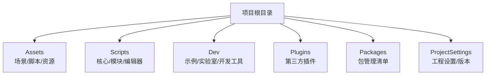
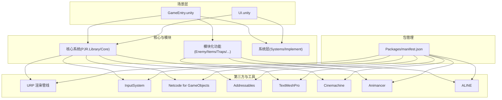
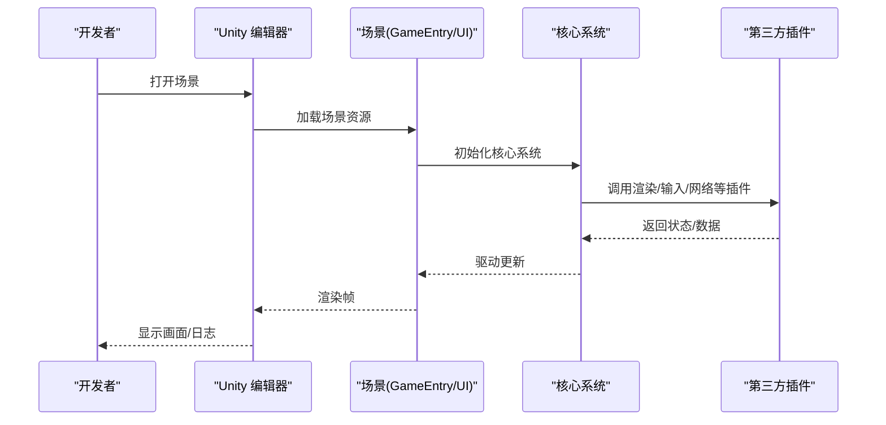
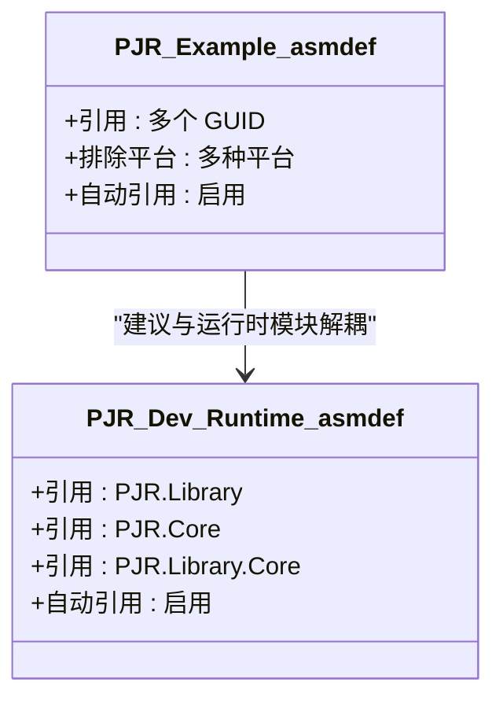
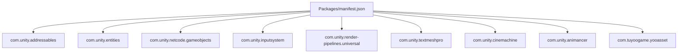

# 快速开始

<cite>
**本文引用的文件**
- [manifest.json](file://Packages/manifest.json)
- [ProjectSettings.asset](file://ProjectSettings/ProjectSettings.asset)
- [ProjectVersion.txt](file://ProjectSettings/ProjectVersion.txt)
- [GameEntry.unity](file://Assets/Scenes/GameEntry.unity)
- [UI.unity](file://Assets/Scenes/UI.unity)
- [PJR.Example.asmdef](file://Assets/Dev/Example/PJR.Example.asmdef)
- [PJR.Dev.Runtime.asmdef](file://Assets/Dev/Scripts/Runtime/PJR.Dev.Runtime.asmdef)
- [ALINE.csproj](file://ALINE.csproj)
- [Animancer.csproj](file://Animancer.csproj)
- [Cinemachine.csproj](file://Cinemachine.csproj)
- [Bootstrap.csproj](file://Bootstrap.csproj)
</cite>

## 目录
1. [简介](#简介)
2. [项目结构](#项目结构)
3. [核心组件](#核心组件)
4. [架构总览](#架构总览)
5. [详细组件分析](#详细组件分析)
6. [依赖分析](#依赖分析)
7. [性能考虑](#性能考虑)
8. [故障排除指南](#故障排除指南)
9. [结论](#结论)
10. [附录](#附录)

## 简介
本指南面向首次接触 ProjectR 的开发者，帮助你在最短时间内完成环境准备、项目克隆与导入、首次运行、开发环境配置，并顺利运行第一个场景。文档同时覆盖常见初始配置问题与解决方案，确保你能快速上手并理解项目的基本功能。

## 项目结构
ProjectR 是一个基于 Unity 的项目，采用模块化脚本与资源组织方式，包含核心库、示例工程、开发工具与场景等模块。关键目录与职责概览如下：
- Assets：美术资源、场景、脚本与配置
- Scripts：核心系统、模块化功能、编辑器工具与运行时代码
- Dev：示例、实验室与开发辅助模块（含运行时与编辑器程序集定义）
- Plugins：第三方插件与扩展（如 Animancer、Cinemachine、ALINE 等）
- Packages：包管理清单，声明依赖与注册表
- ProjectSettings：Unity 工程设置与版本信息

图表来源
- [ProjectSettings.asset](file://ProjectSettings/ProjectSettings.asset)
- [ProjectVersion.txt](file://ProjectSettings/ProjectVersion.txt)

章节来源
- [ProjectSettings.asset](file://ProjectSettings/ProjectSettings.asset)
- [ProjectVersion.txt](file://ProjectSettings/ProjectVersion.txt)

## 核心组件
- 包管理与依赖
  - 通过 Packages/manifest.json 声明依赖，包含 Addressables、Entities、Netcode、InputSystem、URP、TextMeshPro、Cinemachine、Animancer 等关键模块。
  - 使用 scopedRegistries 引入特定包源，确保依赖可稳定拉取。
- 场景与入口
  - Assets/Scenes/GameEntry.unity 与 Assets/Scenes/UI.unity 提供了可直接运行的基础场景，便于验证渲染管线、UI 与输入系统是否正常工作。
- 程序集定义
  - Dev 与核心库通过 .asmdef 文件进行模块化编译，提升构建效率与可维护性。
- 第三方插件
  - Animancer、Cinemachine、ALINE 等插件在 Plugins 中提供动画、摄像机与工具链支持。

章节来源
- [manifest.json](file://Packages/manifest.json)
- [GameEntry.unity](file://Assets/Scenes/GameEntry.unity)
- [UI.unity](file://Assets/Scenes/UI.unity)
- [PJR.Example.asmdef](file://Assets/Dev/Example/PJR.Example.asmdef)
- [PJR.Dev.Runtime.asmdef](file://Assets/Dev/Scripts/Runtime/PJR.Dev.Runtime.asmdef)

## 架构总览
下图展示了项目中关键模块之间的关系与交互，包括场景、核心系统、第三方插件与包管理。

图表来源
- [manifest.json](file://Packages/manifest.json)
- [GameEntry.unity](file://Assets/Scenes/GameEntry.unity)
- [UI.unity](file://Assets/Scenes/UI.unity)

章节来源
- [manifest.json](file://Packages/manifest.json)
- [GameEntry.unity](file://Assets/Scenes/GameEntry.unity)
- [UI.unity](file://Assets/Scenes/UI.unity)

## 详细组件分析

### 组件一：场景与运行流程
- GameEntry.unity
  - 包含基础相机、光照与测试对象，适合验证渲染管线与摄像机控制。
  - 可作为首个运行场景，检查 URP、Cinemachine、输入系统等是否正常。
- UI.unity
  - 包含 Canvas、EventSystem 与基础 UI 结构，适合验证 UI 渲染与交互。
- 运行流程建议
  - 在 Unity 编辑器中打开相应场景，点击播放按钮，观察画面与日志输出。
  - 如遇资源缺失或材质异常，优先检查 Addressables 与 URP 设置。

图表来源
- [GameEntry.unity](file://Assets/Scenes/GameEntry.unity)
- [UI.unity](file://Assets/Scenes/UI.unity)

章节来源
- [GameEntry.unity](file://Assets/Scenes/GameEntry.unity)
- [UI.unity](file://Assets/Scenes/UI.unity)

### 组件二：程序集与模块化
- PJR.Example.asmdef
  - 定义示例模块的引用范围与平台排除策略，避免在不支持的平台编译示例代码。
- PJR.Dev.Runtime.asmdef
  - 将 Dev 运行时代码与核心库（PJR.Library、PJR.Core、PJR.Library.Core）关联，形成稳定的模块边界。
- 建议
  - 新增功能时遵循现有 .asmdef 分层，减少跨模块耦合。

图表来源
- [PJR.Example.asmdef](file://Assets/Dev/Example/PJR.Example.asmdef)
- [PJR.Dev.Runtime.asmdef](file://Assets/Dev/Scripts/Runtime/PJR.Dev.Runtime.asmdef)

章节来源
- [PJR.Example.asmdef](file://Assets/Dev/Example/PJR.Example.asmdef)
- [PJR.Dev.Runtime.asmdef](file://Assets/Dev/Scripts/Runtime/PJR.Dev.Runtime.asmdef)

### 组件三：第三方插件与项目设置
- 插件与项目设置
  - 项目使用 URP、Cinemachine、Animancer、ALINE 等插件，需确保对应包已正确安装。
  - 工程设置中包含渲染管线、输入系统、脚本定义符号等关键配置。
- 建议
  - 在 Unity 编辑器中打开“Package Manager”，确认所有依赖均已安装且版本满足要求。
  - 若出现渲染异常，检查 URP 设置与质量面板；若输入无响应，检查 InputSystem 设置。

章节来源
- [ProjectSettings.asset](file://ProjectSettings/ProjectSettings.asset)
- [ProjectVersion.txt](file://ProjectSettings/ProjectVersion.txt)

## 依赖分析
- 包管理清单
  - manifest.json 声明了 Addressables、Entities、Netcode、InputSystem、URP、TextMeshPro、Cinemachine、Animancer、ALINE 等依赖。
  - scopedRegistries 指向特定包源，确保依赖可稳定拉取。
- 依赖关系可视化

图表来源
- [manifest.json](file://Packages/manifest.json)

章节来源
- [manifest.json](file://Packages/manifest.json)

## 性能考虑
- 渲染与管线
  - 使用 URP 时，合理设置渲染管线资源与质量等级，避免在低端设备上出现掉帧。
- 场景与资源
  - 初次运行建议关闭不必要的后处理与阴影质量，逐步调优。
- 构建与打包
  - 使用 Addressables 进行资源分包与延迟加载，降低首屏内存峰值。
- 输入与网络
  - InputSystem 与 Netcode 的更新频率应与目标平台性能匹配，避免过度同步导致卡顿。

## 故障排除指南
- Unity 版本不匹配
  - 项目使用 Unity 2022.3.9f1，请确保本地安装的 Unity 版本与此一致，否则可能出现兼容性问题。
- 包依赖缺失或版本冲突
  - 打开 Package Manager，检查 Packages/manifest.json 中声明的依赖是否全部安装。
  - 若出现版本冲突，尝试移除冲突包后重新安装指定版本。
- 场景无法运行或画面异常
  - 先尝试切换到 URP 默认资源，确认渲染管线设置正确。
  - 检查场景中的光源与相机设置，确保基础光照与裁剪参数合理。
- 输入系统无响应
  - 在 Edit > Project Settings > Input System 中确认 Input System Package 已启用。
  - 检查 Player Input 组件与绑定的 Action Map 是否正确。
- Netcode 或网络相关问题
  - 确认 NetworkManager 与 NetworkObject 组件已正确挂载。
  - 检查场景管理与网络初始化顺序，避免在客户端未连接时访问服务端逻辑。
- 第三方插件问题
  - Animancer、Cinemachine、ALINE 等插件需与当前 Unity 版本兼容，必要时升级插件或回退 Unity 版本。
- 构建失败或运行时崩溃
  - 清理 Library/PackageCache 后重试。
  - 检查脚本定义符号（Scripting Define Symbols）与平台设置是否一致。

章节来源
- [ProjectVersion.txt](file://ProjectSettings/ProjectVersion.txt)
- [ProjectSettings.asset](file://ProjectSettings/ProjectSettings.asset)
- [manifest.json](file://Packages/manifest.json)

## 结论
通过本指南，你已经完成了环境准备、项目导入与首次运行验证，并对项目结构、核心组件与依赖关系有了整体认识。建议在熟悉基础场景后，逐步探索 Dev 示例与模块化脚本，进一步理解系统的扩展方式与最佳实践。

## 附录
- 快速检查清单
  - Unity 版本：2022.3.9f1
  - 已安装依赖：URP、InputSystem、Netcode、Addressables、Cinemachine、Animancer、ALINE
  - 场景可运行：GameEntry.unity、UI.unity
  - 程序集边界清晰：按 .asmdef 分层组织
  - 包管理：Packages/manifest.json 正常