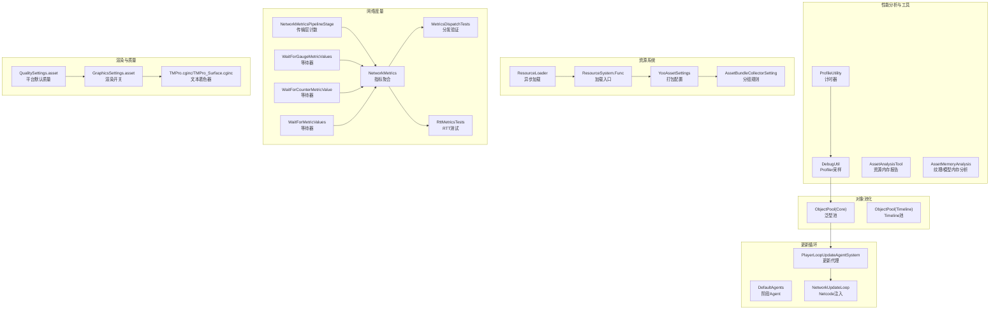
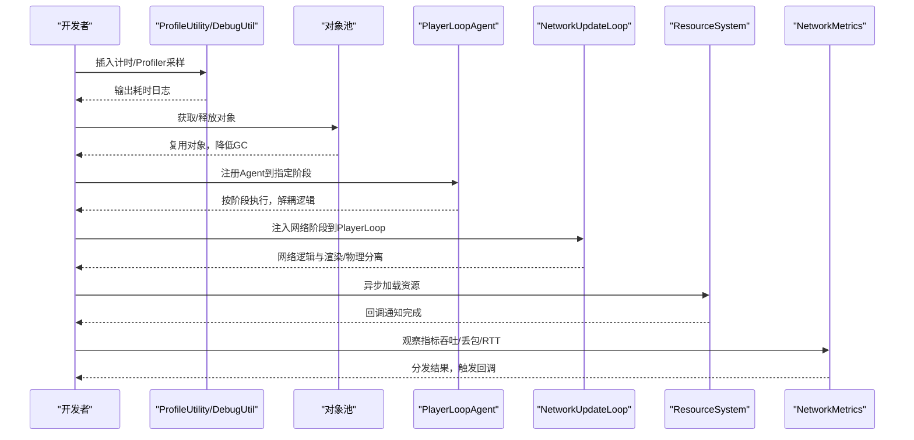
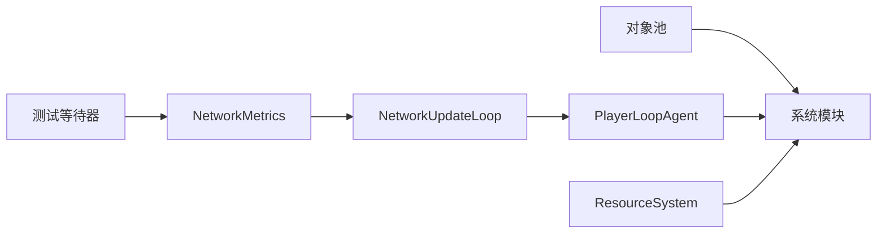
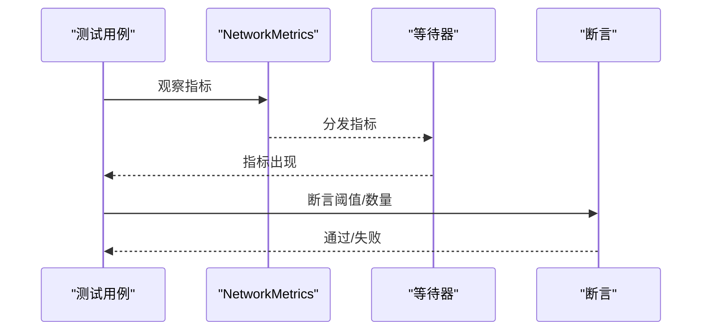

# 性能优化

<cite>
**本文引用的文件**   
- [ProfileUtility.cs](file://Assets/Scripts/Profiler/ProfileUtility.cs)
- [DebugUtil.cs](file://Assets/Scripts/RuntimeEditor/DebugUtil.cs)
- [ObjectPool.cs（对象池）](file://Assets/Scripts/Core/ObjectPooling/ObjectPool.cs)
- [ObjectPool.cs（Timeline池化）](file://Assets/Scripts/Timeline/Runtime/Pool/ObjectPool.cs)
- [PlayerLoopUpdateAgentSystem.cs](file://Assets/Scripts/Systems/Implement/UpdateAgent/PlayerLoopUpdateAgentSystem.cs)
- [PlayerLoopUpdateAgentSystem.DefaultAgents.cs](file://Assets/Scripts/Systems/Implement/UpdateAgent/PlayerLoopUpdateAgentSystem.DefaultAgents.cs)
- [NetworkUpdateLoop.cs](file://LocalPackages/com.unity.netcode.gameobjects@1.14.1/Runtime/Core/NetworkUpdateLoop.cs)
- [NetworkMetrics.cs](file://LocalPackages/com.unity.netcode.gameobjects@1.14.1/Runtime/Metrics/NetworkMetrics.cs)
- [NetworkMetricsPipelineStage.cs](file://LocalPackages/com.unity.netcode.gameobjects@1.14.1/Runtime/Transports/UTP/NetworkMetricsPipelineStage.cs)
- [MetricsDispatchTests.cs](file://LocalPackages/com.unity.netcode.gameobjects@1.14.1/Tests/Runtime/Metrics/MetricsDispatchTests.cs)
- [RttMetricsTests.cs](file://LocalPackages/com.unity.netcode.gameobjects@1.14.1/Tests/Runtime/Metrics/RttMetricsTests.cs)
- [WaitForGaugeMetricValues.cs](file://LocalPackages/com.unity.netcode.gameobjects@1.14.1/TestHelpers/Runtime/Metrics/WaitForGaugeMetricValues.cs)
- [WaitForCounterMetricValue.cs](file://LocalPackages/com.unity.netcode.gameobjects@1.14.1/TestHelpers/Runtime/Metrics/WaitForCounterMetricValue.cs)
- [WaitForMetricValues.cs](file://LocalPackages/com.unity.netcode.gameobjects@1.14.1/TestHelpers/Runtime/Metrics/WaitForMetricValues.cs)
- [QualitySettings.asset](file://ProjectSettings/QualitySettings.asset)
- [GraphicsSettings.asset](file://ProjectSettings/GraphicsSettings.asset)
- [PerformanceTestRunSettings.json](file://Assets/Resources/PerformanceTestRunSettings.json)
- [YooAssetSettings.asset](file://Assets/Resources/YooAssetSettings.asset)
- [AssetBundleCollectorSetting.asset](file://Assets/Resources/AssetBundleCollectorSetting.asset)
- [ResourceLoader.cs](file://Assets/Scripts/Systems/Implement/ResourceSystem/ResourceLoader.cs)
- [ResourceSystem.Func.cs](file://Assets/Scripts/Systems/Implement/ResourceSystem/ResourceSystem.Func.cs)
- [AssetAnalysisTool.cs](file://Assets/Scripts/Editor/AssetAnalysisTools/AssetAnalysisTool.cs)
- [AssetMemoryAnalysis.cs](file://Assets/Scripts/Editor/AssetAnalysisTools/AssetMemoryAnalysis.cs)
- [CShaderPerformanceTest.cs](file://Assets/Dev/Lab/Scripts/CShaderPerformanceTest.cs)
- [JobSystemTest.cs](file://Assets/Dev/Lab/Scripts/JobSystemTest.cs)
- [TMPro.cginc](file://Assets/TextMesh Pro/Shaders/TMPro.cginc)
- [TMPro_Surface.cginc](file://Assets/TextMesh Pro/Shaders/TMPro_Surface.cginc)
</cite>

## 目录
1. [简介](#简介)
2. [项目结构与性能相关模块概览](#项目结构与性能相关模块概览)
3. [核心组件与性能工具](#核心组件与性能工具)
4. [架构总览与性能控制流](#架构总览与性能控制流)
5. [详细组件分析与优化策略](#详细组件分析与优化策略)
6. [依赖关系与耦合分析](#依赖关系与耦合分析)
7. [性能特征与优化要点](#性能特征与优化要点)
8. [性能测试与基准测试实施](#性能测试与基准测试实施)
9. [平台差异与针对性优化](#平台差异与针对性优化)
10. [监控指标、告警与回归预防](#监控指标告警与回归预防)
11. [故障排查与常见问题](#故障排查与常见问题)
12. [结论](#结论)

## 简介
本文件面向ProjectR项目，系统性梳理并输出一套可落地的性能优化实践指南。内容覆盖性能分析工具链、瓶颈识别路径、内存与CPU/GPU优化策略、帧率与加载时间优化、性能测试与基准测试、平台差异化优化、监控与告警、以及回归预防等。目标是帮助开发者在Unity+Netcode生态下，稳定提升运行时性能与用户体验。

## 项目结构与性能相关模块概览
- 性能分析与计时：内置轻量计时器与Profiler采样封装，便于在代码中快速插入热点测量点。
- 对象池化：减少GC压力与频繁分配，降低主线程抖动。
- 更新循环与调度：基于Unity PlayerLoop的更新代理系统，支持细粒度阶段划分与自定义Agent注入。
- 资源加载与打包：基于YooAsset与AssetBundle配置，支持分包、地址化与按需加载。
- 网络性能度量：Netcode Metrics子系统提供传输层与消息级指标采集与分发。
- 渲染管线与着色器：URP与TMP着色器参数对性能有直接影响，需结合质量设置进行权衡。
- 平台质量默认值：不同平台默认质量等级存在差异，应结合设备能力进行调优。

**图表来源**
- [ProfileUtility.cs:1-28](file://Assets/Scripts/Profiler/ProfileUtility.cs#L1-L28)
- [DebugUtil.cs:1-34](file://Assets/Scripts/RuntimeEditor/DebugUtil.cs#L1-L34)
- [ObjectPool.cs（对象池）:90-161](file://Assets/Scripts/Core/ObjectPooling/ObjectPool.cs#L90-L161)
- [ObjectPool.cs（Timeline池化）:43-64](file://Assets/Scripts/Timeline/Runtime/Pool/ObjectPool.cs#L43-L64)
- [PlayerLoopUpdateAgentSystem.cs:114-164](file://Assets/Scripts/Systems/Implement/UpdateAgent/PlayerLoopUpdateAgentSystem.cs#L114-L164)
- [PlayerLoopUpdateAgentSystem.DefaultAgents.cs:1-36](file://Assets/Scripts/Systems/Implement/UpdateAgent/PlayerLoopUpdateAgentSystem.DefaultAgents.cs#L1-L36)
- [NetworkUpdateLoop.cs:229-477](file://LocalPackages/com.unity.netcode.gameobjects@1.14.1/Runtime/Core/NetworkUpdateLoop.cs#L229-L477)
- [NetworkMetrics.cs:80-104](file://LocalPackages/com.unity.netcode.gameobjects@1.14.1/Runtime/Metrics/NetworkMetrics.cs#L80-L104)
- [NetworkMetricsPipelineStage.cs:25-56](file://LocalPackages/com.unity.netcode.gameobjects@1.14.1/Runtime/Transports/UTP/NetworkMetricsPipelineStage.cs#L25-L56)
- [MetricsDispatchTests.cs:42-67](file://LocalPackages/com.unity.netcode.gameobjects@1.14.1/Tests/Runtime/Metrics/MetricsDispatchTests.cs#L42-L67)
- [RttMetricsTests.cs:65-88](file://LocalPackages/com.unity.netcode.gameobjects@1.14.1/Tests/Runtime/Metrics/RttMetricsTests.cs#L65-L88)
- [WaitForGaugeMetricValues.cs:1-55](file://LocalPackages/com.unity.netcode.gameobjects@1.14.1/TestHelpers/Runtime/Metrics/WaitForGaugeMetricValues.cs#L1-L55)
- [WaitForCounterMetricValue.cs:1-50](file://LocalPackages/com.unity.netcode.gameobjects@1.14.1/TestHelpers/Runtime/Metrics/WaitForCounterMetricValue.cs#L1-L50)
- [WaitForMetricValues.cs:45-100](file://LocalPackages/com.unity.netcode.gameobjects@1.14.1/TestHelpers/Runtime/Metrics/WaitForMetricValues.cs#L45-L100)
- [QualitySettings.asset:1-239](file://ProjectSettings/QualitySettings.asset#L1-L239)
- [GraphicsSettings.asset:1-37](file://ProjectSettings/GraphicsSettings.asset#L1-L37)
- [YooAssetSettings.asset:1-17](file://Assets/Resources/YooAssetSettings.asset#L1-L17)
- [AssetBundleCollectorSetting.asset:1-63](file://Assets/Resources/AssetBundleCollectorSetting.asset#L1-L63)
- [ResourceLoader.cs:1-42](file://Assets/Scripts/Systems/Implement/ResourceSystem/ResourceLoader.cs#L1-L42)
- [ResourceSystem.Func.cs:109-146](file://Assets/Scripts/Systems/Implement/ResourceSystem/ResourceSystem.Func.cs#L109-L146)
- [AssetAnalysisTool.cs:769-856](file://Assets/Scripts/Editor/AssetAnalysisTools/AssetAnalysisTool.cs#L769-L856)
- [AssetMemoryAnalysis.cs:361-387](file://Assets/Scripts/Editor/AssetAnalysisTools/AssetMemoryAnalysis.cs#L361-L387)

**章节来源**
- [ProfileUtility.cs:1-28](file://Assets/Scripts/Profiler/ProfileUtility.cs#L1-L28)
- [DebugUtil.cs:1-34](file://Assets/Scripts/RuntimeEditor/DebugUtil.cs#L1-L34)
- [ObjectPool.cs（对象池）:90-161](file://Assets/Scripts/Core/ObjectPooling/ObjectPool.cs#L90-L161)
- [ObjectPool.cs（Timeline池化）:43-64](file://Assets/Scripts/Timeline/Runtime/Pool/ObjectPool.cs#L43-L64)
- [PlayerLoopUpdateAgentSystem.cs:114-164](file://Assets/Scripts/Systems/Implement/UpdateAgent/PlayerLoopUpdateAgentSystem.cs#L114-L164)
- [PlayerLoopUpdateAgentSystem.DefaultAgents.cs:1-36](file://Assets/Scripts/Systems/Implement/UpdateAgent/PlayerLoopUpdateAgentSystem.DefaultAgents.cs#L1-L36)
- [NetworkUpdateLoop.cs:229-477](file://LocalPackages/com.unity.netcode.gameobjects@1.14.1/Runtime/Core/NetworkUpdateLoop.cs#L229-L477)
- [NetworkMetrics.cs:80-104](file://LocalPackages/com.unity.netcode.gameobjects@1.14.1/Runtime/Metrics/NetworkMetrics.cs#L80-L104)
- [NetworkMetricsPipelineStage.cs:25-56](file://LocalPackages/com.unity.netcode.gameobjects@1.14.1/Runtime/Transports/UTP/NetworkMetricsPipelineStage.cs#L25-L56)
- [MetricsDispatchTests.cs:42-67](file://LocalPackages/com.unity.netcode.gameobjects@1.14.1/Tests/Runtime/Metrics/MetricsDispatchTests.cs#L42-L67)
- [RttMetricsTests.cs:65-88](file://LocalPackages/com.unity.netcode.gameobjects@1.14.1/Tests/Runtime/Metrics/RttMetricsTests.cs#L65-L88)
- [WaitForGaugeMetricValues.cs:1-55](file://LocalPackages/com.unity.netcode.gameobjects@1.14.1/TestHelpers/Runtime/Metrics/WaitForGaugeMetricValues.cs#L1-L55)
- [WaitForCounterMetricValue.cs:1-50](file://LocalPackages/com.unity.netcode.gameobjects@1.14.1/TestHelpers/Runtime/Metrics/WaitForCounterMetricValue.cs#L1-L50)
- [WaitForMetricValues.cs:45-100](file://LocalPackages/com.unity.netcode.gameobjects@1.14.1/TestHelpers/Runtime/Metrics/WaitForMetricValues.cs#L45-L100)
- [QualitySettings.asset:1-239](file://ProjectSettings/QualitySettings.asset#L1-L239)
- [GraphicsSettings.asset:1-37](file://ProjectSettings/GraphicsSettings.asset#L1-L37)
- [PerformanceTestRunSettings.json:1-1](file://Assets/Resources/PerformanceTestRunSettings.json#L1-L1)
- [YooAssetSettings.asset:1-17](file://Assets/Resources/YooAssetSettings.asset#L1-L17)
- [AssetBundleCollectorSetting.asset:1-63](file://Assets/Resources/AssetBundleCollectorSetting.asset#L1-L63)
- [ResourceLoader.cs:1-42](file://Assets/Scripts/Systems/Implement/ResourceSystem/ResourceLoader.cs#L1-L42)
- [ResourceSystem.Func.cs:109-146](file://Assets/Scripts/Systems/Implement/ResourceSystem/ResourceSystem.Func.cs#L109-L146)
- [AssetAnalysisTool.cs:769-856](file://Assets/Scripts/Editor/AssetAnalysisTools/AssetAnalysisTool.cs#L769-L856)
- [AssetMemoryAnalysis.cs:361-387](file://Assets/Scripts/Editor/AssetAnalysisTools/AssetMemoryAnalysis.cs#L361-L387)
- [CShaderPerformanceTest.cs:1-52](file://Assets/Dev/Lab/Scripts/CShaderPerformanceTest.cs#L1-L52)
- [JobSystemTest.cs:41-379](file://Assets/Dev/Lab/Scripts/JobSystemTest.cs#L41-L379)
- [TMPro.cginc:50-84](file://Assets/TextMesh Pro/Shaders/TMPro.cginc#L50-L84)
- [TMPro_Surface.cginc:1-41](file://Assets/TextMesh Pro/Shaders/TMPro_Surface.cginc#L1-L41)

## 核心组件与性能工具
- 计时与采样
  - 轻量计时器：用于在关键路径上记录耗时，便于定位热点。
  - Profiler采样封装：以作用域方式包裹代码段，自动统计CPU时间。
- 对象池化
  - 泛型对象池：减少GC分配与回收压力，控制最大池容量，避免无限增长。
  - Timeline池化基类：统一释放语义，防止重复释放。
- 更新循环与调度
  - PlayerLoop更新代理：按阶段注入Agent，支持Initialization/EasyUpdate/FixedUpdate/Update/PreLateUpdate等。
  - Netcode网络更新循环：在PlayerLoop中注入网络阶段，保证网络逻辑与渲染/物理阶段解耦。
- 资源系统
  - 异步加载器：抽象加载流程，支持编辑器与运行时差异化路径。
  - 打包配置：YooAsset与分组规则，控制包体大小与加载顺序。
- 网络度量
  - 指标聚合：字节收发、消息事件、RPC、变量Delta、所有权变更、对象Spawn/Destroy等。
  - 传输层计数：统计收发包数，辅助带宽与丢包分析。
  - 测试等待器：等待特定指标出现，便于自动化测试与回归验证。

**章节来源**
- [ProfileUtility.cs:1-28](file://Assets/Scripts/Profiler/ProfileUtility.cs#L1-L28)
- [DebugUtil.cs:1-34](file://Assets/Scripts/RuntimeEditor/DebugUtil.cs#L1-L34)
- [ObjectPool.cs（对象池）:90-161](file://Assets/Scripts/Core/ObjectPooling/ObjectPool.cs#L90-L161)
- [ObjectPool.cs（Timeline池化）:43-64](file://Assets/Scripts/Timeline/Runtime/Pool/ObjectPool.cs#L43-L64)
- [PlayerLoopUpdateAgentSystem.cs:114-164](file://Assets/Scripts/Systems/Implement/UpdateAgent/PlayerLoopUpdateAgentSystem.cs#L114-L164)
- [PlayerLoopUpdateAgentSystem.DefaultAgents.cs:1-36](file://Assets/Scripts/Systems/Implement/UpdateAgent/PlayerLoopUpdateAgentSystem.DefaultAgents.cs#L1-L36)
- [NetworkUpdateLoop.cs:229-477](file://LocalPackages/com.unity.netcode.gameobjects@1.14.1/Runtime/Core/NetworkUpdateLoop.cs#L229-L477)
- [NetworkMetrics.cs:80-104](file://LocalPackages/com.unity.netcode.gameobjects@1.14.1/Runtime/Metrics/NetworkMetrics.cs#L80-L104)
- [NetworkMetricsPipelineStage.cs:25-56](file://LocalPackages/com.unity.netcode.gameobjects@1.14.1/Runtime/Transports/UTP/NetworkMetricsPipelineStage.cs#L25-L56)
- [ResourceLoader.cs:1-42](file://Assets/Scripts/Systems/Implement/ResourceSystem/ResourceLoader.cs#L1-L42)
- [ResourceSystem.Func.cs:109-146](file://Assets/Scripts/Systems/Implement/ResourceSystem/ResourceSystem.Func.cs#L109-L146)
- [YooAssetSettings.asset:1-17](file://Assets/Resources/YooAssetSettings.asset#L1-L17)
- [AssetBundleCollectorSetting.asset:1-63](file://Assets/Resources/AssetBundleCollectorSetting.asset#L1-L63)

## 架构总览与性能控制流

**图表来源**
- [ProfileUtility.cs:1-28](file://Assets/Scripts/Profiler/ProfileUtility.cs#L1-L28)
- [DebugUtil.cs:1-34](file://Assets/Scripts/RuntimeEditor/DebugUtil.cs#L1-L34)
- [ObjectPool.cs（对象池）:90-161](file://Assets/Scripts/Core/ObjectPooling/ObjectPool.cs#L90-L161)
- [PlayerLoopUpdateAgentSystem.cs:114-164](file://Assets/Scripts/Systems/Implement/UpdateAgent/PlayerLoopUpdateAgentSystem.cs#L114-L164)
- [NetworkUpdateLoop.cs:229-477](file://LocalPackages/com.unity.netcode.gameobjects@1.14.1/Runtime/Core/NetworkUpdateLoop.cs#L229-L477)
- [ResourceLoader.cs:1-42](file://Assets/Scripts/Systems/Implement/ResourceSystem/ResourceLoader.cs#L1-L42)
- [NetworkMetrics.cs:80-104](file://LocalPackages/com.unity.netcode.gameobjects@1.14.1/Runtime/Metrics/NetworkMetrics.cs#L80-L104)

## 详细组件分析与优化策略

### 性能分析工具链
- 使用计时器与Profiler采样在关键函数边界标注耗时，形成“热点清单”。
- 建议在UI交互、动画状态切换、碰撞检测、序列帧播放等高频路径埋点。
- 结合编辑器资源分析工具生成纹理/模型内存报告，指导资源瘦身。

**章节来源**
- [ProfileUtility.cs:1-28](file://Assets/Scripts/Profiler/ProfileUtility.cs#L1-L28)
- [DebugUtil.cs:1-34](file://Assets/Scripts/RuntimeEditor/DebugUtil.cs#L1-L34)
- [AssetAnalysisTool.cs:769-856](file://Assets/Scripts/Editor/AssetAnalysisTools/AssetAnalysisTool.cs#L769-L856)
- [AssetMemoryAnalysis.cs:361-387](file://Assets/Scripts/Editor/AssetAnalysisTools/AssetMemoryAnalysis.cs#L361-L387)

### 内存管理与GC优化
- 对象池化
  - 控制最大池容量，避免内存膨胀；在获取/释放时执行必要的初始化/回收动作。
  - 避免重复释放同一对象，必要时启用集合检查。
- 内存成本作用域
  - 在关键路径前后记录GC前后的内存差值，量化分配影响。
- 文本渲染
  - 合理设置TMP着色器参数，避免过度高光/发光/阴影导致的额外Pass与带宽消耗。

**章节来源**
- [ObjectPool.cs（对象池）:90-161](file://Assets/Scripts/Core/ObjectPooling/ObjectPool.cs#L90-L161)
- [ObjectPool.cs（Timeline池化）:43-64](file://Assets/Scripts/Timeline/Runtime/Pool/ObjectPool.cs#L43-L64)
- [DebugUtil.cs:1-34](file://Assets/Scripts/RuntimeEditor/DebugUtil.cs#L1-L34)
- [TMPro.cginc:50-84](file://Assets/TextMesh Pro/Shaders/TMPro.cginc#L50-L84)
- [TMPro_Surface.cginc:1-41](file://Assets/TextMesh Pro/Shaders/TMPro_Surface.cginc#L1-L41)

### CPU使用率优化
- 更新循环拆分
  - 将昂贵逻辑放入合适阶段（如PreLateUpdate），避免阻塞渲染或物理。
  - 利用PlayerLoopAgent的阶段化Agent，按需执行，降低每帧工作量。
- 网络更新分离
  - 将网络逻辑注入到独立阶段，减少与业务逻辑耦合，提高稳定性与可控性。
- Jobs与Compute Shader
  - 对大规模向量/矩阵运算优先采用Jobs或Compute Shader，减少主线程压力。
  - 注意缓冲区生命周期与同步时机，避免CPU-GPU同步开销。

**章节来源**
- [PlayerLoopUpdateAgentSystem.cs:114-164](file://Assets/Scripts/Systems/Implement/UpdateAgent/PlayerLoopUpdateAgentSystem.cs#L114-L164)
- [PlayerLoopUpdateAgentSystem.DefaultAgents.cs:1-36](file://Assets/Scripts/Systems/Implement/UpdateAgent/PlayerLoopUpdateAgentSystem.DefaultAgents.cs#L1-L36)
- [NetworkUpdateLoop.cs:229-477](file://LocalPackages/com.unity.netcode.gameobjects@1.14.1/Runtime/Core/NetworkUpdateLoop.cs#L229-L477)
- [CShaderPerformanceTest.cs:1-52](file://Assets/Dev/Lab/Scripts/CShaderPerformanceTest.cs#L1-L52)
- [JobSystemTest.cs:41-379](file://Assets/Dev/Lab/Scripts/JobSystemTest.cs#L41-L379)

### GPU渲染性能优化
- 质量设置与平台默认值
  - 不同平台默认质量不同，应结合设备能力调整vSync、阴影、抗锯齿、粒子预算等。
  - 关注纹理压缩格式与Mipmap策略，平衡画质与显存占用。
- 着色器与批处理
  - 减少材质切换与DrawCall；合并相似材质；避免不必要的Pass。
  - 文本渲染注意高光/发光/阴影参数，必要时关闭或降级。

**章节来源**
- [QualitySettings.asset:1-239](file://ProjectSettings/QualitySettings.asset#L1-L239)
- [GraphicsSettings.asset:1-37](file://ProjectSettings/GraphicsSettings.asset#L1-L37)
- [TMPro.cginc:50-84](file://Assets/TextMesh Pro/Shaders/TMPro.cginc#L50-L84)
- [TMPro_Surface.cginc:1-41](file://Assets/TextMesh Pro/Shaders/TMPro_Surface.cginc#L1-L41)

### 帧率优化
- 通过Profiler采样与计时器定位长尾帧，优先优化最热路径。
- 合理设置Time.timeScale与帧率目标，避免不必要的时间缩放。
- 在PlayerLoop中将非关键逻辑延后至LateUpdate或更低优先级阶段。

**章节来源**
- [ProfileUtility.cs:1-28](file://Assets/Scripts/Profiler/ProfileUtility.cs#L1-L28)
- [DebugUtil.cs:1-34](file://Assets/Scripts/RuntimeEditor/DebugUtil.cs#L1-L34)
- [PlayerLoopUpdateAgentSystem.cs:114-164](file://Assets/Scripts/Systems/Implement/UpdateAgent/PlayerLoopUpdateAgentSystem.cs#L114-L164)

### 加载时间减少
- 资源系统
  - 使用异步加载器，避免阻塞主线程；在加载完成回调中逐步初始化。
  - 编辑器与运行时路径差异化，确保开发效率与发布性能兼顾。
- 打包与分组
  - 基于YooAsset与分组规则，合理拆分包体，减少首屏加载压力。
  - 使用地址化命名，便于缓存命中与增量更新。

**章节来源**
- [ResourceLoader.cs:1-42](file://Assets/Scripts/Systems/Implement/ResourceSystem/ResourceLoader.cs#L1-L42)
- [ResourceSystem.Func.cs:109-146](file://Assets/Scripts/Systems/Implement/ResourceSystem/ResourceSystem.Func.cs#L109-L146)
- [YooAssetSettings.asset:1-17](file://Assets/Resources/YooAssetSettings.asset#L1-L17)
- [AssetBundleCollectorSetting.asset:1-63](file://Assets/Resources/AssetBundleCollectorSetting.asset#L1-L63)

### 运行时性能提升
- 指标驱动
  - 通过Netcode Metrics观察吞吐、丢包、RTT等关键指标，及时发现异常波动。
  - 使用测试等待器等待指标出现，构建自动化回归测试。
- 网络阶段隔离
  - 将网络逻辑注入PlayerLoop，避免与渲染/物理竞争资源，提升整体稳定性。

**章节来源**
- [NetworkMetrics.cs:80-104](file://LocalPackages/com.unity.netcode.gameobjects@1.14.1/Runtime/Metrics/NetworkMetrics.cs#L80-L104)
- [NetworkMetricsPipelineStage.cs:25-56](file://LocalPackages/com.unity.netcode.gameobjects@1.14.1/Runtime/Transports/UTP/NetworkMetricsPipelineStage.cs#L25-L56)
- [MetricsDispatchTests.cs:42-67](file://LocalPackages/com.unity.netcode.gameobjects@1.14.1/Tests/Runtime/Metrics/MetricsDispatchTests.cs#L42-L67)
- [RttMetricsTests.cs:65-88](file://LocalPackages/com.unity.netcode.gameobjects@1.14.1/Tests/Runtime/Metrics/RttMetricsTests.cs#L65-L88)
- [WaitForGaugeMetricValues.cs:1-55](file://LocalPackages/com.unity.netcode.gameobjects@1.14.1/TestHelpers/Runtime/Metrics/WaitForGaugeMetricValues.cs#L1-L55)
- [WaitForCounterMetricValue.cs:1-50](file://LocalPackages/com.unity.netcode.gameobjects@1.14.1/TestHelpers/Runtime/Metrics/WaitForCounterMetricValue.cs#L1-L50)
- [WaitForMetricValues.cs:45-100](file://LocalPackages/com.unity.netcode.gameobjects@1.14.1/TestHelpers/Runtime/Metrics/WaitForMetricValues.cs#L45-L100)
- [NetworkUpdateLoop.cs:229-477](file://LocalPackages/com.unity.netcode.gameobjects@1.14.1/Runtime/Core/NetworkUpdateLoop.cs#L229-L477)

## 依赖关系与耦合分析
- 组件内聚与解耦
  - 对象池与业务逻辑解耦，仅暴露Get/Release接口。
  - PlayerLoopAgent将网络与业务逻辑从渲染/物理阶段中抽离，降低耦合。
- 外部依赖
  - Netcode Metrics依赖Multiplayer Tools环境，测试等待器用于断言指标。
  - 资源系统依赖YooAsset打包配置，影响加载性能与缓存命中。

**图表来源**
- [ObjectPool.cs（对象池）:90-161](file://Assets/Scripts/Core/ObjectPooling/ObjectPool.cs#L90-L161)
- [PlayerLoopUpdateAgentSystem.cs:114-164](file://Assets/Scripts/Systems/Implement/UpdateAgent/PlayerLoopUpdateAgentSystem.cs#L114-L164)
- [NetworkUpdateLoop.cs:229-477](file://LocalPackages/com.unity.netcode.gameobjects@1.14.1/Runtime/Core/NetworkUpdateLoop.cs#L229-L477)
- [ResourceLoader.cs:1-42](file://Assets/Scripts/Systems/Implement/ResourceSystem/ResourceLoader.cs#L1-L42)
- [NetworkMetrics.cs:80-104](file://LocalPackages/com.unity.netcode.gameobjects@1.14.1/Runtime/Metrics/NetworkMetrics.cs#L80-L104)
- [WaitForMetricValues.cs:45-100](file://LocalPackages/com.unity.netcode.gameobjects@1.14.1/TestHelpers/Runtime/Metrics/WaitForMetricValues.cs#L45-L100)

## 性能特征与优化要点
- 计时与Profiler采样：快速定位热点，建议在UI交互、动画、序列帧等高频路径使用。
- 对象池：显著降低GC压力，需控制最大池容量与释放校验。
- PlayerLoop阶段化：将昂贵逻辑移出渲染/物理阶段，避免长尾帧。
- 资源异步加载：避免阻塞主线程，配合打包分组减少首屏压力。
- 网络指标：通过Metrics与测试等待器建立自动化回归，保障网络稳定性。

**章节来源**
- [ProfileUtility.cs:1-28](file://Assets/Scripts/Profiler/ProfileUtility.cs#L1-L28)
- [DebugUtil.cs:1-34](file://Assets/Scripts/RuntimeEditor/DebugUtil.cs#L1-L34)
- [ObjectPool.cs（对象池）:90-161](file://Assets/Scripts/Core/ObjectPooling/ObjectPool.cs#L90-L161)
- [PlayerLoopUpdateAgentSystem.cs:114-164](file://Assets/Scripts/Systems/Implement/UpdateAgent/PlayerLoopUpdateAgentSystem.cs#L114-L164)
- [ResourceLoader.cs:1-42](file://Assets/Scripts/Systems/Implement/ResourceSystem/ResourceLoader.cs#L1-L42)
- [NetworkMetrics.cs:80-104](file://LocalPackages/com.unity.netcode.gameobjects@1.14.1/Runtime/Metrics/NetworkMetrics.cs#L80-L104)

## 性能测试与基准测试实施
- 自动化测试
  - 使用测试等待器等待指标出现，断言阈值，形成回归测试。
  - 验证指标分发频率与准确性，确保Metrics可用性。
- 基准测试
  - 使用编辑器资源分析工具生成纹理/模型内存报告，作为资源优化的基准。
  - 在不同平台质量等级下运行基准，记录帧率与内存占用。

**图表来源**
- [MetricsDispatchTests.cs:42-67](file://LocalPackages/com.unity.netcode.gameobjects@1.14.1/Tests/Runtime/Metrics/MetricsDispatchTests.cs#L42-L67)
- [RttMetricsTests.cs:65-88](file://LocalPackages/com.unity.netcode.gameobjects@1.14.1/Tests/Runtime/Metrics/RttMetricsTests.cs#L65-L88)
- [WaitForGaugeMetricValues.cs:1-55](file://LocalPackages/com.unity.netcode.gameobjects@1.14.1/TestHelpers/Runtime/Metrics/WaitForGaugeMetricValues.cs#L1-L55)
- [WaitForCounterMetricValue.cs:1-50](file://LocalPackages/com.unity.netcode.gameobjects@1.14.1/TestHelpers/Runtime/Metrics/WaitForCounterMetricValue.cs#L1-L50)
- [WaitForMetricValues.cs:45-100](file://LocalPackages/com.unity.netcode.gameobjects@1.14.1/TestHelpers/Runtime/Metrics/WaitForMetricValues.cs#L45-L100)

**章节来源**
- [MetricsDispatchTests.cs:42-67](file://LocalPackages/com.unity.netcode.gameobjects@1.14.1/Tests/Runtime/Metrics/MetricsDispatchTests.cs#L42-L67)
- [RttMetricsTests.cs:65-88](file://LocalPackages/com.unity.netcode.gameobjects@1.14.1/Tests/Runtime/Metrics/RttMetricsTests.cs#L65-L88)
- [WaitForGaugeMetricValues.cs:1-55](file://LocalPackages/com.unity.netcode.gameobjects@1.14.1/TestHelpers/Runtime/Metrics/WaitForGaugeMetricValues.cs#L1-L55)
- [WaitForCounterMetricValue.cs:1-50](file://LocalPackages/com.unity.netcode.gameobjects@1.14.1/TestHelpers/Runtime/Metrics/WaitForCounterMetricValue.cs#L1-L50)
- [WaitForMetricValues.cs:45-100](file://LocalPackages/com.unity.netcode.gameobjects@1.14.1/TestHelpers/Runtime/Metrics/WaitForMetricValues.cs#L45-L100)
- [AssetAnalysisTool.cs:769-856](file://Assets/Scripts/Editor/AssetAnalysisTools/AssetAnalysisTool.cs#L769-L856)

## 平台差异与针对性优化
- 平台质量默认值
  - Android/iPhone/WebGL等平台默认质量较低，需结合设备能力手动提升或保持保守。
- 渲染管线
  - URP与TMP着色器参数对低端设备影响较大，应谨慎开启高代价效果。
- 网络
  - 不同平台RTT与丢包特性不同，需针对目标平台调整Metrics阈值与测试策略。

**章节来源**
- [QualitySettings.asset:225-239](file://ProjectSettings/QualitySettings.asset#L225-L239)
- [GraphicsSettings.asset:1-37](file://ProjectSettings/GraphicsSettings.asset#L1-L37)
- [RttMetricsTests.cs:65-88](file://LocalPackages/com.unity.netcode.gameobjects@1.14.1/Tests/Runtime/Metrics/RttMetricsTests.cs#L65-L88)

## 监控指标、告警与回归预防
- 指标体系
  - 字节收发、消息事件、RPC、变量Delta、所有权变更、对象Spawn/Destroy等。
  - 传输层包计数，辅助带宽与丢包分析。
- 告警机制
  - 基于测试等待器断言指标阈值，失败即告警。
- 回归预防
  - 将指标观测纳入CI，每次提交运行回归测试，确保性能不退步。

**章节来源**
- [NetworkMetrics.cs:80-104](file://LocalPackages/com.unity.netcode.gameobjects@1.14.1/Runtime/Metrics/NetworkMetrics.cs#L80-L104)
- [NetworkMetricsPipelineStage.cs:25-56](file://LocalPackages/com.unity.netcode.gameobjects@1.14.1/Runtime/Transports/UTP/NetworkMetricsPipelineStage.cs#L25-L56)
- [MetricsDispatchTests.cs:42-67](file://LocalPackages/com.unity.netcode.gameobjects@1.14.1/Tests/Runtime/Metrics/MetricsDispatchTests.cs#L42-L67)
- [WaitForMetricValues.cs:45-100](file://LocalPackages/com.unity.netcode.gameobjects@1.14.1/TestHelpers/Runtime/Metrics/WaitForMetricValues.cs#L45-L100)

## 故障排查与常见问题
- 热点定位
  - 使用计时器与Profiler采样，优先优化最热路径。
- GC抖动
  - 检查对象池使用是否正确，避免重复释放与池满溢出。
- 长尾帧
  - 将昂贵逻辑移出渲染/物理阶段，或拆分为多帧执行。
- 资源加载阻塞
  - 确认异步加载回调是否正确触发，避免在主线程做重活。
- 网络异常
  - 通过Metrics与测试等待器确认指标是否正常分发，排查RTT/丢包问题。

**章节来源**
- [ProfileUtility.cs:1-28](file://Assets/Scripts/Profiler/ProfileUtility.cs#L1-L28)
- [DebugUtil.cs:1-34](file://Assets/Scripts/RuntimeEditor/DebugUtil.cs#L1-L34)
- [ObjectPool.cs（对象池）:90-161](file://Assets/Scripts/Core/ObjectPooling/ObjectPool.cs#L90-L161)
- [PlayerLoopUpdateAgentSystem.cs:114-164](file://Assets/Scripts/Systems/Implement/UpdateAgent/PlayerLoopUpdateAgentSystem.cs#L114-L164)
- [ResourceLoader.cs:1-42](file://Assets/Scripts/Systems/Implement/ResourceSystem/ResourceLoader.cs#L1-L42)
- [NetworkMetrics.cs:80-104](file://LocalPackages/com.unity.netcode.gameobjects@1.14.1/Runtime/Metrics/NetworkMetrics.cs#L80-L104)

## 结论
通过将计时与Profiler采样、对象池化、PlayerLoop阶段化、异步资源加载、Netcode指标观测等手段系统化落地，ProjectR可在不同平台上实现更稳定的帧率、更低的加载时间与更可控的运行时性能。建议将指标观测纳入CI，持续监控并预防性能回归，确保长期迭代中的性能健康。