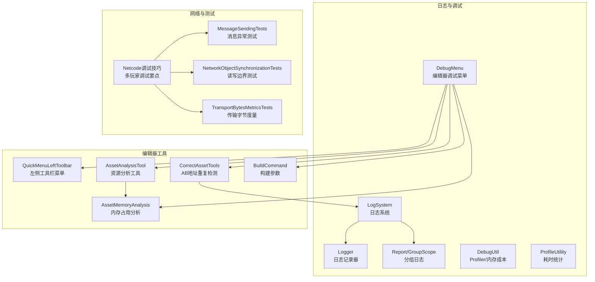
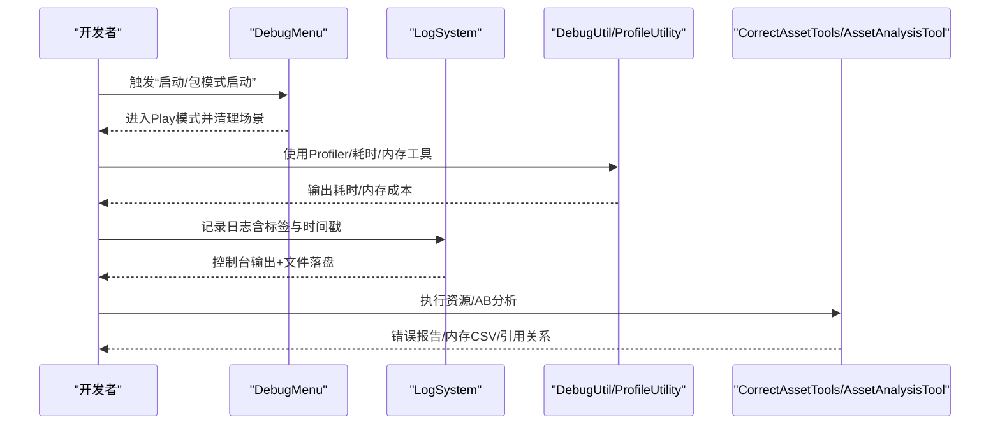
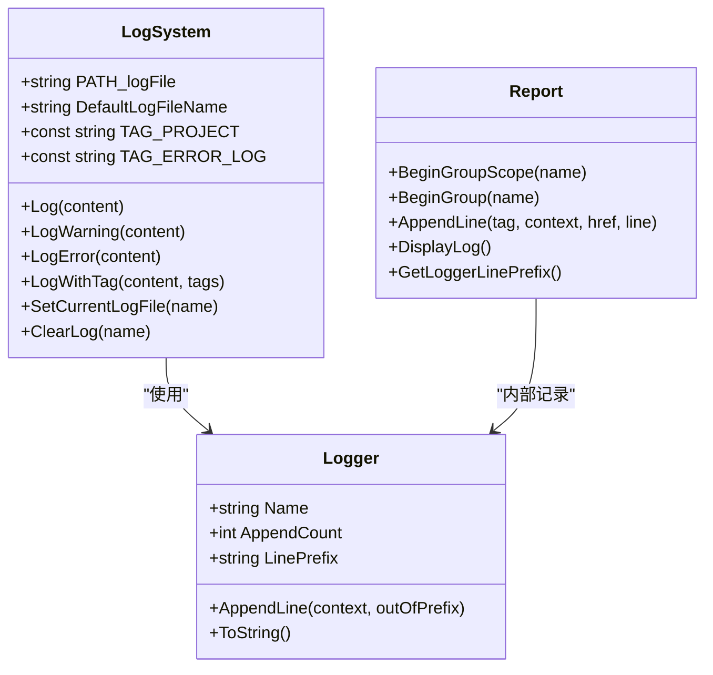
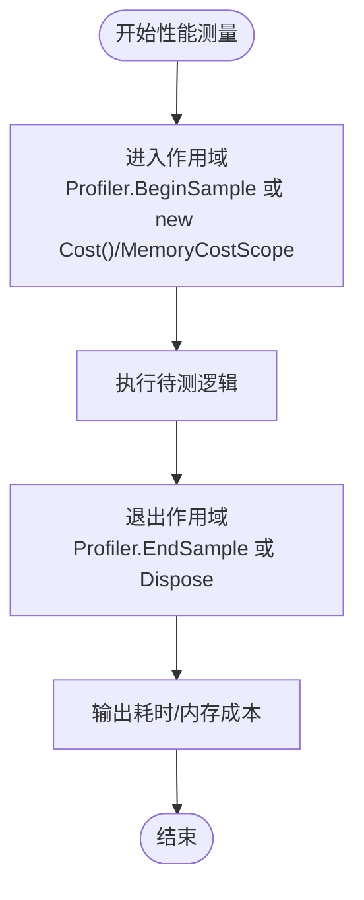
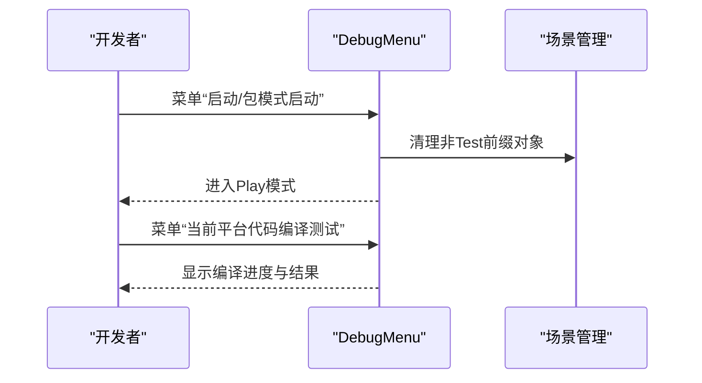
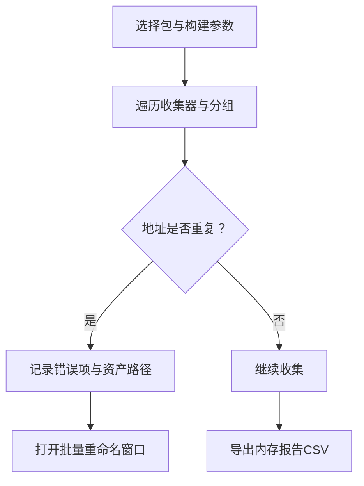
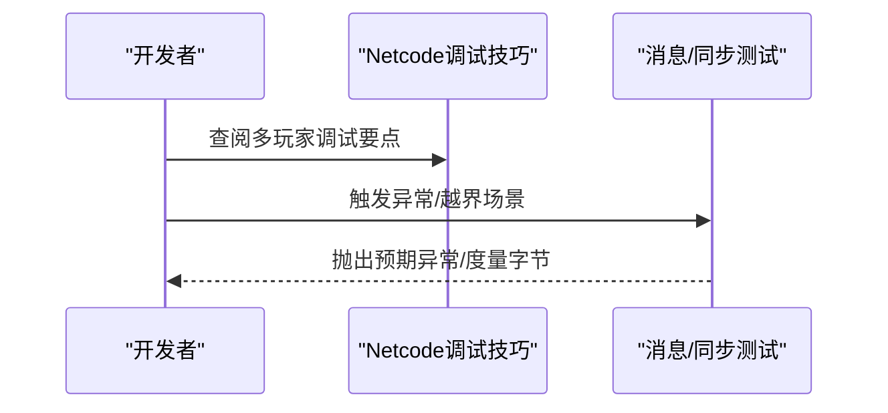
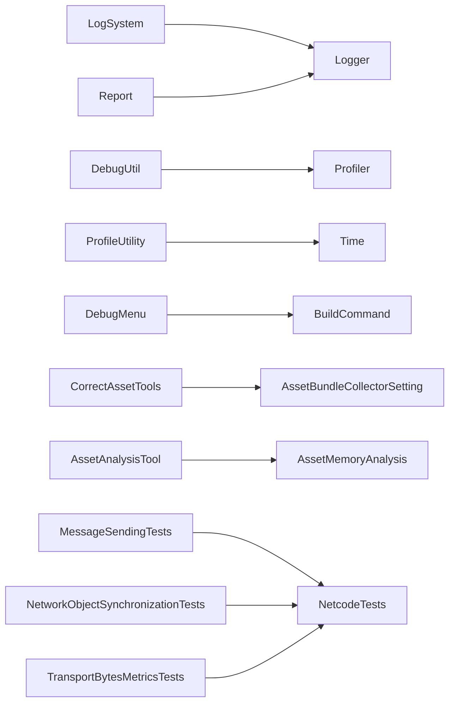

# 故障排除与调试

<cite>
**本文引用的文件**
- [LogSystem.cs](file://Assets/Scripts/Systems/Implement/LogSystem/LogSystem.cs)
- [Logger.cs](file://Assets/Scripts/Systems/Implement/LogSystem/Logger.cs)
- [Report.cs](file://Assets/Scripts/Systems/Implement/LogSystem/Report.cs)
- [DebugUtil.cs](file://Assets/Scripts/RuntimeEditor/DebugUtil.cs)
- [ProfileUtility.cs](file://Assets/Scripts/Profiler/ProfileUtility.cs)
- [DebugMenu.cs](file://Assets/Scripts/RuntimeEditor/DebugMenu.cs)
- [QuickMenuLeftToolbar.cs](file://Assets/Scripts/Editor/AssetBundleBuild/QuickMenuLeftToolbar.cs)
- [CorrectAssetTools.cs](file://Assets/Scripts/Editor/AssetBundleBuild/CorrectAssetTools.cs)
- [AssetAnalysisTool.cs](file://Assets/Scripts/Editor/AssetAnalysisTools/AssetAnalysisTool.cs)
- [AssetMemoryAnalysis.cs](file://Assets/Scripts/Editor/AssetAnalysisTools/AssetMemoryAnalysis.cs)
- [AssetBundleCollectorSetting.asset](file://Assets/Resources/AssetBundleCollectorSetting.asset)
- [DeAddressExisting.cs](file://Assets/Dev/Lab/Scripts/DeAddressExisting.cs)
- [MessageSendingTests.cs](file://LocalPackages/com.unity.netcode.gameobjects@1.14.1/Tests/Editor/Messaging/MessageSendingTests.cs)
- [NetworkObjectSynchronizationTests.cs](file://LocalPackages/com.unity.netcode.gameobjects@1.14.1/Tests/Runtime/NetworkObject/NetworkObjectSynchronizationTests.cs)
- [TransportBytesMetricsTests.cs](file://LocalPackages/com.unity.netcode.gameobjects@1.14.1/Tests/Runtime/Metrics/TransportBytesMetricsTests.cs)
- [techniques_and_tricks_for_debugging_multiplayer_games.md](file://LocalPackages/com.unity.netcode.gameobjects@1.14.1/Documentation~/tutorials/testing/techniques_and_tricks_for_debugging_multiplayer_games.md)
- [BuildCommand.cs](file://Assets/Scripts/Editor/PlayerBuild/BuildCommand.cs)
</cite>

## 目录
1. 引言
2. 项目结构
3. 核心组件
4. 架构总览
5. 详细组件分析
6. 依赖关系分析
7. 性能注意事项
8. 故障排除指南
9. 结论
10. 附录

## 引言
本指南面向ProjectR项目开发者，聚焦于“故障排除与调试”的实用方法与最佳实践。内容覆盖日志系统、错误信息解读、异常处理、性能与内存分析、网络与资源加载问题排查、编辑器调试工具与快捷键、断点与变量监视等，帮助快速定位问题并高效修复。

## 项目结构
ProjectR在Assets与LocalPackages中提供了丰富的调试与分析能力：
- 日志系统：统一的日志格式化、时间戳、标签分类与文件落盘。
- 运行时与编辑器性能工具：Profiler采样、耗时统计、内存成本测量。
- 编辑器调试菜单与快捷入口：一键启动、AB模式、编译测试、引用分析。
- 资源与AB构建校验：地址重复检测、错误报告、内存占用分析。
- 网络与消息层测试：异常消息类型、序列化边界、传输度量。

图表来源
- [LogSystem.cs:1-156](file://Assets/Scripts/Systems/Implement/LogSystem/LogSystem.cs#L1-L156)
- [Logger.cs:1-51](file://Assets/Scripts/Systems/Implement/LogSystem/Logger.cs#L1-L51)
- [Report.cs:49-143](file://Assets/Scripts/Systems/Implement/LogSystem/Report.cs#L49-L143)
- [DebugUtil.cs:1-34](file://Assets/Scripts/RuntimeEditor/DebugUtil.cs#L1-L34)
- [ProfileUtility.cs:1-28](file://Assets/Scripts/Profiler/ProfileUtility.cs#L1-L28)
- [DebugMenu.cs:1-165](file://Assets/Scripts/RuntimeEditor/DebugMenu.cs#L1-L165)
- [QuickMenuLeftToolbar.cs:1-75](file://Assets/Scripts/Editor/AssetBundleBuild/QuickMenuLeftToolbar.cs#L1-L75)
- [CorrectAssetTools.cs:1-234](file://Assets/Scripts/Editor/AssetBundleBuild/CorrectAssetTools.cs#L1-L234)
- [AssetAnalysisTool.cs:1-800](file://Assets/Scripts/Editor/AssetAnalysisTools/AssetAnalysisTool.cs#L1-L800)
- [AssetMemoryAnalysis.cs:1-576](file://Assets/Scripts/Editor/AssetAnalysisTools/AssetMemoryAnalysis.cs#L1-L576)
- [techniques_and_tricks_for_debugging_multiplayer_games.md:170-177](file://LocalPackages/com.unity.netcode.gameobjects@1.14.1/Documentation~/tutorials/testing/techniques_and_tricks_for_debugging_multiplayer_games.md#L170-L177)

章节来源
- [LogSystem.cs:1-156](file://Assets/Scripts/Systems/Implement/LogSystem/LogSystem.cs#L1-L156)
- [DebugMenu.cs:1-165](file://Assets/Scripts/RuntimeEditor/DebugMenu.cs#L1-L165)

## 核心组件
- 日志系统（LogSystem）：提供统一的时间戳、标签、内容拼接与文件落盘；支持不同环境下的日志文件名切换与清空。
- 分组日志（Report/GroupScope）：支持嵌套分组、超链接生成、前缀控制与批量输出。
- 运行时性能工具（DebugUtil/ProfileUtility）：Profiler采样、耗时统计、内存成本测量。
- 编辑器调试菜单（DebugMenu）：一键启动、包模式启动、代码编译测试、场景清理与事件监听。
- 资源与AB工具（CorrectAssetTools/AssetAnalysisTool/AssetMemoryAnalysis）：AB地址重复检测、资源内存报告、引用分析、CSV导出。
- 构建参数（BuildCommand）：构建目标、输出根目录、压缩选项、复制路径等。

章节来源
- [LogSystem.cs:1-156](file://Assets/Scripts/Systems/Implement/LogSystem/LogSystem.cs#L1-L156)
- [Report.cs:49-143](file://Assets/Scripts/Systems/Implement/LogSystem/Report.cs#L49-L143)
- [DebugUtil.cs:1-34](file://Assets/Scripts/RuntimeEditor/DebugUtil.cs#L1-L34)
- [ProfileUtility.cs:1-28](file://Assets/Scripts/Profiler/ProfileUtility.cs#L1-L28)
- [DebugMenu.cs:1-165](file://Assets/Scripts/RuntimeEditor/DebugMenu.cs#L1-L165)
- [CorrectAssetTools.cs:1-234](file://Assets/Scripts/Editor/AssetBundleBuild/CorrectAssetTools.cs#L1-L234)
- [AssetAnalysisTool.cs:1-800](file://Assets/Scripts/Editor/AssetAnalysisTools/AssetAnalysisTool.cs#L1-L800)
- [AssetMemoryAnalysis.cs:1-576](file://Assets/Scripts/Editor/AssetAnalysisTools/AssetMemoryAnalysis.cs#L1-L576)
- [BuildCommand.cs:544-585](file://Assets/Scripts/Editor/PlayerBuild/BuildCommand.cs#L544-L585)

## 架构总览
日志与调试模块贯穿运行时与编辑器两端，形成“采集—组织—落盘/输出—可视化”的闭环。编辑器侧通过菜单与工具扩展提供快速入口，运行时侧通过Profiler与自定义耗时/内存工具进行性能观测。

图表来源
- [DebugMenu.cs:51-96](file://Assets/Scripts/RuntimeEditor/DebugMenu.cs#L51-L96)
- [LogSystem.cs:35-84](file://Assets/Scripts/Systems/Implement/LogSystem/LogSystem.cs#L35-L84)
- [DebugUtil.cs:5-34](file://Assets/Scripts/RuntimeEditor/DebugUtil.cs#L5-L34)
- [ProfileUtility.cs:6-28](file://Assets/Scripts/Profiler/ProfileUtility.cs#L6-L28)
- [CorrectAssetTools.cs:13-88](file://Assets/Scripts/Editor/AssetBundleBuild/CorrectAssetTools.cs#L13-L88)
- [AssetAnalysisTool.cs:574-779](file://Assets/Scripts/Editor/AssetAnalysisTools/AssetAnalysisTool.cs#L574-L779)

## 详细组件分析

### 日志系统（LogSystem/Logger/Report）
- 统一格式：时间戳、标签、内容；支持多标签拼接与空格分隔。
- 文件落盘：根据环境选择日志文件名，默认输出到持久化目录；支持清空。
- 分组日志：Report提供BeginGroup/EndGroup与GroupScope，支持超链接与层级前缀。
- 使用建议：按模块/功能打标签；关键路径输出；异常与错误使用专用标签；必要时开启文件落盘以便离线分析。

图表来源
- [LogSystem.cs:8-156](file://Assets/Scripts/Systems/Implement/LogSystem/LogSystem.cs#L8-L156)
- [Logger.cs:6-51](file://Assets/Scripts/Systems/Implement/LogSystem/Logger.cs#L6-L51)
- [Report.cs:49-143](file://Assets/Scripts/Systems/Implement/LogSystem/Report.cs#L49-L143)

章节来源
- [LogSystem.cs:35-154](file://Assets/Scripts/Systems/Implement/LogSystem/LogSystem.cs#L35-L154)
- [Logger.cs:6-51](file://Assets/Scripts/Systems/Implement/LogSystem/Logger.cs#L6-L51)
- [Report.cs:62-131](file://Assets/Scripts/Systems/Implement/LogSystem/Report.cs#L62-L131)

### 性能与内存工具（DebugUtil/ProfileUtility）
- DebugUtil：Profiler.BeginSample/EndSample包裹，MemoryCostScope记录GC前后内存差值，便于定位热点。
- ProfileUtility：Cost结构体记录起止时间，Dispose时输出毫秒级耗时，适合粗粒度性能评估。

图表来源
- [DebugUtil.cs:5-34](file://Assets/Scripts/RuntimeEditor/DebugUtil.cs#L5-L34)
- [ProfileUtility.cs:6-28](file://Assets/Scripts/Profiler/ProfileUtility.cs#L6-L28)

章节来源
- [DebugUtil.cs:1-34](file://Assets/Scripts/RuntimeEditor/DebugUtil.cs#L1-L34)
- [ProfileUtility.cs:1-28](file://Assets/Scripts/Profiler/ProfileUtility.cs#L1-L28)

### 编辑器调试菜单（DebugMenu）
- 快捷启动：F5启动/停止，支持“包模式”启动（AB模式）。
- 场景清理：自动清理非Test前缀对象，保留调试用常驻节点。
- 代码编译测试：针对当前平台编译Player脚本，快速验证编译链路。
- 事件监听：监听PlayMode状态变化，触发场景创建与清理。

图表来源
- [DebugMenu.cs:51-161](file://Assets/Scripts/RuntimeEditor/DebugMenu.cs#L51-L161)

章节来源
- [DebugMenu.cs:18-96](file://Assets/Scripts/RuntimeEditor/DebugMenu.cs#L18-L96)

### 资源与AB构建校验（CorrectAssetTools/AssetAnalysisTool/AssetMemoryAnalysis）
- AB地址重复检测：遍历收集器，统计相同地址映射，输出重复项与资产路径列表，支持批量重命名。
- 资源内存报告：对纹理、模型、动画等计算内存占用，导出CSV，支持过滤与路径排除。
- 引用分析：提供引用计数、外部引用检查、刷新缓存等功能，辅助定位资源冗余与泄露。

图表来源
- [CorrectAssetTools.cs:90-230](file://Assets/Scripts/Editor/AssetBundleBuild/CorrectAssetTools.cs#L90-L230)
- [AssetAnalysisTool.cs:574-779](file://Assets/Scripts/Editor/AssetAnalysisTools/AssetAnalysisTool.cs#L574-L779)
- [AssetMemoryAnalysis.cs:520-548](file://Assets/Scripts/Editor/AssetAnalysisTools/AssetMemoryAnalysis.cs#L520-L548)

章节来源
- [CorrectAssetTools.cs:13-88](file://Assets/Scripts/Editor/AssetBundleBuild/CorrectAssetTools.cs#L13-L88)
- [AssetAnalysisTool.cs:574-779](file://Assets/Scripts/Editor/AssetAnalysisTools/AssetAnalysisTool.cs#L574-L779)
- [AssetMemoryAnalysis.cs:361-387](file://Assets/Scripts/Editor/AssetAnalysisTools/AssetMemoryAnalysis.cs#L361-L387)

### 构建参数与配置（BuildCommand/AssetBundleCollectorSetting）
- 构建参数：构建模式、文件名风格、内置文件拷贝策略、压缩选项、复制路径等。
- 配置文件：AssetBundleCollectorSetting.asset定义包、分组、收集器、地址规则等，是AB构建与校验的基础。

章节来源
- [BuildCommand.cs:544-585](file://Assets/Scripts/Editor/PlayerBuild/BuildCommand.cs#L544-L585)
- [AssetBundleCollectorSetting.asset:1-49](file://Assets/Resources/AssetBundleCollectorSetting.asset#L1-L49)

### 网络与消息层调试（Netcode测试与技巧）
- 多人调试技巧：提高FixedTimeStep以观察帧步进；高延迟模拟滞后隐藏效果。
- 消息异常测试：未注册处理器抛出异常；读写越界/异常场景验证缓冲区回滚与错误提示。
- 传输度量：统计发送/接收字节数，验证消息大小与对齐。

图表来源
- [techniques_and_tricks_for_debugging_multiplayer_games.md:170-177](file://LocalPackages/com.unity.netcode.gameobjects@1.14.1/Documentation~/tutorials/testing/techniques_and_tricks_for_debugging_multiplayer_games.md#L170-L177)
- [MessageSendingTests.cs:349-369](file://LocalPackages/com.unity.netcode.gameobjects@1.14.1/Tests/Editor/Messaging/MessageSendingTests.cs#L349-L369)
- [NetworkObjectSynchronizationTests.cs:463-514](file://LocalPackages/com.unity.netcode.gameobjects@1.14.1/Tests/Runtime/NetworkObject/NetworkObjectSynchronizationTests.cs#L463-L514)
- [TransportBytesMetricsTests.cs:75-111](file://LocalPackages/com.unity.netcode.gameobjects@1.14.1/Tests/Runtime/Metrics/TransportBytesMetricsTests.cs#L75-L111)

章节来源
- [techniques_and_tricks_for_debugging_multiplayer_games.md:170-177](file://LocalPackages/com.unity.netcode.gameobjects@1.14.1/Documentation~/tutorials/testing/techniques_and_tricks_for_debugging_multiplayer_games.md#L170-L177)
- [MessageSendingTests.cs:349-369](file://LocalPackages/com.unity.netcode.gameobjects@1.14.1/Tests/Editor/Messaging/MessageSendingTests.cs#L349-L369)
- [NetworkObjectSynchronizationTests.cs:463-514](file://LocalPackages/com.unity.netcode.gameobjects@1.14.1/Tests/Runtime/NetworkObject/NetworkObjectSynchronizationTests.cs#L463-L514)
- [TransportBytesMetricsTests.cs:75-111](file://LocalPackages/com.unity.netcode.gameobjects@1.14.1/Tests/Runtime/Metrics/TransportBytesMetricsTests.cs#L75-L111)

## 依赖关系分析
- 日志系统依赖Unity的Debug与文件IO；分组日志依赖Logger与超链接生成。
- 性能工具依赖Unity Profiler与GC API；与日志系统解耦，可独立使用。
- 编辑器菜单依赖UnityEditor事件与构建接口；与资源分析工具配合。
- 资源分析工具依赖Unity AssetDatabase与Profiler；与AB构建配置强关联。
- 网络测试依赖Netcode测试框架与度量接口。

图表来源
- [LogSystem.cs:35-154](file://Assets/Scripts/Systems/Implement/LogSystem/LogSystem.cs#L35-L154)
- [Logger.cs:6-51](file://Assets/Scripts/Systems/Implement/LogSystem/Logger.cs#L6-L51)
- [Report.cs:62-131](file://Assets/Scripts/Systems/Implement/LogSystem/Report.cs#L62-L131)
- [DebugUtil.cs:5-34](file://Assets/Scripts/RuntimeEditor/DebugUtil.cs#L5-L34)
- [ProfileUtility.cs:6-28](file://Assets/Scripts/Profiler/ProfileUtility.cs#L6-L28)
- [DebugMenu.cs:117-161](file://Assets/Scripts/RuntimeEditor/DebugMenu.cs#L117-L161)
- [CorrectAssetTools.cs:90-230](file://Assets/Scripts/Editor/AssetBundleBuild/CorrectAssetTools.cs#L90-L230)
- [AssetBundleCollectorSetting.asset:18-49](file://Assets/Resources/AssetBundleCollectorSetting.asset#L18-L49)
- [AssetAnalysisTool.cs:574-779](file://Assets/Scripts/Editor/AssetAnalysisTools/AssetAnalysisTool.cs#L574-L779)
- [AssetMemoryAnalysis.cs:520-548](file://Assets/Scripts/Editor/AssetAnalysisTools/AssetMemoryAnalysis.cs#L520-L548)

章节来源
- [DebugMenu.cs:117-161](file://Assets/Scripts/RuntimeEditor/DebugMenu.cs#L117-L161)
- [CorrectAssetTools.cs:90-230](file://Assets/Scripts/Editor/AssetBundleBuild/CorrectAssetTools.cs#L90-L230)

## 性能注意事项
- 使用Profiler采样与耗时/内存工具定位热点，避免在热路径频繁分配。
- 对大对象池化与复用，减少GC压力。
- 在编辑器侧使用“当前平台代码编译测试”，提前发现编译瓶颈。
- 资源侧优先使用纹理压缩与模型优化，结合内存报告CSV进行迭代。

## 故障排除指南

### 日志系统使用与错误解读
- 统一日志格式：时间戳+标签+内容；错误/异常使用专用标签，便于检索。
- 文件落盘：确认持久化目录存在且有写权限；必要时清空旧日志。
- 分组日志：使用BeginGroup/EndGroup组织上下文；必要时生成超链接便于跳转。

章节来源
- [LogSystem.cs:35-154](file://Assets/Scripts/Systems/Implement/LogSystem/LogSystem.cs#L35-L154)
- [Report.cs:62-131](file://Assets/Scripts/Systems/Implement/LogSystem/Report.cs#L62-L131)

### 性能问题排查
- 使用DebugUtil的Profiler采样与MemoryCostScope定位峰值；使用ProfileUtility的Cost结构体做粗粒度评估。
- 编辑器侧“当前平台代码编译测试”验证编译链路；关注构建时间与体积。
- 资源内存报告：导出CSV，筛选高内存对象，结合纹理/模型设置调整。

章节来源
- [DebugUtil.cs:5-34](file://Assets/Scripts/RuntimeEditor/DebugUtil.cs#L5-L34)
- [ProfileUtility.cs:6-28](file://Assets/Scripts/Profiler/ProfileUtility.cs#L6-L28)
- [DebugMenu.cs:117-161](file://Assets/Scripts/RuntimeEditor/DebugMenu.cs#L117-L161)
- [AssetAnalysisTool.cs:574-779](file://Assets/Scripts/Editor/AssetAnalysisTools/AssetAnalysisTool.cs#L574-L779)
- [AssetMemoryAnalysis.cs:520-548](file://Assets/Scripts/Editor/AssetAnalysisTools/AssetMemoryAnalysis.cs#L520-L548)

### 内存泄漏与崩溃
- 内存成本：使用MemoryCostScope对比GC前后内存，定位异常增长。
- 崩溃日志：确保日志文件名正确；关键路径增加日志；必要时启用文件落盘。
- 网络异常：参考Netcode测试中的异常场景，确保消息处理器注册与边界检查。

章节来源
- [DebugUtil.cs:20-34](file://Assets/Scripts/RuntimeEditor/DebugUtil.cs#L20-L34)
- [LogSystem.cs:133-154](file://Assets/Scripts/Systems/Implement/LogSystem/LogSystem.cs#L133-L154)
- [MessageSendingTests.cs:349-369](file://LocalPackages/com.unity.netcode.gameobjects@1.14.1/Tests/Editor/Messaging/MessageSendingTests.cs#L349-L369)

### 网络问题与消息异常
- 多人调试：提高FixedTimeStep、模拟高延迟，观察滞后隐藏效果。
- 消息异常：未注册处理器会抛出异常；读写越界应触发错误并回滚缓冲区。
- 度量验证：统计发送/接收字节数，核对消息大小与对齐。

章节来源
- [techniques_and_tricks_for_debugging_multiplayer_games.md:170-177](file://LocalPackages/com.unity.netcode.gameobjects@1.14.1/Documentation~/tutorials/testing/techniques_and_tricks_for_debugging_multiplayer_games.md#L170-L177)
- [MessageSendingTests.cs:349-369](file://LocalPackages/com.unity.netcode.gameobjects@1.14.1/Tests/Editor/Messaging/MessageSendingTests.cs#L349-L369)
- [NetworkObjectSynchronizationTests.cs:463-514](file://LocalPackages/com.unity.netcode.gameobjects@1.14.1/Tests/Runtime/NetworkObject/NetworkObjectSynchronizationTests.cs#L463-L514)
- [TransportBytesMetricsTests.cs:75-111](file://LocalPackages/com.unity.netcode.gameobjects@1.14.1/Tests/Runtime/Metrics/TransportBytesMetricsTests.cs#L75-L111)

### 资源加载失败与配置错误
- AB地址重复：使用“检查AB收集资源中的Address重复”，打开批量重命名窗口修正。
- 配置校验：检查AssetBundleCollectorSetting.asset中的包、分组、收集器与地址规则。
- 内存报告：导出CSV，定位高内存资源并优化纹理/模型设置。

章节来源
- [CorrectAssetTools.cs:13-88](file://Assets/Scripts/Editor/AssetBundleBuild/CorrectAssetTools.cs#L13-L88)
- [AssetBundleCollectorSetting.asset:18-49](file://Assets/Resources/AssetBundleCollectorSetting.asset#L18-L49)
- [AssetAnalysisTool.cs:574-779](file://Assets/Scripts/Editor/AssetAnalysisTools/AssetAnalysisTool.cs#L574-L779)
- [AssetMemoryAnalysis.cs:361-387](file://Assets/Scripts/Editor/AssetAnalysisTools/AssetMemoryAnalysis.cs#L361-L387)

### 开发工具、编辑器扩展与调试辅助
- 左侧工具栏菜单：QuickMenuLeftToolbar提供“AB引用/地址重复检测/编译测试/文档”等入口。
- 调试菜单：DebugMenu提供启动、包模式启动、代码编译测试、场景清理。
- 参考文档：Unity与Netcode官方文档与测试用例，作为异常与边界场景的依据。

章节来源
- [QuickMenuLeftToolbar.cs:51-71](file://Assets/Scripts/Editor/AssetBundleBuild/QuickMenuLeftToolbar.cs#L51-L71)
- [DebugMenu.cs:51-161](file://Assets/Scripts/RuntimeEditor/DebugMenu.cs#L51-L161)

### 调试快捷键与断点/变量监视
- 快捷键：F5用于启动/停止；Shift+F5用于保留Test前缀对象的场景清理；Ctrl+Shift+F5用于当前平台编译测试。
- 断点：在编辑器暂停时注意连接超时风险，必要时临时提高超时。
- 变量监视：结合Profiler采样与日志标签，定位变量变化与性能影响。

章节来源
- [DebugMenu.cs:51-161](file://Assets/Scripts/RuntimeEditor/DebugMenu.cs#L51-L161)
- [techniques_and_tricks_for_debugging_multiplayer_games.md:174-177](file://LocalPackages/com.unity.netcode.gameobjects@1.14.1/Documentation~/tutorials/testing/techniques_and_tricks_for_debugging_multiplayer_games.md#L174-L177)

## 结论
通过统一的日志体系、编辑器调试菜单、资源与AB分析工具以及网络测试与度量，ProjectR提供了从问题定位到性能优化的完整调试闭环。建议在日常开发中坚持“可观测性优先”，配合分组日志、Profiler采样与内存成本测量，快速识别并解决问题。

## 附录
- 常用操作清单
  - 启动/停止：菜单“Debug/Launch”或F5
  - 包模式启动：菜单“Debug/Launch包模式”或Ctrl+F5
  - 当前平台编译测试：菜单“Debug/当前平台代码编译测试”或Ctrl+Shift+F5
  - AB地址重复检测：菜单“Asset相关工具/检查AB收集资源中的Address重复”
  - 资源内存报告：菜单“Tools/资源内存占用CSV报告”
  - 清理场景：保留Test前缀对象，删除其他对象
- 关键文件索引
  - 日志：LogSystem.cs、Logger.cs、Report.cs
  - 性能：DebugUtil.cs、ProfileUtility.cs
  - 调试菜单：DebugMenu.cs
  - AB与资源：CorrectAssetTools.cs、AssetAnalysisTool.cs、AssetMemoryAnalysis.cs、AssetBundleCollectorSetting.asset
  - 构建参数：BuildCommand.cs
  - 网络测试：MessageSendingTests.cs、NetworkObjectSynchronizationTests.cs、TransportBytesMetricsTests.cs、techniques_and_tricks_for_debugging_multiplayer_games.md