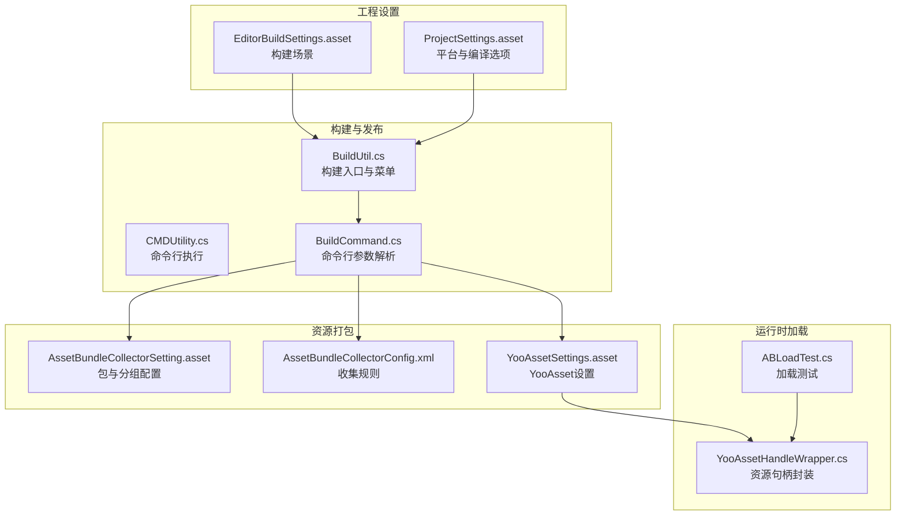
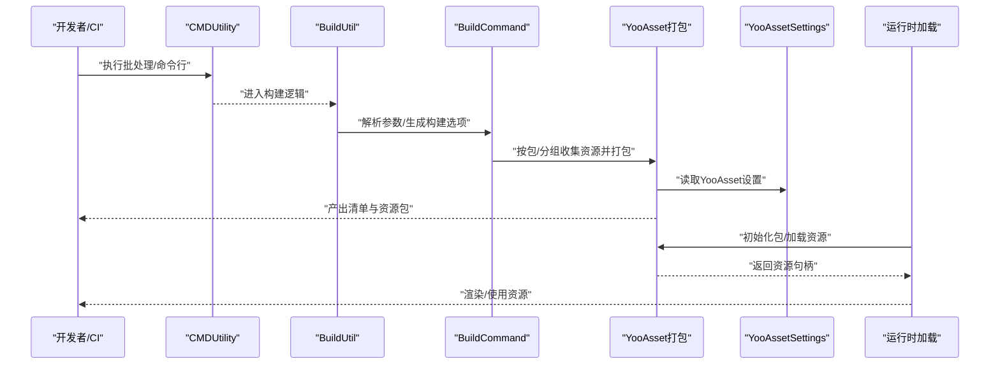
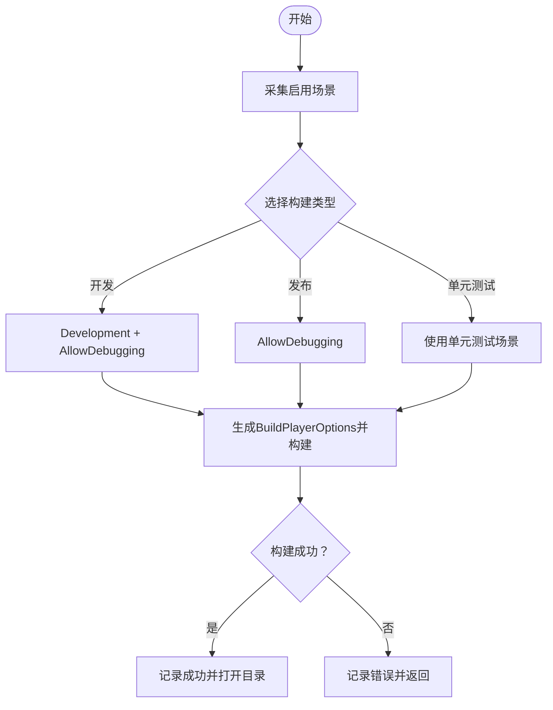
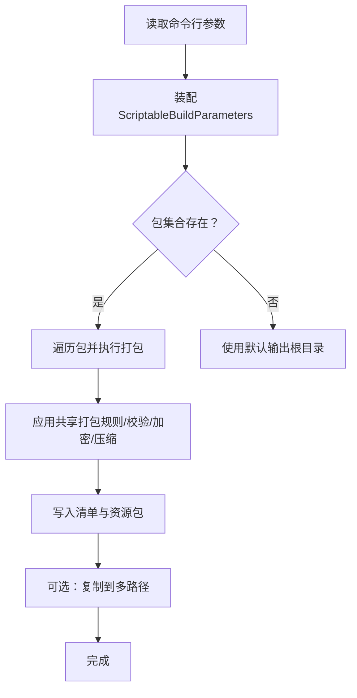
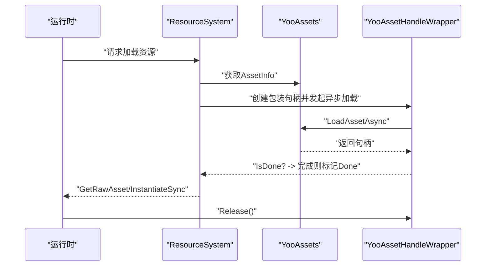
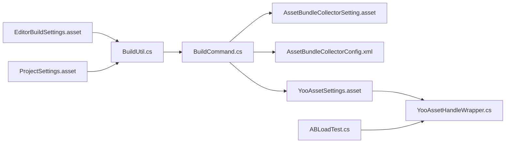

# 构建与部署

<cite>
**本文引用的文件**
- [ProjectSettings\EditorBuildSettings.asset](file://ProjectSettings/EditorBuildSettings.asset)
- [ProjectSettings\ProjectSettings.asset](file://ProjectSettings/ProjectSettings.asset)
- [Assets\Scripts\Utility\BuildUtil.cs](file://Assets/Scripts/Utility/BuildUtil.cs)
- [Assets\Scripts\Utility\CMDUtility.cs](file://Assets/Scripts/Utility/CMDUtility.cs)
- [Assets\Scripts\Editor\PlayerBuild\BuildCommand.cs](file://Assets/Scripts/Editor/PlayerBuild/BuildCommand.cs)
- [Assets\Resources\AssetBundleCollectorSetting.asset](file://Assets/Resources/AssetBundleCollectorSetting.asset)
- [Assets\Resources\AssetBundleCollectorConfig.xml](file://Assets/Resources/AssetBundleCollectorConfig.xml)
- [Assets\Resources\YooAssetSettings.asset](file://Assets/Resources/YooAssetSettings.asset)
- [Assets\Scripts\Systems\Implement\ResourceSystem\YooAssetHandleWrapper.cs](file://Assets/Scripts/Systems/Implement/ResourceSystem/YooAssetHandleWrapper.cs)
- [Assets\Dev\Lab\Scripts\ABLoadTest.cs](file://Assets/Dev/Lab/Scripts/ABLoadTest.cs)
</cite>

## 目录
1. [简介](#简介)
2. [项目结构](#项目结构)
3. [核心组件](#核心组件)
4. [架构总览](#架构总览)
5. [详细组件分析](#详细组件分析)
6. [依赖关系分析](#依赖关系分析)
7. [性能考量](#性能考量)
8. [故障排查指南](#故障排查指南)
9. [结论](#结论)
10. [附录](#附录)

## 简介
本文件面向ProjectR项目的构建与部署，系统性梳理构建流程、打包策略、发布准备、跨平台配置、资源打包与YooAsset热更新方案、CI/CD自动化思路、性能优化与包体控制、部署脚本与版本管理最佳实践，并总结常见问题与解决方案。内容兼顾工程落地与可操作性，帮助团队建立稳定高效的构建与发布体系。

## 项目结构
ProjectR采用Unity工程组织方式，构建与发布相关的关键位置如下：
- 构建入口与编辑器工具：Assets/Scripts/Utility/BuildUtil.cs、Assets/Scripts/Utility/CMDUtility.cs
- 构建命令与参数解析：Assets/Scripts/Editor/PlayerBuild/BuildCommand.cs
- 资源打包与YooAsset配置：Assets/Resources/AssetBundleCollectorSetting.asset、Assets/Resources/AssetBundleCollectorConfig.xml、Assets/Resources/YooAssetSettings.asset
- 运行时资源加载封装：Assets/Scripts/Systems/Implement/ResourceSystem/YooAssetHandleWrapper.cs
- 资源加载测试：Assets/Dev/Lab/Scripts/ABLoadTest.cs
- 编辑器构建场景与地址化配置：ProjectSettings/EditorBuildSettings.asset、ProjectSettings/ProjectSettings.asset

图表来源
- [Assets\Scripts\Utility\BuildUtil.cs:1-469](file://Assets/Scripts/Utility/BuildUtil.cs#L1-L469)
- [Assets\Scripts\Utility\CMDUtility.cs:1-150](file://Assets/Scripts/Utility/CMDUtility.cs#L1-L150)
- [Assets\Scripts\Editor\PlayerBuild\BuildCommand.cs:544-627](file://Assets/Scripts/Editor/PlayerBuild/BuildCommand.cs#L544-L627)
- [Assets\Resources\AssetBundleCollectorSetting.asset:1-63](file://Assets/Resources/AssetBundleCollectorSetting.asset#L1-L63)
- [Assets\Resources\AssetBundleCollectorConfig.xml:1-14](file://Assets/Resources/AssetBundleCollectorConfig.xml#L1-L14)
- [Assets\Resources\YooAssetSettings.asset:1-17](file://Assets/Resources/YooAssetSettings.asset#L1-L17)
- [Assets\Scripts\Systems\Implement\ResourceSystem\YooAssetHandleWrapper.cs:1-97](file://Assets/Scripts/Systems/Implement/ResourceSystem/YooAssetHandleWrapper.cs#L1-L97)
- [Assets\Dev\Lab\Scripts\ABLoadTest.cs:50-107](file://Assets/Dev/Lab/Scripts/ABLoadTest.cs#L50-L107)
- [ProjectSettings\EditorBuildSettings.asset:1-13](file://ProjectSettings/EditorBuildSettings.asset#L1-L13)
- [ProjectSettings\ProjectSettings.asset:1-800](file://ProjectSettings/ProjectSettings.asset#L1-L800)

章节来源
- [ProjectSettings\EditorBuildSettings.asset:1-13](file://ProjectSettings/EditorBuildSettings.asset#L1-L13)
- [ProjectSettings\ProjectSettings.asset:1-800](file://ProjectSettings/ProjectSettings.asset#L1-L800)

## 核心组件
- 构建入口与交互
  - BuildUtil：提供构建菜单、场景采集、构建选项生成、DLL热替换等能力，支持开发/发布两种模式的构建选项组合。
  - CMDUtility：封装命令行批处理与通用命令执行，支持批处理模式检测与参数解析。
- 资源打包与YooAsset
  - BuildCommand：解析命令行参数，驱动YooAsset打包流程，支持增量构建、文件名风格、内置文件拷贝策略、压缩选项与多路径复制。
  - AssetBundleCollectorSetting/Config：定义包与分组、收集器、过滤规则、地址规则等，决定资源如何被打包与定位。
  - YooAssetSettings：指定清单文件名与默认Yoo文件夹名，影响运行时加载路径与清单结构。
- 运行时资源加载
  - YooAssetHandleWrapper：对YooAsset的资源句柄进行封装，统一异步加载、完成状态、资源获取与释放。
  - ABLoadTest：演示初始化包、注册日志回调、加载资源并实例化的流程，便于验证打包与加载链路。

章节来源
- [Assets\Scripts\Utility\BuildUtil.cs:1-469](file://Assets/Scripts/Utility/BuildUtil.cs#L1-L469)
- [Assets\Scripts\Utility\CMDUtility.cs:1-150](file://Assets/Scripts/Utility/CMDUtility.cs#L1-L150)
- [Assets\Scripts\Editor\PlayerBuild\BuildCommand.cs:544-627](file://Assets/Scripts/Editor/PlayerBuild/BuildCommand.cs#L544-L627)
- [Assets\Resources\AssetBundleCollectorSetting.asset:1-63](file://Assets/Resources/AssetBundleCollectorSetting.asset#L1-L63)
- [Assets\Resources\AssetBundleCollectorConfig.xml:1-14](file://Assets/Resources/AssetBundleCollectorConfig.xml#L1-L14)
- [Assets\Resources\YooAssetSettings.asset:1-17](file://Assets/Resources/YooAssetSettings.asset#L1-L17)
- [Assets\Scripts\Systems\Implement\ResourceSystem\YooAssetHandleWrapper.cs:1-97](file://Assets/Scripts/Systems/Implement/ResourceSystem/YooAssetHandleWrapper.cs#L1-L97)
- [Assets\Dev\Lab\Scripts\ABLoadTest.cs:50-107](file://Assets/Dev/Lab/Scripts/ABLoadTest.cs#L50-L107)

## 架构总览
下图展示从命令行到打包、再到运行时加载的整体流程：

图表来源
- [Assets\Scripts\Utility\CMDUtility.cs:1-150](file://Assets/Scripts/Utility/CMDUtility.cs#L1-L150)
- [Assets\Scripts\Utility\BuildUtil.cs:1-469](file://Assets/Scripts/Utility/BuildUtil.cs#L1-L469)
- [Assets\Scripts\Editor\PlayerBuild\BuildCommand.cs:544-627](file://Assets/Scripts/Editor/PlayerBuild/BuildCommand.cs#L544-L627)
- [Assets\Resources\YooAssetSettings.asset:1-17](file://Assets/Resources/YooAssetSettings.asset#L1-L17)
- [Assets\Scripts\Systems\Implement\ResourceSystem\YooAssetHandleWrapper.cs:1-97](file://Assets/Scripts/Systems/Implement/ResourceSystem/YooAssetHandleWrapper.cs#L1-L97)

## 详细组件分析

### 构建入口与交互（BuildUtil）
- 功能要点
  - 场景采集：从EditorBuildSettings读取启用场景，确保构建场景列表有效。
  - 构建选项：提供开发/发布两种BuildOptions组合；支持单元测试场景专用构建。
  - 菜单与快捷键：Odin菜单与快捷键触发常用构建动作，如打开构建目录、带名称构建、清理并构建等。
  - DLL热替换：在已有构建产物基础上，仅替换编译出的第三方DLL与对应PDB，减少全量构建时间。
- 关键行为
  - 生成BuildPlayerOptions并调用BuildPipeline.BuildPlayer，失败时记录错误并返回false。
  - 支持自定义构建名格式（默认/自定义/时间戳），并可选择是否清理旧构建。

图表来源
- [Assets\Scripts\Utility\BuildUtil.cs:66-127](file://Assets/Scripts/Utility/BuildUtil.cs#L66-L127)
- [ProjectSettings\EditorBuildSettings.asset:7-12](file://ProjectSettings/EditorBuildSettings.asset#L7-L12)

章节来源
- [Assets\Scripts\Utility\BuildUtil.cs:1-469](file://Assets/Scripts/Utility/BuildUtil.cs#L1-L469)
- [ProjectSettings\EditorBuildSettings.asset:1-13](file://ProjectSettings/EditorBuildSettings.asset#L1-L13)

### 命令行与批处理（CMDUtility）
- 功能要点
  - 批处理执行：以非交互方式运行.bat文件，捕获标准输出与错误，打印日志并返回结果。
  - 通用命令执行：支持传入任意命令与参数，适用于CI环境下的Unity Headless构建。
  - 批处理模式检测：通过判断命令行参数识别是否处于批处理模式，便于在不同环境下调整日志与行为。
- 应用建议
  - 在CI中使用批处理模式与ExecuteMethod配合Unity命令行参数，实现无头构建与自动化流水线。

章节来源
- [Assets\Scripts\Utility\CMDUtility.cs:1-150](file://Assets/Scripts/Utility/CMDUtility.cs#L1-L150)

### 资源打包与YooAsset（BuildCommand）
- 功能要点
  - 参数解析：支持从命令行读取目标平台、输出根目录、构建模式、文件名风格、内置文件拷贝策略、压缩选项与多路径复制等。
  - 构建参数装配：根据包名与管线读取YooAsset设置，组装ScriptableBuildParameters，开启共享打包规则、结果校验、加密服务与压缩等。
  - 多包/多分组：遍历包集合，按配置执行打包，支持将产物复制到多个路径，便于分发与缓存。
- 关键配置项
  - 构建模式：增量构建/全量构建等。
  - 文件名风格：哈希命名等。
  - 内置文件拷贝：清空并复制全部/按参数复制。
  - 压缩选项：LZ4等。
  - 多路径复制：分发到多个目标路径。

图表来源
- [Assets\Scripts\Editor\PlayerBuild\BuildCommand.cs:544-627](file://Assets/Scripts/Editor/PlayerBuild/BuildCommand.cs#L544-L627)
- [Assets\Resources\AssetBundleCollectorSetting.asset:18-63](file://Assets/Resources/AssetBundleCollectorSetting.asset#L18-L63)
- [Assets\Resources\AssetBundleCollectorConfig.xml:2-14](file://Assets/Resources/AssetBundleCollectorConfig.xml#L2-L14)
- [Assets\Resources\YooAssetSettings.asset:15-17](file://Assets/Resources/YooAssetSettings.asset#L15-L17)

章节来源
- [Assets\Scripts\Editor\PlayerBuild\BuildCommand.cs:544-627](file://Assets/Scripts/Editor/PlayerBuild/BuildCommand.cs#L544-L627)
- [Assets\Resources\AssetBundleCollectorSetting.asset:1-63](file://Assets/Resources/AssetBundleCollectorSetting.asset#L1-L63)
- [Assets\Resources\AssetBundleCollectorConfig.xml:1-14](file://Assets/Resources/AssetBundleCollectorConfig.xml#L1-L14)
- [Assets\Resources\YooAssetSettings.asset:1-17](file://Assets/Resources/YooAssetSettings.asset#L1-L17)

### 运行时资源加载（YooAssetHandleWrapper）
- 功能要点
  - 封装AssetHandle/SubAssetsHandle，统一异步加载、完成状态查询、资源获取与释放。
  - 支持按路径与GUID加载资源，兼容编辑器与运行时环境。
  - 错误处理：当加载失败时记录错误并标记为错误状态，便于上层处理。
- 加载流程
  - 初始化包 -> 获取AssetInfo -> 异步加载 -> 判断完成 -> 实例化/使用 -> 释放句柄。

图表来源
- [Assets\Scripts\Systems\Implement\ResourceSystem\YooAssetHandleWrapper.cs:1-97](file://Assets/Scripts/Systems/Implement/ResourceSystem/YooAssetHandleWrapper.cs#L1-L97)
- [Assets\Dev\Lab\Scripts\ABLoadTest.cs:102-107](file://Assets/Dev/Lab/Scripts/ABLoadTest.cs#L102-L107)

章节来源
- [Assets\Scripts\Systems\Implement\ResourceSystem\YooAssetHandleWrapper.cs:1-97](file://Assets/Scripts/Systems/Implement/ResourceSystem/YooAssetHandleWrapper.cs#L1-L97)
- [Assets\Dev\Lab\Scripts\ABLoadTest.cs:50-107](file://Assets/Dev/Lab/Scripts/ABLoadTest.cs#L50-L107)

## 依赖关系分析
- 组件耦合
  - BuildUtil依赖EditorBuildSettings与BuildPipeline，负责场景采集与构建选项生成。
  - BuildCommand依赖YooAsset配置与打包参数，驱动资源打包。
  - YooAssetHandleWrapper依赖YooAssets运行时API，提供统一加载接口。
- 外部依赖
  - Unity构建管线与YooAsset包管理生态。
  - 可选的地址化系统（Addressables）在工程设置中已启用，可通过编辑器配置。

图表来源
- [ProjectSettings\EditorBuildSettings.asset:1-13](file://ProjectSettings/EditorBuildSettings.asset#L1-L13)
- [ProjectSettings\ProjectSettings.asset:1-800](file://ProjectSettings/ProjectSettings.asset#L1-L800)
- [Assets\Scripts\Utility\BuildUtil.cs:1-469](file://Assets/Scripts/Utility/BuildUtil.cs#L1-L469)
- [Assets\Scripts\Editor\PlayerBuild\BuildCommand.cs:544-627](file://Assets/Scripts/Editor/PlayerBuild/BuildCommand.cs#L544-L627)
- [Assets\Resources\AssetBundleCollectorSetting.asset:1-63](file://Assets/Resources/AssetBundleCollectorSetting.asset#L1-L63)
- [Assets\Resources\AssetBundleCollectorConfig.xml:1-14](file://Assets/Resources/AssetBundleCollectorConfig.xml#L1-L14)
- [Assets\Resources\YooAssetSettings.asset:1-17](file://Assets/Resources/YooAssetSettings.asset#L1-L17)
- [Assets\Scripts\Systems\Implement\ResourceSystem\YooAssetHandleWrapper.cs:1-97](file://Assets/Scripts/Systems/Implement/ResourceSystem/YooAssetHandleWrapper.cs#L1-L97)
- [Assets\Dev\Lab\Scripts\ABLoadTest.cs:50-107](file://Assets/Dev/Lab/Scripts/ABLoadTest.cs#L50-L107)

章节来源
- [ProjectSettings\EditorBuildSettings.asset:1-13](file://ProjectSettings/EditorBuildSettings.asset#L1-L13)
- [ProjectSettings\ProjectSettings.asset:1-800](file://ProjectSettings/ProjectSettings.asset#L1-L800)
- [Assets\Scripts\Utility\BuildUtil.cs:1-469](file://Assets/Scripts/Utility/BuildUtil.cs#L1-L469)
- [Assets\Scripts\Editor\PlayerBuild\BuildCommand.cs:544-627](file://Assets/Scripts/Editor/PlayerBuild/BuildCommand.cs#L544-L627)
- [Assets\Resources\AssetBundleCollectorSetting.asset:1-63](file://Assets/Resources/AssetBundleCollectorSetting.asset#L1-L63)
- [Assets\Resources\AssetBundleCollectorConfig.xml:1-14](file://Assets/Resources/AssetBundleCollectorConfig.xml#L1-L14)
- [Assets\Resources\YooAssetSettings.asset:1-17](file://Assets/Resources/YooAssetSettings.asset#L1-L17)
- [Assets\Scripts\Systems\Implement\ResourceSystem\YooAssetHandleWrapper.cs:1-97](file://Assets/Scripts/Systems/Implement/ResourceSystem/YooAssetHandleWrapper.cs#L1-L97)
- [Assets\Dev\Lab\Scripts\ABLoadTest.cs:50-107](file://Assets/Dev/Lab/Scripts/ABLoadTest.cs#L50-L107)

## 性能考量
- 构建性能
  - 开发/发布构建选项差异：开发构建启用调试允许，发布构建去除调试符号，缩短构建时间。
  - DLL热替换：仅替换第三方DLL与PDB，避免全量重新编译托管代码。
  - 增量打包：使用增量构建模式，减少重复打包与网络传输。
- 包体控制
  - 文件名风格：哈希命名利于缓存与去重。
  - 压缩选项：LZ4压缩在体积与解压速度间取得平衡。
  - 内置文件拷贝策略：按需复制，避免冗余资源。
- 加载速度
  - 共享打包规则：合并重复资源，降低包数量与网络请求。
  - 清单校验：保证清单完整性，避免加载失败重试。
  - 运行时句柄封装：统一完成状态与释放，减少泄漏与阻塞。

## 故障排查指南
- 构建失败
  - 症状：构建报告结果为Failed。
  - 排查：检查场景列表是否为空、构建选项是否正确、日志输出与错误信息。
  - 参考：构建入口对失败结果的错误记录与返回。
- DLL热替换失败
  - 症状：目标构建目录缺失或对应DLL/PDB不存在。
  - 排查：确认已有构建产物存在且路径正确；检查系统权限与文件占用。
- 资源加载异常
  - 症状：加载句柄LastError非空或IsDone为false。
  - 排查：核对资源路径/GUID映射、包初始化顺序、清单完整性。
- CI批处理模式
  - 症状：交互式日志缺失或无法手动确认。
  - 处理：通过批处理模式与命令行参数，确保日志输出与退出码可被CI捕获。

章节来源
- [Assets\Scripts\Utility\BuildUtil.cs:18-28](file://Assets/Scripts/Utility/BuildUtil.cs#L18-L28)
- [Assets\Scripts\Utility\BuildUtil.cs:136-212](file://Assets/Scripts/Utility/BuildUtil.cs#L136-L212)
- [Assets\Scripts\Systems\Implement\ResourceSystem\YooAssetHandleWrapper.cs:59-71](file://Assets/Scripts/Systems/Implement/ResourceSystem/YooAssetHandleWrapper.cs#L59-L71)
- [Assets\Scripts\Utility\CMDUtility.cs:108-118](file://Assets/Scripts/Utility/CMDUtility.cs#L108-L118)

## 结论
ProjectR的构建与部署体系以Unity编辑器工具与命令行为核心，结合YooAsset的资源打包与运行时加载，形成“参数化构建—资源打包—清单管理—运行时加载”的闭环。通过增量构建、哈希命名、LZ4压缩与DLL热替换等手段，可在保证稳定性的同时显著提升构建效率与加载性能。建议在CI中引入批处理模式与命令行参数，配合多路径复制与清单校验，实现自动化、可追溯的发布流程。

## 附录
- 平台与编译选项
  - 平台：Standalone、Android、iOS、WebGL等，具体API与图形作业模式在工程设置中配置。
  - 编译后处理：Strip Engine Code、Managed Stripping Level、Scripting Backend等，影响包体与性能。
- 发布准备
  - 场景清单：确保EditorBuildSettings中启用的场景完整。
  - 资源清单：YooAsset清单文件名与默认Yoo文件夹名需与运行时一致。
  - 版本管理：建议在打包阶段注入版本号，便于灰度与回滚。
- CI/CD建议
  - 使用批处理模式与ExecuteMethod，结合命令行参数驱动构建与打包。
  - 将产物复制到多路径，便于分发与缓存。
  - 对关键步骤增加超时与重试策略，保障稳定性。

章节来源
- [ProjectSettings\ProjectSettings.asset:374-487](file://ProjectSettings/ProjectSettings.asset#L374-L487)
- [ProjectSettings\ProjectSettings.asset:736-779](file://ProjectSettings/ProjectSettings.asset#L736-L779)
- [Assets\Resources\YooAssetSettings.asset:15-17](file://Assets/Resources/YooAssetSettings.asset#L15-L17)
- [Assets\Scripts\Editor\PlayerBuild\BuildCommand.cs:592-625](file://Assets/Scripts/Editor/PlayerBuild/BuildCommand.cs#L592-L625)