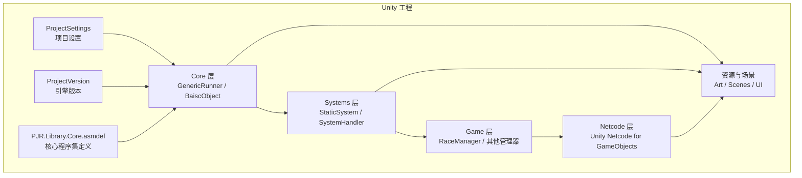
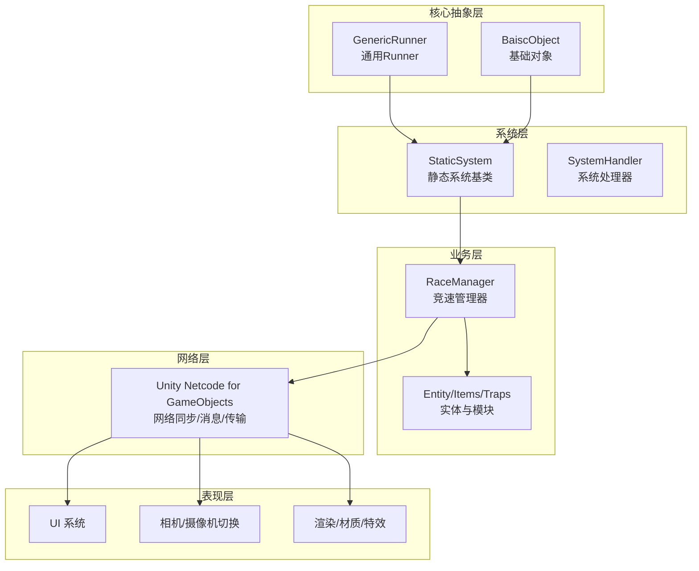
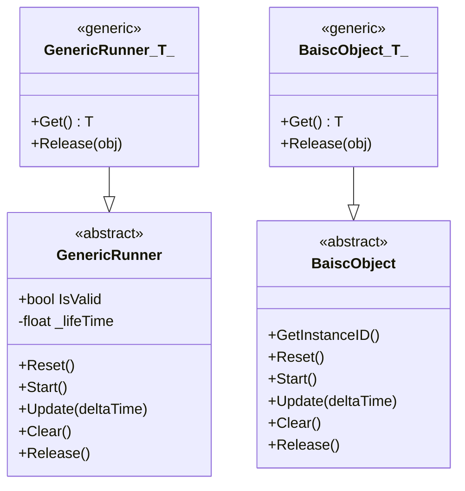
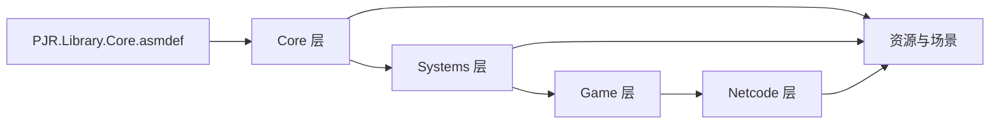

# 架构总览

<cite>
**本文引用的文件**
- [ProjectSettings.asset](file://ProjectSettings/ProjectSettings.asset)
- [ProjectVersion.txt](file://ProjectSettings/ProjectVersion.txt)
- [PJR.Library.Core.asmdef](file://Assets/Scripts/Core/PJR.Library.Core.asmdef)
- [GenericRunner.cs](file://Assets/Scripts/Core/GenericRunner/GenericRunner.cs)
- [BaiscObject.cs](file://Assets/Scripts/Core/BaiscObject.cs)
- [StaticSystem.cs](file://Assets/Scripts/Systems/StaticSystem.cs)
- [RaceManager.cs](file://Assets/Scripts/Game/Manager/RaceManager.cs)
- [package.json](file://LocalPackages/com.unity.netcode.gameobjects@1.14.1/package.json)
- [README.md](file://LocalPackages/com.unity.netcode.gameobjects@1.14.1/README.md)
</cite>

## 目录
1. [引言](#引言)
2. [项目结构](#项目结构)
3. [核心组件](#核心组件)
4. [架构总览](#架构总览)
5. [详细组件分析](#详细组件分析)
6. [依赖分析](#依赖分析)
7. [性能考量](#性能考量)
8. [故障排查指南](#故障排查指南)
9. [结论](#结论)
10. [附录](#附录)

## 引言
本架构文档面向 ProjectR 项目，聚焦于高层设计模式与系统边界，系统性阐述核心架构组件的交互关系、数据流向与集成模式，并对技术决策、权衡与约束进行说明。文档同时覆盖基础设施需求、可扩展性与部署拓扑建议，以及安全性、监控与灾难恢复等横切关注点。技术栈方面，项目基于 Unity 引擎（编辑器版本 2022.3.9f1），采用模块化脚本域组织与对象池化运行时组件；网络层采用 Unity Netcode for GameObjects（版本 1.14.1）作为基础能力。文档以渐进方式呈现，既适合非技术读者快速理解系统全貌，也提供深入到代码级的分析与可视化。

## 项目结构
ProjectR 采用“按功能域分层”的脚本组织方式，核心库与系统层位于 Assets/Scripts 下，配合 Unity 的程序集定义（asmdef）实现模块化与编译隔离。项目还包含大量美术资源、场景与配置资产，以及本地化的 Unity Package（Netcode）以支持多人联机能力。

- Unity 编辑器与平台设置集中在 ProjectSettings 中，包含渲染管线、输入管理、构建目标、脚本后端、宏定义等关键参数。
- 核心运行时框架由“通用Runner”与“基础对象”两类抽象构成，统一生命周期与对象池化策略。
- 系统层提供静态系统基类，便于无实例状态的全局逻辑挂载。
- 游戏管理器（如 RaceManager）作为业务域入口，承载具体玩法流程控制。
- 网络层通过 Unity Netcode 提供网络同步、消息与传输能力，项目本地引入对应 Package。

图表来源
- [ProjectSettings.asset](file://ProjectSettings/ProjectSettings.asset)
- [ProjectVersion.txt](file://ProjectSettings/ProjectVersion.txt)
- [PJR.Library.Core.asmdef](file://Assets/Scripts/Core/PJR.Library.Core.asmdef)
- [GenericRunner.cs](file://Assets/Scripts/Core/GenericRunner/GenericRunner.cs)
- [BaiscObject.cs](file://Assets/Scripts/Core/BaiscObject.cs)
- [StaticSystem.cs](file://Assets/Scripts/Systems/StaticSystem.cs)
- [RaceManager.cs](file://Assets/Scripts/Game/Manager/RaceManager.cs)
- [package.json](file://LocalPackages/com.unity.netcode.gameobjects@1.14.1/package.json)

章节来源
- [ProjectSettings.asset](file://ProjectSettings/ProjectSettings.asset)
- [ProjectVersion.txt](file://ProjectSettings/ProjectVersion.txt)
- [PJR.Library.Core.asmdef](file://Assets/Scripts/Core/PJR.Library.Core.asmdef)

## 核心组件
本节聚焦于系统的核心抽象与运行时组件，阐明其职责、生命周期与协作关系。

- 通用 Runner 抽象
  - 职责：统一管理运行时状态与生命周期，提供 Reset/Start/Update/Clear/Release 的标准流程。
  - 生命周期：OnReset => OnStart => OnUpdate => OnClear => OnRelease。
  - 对象池：内置泛型池化容器，支持 Get/out 获取与自动回收，避免频繁 GC。
  - 适用场景：事件驱动的任务、定时器、状态机片段、帧循环任务等。

- 基础对象抽象
  - 职责：与 Runner 类似，但更偏向“实体”或“对象”的通用基类，提供统一释放与生命周期管理。
  - 关系：与 Runner 共享对象池化与生命周期约定，便于在不同场景复用。

- 静态系统基类
  - 职责：为无需实例化的全局系统提供基类，便于挂载在场景或全局对象上。
  - 适用场景：配置读取、全局状态、一次性初始化逻辑等。

- 游戏管理器
  - 职责：承载具体玩法流程控制，如竞速管理器（RaceManager）等。
  - 交互：与系统层、网络层、UI 层协同，驱动游戏状态流转。

章节来源
- [GenericRunner.cs](file://Assets/Scripts/Core/GenericRunner/GenericRunner.cs)
- [BaiscObject.cs](file://Assets/Scripts/Core/BaiscObject.cs)
- [StaticSystem.cs](file://Assets/Scripts/Systems/StaticSystem.cs)
- [RaceManager.cs](file://Assets/Scripts/Game/Manager/RaceManager.cs)

## 架构总览
ProjectR 采用“核心抽象 + 系统层 + 业务管理器 + 网络层”的分层架构。核心抽象（Runner/基础对象）提供统一的生命周期与内存管理；系统层负责全局逻辑与状态；业务管理器承接玩法控制；网络层通过 Netcode 提供同步与消息能力。整体遵循模块化与解耦原则，通过 asmdef 实现编译隔离，降低耦合度。

图表来源
- [GenericRunner.cs](file://Assets/Scripts/Core/GenericRunner/GenericRunner.cs)
- [BaiscObject.cs](file://Assets/Scripts/Core/BaiscObject.cs)
- [StaticSystem.cs](file://Assets/Scripts/Systems/StaticSystem.cs)
- [RaceManager.cs](file://Assets/Scripts/Game/Manager/RaceManager.cs)
- [package.json](file://LocalPackages/com.unity.netcode.gameobjects@1.14.1/package.json)

## 详细组件分析

### 通用 Runner 与基础对象
- 设计要点
  - 统一生命周期：Reset/Start/Update/Clear/Release 明确各阶段职责，避免状态遗漏。
  - 对象池化：内置静态池，减少分配与 GC 压力，提升热更新性能。
  - 泛型约束：通过 Pool<T> 与 Get/Release 流程，保证类型安全与资源回收一致性。
- 数据流
  - 外部调用：Update(deltaTime) 接收时间步长，内部转发至 OnUpdate。
  - 内部状态：维护运行时寿命与状态机，确保 Clear/Release 后可重复使用。
- 错误处理
  - 释放空对象保护：在池化释放时进行空值校验，避免误用导致崩溃。
- 性能影响
  - 减少临时对象创建，降低 GC 峰值；适合高频调用的帧循环任务。

图表来源
- [GenericRunner.cs](file://Assets/Scripts/Core/GenericRunner/GenericRunner.cs)
- [BaiscObject.cs](file://Assets/Scripts/Core/BaiscObject.cs)

章节来源
- [GenericRunner.cs](file://Assets/Scripts/Core/GenericRunner/GenericRunner.cs)
- [BaiscObject.cs](file://Assets/Scripts/Core/BaiscObject.cs)

### 系统层与静态系统
- 设计要点
  - StaticSystem 提供无实例状态的全局系统基类，便于挂载在场景或全局对象上。
  - 与系统处理器（SystemHandler）配合，形成“静态逻辑 + 动态调度”的组合。
- 适用场景
  - 全局配置读取、一次性初始化、跨模块共享状态等。

章节来源
- [StaticSystem.cs](file://Assets/Scripts/Systems/StaticSystem.cs)

### 业务管理器（以竞速为例）
- 设计要点
  - 竞速管理器（RaceManager）作为业务域入口，协调实体、触发器、陷阱与玩家行为。
  - 与系统层、网络层协同，驱动游戏状态流转。
- 数据流
  - 输入事件 → 状态计算 → 规则判定 → 网络广播/同步 → UI 更新。

章节来源
- [RaceManager.cs](file://Assets/Scripts/Game/Manager/RaceManager.cs)

### 网络层（Unity Netcode for GameObjects）
- 设计要点
  - 提供网络同步、消息系统、传输层与会话管理等能力。
  - 支持客户端插值、预测与延迟补偿等机制，满足实时联机需求。
- 版本与兼容性
  - 项目本地引入 1.14.1 版本，具备稳定的消息与同步能力。
- 集成模式
  - 通过 NetworkObject/NetworkBehaviour 将实体纳入网络生命周期。
  - 使用 NetworkVariable/自定义消息进行状态与指令同步。

章节来源
- [package.json](file://LocalPackages/com.unity.netcode.gameobjects@1.14.1/package.json)
- [README.md](file://LocalPackages/com.unity.netcode.gameobjects@1.14.1/README.md)

## 依赖分析
- 程序集定义（asmdef）
  - PJR.Library.Core.asmdef 作为核心库程序集，声明自动引用与编译约束，确保模块化与隔离。
- 运行时依赖
  - Core 层依赖对象池化与 Unity 基础类型；系统层依赖 Core；业务层依赖系统层与网络层。
- 外部依赖
  - Unity Netcode for GameObjects 作为网络同步基础；Unity 引擎版本 2022.3.9f1。

图表来源
- [PJR.Library.Core.asmdef](file://Assets/Scripts/Core/PJR.Library.Core.asmdef)
- [ProjectSettings.asset](file://ProjectSettings/ProjectSettings.asset)

章节来源
- [PJR.Library.Core.asmdef](file://Assets/Scripts/Core/PJR.Library.Core.asmdef)
- [ProjectSettings.asset](file://ProjectSettings/ProjectSettings.asset)

## 性能考量
- 对象池化与生命周期
  - 通过 Runner/BaiscObject 的池化容器减少 GC 峰值，适合高频任务与帧循环。
- 渲染与资源
  - 项目设置中启用批量渲染与图形管线相关优化，结合资源打包与按需加载策略，降低运行时开销。
- 网络同步
  - 使用 Netcode 的插值与预测机制，结合消息压缩与缓冲策略，平衡延迟与稳定性。
- 平台与构建
  - 针对不同平台调整渲染质量与批处理策略，确保在移动设备上的流畅运行。

## 故障排查指南
- 对象池相关
  - 释放空对象：检查池化释放路径，确保传入非空对象，避免日志错误与潜在崩溃。
- 生命周期异常
  - 未正确调用 Reset/Start/Release：核对生命周期顺序，确保状态机一致。
- 网络同步问题
  - 同步不一致：检查 NetworkObject/NetworkBehaviour 的所有权与可见性设置，确认消息发送/接收路径。
- 资源加载
  - 场景切换卡顿：核查资源打包与异步加载策略，避免主线程阻塞。

章节来源
- [GenericRunner.cs](file://Assets/Scripts/Core/GenericRunner/GenericRunner.cs)
- [BaiscObject.cs](file://Assets/Scripts/Core/BaiscObject.cs)

## 结论
ProjectR 采用清晰的分层架构与模块化组织，核心抽象统一了生命周期与内存管理，系统层与业务层职责明确，网络层提供稳定的联机能力。通过对象池化与平台优化，系统在性能与可维护性之间取得良好平衡。建议在后续迭代中进一步完善监控与日志体系，强化网络层的可观测性与容错能力，并持续评估平台差异带来的性能影响。

## 附录
- 技术栈与版本
  - Unity 引擎：2022.3.9f1
  - 核心库：PJR.Library.Core.asmdef
  - 网络层：Unity Netcode for GameObjects 1.14.1
- 基础设施与部署拓扑（建议）
  - 开发环境：Unity Editor + 本地构建
  - 测试环境：多平台构建 + 自动化回归
  - 生产环境：云端构建与分发，结合 CDN 与资源热更新策略
- 安全性、监控与灾难恢复（建议）
  - 安全性：接入网络层鉴权与消息签名；限制敏感操作权限
  - 监控：埋点统计帧率、GC、网络延迟与掉线率
  - 灾难恢复：离线存档与断线重连；关键状态的持久化与回放