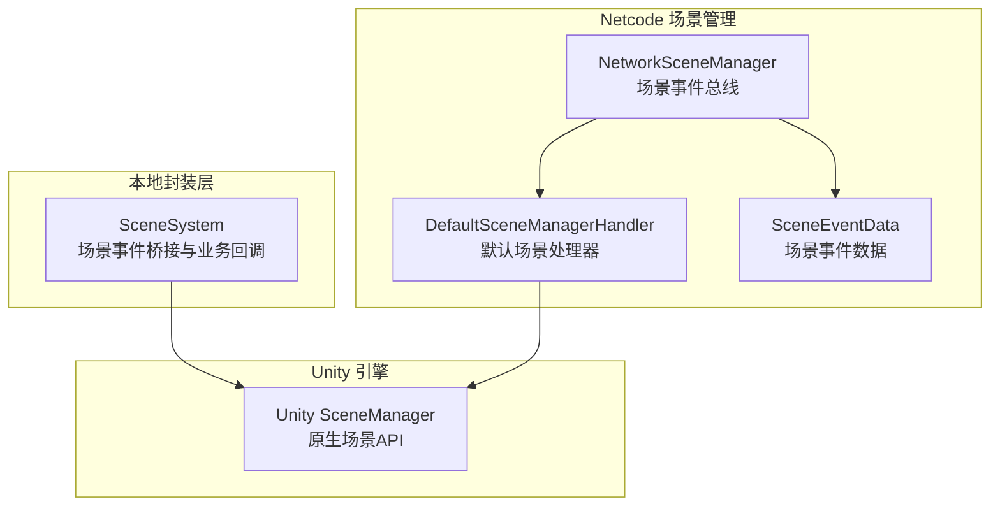
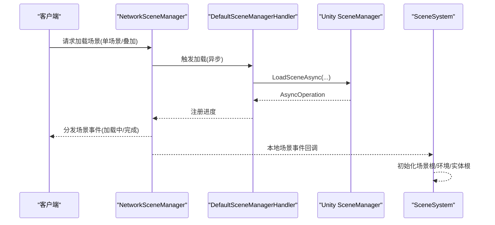
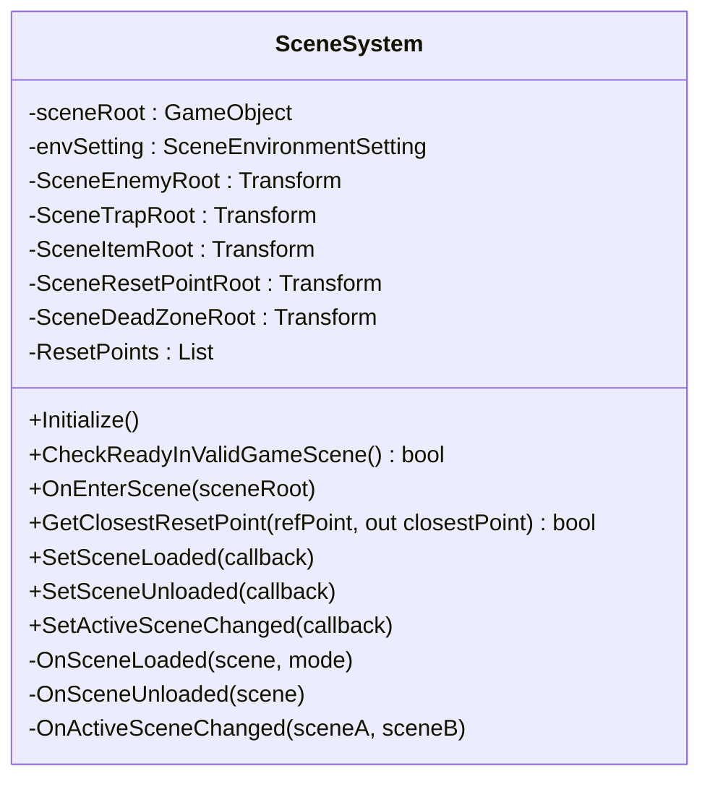
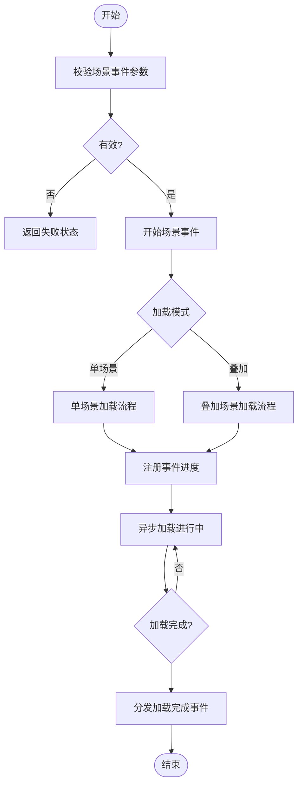
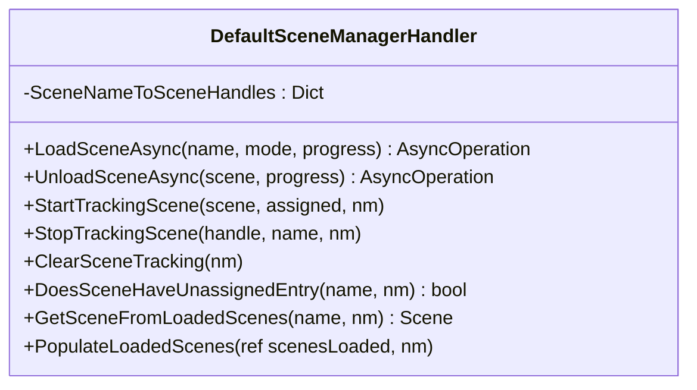
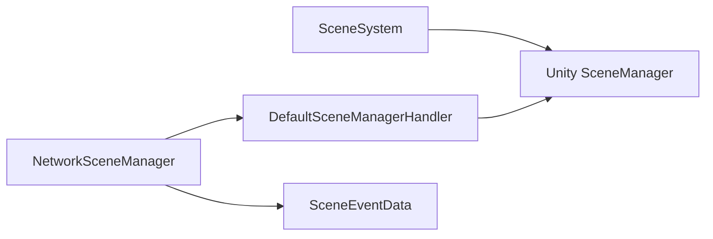

# 场景系统

<cite>
**本文档引用的文件**
- [SceneSystem.cs](file://Assets/Scripts/Systems/Implement/SceneSystem/SceneSystem.cs)
- [NetworkSceneManager.cs](file://LocalPackages/com.unity.netcode.gameobjects@1.14.1/Runtime/SceneManagement/NetworkSceneManager.cs)
- [DefaultSceneManagerHandler.cs](file://LocalPackages/com.unity.netcode.gameobjects@1.14.1/Runtime/SceneManagement/DefaultSceneManagerHandler.cs)
- [SceneEventData.cs](file://LocalPackages/com.unity.netcode.gameobjects@1.14.1/Runtime/SceneManagement/SceneEventData.cs)
- [client-synchronization-mode.md](file://LocalPackages/com.unity.netcode.gameobjects@1.14.1/Documentation~/basics/scenemanagement/client-synchronization-mode.md)
- [scene-events.md](file://LocalPackages/com.unity.netcode.gameobjects@1.14.1/Documentation~/basics/scenemanagement/scene-events.md)
- [timing-considerations.md](file://LocalPackages/com.unity.netcode.gameobjects@1.14.1/Documentation~/basics/scenemanagement/timing-considerations.md)
- [reconnecting-mid-game.md](file://LocalPackages/com.unity.netcode.gameobjects@1.14.1/Documentation~/advanced-topics/reconnecting-mid-game.md)
- [TestMono.cs](file://Assets/Dev/Lab/Scenes/TestMono.cs)
- [ResourceSystem.Update.cs](file://Assets/Scripts/Systems/Implement/ResourceSystem/ResourceSystem.Update.cs)
</cite>

## 目录
1. [简介](#简介)
2. [项目结构](#项目结构)
3. [核心组件](#核心组件)
4. [架构总览](#架构总览)
5. [详细组件分析](#详细组件分析)
6. [依赖关系分析](#依赖关系分析)
7. [性能考虑](#性能考虑)
8. [故障排查指南](#故障排查指南)
9. [结论](#结论)
10. [附录](#附录)

## 简介
本文件面向 ProjectR 的场景系统，系统性阐述场景的加载、卸载与切换机制，解析场景管理器的工作原理（场景依赖关系、加载顺序、资源清理策略），并结合项目实际给出主菜单场景、游戏场景、测试场景的使用建议与数据传递/状态保持方案。同时提供扩展方法（自定义场景类型与预加载策略）、性能优化技术（场景分割、渐进式加载、内存管理）以及调试与错误处理实践。

## 项目结构
ProjectR 的场景系统由两部分构成：
- 本地封装层：基于 Unity 原生 SceneManager 的事件监听与业务扩展，负责场景进入时的实体根节点组织、环境配置读取、重置点等游戏域逻辑。
- Netcode 场景管理：基于 NetworkSceneManager 的网络化场景事件流，支持单场景加载与多场景叠加加载，提供同步、完成通知与对象创建延迟等机制。

**图表来源**
- [SceneSystem.cs:37-43](file://Assets/Scripts/Systems/Implement/SceneSystem/SceneSystem.cs#L37-L43)
- [NetworkSceneManager.cs:147-188](file://LocalPackages/com.unity.netcode.gameobjects@1.14.1/Runtime/SceneManagement/NetworkSceneManager.cs#L147-L188)
- [DefaultSceneManagerHandler.cs:12-36](file://LocalPackages/com.unity.netcode.gameobjects@1.14.1/Runtime/SceneManagement/DefaultSceneManagerHandler.cs#L12-L36)
- [SceneEventData.cs:645-740](file://LocalPackages/com.unity.netcode.gameobjects@1.14.1/Runtime/SceneManagement/SceneEventData.cs#L645-L740)

**章节来源**
- [SceneSystem.cs:37-43](file://Assets/Scripts/Systems/Implement/SceneSystem/SceneSystem.cs#L37-L43)
- [NetworkSceneManager.cs:147-188](file://LocalPackages/com.unity.netcode.gameobjects@1.14.1/Runtime/SceneManagement/NetworkSceneManager.cs#L147-L188)
- [DefaultSceneManagerHandler.cs:12-36](file://LocalPackages/com.unity.netcode.gameobjects@1.14.1/Runtime/SceneManagement/DefaultSceneManagerHandler.cs#L12-L36)
- [SceneEventData.cs:645-740](file://LocalPackages/com.unity.netcode.gameobjects@1.14.1/Runtime/SceneManagement/SceneEventData.cs#L645-L740)

## 核心组件
- SceneSystem：本地场景系统，订阅 Unity 的场景事件，提供统一的场景加载/卸载/激活变更回调，并在场景进入时初始化场景根节点、环境配置与实体根目录。
- NetworkSceneManager：Netcode 场景事件总线，负责生成场景哈希表、发起加载/卸载、分发事件、处理同步与对象创建延迟。
- DefaultSceneManagerHandler：默认场景处理器，封装 Unity SceneManager 的异步加载/卸载，维护场景名到句柄的跟踪表，支持复用已加载场景以减少同步开销。
- SceneEventData：场景事件数据载体，承载事件类型、场景哈希/句柄、加载模式、客户端完成列表等信息。

**章节来源**
- [SceneSystem.cs:10-43](file://Assets/Scripts/Systems/Implement/SceneSystem/SceneSystem.cs#L10-L43)
- [NetworkSceneManager.cs:147-188](file://LocalPackages/com.unity.netcode.gameobjects@1.14.1/Runtime/SceneManagement/NetworkSceneManager.cs#L147-L188)
- [DefaultSceneManagerHandler.cs:12-87](file://LocalPackages/com.unity.netcode.gameobjects@1.14.1/Runtime/SceneManagement/DefaultSceneManagerHandler.cs#L12-L87)
- [SceneEventData.cs:645-740](file://LocalPackages/com.unity.netcode.gameobjects@1.14.1/Runtime/SceneManagement/SceneEventData.cs#L645-L740)

## 架构总览
场景系统采用“本地封装 + 网络事件”的双层架构：
- 本地层：SceneSystem 订阅 Unity 的场景事件，触发业务回调；在场景进入时构建场景实体树与环境参数。
- 网络层：NetworkSceneManager 统一管理场景事件生命周期，通过 DefaultSceneManagerHandler 调用 Unity 场景 API，并通过 SceneEventData 在客户端/服务器之间传递事件数据。

**图表来源**
- [NetworkSceneManager.cs:1363-1387](file://LocalPackages/com.unity.netcode.gameobjects@1.14.1/Runtime/SceneManagement/NetworkSceneManager.cs#L1363-L1387)
- [DefaultSceneManagerHandler.cs:24-29](file://LocalPackages/com.unity.netcode.gameobjects@1.14.1/Runtime/SceneManagement/DefaultSceneManagerHandler.cs#L24-L29)
- [SceneSystem.cs:119-133](file://Assets/Scripts/Systems/Implement/SceneSystem/SceneSystem.cs#L119-L133)

**章节来源**
- [NetworkSceneManager.cs:1363-1387](file://LocalPackages/com.unity.netcode.gameobjects@1.14.1/Runtime/SceneManagement/NetworkSceneManager.cs#L1363-L1387)
- [DefaultSceneManagerHandler.cs:24-29](file://LocalPackages/com.unity.netcode.gameobjects@1.14.1/Runtime/SceneManagement/DefaultSceneManagerHandler.cs#L24-L29)
- [SceneSystem.cs:119-133](file://Assets/Scripts/Systems/Implement/SceneSystem/SceneSystem.cs#L119-L133)

## 详细组件分析

### SceneSystem（本地场景系统）
职责与行为：
- 订阅 Unity 场景事件：场景加载完成、场景卸载完成、活动场景变更。
- 提供静态注册接口：SetSceneLoaded/SetSceneUnloaded/SetActiveSceneChanged。
- 场景进入时初始化：查找场景根节点、读取环境配置、定位敌人/陷阱/道具/重置点/死亡区等根节点，构建重置点列表。
- 提供场景内最近重置点查询能力。

**图表来源**
- [SceneSystem.cs:10-155](file://Assets/Scripts/Systems/Implement/SceneSystem/SceneSystem.cs#L10-L155)

**章节来源**
- [SceneSystem.cs:37-155](file://Assets/Scripts/Systems/Implement/SceneSystem/SceneSystem.cs#L37-L155)

### NetworkSceneManager（网络场景管理器）
职责与行为：
- 事件总线：提供 OnSceneEvent 事件，按类型分发加载/卸载/同步/完成等事件。
- 场景哈希与索引：生成场景在构建中的哈希映射，用于跨端一致标识。
- 加载/卸载：根据加载模式（单场景/叠加）发起异步操作，记录事件进度。
- 同步与延迟：在特定条件下延迟对象创建，确保场景加载一致性。
- 完成通知：向所有客户端广播加载/卸载完成事件，包含完成/超时客户端列表。

**图表来源**
- [NetworkSceneManager.cs:1363-1387](file://LocalPackages/com.unity.netcode.gameobjects@1.14.1/Runtime/SceneManagement/NetworkSceneManager.cs#L1363-L1387)
- [NetworkSceneManager.cs:2575-2587](file://LocalPackages/com.unity.netcode.gameobjects@1.14.1/Runtime/SceneManagement/NetworkSceneManager.cs#L2575-L2587)

**章节来源**
- [NetworkSceneManager.cs:147-188](file://LocalPackages/com.unity.netcode.gameobjects@1.14.1/Runtime/SceneManagement/NetworkSceneManager.cs#L147-L188)
- [NetworkSceneManager.cs:671-761](file://LocalPackages/com.unity.netcode.gameobjects@1.14.1/Runtime/SceneManagement/NetworkSceneManager.cs#L671-L761)
- [NetworkSceneManager.cs:1363-1387](file://LocalPackages/com.unity.netcode.gameobjects@1.14.1/Runtime/SceneManagement/NetworkSceneManager.cs#L1363-L1387)
- [NetworkSceneManager.cs:2575-2587](file://LocalPackages/com.unity.netcode.gameobjects@1.14.1/Runtime/SceneManagement/NetworkSceneManager.cs#L2575-L2587)

### DefaultSceneManagerHandler（默认场景处理器）
职责与行为：
- 封装 Unity 场景 API：提供加载/卸载异步操作并绑定进度。
- 场景跟踪：维护“场景名 -> 句柄集合”的字典，标记是否已分配，支持复用未分配场景以减少同步成本。
- 清理与卸载：在客户端同步完成后，可卸载未分配场景，避免重复加载。

**图表来源**
- [DefaultSceneManagerHandler.cs:12-200](file://LocalPackages/com.unity.netcode.gameobjects@1.14.1/Runtime/SceneManagement/DefaultSceneManagerHandler.cs#L12-L200)

**章节来源**
- [DefaultSceneManagerHandler.cs:12-200](file://LocalPackages/com.unity.netcode.gameobjects@1.14.1/Runtime/SceneManagement/DefaultSceneManagerHandler.cs#L12-L200)

### SceneEventData（场景事件数据）
职责与行为：
- 承载事件类型、场景哈希/句柄、加载模式、客户端完成/超时列表等。
- 支持序列化/反序列化，便于跨网络传输。
- 同步阶段复制服务器侧同步数据缓冲，保证客户端一致性。

**章节来源**
- [SceneEventData.cs:645-740](file://LocalPackages/com.unity.netcode.gameobjects@1.14.1/Runtime/SceneManagement/SceneEventData.cs#L645-L740)

## 依赖关系分析
- SceneSystem 依赖 Unity 的 SceneManager 事件，作为本地场景生命周期的观察者与业务入口。
- NetworkSceneManager 依赖 DefaultSceneManagerHandler 与 SceneEventData，负责事件编排与跨端通信。
- DefaultSceneManagerHandler 直接依赖 Unity 的 SceneManager，负责底层加载/卸载与场景跟踪。

**图表来源**
- [SceneSystem.cs:37-43](file://Assets/Scripts/Systems/Implement/SceneSystem/SceneSystem.cs#L37-L43)
- [NetworkSceneManager.cs:147-188](file://LocalPackages/com.unity.netcode.gameobjects@1.14.1/Runtime/SceneManagement/NetworkSceneManager.cs#L147-L188)
- [DefaultSceneManagerHandler.cs:12-36](file://LocalPackages/com.unity.netcode.gameobjects@1.14.1/Runtime/SceneManagement/DefaultSceneManagerHandler.cs#L12-L36)

**章节来源**
- [SceneSystem.cs:37-43](file://Assets/Scripts/Systems/Implement/SceneSystem/SceneSystem.cs#L37-L43)
- [NetworkSceneManager.cs:147-188](file://LocalPackages/com.unity.netcode.gameobjects@1.14.1/Runtime/SceneManagement/NetworkSceneManager.cs#L147-L188)
- [DefaultSceneManagerHandler.cs:12-36](file://LocalPackages/com.unity.netcode.gameobjects@1.14.1/Runtime/SceneManagement/DefaultSceneManagerHandler.cs#L12-L36)

## 性能考虑
- 场景分割与叠加加载
  - 使用叠加场景加载（Additive）分离 UI 与玩法场景，避免频繁全量切换带来的抖动与资源反复加载。
  - 参考：[timing-considerations.md:89-98](file://LocalPackages/com.unity.netcode.gameobjects@1.14.1/Documentation~/basics/scenemanagement/timing-considerations.md#L89-L98)
- 预加载策略
  - 利用 DefaultSceneManagerHandler 的“未分配场景复用”机制，在客户端同步前预加载常用场景，减少同步时长。
  - 参考：[DefaultSceneManagerHandler.cs:92-161](file://LocalPackages/com.unity.netcode.gameobjects@1.14.1/Runtime/SceneManagement/DefaultSceneManagerHandler.cs#L92-L161)
- 渐进式加载
  - 通过 OnSceneEvent 中的 AsyncOperation.progress 监听加载进度，实现 UI 进度条与阶段性资源可用提示。
  - 参考：[scene-events.md:118-120](file://LocalPackages/com.unity.netcode.gameobjects@1.14.1/Documentation~/basics/scenemanagement/scene-events.md#L118-L120)
- 内存管理
  - 同步完成后卸载未分配场景，避免重复加载导致的内存膨胀。
  - 参考：[DefaultSceneManagerHandler.cs:208-222](file://LocalPackages/com.unity.netcode.gameobjects@1.14.1/Runtime/SceneManagement/DefaultSceneManagerHandler.cs#L208-L222)
- 资源系统协同
  - ResourceSystem.Update 中的异步 Loader 更新与周期性释放，配合场景卸载时机，降低资源泄漏风险。
  - 参考：[ResourceSystem.Update.cs:10-84](file://Assets/Scripts/Systems/Implement/ResourceSystem/ResourceSystem.Update.cs#L10-L84)

**章节来源**
- [timing-considerations.md:89-98](file://LocalPackages/com.unity.netcode.gameobjects@1.14.1/Documentation~/basics/scenemanagement/timing-considerations.md#L89-L98)
- [DefaultSceneManagerHandler.cs:92-161](file://LocalPackages/com.unity.netcode.gameobjects@1.14.1/Runtime/SceneManagement/DefaultSceneManagerHandler.cs#L92-L161)
- [scene-events.md:118-120](file://LocalPackages/com.unity.netcode.gameobjects@1.14.1/Documentation~/basics/scenemanagement/scene-events.md#L118-L120)
- [ResourceSystem.Update.cs:10-84](file://Assets/Scripts/Systems/Implement/ResourceSystem/ResourceSystem.Update.cs#L10-L84)

## 故障排查指南
- 场景同步异常与重复加载
  - 当客户端与服务器处于相同主场景且启用“客户端同步叠加模式”时，可能出现重复加载叠加场景的问题。可通过断开连接前切换主场景或在重连后主动卸载多余场景规避。
  - 参考：[reconnecting-mid-game.md:11-21](file://LocalPackages/com.unity.netcode.gameobjects@1.14.1/Documentation~/advanced-topics/reconnecting-mid-game.md#L11-L21)
- 自定义场景加载限制
  - 若需要加载构建列表外的场景（如 Addressable/AssetBundle 场景），需在服务器端扩展场景事件类型并通知客户端。
  - 参考：[NetworkSceneManager.cs:673-678](file://LocalPackages/com.unity.netcode.gameobjects@1.14.1/Runtime/SceneManagement/NetworkSceneManager.cs#L673-L678)
- 场景验证与卸载拦截
  - 使用 VerifySceneBeforeLoading/VerifySceneBeforeUnloading 回调，阻止对关键 UI 场景的卸载，确保 UI 层级稳定。
  - 参考：[client-synchronization-mode.md:44-47](file://LocalPackages/com.unity.netcode.gameobjects@1.14.1/Documentation~/basics/scenemanagement/client-synchronization-mode.md#L44-L47)
- 调试辅助
  - TestMono.cs 展示了在编辑器中挂载资源引用与预览实例的思路，可用于场景加载前后资源状态检查。
  - 参考：[TestMono.cs:10-17](file://Assets/Dev/Lab/Scenes/TestMono.cs#L10-L17)

**章节来源**
- [reconnecting-mid-game.md:11-21](file://LocalPackages/com.unity.netcode.gameobjects@1.14.1/Documentation~/advanced-topics/reconnecting-mid-game.md#L11-L21)
- [NetworkSceneManager.cs:673-678](file://LocalPackages/com.unity.netcode.gameobjects@1.14.1/Runtime/SceneManagement/NetworkSceneManager.cs#L673-L678)
- [client-synchronization-mode.md:44-47](file://LocalPackages/com.unity.netcode.gameobjects@1.14.1/Documentation~/basics/scenemanagement/client-synchronization-mode.md#L44-L47)
- [TestMono.cs:10-17](file://Assets/Dev/Lab/Scenes/TestMono.cs#L10-L17)

## 结论
ProjectR 的场景系统通过本地 SceneSystem 与 Netcode NetworkSceneManager 的协作，实现了稳定的场景生命周期管理与网络同步。结合叠加加载、预加载与渐进式加载策略，可在保证体验的同时提升性能与稳定性。通过回调与事件机制，系统具备良好的扩展性与可调试性，适合在主菜单、游戏、测试等多场景中复用。

## 附录

### 不同类型场景的使用建议
- 主菜单场景
  - 使用单场景加载，确保 UI 层独立可控；通过 VerifySceneBeforeUnloading 防止误卸载。
- 游戏场景
  - 主场景单场景加载 + 关卡场景叠加加载；利用 SceneSystem 初始化场景根与实体树。
- 测试场景
  - 叠加加载测试场景，便于快速切换与资源隔离；结合 ResourceSystem.Update 的周期释放降低内存压力。

### 场景间数据传递与状态保持
- 利用 NetworkSceneManager 的 OnSceneEvent 事件链路，结合自定义消息在场景切换前后传递状态。
- 对于 UI 场景，建议通过 VerifySceneBeforeUnloading 拦截卸载，配合叠加加载维持状态。

### 扩展方法
- 自定义场景类型
  - 在服务器端扩展场景事件类型，支持非构建场景（如 Addressable/AssetBundle）的动态加载与同步。
- 预加载策略
  - 在客户端同步前预加载常用叠加场景，使用 DefaultSceneManagerHandler 的场景复用能力减少同步时间。