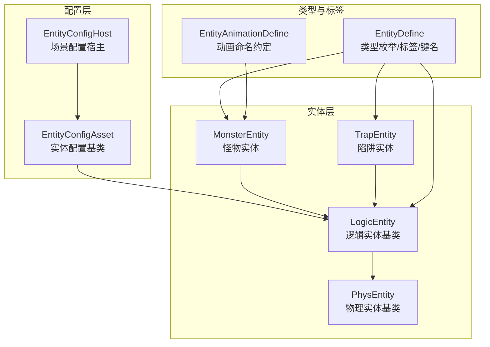
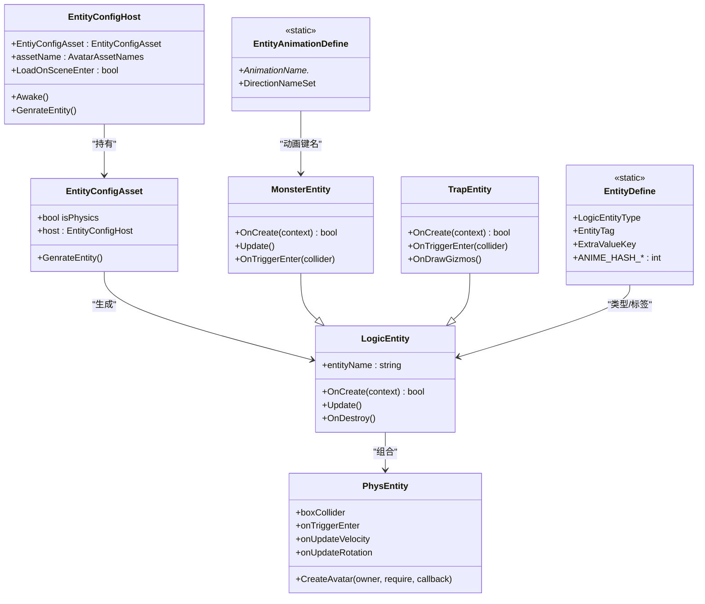
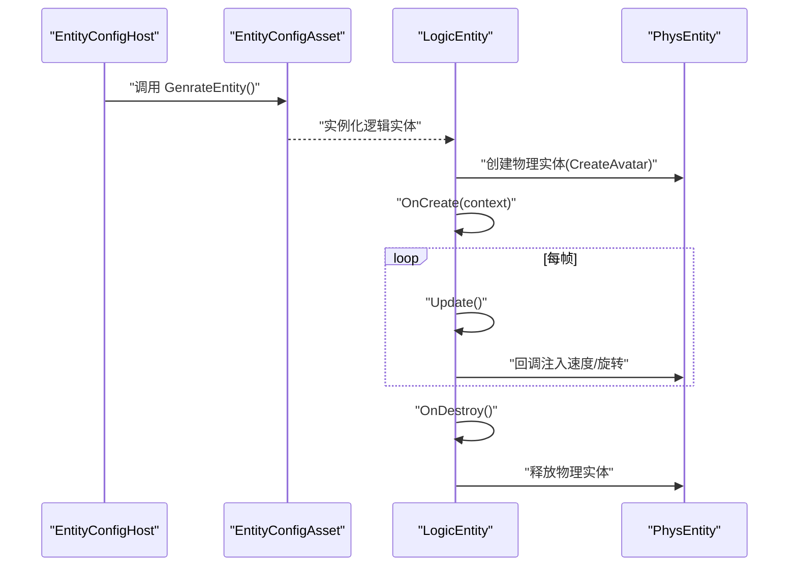
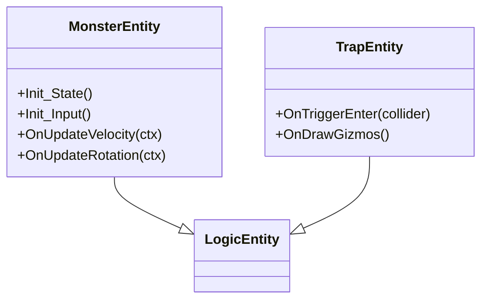
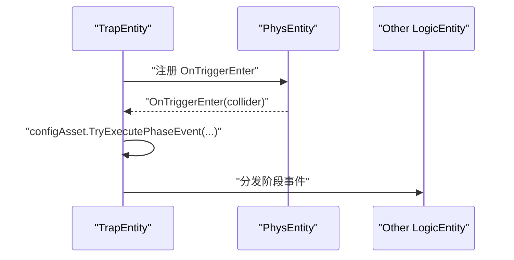
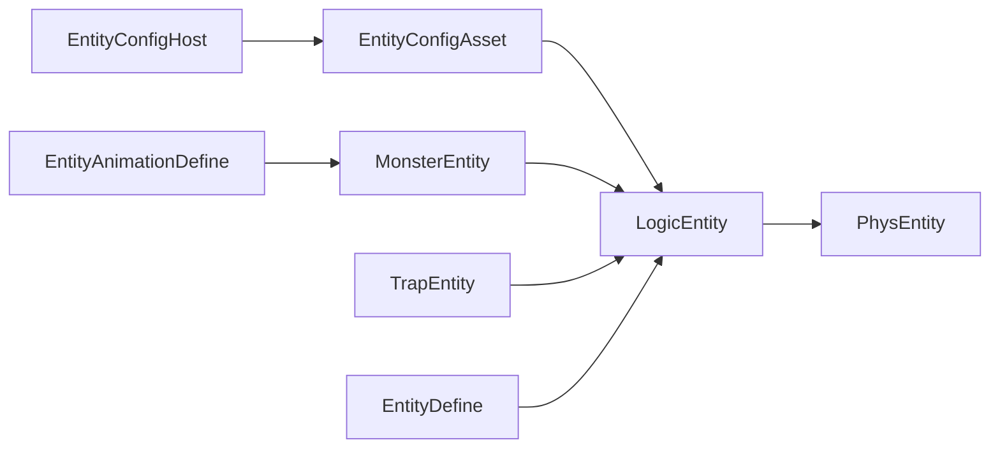

# 实体系统

<cite>
**本文引用的文件**
- [EntityDefine.cs](file://Assets/Scripts/Modules/Entity/EntityDefine.cs)
- [EntityConfigAsset.cs](file://Assets/Scripts/Config/Entity/EntityConfigAsset.cs)
- [EntityConfigHost.cs](file://Assets/Scripts/Modules/Entity/Scene/EntityConfigHost.cs)
- [MonsterEntity.cs](file://Assets/Scripts/Modules/Enemy/MonsterEntity.cs)
- [TrapEntity.cs](file://Assets/Scripts/Modules/Traps/TrapEntity.cs)
- [EntityAnimationDefine.cs](file://Assets/Scripts/Modules/Entity/EntityAnimationDefine.cs)
- [KCCLogicBase.cs](file://Assets/Scripts/Modules/Entity/KCC/KCCLogicBase.cs)
</cite>

## 目录
1. [简介](#简介)
2. [项目结构](#项目结构)
3. [核心组件](#核心组件)
4. [架构总览](#架构总览)
5. [详细组件分析](#详细组件分析)
6. [依赖关系分析](#依赖关系分析)
7. [性能考虑](#性能考虑)
8. [故障排查指南](#故障排查指南)
9. [结论](#结论)
10. [附录](#附录)

## 简介
本文件系统性梳理 ProjectR 的实体系统，围绕实体生命周期管理、实体工厂与注册机制、实体类型差异与共性、创建/更新/销毁流程、实体间交互、配置系统与动态加载、性能优化与内存管理、以及扩展与自定义实体类型的方法进行说明。目标是帮助开发者快速理解并高效维护与扩展实体系统。

## 项目结构
实体系统主要由以下层次构成：
- 配置层：以 ScriptableObject 资产形式定义实体属性与行为参数，支持场景级挂载与动态加载。
- 实体层：逻辑实体与物理实体分离，逻辑实体负责状态机、输入、动画等高层行为；物理实体负责碰撞、运动学与触发器。
- 场景宿主层：EntityConfigHost 将配置资产与场景节点绑定，统一生成实体。
- 类型层：不同实体类型（玩家、怪物、陷阱、物品）在继承体系上共享基类能力，同时通过配置资产实现差异化行为。

图表来源
- [EntityConfigAsset.cs:1-19](file://Assets/Scripts/Config/Entity/EntityConfigAsset.cs#L1-L19)
- [EntityConfigHost.cs:1-33](file://Assets/Scripts/Modules/Entity/Scene/EntityConfigHost.cs#L1-L33)
- [EntityDefine.cs:1-64](file://Assets/Scripts/Modules/Entity/EntityDefine.cs#L1-L64)
- [MonsterEntity.cs:1-82](file://Assets/Scripts/Modules/Enemy/MonsterEntity.cs#L1-L82)
- [TrapEntity.cs:1-42](file://Assets/Scripts/Modules/Traps/TrapEntity.cs#L1-L42)
- [EntityAnimationDefine.cs:1-67](file://Assets/Scripts/Modules/Entity/EntityAnimationDefine.cs#L1-L67)

章节来源
- [EntityDefine.cs:1-64](file://Assets/Scripts/Modules/Entity/EntityDefine.cs#L1-L64)
- [EntityConfigAsset.cs:1-19](file://Assets/Scripts/Config/Entity/EntityConfigAsset.cs#L1-L19)
- [EntityConfigHost.cs:1-33](file://Assets/Scripts/Modules/Entity/Scene/EntityConfigHost.cs#L1-L33)
- [MonsterEntity.cs:1-82](file://Assets/Scripts/Modules/Enemy/MonsterEntity.cs#L1-L82)
- [TrapEntity.cs:1-42](file://Assets/Scripts/Modules/Traps/TrapEntity.cs#L1-L42)
- [EntityAnimationDefine.cs:1-67](file://Assets/Scripts/Modules/Entity/EntityAnimationDefine.cs#L1-L67)

## 核心组件
- 实体类型与标签
  - 类型枚举：Empty、Player、Trap、Item、Enemy，用于区分实体类别与场景根节点命名规范。
  - 标签与键名：统一的标签常量与动画/动作哈希键，保证跨实体的一致性与可维护性。
- 配置资产与宿主
  - EntityConfigAsset：所有实体配置的抽象基类，提供 isPhysics 标志与生成接口。
  - EntityConfigHost：场景中挂载的宿主，负责将配置资产与场景节点绑定，并触发实体生成。
- 逻辑实体与物理实体
  - 逻辑实体：承载状态机、输入处理、动画与行为逻辑。
  - 物理实体：封装碰撞器、刚体、触发器与运动学回调，作为物理交互的载体。
- 动画与动作键
  - 统一的动画命名集合与方向集，确保不同实体在相同键位下复用同一套动画状态机。

章节来源
- [EntityDefine.cs:1-64](file://Assets/Scripts/Modules/Entity/EntityDefine.cs#L1-L64)
- [EntityConfigAsset.cs:1-19](file://Assets/Scripts/Config/Entity/EntityConfigAsset.cs#L1-L19)
- [EntityConfigHost.cs:1-33](file://Assets/Scripts/Modules/Entity/Scene/EntityConfigHost.cs#L1-L33)
- [EntityAnimationDefine.cs:1-67](file://Assets/Scripts/Modules/Entity/EntityAnimationDefine.cs#L1-L67)

## 架构总览
实体系统采用“配置驱动 + 逻辑/物理分离”的架构：
- 配置驱动：通过 ScriptableObject 资产描述实体属性与行为，支持运行时动态加载与热替换。
- 逻辑/物理分离：逻辑实体负责高层行为与状态机，物理实体负责底层运动学与碰撞，二者通过回调与事件解耦协作。
- 类型统一：通过类型枚举与标签常量，确保不同实体在系统中的行为一致性与可扩展性。

图表来源
- [EntityConfigAsset.cs:1-19](file://Assets/Scripts/Config/Entity/EntityConfigAsset.cs#L1-L19)
- [EntityConfigHost.cs:1-33](file://Assets/Scripts/Modules/Entity/Scene/EntityConfigHost.cs#L1-L33)
- [MonsterEntity.cs:1-82](file://Assets/Scripts/Modules/Enemy/MonsterEntity.cs#L1-L82)
- [TrapEntity.cs:1-42](file://Assets/Scripts/Modules/Traps/TrapEntity.cs#L1-L42)
- [EntityDefine.cs:1-64](file://Assets/Scripts/Modules/Entity/EntityDefine.cs#L1-L64)
- [EntityAnimationDefine.cs:1-67](file://Assets/Scripts/Modules/Entity/EntityAnimationDefine.cs#L1-L67)

## 详细组件分析

### 实体生命周期管理
- 创建阶段
  - 通过 EntityConfigHost 触发配置资产的生成流程，逻辑实体在 OnCreate 中完成资源加载与组件初始化。
  - 物理实体通过 CreateAvatar 完成模型与组件装配，并注册触发器/运动学回调。
- 更新阶段
  - 逻辑实体在 Update 中驱动输入、状态机与动画更新；物理实体在运动学回调中注入速度与旋转修正。
- 销毁阶段
  - 逻辑实体 OnDestroy 清理状态机、输入与订阅事件；物理实体释放资源与注销回调。

图表来源
- [EntityConfigHost.cs:22-30](file://Assets/Scripts/Modules/Entity/Scene/EntityConfigHost.cs#L22-L30)
- [EntityConfigAsset.cs:15-17](file://Assets/Scripts/Config/Entity/EntityConfigAsset.cs#L15-L17)
- [MonsterEntity.cs:26-35](file://Assets/Scripts/Modules/Enemy/MonsterEntity.cs#L26-L35)
- [TrapEntity.cs:11-24](file://Assets/Scripts/Modules/Traps/TrapEntity.cs#L11-L24)

章节来源
- [EntityConfigHost.cs:14-30](file://Assets/Scripts/Modules/Entity/Scene/EntityConfigHost.cs#L14-L30)
- [EntityConfigAsset.cs:13-17](file://Assets/Scripts/Config/Entity/EntityConfigAsset.cs#L13-L17)
- [MonsterEntity.cs:26-50](file://Assets/Scripts/Modules/Enemy/MonsterEntity.cs#L26-L50)
- [TrapEntity.cs:11-39](file://Assets/Scripts/Modules/Traps/TrapEntity.cs#L11-L39)

### 实体工厂模式与注册机制
- 工厂与注册
  - 配置资产通过 GenrateEntity 接口实现“工厂”语义，具体生成逻辑由子类实现。
  - EntityConfigHost 在 Awake 时将自身赋给配置资产的 host 字段，便于后续访问场景上下文。
- 扩展点
  - 新增实体类型只需继承 EntityConfigAsset 并实现 GenrateEntity，即可被宿主统一调度。
  - 通过类型枚举与标签常量，系统可在运行时按类型分发与管理实体。

章节来源
- [EntityConfigAsset.cs:10-17](file://Assets/Scripts/Config/Entity/EntityConfigAsset.cs#L10-L17)
- [EntityConfigHost.cs:14-20](file://Assets/Scripts/Modules/Entity/Scene/EntityConfigHost.cs#L14-L20)
- [EntityDefine.cs:7-33](file://Assets/Scripts/Modules/Entity/EntityDefine.cs#L7-L33)

### 不同类型实体的实现差异与共同特征
- 共同特征
  - 均继承自逻辑实体基类，具备统一的生命周期钩子与更新框架。
  - 均组合物理实体，通过回调与事件实现与物理世界的交互。
- 差异化实现
  - 怪物实体：集成状态机与输入处理，通过运动学回调实现移动与转向。
  - 陷阱实体：仅需触发器交互，通过 OnTriggerEnter 分发配置事件。

图表来源
- [MonsterEntity.cs:8-81](file://Assets/Scripts/Modules/Enemy/MonsterEntity.cs#L8-L81)
- [TrapEntity.cs:6-41](file://Assets/Scripts/Modules/Traps/TrapEntity.cs#L6-L41)

章节来源
- [MonsterEntity.cs:8-81](file://Assets/Scripts/Modules/Enemy/MonsterEntity.cs#L8-L81)
- [TrapEntity.cs:6-41](file://Assets/Scripts/Modules/Traps/TrapEntity.cs#L6-L41)

### 实体间交互机制
- 触发器交互
  - 陷阱实体注册 OnTriggerEnter 回调，当检测到其他实体的物理实体进入触发器时，根据配置资产执行相应阶段事件。
- 运动学回调
  - 逻辑实体在物理实体的 onUpdateVelocity/onUpdateRotation 回调中注入速度与旋转修正，实现统一的运动学控制。

图表来源
- [TrapEntity.cs:26-31](file://Assets/Scripts/Modules/Traps/TrapEntity.cs#L26-L31)

章节来源
- [TrapEntity.cs:26-31](file://Assets/Scripts/Modules/Traps/TrapEntity.cs#L26-L31)

### 实体配置系统与动态加载
- 配置资产
  - EntityConfigAsset 提供 isPhysics 标志与 GenrateEntity 抽象接口，子类可按需扩展。
- 场景宿主
  - EntityConfigHost 在 Awake 时将 host 指向自身，便于配置资产在生成时访问场景上下文。
- 动态加载
  - 逻辑实体在 OnCreate 中通过资源系统加载实体物理配置资产，确保运行时可替换与热更新。

章节来源
- [EntityConfigAsset.cs:10-17](file://Assets/Scripts/Config/Entity/EntityConfigAsset.cs#L10-L17)
- [EntityConfigHost.cs:14-20](file://Assets/Scripts/Modules/Entity/Scene/EntityConfigHost.cs#L14-L20)
- [MonsterEntity.cs:28-32](file://Assets/Scripts/Modules/Enemy/MonsterEntity.cs#L28-L32)

### 动作与动画系统
- 动画命名约定
  - 通过 EntityAnimationDefine 统一定义 Idle、Jump、Walk、Dash 等动画名称与方向集，保证不同实体在相同键位下复用同一套动画状态机。
- 动画键与状态机
  - EntityDefine 提供大量动画哈希键，用于状态机切换与参数驱动，确保动画与逻辑行为一致。

章节来源
- [EntityAnimationDefine.cs:7-65](file://Assets/Scripts/Modules/Entity/EntityAnimationDefine.cs#L7-L65)
- [EntityDefine.cs:49-62](file://Assets/Scripts/Modules/Entity/EntityDefine.cs#L49-L62)

## 依赖关系分析
- 组件耦合
  - 逻辑实体与物理实体松耦合：通过回调与事件交互，避免直接依赖。
  - 配置资产与宿主强绑定：宿主负责将配置资产与场景节点关联，生成流程清晰可控。
- 外部依赖
  - 资源系统：用于动态加载实体物理配置资产。
  - 输入系统：怪物实体通过输入系统注册输入处理。
- 循环依赖
  - 未发现循环依赖迹象；配置资产与实体之间为单向依赖。

图表来源
- [EntityConfigHost.cs:1-33](file://Assets/Scripts/Modules/Entity/Scene/EntityConfigHost.cs#L1-L33)
- [EntityConfigAsset.cs:1-19](file://Assets/Scripts/Config/Entity/EntityConfigAsset.cs#L1-L19)
- [MonsterEntity.cs:1-82](file://Assets/Scripts/Modules/Enemy/MonsterEntity.cs#L1-L82)
- [TrapEntity.cs:1-42](file://Assets/Scripts/Modules/Traps/TrapEntity.cs#L1-L42)
- [EntityDefine.cs:1-64](file://Assets/Scripts/Modules/Entity/EntityDefine.cs#L1-L64)
- [EntityAnimationDefine.cs:1-67](file://Assets/Scripts/Modules/Entity/EntityAnimationDefine.cs#L1-L67)

章节来源
- [EntityConfigHost.cs:1-33](file://Assets/Scripts/Modules/Entity/Scene/EntityConfigHost.cs#L1-L33)
- [EntityConfigAsset.cs:1-19](file://Assets/Scripts/Config/Entity/EntityConfigAsset.cs#L1-L19)
- [MonsterEntity.cs:1-82](file://Assets/Scripts/Modules/Enemy/MonsterEntity.cs#L1-L82)
- [TrapEntity.cs:1-42](file://Assets/Scripts/Modules/Traps/TrapEntity.cs#L1-L42)
- [EntityDefine.cs:1-64](file://Assets/Scripts/Modules/Entity/EntityDefine.cs#L1-L64)
- [EntityAnimationDefine.cs:1-67](file://Assets/Scripts/Modules/Entity/EntityAnimationDefine.cs#L1-L67)

## 性能考虑
- 批量处理与对象池
  - 对频繁创建/销毁的实体（如陷阱）建议引入对象池，减少 GC 压力与分配开销。
- 回调与事件
  - 合理使用物理实体回调，避免在每帧中进行昂贵计算；将复杂逻辑延迟到必要时再执行。
- 动画与状态机
  - 使用统一动画键与命名约定，减少状态机切换成本；避免在 Update 中频繁修改动画参数。
- 资源加载
  - 通过资源系统按需加载配置资产，避免一次性加载过多资源；对热更新场景建议使用异步加载与缓存策略。

## 故障排查指南
- 配置资产为空
  - 若 EntityConfigHost 未正确设置配置资产，生成流程会记录错误日志。请检查场景挂载与配置资产引用。
- 物理实体创建失败
  - 逻辑实体在创建物理实体失败时会记录错误日志。请确认资源路径与实体物理配置资产可用。
- 触发器无响应
  - 检查陷阱实体是否正确注册 OnTriggerEnter 回调，并确认碰撞器与触发器设置正确。
- 动画不生效
  - 确认动画键与状态机配置一致，且实体已正确加载动画资源。

章节来源
- [EntityConfigHost.cs:24-28](file://Assets/Scripts/Modules/Entity/Scene/EntityConfigHost.cs#L24-L28)
- [MonsterEntity.cs:13-18](file://Assets/Scripts/Modules/Enemy/MonsterEntity.cs#L13-L18)
- [TrapEntity.cs:26-31](file://Assets/Scripts/Modules/Traps/TrapEntity.cs#L26-L31)

## 结论
ProjectR 的实体系统通过“配置驱动 + 逻辑/物理分离”的架构实现了高内聚、低耦合的可扩展设计。借助统一的类型枚举、标签与动画键，不同实体类型在保持一致性的同时具备充分的差异化能力。配合对象池、回调优化与资源系统，系统在性能与可维护性之间取得良好平衡。未来扩展新实体类型时，遵循现有工厂与宿主模式，即可快速接入并融入整体生态。

## 附录
- 扩展与自定义实体类型的实现步骤
  - 新建配置资产：继承 EntityConfigAsset，实现 GenrateEntity 与必要的属性。
  - 新建实体类：继承逻辑实体基类，实现 OnCreate、Update 与必要的交互逻辑。
  - 场景挂载：在场景中挂载 EntityConfigHost，将新建配置资产赋给其 EntiyConfigAsset 字段。
  - 资源加载：在实体 OnCreate 中按需加载配置资产或资源。
  - 动画与键位：参考 EntityAnimationDefine 与 EntityDefine，统一使用动画键与标签。