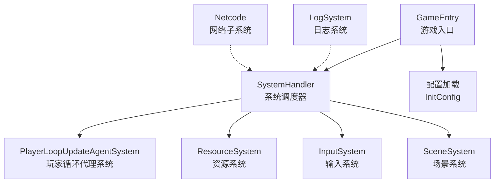
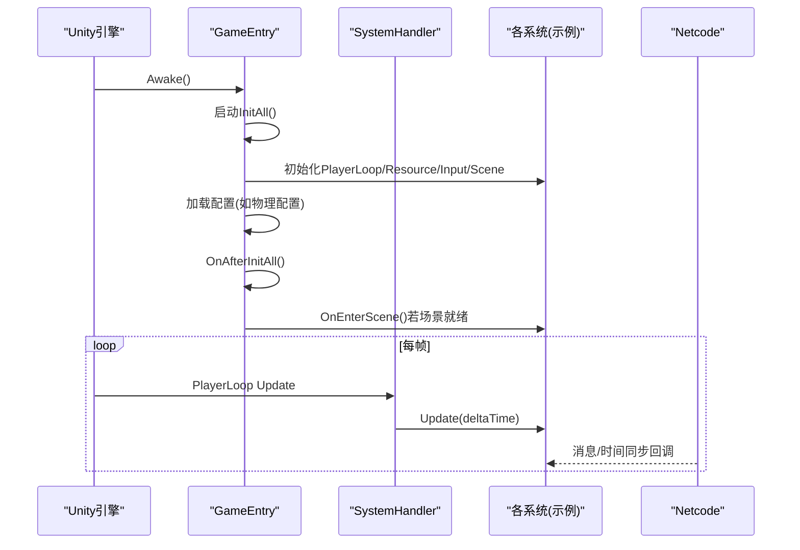
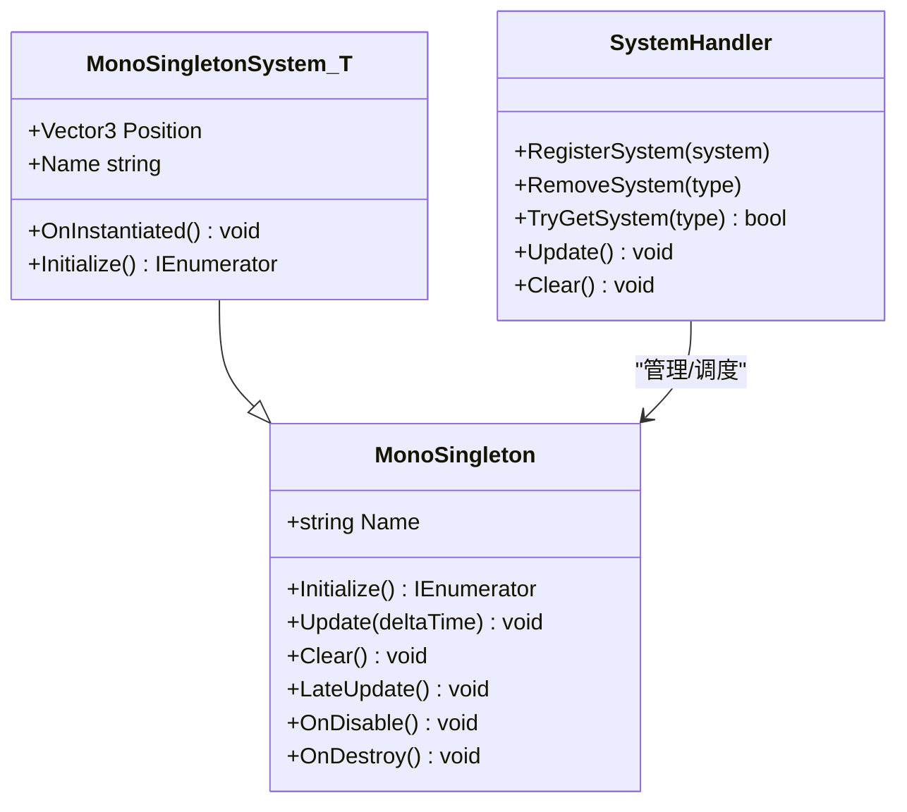
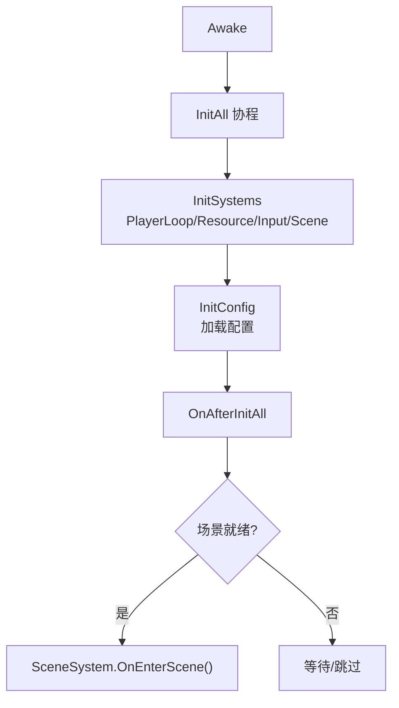
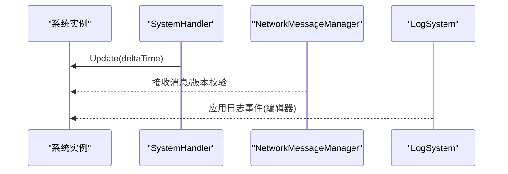
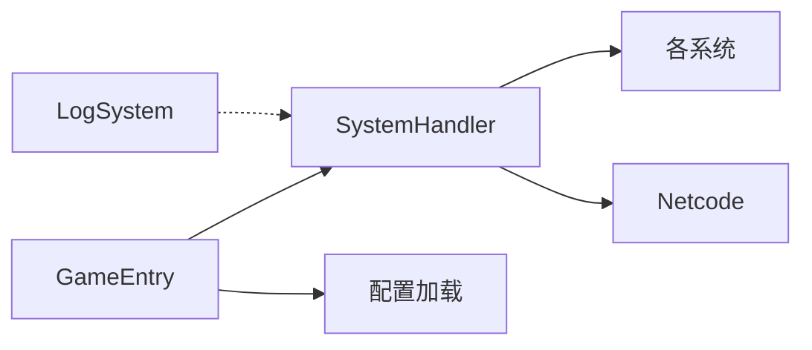

# 核心系统

<cite>
**本文引用的文件**
- [MonoSingleton.cs](file://Assets/Scripts/Core/MonoSingleton.cs)
- [SystemHandler.cs](file://Assets/Scripts/Systems/SystemHandler.cs)
- [MonoSingletonSystem.cs](file://Assets/Scripts/Systems/MonoSingletonSystem.cs)
- [GameEntry.cs](file://Assets/Dev/Scripts/Runtime/GameEntry.cs)
- [LogSystem.cs](file://Assets/Scripts/Systems/Implement/LogSystem/LogSystem.cs)
- [LogSystem.Editor.cs](file://Assets/Scripts/Systems/Implement/LogSystem/LogSystem.Editor.cs)
- [Report.cs](file://Assets/Scripts/Systems/Implement/LogSystem/Report.cs)
- [Logger.cs](file://Assets/Scripts/Systems/Implement/LogSystem/Logger.cs)
- [NetworkUpdateLoop.cs](file://LocalPackages/com.unity.netcode.gameobjects@1.14.1/Runtime/Core/NetworkUpdateLoop.cs)
- [PlayerloopUpdateTest.cs](file://Assets/Dev/Lab/PlayerloopUpdate/PlayerloopUpdateTest.cs)
- [NetworkMessageManager.cs](file://LocalPackages/com.unity.netcode.gameobjects@1.14.1/Runtime/Messaging/NetworkMessageManager.cs)
- [ServerLogMessage.cs](file://LocalPackages/com.unity.netcode.gameobjects@1.14.1/Runtime/Messaging/Messages/ServerLogMessage.cs)
- [NetworkConfig.cs](file://LocalPackages/com.unity.netcode.gameobjects@1.14.1/Runtime/Configuration/NetworkConfig.cs)
- [NetworkLog.cs](file://LocalPackages/com.unity.netcode.gameobjects@1.14.1/Runtime/Logging/NetworkLog.cs)
- [MessageSendingTests.cs](file://LocalPackages/com.unity.netcode.gameobjects@1.14.1/Tests/Editor/Messaging/MessageSendingTests.cs)
- [MessageRegistrationTests.cs](file://LocalPackages/com.unity.netcode.gameobjects@1.14.1/Tests/Editor/Messaging/MessageRegistrationTests.cs)
- [MessageCatcher.cs](file://LocalPackages/com.unity.netcode.gameobjects@1.14.1/Tests/Runtime/TestHelpers/MessageCatcher.cs)
- [NetcodeIntegrationTestHelpers.cs](file://LocalPackages/com.unity.netcode.gameobjects@1.14.1/TestHelpers/Runtime/NetcodeIntegrationTestHelpers.cs)
- [ConfigSystem.cs](file://Assets/Scripts/Systems/Implement/ConfigSystem/ConfigSystem.cs)
</cite>

## 目录
1. [引言](#引言)
2. [项目结构](#项目结构)
3. [核心组件](#核心组件)
4. [架构总览](#架构总览)
5. [详细组件分析](#详细组件分析)
6. [依赖分析](#依赖分析)
7. [性能考虑](#性能考虑)
8. [故障排除指南](#故障排除指南)
9. [结论](#结论)
10. [附录](#附录)

## 引言
本文件面向ProjectR项目的开发者，系统性梳理并解释核心系统的启动流程、初始化机制与生命周期管理；阐明各核心系统之间的职责分工、相互依赖与协作模式；覆盖系统间通信机制、事件传递与数据共享策略；提供扩展与定制化指导原则，并给出性能优化建议、配置参数调优与故障排除方法，帮助开发者深入理解系统内部工作机制。

## 项目结构
ProjectR采用“单例系统 + 统一调度器”的组织方式：所有系统以MonoSingletonSystem为基类，通过SystemHandler统一注册、更新与清理；游戏入口GameEntry负责按序初始化系统与场景；日志系统LogSystem提供统一的日志采集与输出；网络子系统由Netcode提供，贯穿消息注册、发送接收与时间同步等能力。

图表来源
- [GameEntry.cs:15-30](file://Assets/Dev/Scripts/Runtime/GameEntry.cs#L15-L30)
- [SystemHandler.cs:23-31](file://Assets/Scripts/Systems/SystemHandler.cs#L23-L31)
- [MonoSingletonSystem.cs:22](file://Assets/Scripts/Systems/MonoSingletonSystem.cs#L22)

章节来源
- [GameEntry.cs:10-30](file://Assets/Dev/Scripts/Runtime/GameEntry.cs#L10-L30)
- [SystemHandler.cs:8-31](file://Assets/Scripts/Systems/SystemHandler.cs#L8-L31)
- [MonoSingletonSystem.cs:18-34](file://Assets/Scripts/Systems/MonoSingletonSystem.cs#L18-L34)

## 核心组件
- 单例系统基座
  - MonoSingleton：提供单例获取、生命周期钩子（实例化、更新、清理）与协程初始化入口。
  - MonoSingletonSystem<T>：系统基类，负责在实例化时自动注册到SystemHandler，并提供Initialize协程占位。
- 系统调度器
  - SystemHandler：集中管理所有系统实例，按帧遍历调用其Update，支持注册/移除/查询系统。
- 游戏入口
  - GameEntry：Awake中启动InitAll协程，依次初始化PlayerLoopUpdateAgentSystem、ResourceSystem、InputSystem、SceneSystem，随后加载配置并进入场景。
- 日志系统
  - LogSystem：统一日志采集、文件落盘与编辑器事件绑定；Report/Logger提供分组与格式化输出能力。
- 网络子系统（Netcode）
  - NetworkMessageManager：消息类型注册、版本管理与接收钩子；NetworkUpdateLoop：将网络阶段注入Unity PlayerLoop；NetworkLog/ServerLogMessage：服务端日志转发与客户端展示。

章节来源
- [MonoSingleton.cs:7-66](file://Assets/Scripts/Core/MonoSingleton.cs#L7-L66)
- [MonoSingletonSystem.cs:6-35](file://Assets/Scripts/Systems/MonoSingletonSystem.cs#L6-L35)
- [SystemHandler.cs:9-69](file://Assets/Scripts/Systems/SystemHandler.cs#L9-L69)
- [GameEntry.cs:15-30](file://Assets/Dev/Scripts/Runtime/GameEntry.cs#L15-L30)
- [LogSystem.cs:8-35](file://Assets/Scripts/Systems/Implement/LogSystem/LogSystem.cs#L8-L35)
- [Report.cs:10-143](file://Assets/Scripts/Systems/Implement/LogSystem/Report.cs#L10-L143)
- [Logger.cs:6-51](file://Assets/Scripts/Systems/Implement/LogSystem/Logger.cs#L6-L51)
- [NetworkMessageManager.cs:330-374](file://LocalPackages/com.unity.netcode.gameobjects@1.14.1/Runtime/Messaging/NetworkMessageManager.cs#L330-L374)
- [NetworkUpdateLoop.cs:393-406](file://LocalPackages/com.unity.netcode.gameobjects@1.14.1/Runtime/Core/NetworkUpdateLoop.cs#L393-L406)
- [NetworkLog.cs:62-102](file://LocalPackages/com.unity.netcode.gameobjects@1.14.1/Runtime/Logging/NetworkLog.cs#L62-L102)
- [ServerLogMessage.cs:35-55](file://LocalPackages/com.unity.netcode.gameobjects@1.14.1/Runtime/Messaging/Messages/ServerLogMessage.cs#L35-L55)

## 架构总览
下图展示了从游戏入口到系统初始化、更新与网络集成的整体流程。

图表来源
- [GameEntry.cs:15-30](file://Assets/Dev/Scripts/Runtime/GameEntry.cs#L15-L30)
- [SystemHandler.cs:50-68](file://Assets/Scripts/Systems/SystemHandler.cs#L50-L68)
- [NetworkUpdateLoop.cs:393-406](file://LocalPackages/com.unity.netcode.gameobjects@1.14.1/Runtime/Core/NetworkUpdateLoop.cs#L393-L406)

## 详细组件分析

### 单例系统与生命周期
- MonoSingleton
  - 提供静态Instance获取、实例化时的钩子（OnInstantiated）、每帧Update与清理（OnClear），以及协程Initialize占位。
- MonoSingletonSystem<T>
  - 在OnInstantiated中设置GameObject位置、注册到SystemHandler，并记录系统日志。
  - Initialize默认返回空协程，子类可覆盖实现具体初始化逻辑。
- SystemHandler
  - 负责注册/移除系统、保存实例列表与类型映射、每帧遍历调用Update，并在Clear时逐个清理。
  - 使用Profiler.BeginSample/EndSample在编辑器中对各系统Update进行采样，便于性能分析。

图表来源
- [MonoSingleton.cs:7-66](file://Assets/Scripts/Core/MonoSingleton.cs#L7-L66)
- [MonoSingletonSystem.cs:6-35](file://Assets/Scripts/Systems/MonoSingletonSystem.cs#L6-L35)
- [SystemHandler.cs:9-69](file://Assets/Scripts/Systems/SystemHandler.cs#L9-L69)

章节来源
- [MonoSingleton.cs:7-66](file://Assets/Scripts/Core/MonoSingleton.cs#L7-L66)
- [MonoSingletonSystem.cs:18-34](file://Assets/Scripts/Systems/MonoSingletonSystem.cs#L18-L34)
- [SystemHandler.cs:23-68](file://Assets/Scripts/Systems/SystemHandler.cs#L23-L68)

### 游戏启动与初始化流程
- GameEntry.Awake触发InitAll协程，顺序初始化：
  - PlayerLoopUpdateAgentSystem：注入Unity PlayerLoop的网络阶段。
  - ResourceSystem：资源加载准备。
  - InputSystem：输入处理准备。
  - SceneSystem：场景管理准备。
- InitConfig阶段加载实体物理配置等资源。
- OnAfterInitAll后尝试进入场景（若当前场景有效）。

图表来源
- [GameEntry.cs:15-30](file://Assets/Dev/Scripts/Runtime/GameEntry.cs#L15-L30)
- [GameEntry.cs:35-56](file://Assets/Dev/Scripts/Runtime/GameEntry.cs#L35-L56)

章节来源
- [GameEntry.cs:15-56](file://Assets/Dev/Scripts/Runtime/GameEntry.cs#L15-L56)

### 系统间通信与事件传递
- 系统间通信
  - 通过SystemHandler集中调度，各系统通过MonoSingleton接口暴露Initialize/Update/Clear，避免直接耦合。
  - 可在各系统内部维护私有事件或委托，SystemHandler不强制统一事件总线。
- 日志事件
  - LogSystem在编辑器中注册Application.logMessageReceived，统一采集Unity日志并写入文件。
- 网络事件
  - NetworkMessageManager负责消息类型注册与版本管理，支持钩子验证接收/发送。
  - NetworkUpdateLoop将网络阶段注入PlayerLoop，确保网络更新与渲染/物理等阶段有序执行。

图表来源
- [SystemHandler.cs:50-68](file://Assets/Scripts/Systems/SystemHandler.cs#L50-L68)
- [NetworkMessageManager.cs:330-374](file://LocalPackages/com.unity.netcode.gameobjects@1.14.1/Runtime/Messaging/NetworkMessageManager.cs#L330-L374)
- [LogSystem.Editor.cs:38-41](file://Assets/Scripts/Systems/Implement/LogSystem/LogSystem.Editor.cs#L38-L41)

章节来源
- [SystemHandler.cs:50-68](file://Assets/Scripts/Systems/SystemHandler.cs#L50-L68)
- [LogSystem.Editor.cs:18-41](file://Assets/Scripts/Systems/Implement/LogSystem/LogSystem.Editor.cs#L18-L41)
- [NetworkMessageManager.cs:330-374](file://LocalPackages/com.unity.netcode.gameobjects@1.14.1/Runtime/Messaging/NetworkMessageManager.cs#L330-L374)

### 数据共享策略
- 全局单例访问
  - 各系统通过MonoSingletonSystem<T>.instance静态属性获取自身实例，实现跨模块共享。
- 配置共享
  - GameEntry.InitConfig加载配置资源（如实体物理配置），供其他系统在运行期读取。
- 日志共享
  - LogSystem提供全局Log/AppendLine接口，Report/Logger支持分组与缩进，便于模块化日志输出。

章节来源
- [MonoSingletonSystem.cs:10-14](file://Assets/Scripts/Systems/MonoSingletonSystem.cs#L10-L14)
- [GameEntry.cs:31-34](file://Assets/Dev/Scripts/Runtime/GameEntry.cs#L31-L34)
- [Report.cs:109-131](file://Assets/Scripts/Systems/Implement/LogSystem/Report.cs#L109-L131)
- [Logger.cs:36-51](file://Assets/Scripts/Systems/Implement/LogSystem/Logger.cs#L36-L51)

### 扩展与定制化指导
- 新增系统步骤
  - 定义MonoSingletonSystem<T>派生类，重写Initialize完成异步初始化。
  - 在GameEntry.InitSystems中加入该系统的Initialize协程调用。
  - 如需参与PlayerLoop，可在OnInstantiated中注册自定义Agent或使用现有PlayerLoopUpdateAgentSystem。
- 日志扩展
  - 使用LogSystem.Log/Report.AppendLine进行模块化日志输出；必要时新增Logger实例以支持分组。
- 网络消息扩展
  - 实现INetworkMessage并提供消息提供者，通过NetworkMessageManager注册消息类型与处理器。
  - 使用钩子（OnVerifyCanReceive/OnVerifyCanSend）控制消息接收/发送策略。

章节来源
- [MonoSingletonSystem.cs:30-34](file://Assets/Scripts/Systems/MonoSingletonSystem.cs#L30-L34)
- [GameEntry.cs:24-30](file://Assets/Dev/Scripts/Runtime/GameEntry.cs#L24-L30)
- [LogSystem.cs:32-35](file://Assets/Scripts/Systems/Implement/LogSystem/LogSystem.cs#L32-L35)
- [Report.cs:109-125](file://Assets/Scripts/Systems/Implement/LogSystem/Report.cs#L109-L125)
- [NetworkMessageManager.cs:330-374](file://LocalPackages/com.unity.netcode.gameobjects@1.14.1/Runtime/Messaging/NetworkMessageManager.cs#L330-L374)

## 依赖分析
- 组件耦合
  - SystemHandler对各系统仅通过MonoSingleton接口交互，保持高内聚低耦合。
  - GameEntry对系统初始化顺序有显式依赖，但系统内部尽量避免相互依赖。
- 外部依赖
  - Netcode：NetworkUpdateLoop注入网络阶段；NetworkMessageManager负责消息注册与版本；NetworkLog/ServerLogMessage负责日志转发。
- 循环依赖风险
  - 通过SystemHandler集中调度避免系统间直接循环调用；日志与网络通过事件/钩子解耦。

图表来源
- [SystemHandler.cs:23-31](file://Assets/Scripts/Systems/SystemHandler.cs#L23-L31)
- [GameEntry.cs:24-30](file://Assets/Dev/Scripts/Runtime/GameEntry.cs#L24-L30)
- [NetworkUpdateLoop.cs:393-406](file://LocalPackages/com.unity.netcode.gameobjects@1.14.1/Runtime/Core/NetworkUpdateLoop.cs#L393-L406)

章节来源
- [SystemHandler.cs:23-31](file://Assets/Scripts/Systems/SystemHandler.cs#L23-L31)
- [GameEntry.cs:24-30](file://Assets/Dev/Scripts/Runtime/GameEntry.cs#L24-L30)

## 性能考虑
- PlayerLoop集成
  - 利用NetworkUpdateLoop将网络阶段插入Unity PlayerLoop，确保网络更新与其他阶段有序执行，减少帧抖动。
- 更新开销控制
  - SystemHandler在编辑器中对每个系统Update使用Profiler采样，便于定位热点；建议在生产构建中关闭或降低采样频率。
- 日志成本
  - LogSystem在编辑器中统一采集日志，注意避免高频字符串拼接；Report/Logger支持批量Append，减少频繁分配。
- 网络带宽与同步
  - 参考Netcode文档建议：临时事件优先使用RPC，持久状态使用NetworkVariable；根据场景需求调整Tick Rate以平衡平滑度、准确性和带宽。

章节来源
- [NetworkUpdateLoop.cs:393-406](file://LocalPackages/com.unity.netcode.gameobjects@1.14.1/Runtime/Core/NetworkUpdateLoop.cs#L393-L406)
- [SystemHandler.cs:57-65](file://Assets/Scripts/Systems/SystemHandler.cs#L57-L65)
- [LogSystem.Editor.cs:38-41](file://Assets/Scripts/Systems/Implement/LogSystem/LogSystem.Editor.cs#L38-L41)
- [Report.cs:109-125](file://Assets/Scripts/Systems/Implement/LogSystem/Report.cs#L109-L125)

## 故障排除指南
- 网络消息未注册/无处理器
  - 现象：接收无处理器的消息会记录异常。
  - 排查：确认消息提供者已正确注册消息类型与处理器；检查NetworkMessageManager的注册清单。
- 消息接收被拦截
  - 现象：OnVerifyCanReceive返回false导致消息被丢弃。
  - 排查：检查钩子逻辑与目标客户端/消息类型匹配条件。
- 日志未输出
  - 现象：编辑器中未见日志文件或控制台日志缺失。
  - 排查：确认LogSystem.Editor已注册Application.logMessageReceived；检查当前日志文件路径与权限。
- 场景未进入
  - 现象：OnAfterInitAll后未进入场景。
  - 排查：确认SceneSystem.CheckReadyInValidGameScene返回true且OnEnterScene调用成功。

章节来源
- [MessageSendingTests.cs:333-351](file://LocalPackages/com.unity.netcode.gameobjects@1.14.1/Tests/Editor/Messaging/MessageSendingTests.cs#L333-L351)
- [MessageRegistrationTests.cs:146-190](file://LocalPackages/com.unity.netcode.gameobjects@1.14.1/Tests/Editor/Messaging/MessageRegistrationTests.cs#L146-L190)
- [NetworkMessageManager.cs:335-346](file://LocalPackages/com.unity.netcode.gameobjects@1.14.1/Runtime/Messaging/NetworkMessageManager.cs#L335-L346)
- [LogSystem.Editor.cs:34-41](file://Assets/Scripts/Systems/Implement/LogSystem/LogSystem.Editor.cs#L34-L41)
- [GameEntry.cs:51-56](file://Assets/Dev/Scripts/Runtime/GameEntry.cs#L51-L56)

## 结论
ProjectR通过MonoSingletonSystem与SystemHandler实现了清晰的系统生命周期与调度模型；GameEntry负责有序初始化与场景接入；日志与网络子系统分别提供可观测性与跨端通信能力。遵循本文的扩展与优化建议，可进一步提升系统的可维护性、性能与稳定性。

## 附录
- 配置系统
  - ConfigSystem作为占位基类，建议在子类中实现具体配置加载与分发逻辑，供其他系统按需读取。
- 网络配置要点
  - NetworkConfig提供协议版本、Tick率、超时等关键参数；NetworkTimeSystem可按需调整缓冲与同步行为。

章节来源
- [ConfigSystem.cs:7-10](file://Assets/Scripts/Systems/Implement/ConfigSystem/ConfigSystem.cs#L7-L10)
- [NetworkConfig.cs:151-175](file://LocalPackages/com.unity.netcode.gameobjects@1.14.1/Runtime/Configuration/NetworkConfig.cs#L151-L175)