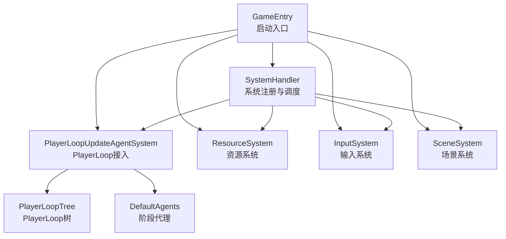
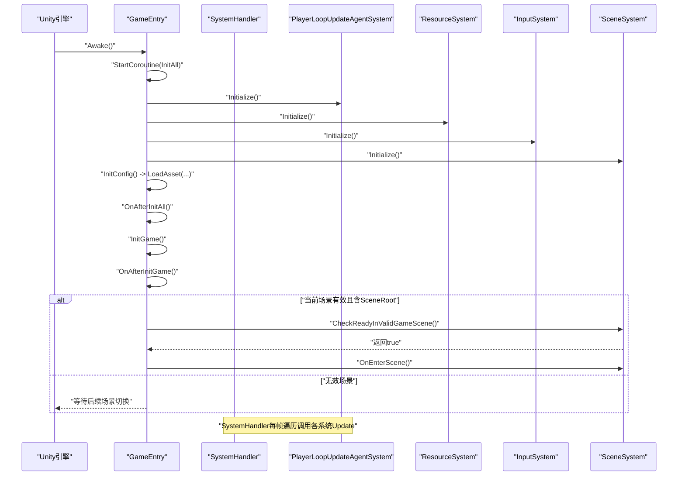
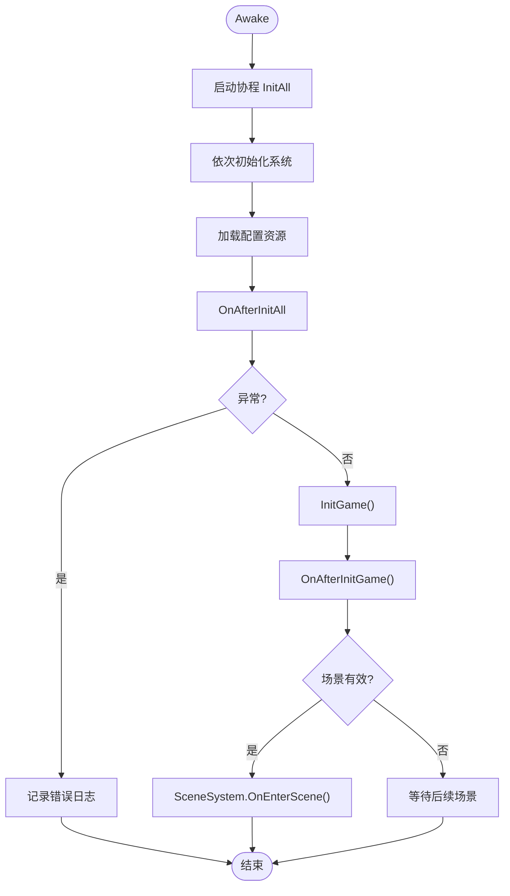
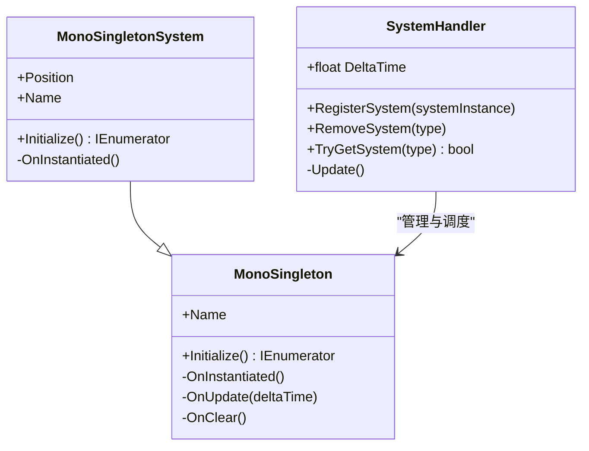
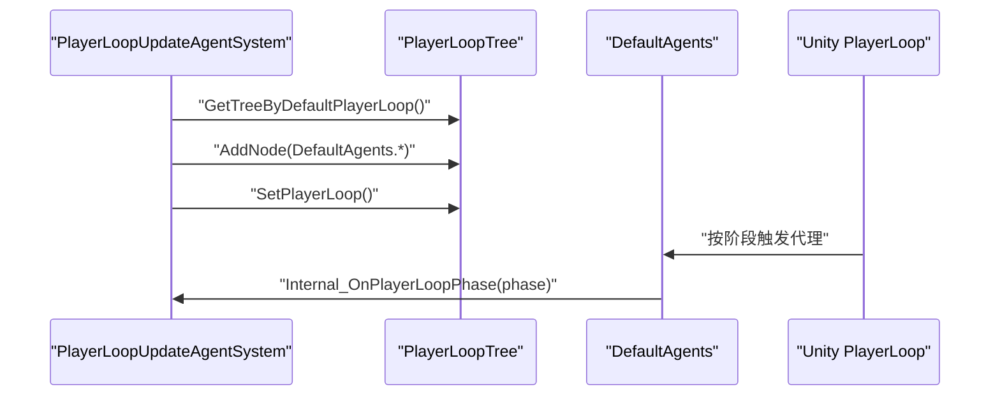
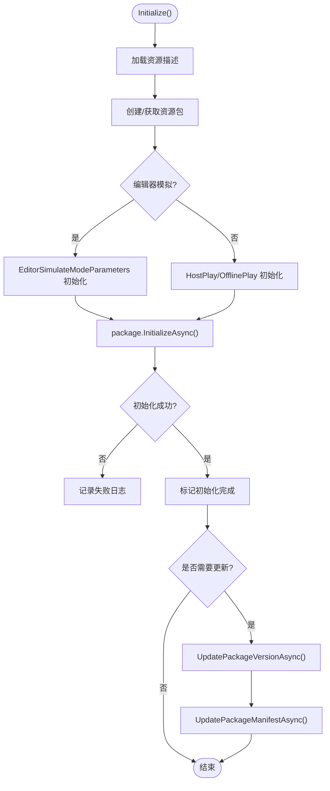
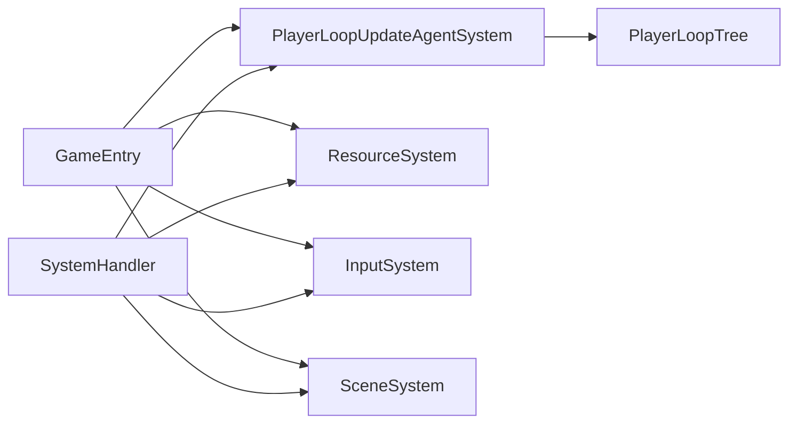

# 游戏启动系统

<cite>
**本文引用的文件**
- [GameEntry.cs](file://Assets/Dev/Scripts/Runtime/GameEntry.cs)
- [SystemHandler.cs](file://Assets/Scripts/Systems/SystemHandler.cs)
- [MonoSingletonSystem.cs](file://Assets/Scripts/Systems/MonoSingletonSystem.cs)
- [MonoSingleton.cs](file://Assets/Scripts/Core/MonoSingleton.cs)
- [PlayerLoopUpdateAgentSystem.cs](file://Assets/Scripts/Systems/Implement/UpdateAgent/PlayerLoopUpdateAgentSystem.cs)
- [PlayerLoopUpdateAgentSystem.DefaultAgents.cs](file://Assets/Scripts/Systems/Implement/UpdateAgent/PlayerLoopUpdateAgentSystem.DefaultAgents.cs)
- [ResourceSystem.cs](file://Assets/Scripts/Systems/Implement/ResourceSystem/ResourceSystem.cs)
- [SceneSystem.cs](file://Assets/Scripts/Systems/Implement/SceneSystem/SceneSystem.cs)
- [InputSystem.cs](file://Assets/Scripts/Systems/Implement/InputSystem/InputSystem.cs)
- [GameEntry.Editor.cs](file://Assets/Dev/Scripts/Runtime/GameEntry.Editor.cs)
- [PlayerLoopTree.cs](file://Assets/Scripts/Core/PlayerLoopAgent/PlayerLoopTree.cs)
- [PlayerloopUpdateTest.cs](file://Assets/Dev/Lab/PlayerloopUpdate/PlayerloopUpdateTest.cs)
</cite>

## 目录
1. [简介](#简介)
2. [项目结构](#项目结构)
3. [核心组件](#核心组件)
4. [架构总览](#架构总览)
5. [详细组件分析](#详细组件分析)
6. [依赖关系分析](#依赖关系分析)
7. [性能考量](#性能考量)
8. [故障排查指南](#故障排查指南)
9. [结论](#结论)
10. [附录](#附录)

## 简介
本文件面向ProjectR项目的“游戏启动系统”，围绕GameEntry作为启动入口点展开，系统性阐述系统初始化顺序、依赖注入与注册机制、启动参数配置、以及启动阶段的关键节点与流程控制。文档同时提供启动流程时序图与关键代码片段路径，帮助开发者快速定位问题并进行性能优化。

## 项目结构
启动系统主要由以下模块构成：
- 入口与调度
  - GameEntry：游戏启动入口，负责按序初始化系统与配置，并在完成后进入场景流程。
  - SystemHandler：系统生命周期与更新调度中心，统一管理所有系统实例。
- 系统层
  - PlayerLoopUpdateAgentSystem：将系统接入Unity PlayerLoop，按阶段驱动各子系统。
  - ResourceSystem：资源包初始化与热更新，支持编辑器模拟与在线模式。
  - SceneSystem：场景加载事件监听与场景根节点解析，驱动场景实体生成。
  - InputSystem：输入系统初始化与动作映射加载。
- 基础设施
  - MonoSingleton/MonoSingletonSystem：单例基类与系统基类，提供统一的初始化与注册机制。
  - PlayerLoopTree：PlayerLoop树构建与注入工具，配合DefaultAgents完成阶段注册。

**图表来源**
- [GameEntry.cs:10-30](file://Assets/Dev/Scripts/Runtime/GameEntry.cs#L10-L30)
- [SystemHandler.cs:23-31](file://Assets/Scripts/Systems/SystemHandler.cs#L23-L31)
- [PlayerLoopUpdateAgentSystem.cs:27-41](file://Assets/Scripts/Systems/Implement/UpdateAgent/PlayerLoopUpdateAgentSystem.cs#L27-L41)
- [PlayerLoopTree.cs:187-206](file://Assets/Scripts/Core/PlayerLoopAgent/PlayerLoopTree.cs#L187-L206)
- [PlayerLoopUpdateAgentSystem.DefaultAgents.cs:12-36](file://Assets/Scripts/Systems/Implement/UpdateAgent/PlayerLoopUpdateAgentSystem.DefaultAgents.cs#L12-L36)
- [ResourceSystem.cs:77-85](file://Assets/Scripts/Systems/Implement/ResourceSystem/ResourceSystem.cs#L77-L85)
- [SceneSystem.cs:37-43](file://Assets/Scripts/Systems/Implement/SceneSystem/SceneSystem.cs#L37-L43)
- [InputSystem.cs:38-45](file://Assets/Scripts/Systems/Implement/InputSystem/InputSystem.cs#L38-L45)

**章节来源**
- [GameEntry.cs:10-30](file://Assets/Dev/Scripts/Runtime/GameEntry.cs#L10-L30)
- [SystemHandler.cs:23-31](file://Assets/Scripts/Systems/SystemHandler.cs#L23-L31)

## 核心组件
- GameEntry
  - 在Awake中启动协程InitAll，依次执行系统初始化与配置加载，随后触发游戏初始化与场景进入逻辑。
  - 关键路径：[GameEntry.cs:10-30](file://Assets/Dev/Scripts/Runtime/GameEntry.cs#L10-L30)、[GameEntry.cs:35-56](file://Assets/Dev/Scripts/Runtime/GameEntry.cs#L35-L56)
- SystemHandler
  - 统一注册与销毁系统实例，每帧遍历调用各系统Update，支持Profiler采样。
  - 关键路径：[SystemHandler.cs:23-68](file://Assets/Scripts/Systems/SystemHandler.cs#L23-L68)
- MonoSingleton/MonoSingletonSystem
  - 提供单例获取、实例化、初始化与清理的统一抽象；系统基类在实例化时自动注册到SystemHandler。
  - 关键路径：[MonoSingleton.cs:7-40](file://Assets/Scripts/Core/MonoSingleton.cs#L7-L40)、[MonoSingletonSystem.cs:18-34](file://Assets/Scripts/Systems/MonoSingletonSystem.cs#L18-L34)
- PlayerLoopUpdateAgentSystem
  - 将系统接入Unity PlayerLoop的多个阶段（Initialization、EarlyUpdate、FixedUpdate、PreUpdate、Update、PreLateUpdate、PostScriptLateUpdate、PostLateUpdate）。
  - 关键路径：[PlayerLoopUpdateAgentSystem.cs:27-41](file://Assets/Scripts/Systems/Implement/UpdateAgent/PlayerLoopUpdateAgentSystem.cs#L27-L41)、[PlayerLoopUpdateAgentSystem.DefaultAgents.cs:12-36](file://Assets/Scripts/Systems/Implement/UpdateAgent/PlayerLoopUpdateAgentSystem.DefaultAgents.cs#L12-L36)、[PlayerLoopTree.cs:187-206](file://Assets/Scripts/Core/PlayerLoopAgent/PlayerLoopTree.cs#L187-L206)
- ResourceSystem
  - 负责资源包初始化、版本更新与清单拉取；支持编辑器模拟与在线模式。
  - 关键路径：[ResourceSystem.cs:77-85](file://Assets/Scripts/Systems/Implement/ResourceSystem/ResourceSystem.cs#L77-L85)、[ResourceSystem.cs:238-309](file://Assets/Scripts/Systems/Implement/ResourceSystem/ResourceSystem.cs#L238-L309)、[ResourceSystem.cs:408-445](file://Assets/Scripts/Systems/Implement/ResourceSystem/ResourceSystem.cs#L408-L445)
- SceneSystem
  - 订阅Unity场景事件，解析场景根节点与环境设置，驱动场景实体生成。
  - 关键路径：[SceneSystem.cs:37-43](file://Assets/Scripts/Systems/Implement/SceneSystem/SceneSystem.cs#L37-L43)、[SceneSystem.cs:49-70](file://Assets/Scripts/Systems/Implement/SceneSystem/SceneSystem.cs#L49-L70)、[SceneSystem.cs:76-95](file://Assets/Scripts/Systems/Implement/SceneSystem/SceneSystem.cs#L76-L95)
- InputSystem
  - 初始化输入系统，加载InputActionAsset并建立动作映射。
  - 关键路径：[InputSystem.cs:38-45](file://Assets/Scripts/Systems/Implement/InputSystem/InputSystem.cs#L38-L45)

**章节来源**
- [GameEntry.cs:10-63](file://Assets/Dev/Scripts/Runtime/GameEntry.cs#L10-L63)
- [SystemHandler.cs:23-68](file://Assets/Scripts/Systems/SystemHandler.cs#L23-L68)
- [MonoSingleton.cs:7-40](file://Assets/Scripts/Core/MonoSingleton.cs#L7-L40)
- [MonoSingletonSystem.cs:18-34](file://Assets/Scripts/Systems/MonoSingletonSystem.cs#L18-L34)
- [PlayerLoopUpdateAgentSystem.cs:27-41](file://Assets/Scripts/Systems/Implement/UpdateAgent/PlayerLoopUpdateAgentSystem.cs#L27-L41)
- [PlayerLoopUpdateAgentSystem.DefaultAgents.cs:12-36](file://Assets/Scripts/Systems/Implement/UpdateAgent/PlayerLoopUpdateAgentSystem.DefaultAgents.cs#L12-L36)
- [PlayerLoopTree.cs:187-206](file://Assets/Scripts/Core/PlayerLoopAgent/PlayerLoopTree.cs#L187-L206)
- [ResourceSystem.cs:77-85](file://Assets/Scripts/Systems/Implement/ResourceSystem/ResourceSystem.cs#L77-L85)
- [ResourceSystem.cs:238-309](file://Assets/Scripts/Systems/Implement/ResourceSystem/ResourceSystem.cs#L238-L309)
- [ResourceSystem.cs:408-445](file://Assets/Scripts/Systems/Implement/ResourceSystem/ResourceSystem.cs#L408-L445)
- [SceneSystem.cs:37-43](file://Assets/Scripts/Systems/Implement/SceneSystem/SceneSystem.cs#L37-L43)
- [SceneSystem.cs:49-70](file://Assets/Scripts/Systems/Implement/SceneSystem/SceneSystem.cs#L49-L70)
- [SceneSystem.cs:76-95](file://Assets/Scripts/Systems/Implement/SceneSystem/SceneSystem.cs#L76-L95)
- [InputSystem.cs:38-45](file://Assets/Scripts/Systems/Implement/InputSystem/InputSystem.cs#L38-L45)

## 架构总览
下图展示了从进程启动到系统完全就绪的启动流程，包括系统初始化顺序、依赖注入与注册、以及场景进入的关键节点。

**图表来源**
- [GameEntry.cs:10-56](file://Assets/Dev/Scripts/Runtime/GameEntry.cs#L10-L56)
- [SystemHandler.cs:50-68](file://Assets/Scripts/Systems/SystemHandler.cs#L50-L68)
- [PlayerLoopUpdateAgentSystem.cs:27-41](file://Assets/Scripts/Systems/Implement/UpdateAgent/PlayerLoopUpdateAgentSystem.cs#L27-L41)
- [ResourceSystem.cs:77-85](file://Assets/Scripts/Systems/Implement/ResourceSystem/ResourceSystem.cs#L77-L85)
- [InputSystem.cs:38-45](file://Assets/Scripts/Systems/Implement/InputSystem/InputSystem.cs#L38-L45)
- [SceneSystem.cs:37-70](file://Assets/Scripts/Systems/Implement/SceneSystem/SceneSystem.cs#L37-L70)

## 详细组件分析

### GameEntry：启动入口与初始化编排
- 初始化顺序
  - PlayerLoopUpdateAgentSystem → ResourceSystem → InputSystem → SceneSystem
  - 随后加载配置资源（如物理配置），最后触发游戏初始化与场景进入。
- 关键行为
  - 异常捕获与日志记录，避免启动失败中断。
  - 场景有效性检查与进入逻辑解耦，便于多场景适配。
- 代码片段路径
  - [GameEntry.cs:15-30](file://Assets/Dev/Scripts/Runtime/GameEntry.cs#L15-L30)
  - [GameEntry.cs:31-34](file://Assets/Dev/Scripts/Runtime/GameEntry.cs#L31-L34)
  - [GameEntry.cs:35-56](file://Assets/Dev/Scripts/Runtime/GameEntry.cs#L35-L56)

**图表来源**
- [GameEntry.cs:15-56](file://Assets/Dev/Scripts/Runtime/GameEntry.cs#L15-L56)

**章节来源**
- [GameEntry.cs:10-63](file://Assets/Dev/Scripts/Runtime/GameEntry.cs#L10-L63)

### SystemHandler：系统注册与调度
- 注册机制
  - MonoSingletonSystem在实例化时自动调用RegisterSystem，确保系统被纳入SystemHandler管理。
  - 支持按类型移除与查找，便于运行时动态管理。
- 调度策略
  - 每帧遍历systemInstances，调用各系统Update，支持Profiler采样以辅助性能分析。
- 代码片段路径
  - [SystemHandler.cs:23-68](file://Assets/Scripts/Systems/SystemHandler.cs#L23-L68)
  - [MonoSingletonSystem.cs:18-25](file://Assets/Scripts/Systems/MonoSingletonSystem.cs#L18-L25)

**图表来源**
- [SystemHandler.cs:23-68](file://Assets/Scripts/Systems/SystemHandler.cs#L23-L68)
- [MonoSingletonSystem.cs:18-34](file://Assets/Scripts/Systems/MonoSingletonSystem.cs#L18-L34)
- [MonoSingleton.cs:46-66](file://Assets/Scripts/Core/MonoSingleton.cs#L46-L66)

**章节来源**
- [SystemHandler.cs:23-68](file://Assets/Scripts/Systems/SystemHandler.cs#L23-L68)
- [MonoSingletonSystem.cs:18-34](file://Assets/Scripts/Systems/MonoSingletonSystem.cs#L18-L34)
- [MonoSingleton.cs:46-66](file://Assets/Scripts/Core/MonoSingleton.cs#L46-L66)

### PlayerLoopUpdateAgentSystem：PlayerLoop接入与阶段代理
- 阶段代理
  - DefaultAgents定义了多个Unity PlayerLoop阶段的代理，统一通过Internal_OnPlayerLoopPhase驱动系统。
- 树构建与注入
  - PlayerLoopTree基于默认PlayerLoop构建树节点，添加DefaultAgents并应用回系统。
- 代码片段路径
  - [PlayerLoopUpdateAgentSystem.cs:27-41](file://Assets/Scripts/Systems/Implement/UpdateAgent/PlayerLoopUpdateAgentSystem.cs#L27-L41)
  - [PlayerLoopUpdateAgentSystem.DefaultAgents.cs:12-36](file://Assets/Scripts/Systems/Implement/UpdateAgent/PlayerLoopUpdateAgentSystem.DefaultAgents.cs#L12-L36)
  - [PlayerLoopTree.cs:187-206](file://Assets/Scripts/Core/PlayerLoopAgent/PlayerLoopTree.cs#L187-L206)

**图表来源**
- [PlayerLoopUpdateAgentSystem.cs:27-41](file://Assets/Scripts/Systems/Implement/UpdateAgent/PlayerLoopUpdateAgentSystem.cs#L27-L41)
- [PlayerLoopUpdateAgentSystem.DefaultAgents.cs:12-36](file://Assets/Scripts/Systems/Implement/UpdateAgent/PlayerLoopUpdateAgentSystem.DefaultAgents.cs#L12-L36)
- [PlayerLoopTree.cs:187-206](file://Assets/Scripts/Core/PlayerLoopAgent/PlayerLoopTree.cs#L187-L206)

**章节来源**
- [PlayerLoopUpdateAgentSystem.cs:27-41](file://Assets/Scripts/Systems/Implement/UpdateAgent/PlayerLoopUpdateAgentSystem.cs#L27-L41)
- [PlayerLoopUpdateAgentSystem.DefaultAgents.cs:12-36](file://Assets/Scripts/Systems/Implement/UpdateAgent/PlayerLoopUpdateAgentSystem.DefaultAgents.cs#L12-L36)
- [PlayerLoopTree.cs:187-206](file://Assets/Scripts/Core/PlayerLoopAgent/PlayerLoopTree.cs#L187-L206)

### ResourceSystem：资源系统初始化与更新
- 初始化流程
  - 加载资源描述文件 → 创建/获取资源包 → 选择初始化参数（编辑器模拟或在线模式）→ 异步初始化。
- 版本与清单更新
  - 当需要更新时，异步更新版本号与清单，支持超时与失败处理。
- 代码片段路径
  - [ResourceSystem.cs:77-85](file://Assets/Scripts/Systems/Implement/ResourceSystem/ResourceSystem.cs#L77-L85)
  - [ResourceSystem.cs:238-309](file://Assets/Scripts/Systems/Implement/ResourceSystem/ResourceSystem.cs#L238-L309)
  - [ResourceSystem.cs:408-445](file://Assets/Scripts/Systems/Implement/ResourceSystem/ResourceSystem.cs#L408-L445)

**图表来源**
- [ResourceSystem.cs:77-85](file://Assets/Scripts/Systems/Implement/ResourceSystem/ResourceSystem.cs#L77-L85)
- [ResourceSystem.cs:238-309](file://Assets/Scripts/Systems/Implement/ResourceSystem/ResourceSystem.cs#L238-L309)
- [ResourceSystem.cs:408-445](file://Assets/Scripts/Systems/Implement/ResourceSystem/ResourceSystem.cs#L408-L445)

**章节来源**
- [ResourceSystem.cs:77-85](file://Assets/Scripts/Systems/Implement/ResourceSystem/ResourceSystem.cs#L77-L85)
- [ResourceSystem.cs:238-309](file://Assets/Scripts/Systems/Implement/ResourceSystem/ResourceSystem.cs#L238-L309)
- [ResourceSystem.cs:408-445](file://Assets/Scripts/Systems/Implement/ResourceSystem/ResourceSystem.cs#L408-L445)

### SceneSystem：场景事件与场景根解析
- 事件订阅
  - 订阅Unity场景加载、卸载与活动场景变更事件，维护回调列表。
- 场景根解析
  - 在CheckReadyInValidGameScene中查找SceneRoot标签对象，解析环境设置与重置点等。
- 代码片段路径
  - [SceneSystem.cs:37-43](file://Assets/Scripts/Systems/Implement/SceneSystem/SceneSystem.cs#L37-L43)
  - [SceneSystem.cs:49-70](file://Assets/Scripts/Systems/Implement/SceneSystem/SceneSystem.cs#L49-L70)
  - [SceneSystem.cs:76-95](file://Assets/Scripts/Systems/Implement/SceneSystem/SceneSystem.cs#L76-L95)

**章节来源**
- [SceneSystem.cs:37-43](file://Assets/Scripts/Systems/Implement/SceneSystem/SceneSystem.cs#L37-L43)
- [SceneSystem.cs:49-70](file://Assets/Scripts/Systems/Implement/SceneSystem/SceneSystem.cs#L49-L70)
- [SceneSystem.cs:76-95](file://Assets/Scripts/Systems/Implement/SceneSystem/SceneSystem.cs#L76-L95)

### InputSystem：输入系统初始化
- 初始化要点
  - 注册按键映射、加载InputActionAsset、建立PlayerInput关联。
- 代码片段路径
  - [InputSystem.cs:38-45](file://Assets/Scripts/Systems/Implement/InputSystem/InputSystem.cs#L38-L45)

**章节来源**
- [InputSystem.cs:38-45](file://Assets/Scripts/Systems/Implement/InputSystem/InputSystem.cs#L38-L45)

### GameEntry（编辑器扩展）
- 编辑器行为
  - 通过InitializeOnLoadMethod在编辑器启动时自动生成GameEntry对象并挂载到场景。
- 代码片段路径
  - [GameEntry.Editor.cs:8-21](file://Assets/Dev/Scripts/Runtime/GameEntry.Editor.cs#L8-L21)

**章节来源**
- [GameEntry.Editor.cs:8-21](file://Assets/Dev/Scripts/Runtime/GameEntry.Editor.cs#L8-L21)

## 依赖关系分析
- 组件耦合
  - GameEntry对各系统存在直接依赖，但通过MonoSingletonSystem的延迟初始化与SystemHandler的集中调度降低耦合度。
  - PlayerLoopUpdateAgentSystem与PlayerLoopTree形成松耦合的注入关系。
- 外部依赖
  - ResourceSystem依赖YooAsset进行包管理与更新。
  - Netcode包用于网络场景的角色与场景加载控制（与本项目启动流程互补）。
- 可能的循环依赖
  - 启动流程中未见直接循环依赖；SystemHandler仅持有MonoSingleton引用，不反向依赖系统。

**图表来源**
- [GameEntry.cs:24-30](file://Assets/Dev/Scripts/Runtime/GameEntry.cs#L24-L30)
- [SystemHandler.cs:23-31](file://Assets/Scripts/Systems/SystemHandler.cs#L23-L31)
- [PlayerLoopUpdateAgentSystem.cs:27-41](file://Assets/Scripts/Systems/Implement/UpdateAgent/PlayerLoopUpdateAgentSystem.cs#L27-L41)
- [PlayerLoopTree.cs:187-206](file://Assets/Scripts/Core/PlayerLoopAgent/PlayerLoopTree.cs#L187-L206)

**章节来源**
- [GameEntry.cs:24-30](file://Assets/Dev/Scripts/Runtime/GameEntry.cs#L24-L30)
- [SystemHandler.cs:23-31](file://Assets/Scripts/Systems/SystemHandler.cs#L23-L31)
- [PlayerLoopUpdateAgentSystem.cs:27-41](file://Assets/Scripts/Systems/Implement/UpdateAgent/PlayerLoopUpdateAgentSystem.cs#L27-L41)
- [PlayerLoopTree.cs:187-206](file://Assets/Scripts/Core/PlayerLoopAgent/PlayerLoopTree.cs#L187-L206)

## 性能考量
- 启动阶段建议
  - 将耗时任务（如资源包初始化与更新）尽量异步化，避免阻塞主线程。
  - 使用SystemHandler的Profiler采样定位瓶颈，关注系统Update开销。
- PlayerLoop接入
  - 合理划分系统到不同阶段，避免在同一阶段执行过多同步操作。
- 资源系统
  - 在编辑器模拟模式下减少不必要的磁盘扫描；在线模式下合理设置超时与重试策略。
- 场景系统
  - 场景实体生成应避免在首帧做大量计算，可拆分为多帧批处理。

## 故障排查指南
- 启动失败常见原因
  - 资源描述文件缺失或格式错误：检查资源描述加载与JSON解析日志。
    - 参考路径：[ResourceSystem.cs:102-135](file://Assets/Scripts/Systems/Implement/ResourceSystem/ResourceSystem.cs#L102-L135)
  - 资源包初始化失败：查看初始化状态与错误日志，确认在线/离线模式参数。
    - 参考路径：[ResourceSystem.cs:238-309](file://Assets/Scripts/Systems/Implement/ResourceSystem/ResourceSystem.cs#L238-L309)
  - 场景无效：确认当前场景存在带“SceneRoot”标签的根对象。
    - 参考路径：[SceneSystem.cs:49-70](file://Assets/Scripts/Systems/Implement/SceneSystem/SceneSystem.cs#L49-L70)
  - 输入系统未正确加载：检查InputActionAsset路径与PlayerInput绑定。
    - 参考路径：[InputSystem.cs:38-45](file://Assets/Scripts/Systems/Implement/InputSystem/InputSystem.cs#L38-L45)
- 调试方法
  - 使用SystemHandler的Profiler采样观察系统Update耗时。
    - 参考路径：[SystemHandler.cs:57-65](file://Assets/Scripts/Systems/SystemHandler.cs#L57-L65)
  - 在GameEntry中捕获异常并记录堆栈信息。
    - 参考路径：[GameEntry.cs:42-45](file://Assets/Dev/Scripts/Runtime/GameEntry.cs#L42-L45)
  - 编辑器下通过GameEntry.Editor自动生成入口对象，便于快速验证。
    - 参考路径：[GameEntry.Editor.cs:8-21](file://Assets/Dev/Scripts/Runtime/GameEntry.Editor.cs#L8-L21)

**章节来源**
- [ResourceSystem.cs:102-135](file://Assets/Scripts/Systems/Implement/ResourceSystem/ResourceSystem.cs#L102-L135)
- [ResourceSystem.cs:238-309](file://Assets/Scripts/Systems/Implement/ResourceSystem/ResourceSystem.cs#L238-L309)
- [SceneSystem.cs:49-70](file://Assets/Scripts/Systems/Implement/SceneSystem/SceneSystem.cs#L49-L70)
- [InputSystem.cs:38-45](file://Assets/Scripts/Systems/Implement/InputSystem/InputSystem.cs#L38-L45)
- [SystemHandler.cs:57-65](file://Assets/Scripts/Systems/SystemHandler.cs#L57-L65)
- [GameEntry.cs:42-45](file://Assets/Dev/Scripts/Runtime/GameEntry.cs#L42-L45)
- [GameEntry.Editor.cs:8-21](file://Assets/Dev/Scripts/Runtime/GameEntry.Editor.cs#L8-L21)

## 结论
ProjectR的启动系统以GameEntry为核心，通过SystemHandler集中管理各系统生命周期，并借助PlayerLoopUpdateAgentSystem将系统接入Unity PlayerLoop，形成清晰的初始化顺序与阶段驱动机制。ResourceSystem与SceneSystem分别承担资源与场景的关键职责，InputSystem提供输入能力。整体设计具备良好的可扩展性与可观测性，便于在启动阶段进行性能优化与问题排查。

## 附录
- 启动参数与配置
  - 资源描述文件路径与在线/离线模式参数由ResourceSystem根据运行环境与配置决定。
  - 场景有效性检查依赖场景根对象标签与环境设置组件。
- 相关工具与测试
  - PlayerLoopTree与DefaultAgents用于构建与注入PlayerLoop节点。
  - PlayerloopUpdateTest提供PlayerLoop结构可视化与调试能力。

**章节来源**
- [ResourceSystem.cs:61-71](file://Assets/Scripts/Systems/Implement/ResourceSystem/ResourceSystem.cs#L61-L71)
- [SceneSystem.cs:49-70](file://Assets/Scripts/Systems/Implement/SceneSystem/SceneSystem.cs#L49-L70)
- [PlayerLoopTree.cs:187-206](file://Assets/Scripts/Core/PlayerLoopAgent/PlayerLoopTree.cs#L187-L206)
- [PlayerloopUpdateTest.cs:91-134](file://Assets/Dev/Lab/PlayerloopUpdate/PlayerloopUpdateTest.cs#L91-L134)