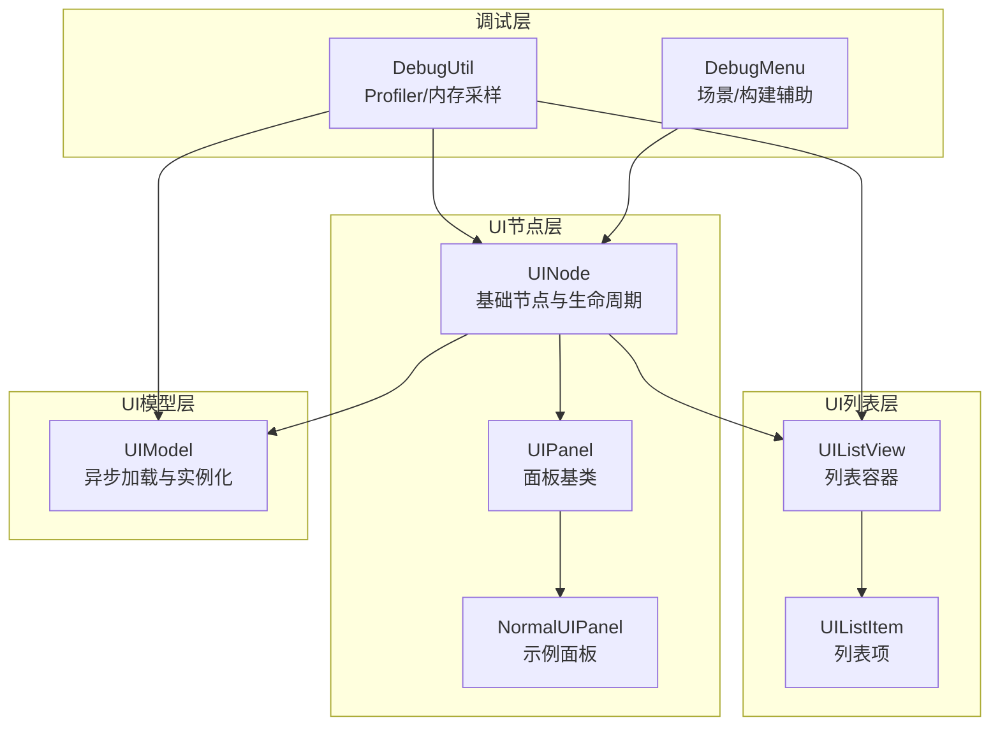
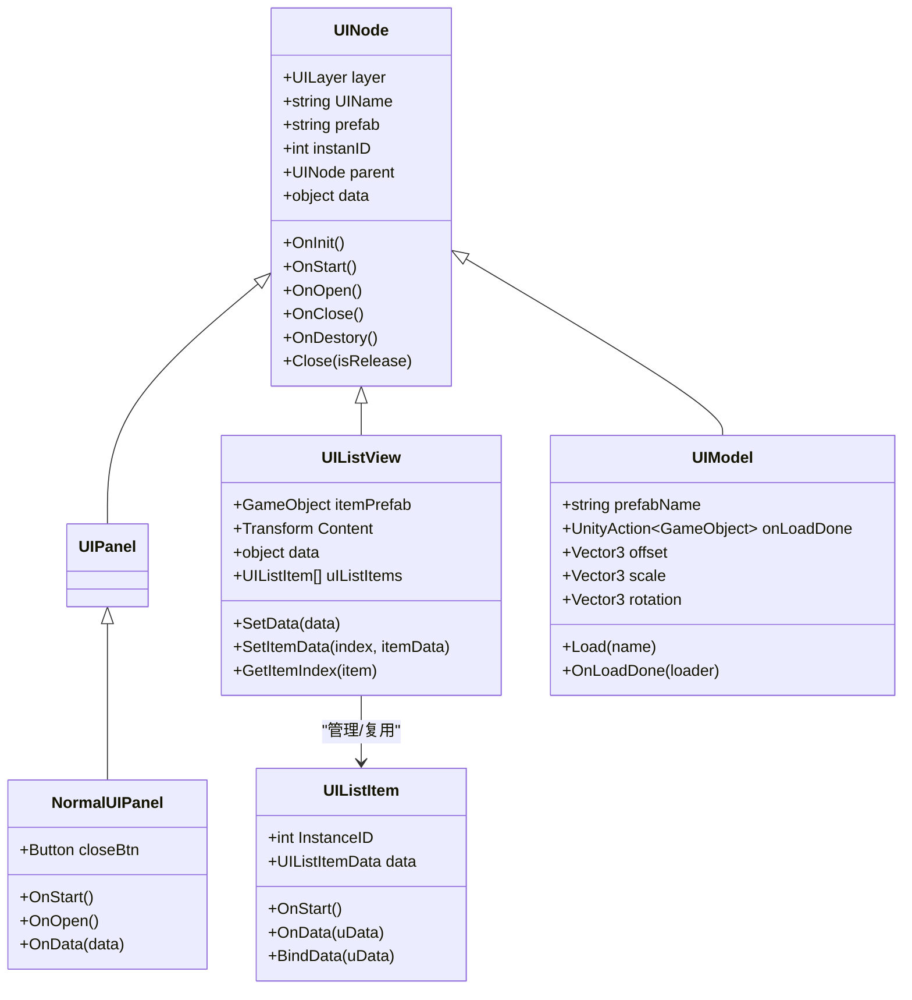
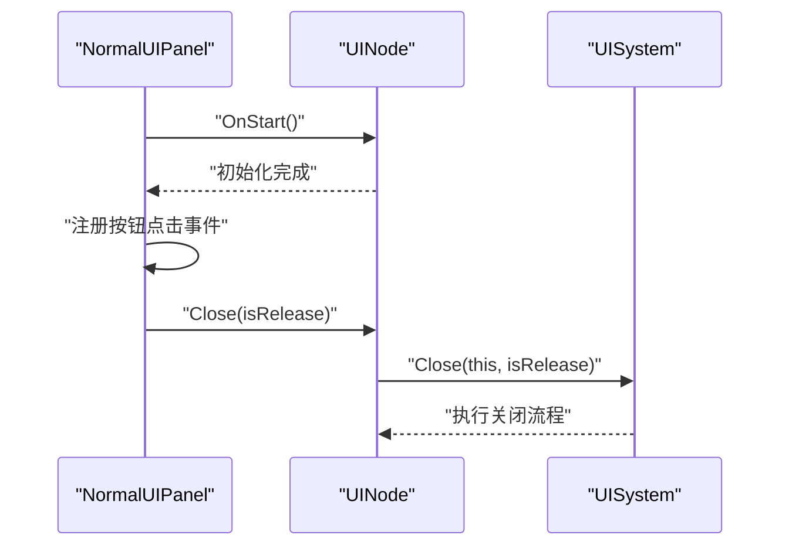
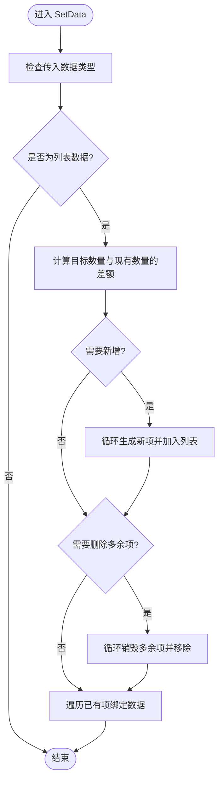
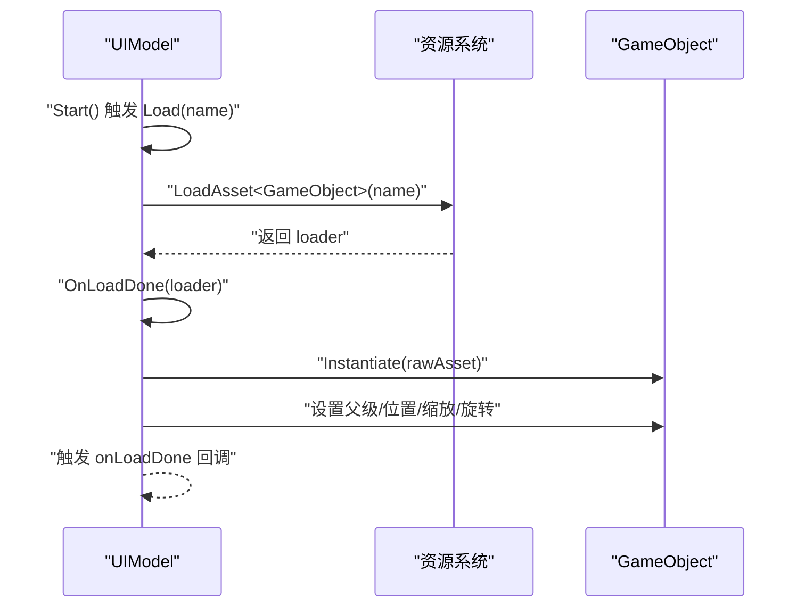
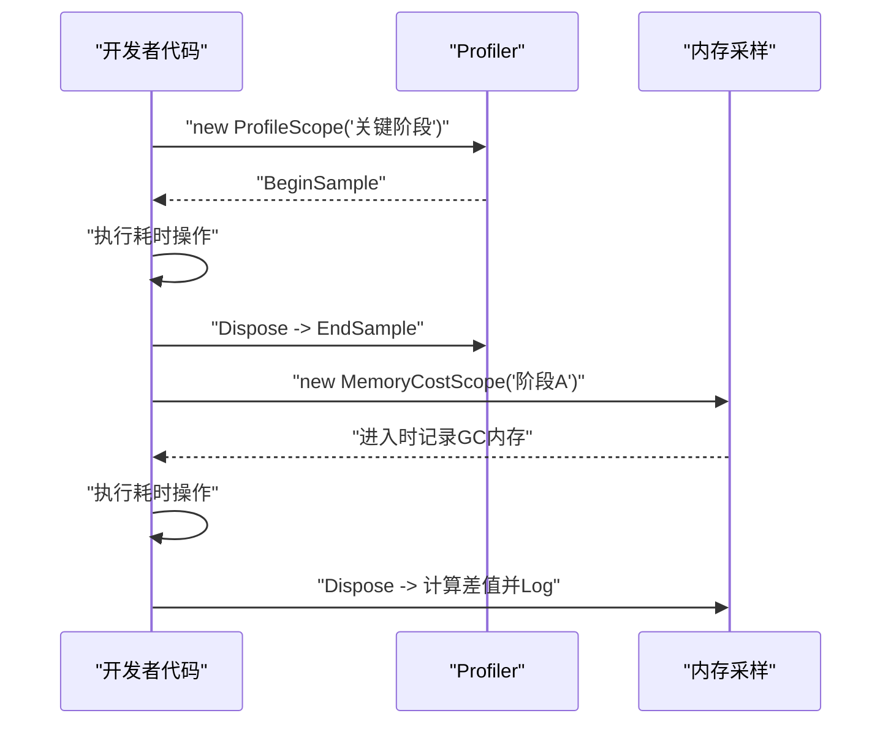
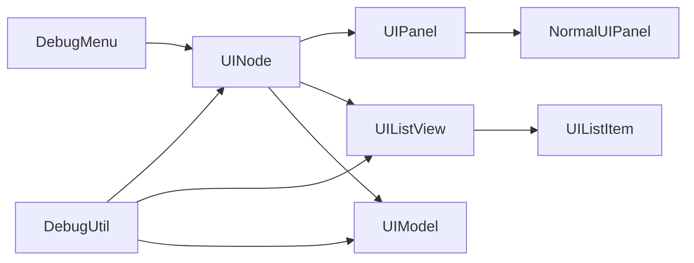

# UI性能优化

<cite>
**本文引用的文件**
- [UINode.cs](file://Assets/Scripts/UI/UINode.cs)
- [UIPanel.cs](file://Assets/Scripts/UI/UIPanel.cs)
- [NormalUIPanel.cs](file://Assets/Scripts/UI/NormalUIPanel.cs)
- [UIListView.cs](file://Assets/Scripts/UI/UIListView.cs)
- [UIListItem.cs](file://Assets/Scripts/UI/UIListItem.cs)
- [UIModel.cs](file://Assets/Scripts/UI/UIModel.cs)
- [DebugUtil.cs](file://Assets/Scripts/RuntimeEditor/DebugUtil.cs)
- [DebugMenu.cs](file://Assets/Scripts/RuntimeEditor/DebugMenu.cs)
</cite>

## 目录
1. [简介](#简介)
2. [项目结构](#项目结构)
3. [核心组件](#核心组件)
4. [架构总览](#架构总览)
5. [详细组件分析](#详细组件分析)
6. [依赖关系分析](#依赖关系分析)
7. [性能考量](#性能考量)
8. [故障排查指南](#故障排查指南)
9. [结论](#结论)
10. [附录](#附录)

## 简介
本文件面向ProjectR项目的UI系统，聚焦于UI性能优化：渲染性能、内存使用与CPU开销的识别与优化；批量渲染、对象池化与延迟加载的实现原理；以及性能监控工具与调试方法（帧率、内存、UI事件耗时）；并总结最佳实践与问题诊断流程，帮助在保证功能正确性的前提下，持续提升UI运行效率与稳定性。

## 项目结构
UI子系统采用“节点树+列表视图+模型挂载”的分层组织方式：
- 节点层：UINode作为基础节点，承载生命周期回调与父子关系
- 面板层：UIPanel派生自UINode，用于承载具体界面
- 列表层：UIListView负责动态生成/复用UIListItem，支持大数据量渲染
- 模型层：UIModel负责异步加载外部模型并在UI中实例化显示
- 调试层：DebugUtil提供Profiler采样与内存成本记录，DebugMenu提供构建与场景快速切换能力

图表来源
- [UINode.cs:1-107](file://Assets/Scripts/UI/UINode.cs#L1-L107)
- [UIPanel.cs:1-9](file://Assets/Scripts/UI/UIPanel.cs#L1-L9)
- [NormalUIPanel.cs:1-34](file://Assets/Scripts/UI/NormalUIPanel.cs#L1-L34)
- [UIListView.cs:1-101](file://Assets/Scripts/UI/UIListView.cs#L1-L101)
- [UIListItem.cs:1-50](file://Assets/Scripts/UI/UIListItem.cs#L1-L50)
- [UIModel.cs:1-63](file://Assets/Scripts/UI/UIModel.cs#L1-L63)
- [DebugUtil.cs:1-34](file://Assets/Scripts/RuntimeEditor/DebugUtil.cs#L1-L34)
- [DebugMenu.cs:1-165](file://Assets/Scripts/RuntimeEditor/DebugMenu.cs#L1-L165)

章节来源
- [UINode.cs:1-107](file://Assets/Scripts/UI/UINode.cs#L1-L107)
- [UIPanel.cs:1-9](file://Assets/Scripts/UI/UIPanel.cs#L1-L9)
- [NormalUIPanel.cs:1-34](file://Assets/Scripts/UI/NormalUIPanel.cs#L1-L34)
- [UIListView.cs:1-101](file://Assets/Scripts/UI/UIListView.cs#L1-L101)
- [UIListItem.cs:1-50](file://Assets/Scripts/UI/UIListItem.cs#L1-L50)
- [UIModel.cs:1-63](file://Assets/Scripts/UI/UIModel.cs#L1-L63)
- [DebugUtil.cs:1-34](file://Assets/Scripts/RuntimeEditor/DebugUtil.cs#L1-L34)
- [DebugMenu.cs:1-165](file://Assets/Scripts/RuntimeEditor/DebugMenu.cs#L1-L165)

## 核心组件
- UINode：统一的UI节点抽象，提供OnInit/OnStart/OnOpen/OnClose/OnDestory等生命周期钩子，并通过UISystem进行关闭控制
- UIPanel/NormalUIPanel：面板基类与示例，负责按钮绑定、打开日志、数据处理等
- UIListView/UIListItem：列表容器与列表项，支持按需生成与销毁，避免一次性创建大量实例
- UIModel：异步加载资源并实例化到UI中，减少主线程阻塞
- DebugUtil/DebugMenu：提供Profiler采样与内存成本统计，以及构建/场景快速启动菜单

章节来源
- [UINode.cs:1-107](file://Assets/Scripts/UI/UINode.cs#L1-L107)
- [UIPanel.cs:1-9](file://Assets/Scripts/UI/UIPanel.cs#L1-L9)
- [NormalUIPanel.cs:1-34](file://Assets/Scripts/UI/NormalUIPanel.cs#L1-L34)
- [UIListView.cs:1-101](file://Assets/Scripts/UI/UIListView.cs#L1-L101)
- [UIListItem.cs:1-50](file://Assets/Scripts/UI/UIListItem.cs#L1-L50)
- [UIModel.cs:1-63](file://Assets/Scripts/UI/UIModel.cs#L1-L63)
- [DebugUtil.cs:1-34](file://Assets/Scripts/RuntimeEditor/DebugUtil.cs#L1-L34)
- [DebugMenu.cs:1-165](file://Assets/Scripts/RuntimeEditor/DebugMenu.cs#L1-L165)

## 架构总览
UI系统以UINode为核心，向上扩展为面板（UIPanel），向下扩展为列表（UIListView/UIListItem），同时可挂载UIModel进行外部资源展示。调试工具贯穿各层，用于性能采样与问题定位。

图表来源
- [UINode.cs:1-107](file://Assets/Scripts/UI/UINode.cs#L1-L107)
- [UIPanel.cs:1-9](file://Assets/Scripts/UI/UIPanel.cs#L1-L9)
- [NormalUIPanel.cs:1-34](file://Assets/Scripts/UI/NormalUIPanel.cs#L1-L34)
- [UIListView.cs:1-101](file://Assets/Scripts/UI/UIListView.cs#L1-L101)
- [UIListItem.cs:1-50](file://Assets/Scripts/UI/UIListItem.cs#L1-L50)
- [UIModel.cs:1-63](file://Assets/Scripts/UI/UIModel.cs#L1-L63)

## 详细组件分析

### UINode与面板体系
- 生命周期：OnInit在Start前初始化实例ID；OnStart负责重置位置等；OnOpen/OnClose/OnDestory分别对应打开/关闭/销毁阶段
- 关闭机制：Close委托给UISystem统一处理，便于集中管理资源释放与层级变化
- 面板扩展：NormalUIPanel演示了按钮点击绑定与数据接收逻辑，便于在面板层实现业务行为

图表来源
- [NormalUIPanel.cs:8-13](file://Assets/Scripts/UI/NormalUIPanel.cs#L8-L13)
- [UINode.cs:25-55](file://Assets/Scripts/UI/UINode.cs#L25-L55)

章节来源
- [UINode.cs:1-107](file://Assets/Scripts/UI/UINode.cs#L1-L107)
- [NormalUIPanel.cs:1-34](file://Assets/Scripts/UI/NormalUIPanel.cs#L1-L34)

### UIListView与列表渲染优化
- 动态生成与销毁：根据数据量增删列表项，避免一次性创建大量实例
- 数据绑定：SetData中计算差额并局部更新，降低不必要的重建
- 复用策略：通过uIListItems缓存已生成项，重复利用以减少GC压力

图表来源
- [UIListView.cs:18-45](file://Assets/Scripts/UI/UIListView.cs#L18-L45)
- [UIListView.cs:50-63](file://Assets/Scripts/UI/UIListView.cs#L50-L63)

章节来源
- [UIListView.cs:1-101](file://Assets/Scripts/UI/UIListView.cs#L1-L101)
- [UIListItem.cs:1-50](file://Assets/Scripts/UI/UIListItem.cs#L1-L50)

### UIModel与延迟加载
- 异步加载：通过协程与资源系统异步获取资源，避免阻塞主线程
- 实例化与变换：在加载完成后实例化到UI中，并应用偏移、缩放、旋转
- 回调通知：onLoadDone回调可用于进一步处理或触发后续逻辑

图表来源
- [UIModel.cs:16-37](file://Assets/Scripts/UI/UIModel.cs#L16-L37)
- [UIModel.cs:38-59](file://Assets/Scripts/UI/UIModel.cs#L38-L59)

章节来源
- [UIModel.cs:1-63](file://Assets/Scripts/UI/UIModel.cs#L1-L63)

### 调试工具与性能采样
- Profiler采样：通过ProfileScope在关键路径BeginSample/EndSample，形成可读的采样区间
- 内存成本：MemoryCostScope在进入时记录GC内存，退出时计算差值，输出KB级成本
- 快速构建/场景：DebugMenu提供一键启动与包模式启动，便于在不同环境验证性能

图表来源
- [DebugUtil.cs:5-18](file://Assets/Scripts/RuntimeEditor/DebugUtil.cs#L5-L18)
- [DebugUtil.cs:20-34](file://Assets/Scripts/RuntimeEditor/DebugUtil.cs#L20-L34)
- [DebugMenu.cs:51-76](file://Assets/Scripts/RuntimeEditor/DebugMenu.cs#L51-L76)

章节来源
- [DebugUtil.cs:1-34](file://Assets/Scripts/RuntimeEditor/DebugUtil.cs#L1-L34)
- [DebugMenu.cs:1-165](file://Assets/Scripts/RuntimeEditor/DebugMenu.cs#L1-L165)

## 依赖关系分析
- 组件耦合：UIListView对UIListItem强依赖，但通过泛型数据结构解耦数据与视图
- 生命周期依赖：面板与列表均依赖UINode的生命周期钩子，统一由UISystem协调关闭
- 资源依赖：UIModel依赖资源系统异步加载，避免同步阻塞
- 调试依赖：DebugUtil贯穿各层，提供统一的性能采样入口

图表来源
- [UINode.cs:1-107](file://Assets/Scripts/UI/UINode.cs#L1-L107)
- [UIPanel.cs:1-9](file://Assets/Scripts/UI/UIPanel.cs#L1-L9)
- [NormalUIPanel.cs:1-34](file://Assets/Scripts/UI/NormalUIPanel.cs#L1-L34)
- [UIListView.cs:1-101](file://Assets/Scripts/UI/UIListView.cs#L1-L101)
- [UIListItem.cs:1-50](file://Assets/Scripts/UI/UIListItem.cs#L1-L50)
- [UIModel.cs:1-63](file://Assets/Scripts/UI/UIModel.cs#L1-L63)
- [DebugUtil.cs:1-34](file://Assets/Scripts/RuntimeEditor/DebugUtil.cs#L1-L34)
- [DebugMenu.cs:1-165](file://Assets/Scripts/RuntimeEditor/DebugMenu.cs#L1-L165)

章节来源
- [UINode.cs:1-107](file://Assets/Scripts/UI/UINode.cs#L1-L107)
- [UIListView.cs:1-101](file://Assets/Scripts/UI/UIListView.cs#L1-L101)
- [UIModel.cs:1-63](file://Assets/Scripts/UI/UIModel.cs#L1-L63)
- [DebugUtil.cs:1-34](file://Assets/Scripts/RuntimeEditor/DebugUtil.cs#L1-L34)
- [DebugMenu.cs:1-165](file://Assets/Scripts/RuntimeEditor/DebugMenu.cs#L1-L165)

## 性能考量
- 渲染性能
  - 批量渲染：UIListView通过复用与按需生成，减少Draw Call与Canvas更新次数
  - 层级管理：UINode统一生命周期，避免频繁层级变动导致的布局重算
- 内存使用
  - 对象池化：建议在UIListView中引入UIListItem对象池，减少频繁Instantiate/Destroy带来的GC抖动
  - 延迟加载：UIModel采用协程异步加载，避免主线程卡顿；可结合资源系统缓存策略降低重复加载
- CPU开销
  - 生命周期钩子：尽量将昂贵操作移出OnStart/OnOpen，放入延迟初始化或按需执行
  - 事件绑定：NormalUIPanel中的按钮事件绑定应避免重复绑定，确保在OnStart中仅绑定一次

[本节为通用性能指导，不直接分析具体文件，故无章节来源]

## 故障排查指南
- 常见问题
  - 列表闪烁/卡顿：检查UIListView的SetData是否频繁创建/销毁项；确认数据变更最小化更新
  - UI打开慢：排查UIModel加载是否阻塞主线程；确认异步加载与回调链路
  - 内存飙升：使用MemoryCostScope定位高成本阶段，检查是否存在重复实例化或未释放引用
- 排查步骤
  - 使用ProfileScope标记关键阶段，观察耗时分布
  - 在DebugMenu中切换包模式与普通模式，对比性能差异
  - 对UIListView增加对象池，减少GC峰值
  - 对UIModel增加加载缓存与失败重试策略

章节来源
- [DebugUtil.cs:5-18](file://Assets/Scripts/RuntimeEditor/DebugUtil.cs#L5-L18)
- [DebugUtil.cs:20-34](file://Assets/Scripts/RuntimeEditor/DebugUtil.cs#L20-L34)
- [DebugMenu.cs:51-76](file://Assets/Scripts/RuntimeEditor/DebugMenu.cs#L51-L76)
- [UIListView.cs:18-45](file://Assets/Scripts/UI/UIListView.cs#L18-L45)
- [UIModel.cs:16-37](file://Assets/Scripts/UI/UIModel.cs#L16-L37)

## 结论
ProjectR的UI系统以UINode为核心，配合UIPanel、UIListView与UIModel实现了清晰的职责分离与可扩展性。通过异步加载、列表复用与生命周期统一管理，可在保证功能的同时显著降低渲染与CPU开销。配合DebugUtil与DebugMenu，可快速定位性能瓶颈并进行针对性优化。建议在后续迭代中引入对象池化与更细粒度的事件耗时统计，持续提升UI运行效率与稳定性。

[本节为总结性内容，不直接分析具体文件，故无章节来源]

## 附录
- 最佳实践清单
  - 列表渲染：优先复用，避免一次性创建；按需更新可见区域
  - 资源加载：异步+缓存；失败重试；避免主线程阻塞
  - 生命周期：将昂贵操作延迟到首次使用；避免重复绑定
  - 调试：使用Profiler采样与内存成本记录，建立性能基线
- 可扩展方向
  - UIListView对象池：基于UIListItemData的键值进行池化管理
  - UIModel加载队列：限制并发加载数，避免资源争抢
  - UI事件性能：为常用交互添加事件耗时采样，形成UI热点画像

[本节为概念性内容，不直接分析具体文件，故无章节来源]