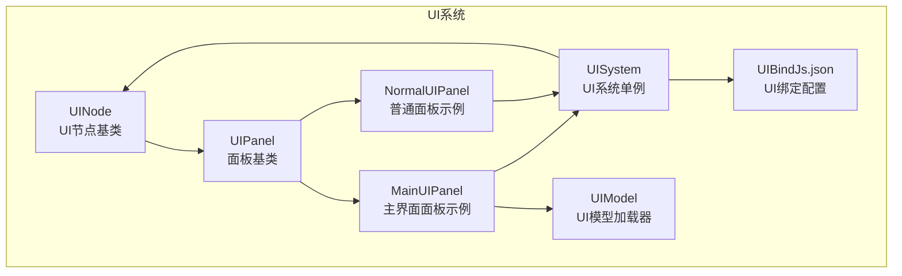
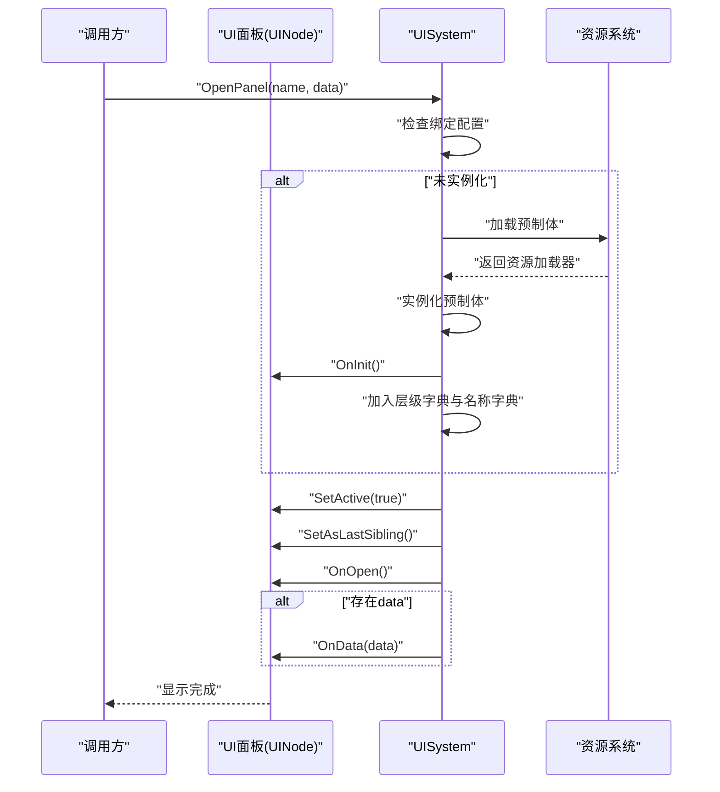
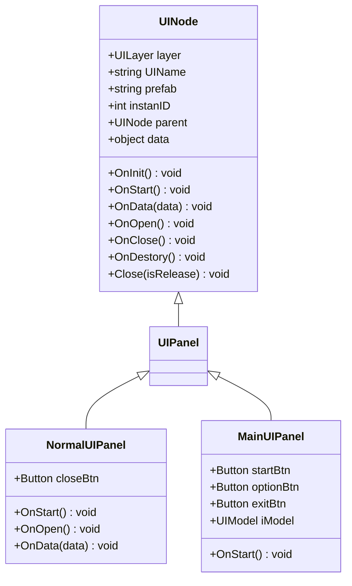
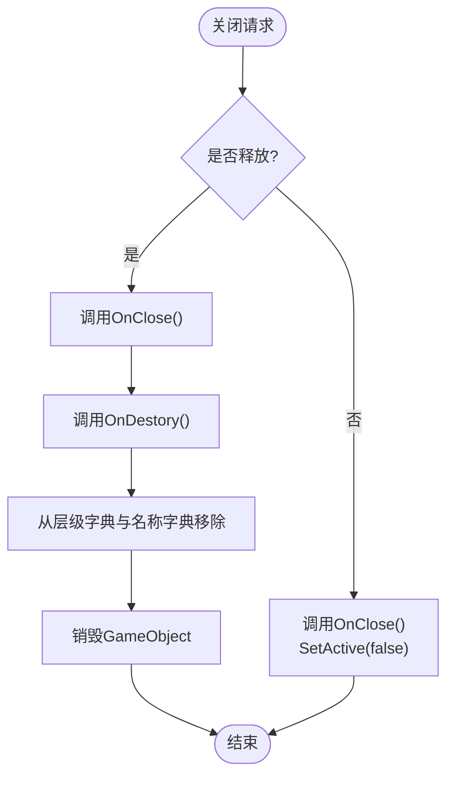
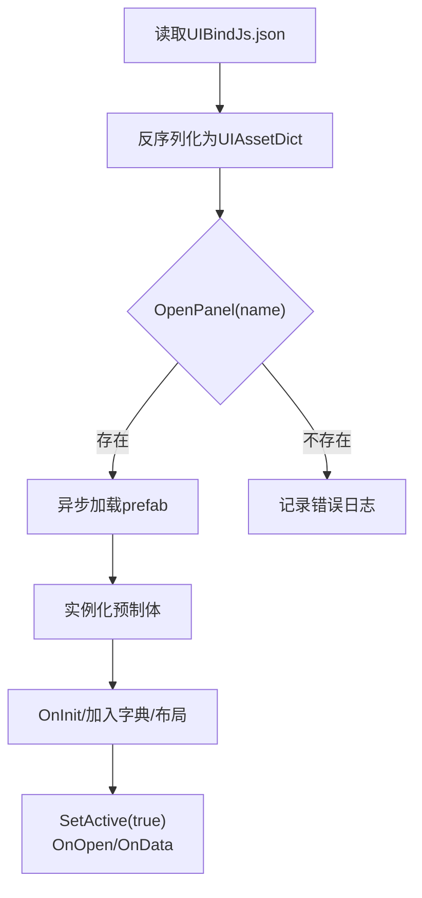
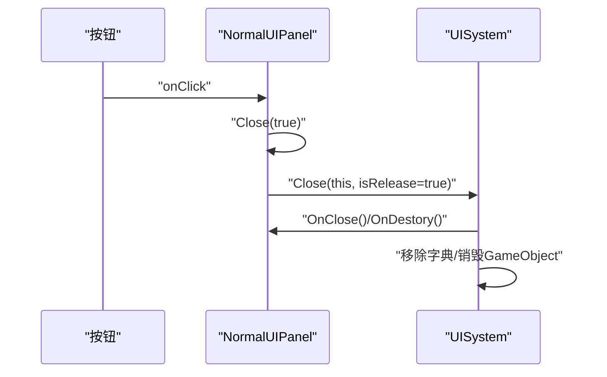
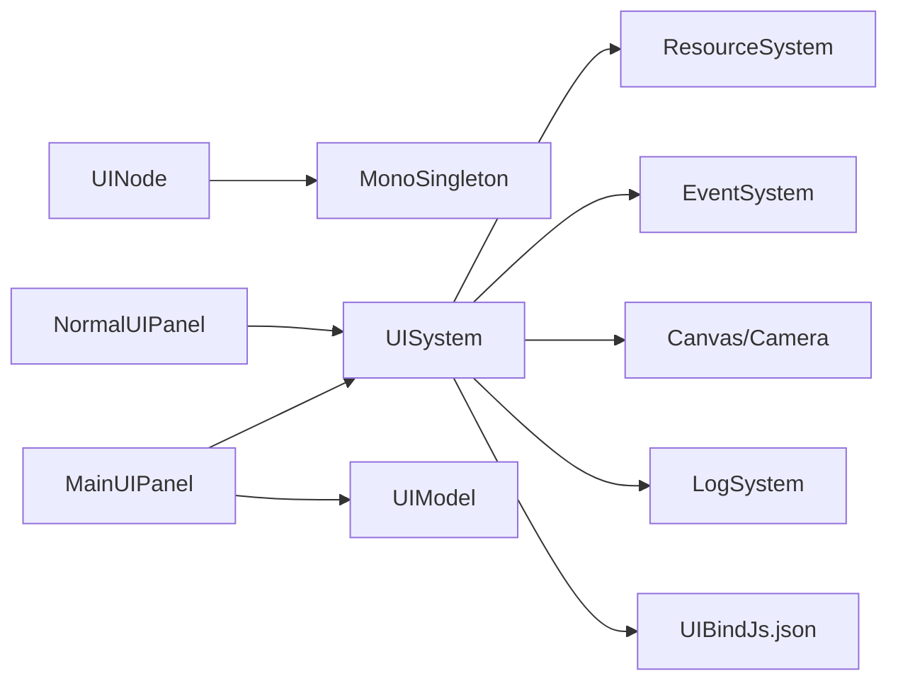

# UI核心概念

<cite>
**本文档引用的文件**
- [UINode.cs](file://Assets/Scripts/UI/UINode.cs)
- [UIPanel.cs](file://Assets/Scripts/UI/UIPanel.cs)
- [NormalUIPanel.cs](file://Assets/Scripts/UI/NormalUIPanel.cs)
- [MainUIPanel.cs](file://Assets/Scripts/UI/MainUI/MainUIPanel.cs)
- [UIBindJs.json](file://Assets/Scripts/UI/UIBindJs.json)
- [UISystem.cs](file://Assets/Scripts/Systems/Implement/UISystem/UISystem.cs)
- [UIModel.cs](file://Assets/Scripts/UI/UIModel.cs)
- [MonoSingleton.cs](file://Assets/Scripts/Core/MonoSingleton.cs)
</cite>

## 目录
1. [简介](#简介)
2. [项目结构](#项目结构)
3. [核心组件](#核心组件)
4. [架构总览](#架构总览)
5. [详细组件分析](#详细组件分析)
6. [依赖分析](#依赖分析)
7. [性能考虑](#性能考虑)
8. [故障排查指南](#故障排查指南)
9. [结论](#结论)
10. [附录](#附录)

## 简介
本文件面向ProjectR项目的UI系统，系统性阐述UI节点树设计与组织方式、UI层级系统（Main、Game、Top、MessageTop）的设计原理与使用场景、UI绑定系统（含UIBindJs.json）的工作机制、UI的创建、显示、隐藏与销毁流程，以及内存管理与性能优化策略。同时给出核心接口与扩展点说明，帮助开发者快速理解并高效扩展UI系统。

## 项目结构
UI系统主要由以下模块构成：
- UINode体系：所有UI节点的基类与数据结构，负责生命周期回调、父子关系与数据传递。
- UISystem：UI系统的单例管理器，负责UI根节点生成、层级布局、资源加载、显示/隐藏/关闭、事件系统与相机配置。
- UI绑定系统：通过UIBindJs.json将UI名称映射到预制体路径，支持动态加载与实例化。
- 示例UI：MainUIPanel、NormalUIPanel等，展示如何继承UINode并接入UISystem。
- UIModel：用于在UI中动态加载与挂载3D模型的工具组件。

**图表来源**
- [UINode.cs:1-107](file://Assets/Scripts/UI/UINode.cs#L1-L107)
- [UIPanel.cs:1-9](file://Assets/Scripts/UI/UIPanel.cs#L1-L9)
- [NormalUIPanel.cs:1-34](file://Assets/Scripts/UI/NormalUIPanel.cs#L1-L34)
- [MainUIPanel.cs:1-39](file://Assets/Scripts/UI/MainUI/MainUIPanel.cs#L1-L39)
- [UISystem.cs:1-280](file://Assets/Scripts/Systems/Implement/UISystem/UISystem.cs#L1-L280)
- [UIBindJs.json:1-32](file://Assets/Scripts/UI/UIBindJs.json#L1-L32)
- [UIModel.cs:1-63](file://Assets/Scripts/UI/UIModel.cs#L1-L63)

**章节来源**
- [UINode.cs:1-107](file://Assets/Scripts/UI/UINode.cs#L1-L107)
- [UISystem.cs:1-280](file://Assets/Scripts/Systems/Implement/UISystem/UISystem.cs#L1-L280)
- [UIBindJs.json:1-32](file://Assets/Scripts/UI/UIBindJs.json#L1-L32)
- [UIPanel.cs:1-9](file://Assets/Scripts/UI/UIPanel.cs#L1-L9)
- [NormalUIPanel.cs:1-34](file://Assets/Scripts/UI/NormalUIPanel.cs#L1-L34)
- [MainUIPanel.cs:1-39](file://Assets/Scripts/UI/MainUI/MainUIPanel.cs#L1-L39)
- [UIModel.cs:1-63](file://Assets/Scripts/UI/UIModel.cs#L1-L63)

## 核心组件
- UINode：所有UI节点的基类，提供生命周期回调（OnInit、OnStart、OnData、OnOpen、OnClose、OnDestory）、父子关系维护、实例ID记录与关闭入口（Close）。
- UISystem：UI系统单例，负责：
  - 初始化UI根画布、事件系统、UI相机
  - 创建四层UI根节点（Main、Game、Top、MessageTop）
  - 动态加载UI预制体、实例化与布局
  - 显示/隐藏/关闭UI节点，支持释放或隐藏两种模式
  - 数据分发（SetData），将数据传递给目标UI节点
- UI绑定系统：通过UIBindJs.json将UI名称映射到预制体路径，运行时读取并缓存，供UISystem按名打开面板。
- 示例UI：
  - NormalUIPanel：演示按钮点击触发关闭（Close），以及OnData接收字符串与UINodeData类型数据。
  - MainUIPanel：演示按钮点击打开其他面板、向子面板传递数据（MainUIData）。
- UIModel：在UI中动态加载并挂载3D模型，支持位置、缩放、旋转与回调通知。

**章节来源**
- [UINode.cs:25-57](file://Assets/Scripts/UI/UINode.cs#L25-L57)
- [UISystem.cs:21-48](file://Assets/Scripts/Systems/Implement/UISystem/UISystem.cs#L21-L48)
- [UISystem.cs:161-178](file://Assets/Scripts/Systems/Implement/UISystem/UISystem.cs#L161-L178)
- [UISystem.cs:252-264](file://Assets/Scripts/Systems/Implement/UISystem/UISystem.cs#L252-L264)
- [NormalUIPanel.cs:8-31](file://Assets/Scripts/UI/NormalUIPanel.cs#L8-L31)
- [MainUIPanel.cs:10-30](file://Assets/Scripts/UI/MainUI/MainUIPanel.cs#L10-L30)
- [UIModel.cs:16-59](file://Assets/Scripts/UI/UIModel.cs#L16-L59)

## 架构总览
UI系统采用“节点树 + 层级根容器 + 绑定配置”的架构：
- 节点树：每个UINode作为树节点，可设置父节点（OnData中传入UINode），形成父子关系。
- 层级根容器：UISystem在Canvas下创建四个层级根（Main、Game、Top、MessageTop），通过z轴偏移控制深度，保证渲染顺序。
- 绑定配置：UIBindJs.json提供UI名称到预制体路径的映射，UISystem按名打开面板时进行查找与加载。
- 生命周期：UINode提供统一的生命周期回调，UISystem在实例化后调用OnInit、设置激活状态、调用OnOpen与OnData。

**图表来源**
- [UISystem.cs:161-178](file://Assets/Scripts/Systems/Implement/UISystem/UISystem.cs#L161-L178)
- [UISystem.cs:197-246](file://Assets/Scripts/Systems/Implement/UISystem/UISystem.cs#L197-L246)
- [UINode.cs:25-47](file://Assets/Scripts/UI/UINode.cs#L25-L47)

**章节来源**
- [UISystem.cs:49-114](file://Assets/Scripts/Systems/Implement/UISystem/UISystem.cs#L49-L114)
- [UISystem.cs:161-246](file://Assets/Scripts/Systems/Implement/UISystem/UISystem.cs#L161-L246)
- [UINode.cs:25-57](file://Assets/Scripts/UI/UINode.cs#L25-L57)

## 详细组件分析

### UINode与UI节点树
- 设计理念：UINode作为所有UI节点的基类，统一生命周期与交互接口；通过OnData支持父子关系建立，parent字段保存父节点引用。
- 生命周期：
  - OnInit：初始化阶段，记录实例ID。
  - OnStart：开始阶段，重置RectTransform本地坐标。
  - OnData：接收数据，若为UINode则设置父节点。
  - OnOpen/OnClose：显示/隐藏时的钩子。
  - OnDestory：销毁时的清理钩子。
  - Close：委托UISystem执行关闭逻辑，支持释放或隐藏。
- 节点树组织：通过父子关系形成树形结构，便于事件传播与数据向下传递。

**图表来源**
- [UINode.cs:9-57](file://Assets/Scripts/UI/UINode.cs#L9-L57)
- [UIPanel.cs:3-6](file://Assets/Scripts/UI/UIPanel.cs#L3-L6)
- [NormalUIPanel.cs:6-31](file://Assets/Scripts/UI/NormalUIPanel.cs#L6-L31)
- [MainUIPanel.cs:8-30](file://Assets/Scripts/UI/MainUI/MainUIPanel.cs#L8-L30)

**章节来源**
- [UINode.cs:9-57](file://Assets/Scripts/UI/UINode.cs#L9-L57)
- [UIPanel.cs:1-9](file://Assets/Scripts/UI/UIPanel.cs#L1-L9)
- [NormalUIPanel.cs:1-34](file://Assets/Scripts/UI/NormalUIPanel.cs#L1-L34)
- [MainUIPanel.cs:1-39](file://Assets/Scripts/UI/MainUI/MainUIPanel.cs#L1-L39)

### UISystem与UI层级系统
- 层级枚举（UILayer）：Main（全屏界面）、Game（游戏中界面）、Top（弹窗）、MessageTop（最顶级）。
- 根容器生成：在Canvas下生成四个层级根对象，分别对应不同z轴深度，确保渲染顺序。
- 事件系统与相机：创建EventSystem与UI专用相机，设置渲染模式与裁剪掩码，保证UI输入与渲染正确。
- 打开面板：按名称从绑定字典查找，若未实例化则异步加载并实例化，随后显示并调用OnOpen与OnData。
- 关闭面板：支持两种模式：
  - 隐藏：仅SetActive(false)，保留实例以便复用。
  - 释放：调用OnClose/OnDestory，从字典移除，销毁GameObject。

**图表来源**
- [UISystem.cs:145-160](file://Assets/Scripts/Systems/Implement/UISystem/UISystem.cs#L145-L160)

**章节来源**
- [UISystem.cs:14-20](file://Assets/Scripts/Systems/Implement/UISystem/UISystem.cs#L14-L20)
- [UISystem.cs:49-114](file://Assets/Scripts/Systems/Implement/UISystem/UISystem.cs#L49-L114)
- [UISystem.cs:145-160](file://Assets/Scripts/Systems/Implement/UISystem/UISystem.cs#L145-L160)

### UI绑定系统（UIBindJs.json）
- 配置格式：JSON字典，键为UI名称（如“MainPanel”），值包含name与prefab两个字段。
- 加载机制：UISystem启动时读取UIBindJs.json，反序列化为UIAssetDict，供OpenPanel按名查找。
- 动态绑定：通过资源系统异步加载prefab路径对应的预制体，实例化后交由UINode处理生命周期。

**图表来源**
- [UISystem.cs:38-48](file://Assets/Scripts/Systems/Implement/UISystem/UISystem.cs#L38-L48)
- [UISystem.cs:161-178](file://Assets/Scripts/Systems/Implement/UISystem/UISystem.cs#L161-L178)
- [UISystem.cs:197-246](file://Assets/Scripts/Systems/Implement/UISystem/UISystem.cs#L197-L246)
- [UIBindJs.json:1-32](file://Assets/Scripts/UI/UIBindJs.json#L1-L32)

**章节来源**
- [UISystem.cs:38-48](file://Assets/Scripts/Systems/Implement/UISystem/UISystem.cs#L38-L48)
- [UISystem.cs:161-178](file://Assets/Scripts/Systems/Implement/UISystem/UISystem.cs#L161-L178)
- [UISystem.cs:197-246](file://Assets/Scripts/Systems/Implement/UISystem/UISystem.cs#L197-L246)
- [UIBindJs.json:1-32](file://Assets/Scripts/UI/UIBindJs.json#L1-L32)

### 示例UI与数据传递
- NormalUIPanel：在OnStart中注册关闭按钮事件，点击后调用Close(true)释放当前面板；OnData支持字符串与UINodeData类型，便于接收来自父面板的数据。
- MainUIPanel：在OnStart中注册按钮事件，打开其他面板并传递数据（MainUIData），展示父子节点间的数据传递与打开新面板的流程。

**图表来源**
- [NormalUIPanel.cs:8-13](file://Assets/Scripts/UI/NormalUIPanel.cs#L8-L13)
- [UISystem.cs:145-160](file://Assets/Scripts/Systems/Implement/UISystem/UISystem.cs#L145-L160)

**章节来源**
- [NormalUIPanel.cs:8-31](file://Assets/Scripts/UI/NormalUIPanel.cs#L8-L31)
- [MainUIPanel.cs:14-30](file://Assets/Scripts/UI/MainUI/MainUIPanel.cs#L14-L30)

### UIModel与模型加载
- UIModel在Start时根据prefabName异步加载资源，实例化后设置父子关系与变换参数（offset/scale/rotation），并将子节点图层统一为UI层，最后触发onLoadDone回调。
- 在MainUIPanel中，通过iModel.onLoadDone监听模型加载完成事件，用于后续UI交互或调试输出。

**章节来源**
- [UIModel.cs:16-59](file://Assets/Scripts/UI/UIModel.cs#L16-L59)
- [MainUIPanel.cs:26-29](file://Assets/Scripts/UI/MainUI/MainUIPanel.cs#L26-L29)

## 依赖分析
- UINode依赖MonoBehaviour，提供生命周期回调与RectTransform基础操作。
- UISystem依赖：
  - 资源系统：异步加载UI预制体
  - EventSystem：处理UI输入事件
  - Canvas/Camera：渲染UI
  - 日志系统：错误与调试日志
- UI绑定系统依赖JSON解析与资源系统
- 单例基类：MonoSingleton提供延迟创建与生命周期管理

**图表来源**
- [MonoSingleton.cs:7-66](file://Assets/Scripts/Core/MonoSingleton.cs#L7-L66)
- [UISystem.cs:1-10](file://Assets/Scripts/Systems/Implement/UISystem/UISystem.cs#L1-L10)
- [MainUIPanel.cs:13-29](file://Assets/Scripts/UI/MainUI/MainUIPanel.cs#L13-L29)

**章节来源**
- [MonoSingleton.cs:1-70](file://Assets/Scripts/Core/MonoSingleton.cs#L1-L70)
- [UISystem.cs:1-10](file://Assets/Scripts/Systems/Implement/UISystem/UISystem.cs#L1-L10)

## 性能考虑
- 预制体加载：使用异步加载避免主线程阻塞；建议在进入场景前预热常用UI资源。
- 实例复用：关闭时可选择隐藏而非释放，减少重复实例化的开销；需要时再释放以回收内存。
- 渲染深度：通过层级根的z轴偏移控制渲染顺序，避免不必要的排序计算。
- 事件系统：统一的EventSystem与UI相机，减少多相机切换带来的性能损耗。
- 字典查询：按名称与实例ID的双索引字典，保证O(1)级别的查找与更新。

[本节为通用性能建议，不直接分析具体文件，故无“章节来源”]

## 故障排查指南
- UI未显示：
  - 检查UI名称是否存在于UIBindJs.json中
  - 确认prefab路径正确且资源已打包
  - 查看日志是否存在“Failure to load UI asset”或“Failure to instantiate UI”
- 数据未传递：
  - 确认SetData调用的目标UI名称正确
  - 检查OnData中对数据类型的判断与转换
- 关闭后无法再次打开：
  - 若采用隐藏模式，确认UI被SetActive(false)但未被销毁
  - 若采用释放模式，确认已从nameUINodeDict移除并销毁GameObject
- 输入无响应：
  - 检查EventSystem是否创建成功
  - 确认UI相机裁剪掩码包含UI层

**章节来源**
- [UISystem.cs:174-177](file://Assets/Scripts/Systems/Implement/UISystem/UISystem.cs#L174-L177)
- [UISystem.cs:190-211](file://Assets/Scripts/Systems/Implement/UISystem/UISystem.cs#L190-L211)
- [UISystem.cs:252-264](file://Assets/Scripts/Systems/Implement/UISystem/UISystem.cs#L252-L264)

## 结论
ProjectR的UI系统以UINode为核心，结合UISystem的层级管理与绑定配置，实现了清晰的UI节点树、稳定的生命周期与高效的资源加载。通过Main、Game、Top、MessageTop四层根容器，系统在渲染顺序与交互上具备良好的可扩展性。配合UIModel与数据传递机制，开发者可以快速构建复杂的UI交互流程。建议在实际开发中遵循“按需加载、隐藏复用、释放回收”的原则，持续优化资源与性能。

[本节为总结性内容，不直接分析具体文件，故无“章节来源”]

## 附录

### 核心接口与扩展点
- UINode扩展点：
  - OnInit/OnStart/OnData/OnOpen/OnClose/OnDestory：覆盖生命周期钩子
  - OnData：支持UINode与自定义数据类型，建立父子关系与数据通道
  - Close：委托UISystem执行关闭逻辑
- UISystem扩展点：
  - OpenPanel：按名称打开面板，支持数据传递
  - Close：支持隐藏或释放两种模式
  - SetData：向指定UI名称发送数据
  - 层级根：可在CreateRoot中新增层级或调整z轴偏移
- UI绑定：
  - UIBindJs.json：新增UI名称与prefab映射
  - UIAssetDataFunc：自定义读取策略（如从Addressables加载）

**章节来源**
- [UINode.cs:25-57](file://Assets/Scripts/UI/UINode.cs#L25-L57)
- [UISystem.cs:161-178](file://Assets/Scripts/Systems/Implement/UISystem/UISystem.cs#L161-L178)
- [UISystem.cs:145-160](file://Assets/Scripts/Systems/Implement/UISystem/UISystem.cs#L145-L160)
- [UISystem.cs:252-264](file://Assets/Scripts/Systems/Implement/UISystem/UISystem.cs#L252-L264)
- [UISystem.cs:266-277](file://Assets/Scripts/Systems/Implement/UISystem/UISystem.cs#L266-L277)