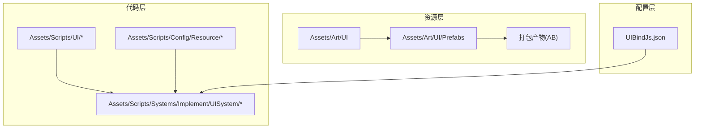
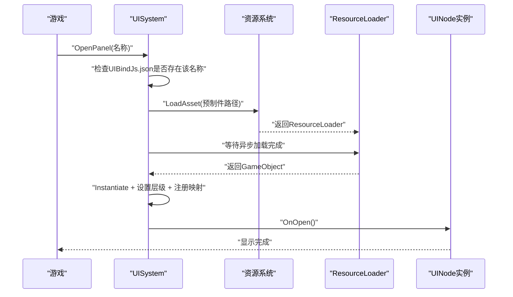
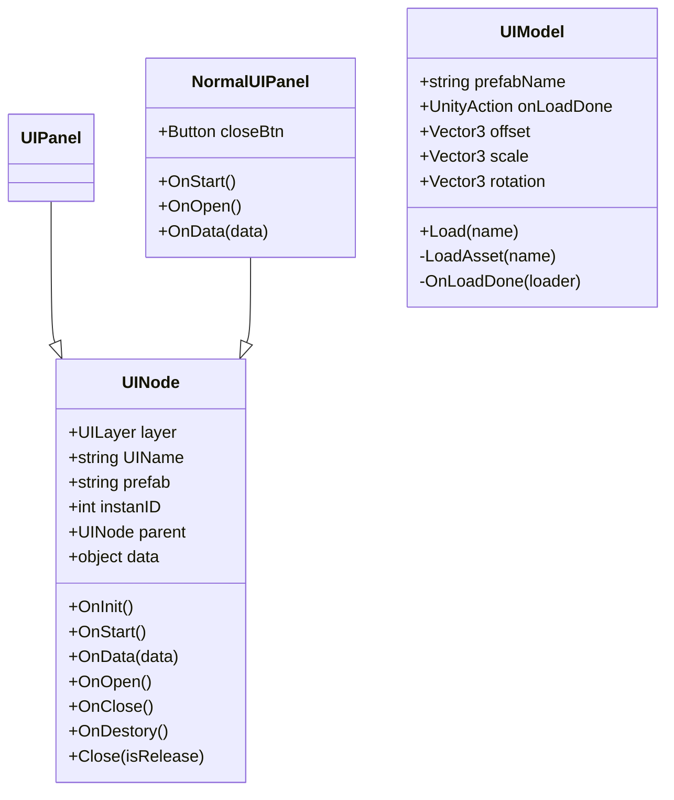
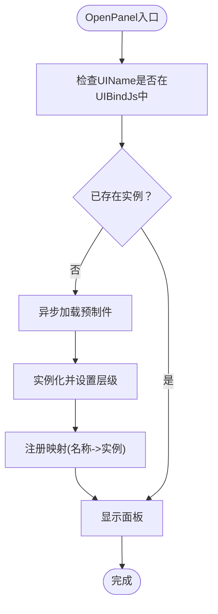
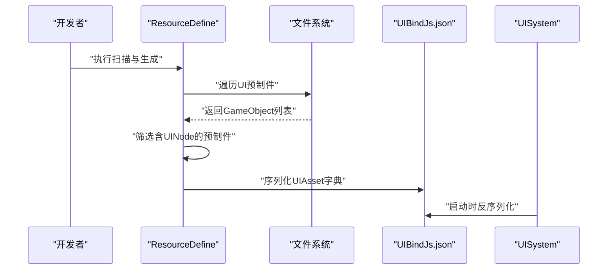
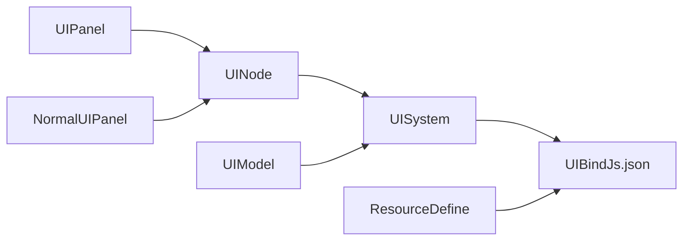

# UI资源管理

<cite>
**本文引用的文件**
- [UINode.cs](file://Assets/Scripts/UI/UINode.cs)
- [UIPanel.cs](file://Assets/Scripts/UI/UIPanel.cs)
- [NormalUIPanel.cs](file://Assets/Scripts/UI/NormalUIPanel.cs)
- [UIModel.cs](file://Assets/Scripts/UI/UIModel.cs)
- [UISystem.cs](file://Assets/Scripts/Systems/Implement/UISystem/UISystem.cs)
- [ResourceDefine.cs](file://Assets/Scripts/Config/Resource/ResourceDefine.cs)
</cite>

## 目录
1. [简介](#简介)
2. [项目结构](#项目结构)
3. [核心组件](#核心组件)
4. [架构总览](#架构总览)
5. [详细组件分析](#详细组件分析)
6. [依赖关系分析](#依赖关系分析)
7. [性能考虑](#性能考虑)
8. [故障排查指南](#故障排查指南)
9. [结论](#结论)
10. [附录](#附录)

## 简介
本文件面向ProjectR项目的UI资源管理系统，系统性阐述UI资源的组织结构与管理策略、UI预制件的分类与命名规范、版本管理建议；详解UI资源的加载机制（异步加载、缓存策略与内存优化）、打包流程与AB系统集成、热更新支持方案；并提供性能监控、内存泄漏检测与资源回收机制，以及扩展新资源类型的流程。

## 项目结构
ProjectR的UI资源主要位于以下位置：
- 资源层：Assets/Art/UI/Prefabs 及其子目录，存放UI预制件与相关贴图等资源
- 代码层：Assets/Scripts/UI 定义UI节点与面板基类；Assets/Scripts/Systems/Implement/UISystem 实现UI系统核心逻辑
- 配置层：Assets/Scripts/Config/Resource/ResourceDefine.cs 提供资源扫描与绑定配置能力
- 数据层：UIBindJs.json 作为UI资源与脚本绑定的配置文件

图表来源
- [UISystem.cs:38-48](file://Assets/Scripts/Systems/Implement/UISystem/UISystem.cs#L38-L48)
- [ResourceDefine.cs:45-59](file://Assets/Scripts/Config/Resource/ResourceDefine.cs#L45-L59)

章节来源
- [UISystem.cs:38-48](file://Assets/Scripts/Systems/Implement/UISystem/UISystem.cs#L38-L48)
- [ResourceDefine.cs:45-59](file://Assets/Scripts/Config/Resource/ResourceDefine.cs#L45-L59)

## 核心组件
- UINode：UI节点基类，定义UI生命周期回调（OnInit、OnStart、OnData、OnOpen、OnClose、OnDestory），以及UIName、prefab、layer、parent、data等字段
- UIPanel：继承自UINode，作为UI面板的基础类型
- NormalUIPanel：示例面板，演示关闭按钮绑定与数据接收
- UIModel：用于加载并实例化单个UI模型（非面板容器）
- UISystem：UI系统核心，负责Canvas根节点、EventSystem、UICamera创建与管理；按层级分层管理UI节点；通过资源系统异步加载UI预制件；维护UIName到实例的映射；提供打开/关闭/数据传递能力
- ResourceDefine：提供UI资源扫描与绑定配置能力（从资源路径中识别UINode并生成UIAsset字典）

章节来源
- [UINode.cs:9-57](file://Assets/Scripts/UI/UINode.cs#L9-L57)
- [UIPanel.cs:3-6](file://Assets/Scripts/UI/UIPanel.cs#L3-L6)
- [NormalUIPanel.cs:6-31](file://Assets/Scripts/UI/NormalUIPanel.cs#L6-L31)
- [UIModel.cs:9-60](file://Assets/Scripts/UI/UIModel.cs#L9-L60)
- [UISystem.cs:14-48](file://Assets/Scripts/Systems/Implement/UISystem/UISystem.cs#L14-L48)
- [ResourceDefine.cs:45-59](file://Assets/Scripts/Config/Resource/ResourceDefine.cs#L45-L59)

## 架构总览
UI系统采用“配置驱动+资源系统异步加载”的架构：
- 配置阶段：通过ResourceDefine扫描UI预制件上的UINode，生成UIAsset字典并写入UIBindJs.json
- 运行阶段：UISystem初始化时读取UIBindJs.json，按需异步加载UI预制件，实例化后挂载到对应层级根节点，并建立UIName与实例的映射
- 生命周期：面板通过UINode回调进行初始化、显示、数据注入、关闭与销毁

图表来源
- [UISystem.cs:161-246](file://Assets/Scripts/Systems/Implement/UISystem/UISystem.cs#L161-L246)

## 详细组件分析

### 组件一：UINode与UI面板体系
UINode是所有UI面板的基类，提供统一的生命周期与数据接口：
- 字段：UIName（唯一标识）、prefab（资源路径）、layer（层级）、parent（父节点）、data（传入数据）
- 回调：OnInit（初始化）、OnStart（开始）、OnData（接收数据）、OnOpen（显示）、OnClose（隐藏）、OnDestory（销毁释放）
- 关闭语义：Close(isRelease) 支持隐藏或彻底销毁两种模式

图表来源
- [UINode.cs:9-57](file://Assets/Scripts/UI/UINode.cs#L9-L57)
- [UIPanel.cs:3-6](file://Assets/Scripts/UI/UIPanel.cs#L3-L6)
- [NormalUIPanel.cs:6-31](file://Assets/Scripts/UI/NormalUIPanel.cs#L6-L31)
- [UIModel.cs:9-60](file://Assets/Scripts/UI/UIModel.cs#L9-L60)

章节来源
- [UINode.cs:9-57](file://Assets/Scripts/UI/UINode.cs#L9-L57)
- [UIPanel.cs:3-6](file://Assets/Scripts/UI/UIPanel.cs#L3-L6)
- [NormalUIPanel.cs:6-31](file://Assets/Scripts/UI/NormalUIPanel.cs#L6-L31)
- [UIModel.cs:9-60](file://Assets/Scripts/UI/UIModel.cs#L9-L60)

### 组件二：UISystem（UI系统核心）
职责与特性：
- 初始化：读取UIBindJs.json，创建Canvas根节点、EventSystem、UICamera，生成各层级根节点
- 打开面板：OpenPanel(名称) → 若未加载则异步加载 → 实例化 → 设置层级与尺寸 → 显示
- 关闭面板：Close(node, isRelease) → 隐藏或销毁
- 数据传递：SetData(接收面板名称, 数据) → 触发OnData回调
- 层级管理：Main/Game/Top/MessageTop四层，按深度排列，保证渲染顺序

图表来源
- [UISystem.cs:161-246](file://Assets/Scripts/Systems/Implement/UISystem/UISystem.cs#L161-L246)

章节来源
- [UISystem.cs:14-48](file://Assets/Scripts/Systems/Implement/UISystem/UISystem.cs#L14-L48)
- [UISystem.cs:161-246](file://Assets/Scripts/Systems/Implement/UISystem/UISystem.cs#L161-L246)
- [UISystem.cs:250-264](file://Assets/Scripts/Systems/Implement/UISystem/UISystem.cs#L250-L264)

### 组件三：资源系统与UI绑定（ResourceDefine）
- 资源扫描：遍历UI预制件，查找UINode组件，提取UIName与prefab路径
- 绑定生成：构造UIAsset字典并写入UIBindJs.json
- 使用方式：UISystem启动时读取该文件，作为UI打开的依据

图表来源
- [ResourceDefine.cs:45-59](file://Assets/Scripts/Config/Resource/ResourceDefine.cs#L45-L59)
- [UISystem.cs:38-41](file://Assets/Scripts/Systems/Implement/UISystem/UISystem.cs#L38-L41)

章节来源
- [ResourceDefine.cs:45-59](file://Assets/Scripts/Config/Resource/ResourceDefine.cs#L45-L59)
- [UISystem.cs:38-41](file://Assets/Scripts/Systems/Implement/UISystem/UISystem.cs#L38-L41)

## 依赖关系分析
- UISystem依赖资源系统（静态导入）进行异步加载
- UINode派生类通过prefab路径与资源系统耦合
- UIBindJs.json作为UISystem与资源系统的契约文件
- ResourceDefine与文件系统交互，生成UIBindJs.json

图表来源
- [UINode.cs:9-57](file://Assets/Scripts/UI/UINode.cs#L9-L57)
- [UIPanel.cs:3-6](file://Assets/Scripts/UI/UIPanel.cs#L3-L6)
- [NormalUIPanel.cs:6-31](file://Assets/Scripts/UI/NormalUIPanel.cs#L6-L31)
- [UIModel.cs:9-60](file://Assets/Scripts/UI/UIModel.cs#L9-L60)
- [UISystem.cs:38-41](file://Assets/Scripts/Systems/Implement/UISystem/UISystem.cs#L38-L41)
- [ResourceDefine.cs:45-59](file://Assets/Scripts/Config/Resource/ResourceDefine.cs#L45-L59)

章节来源
- [UINode.cs:9-57](file://Assets/Scripts/UI/UINode.cs#L9-L57)
- [UIPanel.cs:3-6](file://Assets/Scripts/UI/UIPanel.cs#L3-L6)
- [NormalUIPanel.cs:6-31](file://Assets/Scripts/UI/NormalUIPanel.cs#L6-L31)
- [UIModel.cs:9-60](file://Assets/Scripts/UI/UIModel.cs#L9-L60)
- [UISystem.cs:38-41](file://Assets/Scripts/Systems/Implement/UISystem/UISystem.cs#L38-L41)
- [ResourceDefine.cs:45-59](file://Assets/Scripts/Config/Resource/ResourceDefine.cs#L45-L59)

## 性能考虑
- 异步加载与实例化：使用协程异步加载资源，避免主线程阻塞；实例化后统一设置层级与尺寸，减少布局抖动
- 层级深度与渲染：通过UICamera正交投影与层级深度值控制渲染顺序，降低不必要的渲染开销
- 内存优化：
  - 关闭面板时可选择隐藏而非销毁，复用实例以减少GC压力
  - 销毁时及时移除映射并释放引用，防止内存泄漏
- 缓存策略：建议在资源系统层引入轻量缓存（基于路径或名称），避免重复加载相同资源
- 打包与热更新：建议将UI预制件纳入AB系统，结合版本号与清单文件实现热更新；在UISystem中增加版本校验与回滚策略

## 故障排查指南
- 打开面板失败：检查UIBindJs.json中是否存在该UIName；确认prefab路径正确且资源可加载
- 面板不显示：检查层级根节点是否创建成功；确认实例被设置为Active；检查Canvas与UICamera关联
- 数据未生效：确认SetData调用目标面板名称正确；确保面板在OnData中处理了传入数据
- 加载异常：查看日志输出，定位LoadAsset或Instantiate阶段的错误信息
- 内存泄漏：定期检查nameUINodeDict与nodeDict映射；销毁时确保移除映射并释放引用

章节来源
- [UISystem.cs:161-178](file://Assets/Scripts/Systems/Implement/UISystem/UISystem.cs#L161-L178)
- [UISystem.cs:197-211](file://Assets/Scripts/Systems/Implement/UISystem/UISystem.cs#L197-L211)
- [UISystem.cs:250-264](file://Assets/Scripts/Systems/Implement/UISystem/UISystem.cs#L250-L264)

## 结论
ProjectR的UI资源管理以UINode为核心，结合UISystem的异步加载与层级管理，形成清晰的UI生命周期与资源绑定机制。通过UIBindJs.json实现配置驱动，配合ResourceDefine的扫描生成，能够快速扩展新的UI资源类型。建议进一步完善资源系统缓存、AB打包与热更新支持，并加强性能监控与内存回收机制，以满足持续迭代与多平台发布的需求。

## 附录

### UI预制件分类与命名规范（建议）
- 分类：按功能域划分（如Main、Game、Top、MessageTop），每个域下再细分模块（如“slimeEffect主界面”、“slimeEffect加载”等）
- 命名：UIName应全局唯一，推荐采用“模块_场景_用途”的命名方式，便于检索与版本管理
- 版本管理：为UI预制件与相关资源打上版本标签，配合AB系统实现灰度与回滚

### 新资源类型添加流程（建议）
- 在Assets/Art/UI/Prefabs下创建新资源目录与预制件
- 在预制件上挂载UINode并填写UIName与prefab路径
- 运行ResourceDefine扫描，生成/更新UIBindJs.json
- 在代码中通过UISystem.OpenPanel(名称)打开新面板
- 如需热更新，将新资源纳入AB系统并配置版本清单