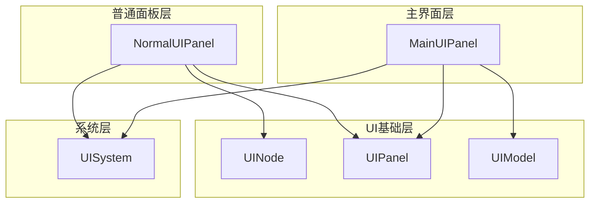
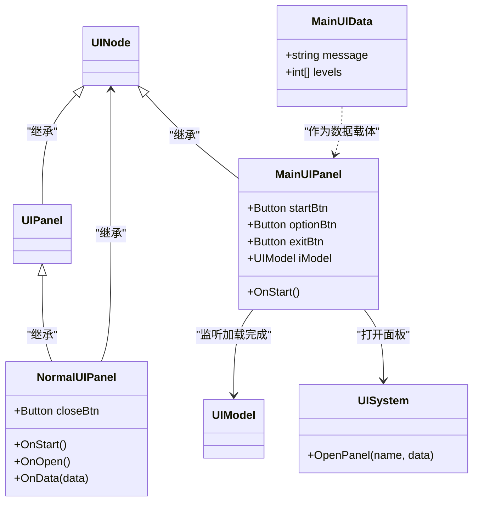
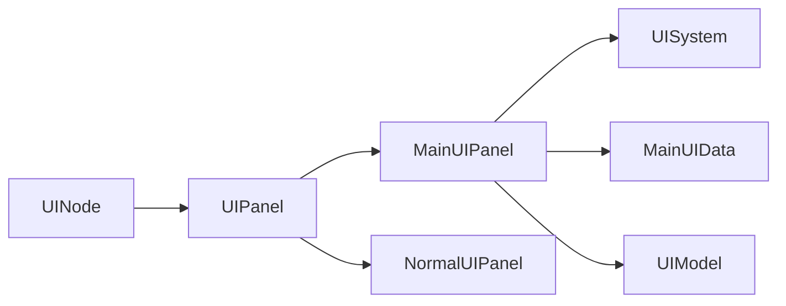

# 主界面系统

<cite>
**本文引用的文件**
- [MainUIPanel.cs](file://Assets/Scripts/UI/MainUI/MainUIPanel.cs)
- [NormalUIPanel.cs](file://Assets/Scripts/UI/NormalUIPanel.cs)
- [UIPanel.cs](file://Assets/Scripts/UI/UIPanel.cs)
- [UINode.cs](file://Assets/Scripts/UI/UINode.cs)
- [UIModel.cs](file://Assets/Scripts/UI/UIModel.cs)
- [UISystem.cs](file://Assets/Scripts/Systems/Implement/UISystem/UISystem.cs)
</cite>

## 目录
1. [简介](#简介)
2. [项目结构](#项目结构)
3. [核心组件](#核心组件)
4. [架构总览](#架构总览)
5. [详细组件分析](#详细组件分析)
6. [依赖关系分析](#依赖关系分析)
7. [性能考虑](#性能考虑)
8. [故障排查指南](#故障排查指南)
9. [结论](#结论)
10. [附录](#附录)

## 简介
本文件面向ProjectR项目的主界面系统，聚焦于主界面的架构设计与实现细节，重点解析MainUIPanel的核心功能与交互逻辑，阐述按钮事件处理与导航机制，并对关卡选择界面的实现原理进行说明（包括关卡列表生成、选择逻辑与难度标识）。同时提供主界面的视觉设计规范、图标资源管理与响应式布局适配建议，以及扩展与自定义界面的实现指南。

## 项目结构
主界面系统位于UI层，采用分层与模块化组织方式：
- UI基础层：UINode、UIPanel、UIModel等基础抽象与通用UI能力
- 主界面层：MainUIPanel负责主菜单按钮与导航
- 普通面板层：NormalUIPanel用于通用窗口的打开/关闭与数据传递
- 系统层：UISystem负责UI面板的统一打开与生命周期管理



图表来源
- [MainUIPanel.cs:1-39](file://Assets/Scripts/UI/MainUI/MainUIPanel.cs#L1-L39)
- [NormalUIPanel.cs:1-34](file://Assets/Scripts/UI/NormalUIPanel.cs#L1-L34)
- [UIPanel.cs:1-9](file://Assets/Scripts/UI/UIPanel.cs#L1-L9)
- [UINode.cs](file://Assets/Scripts/UI/UINode.cs)
- [UIModel.cs](file://Assets/Scripts/UI/UIModel.cs)
- [UISystem.cs](file://Assets/Scripts/Systems/Implement/UISystem/UISystem.cs)

章节来源
- [MainUIPanel.cs:1-39](file://Assets/Scripts/UI/MainUI/MainUIPanel.cs#L1-L39)
- [NormalUIPanel.cs:1-34](file://Assets/Scripts/UI/NormalUIPanel.cs#L1-L34)
- [UIPanel.cs:1-9](file://Assets/Scripts/UI/UIPanel.cs#L1-L9)

## 核心组件
- MainUIPanel：主界面入口面板，负责“开始游戏”“选项”“退出”等按钮事件绑定，并通过UISystem打开关卡选择与选项窗口；同时使用UIModel监听模型加载完成事件。
- NormalUIPanel：通用面板示例，演示如何接收数据并处理关闭事件。
- UIPanel/UINode：UI层次结构的基础节点与面板基类，提供生命周期回调与通用行为。
- UIModel：UI模型抽象，支持事件订阅与数据驱动更新。
- UISystem：UI系统，统一管理面板的打开、关闭与数据传递。

章节来源
- [MainUIPanel.cs:8-31](file://Assets/Scripts/UI/MainUI/MainUIPanel.cs#L8-L31)
- [NormalUIPanel.cs:6-31](file://Assets/Scripts/UI/NormalUIPanel.cs#L6-L31)
- [UIPanel.cs:3-6](file://Assets/Scripts/UI/UIPanel.cs#L3-L6)
- [UINode.cs](file://Assets/Scripts/UI/UINode.cs)
- [UIModel.cs](file://Assets/Scripts/UI/UIModel.cs)
- [UISystem.cs](file://Assets/Scripts/Systems/Implement/UISystem/UISystem.cs)

## 架构总览
主界面采用“事件驱动 + 数据驱动”的模式：
- 事件驱动：按钮点击触发导航动作，调用UISystem.OpenPanel打开目标面板
- 数据驱动：通过UINodeData派生类传递数据（如MainUIData），在目标面板中接收并处理
- 生命周期：基于UINode的OnStart/OnOpen/OnData等回调，确保面板初始化与数据注入顺序正确

```mermaid
sequenceDiagram
participant Player as "玩家"
participant MUI as "MainUIPanel"
participant SYS as "UISystem"
participant LSEL as "LevelSelectWindow"
participant OPT as "OptionWindowPanel"
Player->>MUI : 点击“开始游戏”
MUI->>MUI : 构造MainUIData
MUI->>SYS : OpenPanel("LevelSelectWindow", data)
SYS-->>LSEL : 打开面板并注入数据
Player->>MUI : 点击“选项”
MUI->>SYS : OpenPanel("OptionWindowPanel")
SYS-->>OPT : 打开面板
```

图表来源
- [MainUIPanel.cs:14-25](file://Assets/Scripts/UI/MainUI/MainUIPanel.cs#L14-L25)
- [UISystem.cs](file://Assets/Scripts/Systems/Implement/UISystem/UISystem.cs)

## 详细组件分析

### MainUIPanel 组件分析
- 角色定位：主界面入口，承载开始游戏、选项、退出等交互
- 事件绑定：
  - 开始游戏：构造MainUIData，调用UISystem.OpenPanel打开关卡选择界面
  - 选项：打开选项面板
- 数据与模型：
  - 使用UIModel监听模型加载完成事件，便于在主界面展示或联动
- 关联类型：
  - MainUIData：携带消息与关卡列表等数据
  - UISystem：统一面板管理



图表来源
- [MainUIPanel.cs:8-36](file://Assets/Scripts/UI/MainUI/MainUIPanel.cs#L8-L36)
- [NormalUIPanel.cs:6-31](file://Assets/Scripts/UI/NormalUIPanel.cs#L6-L31)
- [UIPanel.cs:3-6](file://Assets/Scripts/UI/UIPanel.cs#L3-L6)
- [UINode.cs](file://Assets/Scripts/UI/UINode.cs)
- [UIModel.cs](file://Assets/Scripts/UI/UIModel.cs)
- [UISystem.cs](file://Assets/Scripts/Systems/Implement/UISystem/UISystem.cs)

章节来源
- [MainUIPanel.cs:10-30](file://Assets/Scripts/UI/MainUI/MainUIPanel.cs#L10-L30)
- [MainUIPanel.cs:32-36](file://Assets/Scripts/UI/MainUI/MainUIPanel.cs#L32-L36)

### NormalUIPanel 组件分析
- 角色定位：通用面板示例，演示关闭流程与数据接收
- 事件绑定：关闭按钮绑定Close(true)，实现面板关闭
- 数据处理：支持字符串与UINodeData两种数据类型，可扩展其他数据类型
- 生命周期：OnOpen用于面板打开时的日志输出；OnData用于接收并处理传入数据

章节来源
- [NormalUIPanel.cs:8-30](file://Assets/Scripts/UI/NormalUIPanel.cs#L8-L30)

### 关卡选择界面实现原理
- 面板名称：LevelSelectWindow（由MainUIPanel通过UISystem.OpenPanel调用）
- 数据传递：MainUIData包含message与levels字段，用于向关卡选择界面传递消息与可用关卡列表
- 关卡列表生成：levels字段为整型列表，可映射到关卡配置或索引
- 选择逻辑：通常在关卡选择界面内部处理，依据用户选择触发后续流程（例如进入场景）
- 难度标识：可在MainUIData或关卡配置中扩展字段以标识难度等级

章节来源
- [MainUIPanel.cs:17-21](file://Assets/Scripts/UI/MainUI/MainUIPanel.cs#L17-L21)
- [MainUIPanel.cs:32-36](file://Assets/Scripts/UI/MainUI/MainUIPanel.cs#L32-L36)

### 导航机制与数据流
- 导航路径：MainUIPanel -> UISystem -> 目标面板（LevelSelectWindow/OptionWindowPanel）
- 数据流：MainUIData作为数据载体，随OpenPanel调用传递至目标面板
- 生命周期：目标面板通过OnStart/OnOpen/OnData接收并处理数据

章节来源
- [MainUIPanel.cs:14-25](file://Assets/Scripts/UI/MainUI/MainUIPanel.cs#L14-L25)
- [UISystem.cs](file://Assets/Scripts/Systems/Implement/UISystem/UISystem.cs)

## 依赖关系分析
- MainUIPanel依赖：
  - UISystem：用于打开面板
  - UIModel：用于监听模型加载完成事件
  - MainUIData：用于数据传递
- NormalUIPanel依赖：
  - UINode：继承基础节点
  - UIPanel：继承面板基类
- 层级关系：
  - UINode为所有UI节点的基类
  - UIPanel继承UINode，MainUIPanel/NormalUIPanel均继承自UINode或其子类



图表来源
- [MainUIPanel.cs:8-36](file://Assets/Scripts/UI/MainUI/MainUIPanel.cs#L8-L36)
- [NormalUIPanel.cs:6-31](file://Assets/Scripts/UI/NormalUIPanel.cs#L6-L31)
- [UIPanel.cs:3-6](file://Assets/Scripts/UI/UIPanel.cs#L3-L6)
- [UINode.cs](file://Assets/Scripts/UI/UINode.cs)
- [UIModel.cs](file://Assets/Scripts/UI/UIModel.cs)
- [UISystem.cs](file://Assets/Scripts/Systems/Implement/UISystem/UISystem.cs)

章节来源
- [MainUIPanel.cs:8-36](file://Assets/Scripts/UI/MainUI/MainUIPanel.cs#L8-L36)
- [NormalUIPanel.cs:6-31](file://Assets/Scripts/UI/NormalUIPanel.cs#L6-L31)
- [UIPanel.cs:3-6](file://Assets/Scripts/UI/UIPanel.cs#L3-L6)

## 性能考虑
- 面板切换：通过UISystem集中管理，避免重复实例化与资源浪费
- 事件绑定：在OnStart中一次性绑定，避免多次重复绑定导致的性能问题
- 数据传递：使用轻量数据结构（如MainUIData）承载必要信息，减少序列化与传输成本
- 资源加载：UIModel监听加载完成事件，可在合适时机进行UI更新，避免频繁刷新

## 故障排查指南
- 面板无法打开：
  - 检查UISystem中OpenPanel的面板名称是否与实际注册一致
  - 确认目标面板已正确继承UINode或UIPanel并实现必要的生命周期方法
- 数据未生效：
  - 确认MainUIData正确传递并在目标面板的OnData中被接收
  - 检查数据类型匹配（如字符串与UINodeData）
- 关闭按钮无效：
  - 确认NormalUIPanel中的closeBtn事件绑定存在且指向Close(true)
- 模型加载事件未触发：
  - 检查UIModel的onLoadDone事件是否正确订阅与触发

章节来源
- [NormalUIPanel.cs:12-13](file://Assets/Scripts/UI/NormalUIPanel.cs#L12-L13)
- [MainUIPanel.cs:26-29](file://Assets/Scripts/UI/MainUI/MainUIPanel.cs#L26-L29)

## 结论
主界面系统以UINode/ UIPanel为基础，结合UISystem实现统一的面板管理与数据传递。MainUIPanel承担入口交互职责，通过事件绑定与数据封装（MainUIData）实现从主界面到关卡选择与选项界面的平滑导航。NormalUIPanel提供了通用面板的实现范式，便于扩展更多自定义界面。整体架构清晰、耦合度低、易于扩展与维护。

## 附录

### 视觉设计规范与图标资源管理
- 字体与字号：遵循项目统一字体规范，确保主界面标题、按钮文本与说明文字的层级清晰
- 颜色体系：使用品牌主色与辅助色，保持主界面风格一致
- 图标资源：将图标资源置于UI资源目录下，命名规范统一（如前缀+用途），便于检索与复用
- 响应式布局：根据屏幕分辨率与设备方向调整按钮间距与元素尺寸，保证在不同设备上显示一致

### 关卡选择界面实现要点
- 关卡列表生成：以MainUIData.levels为依据，动态生成关卡项
- 选择逻辑：在关卡选择界面内部处理用户选择，触发场景加载或下一阶段流程
- 难度标识：在关卡项中添加难度标签，支持按难度筛选与排序

### 扩展与自定义界面指南
- 新建面板：继承UINode或UIPanel，实现OnStart/OnOpen/OnData等生命周期方法
- 注册与打开：通过UISystem.OpenPanel注册并打开新面板，传递所需数据
- 事件绑定：在OnStart中完成按钮事件绑定，确保生命周期内只绑定一次
- 数据契约：定义专用数据类（如MainUIData）承载必要信息，保持接口稳定