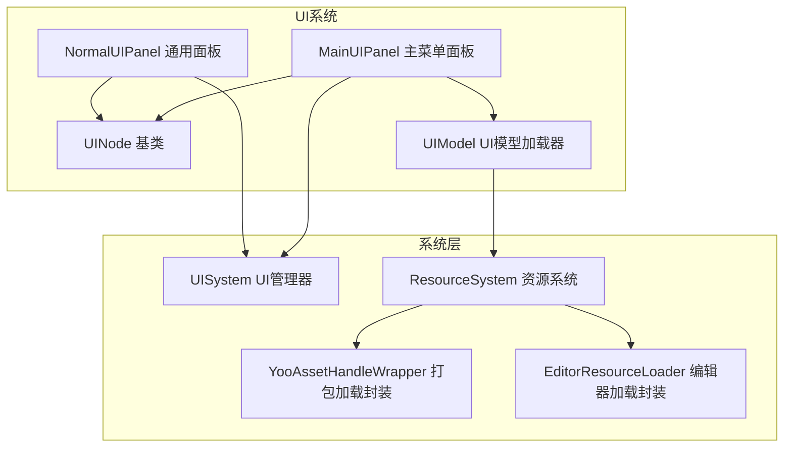
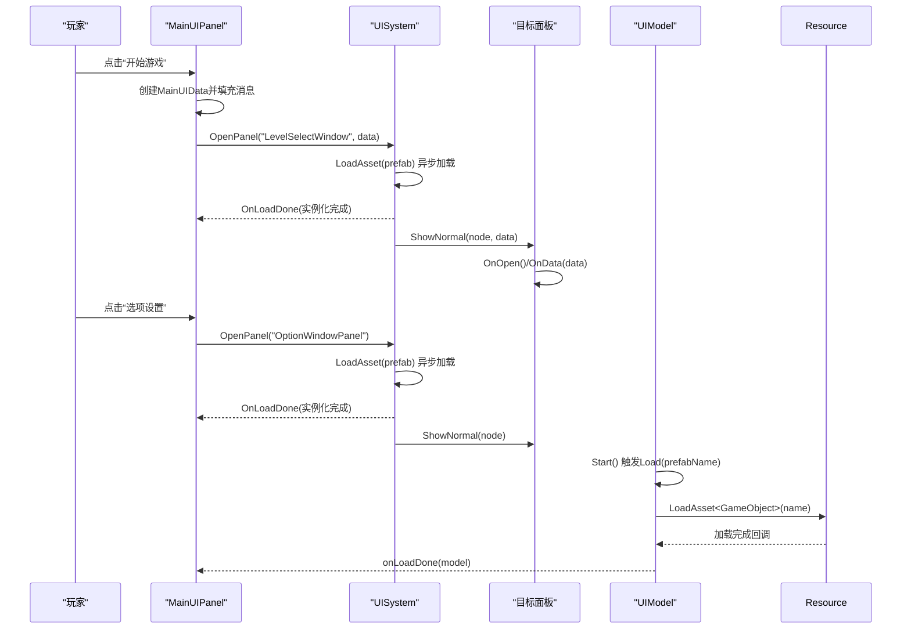
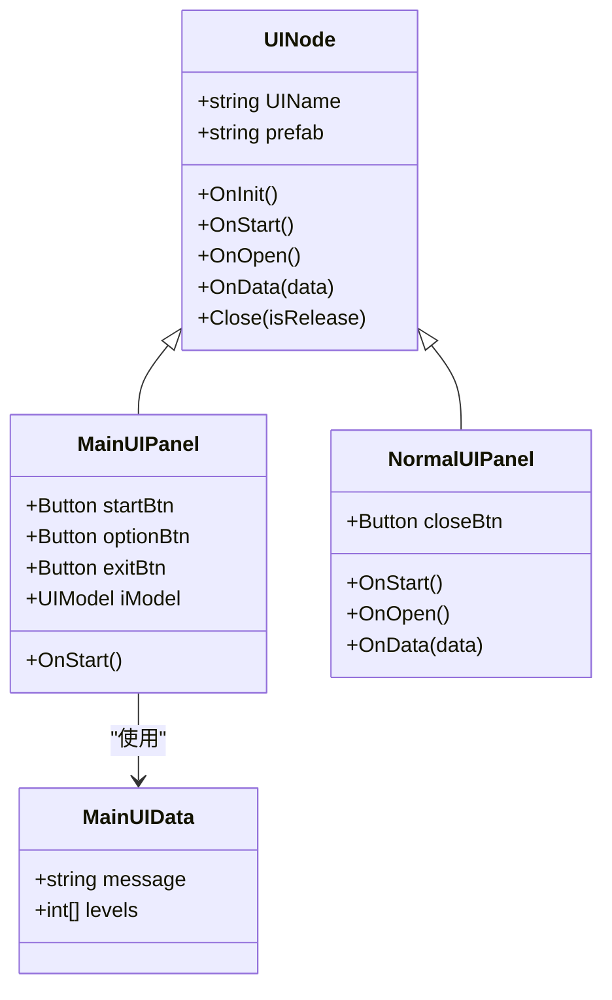
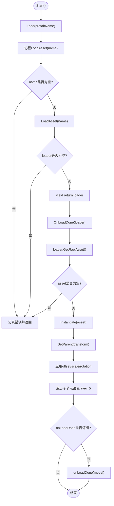
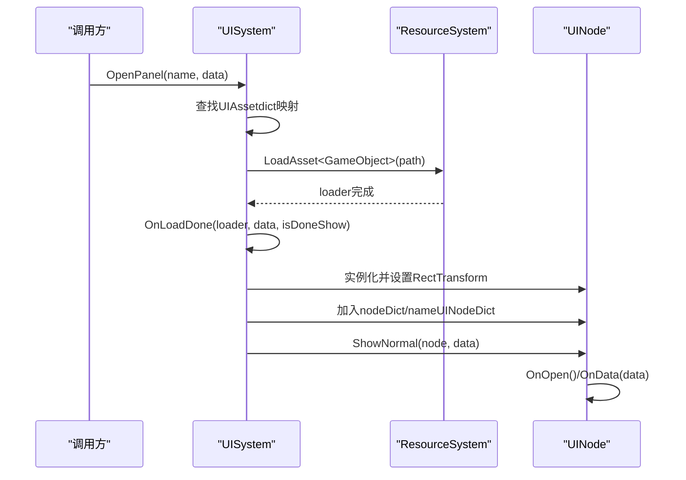
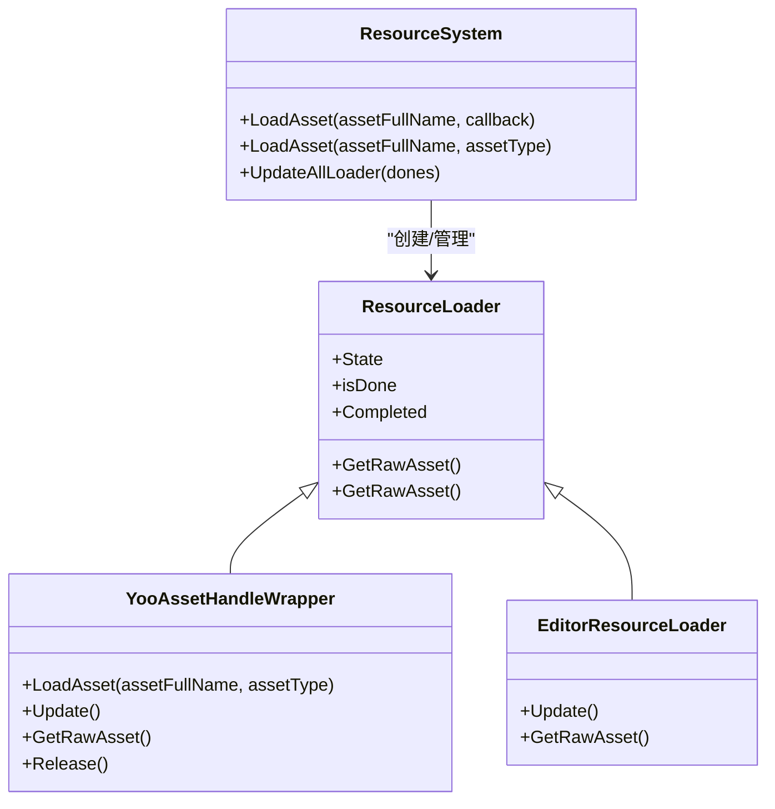
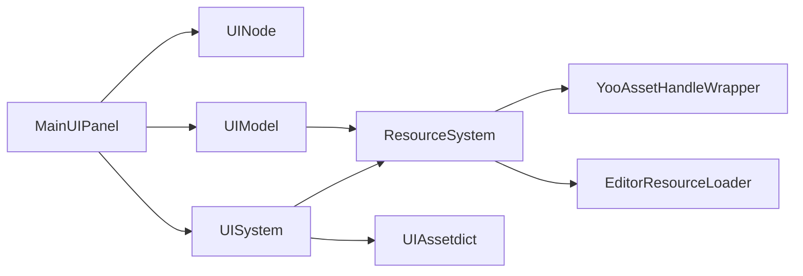

# 主菜单界面

<cite>
**本文档引用的文件**
- [MainUIPanel.cs](file://Assets/Scripts/UI/MainUI/MainUIPanel.cs)
- [UIModel.cs](file://Assets/Scripts/UI/UIModel.cs)
- [UINode.cs](file://Assets/Scripts/UI/UINode.cs)
- [UISystem.cs](file://Assets/Scripts/Systems/Implement/UISystem/UISystem.cs)
- [NormalUIPanel.cs](file://Assets/Scripts/UI/NormalUIPanel.cs)
- [ResourceSystem.Func.cs](file://Assets/Scripts/Systems/Implement/ResourceSystem/ResourceSystem.Func.cs)
- [ResourceSystem.Update.cs](file://Assets/Scripts/Systems/Implement/ResourceSystem/ResourceSystem.Update.cs)
- [YooAssetHandleWrapper.cs](file://Assets/Scripts/Systems/Implement/ResourceSystem/YooAssetHandleWrapper.cs)
- [EditorResourceLoader.cs](file://Assets/Scripts/Systems/Implement/ResourceSystem/EditorResourceLoader.cs)
- [ResourceDefine.cs](file://Assets/Scripts/Config/Resource/ResourceDefine.cs)
</cite>

## 目录
1. [简介](#简介)
2. [项目结构](#项目结构)
3. [核心组件](#核心组件)
4. [架构总览](#架构总览)
5. [详细组件分析](#详细组件分析)
6. [依赖关系分析](#依赖关系分析)
7. [性能考虑](#性能考虑)
8. [故障排查指南](#故障排查指南)
9. [结论](#结论)
10. [附录](#附录)

## 简介
本文件面向ProjectR项目的主菜单界面，围绕MainUIPanel展开，深入解析其核心功能实现，包括“开始游戏”、“选项设置”、“退出游戏”三大按钮的事件处理机制；阐述UIModel的模型加载完成回调机制与错误处理流程；说明主菜单界面的视觉设计元素（背景图片、按钮样式、动画效果）与可扩展性（自定义按钮功能、界面主题切换）。文档同时提供基于源码路径的实际示例与最佳实践建议，帮助开发者快速理解并扩展主菜单功能。

## 项目结构
主菜单界面由UI系统驱动，采用分层架构：UINode作为所有UI面板的基类，UISystem负责UI的生命周期管理、资源加载与显示控制；UIModel负责UI模型资源的异步加载与实例化；ResourceSystem提供统一的资源加载能力，支持编辑器模式与打包模式。

**图表来源**
- [MainUIPanel.cs:1-39](file://Assets/Scripts/UI/MainUI/MainUIPanel.cs#L1-L39)
- [UINode.cs:1-59](file://Assets/Scripts/UI/UINode.cs#L1-L59)
- [UISystem.cs:1-280](file://Assets/Scripts/Systems/Implement/UISystem/UISystem.cs#L1-L280)
- [UIModel.cs:1-63](file://Assets/Scripts/UI/UIModel.cs#L1-L63)
- [ResourceSystem.Func.cs:109-180](file://Assets/Scripts/Systems/Implement/ResourceSystem/ResourceSystem.Func.cs#L109-L180)
- [YooAssetHandleWrapper.cs:32-97](file://Assets/Scripts/Systems/Implement/ResourceSystem/YooAssetHandleWrapper.cs#L32-L97)
- [EditorResourceLoader.cs:1-41](file://Assets/Scripts/Systems/Implement/ResourceSystem/EditorResourceLoader.cs#L1-L41)

**章节来源**
- [MainUIPanel.cs:1-39](file://Assets/Scripts/UI/MainUI/MainUIPanel.cs#L1-L39)
- [UISystem.cs:1-280](file://Assets/Scripts/Systems/Implement/UISystem/UISystem.cs#L1-L280)

## 核心组件
- MainUIPanel：主菜单面板，负责按钮事件绑定与面板间跳转。
- UIModel：UI模型加载器，负责异步加载UI模型并触发回调。
- UINode：UI节点基类，提供生命周期钩子与数据传递接口。
- UISystem：UI系统管理器，负责UI的创建、显示、关闭与数据分发。
- ResourceSystem：资源系统，提供统一的资源加载入口，支持编辑器与打包两种模式。

**章节来源**
- [MainUIPanel.cs:8-31](file://Assets/Scripts/UI/MainUI/MainUIPanel.cs#L8-L31)
- [UIModel.cs:9-60](file://Assets/Scripts/UI/UIModel.cs#L9-L60)
- [UINode.cs:9-55](file://Assets/Scripts/UI/UINode.cs#L9-L55)
- [UISystem.cs:21-265](file://Assets/Scripts/Systems/Implement/UISystem/UISystem.cs#L21-L265)

## 架构总览
主菜单的交互流程遵循“事件触发 → 数据传递 → 面板打开”的标准模式。MainUIPanel在启动时注册按钮点击事件，通过UISystem打开目标面板，并携带数据对象；UIModel通过ResourceSystem异步加载模型资源，在加载完成后回调通知。

**图表来源**
- [MainUIPanel.cs:14-30](file://Assets/Scripts/UI/MainUI/MainUIPanel.cs#L14-L30)
- [UISystem.cs:161-246](file://Assets/Scripts/Systems/Implement/UISystem/UISystem.cs#L161-L246)
- [UIModel.cs:16-37](file://Assets/Scripts/UI/UIModel.cs#L16-L37)
- [ResourceSystem.Func.cs:114-164](file://Assets/Scripts/Systems/Implement/ResourceSystem/ResourceSystem.Func.cs#L114-L164)

## 详细组件分析

### MainUIPanel 组件分析
- 功能职责
  - 提供“开始游戏”“选项设置”“退出游戏”三个按钮的事件绑定。
  - 在“开始游戏”中构造数据对象MainUIData并通过UISystem打开关卡选择窗口。
  - 在“选项设置”中打开选项面板。
  - 订阅UIModel的onLoadDone回调以监听模型加载完成事件。
- 事件处理机制
  - 使用Button.onClick.AddListener注册委托，确保在面板激活后执行。
  - 通过UISystem.instance.OpenPanel进行跨面板导航，支持传入数据对象。
- 数据传递
  - MainUIData继承UINodeData，用于承载从主菜单向其他面板传递的数据。
- 错误处理
  - MainUIPanel未直接处理UIModel加载失败的情况，建议在订阅回调中增加错误分支或日志记录。

**图表来源**
- [MainUIPanel.cs:8-36](file://Assets/Scripts/UI/MainUI/MainUIPanel.cs#L8-L36)
- [UINode.cs:9-55](file://Assets/Scripts/UI/UINode.cs#L9-L55)
- [NormalUIPanel.cs:6-31](file://Assets/Scripts/UI/NormalUIPanel.cs#L6-L31)

**章节来源**
- [MainUIPanel.cs:14-30](file://Assets/Scripts/UI/MainUI/MainUIPanel.cs#L14-L30)
- [NormalUIPanel.cs:14-30](file://Assets/Scripts/UI/NormalUIPanel.cs#L14-L30)

### UIModel 组件分析
- 功能职责
  - 在Start时调用Load加载指定prefab。
  - 通过ResourceSystem.LoadAsset异步加载资源，完成后实例化并设置父子关系与变换参数。
  - 触发onLoadDone回调，传递实例化的GameObject。
- 加载流程
  - LoadAsset<GameObject>(name)返回ResourceLoader，协程等待loader完成。
  - OnLoadDone中获取原始资源并实例化，设置父级、位置、缩放、旋转。
  - 将子节点图层统一设置为UI层，确保渲染一致性。
- 错误处理
  - 当loader为空或资源为空时，记录错误日志并终止流程。
- 回调机制
  - onLoadDone为UnityAction<GameObject>，外部可通过+=订阅加载完成事件。

**图表来源**
- [UIModel.cs:16-59](file://Assets/Scripts/UI/UIModel.cs#L16-L59)
- [ResourceSystem.Func.cs:114-164](file://Assets/Scripts/Systems/Implement/ResourceSystem/ResourceSystem.Func.cs#L114-L164)

**章节来源**
- [UIModel.cs:16-59](file://Assets/Scripts/UI/UIModel.cs#L16-L59)

### UISystem 组件分析
- 功能职责
  - 初始化UI根节点、事件系统与UI相机。
  - 提供OpenPanel、ShowNormal、Close等UI生命周期管理方法。
  - 通过UIAssetdict根据名称映射到预制体路径，实现异步加载与实例化。
- 面板生命周期
  - OnLoadDone中实例化UI、设置RectTransform、加入节点字典、按需显示。
  - ShowNormal负责同一层级下仅激活当前面板，其他隐藏。
  - Close支持释放或隐藏两种模式。
- 数据传递
  - SetData根据接收面板名称分发数据，调用OnData(data)。

**图表来源**
- [UISystem.cs:161-246](file://Assets/Scripts/Systems/Implement/UISystem/UISystem.cs#L161-L246)
- [ResourceSystem.Func.cs:114-164](file://Assets/Scripts/Systems/Implement/ResourceSystem/ResourceSystem.Func.cs#L114-L164)

**章节来源**
- [UISystem.cs:38-48](file://Assets/Scripts/Systems/Implement/UISystem/UISystem.cs#L38-L48)
- [UISystem.cs:161-246](file://Assets/Scripts/Systems/Implement/UISystem/UISystem.cs#L161-L246)

### 资源系统与加载策略
- ResourceSystem提供统一入口LoadAsset<T>，内部根据运行环境选择EditorResourceLoader或YooAssetHandleWrapper。
- Update循环中更新所有活动loader，完成后触发Completed回调，保证UIModel与UISystem的异步加载链路稳定。
- EditorResourceLoader在编辑器模式下直接从资源库加载，避免打包流程开销；YooAssetHandleWrapper在运行时从AssetBundle加载，支持热更与多平台。

**图表来源**
- [ResourceSystem.Func.cs:109-180](file://Assets/Scripts/Systems/Implement/ResourceSystem/ResourceSystem.Func.cs#L109-L180)
- [ResourceSystem.Update.cs:10-43](file://Assets/Scripts/Systems/Implement/ResourceSystem/ResourceSystem.Update.cs#L10-L43)
- [YooAssetHandleWrapper.cs:32-97](file://Assets/Scripts/Systems/Implement/ResourceSystem/YooAssetHandleWrapper.cs#L32-L97)
- [EditorResourceLoader.cs:17-29](file://Assets/Scripts/Systems/Implement/ResourceSystem/EditorResourceLoader.cs#L17-L29)

**章节来源**
- [ResourceSystem.Func.cs:109-180](file://Assets/Scripts/Systems/Implement/ResourceSystem/ResourceSystem.Func.cs#L109-L180)
- [ResourceSystem.Update.cs:10-43](file://Assets/Scripts/Systems/Implement/ResourceSystem/ResourceSystem.Update.cs#L10-L43)
- [YooAssetHandleWrapper.cs:32-97](file://Assets/Scripts/Systems/Implement/ResourceSystem/YooAssetHandleWrapper.cs#L32-L97)
- [EditorResourceLoader.cs:17-29](file://Assets/Scripts/Systems/Implement/ResourceSystem/EditorResourceLoader.cs#L17-L29)

## 依赖关系分析
- MainUIPanel依赖UINode（生命周期）、UISystem（面板打开）、UIModel（模型加载回调）。
- UIModel依赖ResourceSystem（异步加载）、LogSystem（错误日志）。
- UISystem依赖UIAssetdict（UI绑定配置）、ResourceSystem（UI预制体加载）、UINode（实例化后的生命周期）。
- ResourceSystem内部依赖YooAssetHandleWrapper与EditorResourceLoader实现不同环境下的资源加载。

**图表来源**
- [MainUIPanel.cs:13-29](file://Assets/Scripts/UI/MainUI/MainUIPanel.cs#L13-L29)
- [UIModel.cs:20-37](file://Assets/Scripts/UI/UIModel.cs#L20-L37)
- [UISystem.cs:161-246](file://Assets/Scripts/Systems/Implement/UISystem/UISystem.cs#L161-L246)
- [ResourceSystem.Func.cs:114-164](file://Assets/Scripts/Systems/Implement/ResourceSystem/ResourceSystem.Func.cs#L114-L164)

**章节来源**
- [MainUIPanel.cs:13-29](file://Assets/Scripts/UI/MainUI/MainUIPanel.cs#L13-L29)
- [UIModel.cs:20-37](file://Assets/Scripts/UI/UIModel.cs#L20-L37)
- [UISystem.cs:161-246](file://Assets/Scripts/Systems/Implement/UISystem/UISystem.cs#L161-L246)

## 性能考虑
- 异步加载：UIModel与UISystem均采用协程+ResourceSystem异步加载，避免主线程阻塞。
- 资源复用：ResourceSystem维护loader字典，避免重复加载相同资源。
- 渲染优化：UIModel将子节点统一设置为UI层，配合UICamera裁剪掩码，减少无关渲染。
- 面板管理：ShowNormal仅激活当前面板，其他面板隐藏，降低UI树复杂度。

[本节为通用指导，无需特定文件引用]

## 故障排查指南
- UI模型未显示
  - 检查UIModel.prefabName是否正确，确认ResourceSystem已成功加载。
  - 查看onLoadDone回调是否被触发，若未触发，检查ResourceSystem的错误日志。
  - 参考路径：[UIModel.cs:24-59](file://Assets/Scripts/UI/UIModel.cs#L24-L59)，[ResourceSystem.Update.cs:35-43](file://Assets/Scripts/Systems/Implement/ResourceSystem/ResourceSystem.Update.cs#L35-L43)
- 面板无法打开
  - 确认UIAssetdict中是否存在对应名称的UI绑定，检查UI绑定生成脚本是否执行。
  - 参考路径：[UISystem.cs:161-178](file://Assets/Scripts/Systems/Implement/UISystem/UISystem.cs#L161-L178)，[ResourceDefine.cs:16-83](file://Assets/Scripts/Config/Resource/ResourceDefine.cs#L16-L83)
- 选项设置按钮无效
  - 检查optionBtn是否正确赋值，确认onClick事件已注册。
  - 参考路径：[MainUIPanel.cs:22-25](file://Assets/Scripts/UI/MainUI/MainUIPanel.cs#L22-L25)
- 数据传递异常
  - 确认SetData调用时接收面板名称正确，目标面板OnData是否被调用。
  - 参考路径：[UISystem.cs:252-264](file://Assets/Scripts/Systems/Implement/UISystem/UISystem.cs#L252-L264)，[NormalUIPanel.cs:18-30](file://Assets/Scripts/UI/NormalUIPanel.cs#L18-L30)

**章节来源**
- [UIModel.cs:24-59](file://Assets/Scripts/UI/UIModel.cs#L24-L59)
- [UISystem.cs:161-178](file://Assets/Scripts/Systems/Implement/UISystem/UISystem.cs#L161-L178)
- [ResourceDefine.cs:16-83](file://Assets/Scripts/Config/Resource/ResourceDefine.cs#L16-L83)
- [NormalUIPanel.cs:18-30](file://Assets/Scripts/UI/NormalUIPanel.cs#L18-L30)

## 结论
主菜单界面通过MainUIPanel、UIModel与UISystem协同工作，实现了简洁高效的事件处理与资源加载流程。UIModel的回调机制为后续扩展提供了良好基础；UISystem的异步加载与面板管理保障了性能与可维护性。建议在现有基础上完善错误处理与日志记录，并利用数据对象与回调机制实现更丰富的交互体验。

[本节为总结，无需特定文件引用]

## 附录

### 视觉设计元素说明
- 背景图片：通过UI预制体中的Image组件与Canvas布局实现，具体资源路径与尺寸由UI绑定配置决定。
- 按钮样式：Button组件的Sprite状态（正常/悬停/按下/禁用）与文本样式由UI预制体内的Text组件与Button脚本共同控制。
- 动画效果：可在UINode的OnOpen/OnData中添加过渡动画逻辑，或在面板预制体内集成Animator组件实现进入/退出动画。

[本节为概念性说明，无需特定文件引用]

### 扩展方法与最佳实践
- 自定义按钮功能
  - 在MainUIPanel中新增Button字段与onClick事件绑定，参考路径：[MainUIPanel.cs:10-21](file://Assets/Scripts/UI/MainUI/MainUIPanel.cs#L10-L21)
  - 若需要传递复杂数据，可扩展MainUIData或创建新的数据类，参考路径：[MainUIPanel.cs:32-36](file://Assets/Scripts/UI/MainUI/MainUIPanel.cs#L32-L36)
- 界面主题切换
  - 在UIModel中增加对材质/纹理的动态替换逻辑，或通过UI预制体内的Graphic组件切换Sprite，参考路径：[UIModel.cs:46-54](file://Assets/Scripts/UI/UIModel.cs#L46-L54)
  - 在UISystem中增加主题配置字典，按主题切换UI根节点的Graphic与颜色方案。
- 错误处理增强
  - 在UIModel的onLoadDone回调中增加错误分支，记录失败原因并提供默认占位资源，参考路径：[UIModel.cs:39-44](file://Assets/Scripts/UI/UIModel.cs#L39-L44)
  - 在UISystem的OpenPanel中捕获异常并输出友好提示，参考路径：[UISystem.cs:174-178](file://Assets/Scripts/Systems/Implement/UISystem/UISystem.cs#L174-L178)

**章节来源**
- [MainUIPanel.cs:10-21](file://Assets/Scripts/UI/MainUI/MainUIPanel.cs#L10-L21)
- [MainUIPanel.cs:32-36](file://Assets/Scripts/UI/MainUI/MainUIPanel.cs#L32-L36)
- [UIModel.cs:39-54](file://Assets/Scripts/UI/UIModel.cs#L39-L54)
- [UISystem.cs:174-178](file://Assets/Scripts/Systems/Implement/UISystem/UISystem.cs#L174-L178)