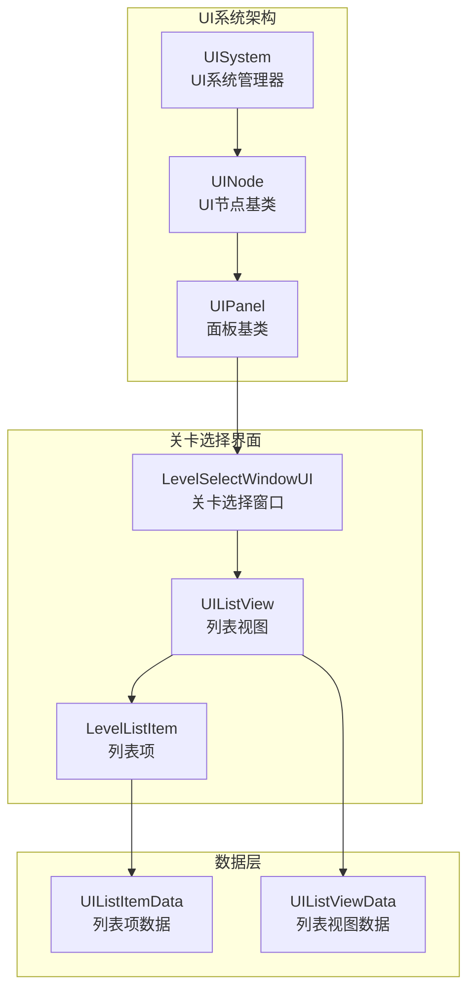
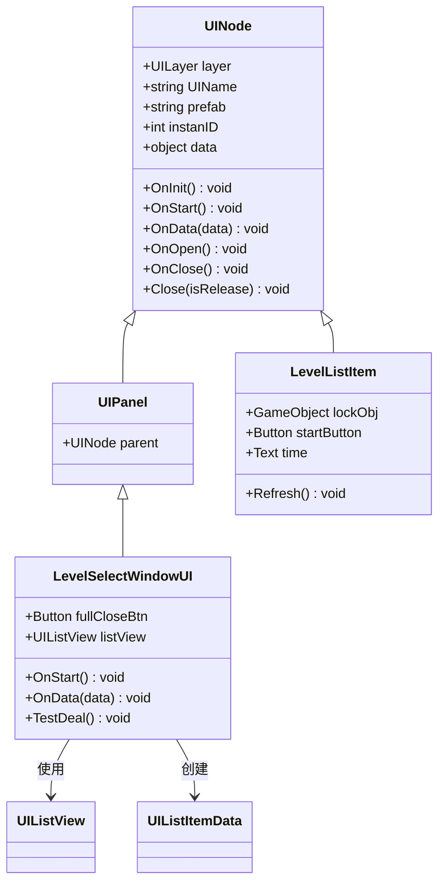
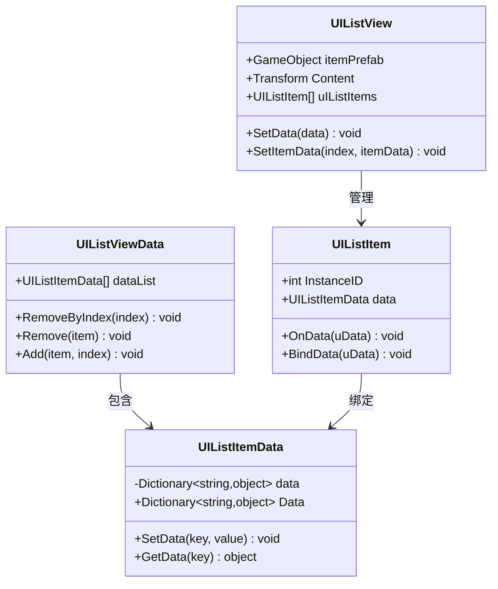
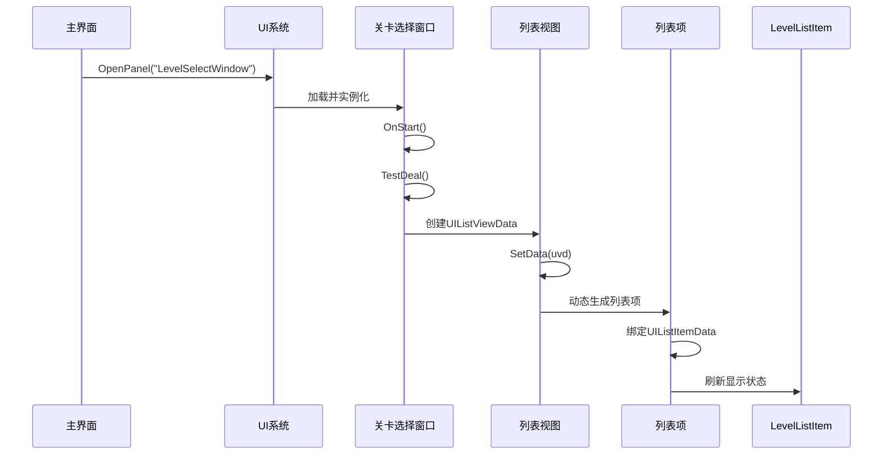
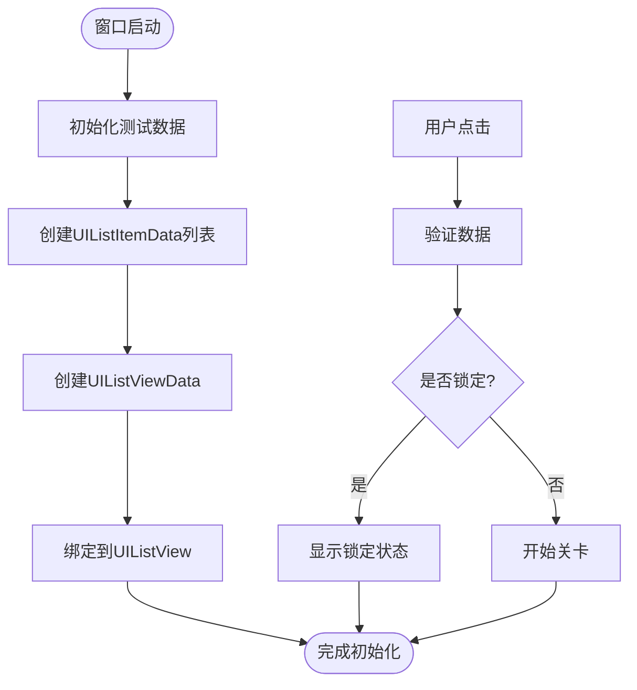
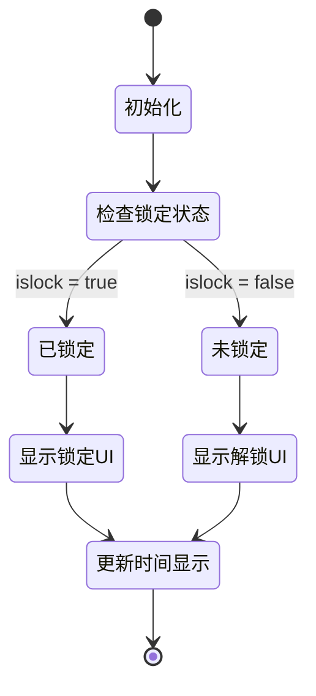
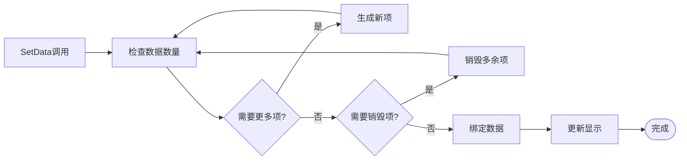
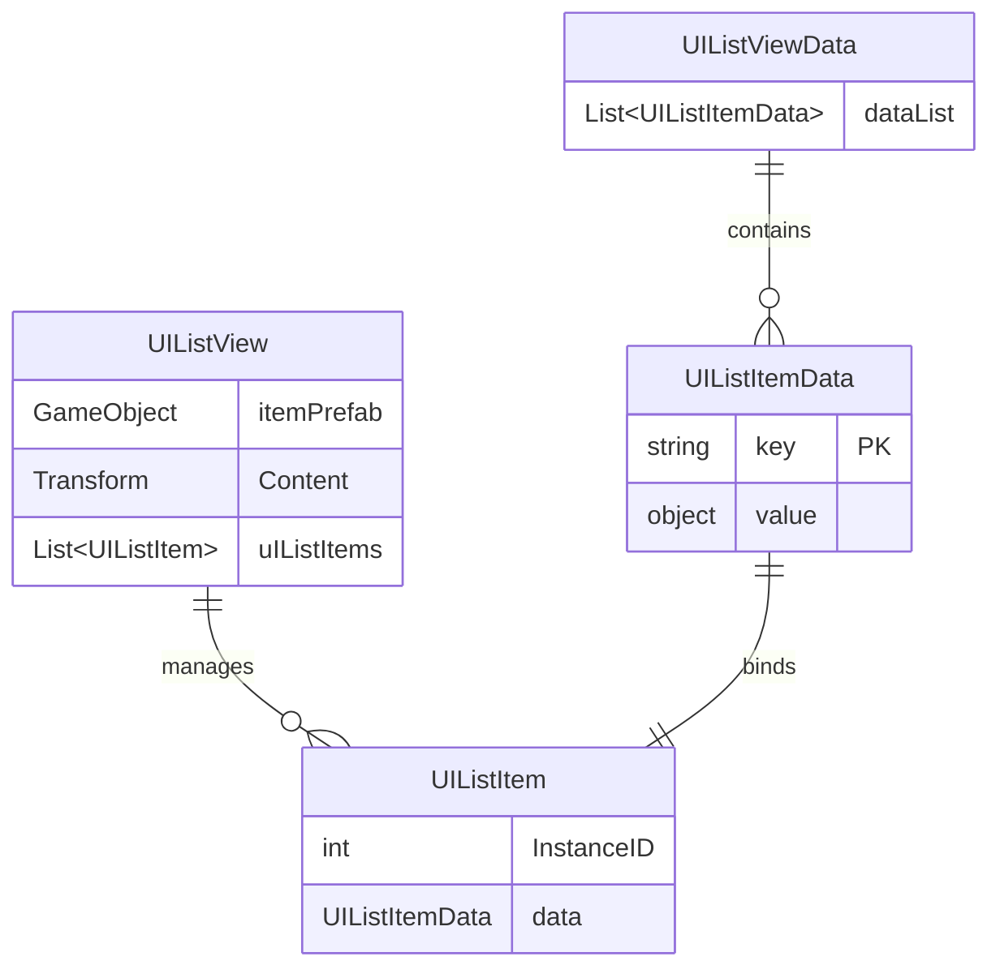
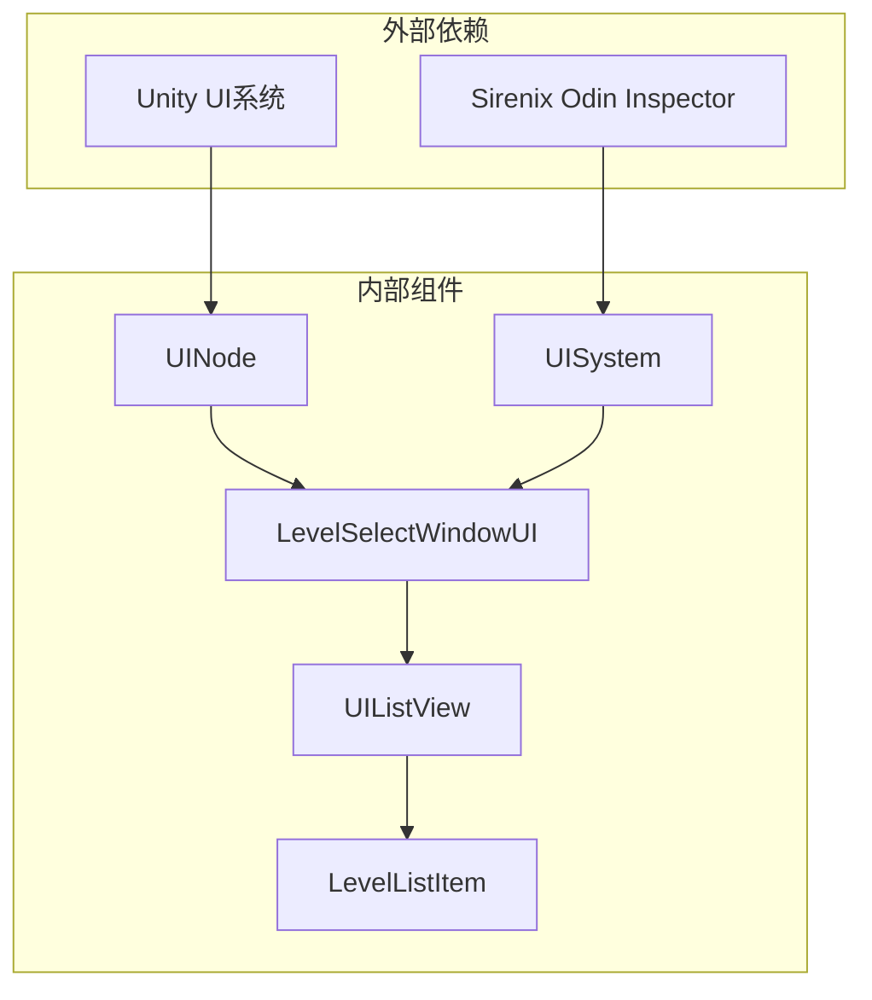
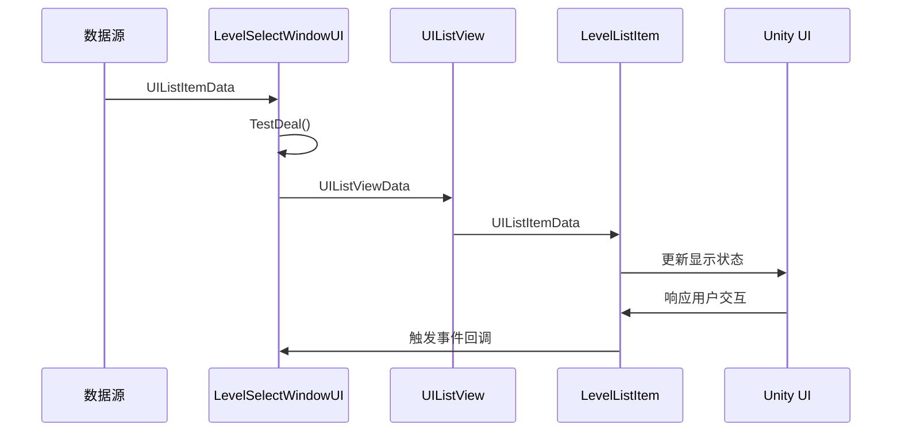

# 关卡选择界面

<cite>
**本文档引用的文件**
- [LevelSelectWindowUI.cs](file://Assets/Scripts/UI/Window/LevelSelectWindowUI.cs)
- [LevelListItem.cs](file://Assets/Scripts/UI/Window/LevelListItem.cs)
- [UIListView.cs](file://Assets/Scripts/UI/UIListView.cs)
- [UIListItem.cs](file://Assets/Scripts/UI/UIListItem.cs)
- [UINode.cs](file://Assets/Scripts/UI/UINode.cs)
- [UIPanel.cs](file://Assets/Scripts/UI/UIPanel.cs)
- [NormalUIPanel.cs](file://Assets/Scripts/UI/NormalUIPanel.cs)
- [MainUIPanel.cs](file://Assets/Scripts/UI/MainUI/MainUIPanel.cs)
- [UIBindJs.json](file://Assets/Scripts/UI/UIBindJs.json)
- [UI_LevelSelectWindow_Panel.prefab](file://Assets/Art/UI/Prefabs/WindowUI/LevelSelectWindow/UI_LevelSelectWindow_Panel.prefab)
- [LevelSelectListItem.prefab](file://Assets/Art/UI/Prefabs/WindowUI/LevelSelectWindow/LevelSelectListItem.prefab)
- [UISystem.cs](file://Assets/Scripts/Systems/Implement/UISystem/UISystem.cs)
</cite>

## 目录
1. [简介](#简介)
2. [项目结构](#项目结构)
3. [核心组件](#核心组件)
4. [架构概览](#架构概览)
5. [详细组件分析](#详细组件分析)
6. [依赖关系分析](#依赖关系分析)
7. [性能考虑](#性能考虑)
8. [故障排除指南](#故障排除指南)
9. [结论](#结论)

## 简介

ProjectR项目的关卡选择界面是一个基于Unity UI系统的完整解决方案，提供了动态关卡列表生成、UI元素绑定、难度标识显示和解锁条件判断等功能。该界面采用模块化设计，支持多种交互方式和自定义扩展。

## 项目结构

关卡选择界面主要由以下层次组成：

**图表来源**
- [UISystem.cs:161-175](file://Assets/Scripts/Systems/Implement/UISystem/UISystem.cs#L161-L175)
- [UINode.cs:9-57](file://Assets/Scripts/UI/UINode.cs#L9-L57)
- [LevelSelectWindowUI.cs:7-14](file://Assets/Scripts/UI/Window/LevelSelectWindowUI.cs#L7-L14)

**章节来源**
- [LevelSelectWindowUI.cs:1-50](file://Assets/Scripts/UI/Window/LevelSelectWindowUI.cs#L1-L50)
- [UIListView.cs:8-68](file://Assets/Scripts/UI/UIListView.cs#L8-L68)
- [UIListItem.cs:6-47](file://Assets/Scripts/UI/UIListItem.cs#L6-L47)

## 核心组件

### UI系统基础架构

UI系统采用分层设计模式，通过UINode作为所有UI组件的基类，提供统一的生命周期管理和数据绑定机制。

**图表来源**
- [UINode.cs:9-57](file://Assets/Scripts/UI/UINode.cs#L9-L57)
- [LevelSelectWindowUI.cs:7-46](file://Assets/Scripts/UI/Window/LevelSelectWindowUI.cs#L7-L46)
- [LevelListItem.cs:6-26](file://Assets/Scripts/UI/Window/LevelListItem.cs#L6-L26)

### 数据绑定机制

系统采用松耦合的数据绑定设计，通过UIListItemData和UIListViewData实现数据与UI的分离。

**图表来源**
- [UIListItem.cs:25-47](file://Assets/Scripts/UI/UIListItem.cs#L25-L47)
- [UIListView.cs:69-97](file://Assets/Scripts/UI/UIListView.cs#L69-L97)

**章节来源**
- [UIListItem.cs:1-49](file://Assets/Scripts/UI/UIListItem.cs#L1-L49)
- [UIListView.cs:1-101](file://Assets/Scripts/UI/UIListView.cs#L1-L101)

## 架构概览

关卡选择界面的整体架构遵循MVC模式，通过UISystem进行统一管理：

**图表来源**
- [MainUIPanel.cs:17-21](file://Assets/Scripts/UI/MainUI/MainUIPanel.cs#L17-L21)
- [UISystem.cs:161-175](file://Assets/Scripts/Systems/Implement/UISystem/UISystem.cs#L161-L175)
- [LevelSelectWindowUI.cs:28-46](file://Assets/Scripts/UI/Window/LevelSelectWindowUI.cs#L28-L46)

**章节来源**
- [MainUIPanel.cs:1-38](file://Assets/Scripts/UI/MainUI/MainUIPanel.cs#L1-L38)
- [UISystem.cs:70-175](file://Assets/Scripts/Systems/Implement/UISystem/UISystem.cs#L70-L175)

## 详细组件分析

### LevelSelectWindowUI - 关卡选择窗口

LevelSelectWindowUI是关卡选择界面的核心控制器，负责管理整个界面的生命周期和数据处理。

#### 主要功能特性

1. **窗口控制**：提供完整的窗口生命周期管理
2. **数据处理**：动态生成测试数据并绑定到UI列表
3. **事件处理**：响应用户交互事件

#### 关键实现细节

**图表来源**
- [LevelSelectWindowUI.cs:28-46](file://Assets/Scripts/UI/Window/LevelSelectWindowUI.cs#L28-L46)

**章节来源**
- [LevelSelectWindowUI.cs:1-50](file://Assets/Scripts/UI/Window/LevelSelectWindowUI.cs#L1-L50)

### LevelListItem - 列表项组件

LevelListItem负责单个关卡条目的显示和交互处理。

#### 显示逻辑

组件根据数据状态动态切换显示模式：

**图表来源**
- [LevelListItem.cs:19-26](file://Assets/Scripts/UI/Window/LevelListItem.cs#L19-L26)

#### UI元素绑定

| UI元素 | 绑定属性 | 数据来源 |
|--------|----------|----------|
| lockObj | GameObject.SetActive | islock布尔值 |
| time | Text组件 | bestTime数值 |
| startButton | Button组件 | level标识 |

**章节来源**
- [LevelListItem.cs:1-31](file://Assets/Scripts/UI/Window/LevelListItem.cs#L1-L31)

### UIListView - 列表视图管理

UIListView提供高性能的列表渲染和数据管理功能。

#### 动态生成机制

**图表来源**
- [UIListView.cs:18-45](file://Assets/Scripts/UI/UIListView.cs#L18-L45)

#### 性能优化策略

1. **对象池管理**：动态创建和销毁列表项
2. **延迟加载**：按需生成UI元素
3. **内存复用**：重用现有列表项而非频繁创建

**章节来源**
- [UIListView.cs:1-101](file://Assets/Scripts/UI/UIListView.cs#L1-L101)

### UI数据模型

系统采用轻量级的数据模型设计，支持灵活的数据绑定和类型安全。

#### 数据结构设计

**图表来源**
- [UIListItem.cs:25-47](file://Assets/Scripts/UI/UIListItem.cs#L25-L47)
- [UIListView.cs:69-97](file://Assets/Scripts/UI/UIListView.cs#L69-L97)

**章节来源**
- [UIListItem.cs:1-49](file://Assets/Scripts/UI/UIListItem.cs#L1-L49)
- [UIListView.cs:1-101](file://Assets/Scripts/UI/UIListView.cs#L1-L101)

## 依赖关系分析

### 组件间依赖关系

**图表来源**
- [UINode.cs:1-59](file://Assets/Scripts/UI/UINode.cs#L1-L59)
- [UISystem.cs:1-175](file://Assets/Scripts/Systems/Implement/UISystem/UISystem.cs#L1-L175)

### 数据流依赖

**图表来源**
- [LevelSelectWindowUI.cs:28-46](file://Assets/Scripts/UI/Window/LevelSelectWindowUI.cs#L28-L46)
- [UIListView.cs:60-63](file://Assets/Scripts/UI/UIListView.cs#L60-L63)

**章节来源**
- [LevelSelectWindowUI.cs:1-50](file://Assets/Scripts/UI/Window/LevelSelectWindowUI.cs#L1-L50)
- [UIListView.cs:1-101](file://Assets/Scripts/UI/UIListView.cs#L1-L101)

## 性能考虑

### 内存管理

1. **对象池模式**：通过动态生成和销毁减少内存碎片
2. **延迟初始化**：仅在需要时创建UI元素
3. **引用管理**：使用弱引用避免循环引用

### 渲染优化

1. **批量更新**：合并UI更新操作
2. **可见性检测**：只更新可见区域的元素
3. **资源复用**：共享相同的UI资源

### 扩展性设计

系统预留了多个扩展点：
- 支持自定义UIListItem子类
- 可配置的列表项模板
- 灵活的数据绑定机制

## 故障排除指南

### 常见问题及解决方案

#### UI元素不显示

**症状**：列表项无法正常显示
**可能原因**：
1. itemPrefab引用丢失
2. Content容器未正确设置
3. UIListItemData数据格式错误

**解决步骤**：
1. 检查UI_LevelSelectWindow_Panel.prefab中的itemPrefab引用
2. 验证Content Transform组件设置
3. 确认UIListItemData中必需字段存在

#### 数据绑定失败

**症状**：UI无法正确显示数据
**可能原因**：
1. 数据键名不匹配
2. 数据类型转换错误
3. 组件未正确初始化

**解决步骤**：
1. 检查UIListItemData.SetData调用
2. 验证LevelListItem.Refresh方法
3. 确认数据传递链路

#### 性能问题

**症状**：大量列表项导致卡顿
**可能原因**：
1. 过多的UI元素同时渲染
2. 频繁的对象创建销毁
3. 无效的布局计算

**优化建议**：
1. 实现虚拟滚动
2. 使用对象池
3. 减少不必要的组件

**章节来源**
- [LevelSelectWindowUI.cs:1-50](file://Assets/Scripts/UI/Window/LevelSelectWindowUI.cs#L1-L50)
- [LevelListItem.cs:1-31](file://Assets/Scripts/UI/Window/LevelListItem.cs#L1-L31)
- [UIListView.cs:1-101](file://Assets/Scripts/UI/UIListView.cs#L1-L101)

## 结论

ProjectR项目的关卡选择界面展现了优秀的架构设计和实现质量。通过模块化的组件设计、灵活的数据绑定机制和高效的性能优化策略，该界面能够满足复杂的游戏需求。

### 主要优势

1. **架构清晰**：分层设计便于维护和扩展
2. **性能优秀**：动态生成和对象池技术确保流畅体验
3. **易于定制**：开放的接口设计支持个性化需求
4. **类型安全**：强类型的数据绑定减少运行时错误

### 技术亮点

- 基于Unity UI系统的现代化架构
- 高效的列表渲染和数据管理
- 完善的生命周期管理和事件处理
- 灵活的配置和扩展机制

该界面为ProjectR项目提供了坚实的基础，支持未来功能的持续扩展和优化。