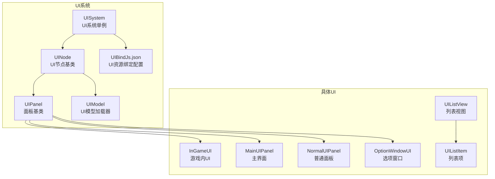
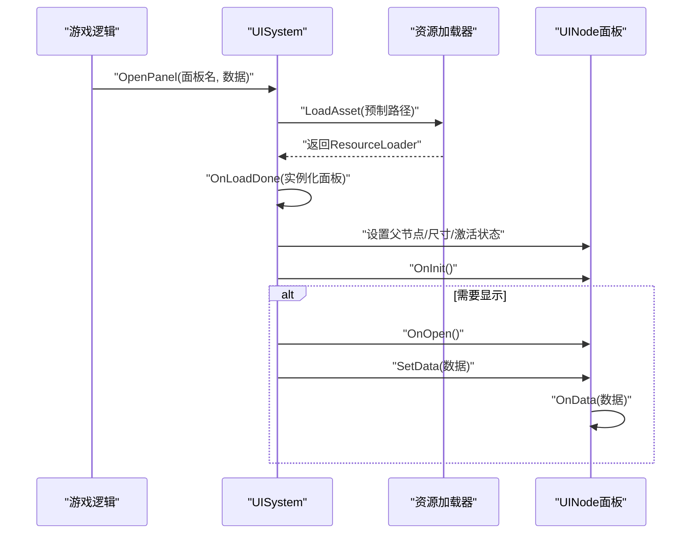
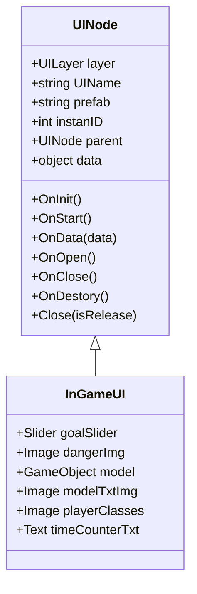
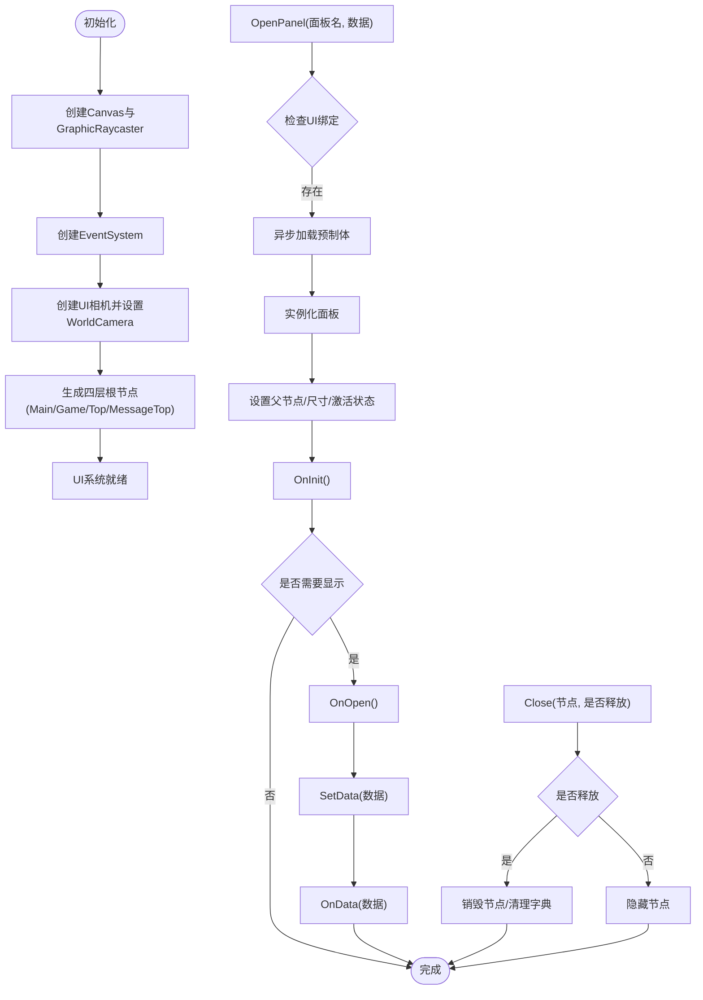
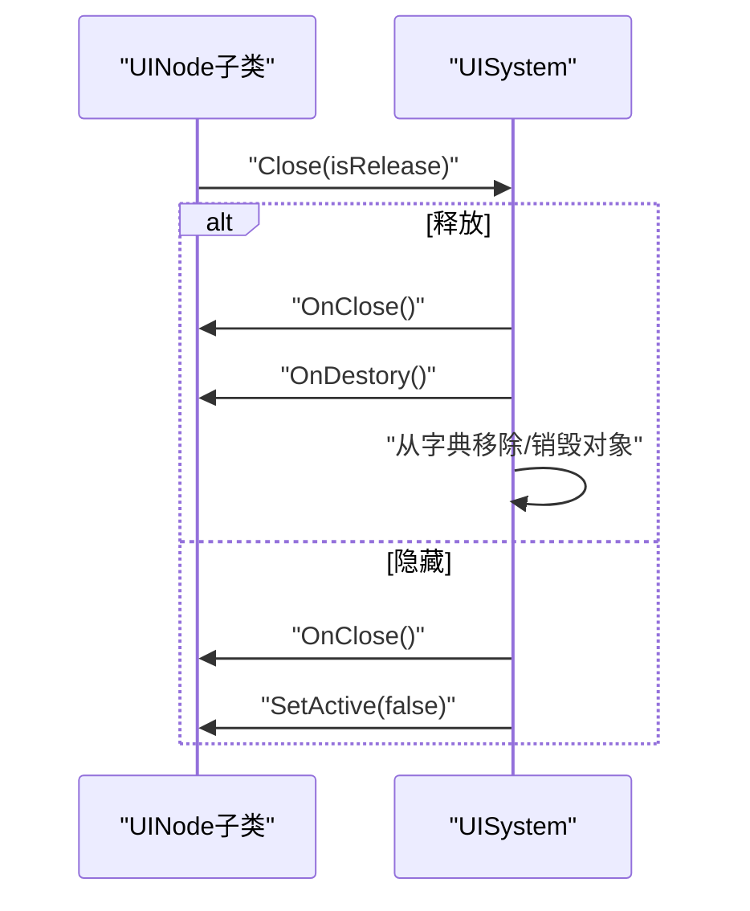
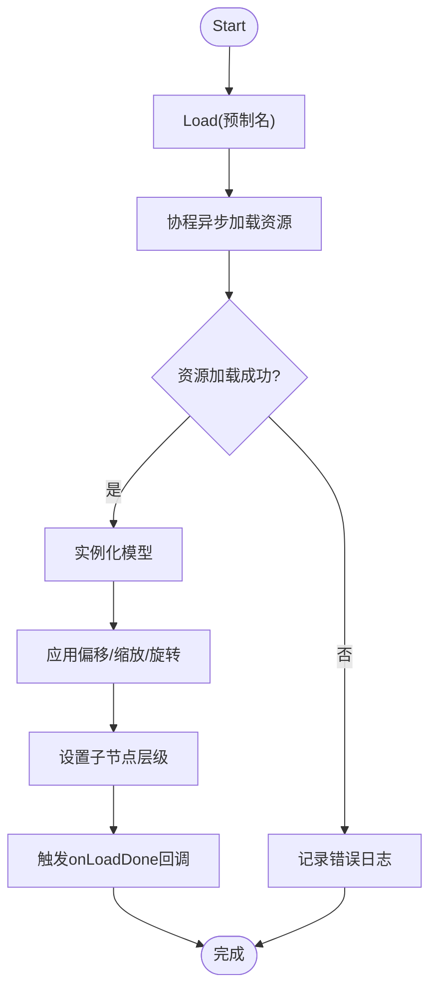
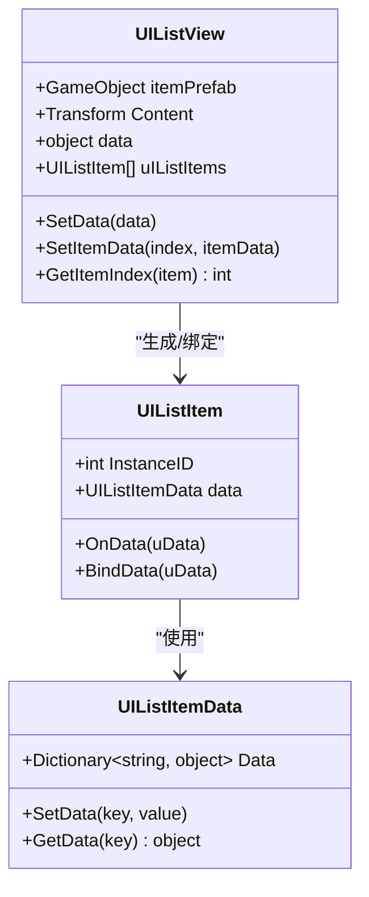
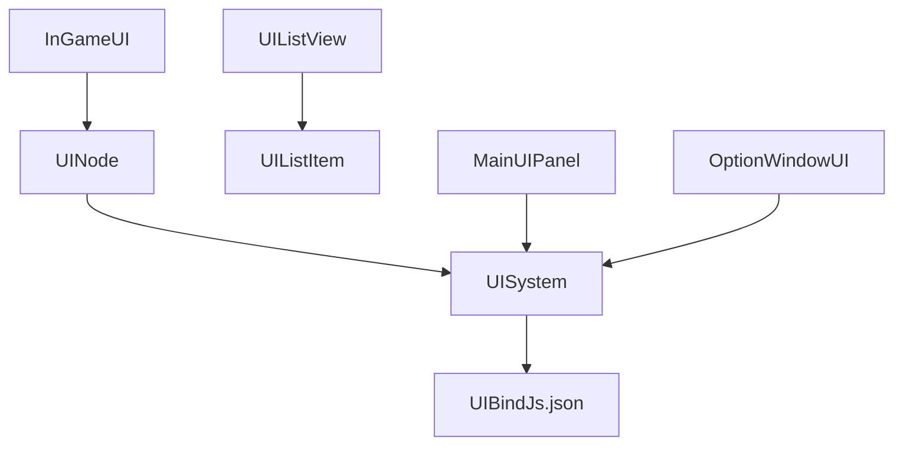

# 游戏内界面系统

<cite>
**本文档引用的文件**
- [InGameUI.cs](file://Assets/Scripts/UI/InGameUI/InGameUI.cs)
- [UISystem.cs](file://Assets/Scripts/Systems/Implement/UISystem/UISystem.cs)
- [UINode.cs](file://Assets/Scripts/UI/UINode.cs)
- [UIPanel.cs](file://Assets/Scripts/UI/UIPanel.cs)
- [NormalUIPanel.cs](file://Assets/Scripts/UI/NormalUIPanel.cs)
- [MainUIPanel.cs](file://Assets/Scripts/UI/MainUI/MainUIPanel.cs)
- [UIModel.cs](file://Assets/Scripts/UI/UIModel.cs)
- [UIBindJs.json](file://Assets/Scripts/UI/UIBindJs.json)
- [UIListView.cs](file://Assets/Scripts/UI/UIListView.cs)
- [UIListItem.cs](file://Assets/Scripts/UI/UIListItem.cs)
- [OptionWindowUI.cs](file://Assets/Scripts/UI/Window/OptionWindowUI.cs)
</cite>

## 目录
1. [简介](#简介)
2. [项目结构](#项目结构)
3. [核心组件](#核心组件)
4. [架构总览](#架构总览)
5. [详细组件分析](#详细组件分析)
6. [依赖关系分析](#依赖关系分析)
7. [性能考虑](#性能考虑)
8. [故障排查指南](#故障排查指南)
9. [结论](#结论)
10. [附录](#附录)

## 简介
本文件面向ProjectR项目的“游戏内界面系统”，系统性阐述InGameUI的设计理念与实现架构，重点覆盖以下方面：
- InGameUI的核心功能与实时更新机制
- UI元素组成（血条、蓝条、计分板、道具栏等）的实现原理
- 布局适配、分辨率兼容性与性能优化策略
- 数据绑定机制、状态同步与动画效果实现
- 扩展方法与自定义UI元素的添加指南

## 项目结构
UI系统采用分层设计：基础UI节点基类UINode作为所有面板的抽象；UISystem负责UI生命周期管理、资源加载、层级管理与事件系统；具体UI面板通过继承UINode实现各自业务逻辑；InGameUI作为游戏内场景中的核心UI容器，承载各类游戏内元素。

图表来源
- [UINode.cs:9-57](file://Assets/Scripts/UI/UINode.cs#L9-L57)
- [UIPanel.cs:3-6](file://Assets/Scripts/UI/UIPanel.cs#L3-L6)
- [UISystem.cs:21-48](file://Assets/Scripts/Systems/Implement/UISystem/UISystem.cs#L21-L48)
- [InGameUI.cs:6-15](file://Assets/Scripts/UI/InGameUI/InGameUI.cs#L6-L15)
- [MainUIPanel.cs:8-31](file://Assets/Scripts/UI/MainUI/MainUIPanel.cs#L8-L31)
- [NormalUIPanel.cs:6-31](file://Assets/Scripts/UI/NormalUIPanel.cs#L6-L31)
- [OptionWindowUI.cs:5-27](file://Assets/Scripts/UI/Window/OptionWindowUI.cs#L5-L27)
- [UIModel.cs:9-60](file://Assets/Scripts/UI/UIModel.cs#L9-L60)
- [UIBindJs.json:1-32](file://Assets/Scripts/UI/UIBindJs.json#L1-L32)
- [UIListView.cs:8-68](file://Assets/Scripts/UI/UIListView.cs#L8-L68)
- [UIListItem.cs:6-48](file://Assets/Scripts/UI/UIListItem.cs#L6-L48)

章节来源
- [UINode.cs:1-107](file://Assets/Scripts/UI/UINode.cs#L1-L107)
- [UISystem.cs:1-280](file://Assets/Scripts/Systems/Implement/UISystem/UISystem.cs#L1-L280)
- [InGameUI.cs:1-18](file://Assets/Scripts/UI/InGameUI/InGameUI.cs#L1-L18)
- [UIBindJs.json:1-32](file://Assets/Scripts/UI/UIBindJs.json#L1-L32)

## 核心组件
- UINode：所有UI面板的基类，提供生命周期回调（OnInit/OnStart/OnData/OnOpen/OnClose/OnDestory）、关闭接口、实例ID与父节点管理。
- UISystem：UI系统单例，负责Canvas与EventSystem初始化、UI相机配置、UI层级（Main/Game/Top/MessageTop）管理、UI资源加载与实例化、数据分发。
- InGameUI：游戏内场景UI容器，挂载血条、危险提示、模型展示、职业图标、时间计数等元素。
- UIModel：异步加载UI模型并进行位置、缩放、旋转与层级设置。
- UIListView/UIListItem：列表视图与列表项的数据绑定与动态生成。
- 其他面板：MainUIPanel（主菜单）、NormalUIPanel（通用面板）、OptionWindowUI（选项窗口）等。

章节来源
- [UINode.cs:9-57](file://Assets/Scripts/UI/UINode.cs#L9-L57)
- [UISystem.cs:21-265](file://Assets/Scripts/Systems/Implement/UISystem/UISystem.cs#L21-L265)
- [InGameUI.cs:6-15](file://Assets/Scripts/UI/InGameUI/InGameUI.cs#L6-L15)
- [UIModel.cs:9-60](file://Assets/Scripts/UI/UIModel.cs#L9-L60)
- [UIListView.cs:8-101](file://Assets/Scripts/UI/UIListView.cs#L8-L101)
- [UIListItem.cs:6-50](file://Assets/Scripts/UI/UIListItem.cs#L6-L50)
- [MainUIPanel.cs:8-37](file://Assets/Scripts/UI/MainUI/MainUIPanel.cs#L8-L37)
- [NormalUIPanel.cs:6-31](file://Assets/Scripts/UI/NormalUIPanel.cs#L6-L31)
- [OptionWindowUI.cs:5-27](file://Assets/Scripts/UI/Window/OptionWindowUI.cs#L5-L27)

## 架构总览
UI系统采用“单例系统 + 资源异步加载 + 层级管理”的架构模式。核心流程如下：
- 初始化阶段：创建Canvas、EventSystem、UI相机，并生成四层根节点（Main/Game/Top/MessageTop）。
- 打开面板：根据UI绑定配置加载预制体，实例化后设置到对应层级根节点，调用OnOpen并可传递数据。
- 关闭面板：支持隐藏或释放实例，清理字典与对象引用。
- 数据流：通过SetData将数据下发给目标面板，面板在OnData中处理并驱动UI更新。

图表来源
- [UISystem.cs:161-246](file://Assets/Scripts/Systems/Implement/UISystem/UISystem.cs#L161-L246)
- [UINode.cs:25-55](file://Assets/Scripts/UI/UINode.cs#L25-L55)

章节来源
- [UISystem.cs:38-246](file://Assets/Scripts/Systems/Implement/UISystem/UISystem.cs#L38-L246)
- [UINode.cs:25-55](file://Assets/Scripts/UI/UINode.cs#L25-L55)

## 详细组件分析

### InGameUI 组件分析
InGameUI作为游戏内场景的核心UI容器，挂载了多种元素以支撑实时状态展示与交互：
- 血条（Slider）：用于显示生命值变化
- 危险提示（Image）：用于显示危险状态或警告
- 模型展示（GameObject）：用于展示角色或物品模型
- 模型文字图片（Image）：用于显示模型相关信息
- 职业图标（Image）：用于显示玩家职业
- 时间计数（Text）：用于显示游戏内时间或倒计时

图表来源
- [UINode.cs:9-57](file://Assets/Scripts/UI/UINode.cs#L9-L57)
- [InGameUI.cs:6-15](file://Assets/Scripts/UI/InGameUI/InGameUI.cs#L6-L15)

章节来源
- [InGameUI.cs:1-18](file://Assets/Scripts/UI/InGameUI/InGameUI.cs#L1-L18)
- [UINode.cs:1-107](file://Assets/Scripts/UI/UINode.cs#L1-L107)

### UISystem 组件分析
UISystem是UI系统的中枢，负责：
- Canvas与EventSystem的创建与配置
- UI相机的创建与裁剪掩码设置
- 四层UI根节点（Main/Game/Top/MessageTop）的生成与深度控制
- 面板打开/关闭/释放的统一调度
- 异步资源加载与实例化
- 数据下发（SetData）

图表来源
- [UISystem.cs:38-246](file://Assets/Scripts/Systems/Implement/UISystem/UISystem.cs#L38-L246)

章节来源
- [UISystem.cs:1-280](file://Assets/Scripts/Systems/Implement/UISystem/UISystem.cs#L1-L280)

### UINode 与面板生命周期
UINode定义了UI面板的标准生命周期与数据接口：
- OnInit：初始化实例ID
- OnStart：面板启动时的默认行为（如重置局部坐标）
- OnData：接收数据并可设置父节点
- OnOpen/OnClose/OnDestory：打开、关闭、销毁回调
- Close：委托UISystem执行关闭逻辑

图表来源
- [UINode.cs:52-55](file://Assets/Scripts/UI/UINode.cs#L52-L55)
- [UISystem.cs:145-160](file://Assets/Scripts/Systems/Implement/UISystem/UISystem.cs#L145-L160)

章节来源
- [UINode.cs:25-55](file://Assets/Scripts/UI/UINode.cs#L25-L55)
- [UISystem.cs:145-160](file://Assets/Scripts/Systems/Implement/UISystem/UISystem.cs#L145-L160)

### UIModel 模型加载器
UIModel负责异步加载UI模型并进行位置、缩放、旋转与层级设置，同时回调加载完成事件。

图表来源
- [UIModel.cs:20-59](file://Assets/Scripts/UI/UIModel.cs#L20-L59)

章节来源
- [UIModel.cs:1-63](file://Assets/Scripts/UI/UIModel.cs#L1-L63)

### 列表视图 UIListView 与 UIListItem
UIListView根据数据集动态生成UIListItem，支持增删改查与索引定位；UIListItem提供数据绑定接口，便于在OnData中刷新UI。

图表来源
- [UIListView.cs:8-97](file://Assets/Scripts/UI/UIListView.cs#L8-L97)
- [UIListItem.cs:6-48](file://Assets/Scripts/UI/UIListItem.cs#L6-L48)

章节来源
- [UIListView.cs:1-101](file://Assets/Scripts/UI/UIListView.cs#L1-L101)
- [UIListItem.cs:1-50](file://Assets/Scripts/UI/UIListItem.cs#L1-L50)

### 主界面与选项窗口示例
- MainUIPanel：提供开始游戏、选项与退出按钮，点击后通过UISystem打开其他面板，并向目标面板传递数据。
- OptionWindowUI：包含音乐、音效滑杆与提示开关，绑定UI事件并在OnStart中初始化文本显示。

章节来源
- [MainUIPanel.cs:8-37](file://Assets/Scripts/UI/MainUI/MainUIPanel.cs#L8-L37)
- [OptionWindowUI.cs:5-27](file://Assets/Scripts/UI/Window/OptionWindowUI.cs#L5-L27)

## 依赖关系分析
- UINode与UISystem：UINode通过Close委托调用UISystem的关闭逻辑，实现统一的生命周期管理。
- UISystem与UI资源：UISystem通过ResourceSystem异步加载UI预制体，并维护UI资产字典（UIBindJs.json）。
- InGameUI与其他UI：InGameUI作为容器，内部元素由具体UI组件驱动（如Slider/Image/Text）。
- UIListView与UIListItem：列表视图与列表项之间为组合关系，列表视图负责动态生成与数据分发。

图表来源
- [UINode.cs:52-55](file://Assets/Scripts/UI/UINode.cs#L52-L55)
- [UISystem.cs:38-48](file://Assets/Scripts/Systems/Implement/UISystem/UISystem.cs#L38-L48)
- [UIBindJs.json:1-32](file://Assets/Scripts/UI/UIBindJs.json#L1-L32)
- [InGameUI.cs:6-15](file://Assets/Scripts/UI/InGameUI/InGameUI.cs#L6-L15)
- [UIListView.cs:8-17](file://Assets/Scripts/UI/UIListView.cs#L8-L17)
- [UIListItem.cs:6-24](file://Assets/Scripts/UI/UIListItem.cs#L6-L24)
- [MainUIPanel.cs:8-31](file://Assets/Scripts/UI/MainUI/MainUIPanel.cs#L8-L31)
- [OptionWindowUI.cs:5-27](file://Assets/Scripts/UI/Window/OptionWindowUI.cs#L5-L27)

章节来源
- [UINode.cs:1-107](file://Assets/Scripts/UI/UINode.cs#L1-L107)
- [UISystem.cs:1-280](file://Assets/Scripts/Systems/Implement/UISystem/UISystem.cs#L1-L280)
- [UIBindJs.json:1-32](file://Assets/Scripts/UI/UIBindJs.json#L1-L32)

## 性能考虑
- 异步加载：UIModel与UISystem均采用协程异步加载资源，避免主线程阻塞。
- 对象池与复用：建议对频繁创建/销毁的UI元素（如列表项）采用对象池策略，减少GC压力。
- 层级深度：通过UI相机的裁剪掩码与层级深度控制，减少无关UI渲染。
- 事件系统：EventSystem集中管理输入事件，避免重复监听与内存泄漏。
- Canvas设置：Canvas使用ScreenSpace_Camera渲染模式并绑定UI相机，确保UI与场景分离。

## 故障排查指南
- UI未显示或层级异常
  - 检查UISystem是否正确创建Canvas、EventSystem与UI相机
  - 确认面板预制体已正确挂载UINode组件并设置layer
  - 参考：[UISystem.cs:49-92](file://Assets/Scripts/Systems/Implement/UISystem/UISystem.cs#L49-L92)
- 面板无法打开
  - 检查UI绑定配置中是否存在该面板名
  - 确认OpenPanel调用时传入的面板名与UIBindJs.json一致
  - 参考：[UISystem.cs:161-178](file://Assets/Scripts/Systems/Implement/UISystem/UISystem.cs#L161-L178)，[UIBindJs.json:1-32](file://Assets/Scripts/UI/UIBindJs.json#L1-L32)
- 数据未生效
  - 确认SetData调用的目标面板名存在且OnData被正确实现
  - 参考：[UISystem.cs:252-264](file://Assets/Scripts/Systems/Implement/UISystem/UISystem.cs#L252-L264)
- 模型加载失败
  - 检查UIModel的prefabName与资源路径
  - 查看日志输出定位资源加载错误
  - 参考：[UIModel.cs:20-59](file://Assets/Scripts/UI/UIModel.cs#L20-L59)

章节来源
- [UISystem.cs:161-264](file://Assets/Scripts/Systems/Implement/UISystem/UISystem.cs#L161-L264)
- [UIBindJs.json:1-32](file://Assets/Scripts/UI/UIBindJs.json#L1-L32)
- [UIModel.cs:20-59](file://Assets/Scripts/UI/UIModel.cs#L20-L59)

## 结论
ProjectR的UI系统通过UINode与UISystem实现了清晰的生命周期管理与资源加载机制，InGameUI作为游戏内场景的核心容器，结合列表视图、模型加载器与事件绑定，提供了可扩展、可维护的UI框架。通过异步加载、层级控制与事件系统，系统在保证性能的同时具备良好的扩展性与可定制性。

## 附录

### 游戏内界面元素组成与实现要点
- 血条（Slider）：通过InGameUI挂载的Slider组件绑定数值变化，建议在OnData中根据实体属性实时更新。
- 蓝条（Slider）：同上，用于魔法值或能量值显示。
- 计分板（Text）：用于显示分数、等级等信息，建议在OnData中格式化字符串并赋值。
- 道具栏（UIListView + UIListItem）：通过列表视图动态生成道具项，UIListItem负责单项数据绑定与UI刷新。
- 模型展示（UIModel）：用于展示角色或物品模型，支持偏移、缩放、旋转与层级设置。
- 危险提示（Image）：用于高亮危险状态或警告图标，建议在OnData中根据状态切换显示。
- 职业图标（Image）：用于显示玩家职业，可在OnData中根据职业类型切换Sprite。
- 时间计数（Text）：用于显示游戏内时间或倒计时，建议在每帧更新或通过定时器驱动。

章节来源
- [InGameUI.cs:6-15](file://Assets/Scripts/UI/InGameUI/InGameUI.cs#L6-L15)
- [UIListView.cs:8-101](file://Assets/Scripts/UI/UIListView.cs#L8-L101)
- [UIListItem.cs:6-50](file://Assets/Scripts/UI/UIListItem.cs#L6-L50)
- [UIModel.cs:9-60](file://Assets/Scripts/UI/UIModel.cs#L9-L60)

### 布局适配与分辨率兼容
- Canvas使用ScreenSpace_Camera渲染模式并绑定UI相机，确保UI随屏幕尺寸变化而适配。
- 各层根节点通过锚点与尺寸设置为全屏，并通过Z轴深度区分层级。
- 建议在不同分辨率下测试UI相机的正交尺寸与裁剪范围，确保UI不被遮挡。

章节来源
- [UISystem.cs:56-114](file://Assets/Scripts/Systems/Implement/UISystem/UISystem.cs#L56-L114)
- [UISystem.cs:73-92](file://Assets/Scripts/Systems/Implement/UISystem/UISystem.cs#L73-L92)

### 数据绑定机制与状态同步
- 数据下发：UISystem.SetData根据面板名将数据传递给UINode.OnData
- 状态同步：面板在OnData中解析数据并驱动UI元素更新
- 建议：为常用UI元素建立统一的数据契约（如数值范围、单位、格式），确保跨面板一致性

章节来源
- [UISystem.cs:252-264](file://Assets/Scripts/Systems/Implement/UISystem/UISystem.cs#L252-L264)
- [UINode.cs:33-39](file://Assets/Scripts/UI/UINode.cs#L33-L39)

### 动画效果实现建议
- 使用UGUI动画组件（如CanvasGroup、RectTrasnform动画）实现淡入淡出与位移动画
- 对于复杂动画，可结合Timeline或Animator控制器管理
- 建议在OnOpen/OnClose中播放进入/退出动画，提升用户体验

### 扩展方法与自定义UI元素添加指南
- 新建面板：继承UINode，设置UIName与layer，实现OnStart/OnData/OnOpen等回调
- 注册资源：在UIBindJs.json中添加新面板的名称与预制体路径
- 打开面板：通过UISystem.OpenPanel(面板名, 数据)打开并传递数据
- 列表元素：使用UIListView与UIListItem实现动态列表，注意数据变更时的刷新策略

章节来源
- [UINode.cs:9-57](file://Assets/Scripts/UI/UINode.cs#L9-L57)
- [UISystem.cs:161-178](file://Assets/Scripts/Systems/Implement/UISystem/UISystem.cs#L161-L178)
- [UIBindJs.json:1-32](file://Assets/Scripts/UI/UIBindJs.json#L1-L32)
- [UIListView.cs:8-101](file://Assets/Scripts/UI/UIListView.cs#L8-L101)
- [UIListItem.cs:6-50](file://Assets/Scripts/UI/UIListItem.cs#L6-L50)