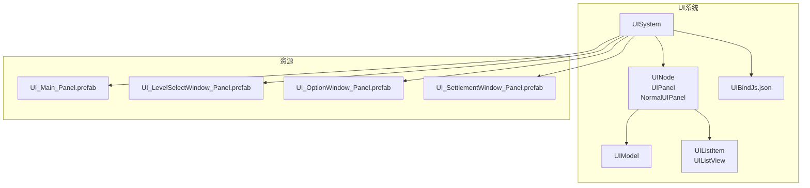
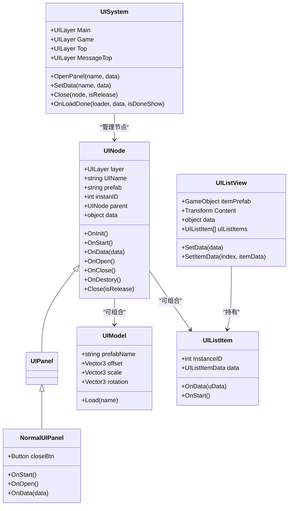
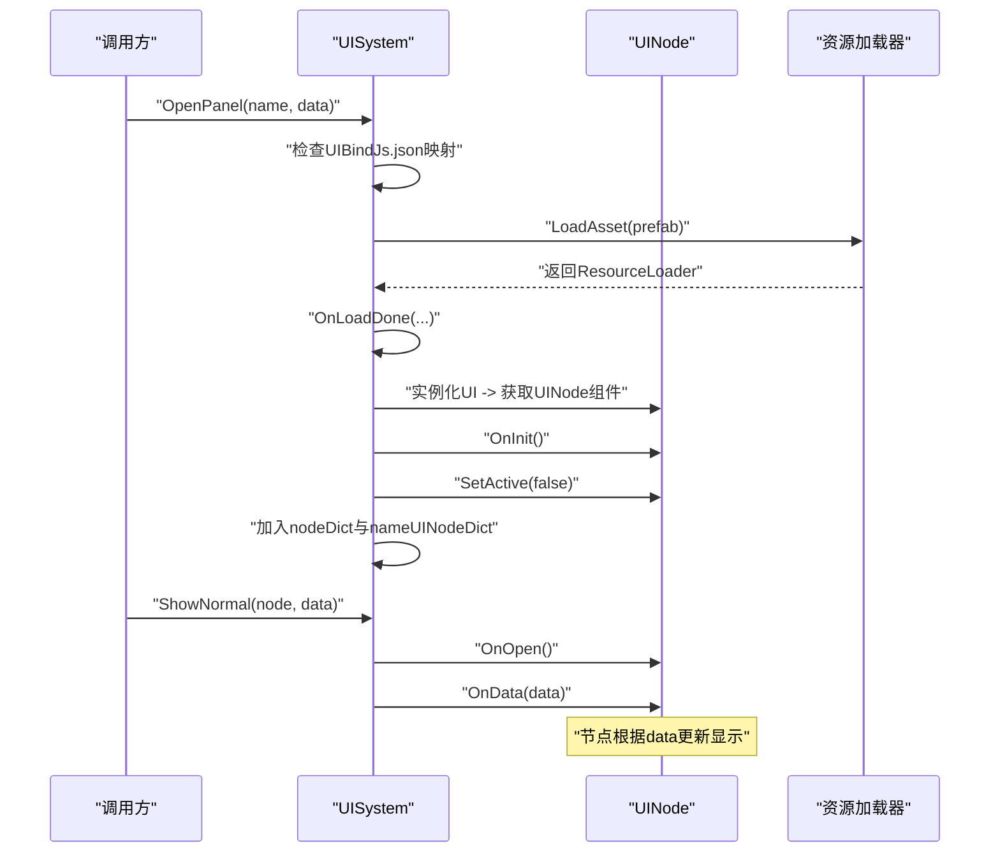
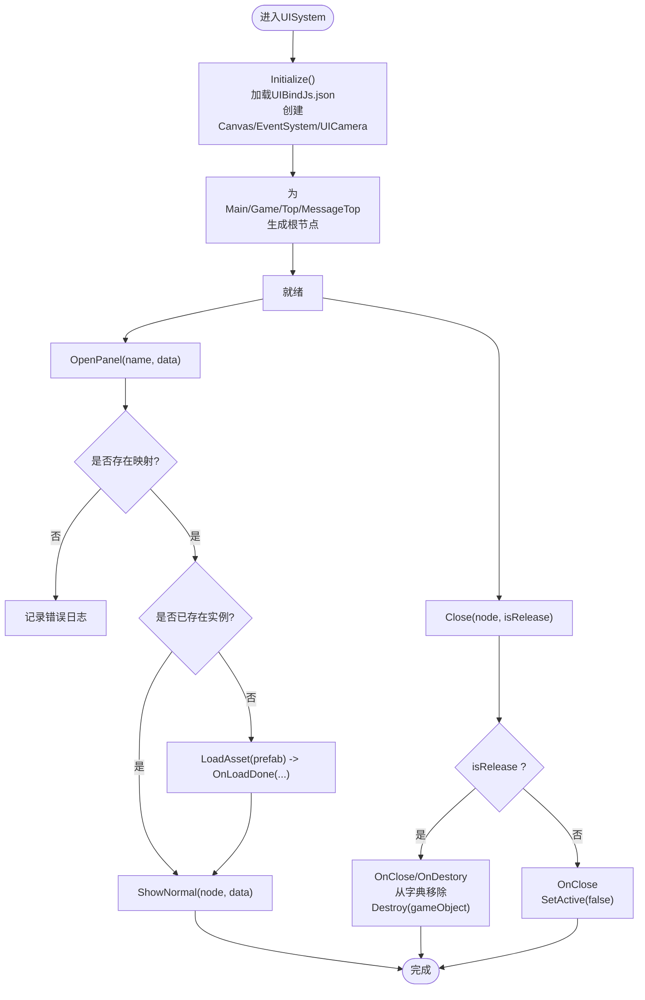
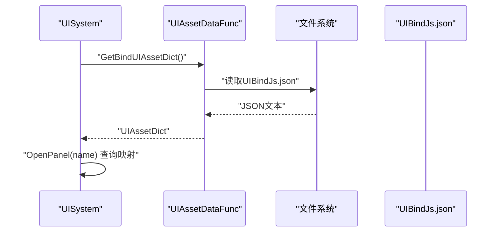
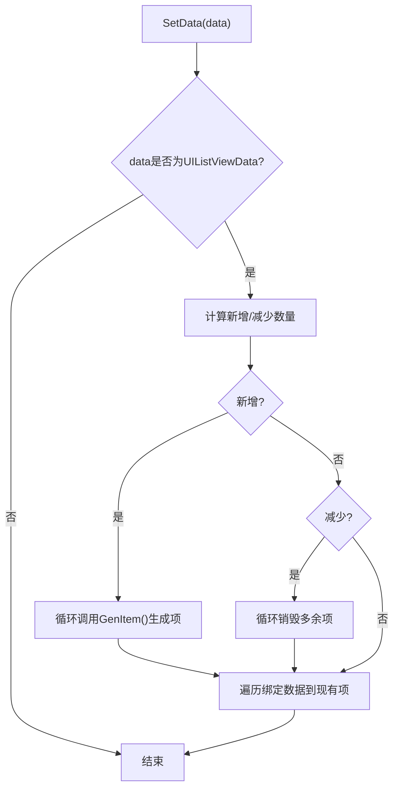
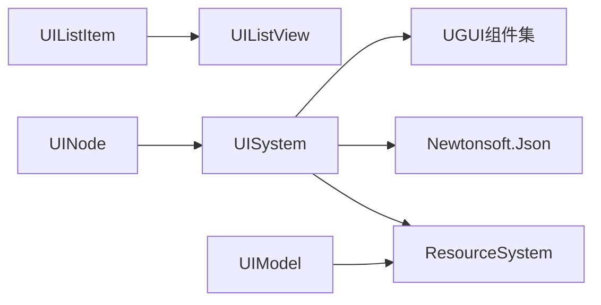

# 用户界面系统

<cite>
**本文引用的文件**
- [UINode.cs](file://Assets/Scripts/UI/UINode.cs)
- [UIPanel.cs](file://Assets/Scripts/UI/UIPanel.cs)
- [NormalUIPanel.cs](file://Assets/Scripts/UI/NormalUIPanel.cs)
- [UIBindJs.json](file://Assets/Scripts/UI/UIBindJs.json)
- [UISystem.cs](file://Assets/Scripts/Systems/Implement/UISystem/UISystem.cs)
- [UIModel.cs](file://Assets/Scripts/UI/UIModel.cs)
- [UIListItem.cs](file://Assets/Scripts/UI/UIListItem.cs)
- [UIListView.cs](file://Assets/Scripts/UI/UIListView.cs)
- [MainUIPanel.cs](file://Assets/Scripts/UI/MainUI/MainUIPanel.cs)
- [InGameUI.cs](file://Assets/Scripts/UI/InGameUI/InGameUI.cs)
- [UI_LevelSelectWindow_Panel.prefab](file://Assets/Art/UI/Prefabs/WindowUI/LevelSelectWindow/UI_LevelSelectWindow_Panel.prefab)
- [UI_OptionWindow_Panel.prefab](file://Assets/Art/UI/Prefabs/WindowUI/OptionWindow/UI_OptionWindow_Panel.prefab)
- [UI_SettlementWindow_Panel.prefab](file://Assets/Art/UI/Prefabs/WindowUI/SettlementWindow/UI_SettlementWindow_Panel.prefab)
- [UI_Main_Panel.prefab](file://Assets/Art/UI/Prefabs/MainUI/UI_Main_Panel.prefab)
</cite>

## 目录
1. [简介](#简介)
2. [项目结构](#项目结构)
3. [核心组件](#核心组件)
4. [架构总览](#架构总览)
5. [详细组件分析](#详细组件分析)
6. [依赖关系分析](#依赖关系分析)
7. [性能考虑](#性能考虑)
8. [故障排查指南](#故障排查指南)
9. [结论](#结论)
10. [附录](#附录)

## 简介
本文件面向ProjectR项目的用户界面系统，系统采用基于UINode的节点树与分层管理机制，结合资源系统进行UI的动态加载与实例化，并通过UISystem统一调度打开、显示、隐藏与销毁流程。UI系统支持主界面、窗口界面（含列表与弹窗）、游戏内界面等多类界面形态，具备层级控制、事件处理、数据绑定与动态资源映射能力。

## 项目结构
UI系统主要由以下模块构成：
- 基础节点与面板：UINode、UIPanel、NormalUIPanel、UIModel、UIListItem、UIListView
- 系统层：UISystem（单例系统，负责UI根画布、层级根节点、事件系统、相机、资源加载与生命周期管理）
- 资源映射：UIBindJs.json（将UI名称映射到预制体路径）
- 预制体：主界面、窗口界面（关卡选择、设置、结算）等预制体

图表来源
- [UISystem.cs:38-48](file://Assets/Scripts/Systems/Implement/UISystem/UISystem.cs#L38-L48)
- [UINode.cs:9-57](file://Assets/Scripts/UI/UINode.cs#L9-L57)
- [UIBindJs.json:1-32](file://Assets/Scripts/UI/UIBindJs.json#L1-L32)

章节来源
- [UISystem.cs:38-48](file://Assets/Scripts/Systems/Implement/UISystem/UISystem.cs#L38-L48)
- [UINode.cs:9-57](file://Assets/Scripts/UI/UINode.cs#L9-L57)
- [UIBindJs.json:1-32](file://Assets/Scripts/UI/UIBindJs.json#L1-L32)

## 核心组件
- UINode：所有UI节点的基类，提供初始化、启动、数据注入、打开/关闭/销毁回调，以及Close委托给UISystem的能力。
- UIPanel：UINode的特化类型，作为面板基类。
- NormalUIPanel：普通面板示例，演示按钮点击触发关闭并释放资源。
- UISystem：UI系统核心，负责创建Canvas、EventSystem、UICamera；维护层级根节点与节点字典；统一加载与显示逻辑；提供SetData进行跨面板数据传递。
- UIModel：用于在UI中加载并实例化模型资源，支持偏移、缩放、旋转与层级设置。
- UIListItem/UIListView：列表项与列表容器，支持动态生成、复用、数据绑定与增删改操作。
- UIBindJs.json：UI名称到预制体路径的映射配置，供UISystem加载并建立资源映射。

章节来源
- [UINode.cs:9-57](file://Assets/Scripts/UI/UINode.cs#L9-L57)
- [UIPanel.cs:3-6](file://Assets/Scripts/UI/UIPanel.cs#L3-L6)
- [NormalUIPanel.cs:6-31](file://Assets/Scripts/UI/NormalUIPanel.cs#L6-L31)
- [UISystem.cs:21-48](file://Assets/Scripts/Systems/Implement/UISystem/UISystem.cs#L21-L48)
- [UIModel.cs:9-61](file://Assets/Scripts/UI/UIModel.cs#L9-L61)
- [UIListItem.cs:6-48](file://Assets/Scripts/UI/UIListItem.cs#L6-L48)
- [UIListView.cs:8-101](file://Assets/Scripts/UI/UIListView.cs#L8-L101)
- [UIBindJs.json:1-32](file://Assets/Scripts/UI/UIBindJs.json#L1-L32)

## 架构总览
UI系统采用“系统单例 + 节点树 + 分层根”的架构：
- 系统单例：UISystem继承MonoSingletonSystem，负责全局初始化、Canvas与EventSystem创建、UICamera配置、层级根节点生成与资源加载。
- 节点树：UINode作为树节点，每个节点拥有layer、UIName、prefab、instanID、parent、data等属性，支持父子关系与数据传递。
- 分层控制：UILayer枚举定义Main、Game、Top、MessageTop四层，每层对应一个根节点，通过z轴偏移实现深度控制。
- 动态绑定：通过UIBindJs.json将UI名称映射到预制体路径，运行时按需加载并实例化。

图表来源
- [UISystem.cs:14-265](file://Assets/Scripts/Systems/Implement/UISystem/UISystem.cs#L14-L265)
- [UINode.cs:9-107](file://Assets/Scripts/UI/UINode.cs#L9-L107)
- [NormalUIPanel.cs:6-31](file://Assets/Scripts/UI/NormalUIPanel.cs#L6-L31)
- [UIModel.cs:9-61](file://Assets/Scripts/UI/UIModel.cs#L9-L61)
- [UIListItem.cs:6-48](file://Assets/Scripts/UI/UIListItem.cs#L6-L48)
- [UIListView.cs:8-101](file://Assets/Scripts/UI/UIListView.cs#L8-L101)

## 详细组件分析

### UINode与UI节点树
- 设计理念：UINode是所有UI节点的抽象基类，提供统一的生命周期回调（OnInit/OnStart/OnData/OnOpen/OnClose/OnDestory），并通过Close委托给UISystem执行统一的显示/隐藏/销毁流程。
- 节点属性：包含layer（决定层级）、UIName（唯一标识）、prefab（预制体名）、instanID（实例ID）、parent（父节点）、data（传入数据）。
- 节点树组织：通过parent形成父子关系，支持数据从父节点向子节点传递；通过nameUINodeDict按名称索引，便于跨面板通信。

图表来源
- [UISystem.cs:161-246](file://Assets/Scripts/Systems/Implement/UISystem/UISystem.cs#L161-L246)
- [UINode.cs:25-57](file://Assets/Scripts/UI/UINode.cs#L25-L57)

章节来源
- [UINode.cs:9-57](file://Assets/Scripts/UI/UINode.cs#L9-L57)
- [UISystem.cs:161-246](file://Assets/Scripts/Systems/Implement/UISystem/UISystem.cs#L161-L246)

### UISystem：层级控制与事件处理
- 层级控制：通过GenObject为每个UILayer生成根节点，设置锚点与尺寸，并按layerFar偏移实现深度排序（Main最近，MessageTop最远）。
- 事件系统：创建EventSystem对象，确保UGUI交互可用。
- 相机与画布：创建UICamera并设置为Canvas.worldCamera，保证屏幕空间渲染与命中检测。
- 打开/关闭：ShowNormal仅激活当前层的指定节点并置顶；Close支持释放（销毁）或隐藏两种模式。
- 数据绑定：SetData通过UIName定位目标节点并调用OnData，实现跨面板数据传递。

图表来源
- [UISystem.cs:38-48](file://Assets/Scripts/Systems/Implement/UISystem/UISystem.cs#L38-L48)
- [UISystem.cs:103-114](file://Assets/Scripts/Systems/Implement/UISystem/UISystem.cs#L103-L114)
- [UISystem.cs:145-160](file://Assets/Scripts/Systems/Implement/UISystem/UISystem.cs#L145-L160)
- [UISystem.cs:252-264](file://Assets/Scripts/Systems/Implement/UISystem/UISystem.cs#L252-L264)

章节来源
- [UISystem.cs:14-265](file://Assets/Scripts/Systems/Implement/UISystem/UISystem.cs#L14-L265)

### UIBindJs.json：UI绑定系统
- 配置结构：assets下以UI名称为键，值包含name与prefab字段，用于将逻辑名称映射到实际预制体路径。
- 加载方式：UIAssetDataFunc通过读取UIBindJs.json并反序列化为UIAssetDict，供UISystem在运行时查询与加载。
- 使用场景：OpenPanel(name)会先查表，再决定是加载新实例还是直接显示已有实例。

图表来源
- [UISystem.cs:266-277](file://Assets/Scripts/Systems/Implement/UISystem/UISystem.cs#L266-L277)
- [UIBindJs.json:1-32](file://Assets/Scripts/UI/UIBindJs.json#L1-L32)

章节来源
- [UISystem.cs:266-277](file://Assets/Scripts/Systems/Implement/UISystem/UISystem.cs#L266-L277)
- [UIBindJs.json:1-32](file://Assets/Scripts/UI/UIBindJs.json#L1-L32)

### 列表组件：UIListItem 与 UIListView
- UIListItem：每个列表项的基础，提供InstanceID与数据容器，支持在Start时初始化并接收UIListItemData。
- UIListView：列表容器，持有itemPrefab与Content容器，支持动态增删改与数据绑定；内部通过GenItem与SetItemData实现列表项的生成与赋值。
- 复用策略：当数据量变化时，自动增删列表项，避免频繁创建销毁带来的性能波动。

图表来源
- [UIListView.cs:18-44](file://Assets/Scripts/UI/UIListView.cs#L18-L44)
- [UIListView.cs:50-63](file://Assets/Scripts/UI/UIListView.cs#L50-L63)

章节来源
- [UIListItem.cs:6-48](file://Assets/Scripts/UI/UIListItem.cs#L6-L48)
- [UIListView.cs:8-101](file://Assets/Scripts/UI/UIListView.cs#L8-L101)

### 不同类型UI界面的实现差异与使用场景
- 主界面（MainUI）：通常为全屏界面，适合放置主菜单、登录、大厅等常驻界面。预制体参考UI_Main_Panel.prefab。
- 窗口界面（WindowUI）：包含弹窗与列表型窗口，如关卡选择、设置、结算等。预制体参考UI_LevelSelectWindow_Panel.prefab、UI_OptionWindow_Panel.prefab、UI_SettlementWindow_Panel.prefab。
- 游戏内界面（InGameUI）：与玩法强关联的HUD或提示界面，位于Game层，深度靠前但不遮挡游戏画面。

章节来源
- [MainUIPanel.cs](file://Assets/Scripts/UI/MainUI/MainUIPanel.cs)
- [InGameUI.cs](file://Assets/Scripts/UI/InGameUI/InGameUI.cs)
- [UI_LevelSelectWindow_Panel.prefab](file://Assets/Art/UI/Prefabs/WindowUI/LevelSelectWindow/UI_LevelSelectWindow_Panel.prefab)
- [UI_OptionWindow_Panel.prefab](file://Assets/Art/UI/Prefabs/WindowUI/OptionWindow/UI_OptionWindow_Panel.prefab)
- [UI_SettlementWindow_Panel.prefab](file://Assets/Art/UI/Prefabs/WindowUI/SettlementWindow/UI_SettlementWindow_Panel.prefab)
- [UI_Main_Panel.prefab](file://Assets/Art/UI/Prefabs/MainUI/UI_Main_Panel.prefab)

### UI模型加载与渲染（UIModel）
- 加载流程：Start时调用Load，内部协程通过ResourceSystem加载预制体，完成后实例化并设置父子关系、位置、缩放、旋转。
- 层级与事件：对子节点统一设置layer=5，并在onLoadDone回调中通知外部。
- 适用场景：在UI中嵌入3D模型预览、图标展示等。

章节来源
- [UIModel.cs:16-59](file://Assets/Scripts/UI/UIModel.cs#L16-L59)

## 依赖关系分析
- 组件耦合：UINode与UISystem松耦合，通过Close委托与SetData进行交互；UIListItem/UIListView与UINode解耦，通过数据容器与列表容器协作。
- 外部依赖：UISystem依赖ResourceSystem进行异步资源加载；依赖Json.NET解析UIBindJs.json；依赖UGUI的Canvas、EventSystem、GraphicRaycaster、CanvasScaler等组件。
- 循环依赖：未发现直接循环依赖；节点树通过parent指针连接，但无反向引用，避免循环。

图表来源
- [UISystem.cs:4-10](file://Assets/Scripts/Systems/Implement/UISystem/UISystem.cs#L4-L10)
- [UINode.cs:1-6](file://Assets/Scripts/UI/UINode.cs#L1-L6)
- [UIModel.cs:1-6](file://Assets/Scripts/UI/UIModel.cs#L1-L6)

章节来源
- [UISystem.cs:4-10](file://Assets/Scripts/Systems/Implement/UISystem/UISystem.cs#L4-L10)
- [UINode.cs:1-6](file://Assets/Scripts/UI/UINode.cs#L1-L6)
- [UIModel.cs:1-6](file://Assets/Scripts/UI/UIModel.cs#L1-L6)

## 性能考虑
- 异步加载：通过协程与ResourceSystem异步加载UI预制体，避免主线程阻塞。
- 实例复用：UIListView根据数据量动态增删列表项，减少频繁Instantiate带来的GC压力。
- 显示策略：ShowNormal仅激活当前层目标节点并置顶，其他节点隐藏，降低渲染负担。
- 相机与画布：UICamera设置为正交投影且仅渲染UI层，减少不必要的深度与遮挡计算。
- 批量渲染：通过Canvas与GraphicRaycaster统一管理UI渲染与命中检测，避免重复创建渲染器。

## 故障排查指南
- UI未显示：检查OpenPanel传入的name是否存在于UIBindJs.json映射中；确认OnLoadDone成功实例化UINode并加入字典。
- 数据未生效：确认SetData传入的UIName正确；检查节点OnData是否被调用。
- 关闭不释放：若需要彻底销毁，调用Close(node, true)；否则仅隐藏。
- 列表异常：检查UIListViewData的数据列表长度与SetData调用时机；确保GenItem生成的项正确挂载到Content下。
- 资源加载失败：查看LogSystem输出的错误日志，确认prefab路径与资源包配置一致。

章节来源
- [UISystem.cs:174-178](file://Assets/Scripts/Systems/Implement/UISystem/UISystem.cs#L174-L178)
- [UISystem.cs:252-264](file://Assets/Scripts/Systems/Implement/UISystem/UISystem.cs#L252-L264)
- [UIListView.cs:18-44](file://Assets/Scripts/UI/UIListView.cs#L18-L44)
- [UIModel.cs:31-44](file://Assets/Scripts/UI/UIModel.cs#L31-L44)

## 结论
ProjectR的UI系统通过UINode与UISystem实现了清晰的节点树与分层管理，配合UIBindJs.json的动态绑定机制，能够高效地加载与调度各类UI界面。列表组件与模型加载模块进一步完善了UI的表现力与交互性。建议在后续迭代中引入对象池、延迟加载与更细粒度的渲染剔除策略，以进一步提升性能与可维护性。

## 附录
- 扩展方法与自定义界面实现指南
  - 新建UI：在UIBindJs.json中添加新的UI名称与prefab映射；在相应层级创建UINode派生类并在OnStart/OnData中实现业务逻辑。
  - 列表界面：使用UIListView与UIListItem，按需实现数据容器与绑定方法。
  - 模型展示：在UI中使用UIModel加载并实例化模型，设置偏移与缩放以适配布局。
  - 生命周期：遵循OnInit/OnStart/OnData/OnOpen/OnClose/OnDestory的顺序，确保资源与事件的正确管理。