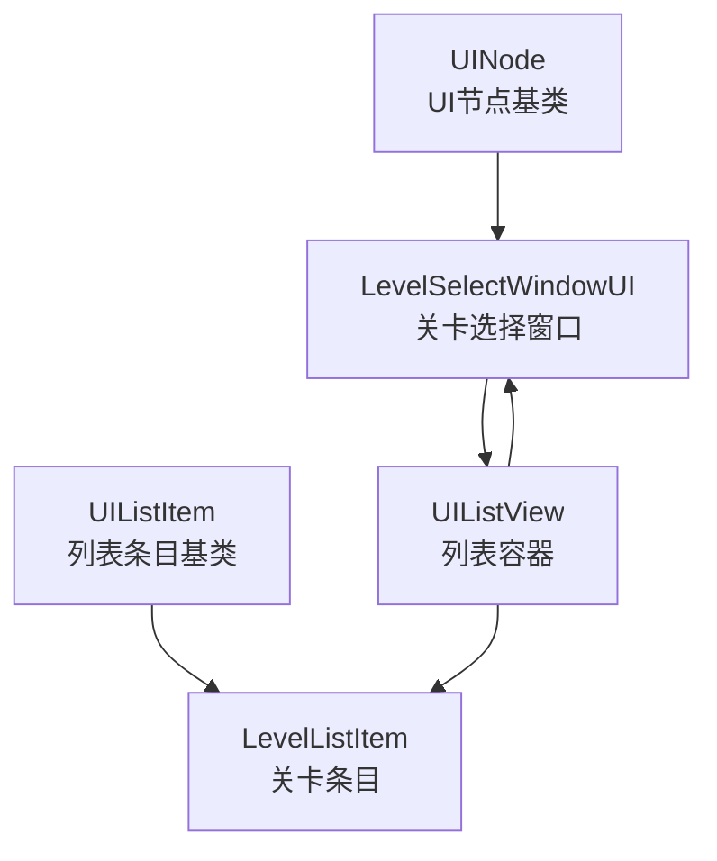
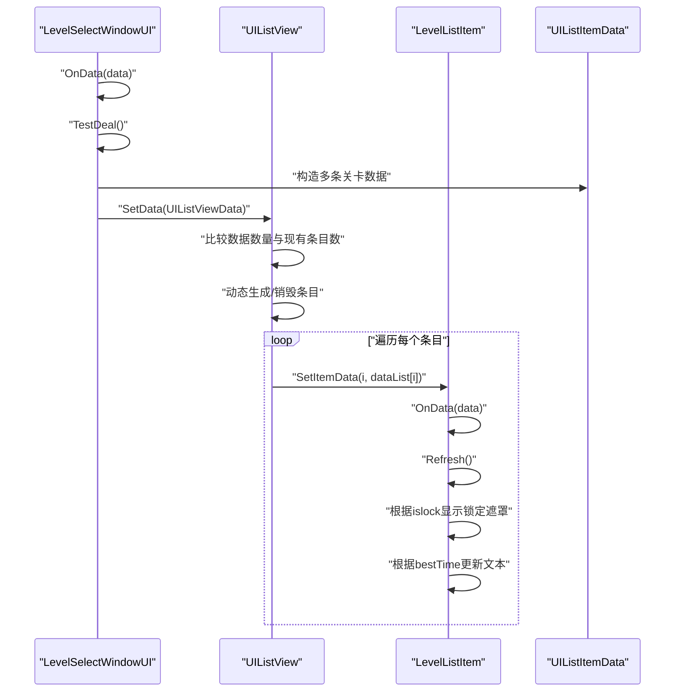
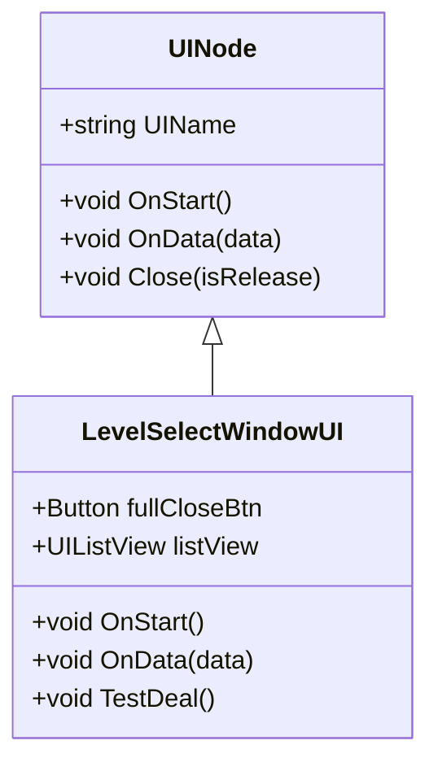
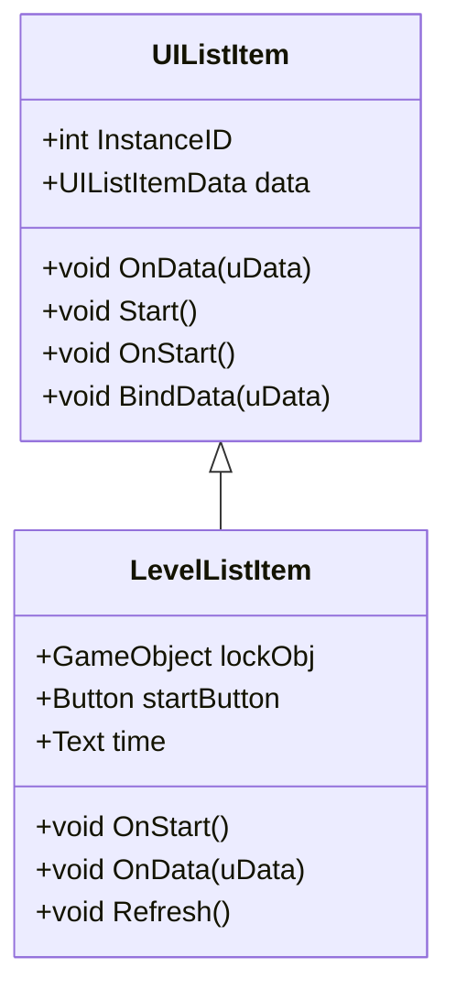
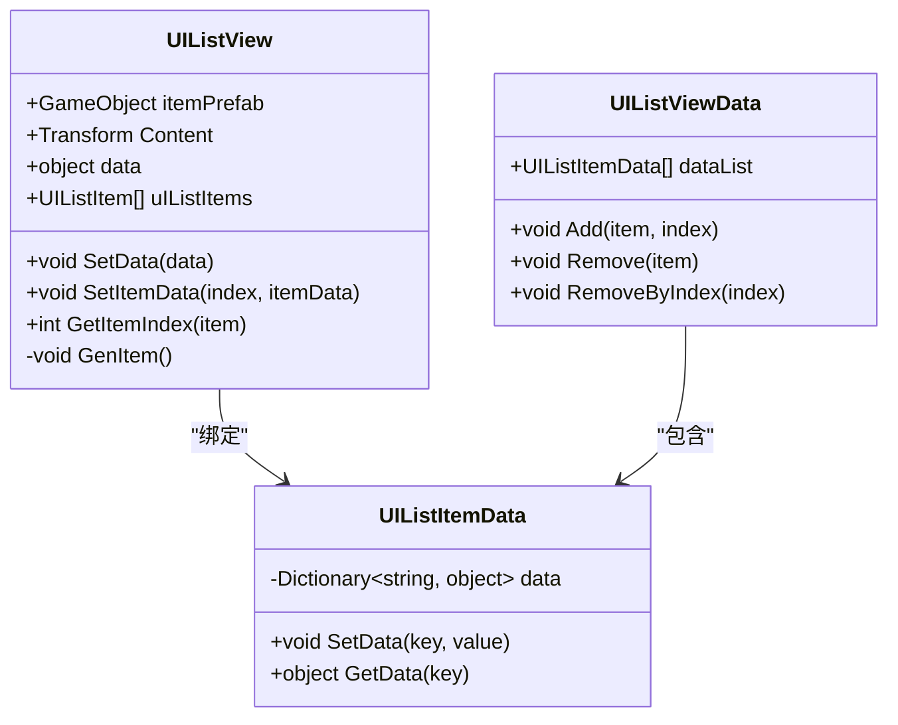
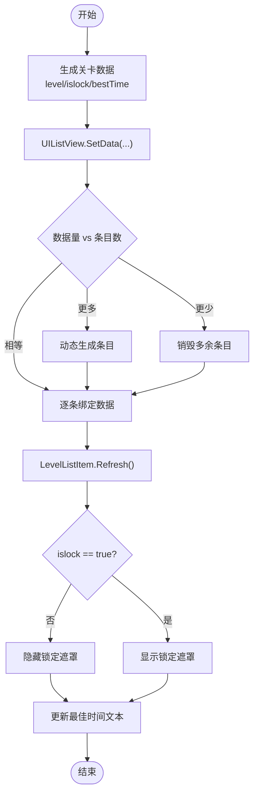
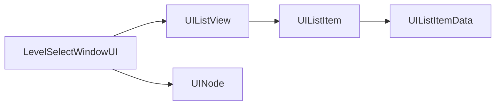

# 关卡选择窗口

<cite>
**本文引用的文件**
- [LevelSelectWindowUI.cs](file://Assets/Scripts/UI/Window/LevelSelectWindowUI.cs)
- [LevelListItem.cs](file://Assets/Scripts/UI/Window/LevelListItem.cs)
- [UIListView.cs](file://Assets/Scripts/UI/UIListView.cs)
- [UIListItem.cs](file://Assets/Scripts/UI/UIListItem.cs)
- [UINode.cs](file://Assets/Scripts/UI/UINode.cs)
</cite>

## 目录
1. [简介](#简介)
2. [项目结构](#项目结构)
3. [核心组件](#核心组件)
4. [架构总览](#架构总览)
5. [详细组件分析](#详细组件分析)
6. [依赖关系分析](#依赖关系分析)
7. [性能考虑](#性能考虑)
8. [故障排查指南](#故障排查指南)
9. [结论](#结论)
10. [附录](#附录)

## 简介
本文件面向ProjectR项目的关卡选择窗口，系统性阐述其设计理念与实现机制，覆盖以下主题：
- 关卡列表的生成与数据绑定
- 解锁条件的判断与呈现
- 关卡难度与完成状态的可视化展示
- 关卡选择的交互逻辑（预览、难度标识、完成状态等）
- 导航机制与场景切换流程
- 扩展方法：新增关卡类型、自定义关卡图标、解锁条件实现指南

该文档以代码级分析为基础，辅以图示帮助不同技术背景的读者理解。

## 项目结构
关卡选择窗口采用“节点-列表-条目”的UI分层设计：
- UINode：所有UI面板的基类，负责生命周期、打开/关闭、数据传递与资源管理
- UIListView：可复用的列表容器，支持动态生成/销毁条目、批量数据绑定
- UIListItem：列表条目的抽象基类，负责接收并渲染单条数据
- LevelSelectWindowUI：关卡选择窗口的具体实现，负责组装列表数据并驱动UI更新
- LevelListItem：具体条目实现，负责显示关卡号、锁定状态、最佳时间等

图表来源
- [UINode.cs:1-107](file://Assets/Scripts/UI/UINode.cs#L1-L107)
- [UIListView.cs:1-101](file://Assets/Scripts/UI/UIListView.cs#L1-L101)
- [UIListItem.cs:1-50](file://Assets/Scripts/UI/UIListItem.cs#L1-L50)
- [LevelSelectWindowUI.cs:1-50](file://Assets/Scripts/UI/Window/LevelSelectWindowUI.cs#L1-L50)
- [LevelListItem.cs:1-31](file://Assets/Scripts/UI/Window/LevelListItem.cs#L1-L31)

章节来源
- [UINode.cs:1-107](file://Assets/Scripts/UI/UINode.cs#L1-L107)
- [UIListView.cs:1-101](file://Assets/Scripts/UI/UIListView.cs#L1-L101)
- [UIListItem.cs:1-50](file://Assets/Scripts/UI/UIListItem.cs#L1-L50)
- [LevelSelectWindowUI.cs:1-50](file://Assets/Scripts/UI/Window/LevelSelectWindowUI.cs#L1-L50)
- [LevelListItem.cs:1-31](file://Assets/Scripts/UI/Window/LevelListItem.cs#L1-L31)

## 核心组件
- UINode
  - 职责：统一管理UI面板的生命周期、打开/关闭、数据传递与资源释放
  - 关键点：提供Close接口委托给UISystem进行统一关闭；OnData用于接收父节点或外部数据
- UIListView
  - 职责：承载列表项的实例化、复用与数据绑定
  - 关键点：根据数据量动态增删条目；通过SetItemData将每条数据传入对应条目
- UIListItem
  - 职责：接收并渲染单条数据；提供Refresh刷新UI
  - 关键点：使用UIListItemData字典存储键值对，支持任意字段扩展
- LevelSelectWindowUI
  - 职责：组装关卡列表数据并驱动UI更新；处理关闭按钮事件
  - 关键点：在OnData中调用TestDeal生成示例数据；通过UIListView.SetData刷新列表
- LevelListItem
  - 职责：渲染单个关卡项的UI元素（锁定遮罩、开始按钮、最佳时间文本）
  - 关键点：根据islock控制锁定遮罩显隐；根据bestTime更新文本

章节来源
- [UINode.cs:1-107](file://Assets/Scripts/UI/UINode.cs#L1-L107)
- [UIListView.cs:1-101](file://Assets/Scripts/UI/UIListView.cs#L1-L101)
- [UIListItem.cs:1-50](file://Assets/Scripts/UI/UIListItem.cs#L1-L50)
- [LevelSelectWindowUI.cs:1-50](file://Assets/Scripts/UI/Window/LevelSelectWindowUI.cs#L1-L50)
- [LevelListItem.cs:1-31](file://Assets/Scripts/UI/Window/LevelListItem.cs#L1-L31)

## 架构总览
下图展示了从窗口初始化到列表渲染的整体流程，以及数据在各组件间的传递路径。

图表来源
- [LevelSelectWindowUI.cs:15-46](file://Assets/Scripts/UI/Window/LevelSelectWindowUI.cs#L15-L46)
- [UIListView.cs:18-63](file://Assets/Scripts/UI/UIListView.cs#L18-L63)
- [UIListItem.cs:10-24](file://Assets/Scripts/UI/UIListItem.cs#L10-L24)
- [LevelListItem.cs:14-26](file://Assets/Scripts/UI/Window/LevelListItem.cs#L14-L26)

## 详细组件分析

### LevelSelectWindowUI 组件分析
- 设计理念
  - 将窗口作为数据装配器：负责组织关卡数据并交由UIListView渲染
  - 保持窗口与条目解耦：窗口不直接操作具体UI元素，仅通过数据驱动
- 实现要点
  - OnStart：注册关闭按钮事件
  - OnData：接收外部数据并触发测试数据装配
  - TestDeal：构建示例关卡数据（level、islock、bestTime），封装为UIListViewData后交给列表
- 可扩展性
  - 可替换TestDeal为真实关卡配置加载逻辑
  - 可接入存档系统读取解锁状态与最佳时间

图表来源
- [UINode.cs:9-57](file://Assets/Scripts/UI/UINode.cs#L9-L57)
- [LevelSelectWindowUI.cs:7-46](file://Assets/Scripts/UI/Window/LevelSelectWindowUI.cs#L7-L46)

章节来源
- [LevelSelectWindowUI.cs:1-50](file://Assets/Scripts/UI/Window/LevelSelectWindowUI.cs#L1-L50)
- [UINode.cs:1-107](file://Assets/Scripts/UI/UINode.cs#L1-L107)

### LevelListItem 组件分析
- 设计理念
  - 条目独立渲染：每个条目只关注自身UI元素的显示逻辑
  - 数据驱动：通过Refresh根据数据字典动态更新UI
- 实现要点
  - OnData：接收UIListItemData并调用Refresh
  - Refresh：根据islock控制锁定遮罩显隐；根据bestTime更新文本
- 视觉元素
  - 锁定遮罩：用于表示未解锁关卡
  - 开始按钮：用于进入关卡
  - 最佳时间：展示历史最好成绩

图表来源
- [UIListItem.cs:6-24](file://Assets/Scripts/UI/UIListItem.cs#L6-L24)
- [LevelListItem.cs:6-26](file://Assets/Scripts/UI/Window/LevelListItem.cs#L6-L26)

章节来源
- [LevelListItem.cs:1-31](file://Assets/Scripts/UI/Window/LevelListItem.cs#L1-L31)
- [UIListItem.cs:1-50](file://Assets/Scripts/UI/UIListItem.cs#L1-L50)

### UIListView 与 UIListItemData 分析
- 设计理念
  - 列表容器与条目解耦：UIListView负责实例化与复用，UIListItem负责渲染
  - 数据结构统一：UIListItemData提供键值对存储，便于扩展字段（如难度、图标等）
- 实现要点
  - SetData：根据数据量动态增删条目，并逐个绑定数据
  - GenItem：按预制生成条目并缓存引用
  - UIListViewData：封装列表数据集合，支持增删改查

图表来源
- [UIListView.cs:8-68](file://Assets/Scripts/UI/UIListView.cs#L8-L68)
- [UIListItem.cs:25-47](file://Assets/Scripts/UI/UIListItem.cs#L25-L47)
- [UIListView.cs:69-97](file://Assets/Scripts/UI/UIListView.cs#L69-L97)

章节来源
- [UIListView.cs:1-101](file://Assets/Scripts/UI/UIListView.cs#L1-L101)
- [UIListItem.cs:1-50](file://Assets/Scripts/UI/UIListItem.cs#L1-L50)

### 关卡列表生成与解锁条件判断
- 列表生成
  - LevelSelectWindowUI在OnData中调用TestDeal生成示例数据，封装为UIListViewData后交由UIListView.SetData
  - UIListView根据数据量动态增删条目，确保内存与性能最优
- 解锁条件
  - 当前实现通过islock字段控制锁定遮罩显隐
  - 建议将islock与存档系统或配置表关联，实现基于前置关卡完成度、等级、任务等条件的动态计算
- 难度与完成状态
  - bestTime用于展示完成状态
  - 可扩展字段（如difficulty）用于展示难度标识，结合UI样式区分

图表来源
- [LevelSelectWindowUI.cs:28-46](file://Assets/Scripts/UI/Window/LevelSelectWindowUI.cs#L28-L46)
- [UIListView.cs:18-44](file://Assets/Scripts/UI/UIListView.cs#L18-L44)
- [LevelListItem.cs:19-26](file://Assets/Scripts/UI/Window/LevelListItem.cs#L19-L26)

章节来源
- [LevelSelectWindowUI.cs:15-46](file://Assets/Scripts/UI/Window/LevelSelectWindowUI.cs#L15-L46)
- [UIListView.cs:18-63](file://Assets/Scripts/UI/UIListView.cs#L18-L63)
- [LevelListItem.cs:14-26](file://Assets/Scripts/UI/Window/LevelListItem.cs#L14-L26)

### 关卡选择交互逻辑
- 关闭窗口
  - 全屏关闭按钮点击后，调用UINode.Close，委托UISystem执行关闭与资源回收
- 进入关卡
  - LevelListItem持有startButton，可在点击时读取当前条目数据并触发场景切换
  - 建议在startButton回调中读取level字段并调用场景管理器加载对应关卡
- 预览与状态
  - 可在LevelListItem中扩展预览功能（如缩略图、难度星标、完成百分比）
  - 通过UI样式（颜色、图标）直观表达完成状态与难度

章节来源
- [LevelSelectWindowUI.cs:9-14](file://Assets/Scripts/UI/Window/LevelSelectWindowUI.cs#L9-L14)
- [LevelListItem.cs:8-13](file://Assets/Scripts/UI/Window/LevelListItem.cs#L8-L13)
- [UINode.cs:52-55](file://Assets/Scripts/UI/UINode.cs#L52-L55)

### 场景切换流程
- 触发点：LevelListItem中的startButton点击
- 流程建议：
  1) 读取当前条目数据（level）
  2) 通知场景管理器加载对应关卡场景
  3) 关闭关卡选择窗口
  4) 进入游戏场景后初始化关卡参数
- 注意事项：
  - 确保场景名称与level映射一致
  - 在切换前保存必要的UI状态，避免闪烁

（本节为概念性流程说明，无需代码来源）

## 依赖关系分析
- 组件耦合
  - LevelSelectWindowUI依赖UIListView进行列表渲染
  - UIListView依赖UIListItem进行条目渲染
  - LevelListItem依赖UIListItemData进行数据绑定
- 外部依赖
  - UINode依赖UISystem进行统一关闭
  - UIListView使用OdinInspector特性进行编辑器可视化配置

图表来源
- [LevelSelectWindowUI.cs:10-10](file://Assets/Scripts/UI/Window/LevelSelectWindowUI.cs#L10-L10)
- [UIListView.cs:17-17](file://Assets/Scripts/UI/UIListView.cs#L17-L17)
- [UIListItem.cs:9-9](file://Assets/Scripts/UI/UIListItem.cs#L9-L9)
- [UINode.cs:54-54](file://Assets/Scripts/UI/UINode.cs#L54-L54)

章节来源
- [LevelSelectWindowUI.cs:1-50](file://Assets/Scripts/UI/Window/LevelSelectWindowUI.cs#L1-L50)
- [UIListView.cs:1-101](file://Assets/Scripts/UI/UIListView.cs#L1-L101)
- [UIListItem.cs:1-50](file://Assets/Scripts/UI/UIListItem.cs#L1-L50)
- [UINode.cs:1-107](file://Assets/Scripts/UI/UINode.cs#L1-L107)

## 性能考虑
- 动态条目复用
  - UIListView根据数据量动态增删条目，避免一次性创建过多实例
- 字典数据访问
  - UIListItemData使用字典存储，查找复杂度O(1)，适合频繁读取
- 渲染优化
  - 建议在LevelListItem中延迟加载图片资源，减少首帧压力
  - 对大量关卡列表，可启用视口裁剪与懒加载

（本节为通用性能建议，无需代码来源）

## 故障排查指南
- 关卡列表不显示
  - 检查LevelSelectWindowUI是否正确调用TestDeal或外部数据装配
  - 确认UIListView的itemPrefab与Content已挂载
- 锁定遮罩不生效
  - 检查LevelListItem中islock字段是否正确传入
  - 确认lockObj对象在Inspector中已赋值
- 最佳时间不更新
  - 检查UIListItemData中bestTime字段是否正确设置
  - 确认LevelListItem.Refresh中对text的赋值逻辑
- 关闭按钮无效
  - 检查LevelSelectWindowUI中onClick事件是否注册成功
  - 确认UINode.Close是否被正确调用

章节来源
- [LevelSelectWindowUI.cs:11-14](file://Assets/Scripts/UI/Window/LevelSelectWindowUI.cs#L11-L14)
- [LevelListItem.cs:19-26](file://Assets/Scripts/UI/Window/LevelListItem.cs#L19-L26)
- [UIListView.cs:18-44](file://Assets/Scripts/UI/UIListView.cs#L18-L44)
- [UINode.cs:52-55](file://Assets/Scripts/UI/UINode.cs#L52-L55)

## 结论
关卡选择窗口通过“节点-列表-条目”三层架构实现了清晰的数据驱动渲染与良好的扩展性。当前实现提供了基础的关卡列表、解锁遮罩与最佳时间展示；后续可通过接入存档系统、配置表与场景管理器进一步完善解锁条件、难度标识与场景切换流程。建议优先完成以下改进：
- 替换TestDeal为真实关卡数据加载
- 将islock与解锁条件解耦，支持多种解锁规则
- 扩展UI样式与图标，增强视觉表达
- 完善startButton的场景切换逻辑

（本节为总结性内容，无需代码来源）

## 附录

### 扩展方法与实现指南

- 新增关卡类型
  - 在UIListItemData中添加新字段（如type、difficulty），并在LevelListItem中扩展渲染逻辑
  - 在LevelSelectWindowUI中为不同类型生成对应的UIListItemData
- 自定义关卡图标
  - 在LevelListItem中增加Image组件，通过UIListItemData的icon字段加载对应图标
  - 建议使用图集或异步加载以提升性能
- 解锁条件实现
  - 将islock与存档系统或配置表关联，根据前置关卡完成度、等级、任务等动态计算
  - 在LevelSelectWindowUI中读取解锁状态并注入UIListItemData
- 难度标识与完成状态
  - 扩展UI样式（颜色、图标、星标）表达难度与完成度
  - 在LevelListItem中根据difficulty与bestTime更新UI外观

（本节为扩展指导，无需代码来源）