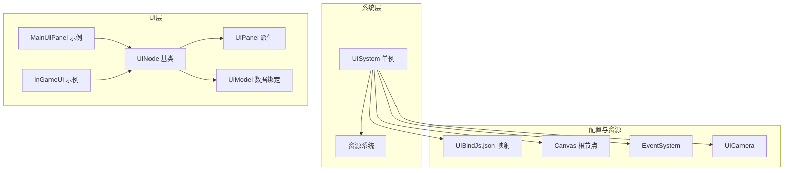
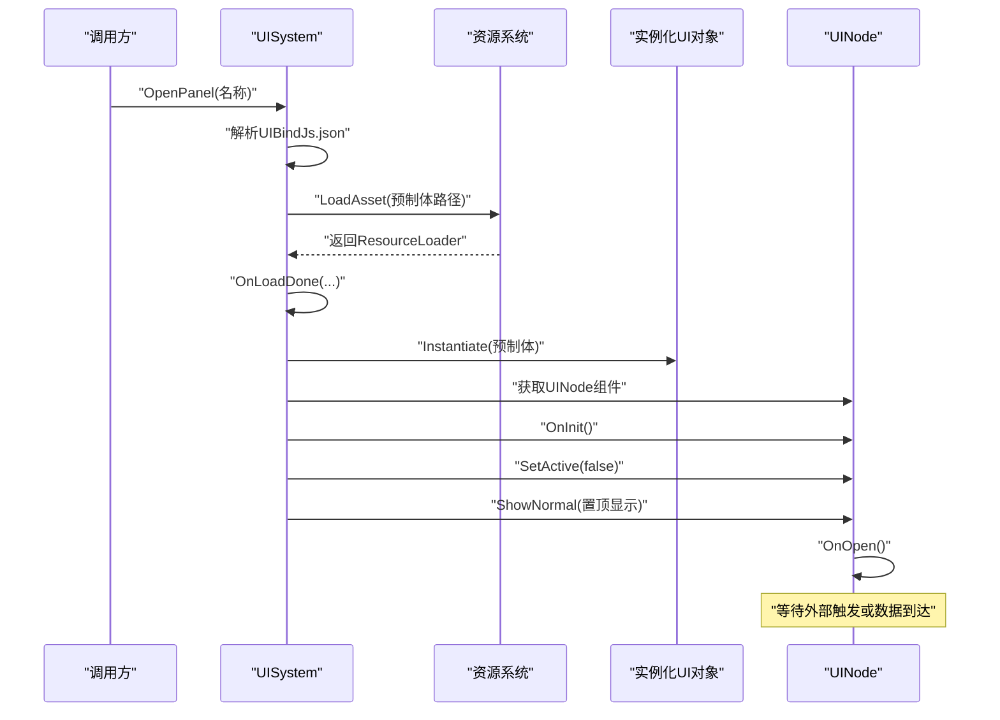
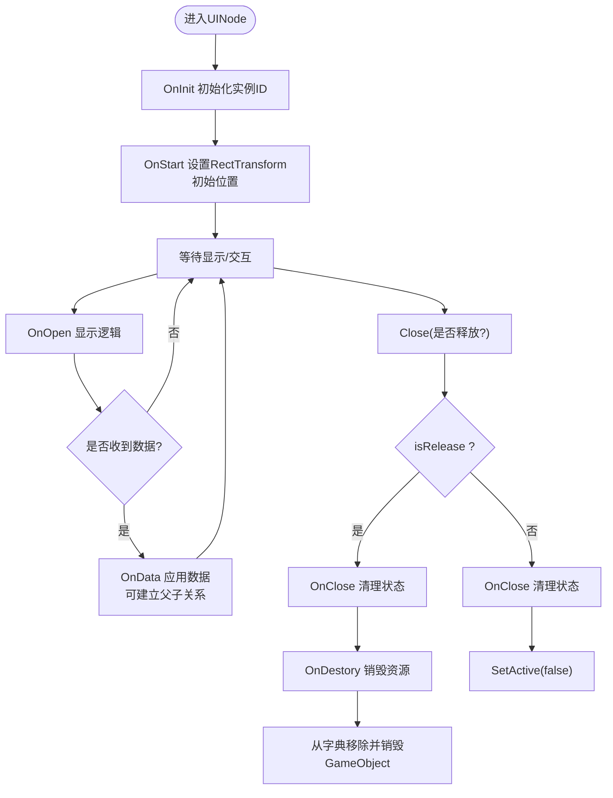
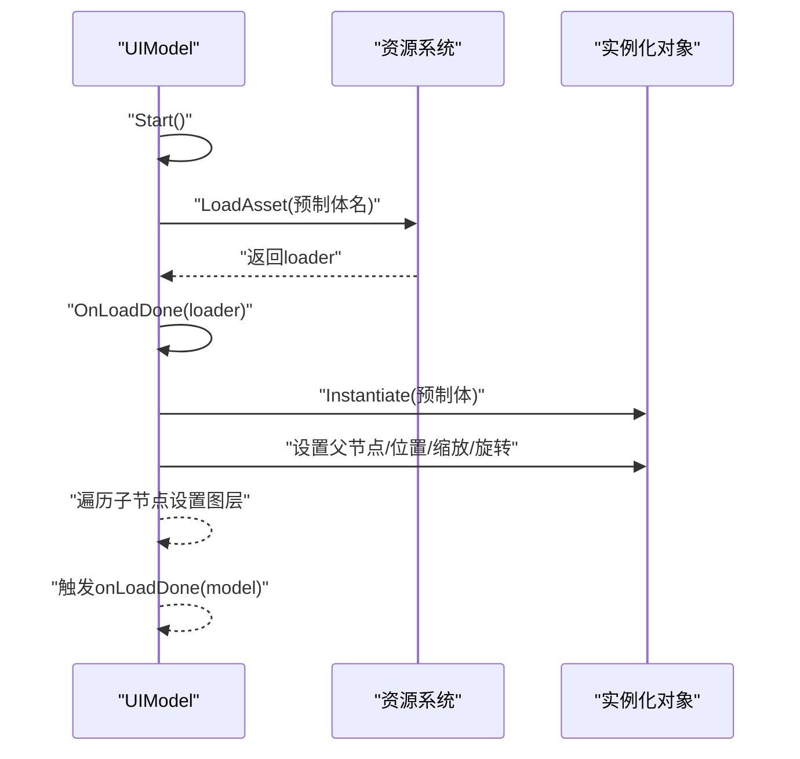
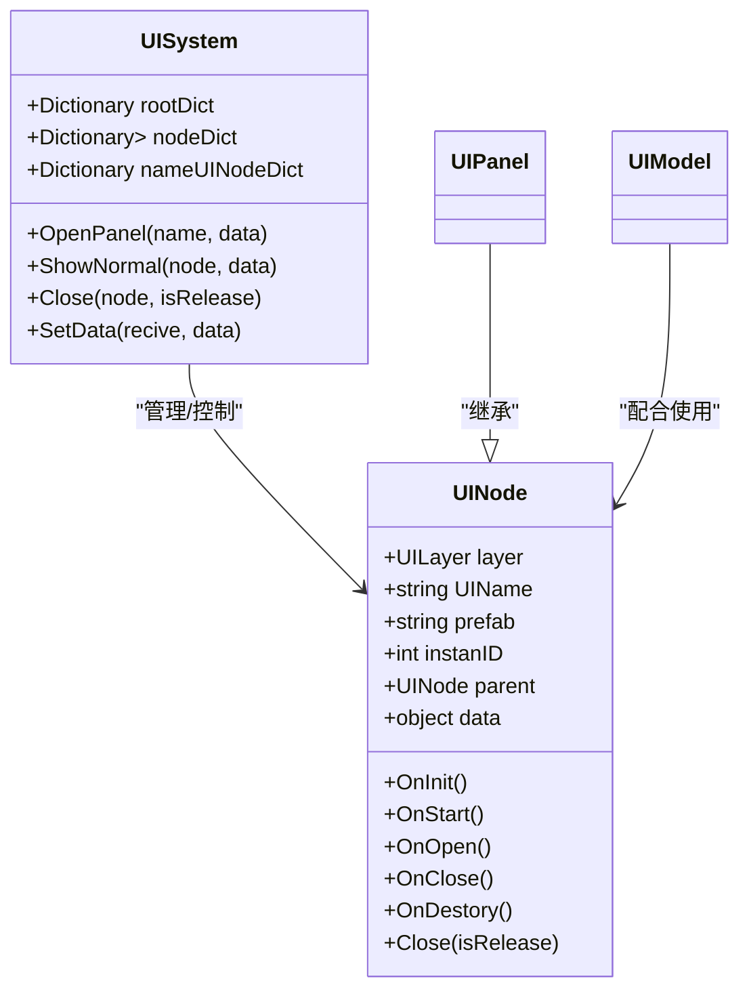
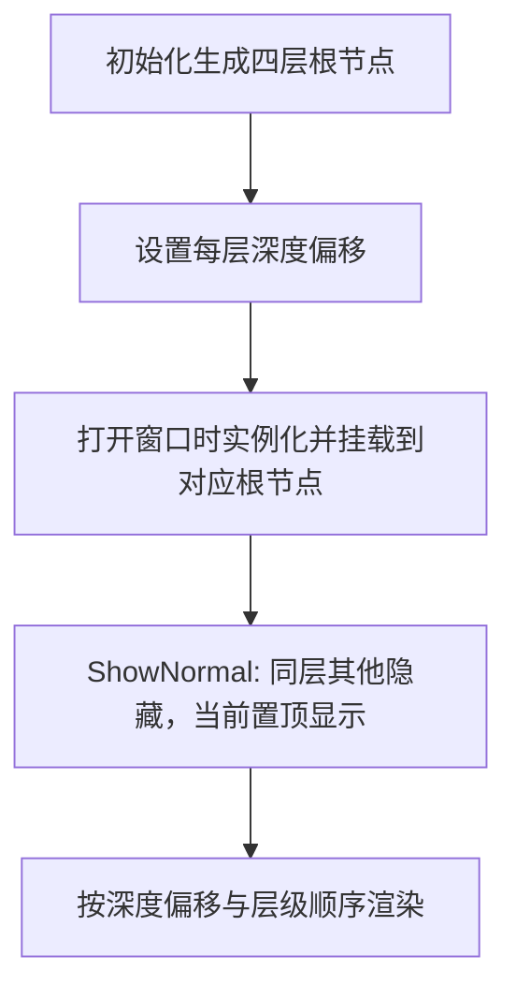
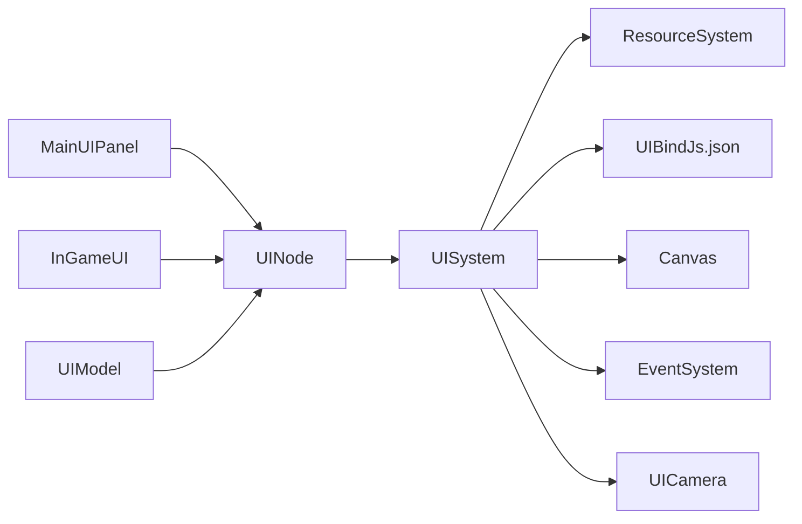

# 窗口基础系统

<cite>
**本文引用的文件**
- [UIPanel.cs](file://Assets/Scripts/UI/UIPanel.cs)
- [UINode.cs](file://Assets/Scripts/UI/UINode.cs)
- [UIModel.cs](file://Assets/Scripts/UI/UIModel.cs)
- [UISystem.cs](file://Assets/Scripts/Systems/Implement/UISystem/UISystem.cs)
- [MainUIPanel.cs](file://Assets/Scripts/UI/MainUI/MainUIPanel.cs)
- [InGameUI.cs](file://Assets/Scripts/UI/InGameUI/InGameUI.cs)
- [UIBindJs.json](file://Assets/Scripts/UI/UIBindJs.json)
- [ResourceSystem.cs](file://Assets/Scripts/Systems/Implement/ResourceSystem/ResourceSystem.cs)
</cite>

## 目录
1. [简介](#简介)
2. [项目结构](#项目结构)
3. [核心组件](#核心组件)
4. [架构总览](#架构总览)
5. [详细组件分析](#详细组件分析)
6. [依赖关系分析](#依赖关系分析)
7. [性能考虑](#性能考虑)
8. [故障排查指南](#故障排查指南)
9. [结论](#结论)
10. [附录](#附录)

## 简介
本文件面向ProjectR项目的窗口基础系统，系统性阐述UIPanel的基础能力、UINode的节点管理机制以及UIModel的数据绑定与资源加载流程。文档重点覆盖以下方面：
- 窗口生命周期：创建、显示、隐藏、销毁
- 窗口层级管理与遮罩实现原理
- 遮罩系统与事件系统的协同
- 扩展接口与自定义窗口类型实现指南
- 性能优化策略与内存管理最佳实践

## 项目结构
窗口系统位于Assets/Scripts/UI与Assets/Scripts/Systems/Implement/UISystem目录下，采用“系统单例 + 节点基类 + 面板派生”的分层设计。UI资源通过UIBindJs.json进行命名到预制体的映射，由资源系统异步加载并实例化。

图表来源
- [UISystem.cs:38-48](file://Assets/Scripts/Systems/Implement/UISystem/UISystem.cs#L38-L48)
- [UINode.cs:9-57](file://Assets/Scripts/UI/UINode.cs#L9-L57)
- [UIPanel.cs:3](file://Assets/Scripts/UI/UIPanel.cs#L3)
- [UIModel.cs:9-61](file://Assets/Scripts/UI/UIModel.cs#L9-L61)
- [UIBindJs.json:1-32](file://Assets/Scripts/UI/UIBindJs.json#L1-L32)

章节来源
- [UISystem.cs:38-48](file://Assets/Scripts/Systems/Implement/UISystem/UISystem.cs#L38-L48)
- [UIBindJs.json:1-32](file://Assets/Scripts/UI/UIBindJs.json#L1-L32)

## 核心组件
- UINode：所有UI窗口的基类，负责生命周期回调（初始化、启动、打开、关闭、销毁）、父子关系与数据传递、统一关闭入口。
- UIPanel：UINode的语义化派生，作为“面板”概念的抽象基类，便于按业务分类。
- UIModel：UI数据绑定与资源加载组件，支持异步加载预制体、实例化、定位与旋转缩放设置，并回调加载完成事件。
- UISystem：UI系统单例，负责Canvas、EventSystem、UICamera的创建与配置；管理各层级UI根节点；负责UI资产的加载与实例化；维护按层级与名称的节点字典；提供OpenPanel、ShowNormal、Close等核心方法。

章节来源
- [UINode.cs:9-57](file://Assets/Scripts/UI/UINode.cs#L9-L57)
- [UIPanel.cs:3](file://Assets/Scripts/UI/UIPanel.cs#L3)
- [UIModel.cs:9-61](file://Assets/Scripts/UI/UIModel.cs#L9-L61)
- [UISystem.cs:21-48](file://Assets/Scripts/Systems/Implement/UISystem/UISystem.cs#L21-L48)

## 架构总览
窗口系统采用“单例系统 + 层级根节点 + 资源异步加载”的架构。系统在初始化时创建Canvas、EventSystem、UICamera，并生成四层UI根节点（Main、Game、Top、MessageTop）。打开窗口时，通过UIBindJs.json解析出预制体路径，使用资源系统异步加载并实例化，随后根据UINode的layer挂载到对应根节点，最后调用OnOpen并置顶显示。

图表来源
- [UISystem.cs:161-178](file://Assets/Scripts/Systems/Implement/UISystem/UISystem.cs#L161-L178)
- [UISystem.cs:197-246](file://Assets/Scripts/Systems/Implement/UISystem/UISystem.cs#L197-L246)
- [UINode.cs:40-47](file://Assets/Scripts/UI/UINode.cs#L40-L47)

## 详细组件分析

### UINode：节点生命周期与数据绑定
- 生命周期回调
  - OnInit：在Start中调用，用于初始化实例ID等。
  - OnStart：在Start中调用，设置RectTransform初始位置。
  - OnOpen：窗口显示时调用，用于执行显示逻辑。
  - OnClose：窗口关闭时调用，用于清理状态。
  - OnDestory：释放时调用，用于彻底销毁资源。
- 关闭入口：Close(isRelease)统一委托给UISystem处理。
- 数据绑定：OnData接收父节点或外部传入的数据对象，可将data强制转换为UINode以建立父子关系。

图表来源
- [UINode.cs:25-57](file://Assets/Scripts/UI/UINode.cs#L25-L57)
- [UISystem.cs:145-160](file://Assets/Scripts/Systems/Implement/UISystem/UISystem.cs#L145-L160)

章节来源
- [UINode.cs:25-57](file://Assets/Scripts/UI/UINode.cs#L25-L57)

### UIPanel：面板抽象与业务扩展
- 语义化继承自UINode，作为“面板”的抽象基类，便于按业务模块（如MainUI、InGameUI）派生具体面板。
- 具体面板可在OnStart中注册按钮事件、监听UIModel加载完成回调等。

章节来源
- [UIPanel.cs:3](file://Assets/Scripts/UI/UIPanel.cs#L3)
- [MainUIPanel.cs:8-31](file://Assets/Scripts/UI/MainUI/MainUIPanel.cs#L8-L31)
- [InGameUI.cs:6-16](file://Assets/Scripts/UI/InGameUI/InGameUI.cs#L6-L16)

### UIModel：数据绑定与资源加载
- 异步加载：Start时调用Load，内部协程通过资源系统异步加载预制体。
- 实例化与变换：加载完成后实例化，设置父节点、本地位置、缩放、旋转；遍历子节点设置图层。
- 回调通知：onLoadDone回调提供模型对象，便于后续绑定。

图表来源
- [UIModel.cs:16-59](file://Assets/Scripts/UI/UIModel.cs#L16-L59)
- [ResourceSystem.cs](file://Assets/Scripts/Systems/Implement/ResourceSystem/ResourceSystem.cs)

章节来源
- [UIModel.cs:16-59](file://Assets/Scripts/UI/UIModel.cs#L16-L59)

### UISystem：层级管理与窗口生命周期
- 初始化
  - 创建Canvas、EventSystem、UICamera。
  - 生成四层UI根节点（Main、Game、Top、MessageTop），并设置深度偏移。
- 打开窗口
  - 通过UIBindJs.json解析名称到预制体路径。
  - 异步加载并实例化，设置RectTransform尺寸与锚点，加入按层字典与按名字典。
  - 若需要立即显示，则调用ShowNormal置顶并激活。
- 显示与隐藏
  - ShowNormal：同一层其他节点隐藏，当前节点置顶并激活，触发OnOpen。
  - Close：若isRelease为true则销毁GameObject并从字典移除；否则仅隐藏。
- 数据传递
  - SetData：通过名称查找目标UINode，设置data并调用OnData。

图表来源
- [UISystem.cs:21-48](file://Assets/Scripts/Systems/Implement/UISystem/UISystem.cs#L21-L48)
- [UINode.cs:9-57](file://Assets/Scripts/UI/UINode.cs#L9-L57)
- [UIPanel.cs:3](file://Assets/Scripts/UI/UIPanel.cs#L3)
- [UIModel.cs:9-61](file://Assets/Scripts/UI/UIModel.cs#L9-L61)

章节来源
- [UISystem.cs:115-160](file://Assets/Scripts/Systems/Implement/UISystem/UISystem.cs#L115-L160)
- [UISystem.cs:161-246](file://Assets/Scripts/Systems/Implement/UISystem/UISystem.cs#L161-L246)
- [UISystem.cs:252-264](file://Assets/Scripts/Systems/Implement/UISystem/UISystem.cs#L252-L264)

### 窗口层级管理与遮罩原理
- 层级枚举：Main（全屏界面）、Game（游戏中界面）、Top（弹窗）、MessageTop（最顶级消息）。
- 深度偏移：每层设置不同的Z轴偏移，确保渲染顺序正确。
- 根节点：每层一个RectTransform根节点，尺寸铺满屏幕，锚点为(0,0)-(1,1)，用于统一管理窗口布局。
- 置顶显示：ShowNormal会将当前节点置为同层最后一个子节点，保证可见性与遮挡关系。

图表来源
- [UISystem.cs:14-20](file://Assets/Scripts/Systems/Implement/UISystem/UISystem.cs#L14-L20)
- [UISystem.cs:97-114](file://Assets/Scripts/Systems/Implement/UISystem/UISystem.cs#L97-L114)
- [UISystem.cs:115-138](file://Assets/Scripts/Systems/Implement/UISystem/UISystem.cs#L115-L138)

章节来源
- [UISystem.cs:14-20](file://Assets/Scripts/Systems/Implement/UISystem/UISystem.cs#L14-L20)
- [UISystem.cs:97-114](file://Assets/Scripts/Systems/Implement/UISystem/UISystem.cs#L97-L114)
- [UISystem.cs:115-138](file://Assets/Scripts/Systems/Implement/UISystem/UISystem.cs#L115-L138)

### 遮罩系统与事件系统
- EventSystem：在UISystem初始化时创建，用于处理UI事件（点击、拖拽等）。
- UICamera：独立的正交相机，仅渲染UI层（图层掩码为5），避免与场景相机冲突。
- Canvas：RenderMode为ScreenSpaceCamera，绑定UICamera，确保UI始终面向摄像机。

章节来源
- [UISystem.cs:64-92](file://Assets/Scripts/Systems/Implement/UISystem/UISystem.cs#L64-L92)

### 扩展接口与自定义窗口类型实现指南
- 新建面板步骤
  - 继承UINode或UIPanel，设置layer与UIName，确保UIName唯一。
  - 在OnStart中注册事件、调用UISystem.OpenPanel打开子窗口或通过SetData传递数据。
  - 如需模型加载，使用UIModel组件并订阅onLoadDone回调。
- 资源映射
  - 在UIBindJs.json中添加名称到预制体的映射，确保UISystem可通过名称解析路径。
- 数据绑定
  - 使用SetData向指定名称的窗口推送数据，窗口在OnData中应用数据并更新UI。

章节来源
- [MainUIPanel.cs:8-31](file://Assets/Scripts/UI/MainUI/MainUIPanel.cs#L8-L31)
- [UIBindJs.json:1-32](file://Assets/Scripts/UI/UIBindJs.json#L1-L32)
- [UISystem.cs:252-264](file://Assets/Scripts/Systems/Implement/UISystem/UISystem.cs#L252-L264)

## 依赖关系分析
- UISystem依赖
  - 资源系统：异步加载UI预制体。
  - UI绑定配置：名称到路径映射。
  - Unity UI组件：Canvas、EventSystem、Camera、GraphicRaycaster、CanvasScaler。
- UINode依赖
  - UISystem：统一的打开、关闭、数据传递入口。
  - UIModel：可选的数据绑定与模型加载。
- MainUIPanel与InGameUI
  - 作为具体业务面板，依赖UINode生命周期与UISystem提供的窗口管理能力。

图表来源
- [UISystem.cs:38-48](file://Assets/Scripts/Systems/Implement/UISystem/UISystem.cs#L38-L48)
- [UIBindJs.json:1-32](file://Assets/Scripts/UI/UIBindJs.json#L1-L32)
- [MainUIPanel.cs:8-31](file://Assets/Scripts/UI/MainUI/MainUIPanel.cs#L8-L31)
- [InGameUI.cs:6-16](file://Assets/Scripts/UI/InGameUI/InGameUI.cs#L6-L16)
- [UIModel.cs:9-61](file://Assets/Scripts/UI/UIModel.cs#L9-L61)

章节来源
- [UISystem.cs:38-48](file://Assets/Scripts/Systems/Implement/UISystem/UISystem.cs#L38-L48)
- [UIBindJs.json:1-32](file://Assets/Scripts/UI/UIBindJs.json#L1-L32)

## 性能考虑
- 异步加载与实例化
  - 使用协程异步加载UI预制体，避免主线程阻塞。
  - 实例化后统一设置RectTransform尺寸与锚点，减少布局抖动。
- 对象池与复用
  - 建议对频繁切换的窗口采用对象池复用，减少Instantiate与Destroy开销。
- 图层与渲染
  - UICamera仅渲染UI层（图层掩码为5），降低不必要的渲染负担。
- 事件系统
  - EventSystem集中处理输入，避免每个UI节点重复创建输入组件。
- 内存管理最佳实践
  - 关闭窗口时优先使用隐藏（isRelease=false），延迟销毁；在合适时机批量释放（isRelease=true）。
  - 及时解除UIModel的onLoadDone回调，防止闭包持有导致的内存泄漏。
  - 在OnDestory中释放大对象引用与订阅事件，确保GC可回收。

## 故障排查指南
- 打不开窗口
  - 检查UIBindJs.json中是否存在该名称映射。
  - 检查资源系统是否能正确加载预制体路径。
- 窗口不显示或层级错误
  - 检查UINode.layer与UISystem根节点层级是否一致。
  - 检查ShowNormal是否被调用，以及是否被其他窗口覆盖。
- 事件无效
  - 检查EventSystem是否创建成功且挂载到UIRoot。
  - 检查Canvas的GraphicRaycaster是否启用。
- 模型加载失败
  - 检查UIModel的prefabName是否正确。
  - 检查资源系统返回的loader是否为空，确认预制体存在。

章节来源
- [UISystem.cs:161-178](file://Assets/Scripts/Systems/Implement/UISystem/UISystem.cs#L161-L178)
- [UISystem.cs:197-246](file://Assets/Scripts/Systems/Implement/UISystem/UISystem.cs#L197-L246)
- [UIModel.cs:24-59](file://Assets/Scripts/UI/UIModel.cs#L24-L59)

## 结论
ProjectR的窗口基础系统以UINode为核心，结合UISystem的层级管理与资源异步加载，提供了清晰、可扩展的UI窗口管理方案。通过UIPanel抽象与UIModel数据绑定，开发者可以快速构建各类窗口并实现复杂的数据流转。建议在实际项目中遵循对象池复用、事件集中处理与及时释放的内存管理策略，以获得更佳的性能与稳定性。

## 附录
- 示例面板
  - MainUIPanel：演示按钮事件与打开子窗口、UIModel加载完成回调。
  - InGameUI：演示UI元素字段声明与基本结构。
- 配置文件
  - UIBindJs.json：窗口名称到预制体路径的映射表。

章节来源
- [MainUIPanel.cs:8-31](file://Assets/Scripts/UI/MainUI/MainUIPanel.cs#L8-L31)
- [InGameUI.cs:6-16](file://Assets/Scripts/UI/InGameUI/InGameUI.cs#L6-L16)
- [UIBindJs.json:1-32](file://Assets/Scripts/UI/UIBindJs.json#L1-L32)