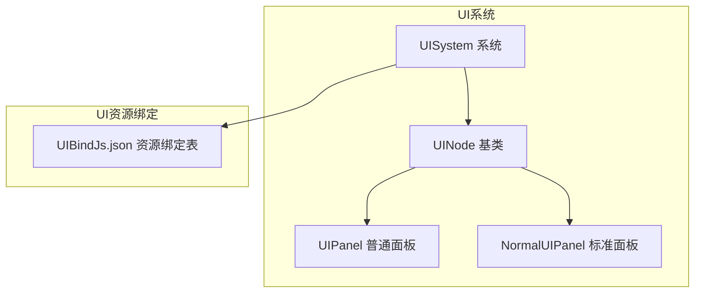
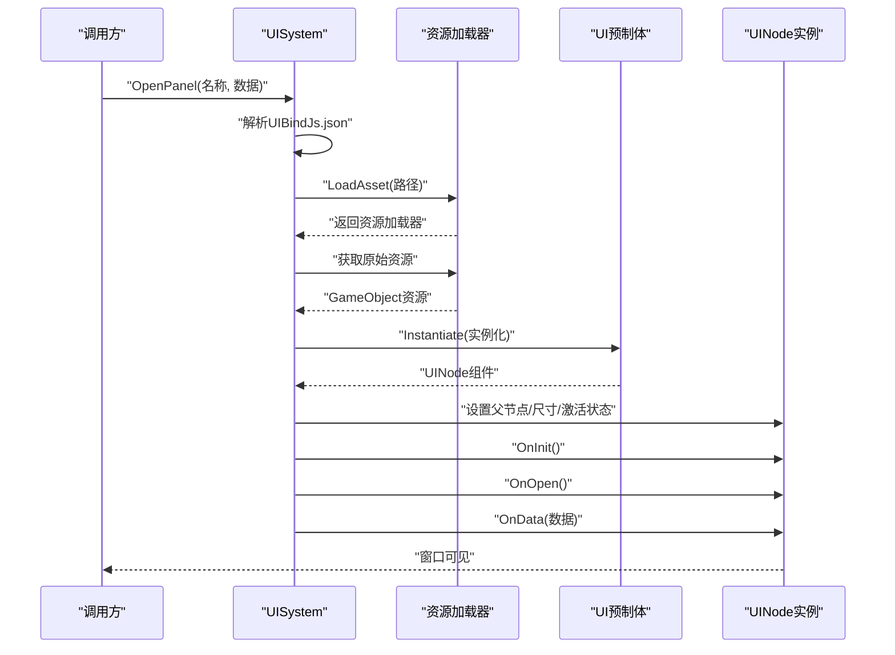
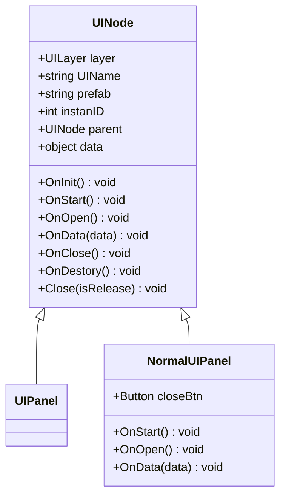
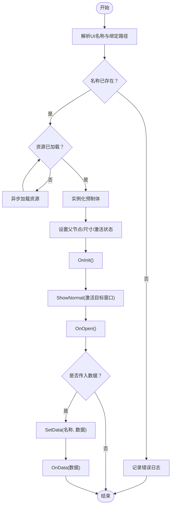
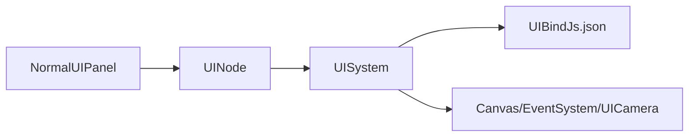

# 窗口界面系统

<cite>
**本文引用的文件**
- [UINode.cs](file://Assets/Scripts/UI/UINode.cs)
- [UIPanel.cs](file://Assets/Scripts/UI/UIPanel.cs)
- [NormalUIPanel.cs](file://Assets/Scripts/UI/NormalUIPanel.cs)
- [UISystem.cs](file://Assets/Scripts/Systems/Implement/UISystem/UISystem.cs)
- [UIBindJs.json](file://Assets/Scripts/Modules/UI/UIBindJs.json)
</cite>

## 目录
1. [简介](#简介)
2. [项目结构](#项目结构)
3. [核心组件](#核心组件)
4. [架构总览](#架构总览)
5. [详细组件分析](#详细组件分析)
6. [依赖关系分析](#依赖关系分析)
7. [性能考虑](#性能考虑)
8. [故障排查指南](#故障排查指南)
9. [结论](#结论)
10. [附录](#附录)

## 简介
本文件面向ProjectR项目的窗口界面系统，系统性阐述UI窗口的架构设计与实现原理，涵盖窗口层级管理、模态与非模态窗口的差异、不同窗口类型（如设置窗口、结算窗口）的特殊处理、打开/关闭动画与遮罩效果、事件拦截机制、布局规范与样式定制、响应式设计，以及扩展与自定义窗口类型的实现指南。文档以代码为依据，结合可视化图示帮助读者快速理解并高效使用该系统。

## 项目结构
ProjectR的UI系统采用“节点驱动 + 分层容器”的组织方式：所有UI窗口均继承统一的UINode基类，通过UISystem进行生命周期管理与层级渲染；UI资源由UIBindJs.json进行声明式绑定，运行时按需加载与实例化。

图表来源
- [UINode.cs:1-107](file://Assets/Scripts/UI/UINode.cs#L1-L107)
- [UIPanel.cs:1-8](file://Assets/Scripts/UI/UIPanel.cs#L1-L8)
- [NormalUIPanel.cs:1-34](file://Assets/Scripts/UI/NormalUIPanel.cs#L1-L34)
- [UISystem.cs:1-280](file://Assets/Scripts/Systems/Implement/UISystem/UISystem.cs#L1-L280)
- [UIBindJs.json](file://Assets/Scripts/Modules/UI/UIBindJs.json)

章节来源
- [UINode.cs:1-107](file://Assets/Scripts/UI/UINode.cs#L1-L107)
- [UISystem.cs:1-280](file://Assets/Scripts/Systems/Implement/UISystem/UISystem.cs#L1-L280)

## 核心组件
- UINode：所有UI窗口的抽象基类，定义窗口的生命周期回调（OnInit、OnStart、OnOpen、OnData、OnClose、OnDestory）、关闭接口、层级与命名等基础能力。
- UIPanel：UINode的普通面板派生类，作为默认实现存在。
- NormalUIPanel：继承UINode的标准面板示例，演示如何在OnStart中注册关闭按钮事件并处理OnData数据。
- UISystem：UI系统核心，负责Canvas与EventSystem初始化、分层根节点生成、UI资源加载与实例化、窗口显示/隐藏/销毁、数据传递等。
- UIBindJs.json：UI资源绑定配置，声明每个UI名称对应的预制体路径，供UISystem在运行时加载。

章节来源
- [UINode.cs:1-107](file://Assets/Scripts/UI/UINode.cs#L1-L107)
- [UIPanel.cs:1-8](file://Assets/Scripts/UI/UIPanel.cs#L1-L8)
- [NormalUIPanel.cs:1-34](file://Assets/Scripts/UI/NormalUIPanel.cs#L1-L34)
- [UISystem.cs:1-280](file://Assets/Scripts/Systems/Implement/UISystem/UISystem.cs#L1-L280)
- [UIBindJs.json](file://Assets/Scripts/Modules/UI/UIBindJs.json)

## 架构总览
下图展示了从调用到渲染的关键流程：调用OpenPanel后，UISystem根据UIBindJs.json解析资源路径，异步加载预制体并实例化为UINode，随后将其挂载至对应层级根节点，最后触发OnOpen与OnData回调。

图表来源
- [UISystem.cs:161-246](file://Assets/Scripts/Systems/Implement/UISystem/UISystem.cs#L161-L246)
- [UINode.cs:25-55](file://Assets/Scripts/UI/UINode.cs#L25-L55)

章节来源
- [UISystem.cs:161-246](file://Assets/Scripts/Systems/Implement/UISystem/UISystem.cs#L161-L246)
- [UINode.cs:25-55](file://Assets/Scripts/UI/UINode.cs#L25-L55)

## 详细组件分析

### 组件A：UINode（窗口基类）
- 角色定位：所有UI窗口的抽象基类，统一生命周期与行为契约。
- 关键职责：
  - 生命周期：OnInit、OnStart、OnOpen、OnData、OnClose、OnDestory。
  - 关闭接口：Close(isRelease)，委托给UISystem执行。
  - 属性：layer（层级）、UIName（唯一标识）、prefab（资源名）、instanID（实例ID）、parent（父节点）、data（传入数据）。
- 设计要点：
  - OnStart中默认重置RectTransform本地位置，确保窗口在各层级根节点下对齐。
  - OnData支持接收UINode或UINodeData等对象，便于父子窗口间的数据传递。

图表来源
- [UINode.cs:1-107](file://Assets/Scripts/UI/UINode.cs#L1-L107)
- [UIPanel.cs:1-8](file://Assets/Scripts/UI/UIPanel.cs#L1-L8)
- [NormalUIPanel.cs:1-34](file://Assets/Scripts/UI/NormalUIPanel.cs#L1-L34)

章节来源
- [UINode.cs:1-107](file://Assets/Scripts/UI/UINode.cs#L1-L107)
- [UIPanel.cs:1-8](file://Assets/Scripts/UI/UIPanel.cs#L1-L8)
- [NormalUIPanel.cs:1-34](file://Assets/Scripts/UI/NormalUIPanel.cs#L1-L34)

### 组件B：UISystem（窗口系统核心）
- 角色定位：UI系统总控，负责Canvas、EventSystem、UICamera初始化，分层根节点生成，UI加载与实例化，窗口显示/隐藏/销毁，数据分发。
- 关键职责：
  - 初始化：CreateRoot、CreateEventSystem、CreateUICamera、TestEntrance。
  - 分层管理：Main（全屏）、Game（游戏中）、Top（弹窗）、MessageTop（最顶级）四层，按z轴深度区分前后。
  - 打开窗口：OpenPanel（根据UI名称解析路径并加载），ShowNormal（同一层内仅激活目标窗口）。
  - 关闭窗口：Close（可选择释放实例或仅隐藏）。
  - 数据传递：SetData（向指定名称的窗口推送数据并触发OnData）。
- 性能与稳定性：
  - 使用协程异步加载资源，避免阻塞主线程。
  - 通过字典索引（按层级、按名称）快速定位与管理窗口实例。
  - 对不存在的UI名称与资源加载失败进行日志告警。

图表来源
- [UISystem.cs:161-246](file://Assets/Scripts/Systems/Implement/UISystem/UISystem.cs#L161-L246)
- [UISystem.cs:115-143](file://Assets/Scripts/Systems/Implement/UISystem/UISystem.cs#L115-L143)
- [UISystem.cs:252-264](file://Assets/Scripts/Systems/Implement/UISystem/UISystem.cs#L252-L264)

章节来源
- [UISystem.cs:1-280](file://Assets/Scripts/Systems/Implement/UISystem/UISystem.cs#L1-L280)

### 组件C：NormalUIPanel（标准面板示例）
- 角色定位：展示UINode的典型用法，示范关闭按钮绑定与数据处理。
- 关键行为：
  - OnStart中注册关闭按钮点击事件，调用Close(true)释放实例。
  - OnData中演示对字符串与UINodeData的处理逻辑。

章节来源
- [NormalUIPanel.cs:1-34](file://Assets/Scripts/UI/NormalUIPanel.cs#L1-L34)

### 组件D：UIBindJs.json（资源绑定）
- 角色定位：声明式UI资源绑定表，记录UI名称到预制体路径的映射。
- 作用：UISystem在OpenPanel时读取该表，决定加载哪个预制体并实例化为UINode。

章节来源
- [UIBindJs.json](file://Assets/Scripts/Modules/UI/UIBindJs.json)
- [UISystem.cs:266-277](file://Assets/Scripts/Systems/Implement/UISystem/UISystem.cs#L266-L277)

## 依赖关系分析
- UINode依赖UISystem进行关闭操作（Close委托）。
- UISystem依赖UIBindJs.json进行资源解析与加载。
- NormalUIPanel继承UINode，复用其生命周期与关闭机制。
- UISystem内部维护三层字典：按层级索引、按实例ID索引、按名称索引，确保窗口管理高内聚低耦合。

图表来源
- [UINode.cs:52-55](file://Assets/Scripts/UI/UINode.cs#L52-L55)
- [UISystem.cs:38-92](file://Assets/Scripts/Systems/Implement/UISystem/UISystem.cs#L38-L92)
- [UISystem.cs:161-246](file://Assets/Scripts/Systems/Implement/UISystem/UISystem.cs#L161-L246)

章节来源
- [UINode.cs:52-55](file://Assets/Scripts/UI/UINode.cs#L52-L55)
- [UISystem.cs:38-92](file://Assets/Scripts/Systems/Implement/UISystem/UISystem.cs#L38-L92)
- [UISystem.cs:161-246](file://Assets/Scripts/Systems/Implement/UISystem/UISystem.cs#L161-L246)

## 性能考虑
- 异步加载：通过协程加载资源，避免阻塞主线程，提升启动与切换流畅度。
- 实例复用：同一名称的UI若已存在，直接调用ShowNormal激活而非重复实例化，降低GC压力。
- 屏幕适配：窗口尺寸通过RectTransform锚点与屏幕宽高同步，保证多分辨率一致性。
- 渲染隔离：UICamera仅渲染UI层，减少无关渲染开销。

章节来源
- [UISystem.cs:183-196](file://Assets/Scripts/Systems/Implement/UISystem/UISystem.cs#L183-L196)
- [UISystem.cs:217-224](file://Assets/Scripts/Systems/Implement/UISystem/UISystem.cs#L217-L224)
- [UISystem.cs:73-92](file://Assets/Scripts/Systems/Implement/UISystem/UISystem.cs#L73-L92)

## 故障排查指南
- 打不开指定名称的窗口
  - 检查UIBindJs.json中是否存在该名称的条目。
  - 若存在但无法加载，确认资源路径正确且资源可用。
- 窗口不显示或层级异常
  - 确认UINode.layer与UISystem分层一致，且实例已挂载至对应根节点。
  - 检查ShowNormal逻辑是否正确激活目标窗口并置顶。
- 关闭后内存未释放
  - 确认调用Close时isRelease参数为true，或在业务逻辑中主动调用释放。
- 数据未到达
  - 确认SetData的接收者名称与UIName一致，且OnData被正确触发。

章节来源
- [UISystem.cs:161-178](file://Assets/Scripts/Systems/Implement/UISystem/UISystem.cs#L161-L178)
- [UISystem.cs:252-264](file://Assets/Scripts/Systems/Implement/UISystem/UISystem.cs#L252-L264)
- [UINode.cs:52-55](file://Assets/Scripts/UI/UINode.cs#L52-L55)

## 结论
ProjectR的窗口界面系统以UINode为核心抽象，通过UISystem实现资源绑定、异步加载、层级管理与生命周期控制。NormalUIPanel提供了标准窗口的参考实现。系统具备良好的扩展性：新增窗口类型只需继承UINode并按需覆盖生命周期方法，再在UIBindJs.json中注册即可。对于设置窗口、结算窗口等特殊场景，可在OnOpen/OnData中加入特定逻辑，满足差异化需求。

## 附录

### 窗口层级与Z轴深度
- Main：全屏界面（z=-0）
- Game：游戏中界面（z=-200）
- Top：弹窗（z=-600）
- MessageTop：最顶级（z=-900）

章节来源
- [UISystem.cs:14-20](file://Assets/Scripts/Systems/Implement/UISystem/UISystem.cs#L14-L20)
- [UISystem.cs:97-102](file://Assets/Scripts/Systems/Implement/UISystem/UISystem.cs#L97-L102)

### 模态与非模态窗口
- 当前实现未显式区分模态/非模态。建议通过以下方式扩展：
  - 在UISystem中引入遮罩层（GraphicRaycaster禁用底层交互），在打开Top层窗口时启用，关闭时移除。
  - 通过层级顺序与事件系统控制焦点，确保模态窗口期间仅接收输入。
- 本节为概念性指导，不直接对应具体代码文件。

### 动画与遮罩
- 打开/关闭动画：可在UINode的OnOpen/OnClose中接入动画播放逻辑（如位移动画、缩放淡入淡出）。
- 遮罩效果：建议在Top层窗口打开时插入半透明遮罩，关闭时移除。
- 事件拦截：通过EventSystem与GraphicRaycaster配合，确保遮罩区域阻止底层UI交互。
- 本节为概念性指导，不直接对应具体代码文件。

### 布局规范与样式定制
- 布局规范：窗口尺寸通过RectTransform锚点与屏幕宽高保持一致，确保在不同分辨率下对齐。
- 样式定制：通过UI预制体中的CanvasScaler与锚点设置，结合UI资源包统一风格。
- 响应式设计：利用RectTransform的锚点与尺寸约束，适配不同屏幕比例。
  
章节来源
- [UISystem.cs:217-224](file://Assets/Scripts/Systems/Implement/UISystem/UISystem.cs#L217-L224)
- [UINode.cs:29-32](file://Assets/Scripts/UI/UINode.cs#L29-L32)

### 扩展与自定义窗口类型
- 新增窗口步骤：
  1) 创建继承UINode的新类，按需覆盖OnInit/OnOpen/OnData/OnClose。
  2) 在UIBindJs.json中添加新UI名称与预制体路径。
  3) 通过UISystem.OpenPanel("名称", 数据)打开窗口。
- 特殊处理：
  - 设置窗口：在OnOpen中读取配置并回填UI；在OnClose中持久化变更。
  - 结算窗口：在OnOpen中汇总数据并在OnClose中触发后续流程（如进入下一阶段）。
- 本节为实践指南，不直接对应具体代码文件。