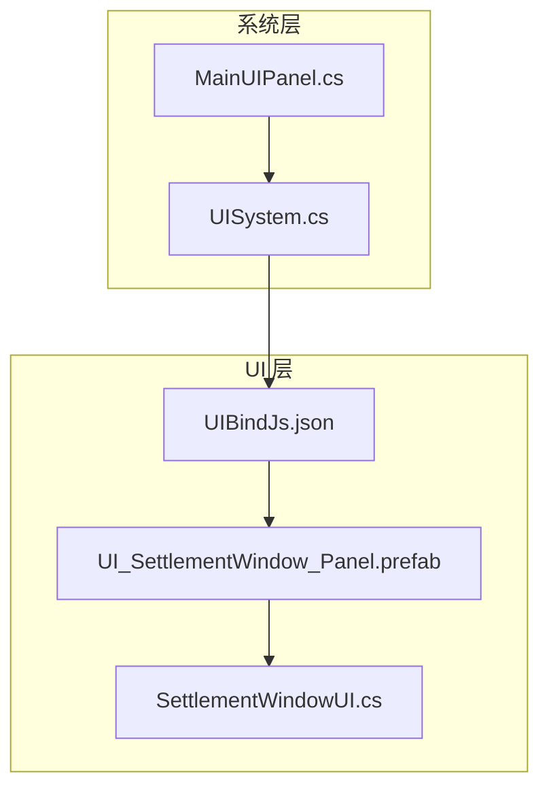
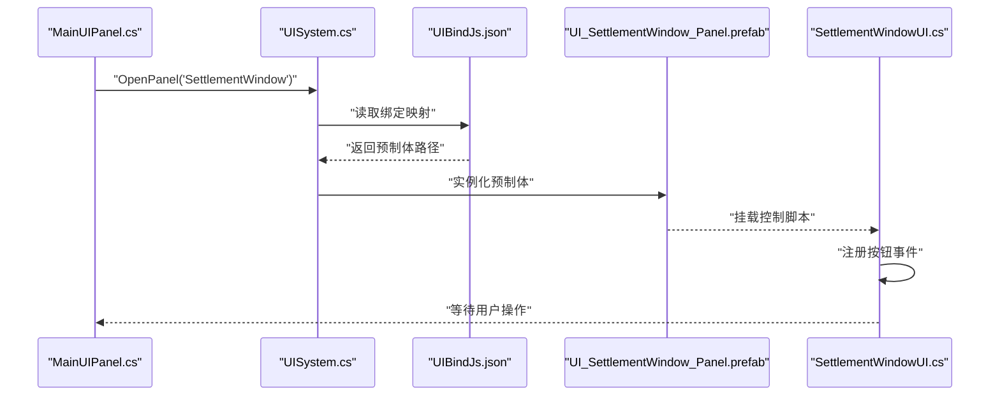
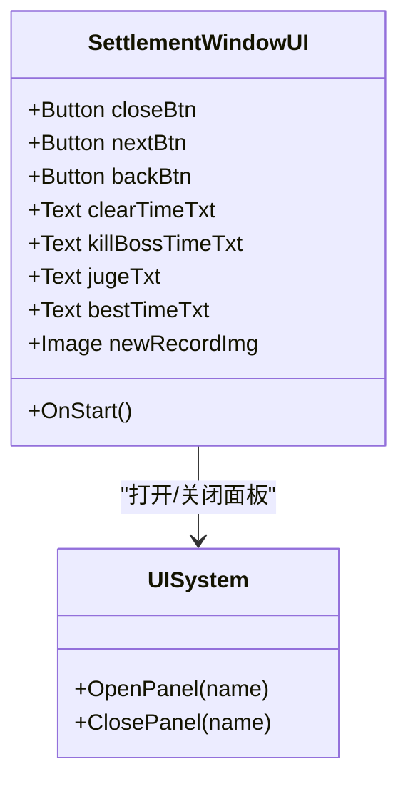
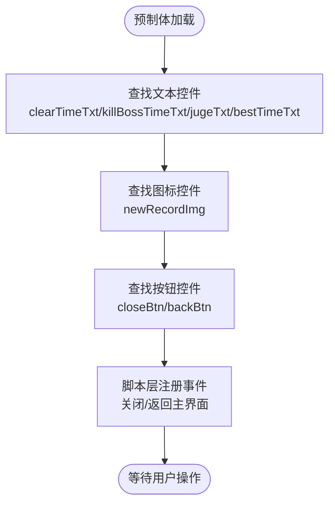
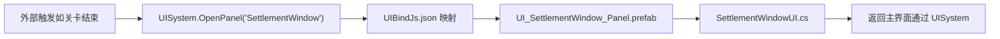

# 结算窗口

<cite>
**本文引用的文件**
- [SettlementWindowUI.cs](file://Assets/Scripts/UI/Window/SettlementWindowUI.cs)
- [UI_SettlementWindow_Panel.prefab](file://Assets/Art/UI/Prefabs/WindowUI/SettlementWindow/UI_SettlementWindow_Panel.prefab)
- [UISystem.cs](file://Assets/Scripts/Systems/Implement/UISystem/UISystem.cs)
- [UIBindJs.json](file://Assets/Scripts/UI/UIBindJs.json)
- [MainUIPanel.cs](file://Assets/Scripts/UI/MainUI/MainUIPanel.cs)
</cite>

## 目录
1. [简介](#简介)
2. [项目结构](#项目结构)
3. [核心组件](#核心组件)
4. [架构总览](#架构总览)
5. [详细组件分析](#详细组件分析)
6. [依赖关系分析](#依赖关系分析)
7. [性能考量](#性能考量)
8. [故障排查指南](#故障排查指南)
9. [结论](#结论)
10. [附录](#附录)

## 简介
本文件围绕 ProjectR 项目的“结算窗口”进行系统化说明，目标是帮助开发者与策划理解结算窗口在游戏中的作用、触发时机、数据展示逻辑、动画与交互流程，并提供定制化扩展的方法。根据现有代码与资源，结算窗口用于关卡完成后展示时间、评级、最佳纪录等信息，并提供关闭与返回主界面的操作入口。

## 项目结构
结算窗口涉及以下关键文件：
- UI 控制脚本：SettlementWindowUI.cs
- UI 预制体：UI_SettlementWindow_Panel.prefab
- UI 系统：UISystem.cs（负责面板打开/关闭与层级管理）
- UI 绑定配置：UIBindJs.json（声明 SettlementWindow 的预制体映射）
- 主界面入口：MainUIPanel.cs（演示如何通过 UISystem 打开面板）



**图表来源**
- [SettlementWindowUI.cs:1-24](file://Assets/Scripts/UI/Window/SettlementWindowUI.cs#L1-L24)
- [UI_SettlementWindow_Panel.prefab:408-432](file://Assets/Art/UI/Prefabs/WindowUI/SettlementWindow/UI_SettlementWindow_Panel.prefab#L408-L432)
- [UISystem.cs](file://Assets/Scripts/Systems/Implement/UISystem/UISystem.cs)
- [UIBindJs.json:27-30](file://Assets/Scripts/UI/UIBindJs.json#L27-L30)
- [MainUIPanel.cs:14-30](file://Assets/Scripts/UI/MainUI/MainUIPanel.cs#L14-L30)

**章节来源**
- [SettlementWindowUI.cs:1-24](file://Assets/Scripts/UI/Window/SettlementWindowUI.cs#L1-L24)
- [UI_SettlementWindow_Panel.prefab:408-432](file://Assets/Art/UI/Prefabs/WindowUI/SettlementWindow/UI_SettlementWindow_Panel.prefab#L408-L432)
- [UISystem.cs](file://Assets/Scripts/Systems/Implement/UISystem/UISystem.cs)
- [UIBindJs.json:27-30](file://Assets/Scripts/UI/UIBindJs.json#L27-L30)
- [MainUIPanel.cs:14-30](file://Assets/Scripts/UI/MainUI/MainUIPanel.cs#L14-L30)

## 核心组件
- SettlementWindowUI.cs
  - 定义结算窗口的 UI 控件引用（关闭按钮、返回按钮、文本标签等）
  - 初始化事件绑定：关闭按钮点击关闭窗口；返回按钮打开主界面
- UI_SettlementWindow_Panel.prefab
  - 包含背景、文字、图标等元素的 UI 布局
  - 通过 MonoBehaviour 组件声明 UI 名称、层级与预制体路径
- UISystem.cs
  - 提供 OpenPanel 等接口，负责面板实例化与层级管理
- UIBindJs.json
  - 将 UI 名称映射到具体预制体路径
- MainUIPanel.cs
  - 演示如何通过 UISystem 打开面板（例如关卡结束后触发）

**章节来源**
- [SettlementWindowUI.cs:6-21](file://Assets/Scripts/UI/Window/SettlementWindowUI.cs#L6-L21)
- [UI_SettlementWindow_Panel.prefab:408-432](file://Assets/Art/UI/Prefabs/WindowUI/SettlementWindow/UI_SettlementWindow_Panel.prefab#L408-L432)
- [UISystem.cs](file://Assets/Scripts/Systems/Implement/UISystem/UISystem.cs)
- [UIBindJs.json:27-30](file://Assets/Scripts/UI/UIBindJs.json#L27-L30)
- [MainUIPanel.cs:14-30](file://Assets/Scripts/UI/MainUI/MainUIPanel.cs#L14-L30)

## 架构总览
结算窗口的调用链路如下：主界面或其他触发点调用 UISystem 打开 SettlementWindow，UISystem 根据 UIBindJs.json 中的映射加载 UI_SettlementWindow_Panel.prefab，实例化后由 SettlementWindowUI.cs 负责事件绑定与交互。



**图表来源**
- [MainUIPanel.cs:17-21](file://Assets/Scripts/UI/MainUI/MainUIPanel.cs#L17-L21)
- [UISystem.cs](file://Assets/Scripts/Systems/Implement/UISystem/UISystem.cs)
- [UIBindJs.json:27-30](file://Assets/Scripts/UI/UIBindJs.json#L27-L30)
- [UI_SettlementWindow_Panel.prefab:408-432](file://Assets/Art/UI/Prefabs/WindowUI/SettlementWindow/UI_SettlementWindow_Panel.prefab#L408-L432)
- [SettlementWindowUI.cs:16-21](file://Assets/Scripts/UI/Window/SettlementWindowUI.cs#L16-L21)

## 详细组件分析

### SettlementWindowUI.cs
- 职责
  - 持有 UI 控件引用（关闭按钮、返回按钮、文本标签等）
  - 在启动时注册按钮点击事件：关闭窗口、返回主界面
- 数据展示字段
  - clearTimeTxt：清理用时
  - killBossTimeTxt：击杀 Boss 用时
  - jugeTxt：评级
  - bestTimeTxt：最佳纪录
  - newRecordImg：新纪录图标（显示/隐藏）
- 交互行为
  - 关闭按钮：调用 Close() 关闭当前窗口
  - 返回按钮：通过 UISystem 打开主界面



**图表来源**
- [SettlementWindowUI.cs:6-21](file://Assets/Scripts/UI/Window/SettlementWindowUI.cs#L6-L21)
- [UISystem.cs](file://Assets/Scripts/Systems/Implement/UISystem/UISystem.cs)

**章节来源**
- [SettlementWindowUI.cs:6-21](file://Assets/Scripts/UI/Window/SettlementWindowUI.cs#L6-L21)

### UI_SettlementWindow_Panel.prefab
- 层级与命名
  - UI 名称为 SettlementWindow
  - 预制体路径在绑定配置中声明
  - 内含多个子节点（如背景、文字、图标、按钮等）
- 控件定位
  - clearTimeTxt、killBossTimeTxt、jugeTxt、bestTimeTxt 等文本控件均在预制体中定义
  - newRecordImg 作为新纪录提示图标存在
- 交互绑定
  - 预制体中包含按钮的点击回调（如 backBtn），但实际事件处理由脚本层负责



**图表来源**
- [UI_SettlementWindow_Panel.prefab:408-432](file://Assets/Art/UI/Prefabs/WindowUI/SettlementWindow/UI_SettlementWindow_Panel.prefab#L408-L432)
- [SettlementWindowUI.cs:10-15](file://Assets/Scripts/UI/Window/SettlementWindowUI.cs#L10-L15)

**章节来源**
- [UI_SettlementWindow_Panel.prefab:408-432](file://Assets/Art/UI/Prefabs/WindowUI/SettlementWindow/UI_SettlementWindow_Panel.prefab#L408-L432)
- [SettlementWindowUI.cs:10-15](file://Assets/Scripts/UI/Window/SettlementWindowUI.cs#L10-L15)

### UISystem.cs
- 职责
  - 提供 OpenPanel/ClosePanel 等统一接口
  - 依据绑定配置加载指定 UI 面板
- 与结算窗口的关系
  - SettlementWindow 的打开由外部触发（如 MainUI 或关卡管理器），通过 UISystem.OpenPanel("SettlementWindow") 实现
  - 面板层级与关闭策略由 UISystem 统一管理

**章节来源**
- [UISystem.cs](file://Assets/Scripts/Systems/Implement/UISystem/UISystem.cs)

### UIBindJs.json
- 职责
  - 将 UI 名称（如 SettlementWindow）映射到具体预制体路径
- 与结算窗口的关系
  - SettlementWindow 的 prefab 字段指向 UI_SettlementWindow_Panel.prefab
  - UISystem 通过该映射完成实例化

**章节来源**
- [UIBindJs.json:27-30](file://Assets/Scripts/UI/UIBindJs.json#L27-L30)

### MainUIPanel.cs
- 职责
  - 提供主界面入口，演示如何通过 UISystem 打开面板
- 与结算窗口的关系
  - 作为典型调用方，展示如何打开面板（例如关卡结束后可在此处触发结算窗口）

**章节来源**
- [MainUIPanel.cs:14-30](file://Assets/Scripts/UI/MainUI/MainUIPanel.cs#L14-L30)

## 依赖关系分析
- 外部触发 → UISystem.OpenPanel("SettlementWindow")
- UISystem → UIBindJs.json → UI_SettlementWindow_Panel.prefab
- UI_SettlementWindow_Panel.prefab → SettlementWindowUI.cs
- SettlementWindowUI.cs → UISystem（返回主界面）



**图表来源**
- [MainUIPanel.cs:17-21](file://Assets/Scripts/UI/MainUI/MainUIPanel.cs#L17-L21)
- [UISystem.cs](file://Assets/Scripts/Systems/Implement/UISystem/UISystem.cs)
- [UIBindJs.json:27-30](file://Assets/Scripts/UI/UIBindJs.json#L27-L30)
- [UI_SettlementWindow_Panel.prefab:408-432](file://Assets/Art/UI/Prefabs/WindowUI/SettlementWindow/UI_SettlementWindow_Panel.prefab#L408-L432)
- [SettlementWindowUI.cs:18-20](file://Assets/Scripts/UI/Window/SettlementWindowUI.cs#L18-L20)

**章节来源**
- [MainUIPanel.cs:17-21](file://Assets/Scripts/UI/MainUI/MainUIPanel.cs#L17-L21)
- [UISystem.cs](file://Assets/Scripts/Systems/Implement/UISystem/UISystem.cs)
- [UIBindJs.json:27-30](file://Assets/Scripts/UI/UIBindJs.json#L27-L30)
- [UI_SettlementWindow_Panel.prefab:408-432](file://Assets/Art/UI/Prefabs/WindowUI/SettlementWindow/UI_SettlementWindow_Panel.prefab#L408-L432)
- [SettlementWindowUI.cs:18-20](file://Assets/Scripts/UI/Window/SettlementWindowUI.cs#L18-L20)

## 性能考量
- 面板生命周期
  - 通过 UISystem 统一管理打开/关闭，避免重复实例化与资源泄漏
- 文本与图标更新
  - 仅在结算时更新 clearTimeTxt、killBossTimeTxt、jugeTxt、bestTimeTxt、newRecordImg 等控件，减少不必要的 UI 刷新
- 动画与过渡
  - 若后续引入动画，建议在预制体或脚本层使用协程/缓动，避免帧抖动

## 故障排查指南
- 打不开结算窗口
  - 检查 UIBindJs.json 中是否存在 "SettlementWindow" 的映射项
  - 确认 UISystem 是否正确调用 OpenPanel
- 控件无响应
  - 检查 SettlementWindowUI.cs 是否在 OnStart 中注册了按钮事件
  - 确认预制体中的按钮与脚本控件引用已正确挂载
- 文本未显示
  - 确认 clearTimeTxt、killBossTimeTxt、jugeTxt、bestTimeTxt 是否被赋值
  - 检查 newRecordImg 的显示逻辑（是否需要在新纪录时显式激活）

**章节来源**
- [UIBindJs.json:27-30](file://Assets/Scripts/UI/UIBindJs.json#L27-L30)
- [UISystem.cs](file://Assets/Scripts/Systems/Implement/UISystem/UISystem.cs)
- [SettlementWindowUI.cs:16-21](file://Assets/Scripts/UI/Window/SettlementWindowUI.cs#L16-L21)
- [UI_SettlementWindow_Panel.prefab:408-432](file://Assets/Art/UI/Prefabs/WindowUI/SettlementWindow/UI_SettlementWindow_Panel.prefab#L408-L432)

## 结论
结算窗口在 ProjectR 中承担关卡完成后的结果展示职责，通过 UISystem 与 UIBindJs.json 实现解耦的面板加载与管理。当前脚本层提供了基本的控件引用与交互绑定，预制体承载了界面布局与视觉元素。后续可在脚本层扩展数据填充逻辑与动画效果，并通过配置文件与脚本层实现灵活的定制化。

## 附录

### 触发时机与流程建议
- 关卡完成条件
  - 可在关卡管理器中检测胜利/失败条件，满足后触发结算窗口打开
- 流程示意
  ```mermaid
flowchart TD
A["进入关卡"] --> B["进行游戏"]
B --> C{"关卡完成？"}
C --> |是| D["收集结算数据<br/>用时/评级/最佳纪录"]
D --> E["调用 UISystem.OpenPanel('SettlementWindow')"]
E --> F["SettlementWindowUI 更新控件"]
F --> G{"是否新纪录？"}
G --> |是| H["显示 newRecordImg"]
G --> |否| I["保持原状"]
H --> J["等待用户操作"]
I --> J
C --> |否| B
```

### 数据展示逻辑扩展点
- 积分计算
  - 可在结算时根据用时、评级等参数计算分数，并写入 UI 文本
- 道具奖励
  - 可在结算后发放奖励道具，UI 展示奖励列表
- 成就解锁
  - 可在结算时检查达成条件并更新成就状态与 UI 提示

### 动画与交互建议
- 动画
  - 使用预制体的 CanvasGroup 或动画控制器实现淡入/缩放等效果
- 交互
  - 增加“下一关”按钮（nextBtn）并在脚本中注册事件
  - 支持键盘/手柄输入快速关闭或返回

### 定制化方法
- 新增结算条件
  - 在关卡管理器中扩展判定逻辑，满足条件后调用 OpenPanel
- 自定义奖励内容
  - 在 SettlementWindowUI 中增加奖励列表控件，并在结算时填充
- 界面样式修改
  - 通过修改 UI_SettlementWindow_Panel.prefab 的图片与排版，或在脚本层动态切换主题

**章节来源**
- [SettlementWindowUI.cs:6-21](file://Assets/Scripts/UI/Window/SettlementWindowUI.cs#L6-L21)
- [UI_SettlementWindow_Panel.prefab:408-432](file://Assets/Art/UI/Prefabs/WindowUI/SettlementWindow/UI_SettlementWindow_Panel.prefab#L408-L432)
- [UISystem.cs](file://Assets/Scripts/Systems/Implement/UISystem/UISystem.cs)
- [UIBindJs.json:27-30](file://Assets/Scripts/UI/UIBindJs.json#L27-L30)
- [MainUIPanel.cs:14-30](file://Assets/Scripts/UI/MainUI/MainUIPanel.cs#L14-L30)