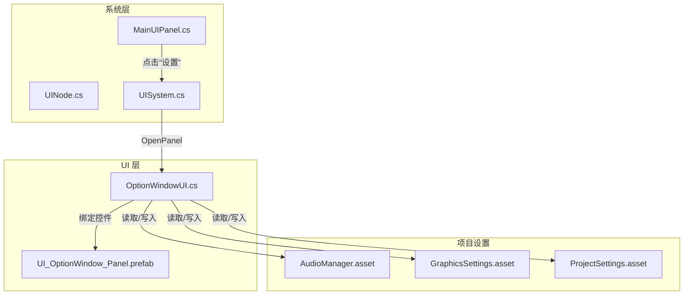
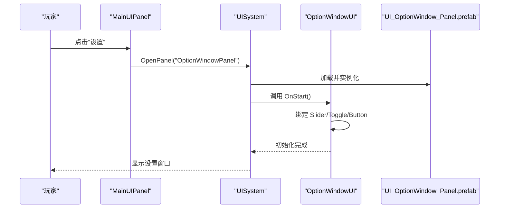
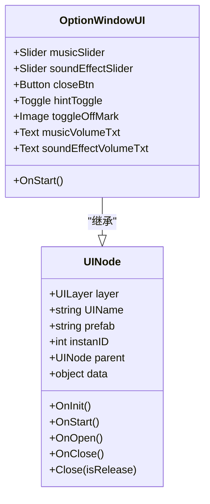
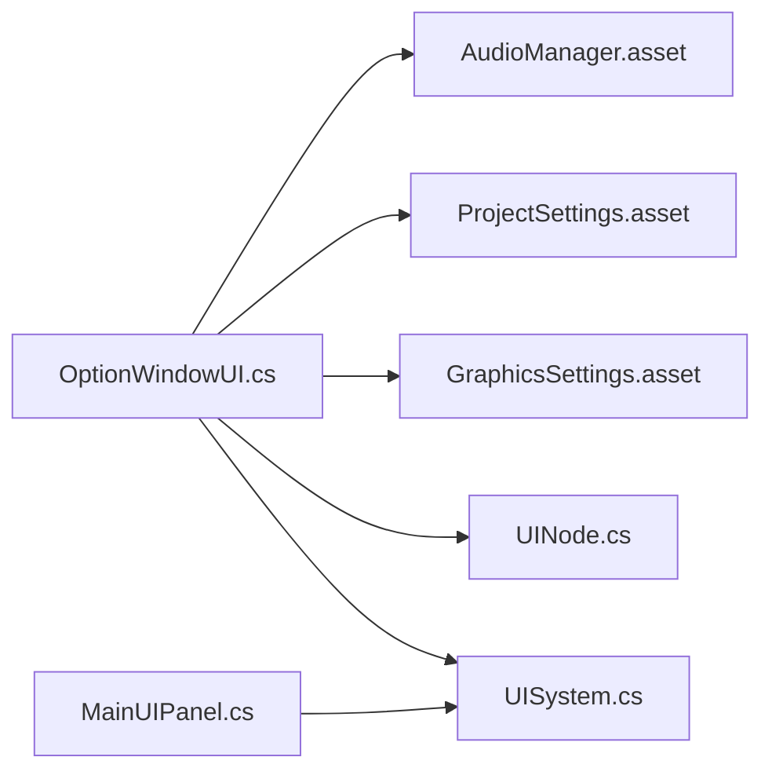

# 设置窗口

<cite>
**本文引用的文件**
- [OptionWindowUI.cs](file://Assets/Scripts/UI/Window/OptionWindowUI.cs)
- [UI_OptionWindow_Panel.prefab](file://Assets/Art/UI/Prefabs/WindowUI/OptionWindow/UI_OptionWindow_Panel.prefab)
- [UINode.cs](file://Assets/Scripts/UI/UINode.cs)
- [UISystem.cs](file://Assets/Scripts/Systems/Implement/UISystem/UISystem.cs)
- [MainUIPanel.cs](file://Assets/Scripts/UI/MainUI/MainUIPanel.cs)
- [AudioManager.asset](file://ProjectSettings/AudioManager.asset)
- [GraphicsSettings.asset](file://ProjectSettings/GraphicsSettings.asset)
- [ProjectSettings.asset](file://ProjectSettings/ProjectSettings.asset)
</cite>

## 目录
1. [简介](#简介)
2. [项目结构](#项目结构)
3. [核心组件](#核心组件)
4. [架构总览](#架构总览)
5. [详细组件分析](#详细组件分析)
6. [依赖关系分析](#依赖关系分析)
7. [性能考虑](#性能考虑)
8. [故障排查指南](#故障排查指南)
9. [结论](#结论)
10. [附录：扩展与最佳实践](#附录扩展与最佳实践)

## 简介
本文件面向 ProjectR 的“设置窗口”（OptionWindow）功能，系统性阐述其 UI 布局、控件绑定机制、数据持久化策略、设置变更的实时生效方式以及可扩展性方案。当前实现聚焦于音量调节（音乐与音效）、提示开关等基础配置项；同时给出新增配置项与自定义设置面板的实施步骤与用户体验设计建议。

## 项目结构
设置窗口位于 UI 子系统中，采用统一的 UINode 生命周期管理与 UISystem 面板打开/关闭流程。主要涉及以下模块：
- UI 层：OptionWindowUI 脚本负责绑定与事件处理
- 资源层：UI_OptionWindow_Panel.prefab 定义控件与层级关系
- 系统层：UINode 提供生命周期钩子；UISystem 负责实例化、显示与隐藏
- 主菜单入口：MainUIPanel 将“设置”按钮与 OptionWindow 关联

图表来源
- [OptionWindowUI.cs:1-29](file://Assets/Scripts/UI/Window/OptionWindowUI.cs#L1-L29)
- [UI_OptionWindow_Panel.prefab:416-456](file://Assets/Art/UI/Prefabs/WindowUI/OptionWindow/UI_OptionWindow_Panel.prefab#L416-L456)
- [UINode.cs:1-59](file://Assets/Scripts/UI/UINode.cs#L1-L59)
- [UISystem.cs:161-175](file://Assets/Scripts/Systems/Implement/UISystem/UISystem.cs#L161-L175)
- [MainUIPanel.cs:22-25](file://Assets/Scripts/UI/MainUI/MainUIPanel.cs#L22-L25)
- [AudioManager.asset:1-19](file://ProjectSettings/AudioManager.asset#L1-L19)
- [GraphicsSettings.asset:1-37](file://ProjectSettings/GraphicsSettings.asset#L1-L37)
- [ProjectSettings.asset:45-89](file://ProjectSettings/ProjectSettings.asset#L45-L89)

章节来源
- [OptionWindowUI.cs:1-29](file://Assets/Scripts/UI/Window/OptionWindowUI.cs#L1-L29)
- [UI_OptionWindow_Panel.prefab:416-456](file://Assets/Art/UI/Prefabs/WindowUI/OptionWindow/UI_OptionWindow_Panel.prefab#L416-L456)
- [UINode.cs:1-59](file://Assets/Scripts/UI/UINode.cs#L1-L59)
- [UISystem.cs:161-175](file://Assets/Scripts/Systems/Implement/UISystem/UISystem.cs#L161-L175)
- [MainUIPanel.cs:22-25](file://Assets/Scripts/UI/MainUI/MainUIPanel.cs#L22-L25)

## 核心组件
- OptionWindowUI：设置窗口的 UI 控制脚本，负责控件绑定、事件监听与文本显示更新。
- UI_OptionWindow_Panel.prefab：设置窗口的预制体，包含 Slider、Toggle、Button、Text 等控件及其层级关系。
- UINode：所有 UI 面板的基类，提供 OnInit、OnStart、OnOpen、OnClose、Close 等生命周期钩子。
- UISystem：统一的 UI 面板管理器，负责加载、显示、隐藏与销毁面板。
- MainUIPanel：主界面，将“设置”按钮与 OptionWindow 绑定，触发打开设置面板。

章节来源
- [OptionWindowUI.cs:5-26](file://Assets/Scripts/UI/Window/OptionWindowUI.cs#L5-L26)
- [UI_OptionWindow_Panel.prefab:416-456](file://Assets/Art/UI/Prefabs/WindowUI/OptionWindow/UI_OptionWindow_Panel.prefab#L416-L456)
- [UINode.cs:9-57](file://Assets/Scripts/UI/UINode.cs#L9-L57)
- [UISystem.cs:161-175](file://Assets/Scripts/Systems/Implement/UISystem/UISystem.cs#L161-L175)
- [MainUIPanel.cs:22-25](file://Assets/Scripts/UI/MainUI/MainUIPanel.cs#L22-L25)

## 架构总览
设置窗口遵循“资源驱动 + 事件驱动”的模式：
- 资源驱动：通过预制体 UI_OptionWindow_Panel.prefab 定义控件与层级，OptionWindowUI 在 OnStart 中完成控件绑定。
- 事件驱动：对 Slider、Toggle、Button 等控件注册回调，实现交互逻辑与状态更新。
- 生命周期：由 UISystem.OpenPanel 触发，UINode.OnOpen/OnClose 配合面板显示/隐藏。

图表来源
- [MainUIPanel.cs:22-25](file://Assets/Scripts/UI/MainUI/MainUIPanel.cs#L22-L25)
- [UISystem.cs:161-175](file://Assets/Scripts/Systems/Implement/UISystem/UISystem.cs#L161-L175)
- [OptionWindowUI.cs:14-24](file://Assets/Scripts/UI/Window/OptionWindowUI.cs#L14-L24)
- [UI_OptionWindow_Panel.prefab:416-456](file://Assets/Art/UI/Prefabs/WindowUI/OptionWindow/UI_OptionWindow_Panel.prefab#L416-L456)

## 详细组件分析

### OptionWindowUI：设置窗口脚本
职责与行为
- 控件绑定：在 OnStart 中获取 Slider、Button、Toggle、Image、Text 等组件引用。
- 事件绑定：为关闭按钮注册点击事件；为提示 Toggle 注册开关事件以控制遮罩显示；为两个 Slider 注册值变化事件以同步文本显示。
- 实时反馈：当滑动条值变化时，对应文本立即更新，提升交互感知。

图表来源
- [UINode.cs:9-57](file://Assets/Scripts/UI/UINode.cs#L9-L57)
- [OptionWindowUI.cs:5-26](file://Assets/Scripts/UI/Window/OptionWindowUI.cs#L5-L26)

章节来源
- [OptionWindowUI.cs:14-24](file://Assets/Scripts/UI/Window/OptionWindowUI.cs#L14-L24)

### UI_OptionWindow_Panel.prefab：设置窗口预制体
- 控件层级：包含音乐音量、音效音量对应的 Slider，提示开关 Toggle 及其遮罩 Image，以及关闭按钮 Button。
- 组件绑定：OptionWindowUI 通过该预制体中的组件引用完成绑定。

章节来源
- [UI_OptionWindow_Panel.prefab:416-456](file://Assets/Art/UI/Prefabs/WindowUI/OptionWindow/UI_OptionWindow_Panel.prefab#L416-L456)

### UINode 与 UISystem：生命周期与显示控制
- UINode：提供统一的生命周期钩子，OptionWindowUI 重写 OnStart 完成初始化；Close 方法委托 UISystem 执行隐藏或销毁。
- UISystem：OpenPanel 根据名称加载预制体并显示；Close 支持释放对象或仅隐藏。

章节来源
- [UINode.cs:21-55](file://Assets/Scripts/UI/UINode.cs#L21-L55)
- [UISystem.cs:161-175](file://Assets/Scripts/Systems/Implement/UISystem/UISystem.cs#L161-L175)

### 主菜单入口：MainUIPanel
- 将“设置”按钮与 OptionWindow 绑定，点击后调用 UISystem.OpenPanel("OptionWindowPanel") 打开设置窗口。

章节来源
- [MainUIPanel.cs:22-25](file://Assets/Scripts/UI/MainUI/MainUIPanel.cs#L22-L25)

## 依赖关系分析
设置窗口与项目设置的关系
- 音量相关：通过 ProjectSettings/AudioManager.asset 的音频参数进行全局音量控制，OptionWindowUI 通过 Slider 读取/写入这些参数以实现音量调节。
- 图形相关：ProjectSettings/GraphicsSettings.asset 与 ProjectSettings/ProjectSettings.asset 中的图形与屏幕相关设置，OptionWindow 可扩展用于画质/分辨率等配置。
- UI 系统：OptionWindowUI 依赖 UINode 生命周期与 UISystem 的面板管理。

图表来源
- [OptionWindowUI.cs:1-29](file://Assets/Scripts/UI/Window/OptionWindowUI.cs#L1-L29)
- [AudioManager.asset:1-19](file://ProjectSettings/AudioManager.asset#L1-L19)
- [GraphicsSettings.asset:1-37](file://ProjectSettings/GraphicsSettings.asset#L1-L37)
- [ProjectSettings.asset:45-89](file://ProjectSettings/ProjectSettings.asset#L45-L89)
- [UINode.cs:1-59](file://Assets/Scripts/UI/UINode.cs#L1-L59)
- [UISystem.cs:161-175](file://Assets/Scripts/Systems/Implement/UISystem/UISystem.cs#L161-L175)
- [MainUIPanel.cs:22-25](file://Assets/Scripts/UI/MainUI/MainUIPanel.cs#L22-L25)

## 性能考虑
- 事件回调频率：Slider 的 onValueChanged 回调会频繁触发，建议在 UI 层仅做文本更新等轻量操作；若需写入全局设置，应避免每帧写入，可采用节流/防抖策略或延迟提交。
- 面板复用：UISystem 对已加载的面板进行缓存与复用，减少重复实例化成本。
- 渲染与音频：音量调节直接影响音频系统，应避免在高频回调中直接调用昂贵的音频 API，优先通过项目设置参数间接影响。

## 故障排查指南
- 设置窗口无法打开
  - 检查 MainUIPanel 是否正确调用 OpenPanel("OptionWindowPanel")。
  - 确认 UISystem 中是否存在名为 "OptionWindowPanel" 的资源映射。
- 控件无响应
  - 确认 OptionWindowUI 的 OnStart 已执行且控件引用已赋值。
  - 检查 Prefab 中各组件是否正确挂载到 OptionWindowUI 的字段上。
- 音量调节无效
  - 确认 AudioManager.asset 的音量参数是否被正确读取/写入。
  - 若使用自定义音量系统，请确保 OptionWindowUI 与实际音量存储介质一致。

章节来源
- [MainUIPanel.cs:22-25](file://Assets/Scripts/UI/MainUI/MainUIPanel.cs#L22-L25)
- [UISystem.cs:161-175](file://Assets/Scripts/Systems/Implement/UISystem/UISystem.cs#L161-L175)
- [OptionWindowUI.cs:14-24](file://Assets/Scripts/UI/Window/OptionWindowUI.cs#L14-L24)
- [UI_OptionWindow_Panel.prefab:416-456](file://Assets/Art/UI/Prefabs/WindowUI/OptionWindow/UI_OptionWindow_Panel.prefab#L416-L456)
- [AudioManager.asset:1-19](file://ProjectSettings/AudioManager.asset#L1-L19)

## 结论
设置窗口当前实现了基础的音量调节与提示开关功能，采用资源驱动与事件驱动相结合的方式，具备良好的可扩展性。后续可在不破坏现有结构的前提下，按“扩展与最佳实践”章节的步骤新增配置项与自定义面板。

## 附录：扩展与最佳实践

### 新增配置项的添加步骤
- 设计配置项
  - 明确配置项类型（如 Slider、Toggle、Dropdown、InputField）与作用域（全局设置/场景设置）。
- 修改预制体
  - 在 UI_OptionWindow_Panel.prefab 中添加新控件并布置布局。
- 绑定脚本
  - 在 OptionWindowUI 中声明新控件字段并在 OnStart 中完成绑定。
- 事件处理
  - 为新控件注册回调，实现值变化时的实时反馈与持久化。
- 数据持久化
  - 若为全局设置，建议通过 ProjectSettings/*.asset 或 EditorPrefs 进行读写；若为运行时设置，可引入专门的配置单例进行序列化保存。
- 生效机制
  - 对于即时生效的设置（如音量），在回调中直接应用；对于需要重启/重载的设置，提供提示并延迟应用。

章节来源
- [OptionWindowUI.cs:14-24](file://Assets/Scripts/UI/Window/OptionWindowUI.cs#L14-L24)
- [UI_OptionWindow_Panel.prefab:416-456](file://Assets/Art/UI/Prefabs/WindowUI/OptionWindow/UI_OptionWindow_Panel.prefab#L416-L456)

### 自定义设置面板的实现指南
- 面板命名与资源映射
  - 为新面板创建独立的预制体与脚本，确保 UISystem 能根据名称加载。
- 生命周期与数据传递
  - 复用 UINode 的 OnData 钩子接收外部传入的数据，按需初始化面板状态。
- 事件与状态管理
  - 使用统一的事件注册与解绑策略，避免内存泄漏；对复杂状态使用状态机或观察者模式。
- 用户体验
  - 提供清晰的标签与提示信息；对关键设置提供默认值与恢复出厂设置选项；对高风险设置（如画质）提供警告提示。

章节来源
- [UINode.cs:33-55](file://Assets/Scripts/UI/UINode.cs#L33-L55)
- [UISystem.cs:161-175](file://Assets/Scripts/Systems/Implement/UISystem/UISystem.cs#L161-L175)

### 用户体验设计原则与最佳实践
- 即时反馈：滑动条变化时立即更新文本或预览，减少用户等待。
- 可逆与可恢复：提供“重置为默认”按钮；对重要设置提供确认对话框。
- 分组与层次：将相关设置分组展示，使用折叠面板或页签组织内容。
- 一致性：保持与其他面板一致的控件风格与交互行为。
- 可访问性：为键盘导航与屏幕阅读器提供支持（如焦点顺序、无障碍标签）。