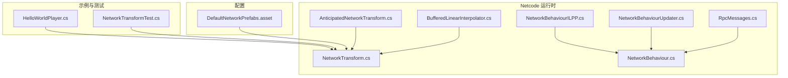
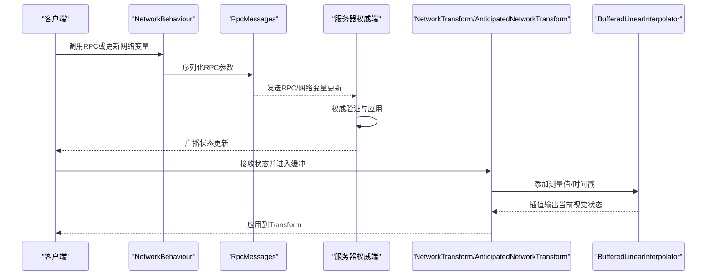
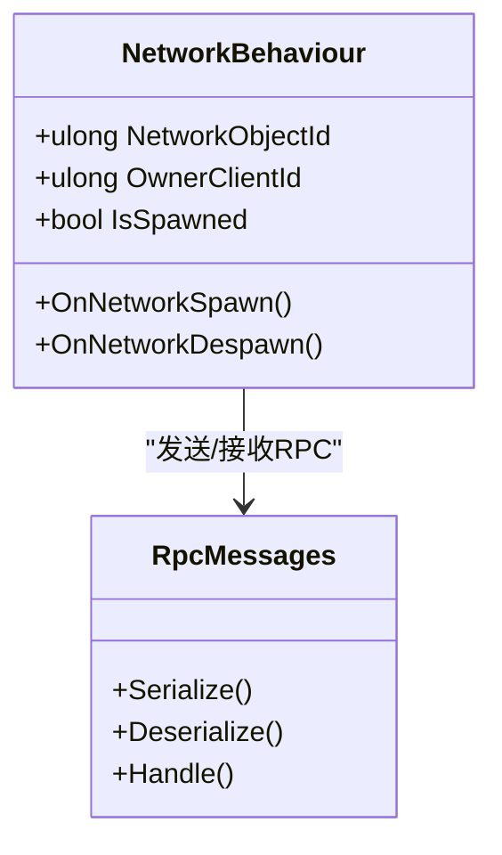
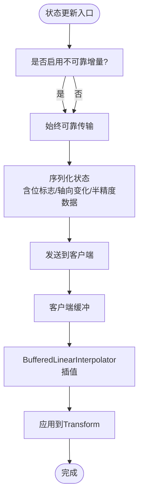
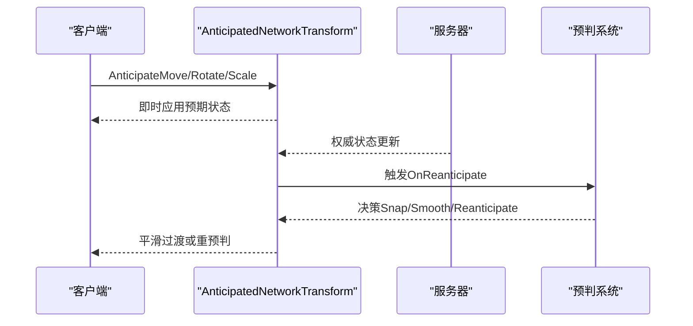
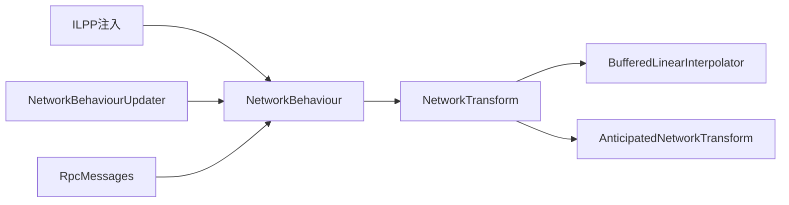

# 网络同步系统

<cite>
**本文引用的文件**   
- [NetworkTransform.cs](file://LocalPackages/com.unity.netcode.gameobjects@1.14.1/Components/NetworkTransform.cs)
- [AnticipatedNetworkTransform.cs](file://LocalPackages/com.unity.netcode.gameobjects@1.14.1/Components/AnticipatedNetworkTransform.cs)
- [BufferedLinearInterpolator.cs](file://LocalPackages/com.unity.netcode.gameobjects@1.14.1/Components/Interpolator/BufferedLinearInterpolator.cs)
- [NetworkBehaviourILPP.cs](file://LocalPackages/com.unity.netcode.gameobjects@1.14.1/Editor/CodeGen/NetworkBehaviourILPP.cs)
- [NetworkBehaviour.cs](file://LocalPackages/com.unity.netcode.gameobjects@1.14.1/Runtime/Core/NetworkBehaviour.cs)
- [NetworkBehaviourUpdater.cs](file://LocalPackages/com.unity.netcode.gameobjects@1.14.1/Runtime/Core/NetworkBehaviourUpdater.cs)
- [RpcMessages.cs](file://LocalPackages/com.unity.netcode.gameobjects@1.14.1/Runtime/Messaging/Messages/RpcMessages.cs)
- [networkvariable.md](file://LocalPackages/com.unity.netcode.gameobjects@1.14.1/Documentation~/basics/networkvariable.md)
- [client-anticipation.md](file://LocalPackages/com.unity.netcode.gameobjects@1.14.1/Documentation~/advanced-topics/client-anticipation.md)
- [networktransform.md](file://LocalPackages/com.unity.netcode.gameobjects@1.14.1/Documentation~/components/networktransform.md)
- [dealing-with-latency.md](file://LocalPackages/com.unity.netcode.gameobjects@1.14.1/Documentation~/learn/dealing-with-latency.md)
- [HelloWorldPlayer.cs](file://Assets/Dev/NetcodeTest/Scripts/HelloWorldPlayer.cs)
- [NetworkTransformTest.cs](file://Assets/Dev/NetcodeTest/Scripts/NetworkTransformTest.cs)
- [DefaultNetworkPrefabs.asset](file://Assets/DefaultNetworkPrefabs.asset)
</cite>

## 目录
1. [引言](#引言)
2. [项目结构](#项目结构)
3. [核心组件](#核心组件)
4. [架构总览](#架构总览)
5. [详细组件分析](#详细组件分析)
6. [依赖关系分析](#依赖关系分析)
7. [性能考量](#性能考量)
8. [故障排查指南](#故障排查指南)
9. [结论](#结论)
10. [附录](#附录)

## 引言
本文件面向ProjectR项目的网络同步系统，基于Unity Netcode（Netcode for GameObjects）构建，围绕“客户端-服务器”模式下的网络对象管理与状态同步展开。内容覆盖NetworkBehaviour的使用、RPC调用、网络变量、网络消息、插值/外推/预测等性能优化手段，以及可扩展的自定义网络消息与网络事件处理、网络调试工具与安全防作弊策略。

## 项目结构
ProjectR仓库中与网络同步直接相关的关键位置如下：
- Netcode运行时与组件：位于LocalPackages/com.unity.netcode.gameobjects@1.14.1，包含NetworkTransform、AnticipatedNetworkTransform、BufferedLinearInterpolator等核心组件与运行时代码。
- 示例与测试：Assets/Dev/NetcodeTest包含HelloWorldPlayer与NetworkTransformTest等示例脚本，便于理解NetworkBehaviour与NetworkTransform的基本用法。
- 默认网络预设：Assets/DefaultNetworkPrefabs.asset用于配置默认网络预设，确保场景中spawn的对象具备正确的网络行为。

**图表来源**  
- [NetworkTransform.cs:1-800](file://LocalPackages/com.unity.netcode.gameobjects@1.14.1/Components/NetworkTransform.cs#L1-L800)  
- [AnticipatedNetworkTransform.cs:1-545](file://LocalPackages/com.unity.netcode.gameobjects@1.14.1/Components/AnticipatedNetworkTransform.cs#L1-L545)  
- [BufferedLinearInterpolator.cs:1-391](file://LocalPackages/com.unity.netcode.gameobjects@1.14.1/Components/Interpolator/BufferedLinearInterpolator.cs#L1-L391)  
- [NetworkBehaviourILPP.cs:661-810](file://LocalPackages/com.unity.netcode.gameobjects@1.14.1/Editor/CodeGen/NetworkBehaviourILPP.cs#L661-L810)  
- [NetworkBehaviour.cs:556-590](file://LocalPackages/com.unity.netcode.gameobjects@1.14.1/Runtime/Core/NetworkBehaviour.cs#L556-L590)  
- [NetworkBehaviourUpdater.cs:108-153](file://LocalPackages/com.unity.netcode.gameobjects@1.14.1/Runtime/Core/NetworkBehaviourUpdater.cs#L108-L153)  
- [RpcMessages.cs:110-206](file://LocalPackages/com.unity.netcode.gameobjects@1.14.1/Runtime/Messaging/Messages/RpcMessages.cs#L110-L206)  
- [HelloWorldPlayer.cs:1-41](file://Assets/Dev/NetcodeTest/Scripts/HelloWorldPlayer.cs#L1-L41)  
- [NetworkTransformTest.cs:1-16](file://Assets/Dev/NetcodeTest/Scripts/NetworkTransformTest.cs#L1-L16)  
- [DefaultNetworkPrefabs.asset:1-22](file://Assets/DefaultNetworkPrefabs.asset#L1-L22)

**章节来源**  
- [DefaultNetworkPrefabs.asset:1-22](file://Assets/DefaultNetworkPrefabs.asset#L1-L22)  
- [HelloWorldPlayer.cs:1-41](file://Assets/Dev/NetcodeTest/Scripts/HelloWorldPlayer.cs#L1-L41)  
- [NetworkTransformTest.cs:1-16](file://Assets/Dev/NetcodeTest/Scripts/NetworkTransformTest.cs#L1-L16)

## 核心组件
- NetworkBehaviour：所有网络行为的基础类，提供网络对象标识、拥有者ID、生命周期回调（如OnNetworkSpawn）、网络变量与RPC基础设施等。
- NetworkTransform：负责将本地Transform同步到客户端，支持半精度压缩、不可靠增量传输、帧同步补偿、插值与缓冲等。
- AnticipatedNetworkTransform：在NetworkTransform基础上增加“客户端预判”，允许客户端在等待服务器确认前先应用预期状态，并在权威状态到达后进行平滑或重预判。
- BufferedLinearInterpolator：带缓冲的线性插值器，解决抖动与丢包问题，支持浮点、向量与四元数类型。
- NetworkBehaviourILPP：编译期注入RPC序列化与参数校验逻辑，保证RPC参数类型可序列化。
- NetworkBehaviourUpdater：驱动网络变量写入、清理脏标记与显示队列，保障每tick的更新顺序。
- RpcMessages：RPC消息的序列化/反序列化与分发入口，统一处理ServerRpc/ClientRpc/常规Rpc。

**章节来源**  
- [NetworkBehaviour.cs:556-590](file://LocalPackages/com.unity.netcode.gameobjects@1.14.1/Runtime/Core/NetworkBehaviour.cs#L556-L590)  
- [NetworkBehaviourUpdater.cs:108-153](file://LocalPackages/com.unity.netcode.gameobjects@1.14.1/Runtime/Core/NetworkBehaviourUpdater.cs#L108-L153)  
- [NetworkBehaviourILPP.cs:777-810](file://LocalPackages/com.unity.netcode.gameobjects@1.14.1/Editor/CodeGen/NetworkBehaviourILPP.cs#L777-L810)  
- [RpcMessages.cs:110-206](file://LocalPackages/com.unity.netcode.gameobjects@1.14.1/Runtime/Messaging/Messages/RpcMessages.cs#L110-L206)

## 架构总览
下图展示了客户端-服务器模式下的网络同步流程：客户端通过NetworkBehaviour发起RPC或更新网络变量；服务器作为权威端接收并广播状态；客户端使用NetworkTransform/AnticipatedNetworkTransform与BufferedLinearInterpolator进行插值/预判与平滑。

**图表来源**  
- [RpcMessages.cs:110-206](file://LocalPackages/com.unity.netcode.gameobjects@1.14.1/Runtime/Messaging/Messages/RpcMessages.cs#L110-L206)  
- [NetworkTransform.cs:668-800](file://LocalPackages/com.unity.netcode.gameobjects@1.14.1/Components/NetworkTransform.cs#L668-L800)  
- [BufferedLinearInterpolator.cs:178-225](file://LocalPackages/com.unity.netcode.gameobjects@1.14.1/Components/Interpolator/BufferedLinearInterpolator.cs#L178-L225)

## 详细组件分析

### NetworkBehaviour与RPC
- 使用方式要点
  - 在NetworkBehaviour派生类中声明NetworkVariable与[Rpc]方法，利用SendTo指定目标（Server/特定客户端/所有客户端）。
  - 客户端侧通过SubmitXxxRpc触发请求，服务器端在对应Rpc方法中验证并应用状态。
- 编译期注入与参数校验
  - ILPP阶段会检查RPC参数类型是否可序列化，否则抛出错误提示，避免运行时崩溃。
- 生命周期与属性
  - 提供NetworkObjectId、OwnerClientId、IsSpawned等属性，便于在回调中判断状态。

**图表来源**  
- [NetworkBehaviour.cs:556-590](file://LocalPackages/com.unity.netcode.gameobjects@1.14.1/Runtime/Core/NetworkBehaviour.cs#L556-L590)  
- [RpcMessages.cs:110-206](file://LocalPackages/com.unity.netcode.gameobjects@1.14.1/Runtime/Messaging/Messages/RpcMessages.cs#L110-L206)  
- [NetworkBehaviourILPP.cs:2572-2592](file://LocalPackages/com.unity.netcode.gameobjects@1.14.1/Editor/CodeGen/NetworkBehaviourILPP.cs#L2572-L2592)

**章节来源**  
- [HelloWorldPlayer.cs:1-41](file://Assets/Dev/NetcodeTest/Scripts/HelloWorldPlayer.cs#L1-L41)  
- [networkvariable.md:86-136](file://LocalPackages/com.unity.netcode.gameobjects@1.14.1/Documentation~/basics/networkvariable.md#L86-L136)  
- [NetworkBehaviourILPP.cs:777-810](file://LocalPackages/com.unity.netcode.gameobjects@1.14.1/Editor/CodeGen/NetworkBehaviourILPP.cs#L777-L810)

### NetworkTransform与状态同步
- 同步策略
  - 支持全精度与半精度两种路径；半精度通过增量位置与压缩旋转/缩放降低带宽。
  - 可选不可靠增量传输，配合帧同步补偿以缓解丢包导致的“卡顿”。
- 状态结构
  - NetworkTransformState包含位标志、轴向变化标记、半精度数据、压缩四元数等，按需序列化。
- 插值与缓冲
  - 通过BufferedLinearInterpolator对收到的状态进行缓冲与插值，减少抖动与长帧影响。

**图表来源**  
- [NetworkTransform.cs:668-800](file://LocalPackages/com.unity.netcode.gameobjects@1.14.1/Components/NetworkTransform.cs#L668-L800)  
- [BufferedLinearInterpolator.cs:178-225](file://LocalPackages/com.unity.netcode.gameobjects@1.14.1/Components/Interpolator/BufferedLinearInterpolator.cs#L178-L225)  
- [networktransform.md:71-73](file://LocalPackages/com.unity.netcode.gameobjects@1.14.1/Documentation~/components/networktransform.md#L71-L73)

**章节来源**  
- [NetworkTransform.cs:1-800](file://LocalPackages/com.unity.netcode.gameobjects@1.14.1/Components/NetworkTransform.cs#L1-L800)  
- [BufferedLinearInterpolator.cs:1-391](file://LocalPackages/com.unity.netcode.gameobjects@1.14.1/Components/Interpolator/BufferedLinearInterpolator.cs#L1-L391)  
- [networktransform.md:71-73](file://LocalPackages/com.unity.netcode.gameobjects@1.14.1/Documentation~/components/networktransform.md#L71-L73)

### AnticipatedNetworkTransform与客户端预判
- 预判模式
  - Snap：权威端到达即“瞬移”替换。
  - Smooth：在权威端到达后按时间插值平滑过渡。
  - Constant Reanticipate：根据权威端新值重新计算预判，适用于高频变化。
- 关键流程
  - 客户端在Update中维护AnticipatedState；权威端更新后触发OnReanticipate回调，决定Snap/Smooth/Reanticipate。
  - 与NetworkBehaviour的时机耦合，确保在渲染前完成预判与重预判。

**图表来源**  
- [AnticipatedNetworkTransform.cs:1-545](file://LocalPackages/com.unity.netcode.gameobjects@1.14.1/Components/AnticipatedNetworkTransform.cs#L1-L545)  
- [client-anticipation.md:89-90](file://LocalPackages/com.unity.netcode.gameobjects@1.14.1/Documentation~/advanced-topics/client-anticipation.md#L89-L90)

**章节来源**  
- [AnticipatedNetworkTransform.cs:1-545](file://LocalPackages/com.unity.netcode.gameobjects@1.14.1/Components/AnticipatedNetworkTransform.cs#L1-L545)  
- [client-anticipation.md:89-90](file://LocalPackages/com.unity.netcode.gameobjects@1.14.1/Documentation~/advanced-topics/client-anticipation.md#L89-L90)

### 外推与预测
- 外推（Extrapolation）
  - 基于上一帧权威状态与当前速度/角速度外推下一帧位置，缓解服务器tick与客户端帧率差异带来的滞后感。
- 预测（Prediction）
  - 客户端在本地执行用户输入，立即反馈运动，随后由权威端校正，避免交互延迟。
- Netcode内置
  - NetworkTransform提供外推估计；AnticipatedNetworkTransform提供更精细的预判与重预判回调。

**章节来源**  
- [dealing-with-latency.md:180-187](file://LocalPackages/com.unity.netcode.gameobjects@1.14.1/Documentation~/learn/dealing-with-latency.md#L180-L187)

### 网络变量与网络消息
- 网络变量
  - 通过NetworkVariable实现跨网络的状态同步，支持变更回调与初始值设定。
- 自定义网络消息
  - 可通过INetworkSerializable与FastBufferWriter/Reader实现自定义消息体，结合RpcMessages进行序列化/分发。

**章节来源**  
- [networkvariable.md:86-136](file://LocalPackages/com.unity.netcode.gameobjects@1.14.1/Documentation~/basics/networkvariable.md#L86-L136)  
- [RpcMessages.cs:110-206](file://LocalPackages/com.unity.netcode.gameobjects@1.14.1/Runtime/Messaging/Messages/RpcMessages.cs#L110-L206)

## 依赖关系分析
- 组件内聚与耦合
  - NetworkTransform与BufferedLinearInterpolator松耦合：前者负责状态与序列化，后者负责缓冲与插值。
  - AnticipatedNetworkTransform继承NetworkTransform，复用其状态机与序列化逻辑，仅扩展预判与重预判。
- 运行时更新顺序
  - NetworkBehaviourUpdater确保每tick先处理网络变量，再处理可见性显示，避免状态不一致。

**图表来源**  
- [NetworkTransform.cs:1-800](file://LocalPackages/com.unity.netcode.gameobjects@1.14.1/Components/NetworkTransform.cs#L1-L800)  
- [AnticipatedNetworkTransform.cs:1-545](file://LocalPackages/com.unity.netcode.gameobjects@1.14.1/Components/AnticipatedNetworkTransform.cs#L1-L545)  
- [BufferedLinearInterpolator.cs:1-391](file://LocalPackages/com.unity.netcode.gameobjects@1.14.1/Components/Interpolator/BufferedLinearInterpolator.cs#L1-L391)  
- [NetworkBehaviourUpdater.cs:108-153](file://LocalPackages/com.unity.netcode.gameobjects@1.14.1/Runtime/Core/NetworkBehaviourUpdater.cs#L108-L153)  
- [NetworkBehaviourILPP.cs:777-810](file://LocalPackages/com.unity.netcode.gameobjects@1.14.1/Editor/CodeGen/NetworkBehaviourILPP.cs#L777-L810)  
- [RpcMessages.cs:110-206](file://LocalPackages/com.unity.netcode.gameobjects@1.14.1/Runtime/Messaging/Messages/RpcMessages.cs#L110-L206)

**章节来源**  
- [NetworkBehaviourUpdater.cs:108-153](file://LocalPackages/com.unity.netcode.gameobjects@1.14.1/Runtime/Core/NetworkBehaviourUpdater.cs#L108-L153)

## 性能考量
- 带宽优化
  - 半精度压缩（位置增量、旋转/缩放半向量）与不可靠增量传输，显著降低带宽占用。
  - 轴向帧同步补偿：在启用不可靠增量时，定期发送轴向完整状态，避免漂移。
- 抖动与丢包
  - BufferedLinearInterpolator通过缓冲与插值缓解抖动与丢包；最大插值边界限制外推幅度。
- 更新顺序与开销
  - 每tick先处理网络变量，再处理可见性，避免重复计算；插值器数量较多时注意性能热点（缓冲消费与插值计算）。

**章节来源**  
- [NetworkTransform.cs:668-800](file://LocalPackages/com.unity.netcode.gameobjects@1.14.1/Components/NetworkTransform.cs#L668-L800)  
- [BufferedLinearInterpolator.cs:178-225](file://LocalPackages/com.unity.netcode.gameobjects@1.14.1/Components/Interpolator/BufferedLinearInterpolator.cs#L178-L225)  
- [networktransform.md:71-73](file://LocalPackages/com.unity.netcode.gameobjects@1.14.1/Documentation~/components/networktransform.md#L71-L73)

## 故障排查指南
- RPC参数类型错误
  - 现象：编译期或运行时报错，提示参数类型不可序列化。
  - 处理：确保参数实现INetworkSerializeByMemcpy或INetworkSerializable，或使用ForceNetworkSerializeByMemcpy包装。
- 网络变量同步失败
  - 现象：同步异常或失败后，系统仍会继续尝试同步。
  - 处理：检查自定义序列化逻辑与异常分支，确保失败不影响后续同步。
- 插值异常与越界
  - 现象：插值出现负t或越界，日志记录警告。
  - 处理：检查渲染时间与服务器时间关系，避免长时间暂停后恢复导致的缓冲堆积；必要时重置插值器。

**章节来源**  
- [NetworkBehaviourILPP.cs:2572-2592](file://LocalPackages/com.unity.netcode.gameobjects@1.14.1/Editor/CodeGen/NetworkBehaviourILPP.cs#L2572-L2592)  
- [NetworkObjectSynchronizationTests.cs:408-435](file://LocalPackages/com.unity.netcode.gameobjects@1.14.1/Tests/Runtime/NetworkObject/NetworkObjectSynchronizationTests.cs#L408-L435)  
- [BufferedLinearInterpolator.cs:200-217](file://LocalPackages/com.unity.netcode.gameobjects@1.14.1/Components/Interpolator/BufferedLinearInterpolator.cs#L200-L217)

## 结论
ProjectR的网络同步系统以Unity Netcode为核心，通过NetworkBehaviour/RPC、NetworkTransform/AnticipatedNetworkTransform与BufferedLinearInterpolator实现了低延迟、高鲁棒性的状态同步。结合半精度压缩、不可靠增量与帧同步补偿，系统在复杂网络条件下仍能保持流畅体验。建议在实际项目中：
- 明确客户端预判与权威校正边界，合理使用Snap/Smooth/Reanticipate。
- 控制插值器数量与缓冲大小，关注性能热点。
- 严格规范RPC参数类型，避免序列化错误。
- 利用内置调试与测试工具持续验证同步质量。

## 附录
- 示例参考
  - HelloWorldPlayer：演示客户端发起RPC并更新网络变量。
  - NetworkTransformTest：演示服务器端循环更新Transform，验证NetworkTransform同步。
- 默认网络预设
  - DefaultNetworkPrefabs.asset：配置默认网络预设，确保对象spawn时具备正确网络行为。

**章节来源**  
- [HelloWorldPlayer.cs:1-41](file://Assets/Dev/NetcodeTest/Scripts/HelloWorldPlayer.cs#L1-L41)  
- [NetworkTransformTest.cs:1-16](file://Assets/Dev/NetcodeTest/Scripts/NetworkTransformTest.cs#L1-L16)  
- [DefaultNetworkPrefabs.asset:1-22](file://Assets/DefaultNetworkPrefabs.asset#L1-L22)