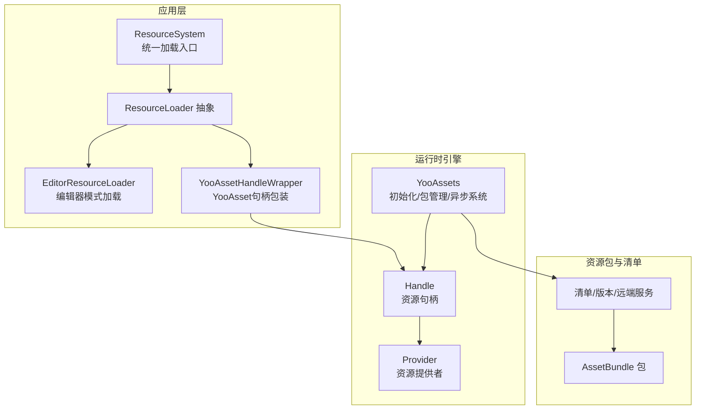
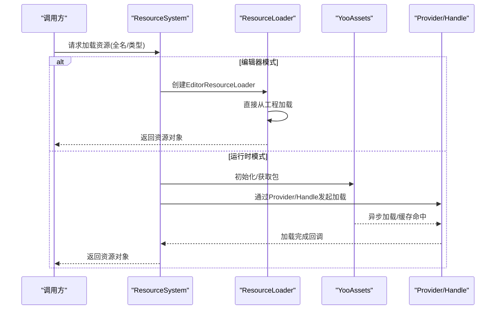
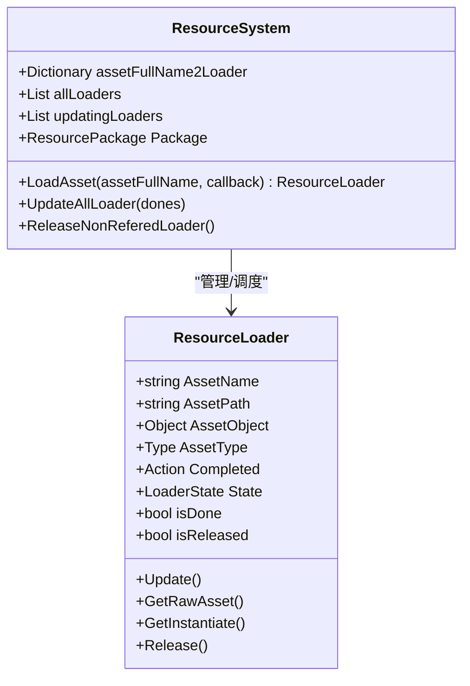
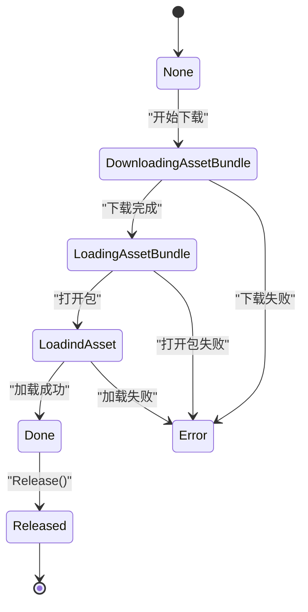
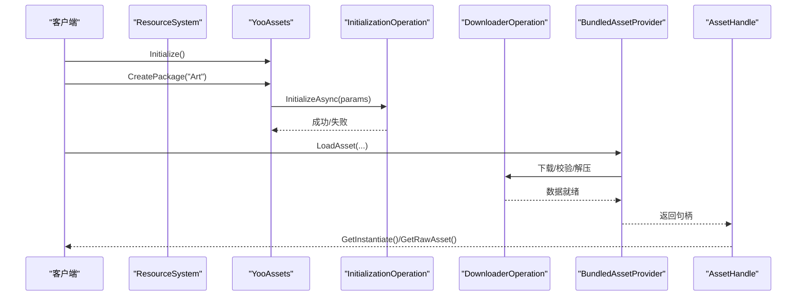
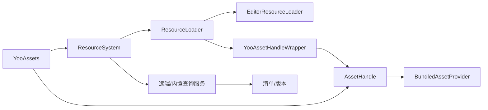

# 资源系统

<cite>
**本文档引用的文件**
- [ResourceSystem.cs](file://Assets/Scripts/Systems/Implement/ResourceSystem/ResourceSystem.cs)
- [ResourceSystem.Func.cs](file://Assets/Scripts/Systems/Implement/ResourceSystem/ResourceSystem.Func.cs)
- [ResourceSystem.Update.cs](file://Assets/Scripts/Systems/Implement/ResourceSystem/ResourceSystem.Update.cs)
- [ResourceLoader.cs](file://Assets/Scripts/Systems/Implement/ResourceSystem/ResourceLoader.cs)
- [EditorResourceLoader.cs](file://Assets/Scripts/Systems/Implement/ResourceSystem/EditorResourceLoader.cs)
- [YooAssetHandleWrapper.cs](file://Assets/Scripts/Systems/Implement/ResourceSystem/YooAssetHandleWrapper.cs)
- [ABLoadTest.cs](file://Assets/Dev/Lab/Scripts/ABLoadTest.cs)
- [YooAssets.cs](file://Assets/Plugins/com.tuyoogame.yooasset@2.1.2/Runtime/YooAssets.cs)
- [YooAssetSettings.cs](file://Assets/Plugins/com.tuyoogame.yooasset@2.1.2/Runtime/Settings/YooAssetSettings.cs)
- [AssetHandle.cs](file://Assets/Plugins/com.tuyoogame.yooasset@2.1.2/Runtime/ResourceManager/Handle/AssetHandle.cs)
- [SceneHandle.cs](file://Assets/Plugins/com.tuyoogame.yooasset@2.1.2/Runtime/ResourceManager/Handle/SceneHandle.cs)
- [BundledAssetProvider.cs](file://Assets/Plugins/com.tuyoogame.yooasset@2.1.2/Runtime/ResourceManager/Provider/BundledAssetProvider.cs)
- [BundledSceneProvider.cs](file://Assets/Plugins/com.tuyoogame.yooasset@2.1.2/Runtime/ResourceManager/Provider/BundledSceneProvider.cs)
- [InitializationOperation.cs](file://Assets/Plugins/com.tuyoogame.yooasset@2.1.2/Runtime/ResourcePackage/Operation/InitializationOperation.cs)
- [DownloaderOperation.cs](file://Assets/Plugins/com.tuyoogame.yooasset@2.1.2/Runtime/ResourcePackage/Operation/DownloaderOperation.cs)
- [RemoteServices.cs](file://Assets/Scripts/Systems/Implement/ResourceSystem/YooAssetImpl/RemoteServices.cs)
- [StreamingAssetsDefine.cs](file://Assets/Scripts/Systems/Implement/ResourceSystem/YooAssetImpl/StreamingAssetsDefine.cs)
- [BuildinFileManifest.cs](file://Assets/Scripts/Systems/Implement/ResourceSystem/YooAssetImpl/BuildinFileManifest.cs)
- [ResourceReference.cs](file://Assets/Dev/Lab/Scenes/ResourceReference.cs)
- [ResourceTest.cs](file://Assets/Dev/Lab/ResourceTest/ResourceTest.cs)
</cite>

## 目录
1. [引言](#引言)
2. [项目结构](#项目结构)
3. [核心组件](#核心组件)
4. [架构总览](#架构总览)
5. [详细组件分析](#详细组件分析)
6. [依赖关系分析](#依赖关系分析)
7. [性能考虑](#性能考虑)
8. [故障排查指南](#故障排查指南)
9. [结论](#结论)
10. [附录](#附录)

## 引言
本文件面向ProjectR项目的资源系统，系统性阐述其设计与实现，覆盖以下主题：
- 资源的异步加载、缓存管理与批量处理机制
- 资源引用系统：路径管理、依赖跟踪与生命周期控制
- 不同类型资源的加载策略：场景、预制体、纹理、音频等
- 资源打包与分发：AssetBundle使用与版本管理
- 性能优化：预加载、延迟加载与内存回收
- 扩展与自定义：如何接入新资源类型与扩展点

本系统以YooAsset为核心运行时，并通过ResourceSystem封装统一的加载入口与生命周期管理。

## 项目结构
资源系统主要由三层构成：
- 应用层封装：ResourceSystem及其加载器体系（ResourceLoader、EditorResourceLoader、YooAssetHandleWrapper）
- 运行时引擎：YooAsset核心（初始化、包管理、异步操作）
- 资源包与清单：AssetBundle、清单文件、远端/内置查询服务

图表来源
- [ResourceSystem.cs:1-39](file://Assets/Scripts/Systems/Implement/ResourceSystem/ResourceSystem.cs#L1-L39)
- [ResourceLoader.cs:19-76](file://Assets/Scripts/Systems/Implement/ResourceSystem/ResourceLoader.cs#L19-L76)
- [EditorResourceLoader.cs:11-41](file://Assets/Scripts/Systems/Implement/ResourceSystem/EditorResourceLoader.cs#L11-L41)
- [YooAssetHandleWrapper.cs:90-97](file://Assets/Scripts/Systems/Implement/ResourceSystem/YooAssetHandleWrapper.cs#L90-L97)
- [YooAssets.cs:9-243](file://Assets/Plugins/com.tuyoogame.yooasset@2.1.2/Runtime/YooAssets.cs#L9-L243)
- [BundledAssetProvider.cs](file://Assets/Plugins/com.tuyoogame.yooasset@2.1.2/Runtime/ResourceManager/Provider/BundledAssetProvider.cs)
- [AssetHandle.cs](file://Assets/Plugins/com.tuyoogame.yooasset@2.1.2/Runtime/ResourceManager/Handle/AssetHandle.cs)

章节来源
- [ResourceSystem.cs:1-39](file://Assets/Scripts/Systems/Implement/ResourceSystem/ResourceSystem.cs#L1-L39)
- [YooAssets.cs:9-243](file://Assets/Plugins/com.tuyoogame.yooasset@2.1.2/Runtime/YooAssets.cs#L9-L243)

## 核心组件
- ResourceSystem：单例系统，负责资源加载入口、加载器生命周期管理、异步调度与释放回收。
- ResourceLoader：抽象加载器基类，定义状态机、实例化接口、完成回调与释放流程。
- EditorResourceLoader：编辑器模式下的直接资源加载器，绕过AB包，直接从工程加载。
- YooAssetHandleWrapper：YooAsset资源句柄包装器，桥接YooAsset与ResourceSystem的加载器体系。
- YooAssets：YooAsset运行时核心，提供初始化、包创建/销毁、全局异步系统与调试信息。

章节来源
- [ResourceSystem.cs:14-39](file://Assets/Scripts/Systems/Implement/ResourceSystem/ResourceSystem.cs#L14-L39)
- [ResourceLoader.cs:19-76](file://Assets/Scripts/Systems/Implement/ResourceSystem/ResourceLoader.cs#L19-L76)
- [EditorResourceLoader.cs:11-41](file://Assets/Scripts/Systems/Implement/ResourceSystem/EditorResourceLoader.cs#L11-L41)
- [YooAssetHandleWrapper.cs:90-97](file://Assets/Scripts/Systems/Implement/ResourceSystem/YooAssetHandleWrapper.cs#L90-L97)
- [YooAssets.cs:9-243](file://Assets/Plugins/com.tuyoogame.yooasset@2.1.2/Runtime/YooAssets.cs#L9-L243)

## 架构总览
ResourceSystem作为统一入口，根据运行环境选择加载器：
- 编辑器模式：使用EditorResourceLoader直接加载
- 运行时模式：使用YooAssetHandleWrapper，委托YooAsset进行AB包加载与缓存

图表来源
- [ResourceSystem.Func.cs:109-146](file://Assets/Scripts/Systems/Implement/ResourceSystem/ResourceSystem.Func.cs#L109-L146)
- [EditorResourceLoader.cs:17-29](file://Assets/Scripts/Systems/Implement/ResourceSystem/EditorResourceLoader.cs#L17-L29)
- [YooAssetHandleWrapper.cs:69-88](file://Assets/Scripts/Systems/Implement/ResourceSystem/YooAssetHandleWrapper.cs#L69-L88)
- [YooAssets.cs:98-147](file://Assets/Plugins/com.tuyoogame.yooasset@2.1.2/Runtime/YooAssets.cs#L98-L147)

## 详细组件分析

### ResourceSystem：统一加载与生命周期
- 加载入口：按资源全名映射到加载器；支持同步/异步回调
- 生命周期：维护所有加载器列表，按帧更新，定期清理未引用且可释放的加载器
- 状态机：加载器内部有明确状态（下载中/加载中/完成/错误/释放），统一由ResourceSystem驱动

图表来源
- [ResourceSystem.cs:14-39](file://Assets/Scripts/Systems/Implement/ResourceSystem/ResourceSystem.cs#L14-L39)
- [ResourceLoader.cs:19-76](file://Assets/Scripts/Systems/Implement/ResourceSystem/ResourceLoader.cs#L19-L76)

章节来源
- [ResourceSystem.cs:14-39](file://Assets/Scripts/Systems/Implement/ResourceSystem/ResourceSystem.cs#L14-L39)
- [ResourceSystem.Update.cs:10-84](file://Assets/Scripts/Systems/Implement/ResourceSystem/ResourceSystem.Update.cs#L10-L84)

### ResourceLoader：状态机与实例化
- 状态机：DownloadingAssetBundle、LoadingAssetBundle、LoadindAsset、Error、Done、Released
- 实例化：提供GetInstantiate<T>()用于克隆实例并记录引用，避免GC抖动
- 回收：Releasable()判定后调用Release()，最终由ResourceSystem移除

图表来源
- [ResourceLoader.cs:29-42](file://Assets/Scripts/Systems/Implement/ResourceSystem/ResourceLoader.cs#L29-L42)

章节来源
- [ResourceLoader.cs:19-76](file://Assets/Scripts/Systems/Implement/ResourceSystem/ResourceLoader.cs#L19-L76)

### EditorResourceLoader：编辑器模式加载
- 直接从工程路径加载资源，绕过AB包，便于开发调试
- 在Update中同步完成加载并置为Done状态

章节来源
- [EditorResourceLoader.cs:11-41](file://Assets/Scripts/Systems/Implement/ResourceSystem/EditorResourceLoader.cs#L11-L41)

### YooAssetHandleWrapper：YooAsset集成
- 包装YooAsset的AssetHandle，对接ResourceLoader的状态机与生命周期
- 提供GetRawAsset/GetInstantiate/Release等接口，统一资源访问

章节来源
- [YooAssetHandleWrapper.cs:69-88](file://Assets/Scripts/Systems/Implement/ResourceSystem/YooAssetHandleWrapper.cs#L69-L88)

### YooAssets：运行时核心
- 初始化/销毁、包管理、全局异步系统与调试报告
- 支持设置下载系统参数、时间切片、WebGL缓存策略等

章节来源
- [YooAssets.cs:9-243](file://Assets/Plugins/com.tuyoogame.yooasset@2.1.2/Runtime/YooAssets.cs#L9-L243)
- [YooAssetSettings.cs:1-71](file://Assets/Plugins/com.tuyoogame.yooasset@2.1.2/Runtime/Settings/YooAssetSettings.cs#L1-L71)

### Provider/Handle：资源提供与句柄
- Provider：BundledAssetProvider/BundledSceneProvider等，负责具体资源的加载与缓存
- Handle：AssetHandle/SceneHandle等，封装资源句柄与实例化操作

章节来源
- [BundledAssetProvider.cs](file://Assets/Plugins/com.tuyoogame.yooasset@2.1.2/Runtime/ResourceManager/Provider/BundledAssetProvider.cs)
- [BundledSceneProvider.cs](file://Assets/Plugins/com.tuyoogame.yooasset@2.1.2/Runtime/ResourceManager/Provider/BundledSceneProvider.cs)
- [AssetHandle.cs](file://Assets/Plugins/com.tuyoogame.yooasset@2.1.2/Runtime/ResourceManager/Handle/AssetHandle.cs)
- [SceneHandle.cs](file://Assets/Plugins/com.tuyoogame.yooasset@2.1.2/Runtime/ResourceManager/Handle/SceneHandle.cs)

### 资源加载流程（运行时）

图表来源
- [YooAssets.cs:98-147](file://Assets/Plugins/com.tuyoogame.yooasset@2.1.2/Runtime/YooAssets.cs#L98-L147)
- [InitializationOperation.cs](file://Assets/Plugins/com.tuyoogame.yooasset@2.1.2/Runtime/ResourcePackage/Operation/InitializationOperation.cs)
- [DownloaderOperation.cs](file://Assets/Plugins/com.tuyoogame.yooasset@2.1.2/Runtime/ResourcePackage/Operation/DownloaderOperation.cs)
- [BundledAssetProvider.cs](file://Assets/Plugins/com.tuyoogame.yooasset@2.1.2/Runtime/ResourceManager/Provider/BundledAssetProvider.cs)
- [AssetHandle.cs](file://Assets/Plugins/com.tuyoogame.yooasset@2.1.2/Runtime/ResourceManager/Handle/AssetHandle.cs)

## 依赖关系分析
- ResourceSystem依赖于ResourceLoader体系与YooAsset运行时
- EditorResourceLoader与BundledAssetProvider分别对应编辑器与运行时两条加载路径
- 远端/内置查询服务与清单文件共同决定资源包的版本与来源

图表来源
- [ResourceSystem.cs:14-39](file://Assets/Scripts/Systems/Implement/ResourceSystem/ResourceSystem.cs#L14-L39)
- [YooAssetHandleWrapper.cs:90-97](file://Assets/Scripts/Systems/Implement/ResourceSystem/YooAssetHandleWrapper.cs#L90-L97)
- [RemoteServices.cs](file://Assets/Scripts/Systems/Implement/ResourceSystem/YooAssetImpl/RemoteServices.cs)

章节来源
- [ResourceSystem.cs:14-39](file://Assets/Scripts/Systems/Implement/ResourceSystem/ResourceSystem.cs#L14-L39)
- [RemoteServices.cs](file://Assets/Scripts/Systems/Implement/ResourceSystem/YooAssetImpl/RemoteServices.cs)

## 性能考虑
- 异步与批处理
  - ResourceSystem按帧更新加载器列表，避免单帧大量IO阻塞
  - 通过时间切片参数可调节每帧最大耗时
- 延迟加载与预加载
  - 对非关键资源采用延迟加载；对即将使用的资源进行预加载，降低首帧卡顿
- 内存回收
  - 定期清理未引用的加载器与实例化对象
  - 使用Release()释放资源句柄，结合GC.Collect()进行强制回收（仅在测试/诊断场景）
- 缓存策略
  - YooAsset支持缓存数据文件与清单文件，WebGL平台可禁用缓存
  - 清单文件头标记、版本号与输出目录可配置

章节来源
- [ResourceSystem.Update.cs:57-84](file://Assets/Scripts/Systems/Implement/ResourceSystem/ResourceSystem.Update.cs#L57-L84)
- [YooAssets.cs:209-226](file://Assets/Plugins/com.tuyoogame.yooasset@2.1.2/Runtime/YooAssets.cs#L209-L226)
- [YooAssetSettings.cs:35-70](file://Assets/Plugins/com.tuyoogame.yooasset@2.1.2/Runtime/Settings/YooAssetSettings.cs#L35-L70)
- [ABLoadTest.cs:50-52](file://Assets/Dev/Lab/Scripts/ABLoadTest.cs#L50-L52)

## 故障排查指南
- 初始化失败
  - 检查包名是否重复、是否已初始化；确认远端/内置查询服务返回的URL正确
- 加载失败
  - 查看EditorResourceLoader中的错误日志；确认资源路径与类型匹配
  - 对比YooAssetHandleWrapper的错误信息与LastError
- 资源泄漏
  - 确认GetInstantiate<T>()后仍持有引用；定期调用Release()与清理未引用加载器
- 日志与调试
  - 使用Application.logMessageReceived收集日志；YooAssets提供调试报告

章节来源
- [YooAssets.cs:58-75](file://Assets/Plugins/com.tuyoogame.yooasset@2.1.2/Runtime/YooAssets.cs#L58-L75)
- [EditorResourceLoader.cs:23-28](file://Assets/Scripts/Systems/Implement/ResourceSystem/EditorResourceLoader.cs#L23-L28)
- [YooAssetHandleWrapper.cs:60-67](file://Assets/Scripts/Systems/Implement/ResourceSystem/YooAssetHandleWrapper.cs#L60-L67)
- [ABLoadTest.cs:77-85](file://Assets/Dev/Lab/Scripts/ABLoadTest.cs#L77-L85)

## 结论
ProjectR的资源系统以YooAsset为核心，通过ResourceSystem统一抽象了编辑器与运行时两种加载路径，实现了：
- 明确的异步加载与状态机
- 可观测的缓存与版本管理
- 可扩展的加载器体系与资源生命周期控制
建议在实际项目中结合业务需求，完善预加载策略、资源池化与更细粒度的缓存控制，以获得更优的性能与稳定性。

## 附录

### 不同类型资源的加载策略
- 场景资源：使用SceneHandle与BundledSceneProvider，支持异步加载与卸载
- 预制体资源：使用AssetHandle与BundledAssetProvider，支持实例化与引用计数
- 纹理/音频：遵循相同Provider/Handle模式，注意压缩格式与流式加载策略

章节来源
- [SceneHandle.cs](file://Assets/Plugins/com.tuyoogame.yooasset@2.1.2/Runtime/ResourceManager/Handle/SceneHandle.cs)
- [BundledSceneProvider.cs](file://Assets/Plugins/com.tuyoogame.yooasset@2.1.2/Runtime/ResourceManager/Provider/BundledSceneProvider.cs)
- [AssetHandle.cs](file://Assets/Plugins/com.tuyoogame.yooasset@2.1.2/Runtime/ResourceManager/Handle/AssetHandle.cs)
- [BundledAssetProvider.cs](file://Assets/Plugins/com.tuyoogame.yooasset@2.1.2/Runtime/ResourceManager/Provider/BundledAssetProvider.cs)

### 资源打包与分发（AssetBundle）
- 清单与版本：YooAssetSettings定义清单文件名、版本号、输出目录等
- 远端/内置：RemoteServices提供默认与回退远端URL；StreamingAssetsDefine支持内置资源
- 清单加载：BuildinFileManifest与多阶段清单加载操作（本地/缓存/远端）

章节来源
- [YooAssetSettings.cs:1-71](file://Assets/Plugins/com.tuyoogame.yooasset@2.1.2/Runtime/Settings/YooAssetSettings.cs#L1-L71)
- [RemoteServices.cs](file://Assets/Scripts/Systems/Implement/ResourceSystem/YooAssetImpl/RemoteServices.cs)
- [StreamingAssetsDefine.cs](file://Assets/Scripts/Systems/Implement/ResourceSystem/YooAssetImpl/StreamingAssetsDefine.cs)
- [BuildinFileManifest.cs](file://Assets/Scripts/Systems/Implement/ResourceSystem/YooAssetImpl/BuildinFileManifest.cs)

### 资源引用系统与生命周期
- 路径管理：资源全名到加载器的字典映射，支持按名快速查找
- 依赖跟踪：通过Provider/Handle链路自动追踪依赖
- 生命周期：加载器状态机+ResourceSystem的周期性清理，确保无泄漏

章节来源
- [ResourceSystem.cs:17-39](file://Assets/Scripts/Systems/Implement/ResourceSystem/ResourceSystem.cs#L17-L39)
- [ResourceLoader.cs:29-42](file://Assets/Scripts/Systems/Implement/ResourceSystem/ResourceLoader.cs#L29-L42)
- [ResourceSystem.Update.cs:57-84](file://Assets/Scripts/Systems/Implement/ResourceSystem/ResourceSystem.Update.cs#L57-L84)

### 扩展与自定义
- 新资源类型：新增Provider/Handle并在ResourceSystem中注册加载器
- 自定义查询服务：实现IRemoteServices接口，支持多CDN与回退策略
- 测试与诊断：利用ABLoadTest与ResourceReference进行加载验证与生命周期观察

章节来源
- [ABLoadTest.cs:13-157](file://Assets/Dev/Lab/Scripts/ABLoadTest.cs#L13-L157)
- [ResourceReference.cs:7-15](file://Assets/Dev/Lab/Scenes/ResourceReference.cs#L7-L15)
- [ResourceTest.cs:7-20](file://Assets/Dev/Lab/ResourceTest/ResourceTest.cs#L7-L20)