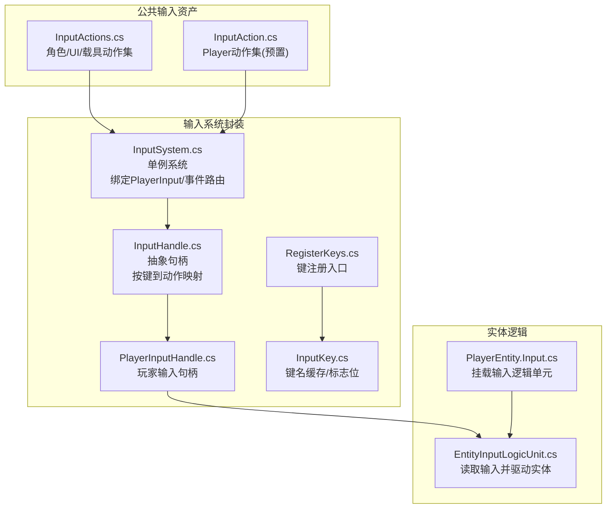
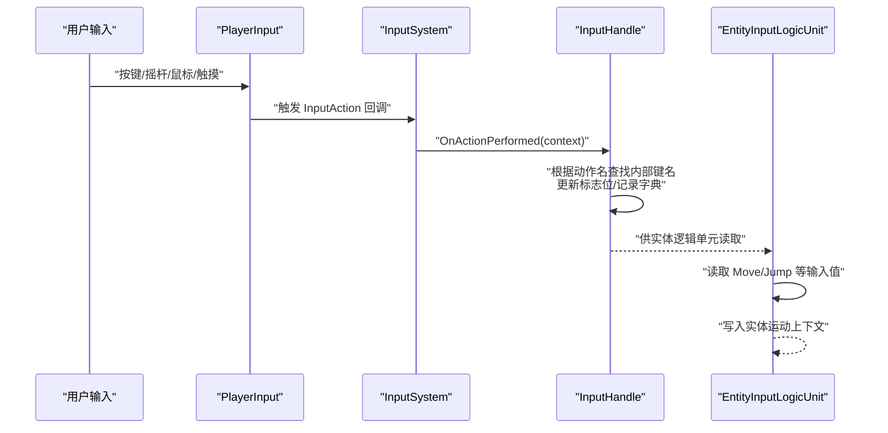
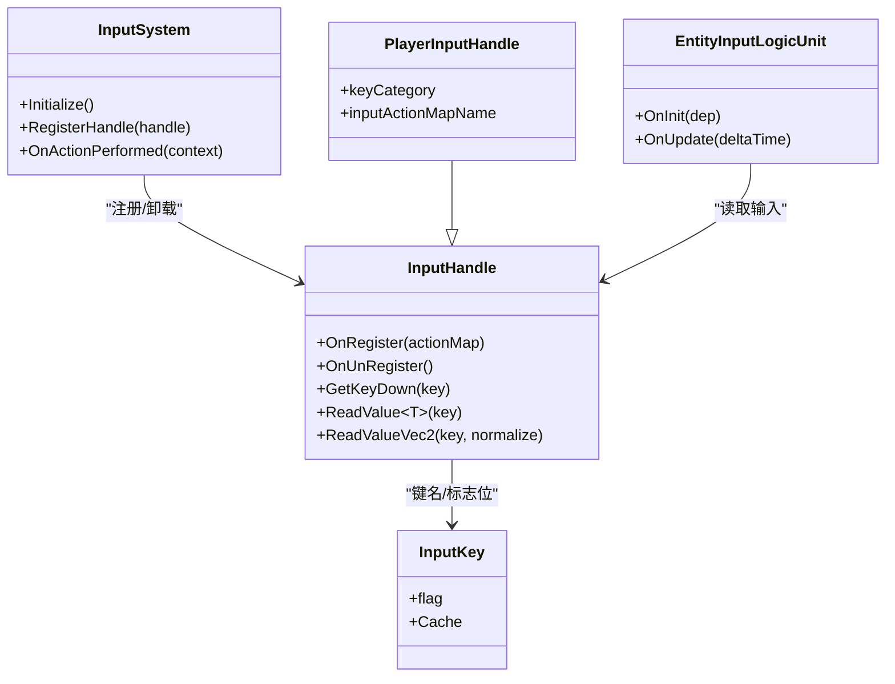

# 输入系统

<cite>
**本文引用的文件**   
- [Assets/Common/InputActions.cs](file://Assets/Common/InputActions.cs)
- [Assets/Dev/Prefabs/SystemAssets/InputSystem/InputAction.cs](file://Assets/Dev/Prefabs/SystemAssets/InputSystem/InputAction.cs)
- [Assets/Scripts/Systems/Implement/InputSystem/InputSystem.cs](file://Assets/Scripts/Systems/Implement/InputSystem/InputSystem.cs)
- [Assets/Scripts/Systems/Implement/InputSystem/InputHandle.cs](file://Assets/Scripts/Systems/Implement/InputSystem/InputHandle.cs)
- [Assets/Scripts/Systems/Implement/InputSystem/PlayerInputHandle.cs](file://Assets/Scripts/Systems/Implement/InputSystem/PlayerInputHandle.cs)
- [Assets/Scripts/Systems/Implement/InputSystem/InputKey.cs](file://Assets/Scripts/Systems/Implement/InputSystem/InputKey.cs)
- [Assets/Scripts/Systems/Implement/InputSystem/InputKey.Register.cs](file://Assets/Scripts/Systems/Implement/InputSystem/InputKey.Register.cs)
- [Assets/Scripts/Systems/Implement/InputSystem/InputSystem.Define.cs](file://Assets/Scripts/Systems/Implement/InputSystem/InputSystem.Define.cs)
- [Assets/Scripts/Systems/Implement/EntitySystem/LogicEntity/PlayerEntity/PlayerEntity.Input.cs](file://Assets/Scripts/Systems/Implement/EntitySystem/LogicEntity/PlayerEntity/PlayerEntity.Input.cs)
- [Assets/Scripts/Systems/Implement/EntitySystem/LogicEntity/LogicUnits/EntityInputLogicUnit.cs](file://Assets/Scripts/Systems/Implement/EntitySystem/LogicEntity/LogicUnits/EntityInputLogicUnit.cs)
- [Assets/Dev/Flag/InputFlag.asset](file://Assets/Dev/Flag/InputFlag.asset)
</cite>

## 目录
1. [简介](#简介)
2. [项目结构](#项目结构)
3. [核心组件](#核心组件)
4. [架构总览](#架构总览)
5. [详细组件分析](#详细组件分析)
6. [依赖关系分析](#依赖关系分析)
7. [性能与优化](#性能与优化)
8. [调试与监控](#调试与监控)
9. [结论](#结论)
10. [附录：输入映射与扩展指南](#附录输入映射与扩展指南)

## 简介
本文件系统化梳理 ProjectR 的输入系统设计与实现，覆盖以下关键主题：
- 输入事件的捕获、处理与分发流程
- Unity Input System 的集成方式（InputAction、InputActionAsset、PlayerInput）
- 输入映射配置（角色、UI、载具等动作映射）
- 多设备支持（键盘/鼠标、手柄、触摸）与跨平台兼容策略
- 扩展机制（自定义输入动作、组合键）
- 输入延迟优化、输入预测与输入验证
- 调试工具与性能监控方法

## 项目结构
输入系统相关代码主要分布在以下模块：
- 公共输入资产与动作定义：Common 层的 InputActions 动作集
- 自研输入封装层：InputSystem、InputHandle、InputKey 及其注册器
- 实体逻辑单元：PlayerEntity 与 EntityInputLogicUnit 将输入转化为实体行为
- 预置输入资产：Dev/Prefabs/SystemAssets 下的 InputAction.inputactions

图表来源
- [Assets/Common/InputActions.cs:1-1192](file://Assets/Common/InputActions.cs#L1-L1192)
- [Assets/Dev/Prefabs/SystemAssets/InputSystem/InputAction.cs:1-276](file://Assets/Dev/Prefabs/SystemAssets/InputSystem/InputAction.cs#L1-L276)
- [Assets/Scripts/Systems/Implement/InputSystem/InputSystem.cs:1-166](file://Assets/Scripts/Systems/Implement/InputSystem/InputSystem.cs#L1-L166)
- [Assets/Scripts/Systems/Implement/InputSystem/InputHandle.cs:1-157](file://Assets/Scripts/Systems/Implement/InputSystem/InputHandle.cs#L1-L157)
- [Assets/Scripts/Systems/Implement/InputSystem/PlayerInputHandle.cs:1-20](file://Assets/Scripts/Systems/Implement/InputSystem/PlayerInputHandle.cs#L1-L20)
- [Assets/Scripts/Systems/Implement/InputSystem/InputKey.cs:1-122](file://Assets/Scripts/Systems/Implement/InputSystem/InputKey.cs#L1-L122)
- [Assets/Scripts/Systems/Implement/InputSystem/InputKey.Register.cs:1-17](file://Assets/Scripts/Systems/Implement/InputSystem/InputKey.Register.cs#L1-L17)
- [Assets/Scripts/Systems/Implement/EntitySystem/LogicEntity/PlayerEntity/PlayerEntity.Input.cs:1-14](file://Assets/Scripts/Systems/Implement/EntitySystem/LogicEntity/PlayerEntity/PlayerEntity.Input.cs#L1-L14)
- [Assets/Scripts/Systems/Implement/EntitySystem/LogicEntity/LogicUnits/EntityInputLogicUnit.cs:1-42](file://Assets/Scripts/Systems/Implement/EntitySystem/LogicEntity/LogicUnits/EntityInputLogicUnit.cs#L1-L42)

章节来源
- [Assets/Common/InputActions.cs:1-1192](file://Assets/Common/InputActions.cs#L1-L1192)
- [Assets/Scripts/Systems/Implement/InputSystem/InputSystem.cs:1-166](file://Assets/Scripts/Systems/Implement/InputSystem/InputSystem.cs#L1-L166)

## 核心组件
- InputActionAsset 与 InputActions
  - 角色控制、UI 导航、载具操作三类动作映射，包含复合与基础绑定、处理器与交互器配置
- InputSystem 单例
  - 加载动作资产、绑定 PlayerInput、启用事件路由、按当前句柄订阅动作回调
- InputHandle 抽象句柄
  - 将 InputActionMap 中的动作与内部键名缓存对接，提供 GetKeyDown/IsPressed/ReadValue 等统一接口
- PlayerInputHandle
  - 面向“Player”动作映射的具体句柄实现
- InputKey 与 RegisterKeys
  - 键名到标志位的缓存与分类管理，支持快速布尔判断与批量查询
- 实体输入逻辑单元
  - 从 InputHandle 读取输入，写入实体运动上下文

章节来源
- [Assets/Common/InputActions.cs:1-1192](file://Assets/Common/InputActions.cs#L1-L1192)
- [Assets/Scripts/Systems/Implement/InputSystem/InputSystem.cs:1-166](file://Assets/Scripts/Systems/Implement/InputSystem/InputSystem.cs#L1-L166)
- [Assets/Scripts/Systems/Implement/InputSystem/InputHandle.cs:1-157](file://Assets/Scripts/Systems/Implement/InputSystem/InputHandle.cs#L1-L157)
- [Assets/Scripts/Systems/Implement/InputSystem/PlayerInputHandle.cs:1-20](file://Assets/Scripts/Systems/Implement/InputSystem/PlayerInputHandle.cs#L1-L20)
- [Assets/Scripts/Systems/Implement/InputSystem/InputKey.cs:1-122](file://Assets/Scripts/Systems/Implement/InputSystem/InputKey.cs#L1-L122)
- [Assets/Scripts/Systems/Implement/InputSystem/InputKey.Register.cs:1-17](file://Assets/Scripts/Systems/Implement/InputSystem/InputKey.Register.cs#L1-L17)
- [Assets/Scripts/Systems/Implement/EntitySystem/LogicEntity/LogicUnits/EntityInputLogicUnit.cs:1-42](file://Assets/Scripts/Systems/Implement/EntitySystem/LogicEntity/LogicUnits/EntityInputLogicUnit.cs#L1-L42)

## 架构总览
输入系统采用“动作资产 + 句柄 + 实体逻辑单元”的分层设计：
- 上层：动作资产（角色/UI/载具）定义输入语义与绑定路径
- 中层：InputSystem 统一接入 Unity Input System，通过 PlayerInput 分发事件；InputHandle 将动作回调转译为内部键名与标志位
- 下层：实体逻辑单元消费输入，驱动实体状态机或物理运动

图表来源
- [Assets/Scripts/Systems/Implement/InputSystem/InputSystem.cs:79-140](file://Assets/Scripts/Systems/Implement/InputSystem/InputSystem.cs#L79-L140)
- [Assets/Scripts/Systems/Implement/InputSystem/InputHandle.cs:100-155](file://Assets/Scripts/Systems/Implement/InputSystem/InputHandle.cs#L100-L155)
- [Assets/Scripts/Systems/Implement/EntitySystem/LogicEntity/LogicUnits/EntityInputLogicUnit.cs:28-42](file://Assets/Scripts/Systems/Implement/EntitySystem/LogicEntity/LogicUnits/EntityInputLogicUnit.cs#L28-L42)

## 详细组件分析

### InputAction 与动作映射
- 动作资产包含三类映射：CharacterController（移动/视角/开火/跳跃）、UI（导航/提交/取消/指针/点击/滚轮/中键/右键）、Vehicle（转向/油门/上一个/下一个/视角）
- 每个动作可绑定多个设备路径（如 Gamepad、Keyboard、Mouse、Touchscreen），并支持复合动作（如 D-Pad、Vector2/1D Axis）
- 支持处理器与交互器（例如 NormalizeVector2、Press 等）

章节来源
- [Assets/Common/InputActions.cs:23-800](file://Assets/Common/InputActions.cs#L23-L800)
- [Assets/Common/InputActions.cs:800-1192](file://Assets/Common/InputActions.cs#L800-L1192)

### InputSystem 单例与事件路由
- 初始化时加载动作资产，若未启用则启用并绑定 PlayerInput
- 通过 RegisterHandle 切换当前输入句柄，订阅该动作映射下的所有 InputAction 的 started/performed/canceled 事件
- 将回调转译为内部键名，交由当前 InputHandle 处理

章节来源
- [Assets/Scripts/Systems/Implement/InputSystem/InputSystem.cs:38-74](file://Assets/Scripts/Systems/Implement/InputSystem/InputSystem.cs#L38-L74)
- [Assets/Scripts/Systems/Implement/InputSystem/InputSystem.cs:79-140](file://Assets/Scripts/Systems/Implement/InputSystem/InputSystem.cs#L79-L140)

### InputHandle 抽象与 PlayerInputHandle
- InputHandle 负责：
  - 将 InputActionMap 中的动作与内部键名缓存对接
  - 提供 GetKeyDown/IsPressed/ReadValue/ReadValueVec2 等统一接口
  - 维护标志位与字典记录，支持快速布尔判断与帧级状态查询
- PlayerInputHandle 指定使用“Player”动作映射，并在 OnRegister/OnUpdate 生命周期中完成初始化与更新

章节来源
- [Assets/Scripts/Systems/Implement/InputSystem/InputHandle.cs:1-157](file://Assets/Scripts/Systems/Implement/InputSystem/InputHandle.cs#L1-L157)
- [Assets/Scripts/Systems/Implement/InputSystem/PlayerInputHandle.cs:1-20](file://Assets/Scripts/Systems/Implement/InputSystem/PlayerInputHandle.cs#L1-L20)

### InputKey 缓存与标志位
- InputKey 提供字符串到标志位的映射，支持按类别缓存与快速查询
- 通过 FlagManager256 实现 256 位标志位管理，兼顾性能与可读性
- RegisterKeys 定义了 PlayerInput 类别的常用键名（Move/Run/Jump）

章节来源
- [Assets/Scripts/Systems/Implement/InputSystem/InputKey.cs:1-122](file://Assets/Scripts/Systems/Implement/InputSystem/InputKey.cs#L1-L122)
- [Assets/Scripts/Systems/Implement/InputSystem/InputKey.Register.cs:1-17](file://Assets/Scripts/Systems/Implement/InputSystem/InputKey.Register.cs#L1-L17)

### 实体输入逻辑单元
- PlayerEntity 在初始化阶段挂载 EntityInputLogicUnit
- EntityInputLogicUnit 从 InputHandle 读取 Move 等输入，写入实体运动上下文，驱动后续状态机或物理模拟

章节来源
- [Assets/Scripts/Systems/Implement/EntitySystem/LogicEntity/PlayerEntity/PlayerEntity.Input.cs:1-14](file://Assets/Scripts/Systems/Implement/EntitySystem/LogicEntity/PlayerEntity/PlayerEntity.Input.cs#L1-L14)
- [Assets/Scripts/Systems/Implement/EntitySystem/LogicEntity/LogicUnits/EntityInputLogicUnit.cs:1-42](file://Assets/Scripts/Systems/Implement/EntitySystem/LogicEntity/LogicUnits/EntityInputLogicUnit.cs#L1-L42)

## 依赖关系分析
- InputSystem 依赖 InputActionAsset 与 PlayerInput
- InputHandle 依赖 InputKey 缓存与 InputActionMap
- 实体逻辑单元依赖 InputHandle 与实体上下文
- 预置 InputAction 动作集与公共 InputActions 并行存在，分别服务于不同场景

图表来源
- [Assets/Scripts/Systems/Implement/InputSystem/InputSystem.cs:79-140](file://Assets/Scripts/Systems/Implement/InputSystem/InputSystem.cs#L79-L140)
- [Assets/Scripts/Systems/Implement/InputSystem/InputHandle.cs:1-157](file://Assets/Scripts/Systems/Implement/InputSystem/InputHandle.cs#L1-L157)
- [Assets/Scripts/Systems/Implement/InputSystem/PlayerInputHandle.cs:1-20](file://Assets/Scripts/Systems/Implement/InputSystem/PlayerInputHandle.cs#L1-L20)
- [Assets/Scripts/Systems/Implement/EntitySystem/LogicEntity/LogicUnits/EntityInputLogicUnit.cs:1-42](file://Assets/Scripts/Systems/Implement/EntitySystem/LogicEntity/LogicUnits/EntityInputLogicUnit.cs#L1-L42)

## 性能与优化
- 快速布尔判断：使用 256 位标志位（Flag256）与字典双轨记录，满足高频帧检测需求
- 值读取优化：Vector2 读取后可选归一化，避免斜角速度异常
- 动作订阅最小化：仅对当前活动 InputActionMap 的动作进行订阅，切换句柄时及时解绑
- 跨平台兼容：通过控制方案（Control Scheme）与绑定组（Binding Group）自动适配键盘/鼠标与手柄

章节来源
- [Assets/Scripts/Systems/Implement/InputSystem/InputHandle.cs:22-54](file://Assets/Scripts/Systems/Implement/InputSystem/InputHandle.cs#L22-L54)
- [Assets/Scripts/Systems/Implement/InputSystem/InputHandle.cs:146-155](file://Assets/Scripts/Systems/Implement/InputSystem/InputHandle.cs#L146-L155)
- [Assets/Scripts/Systems/Implement/InputSystem/InputSystem.cs:60-73](file://Assets/Scripts/Systems/Implement/InputSystem/InputSystem.cs#L60-L73)

## 调试与监控
- 调试菜单与工具
  - 工程内提供调试菜单与工具脚本，可用于输入系统状态查看与事件拦截
- 输入标志可视化
  - 使用 InputFlag.asset 作为输入标志的资源载体，便于在 Inspector 中观察输入状态
- 性能监控
  - 结合 Profiler 与自定义计时器，监控输入回调频率与处理耗时

章节来源
- [Assets/Dev/Flag/InputFlag.asset:1-31](file://Assets/Dev/Flag/InputFlag.asset#L1-L31)

## 结论
ProjectR 的输入系统以 Unity Input System 为核心，结合自研的 InputSystem、InputHandle 与 InputKey 缓存，实现了：
- 清晰的动作映射与多设备绑定
- 高效的事件路由与帧级输入读取
- 易于扩展的句柄体系与实体逻辑单元
- 跨平台兼容与性能优化

建议在后续迭代中进一步完善：
- 动作组合键与连招判定的抽象
- 输入预测与回滚机制的工程化落地
- 更细粒度的输入验证与抗作弊策略

## 附录：输入映射与扩展指南

### Unity Input System 集成要点
- 使用 PlayerInput 组件承载 InputActionAsset，并设置通知行为为 C# 事件
- 启用 InputActionAsset 并设置默认控制方案（如 KeyboardMouse）
- 通过 InputSystem.RegisterHandle 切换当前输入句柄，订阅对应动作映射

章节来源
- [Assets/Scripts/Systems/Implement/InputSystem/InputSystem.cs:38-74](file://Assets/Scripts/Systems/Implement/InputSystem/InputSystem.cs#L38-L74)
- [Assets/Scripts/Systems/Implement/InputSystem/InputSystem.cs:79-102](file://Assets/Scripts/Systems/Implement/InputSystem/InputSystem.cs#L79-L102)

### 输入映射配置方法
- 动态加载与热替换：通过资源系统加载 InputActionAsset，支持运行时切换
- 控制方案与绑定组：依据设备类型（Gamepad/Keyboard&Mouse）自动匹配绑定路径
- 复合动作：如 D-Pad、Vector2/1D Axis，用于组合输入（如移动/视角/油门）

章节来源
- [Assets/Common/InputActions.cs:23-800](file://Assets/Common/InputActions.cs#L23-L800)
- [Assets/Dev/Prefabs/SystemAssets/InputSystem/InputAction.cs:23-196](file://Assets/Dev/Prefabs/SystemAssets/InputSystem/InputAction.cs#L23-L196)

### 不同输入设备的支持与标准化
- 键盘/鼠标：支持 W/A/S/D、方向键、鼠标移动与按键
- 手柄：支持左摇杆（移动）、右摇杆（视角）、触发器（油门/开火）、肩键（切换）
- 触摸屏：支持触摸位置与点击事件
- 标准化处理：通过处理器（如 NormalizeVector2）与交互器（如 Press）统一输入范围与时序

章节来源
- [Assets/Common/InputActions.cs:67-222](file://Assets/Common/InputActions.cs#L67-L222)
- [Assets/Common/InputActions.cs:301-533](file://Assets/Common/InputActions.cs#L301-L533)
- [Assets/Common/InputActions.cs:585-784](file://Assets/Common/InputActions.cs#L585-L784)

### 扩展机制：自定义输入动作与组合键
- 新增动作：在 InputActionAsset 中添加新动作与绑定，确保与 PlayerInput 的动作映射一致
- 注册内部键名：通过 RegisterKeys 在目标类别下注册新键名，以便 InputHandle 识别
- 组合键实现：利用复合动作（如 D-Pad/Vector2/1DAxis）与交互器（Press/Release）实现组合输入

章节来源
- [Assets/Scripts/Systems/Implement/InputSystem/InputKey.Register.cs:1-17](file://Assets/Scripts/Systems/Implement/InputSystem/InputKey.Register.cs#L1-L17)
- [Assets/Dev/Prefabs/SystemAssets/InputSystem/InputAction.cs:23-196](file://Assets/Dev/Prefabs/SystemAssets/InputSystem/InputAction.cs#L23-L196)

### 输入延迟优化、输入预测与输入验证
- 延迟优化：减少不必要的回调订阅，仅在当前句柄激活时订阅动作；对高频输入（如移动）采用归一化与阈值处理
- 输入预测：在客户端侧基于帧率与输入历史进行简单插值，降低网络同步抖动
- 输入验证：对异常输入（如瞬时高幅度移动）进行过滤与限幅，防止作弊与异常状态传播

章节来源
- [Assets/Scripts/Systems/Implement/InputSystem/InputHandle.cs:146-155](file://Assets/Scripts/Systems/Implement/InputSystem/InputHandle.cs#L146-L155)
- [Assets/Scripts/Systems/Implement/InputSystem/InputSystem.cs:79-102](file://Assets/Scripts/Systems/Implement/InputSystem/InputSystem.cs#L79-L102)

### 调试工具与性能监控
- 调试菜单：提供输入系统状态查看与事件拦截功能
- 输入标志：通过 InputFlag.asset 可视化输入状态
- 性能监控：结合 Profiler 与自定义计时器，定位输入处理瓶颈

章节来源
- [Assets/Dev/Flag/InputFlag.asset:1-31](file://Assets/Dev/Flag/InputFlag.asset#L1-L31)