# OrdinalConfig模板系统

<cite>
**本文档引用的文件**
- [__OrdinalConfig.cs](file://Assets/Resources/OrdinalConfigTemplate/__OrdinalConfig.cs)
- [__OrdinalConfigAsset.cs](file://Assets/Resources/OrdinalConfigTemplate/__OrdinalConfigAsset.cs)
- [__OrdinalConfigItemAsset.cs](file://Assets/Resources/OrdinalConfigTemplate/__OrdinalConfigItemAsset.cs)
- [__OrdinalConfigIDAttribute.cs](file://Assets/Resources/OrdinalConfigTemplate/__OrdinalConfigIDAttribute.cs)
- [OrdinalConfigBase.cs](file://Assets/Scripts/Systems/Implement/ConfigSystem/OrdinalConfig/OrdinalConfigBase.cs)
- [OrdinalConfigAsset.cs](file://Assets/Scripts/Systems/Implement/ConfigSystem/OrdinalConfig/OrdinalConfigAsset.cs)
- [OrdinalConfigItemAsset.cs](file://Assets/Scripts/Systems/Implement/ConfigSystem/OrdinalConfig/OrdinalConfigItemAsset.cs)
- [OrdinalConfigItem.cs](file://Assets/Scripts/Systems/Implement/ConfigSystem/OrdinalConfig/OrdinalConfigItem.cs)
- [OrdinalConfigIDAttribute.cs](file://Assets/Scripts/Systems/Implement/ConfigSystem/OrdinalConfig/OrdinalConfigIDAttribute.cs)
- [OrdinalConfigItemCreateWindow.cs](file://Assets/Scripts/Systems/Implement/ConfigSystem/OrdinalConfig/OrdinalConfigItemCreateWindow.cs)
- [OrdinalConfigClassHelper.cs](file://Assets/Scripts/Editor/Config/OrdinalConfigClassHelper.cs)
- [ConfigUtil.cs](file://Assets/Scripts/Systems/Implement/ConfigSystem/ConfigUtil.cs)
- [ConfigConstant.cs](file://Assets/Scripts/Systems/Implement/ConfigSystem/ConfigConstant.cs)
- [OrdinalConfigTest.cs](file://Assets/Dev/Lab/Scripts/OrdinalConfigTest.cs)
</cite>

## 目录
1. [简介](#简介)
2. [项目结构](#项目结构)
3. [核心组件](#核心组件)
4. [架构概览](#架构概览)
5. [详细组件分析](#详细组件分析)
6. [依赖关系分析](#依赖关系分析)
7. [性能考虑](#性能考虑)
8. [故障排除指南](#故障排除指南)
9. [结论](#结论)

## 简介

OrdinalConfig模板系统是ProjectR项目中的配置管理系统，采用有序配置表的设计理念，为游戏开发提供了强大的配置管理解决方案。该系统基于Unity的SerializedScriptableObject技术，结合Odin Inspector框架，实现了类型安全、易于编辑、可扩展的配置管理功能。

系统的核心设计思想是将配置数据分为三个层次：配置类、配置资产和配置项资产，通过模板系统实现代码生成和标准化管理。每个配置类都遵循统一的命名规范和继承体系，确保了配置数据的一致性和可维护性。

## 项目结构

OrdinalConfig模板系统主要由以下几部分组成：

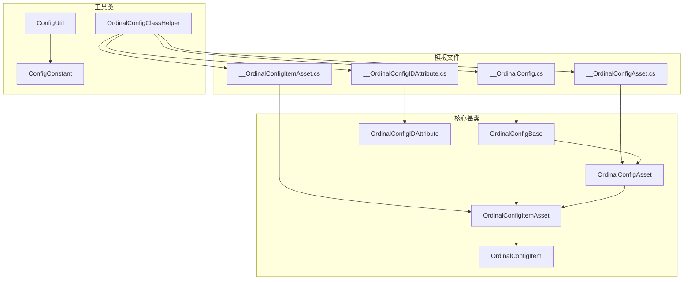

**图表来源**
- [__OrdinalConfig.cs:1-61](file://Assets/Resources/OrdinalConfigTemplate/__OrdinalConfig.cs#L1-L61)
- [OrdinalConfigBase.cs:1-634](file://Assets/Scripts/Systems/Implement/ConfigSystem/OrdinalConfig/OrdinalConfigBase.cs#L1-L634)

**章节来源**
- [__OrdinalConfig.cs:1-61](file://Assets/Resources/OrdinalConfigTemplate/__OrdinalConfig.cs#L1-L61)
- [__OrdinalConfigAsset.cs:1-9](file://Assets/Resources/OrdinalConfigTemplate/__OrdinalConfigAsset.cs#L1-L9)
- [__OrdinalConfigItemAsset.cs:1-8](file://Assets/Resources/OrdinalConfigTemplate/__OrdinalConfigItemAsset.cs#L1-L8)
- [__OrdinalConfigIDAttribute.cs:1-16](file://Assets/Resources/OrdinalConfigTemplate/__OrdinalConfigIDAttribute.cs#L1-L16)

## 核心组件

### 基础架构组件

OrdinalConfig系统的核心由五个基础组件构成，形成了完整的配置管理架构：

1. **OrdinalConfigBase**: 抽象配置基类，提供配置加载、缓存管理和编辑器支持
2. **OrdinalConfigAsset**: 配置资产类，管理配置项列表和编辑器功能
3. **OrdinalConfigItemAsset**: 配置项资产类，封装具体配置数据
4. **OrdinalConfigItem**: 配置项数据类，存储实际的游戏配置数据
5. **OrdinalConfigIDAttribute**: ID属性装饰器，提供配置标识符管理

### 组件关系图

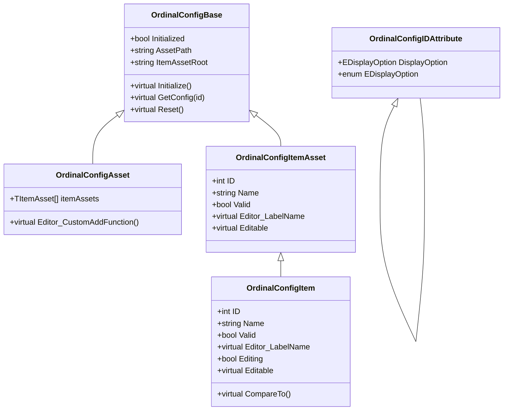

**图表来源**
- [OrdinalConfigBase.cs:15-634](file://Assets/Scripts/Systems/Implement/ConfigSystem/OrdinalConfig/OrdinalConfigBase.cs#L15-L634)
- [OrdinalConfigAsset.cs:7-25](file://Assets/Scripts/Systems/Implement/ConfigSystem/OrdinalConfig/OrdinalConfigAsset.cs#L7-L25)
- [OrdinalConfigItemAsset.cs:30-57](file://Assets/Scripts/Systems/Implement/ConfigSystem/OrdinalConfig/OrdinalConfigItemAsset.cs#L30-L57)
- [OrdinalConfigItem.cs:9-36](file://Assets/Scripts/Systems/Implement/ConfigSystem/OrdinalConfig/OrdinalConfigItem.cs#L9-L36)
- [OrdinalConfigIDAttribute.cs:8-30](file://Assets/Scripts/Systems/Implement/ConfigSystem/OrdinalConfig/OrdinalConfigIDAttribute.cs#L8-L30)

**章节来源**
- [OrdinalConfigBase.cs:15-634](file://Assets/Scripts/Systems/Implement/ConfigSystem/OrdinalConfig/OrdinalConfigBase.cs#L15-L634)
- [OrdinalConfigAsset.cs:7-25](file://Assets/Scripts/Systems/Implement/ConfigSystem/OrdinalConfig/OrdinalConfigAsset.cs#L7-L25)
- [OrdinalConfigItemAsset.cs:30-57](file://Assets/Scripts/Systems/Implement/ConfigSystem/OrdinalConfig/OrdinalConfigItemAsset.cs#L30-L57)
- [OrdinalConfigItem.cs:9-36](file://Assets/Scripts/Systems/Implement/ConfigSystem/OrdinalConfig/OrdinalConfigItem.cs#L9-L36)
- [OrdinalConfigIDAttribute.cs:8-30](file://Assets/Scripts/Systems/Implement/ConfigSystem/OrdinalConfig/OrdinalConfigIDAttribute.cs#L8-L30)

## 架构概览

### 系统架构图

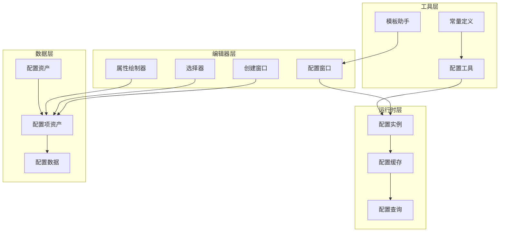

**图表来源**
- [__OrdinalConfig.cs:8-59](file://Assets/Resources/OrdinalConfigTemplate/__OrdinalConfig.cs#L8-L59)
- [OrdinalConfigBase.cs:36-139](file://Assets/Scripts/Systems/Implement/ConfigSystem/OrdinalConfig/OrdinalConfigBase.cs#L36-L139)
- [OrdinalConfigClassHelper.cs:13-240](file://Assets/Scripts/Editor/Config/OrdinalConfigClassHelper.cs#L13-L240)

### 数据流图

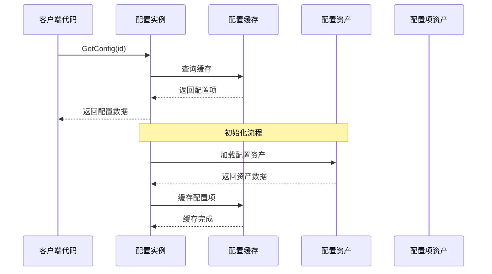

**图表来源**
- [OrdinalConfigBase.cs:66-107](file://Assets/Scripts/Systems/Implement/ConfigSystem/OrdinalConfig/OrdinalConfigBase.cs#L66-L107)
- [OrdinalConfigBase.cs:134-145](file://Assets/Scripts/Systems/Implement/ConfigSystem/OrdinalConfig/OrdinalConfigBase.cs#L134-L145)

## 详细组件分析

### 配置类生成系统

#### 模板生成机制

系统通过模板文件实现配置类的自动化生成，支持批量创建完整的配置系统。

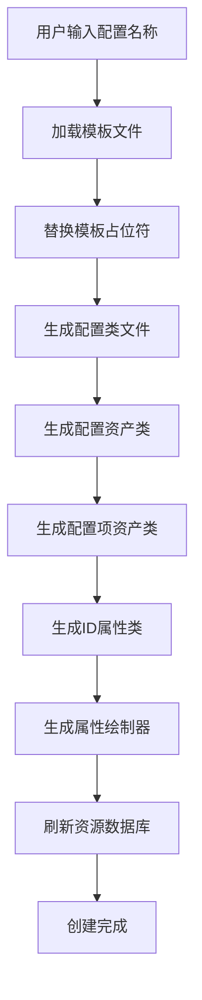

**图表来源**
- [OrdinalConfigClassHelper.cs:75-87](file://Assets/Scripts/Editor/Config/OrdinalConfigClassHelper.cs#L75-L87)
- [OrdinalConfigClassHelper.cs:174-193](file://Assets/Scripts/Editor/Config/OrdinalConfigClassHelper.cs#L174-L193)

#### 配置类继承体系

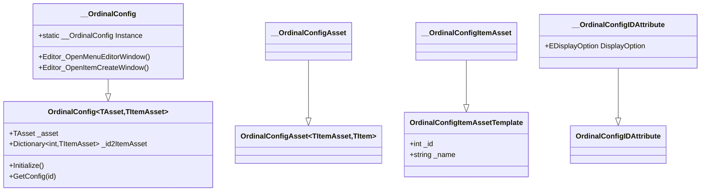

**图表来源**
- [__OrdinalConfig.cs:8-59](file://Assets/Resources/OrdinalConfigTemplate/__OrdinalConfig.cs#L8-L59)
- [__OrdinalConfigAsset.cs:4-7](file://Assets/Resources/OrdinalConfigTemplate/__OrdinalConfigAsset.cs#L4-L7)
- [__OrdinalConfigItemAsset.cs:4-6](file://Assets/Resources/OrdinalConfigTemplate/__OrdinalConfigItemAsset.cs#L4-L6)
- [__OrdinalConfigIDAttribute.cs:9-14](file://Assets/Resources/OrdinalConfigTemplate/__OrdinalConfigIDAttribute.cs#L9-L14)

**章节来源**
- [OrdinalConfigClassHelper.cs:13-240](file://Assets/Scripts/Editor/Config/OrdinalConfigClassHelper.cs#L13-L240)
- [__OrdinalConfig.cs:8-59](file://Assets/Resources/OrdinalConfigTemplate/__OrdinalConfig.cs#L8-L59)

### 配置项定义机制

#### ID属性装饰器系统

配置项的ID属性通过装饰器系统实现，提供了灵活的显示控制选项。

```mermaid
classDiagram
class OrdinalConfigIDAttribute {
+EDisplayOption DisplayOption
+enum EDisplayOption {
+None
+CreateButton
+CopyButton
+SelectButton
+Detail
+All
}
}
class __OrdinalConfigIDAttribute {
+__OrdinalConfigIDAttribute(DisplayOption)
}
class EDisplayOption {
<<enumeration>>
None
CreateButton
CopyButton
SelectButton
Detail
All
}
OrdinalConfigIDAttribute <|-- __OrdinalConfigIDAttribute
EDisplayOption <|-- OrdinalConfigIDAttribute.EDisplayOption
```

**图表来源**
- [OrdinalConfigIDAttribute.cs:8-30](file://Assets/Scripts/Systems/Implement/ConfigSystem/OrdinalConfig/OrdinalConfigIDAttribute.cs#L8-L30)
- [__OrdinalConfigIDAttribute.cs:9-14](file://Assets/Resources/OrdinalConfigTemplate/__OrdinalConfigIDAttribute.cs#L9-L14)

#### 配置项数据模型

配置项数据采用分层设计，支持嵌套配置和复杂数据结构。

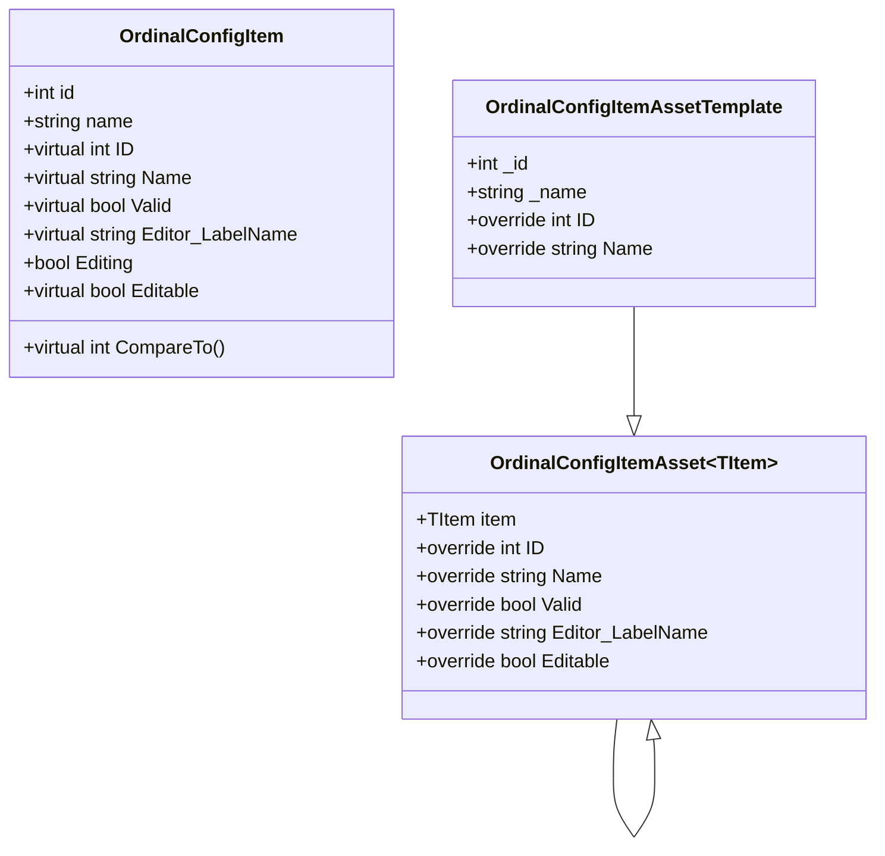

**图表来源**
- [OrdinalConfigItem.cs:9-36](file://Assets/Scripts/Systems/Implement/ConfigSystem/OrdinalConfig/OrdinalConfigItem.cs#L9-L36)
- [OrdinalConfigItemAsset.cs:7-42](file://Assets/Scripts/Systems/Implement/ConfigSystem/OrdinalConfig/OrdinalConfigItemAsset.cs#L7-L42)

**章节来源**
- [OrdinalConfigIDAttribute.cs:8-30](file://Assets/Scripts/Systems/Implement/ConfigSystem/OrdinalConfig/OrdinalConfigIDAttribute.cs#L8-L30)
- [__OrdinalConfigIDAttribute.cs:9-14](file://Assets/Resources/OrdinalConfigTemplate/__OrdinalConfigIDAttribute.cs#L9-L14)
- [OrdinalConfigItem.cs:9-36](file://Assets/Scripts/Systems/Implement/ConfigSystem/OrdinalConfig/OrdinalConfigItem.cs#L9-L36)
- [OrdinalConfigItemAsset.cs:7-42](file://Assets/Scripts/Systems/Implement/ConfigSystem/OrdinalConfig/OrdinalConfigItemAsset.cs#L7-L42)

### 序列化和反序列化机制

#### 配置资产序列化

配置系统采用Unity的SerializedScriptableObject进行数据持久化，确保了数据的完整性和版本兼容性。

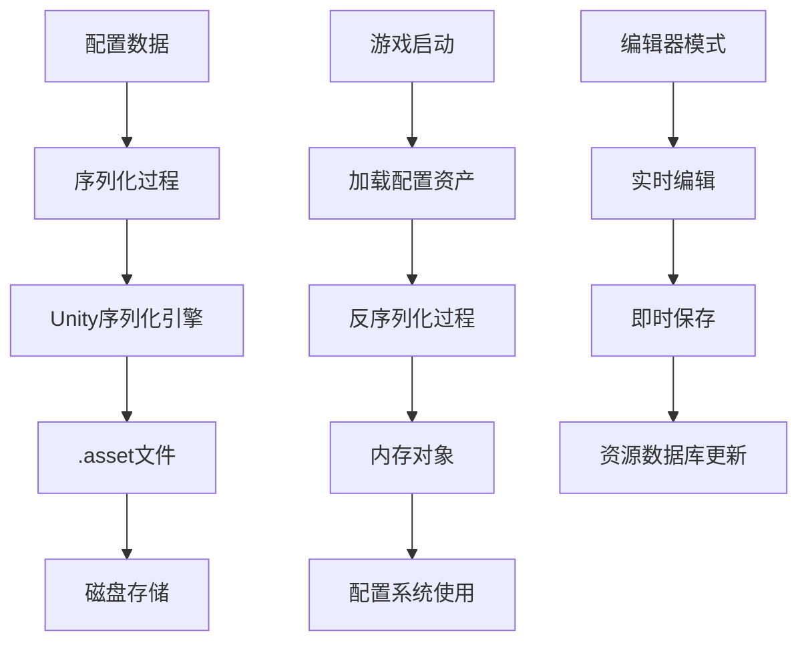

**图表来源**
- [OrdinalConfigBase.cs:36-64](file://Assets/Scripts/Systems/Implement/ConfigSystem/OrdinalConfig/OrdinalConfigBase.cs#L36-L64)
- [OrdinalConfigAsset.cs:16-22](file://Assets/Scripts/Systems/Implement/ConfigSystem/OrdinalConfig/OrdinalConfigAsset.cs#L16-L22)

#### 版本兼容性处理

系统通过以下机制确保版本兼容性：

1. **默认值处理**: 新增字段提供默认值，确保旧版本数据的兼容性
2. **字段忽略**: 使用`[JsonIgnore]`特性忽略不兼容的字段
3. **版本检查**: 运行时检查配置版本并进行必要的迁移
4. **回退机制**: 当新字段不存在时使用合理的默认值

**章节来源**
- [OrdinalConfigBase.cs:36-64](file://Assets/Scripts/Systems/Implement/ConfigSystem/OrdinalConfig/OrdinalConfigBase.cs#L36-L64)
- [OrdinalConfigAsset.cs:16-22](file://Assets/Scripts/Systems/Implement/ConfigSystem/OrdinalConfig/OrdinalConfigAsset.cs#L16-L22)

### 验证机制和错误处理

#### 配置验证流程

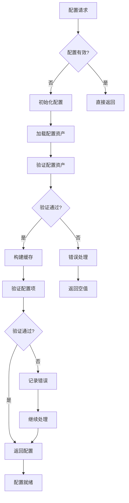

**图表来源**
- [OrdinalConfigBase.cs:115-122](file://Assets/Scripts/Systems/Implement/ConfigSystem/OrdinalConfig/OrdinalConfigBase.cs#L115-L122)
- [OrdinalConfigBase.cs:96-107](file://Assets/Scripts/Systems/Implement/ConfigSystem/OrdinalConfig/OrdinalConfigBase.cs#L96-L107)

#### 错误处理策略

系统采用多层次的错误处理策略：

1. **运行时错误**: 记录无效配置和重复ID等错误
2. **编辑器错误**: 提供友好的错误提示和修复建议
3. **配置纠错**: 自动检测和修复配置问题
4. **降级处理**: 当配置不可用时提供默认行为

**章节来源**
- [OrdinalConfigBase.cs:96-107](file://Assets/Scripts/Systems/Implement/ConfigSystem/OrdinalConfig/OrdinalConfigBase.cs#L96-L107)
- [OrdinalConfigBase.cs:511-567](file://Assets/Scripts/Systems/Implement/ConfigSystem/OrdinalConfig/OrdinalConfigBase.cs#L511-L567)

## 依赖关系分析

### 组件依赖图

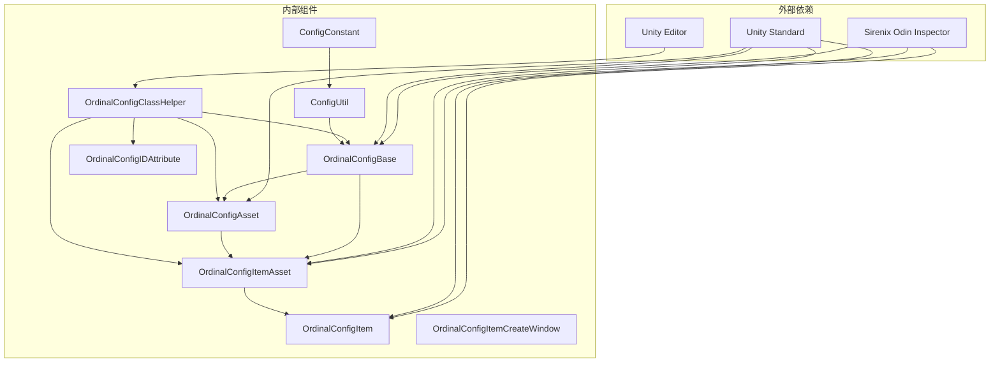

**图表来源**
- [OrdinalConfigBase.cs:1-11](file://Assets/Scripts/Systems/Implement/ConfigSystem/OrdinalConfig/OrdinalConfigBase.cs#L1-L11)
- [OrdinalConfigClassHelper.cs:1-9](file://Assets/Scripts/Editor/Config/OrdinalConfigClassHelper.cs#L1-L9)

### 耦合度分析

系统设计遵循低耦合高内聚的原则：

- **抽象层次清晰**: 基类和接口分离，便于扩展
- **依赖方向单一**: 所有依赖都指向抽象层
- **接口稳定**: 核心接口保持稳定，避免频繁变更
- **模板隔离**: 模板文件与业务逻辑分离

**章节来源**
- [OrdinalConfigBase.cs:15-17](file://Assets/Scripts/Systems/Implement/ConfigSystem/OrdinalConfig/OrdinalConfigBase.cs#L15-L17)
- [OrdinalConfigAsset.cs:13-14](file://Assets/Scripts/Systems/Implement/ConfigSystem/OrdinalConfig/OrdinalConfigAsset.cs#L13-L14)

## 性能考虑

### 缓存策略

系统采用字典缓存机制提升查询性能：

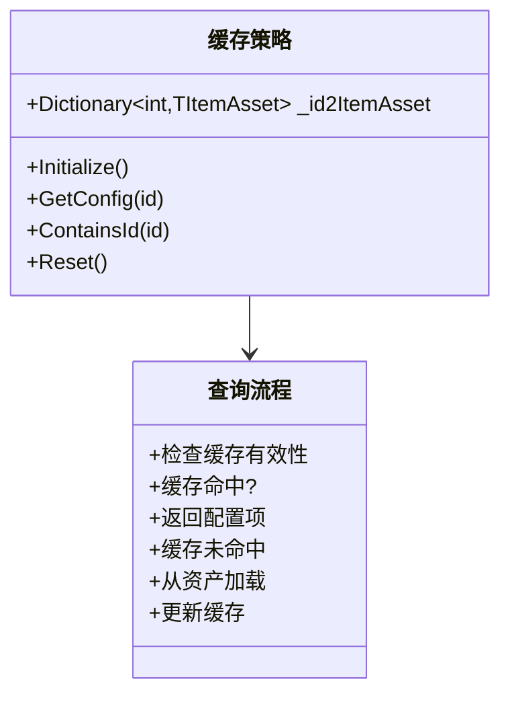

**图表来源**
- [OrdinalConfigBase.cs:24-145](file://Assets/Scripts/Systems/Implement/ConfigSystem/OrdinalConfig/OrdinalConfigBase.cs#L24-L145)

### 性能优化建议

1. **延迟初始化**: 配置在首次使用时才加载，减少启动时间
2. **增量更新**: 修改配置时只更新受影响的部分
3. **批量操作**: 支持批量导入导出配置数据
4. **内存管理**: 及时释放不再使用的配置引用

### 内存使用优化

- **按需加载**: 配置项仅在需要时加载到内存
- **弱引用**: 对于大型配置使用弱引用避免内存泄漏
- **对象池**: 重用配置对象减少GC压力

## 故障排除指南

### 常见问题诊断

#### 配置加载失败

**症状**: 配置无法加载或返回空值

**排查步骤**:
1. 检查配置资产是否存在
2. 验证配置路径是否正确
3. 确认配置文件格式是否正确
4. 检查是否有权限问题

**解决方法**:
```csharp
// 检查配置状态
if (!config.CheckValid())
{
    // 尝试重新初始化
    config.Reset();
    config.Initialize();
}
```

#### 重复ID冲突

**症状**: 控制台出现重复ID警告

**解决方法**:
1. 使用编辑器的ID分配功能获取新ID
2. 手动修改冲突的ID值
3. 使用配置纠错功能自动修复

#### 编辑器功能异常

**症状**: 编辑器窗口无法打开或功能失效

**排查步骤**:
1. 检查模板文件是否完整
2. 验证类继承关系是否正确
3. 确认编辑器菜单项注册是否正常

**章节来源**
- [OrdinalConfigBase.cs:96-107](file://Assets/Scripts/Systems/Implement/ConfigSystem/OrdinalConfig/OrdinalConfigBase.cs#L96-L107)
- [OrdinalConfigBase.cs:511-567](file://Assets/Scripts/Systems/Implement/ConfigSystem/OrdinalConfig/OrdinalConfigBase.cs#L511-L567)

### 调试技巧

1. **日志输出**: 启用详细的日志输出跟踪配置加载过程
2. **断点调试**: 在关键节点设置断点观察数据状态
3. **单元测试**: 编写测试用例验证配置功能
4. **性能分析**: 使用Unity Profiler分析配置系统的性能影响

## 结论

OrdinalConfig模板系统为ProjectR项目提供了一个强大、灵活且易于使用的配置管理解决方案。通过模板生成、类型安全和完善的编辑器支持，系统显著提升了配置开发的效率和质量。

### 主要优势

1. **模板驱动**: 自动生成完整的配置系统，减少重复代码
2. **类型安全**: 编译时检查配置类型，避免运行时错误
3. **编辑友好**: 完善的编辑器支持，提升配置制作体验
4. **扩展性强**: 清晰的架构设计，便于功能扩展和定制

### 最佳实践建议

1. **命名规范**: 严格遵守配置类命名约定
2. **版本管理**: 建立配置版本控制流程
3. **测试覆盖**: 为重要配置编写单元测试
4. **文档维护**: 及时更新配置使用文档

该系统为大型游戏项目的配置管理提供了坚实的基础设施，通过持续的优化和完善，将继续为项目开发提供可靠的支持。