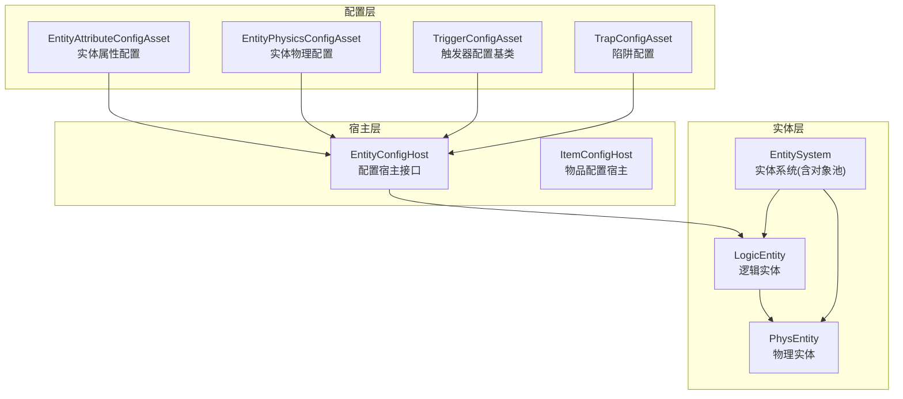
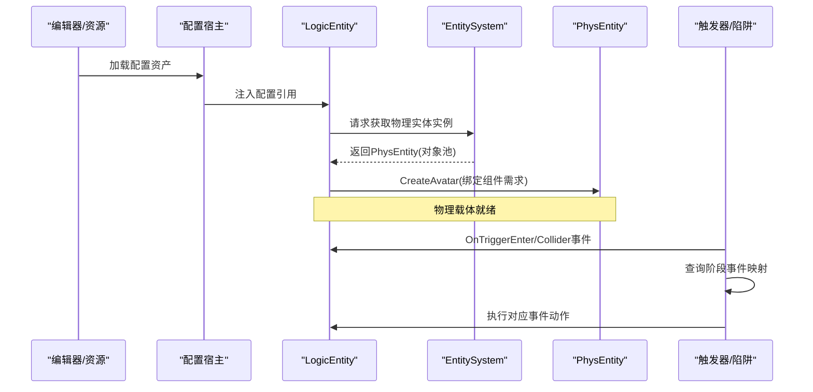
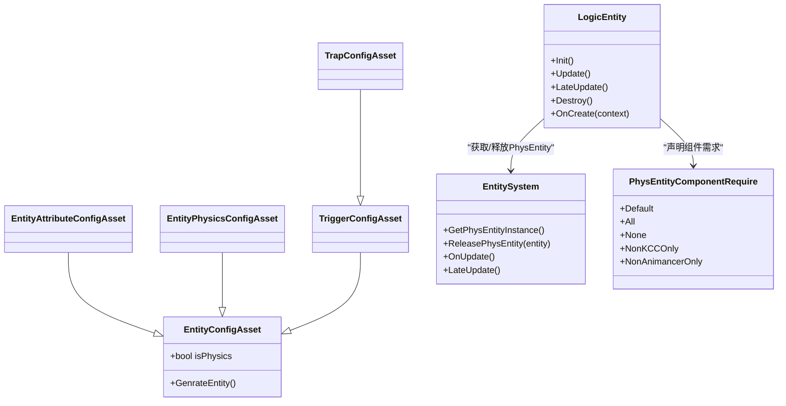

# 实体配置系统

<cite>
**本文引用的文件**
- [EntityAttributeConfigAsset.cs](file://Assets/Scripts/Config/Entity/EntityAttributeConfigAsset.cs)
- [EntityPhysicsConfigAsset.cs](file://Assets/Scripts/Config/Entity/EntityPhysicsConfigAsset.cs)
- [EntityAttributeDefine.cs](file://Assets/Scripts/Game/Define/EntityAttributeDefine.cs)
- [EntityConfigAsset.cs](file://Assets/Scripts/Config/Entity/EntityConfigAsset.cs)
- [TriggerConfigAsset.cs](file://Assets/Scripts/Config/Entity/TriggerConfigAsset.cs)
- [TrapConfigAsset.cs](file://Assets/Scripts/Config/Entity/Trap/TrapConfigAsset.cs)
- [LogicEntity.cs](file://Assets/Scripts/Systems/Implement/EntitySystem/LogicEntity/LogicEntity.cs)
- [PhysEntityComponentRequire.cs](file://Assets/Scripts/Systems/Implement/EntitySystem/PhysEntity/PhysEntityComponentRequire.cs)
- [EntitySystem.Phys.cs](file://Assets/Scripts/Systems/Implement/EntitySystem/EntitySystem.Phys.cs)
- [EntitySystem.Logic.cs](file://Assets/Scripts/Systems/Implement/EntitySystem/EntitySystem.Logic.cs)
- [TrapEntity.cs](file://Assets/Scripts/Modules/Traps/TrapEntity.cs)
- [SceneEventTrigger.cs](file://Assets/Scripts/Modules/Triggers/SceneEventTrigger.cs)
- [EntityAttributeConfigAsset.asset](file://Assets/Dev/Assets_/EntityAttributeConfigAsset.asset)
- [EntityPhysicsConfig.asset](file://Assets/Dev/Assets_/EntityPhysicsConfig.asset)
</cite>

## 目录
1. [简介](#简介)
2. [项目结构](#项目结构)
3. [核心组件](#核心组件)
4. [架构总览](#架构总览)
5. [详细组件分析](#详细组件分析)
6. [依赖关系分析](#依赖关系分析)
7. [性能考虑](#性能考虑)
8. [故障排查指南](#故障排查指南)
9. [结论](#结论)
10. [附录](#附录)

## 简介
本文件系统性梳理 ProjectR 的实体配置体系，覆盖三类配置：实体属性配置（生命值、攻击力、受身等）、实体物理配置（移动、跳跃、重力等）与触发器配置（触发区域、事件响应与交互）。文档从架构、数据结构、处理流程、扩展指南到性能优化与故障排查进行完整阐述，帮助开发者快速理解并正确使用实体配置系统。

## 项目结构
实体配置系统围绕“配置资产（ScriptableObject）+ 配置宿主（ConfigHost）+ 运行时实体（LogicEntity/PhysEntity）”三层组织：
- 配置层：以 ScriptableObject 保存实体属性与物理参数，以及触发器事件映射。
- 宿主层：通过 ConfigHost 将配置资产挂接到运行时实体上，供逻辑读取。
- 实体层：LogicEntity 负责行为与状态机；PhysEntity 提供物理与渲染载体；EntitySystem 管理生命周期与对象池。

图表来源
- [EntityAttributeConfigAsset.cs:1-34](file://Assets/Scripts/Config/Entity/EntityAttributeConfigAsset.cs#L1-L34)
- [EntityPhysicsConfigAsset.cs:1-42](file://Assets/Scripts/Config/Entity/EntityPhysicsConfigAsset.cs#L1-L42)
- [TriggerConfigAsset.cs:1-42](file://Assets/Scripts/Config/Entity/TriggerConfigAsset.cs#L1-L42)
- [TrapConfigAsset.cs:1-41](file://Assets/Scripts/Config/Entity/Trap/TrapConfigAsset.cs#L1-L41)
- [EntityConfigAsset.cs:1-19](file://Assets/Scripts/Config/Entity/EntityConfigAsset.cs#L1-L19)
- [LogicEntity.cs:1-41](file://Assets/Scripts/Systems/Implement/EntitySystem/LogicEntity/LogicEntity.cs#L1-L41)
- [EntitySystem.Phys.cs:1-114](file://Assets/Scripts/Systems/Implement/EntitySystem/EntitySystem.Phys.cs#L1-L114)

章节来源
- [EntityAttributeConfigAsset.cs:1-34](file://Assets/Scripts/Config/Entity/EntityAttributeConfigAsset.cs#L1-L34)
- [EntityPhysicsConfigAsset.cs:1-42](file://Assets/Scripts/Config/Entity/EntityPhysicsConfigAsset.cs#L1-L42)
- [TriggerConfigAsset.cs:1-42](file://Assets/Scripts/Config/Entity/TriggerConfigAsset.cs#L1-L42)
- [TrapConfigAsset.cs:1-41](file://Assets/Scripts/Config/Entity/Trap/TrapConfigAsset.cs#L1-L41)
- [EntityConfigAsset.cs:1-19](file://Assets/Scripts/Config/Entity/EntityConfigAsset.cs#L1-L19)
- [LogicEntity.cs:1-41](file://Assets/Scripts/Systems/Implement/EntitySystem/LogicEntity/LogicEntity.cs#L1-L41)
- [EntitySystem.Phys.cs:1-114](file://Assets/Scripts/Systems/Implement/EntitySystem/EntitySystem.Phys.cs#L1-L114)

## 核心组件
- 实体属性配置（EntityAttributeConfigAsset）
  - 职责：集中定义角色攻击、受身相关的时间与数值参数，便于统一编辑与复用。
  - 关键字段：角色攻击伤害、攻击间隔、硬直时间、击退时间、被击飞时间、起身无敌时间、无敌时间等。
- 实体物理配置（EntityPhysicsConfigAsset）
  - 职责：集中定义地面/空中移动、跳跃、重力、速度衰减、转向等物理参数。
  - 关键字段：地面最大移动速度、地面移动加速度、加速时地面最大移动速度、加速时地面移动加速度、空中最大移动速度、空中移动加速度、跳跃上升速度、可跳跃次数、重力加速度、速度衰减系数、速度衰减系数（受伤害时）、转向系数等。
- 触发器配置（TriggerConfigAsset）
  - 职责：定义触发区域与事件映射，支持按阶段（如进入、离开）分派事件。
  - 关键机制：阶段到事件的缓存映射、按阶段查询与执行。
- 陷阱配置（TrapConfigAsset）
  - 职责：在触发器基础上增加“可触发次数”限制，控制事件执行频次。
  - 关键机制：在执行事件前检查触发计数，超过上限则忽略。
- 实体系统（EntitySystem）
  - 职责：提供实体生命周期管理、对象池、全局更新循环。
  - 关键能力：物理实体对象池、逻辑实体字典索引、销毁回收、全局 Update/LateUpdate 驱动。
- 逻辑实体（LogicEntity）
  - 职责：实体的业务逻辑入口，负责创建物理载体、绑定输入、状态机与绘制调试。
- 物理实体组件需求（PhysEntityComponentRequire）
  - 职责：声明物理实体所需组件集合（如 KCC、Animancer、Collider），支持多种组合模式。

章节来源
- [EntityAttributeConfigAsset.cs:10-34](file://Assets/Scripts/Config/Entity/EntityAttributeConfigAsset.cs#L10-L34)
- [EntityPhysicsConfigAsset.cs:10-42](file://Assets/Scripts/Config/Entity/EntityPhysicsConfigAsset.cs#L10-L42)
- [TriggerConfigAsset.cs:8-42](file://Assets/Scripts/Config/Entity/TriggerConfigAsset.cs#L8-L42)
- [TrapConfigAsset.cs:13-41](file://Assets/Scripts/Config/Entity/Trap/TrapConfigAsset.cs#L13-L41)
- [EntitySystem.Phys.cs:33-114](file://Assets/Scripts/Systems/Implement/EntitySystem/EntitySystem.Phys.cs#L33-L114)
- [LogicEntity.cs:8-41](file://Assets/Scripts/Systems/Implement/EntitySystem/LogicEntity/LogicEntity.cs#L8-L41)
- [PhysEntityComponentRequire.cs:6-41](file://Assets/Scripts/Systems/Implement/EntitySystem/PhysEntity/PhysEntityComponentRequire.cs#L6-L41)

## 架构总览
下图展示了实体配置在运行时的装配与调用链路：配置资产经由宿主注入到 LogicEntity，LogicEntity 在创建阶段通过 EntitySystem 获取 PhysEntity 并建立 Avatar，随后在运行时根据触发器配置响应 Collider 事件。

图表来源
- [LogicEntity.cs:26-39](file://Assets/Scripts/Systems/Implement/EntitySystem/LogicEntity/LogicEntity.cs#L26-L39)
- [EntitySystem.Phys.cs:83-107](file://Assets/Scripts/Systems/Implement/EntitySystem/EntitySystem.Phys.cs#L83-L107)
- [TrapEntity.cs:11-31](file://Assets/Scripts/Modules/Traps/TrapEntity.cs#L11-L31)
- [TriggerConfigAsset.cs:31-42](file://Assets/Scripts/Config/Entity/TriggerConfigAsset.cs#L31-L42)

## 详细组件分析

### 实体属性配置（EntityAttributeConfigAsset）
- 字段类别与含义
  - 攻击：角色攻击伤害、攻击间隔
  - 受身：硬直时间、击退时间、被击飞时间、起身无敌时间、无敌时间
- 设计要点
  - 使用 OdinInspector 标注标题与标签，提升编辑体验
  - 编辑器菜单项用于一键创建配置资产
- 应用方式
  - 通过 EntityConfigHost 将该资产挂接到具体实体类型（如玩家、怪物）

章节来源
- [EntityAttributeConfigAsset.cs:10-34](file://Assets/Scripts/Config/Entity/EntityAttributeConfigAsset.cs#L10-L34)

### 实体物理配置（EntityPhysicsConfigAsset）
- 字段类别与含义
  - 地面移动：最大移动速度、移动加速度、加速时最大速度、加速时加速度
  - 空中移动：最大移动速度、移动加速度
  - 跳跃：跳跃上升速度、可跳跃次数
  - 其他：重力加速度、速度衰减系数、受伤害时速度衰减、转向系数
- 设计要点
  - 分组标题与标签增强可读性
  - 编辑器菜单项用于创建物理配置资产
- 应用方式
  - 作为实体上下文的一部分，在实体创建时读取并驱动 KCC/动画等模块

章节来源
- [EntityPhysicsConfigAsset.cs:10-42](file://Assets/Scripts/Config/Entity/EntityPhysicsConfigAsset.cs#L10-L42)

### 触发器配置（TriggerConfigAsset）
- 结构与职责
  - 抽象基类，维护“阶段到事件”的映射缓存
  - 提供按阶段查询与执行的方法
- 性能与可用性
  - 初始化时构建字典映射，避免重复查找
  - 提供 TryGet/TryExecute 等安全访问接口

章节来源
- [TriggerConfigAsset.cs:8-42](file://Assets/Scripts/Config/Entity/TriggerConfigAsset.cs#L8-L42)

### 陷阱配置（TrapConfigAsset）
- 扩展点
  - 在触发器基础上增加“可触发次数”上限
  - 在执行事件前检查触发计数，超过上限则跳过
- 适用场景
  - 一次性陷阱、有限次数陷阱、可重置陷阱等

章节来源
- [TrapConfigAsset.cs:13-41](file://Assets/Scripts/Config/Entity/Trap/TrapConfigAsset.cs#L13-L41)

### 逻辑实体与物理实体（LogicEntity/PhysEntity）
- 创建流程
  - LogicEntity.OnCreate 中向 EntitySystem 申请 PhysEntity 实例
  - 通过 CreateAvatar 绑定组件需求（KCC、Animancer、Collider 等）
- 生命周期
  - EntitySystem 提供全局 Update/LateUpdate 驱动
  - 销毁时释放回对象池，确保内存与性能稳定

章节来源
- [LogicEntity.cs:26-39](file://Assets/Scripts/Systems/Implement/EntitySystem/LogicEntity/LogicEntity.cs#L26-L39)
- [EntitySystem.Phys.cs:33-114](file://Assets/Scripts/Systems/Implement/EntitySystem/EntitySystem.Phys.cs#L33-L114)

### 触发器事件响应（示例：SceneEventTrigger 与 TrapEntity）
- SceneEventTrigger
  - 校验触发器目标合法性（仅玩家）
  - 计数与可触发次数控制
  - 触发时抛出事件并记录触发次数
- TrapEntity
  - 订阅 OnTriggerEnter 事件
  - 通过配置资产按阶段执行事件

章节来源
- [SceneEventTrigger.cs:58-86](file://Assets/Scripts/Modules/Triggers/SceneEventTrigger.cs#L58-L86)
- [TrapEntity.cs:26-31](file://Assets/Scripts/Modules/Traps/TrapEntity.cs#L26-L31)

## 依赖关系分析
- 配置资产与宿主
  - EntityAttributeConfigAsset、EntityPhysicsConfigAsset、TriggerConfigAsset、TrapConfigAsset 均继承自 EntityConfigAsset，统一了配置资产的宿主接入方式。
- 实体系统与实体
  - LogicEntity 依赖 EntitySystem 获取/释放 PhysEntity，EntitySystem 内部维护对象池与全局更新循环。
- 组件需求
  - PhysEntityComponentRequire 定义了不同实体对组件的需求组合，保证创建时按需装配。

图表来源
- [EntityConfigAsset.cs:8-19](file://Assets/Scripts/Config/Entity/EntityConfigAsset.cs#L8-L19)
- [EntityAttributeConfigAsset.cs:10-34](file://Assets/Scripts/Config/Entity/EntityAttributeConfigAsset.cs#L10-L34)
- [EntityPhysicsConfigAsset.cs:10-42](file://Assets/Scripts/Config/Entity/EntityPhysicsConfigAsset.cs#L10-L42)
- [TriggerConfigAsset.cs:9-42](file://Assets/Scripts/Config/Entity/TriggerConfigAsset.cs#L9-L42)
- [TrapConfigAsset.cs:13-41](file://Assets/Scripts/Config/Entity/Trap/TrapConfigAsset.cs#L13-L41)
- [LogicEntity.cs:8-41](file://Assets/Scripts/Systems/Implement/EntitySystem/LogicEntity/LogicEntity.cs#L8-L41)
- [EntitySystem.Phys.cs:33-114](file://Assets/Scripts/Systems/Implement/EntitySystem/EntitySystem.Phys.cs#L33-L114)
- [PhysEntityComponentRequire.cs:6-41](file://Assets/Scripts/Systems/Implement/EntitySystem/PhysEntity/PhysEntityComponentRequire.cs#L6-L41)

章节来源
- [EntityConfigAsset.cs:8-19](file://Assets/Scripts/Config/Entity/EntityConfigAsset.cs#L8-L19)
- [LogicEntity.cs:8-41](file://Assets/Scripts/Systems/Implement/EntitySystem/LogicEntity/LogicEntity.cs#L8-L41)
- [EntitySystem.Phys.cs:33-114](file://Assets/Scripts/Systems/Implement/EntitySystem/EntitySystem.Phys.cs#L33-L114)
- [PhysEntityComponentRequire.cs:6-41](file://Assets/Scripts/Systems/Implement/EntitySystem/PhysEntity/PhysEntityComponentRequire.cs#L6-L41)

## 性能考虑
- 对象池与内存管理
  - EntitySystem 使用对象池管理 PhysEntity，减少频繁 Instantiate/GC 压力；销毁时仅释放至池，不立即销毁 GameObject。
- 更新循环
  - 逻辑实体统一由 EntitySystem 驱动 Update/LateUpdate，避免分散更新带来的性能抖动。
- 触发器缓存
  - TriggerConfigAsset 在初始化时建立阶段到事件的字典映射，降低运行时查找成本。
- 组件按需装配
  - 通过 PhysEntityComponentRequire 控制组件启用，避免不必要的脚本与渲染开销。

章节来源
- [EntitySystem.Phys.cs:33-114](file://Assets/Scripts/Systems/Implement/EntitySystem/EntitySystem.Phys.cs#L33-L114)
- [TriggerConfigAsset.cs:22-40](file://Assets/Scripts/Config/Entity/TriggerConfigAsset.cs#L22-L40)
- [PhysEntityComponentRequire.cs:6-41](file://Assets/Scripts/Systems/Implement/EntitySystem/PhysEntity/PhysEntityComponentRequire.cs#L6-L41)

## 故障排查指南
- 实体创建失败
  - 现象：日志提示无法创建物理实体
  - 排查：确认 EntitySystem 是否处于 PlayMode，对象池是否正常初始化
- 触发无效
  - 现象：触发器无响应或未按预期触发
  - 排查：检查 Collider 是否为触发器、目标是否为玩家、触发次数是否已达上限、阶段事件映射是否正确
- 性能异常
  - 现象：帧率下降或 GC 压力增大
  - 排查：确认实体销毁路径是否正确、对象池是否被滥用、是否存在每帧大量临时分配

章节来源
- [LogicEntity.cs:29-33](file://Assets/Scripts/Systems/Implement/EntitySystem/LogicEntity/LogicEntity.cs#L29-L33)
- [TrapEntity.cs:14-18](file://Assets/Scripts/Modules/Traps/TrapEntity.cs#L14-L18)
- [SceneEventTrigger.cs:58-86](file://Assets/Scripts/Modules/Triggers/SceneEventTrigger.cs#L58-L86)

## 结论
实体配置系统通过“配置资产 + 宿主 + 实体”的分层设计，实现了属性、物理与触发器的解耦与复用。借助对象池、缓存映射与按需组件装配，系统在易用性与性能之间取得平衡。建议在扩展新实体类型时遵循现有模式，优先使用配置资产与宿主，避免硬编码参数，确保一致的调试与维护体验。

## 附录

### 实体属性与物理参数对照表
- 属性参数（示例）
  - 生命值（Hp）
  - 攻击力（Attack）
- 物理参数（示例）
  - 地面最大移动速度
  - 地面移动加速度
  - 加速时地面最大移动速度
  - 加速时地面移动加速度
  - 空中最大移动速度
  - 空中移动加速度
  - 跳跃上升速度
  - 可跳跃次数
  - 重力加速度
  - 速度衰减系数
  - 速度衰减系数（受伤害时）
  - 转向系数

章节来源
- [EntityAttributeDefine.cs:3-44](file://Assets/Scripts/Game/Define/EntityAttributeDefine.cs#L3-L44)

### 实体配置在不同实体类型中的应用差异
- 玩家
  - 通常启用 KCC 与 Animancer，具备完整的地面/空中移动与跳跃能力
- 怪物
  - 可按需禁用 KCC，仅保留动画与碰撞，减少计算开销
- 环境物体
  - 多为静态或被动触发，组件需求最小化，侧重触发器与事件响应

章节来源
- [PhysEntityComponentRequire.cs:6-41](file://Assets/Scripts/Systems/Implement/EntitySystem/PhysEntity/PhysEntityComponentRequire.cs#L6-L41)
- [TrapEntity.cs:19](file://Assets/Scripts/Modules/Traps/TrapEntity.cs#L19)

### 实体配置扩展指南
- 添加自定义属性
  - 在 EntityAttributeConfigAsset 或新增的配置资产中添加字段
  - 在 EntityAttributeDefine 中注册属性 ID 与中文名
- 配置验证
  - 使用 OdinInspector 的标签与校验特性，确保参数范围合理
  - 在编辑器菜单中提供一键创建资产的入口
- 触发器扩展
  - 新增阶段事件时，确保 TriggerConfigAsset 的映射缓存生效
  - 陷阱类可复用触发器基类，按需增加计数/冷却等控制

章节来源
- [EntityAttributeConfigAsset.cs:25-31](file://Assets/Scripts/Config/Entity/EntityAttributeConfigAsset.cs#L25-L31)
- [EntityPhysicsConfigAsset.cs:34-40](file://Assets/Scripts/Config/Entity/EntityPhysicsConfigAsset.cs#L34-L40)
- [TriggerConfigAsset.cs:22-40](file://Assets/Scripts/Config/Entity/TriggerConfigAsset.cs#L22-L40)

### 示例：实体属性与物理配置资源
- 实体属性配置资源
  - 路径：Assets/Dev/Assets_/EntityAttributeConfigAsset.asset
  - 字段：角色攻击伤害、攻击间隔、硬直时间、击退时间、被击飞时间、起身无敌时间、无敌时间
- 实体物理配置资源
  - 路径：Assets/Dev/Assets_/EntityPhysicsConfig.asset
  - 字段：地面/空中移动、跳跃、重力、速度衰减、转向等

章节来源
- [EntityAttributeConfigAsset.asset:24-30](file://Assets/Dev/Assets_/EntityAttributeConfigAsset.asset#L24-L30)
- [EntityPhysicsConfig.asset:15-26](file://Assets/Dev/Assets_/EntityPhysicsConfig.asset#L15-L26)