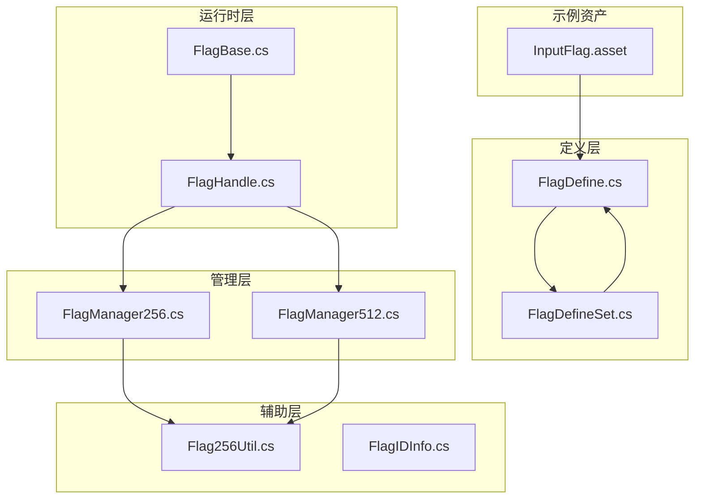
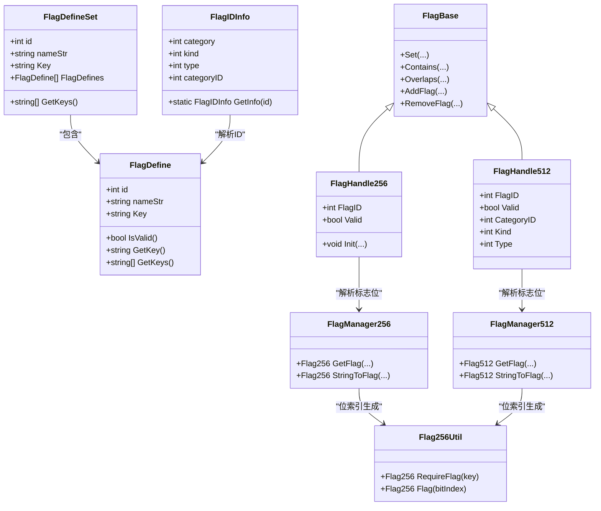
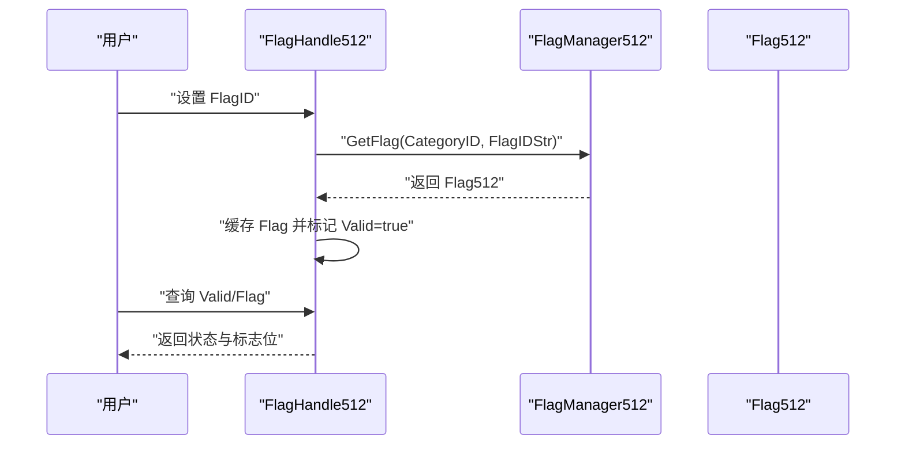
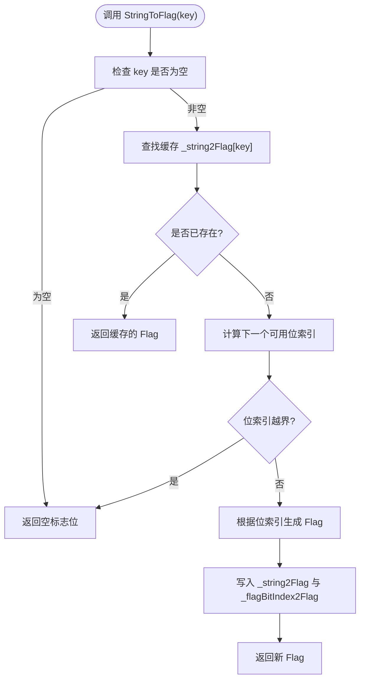
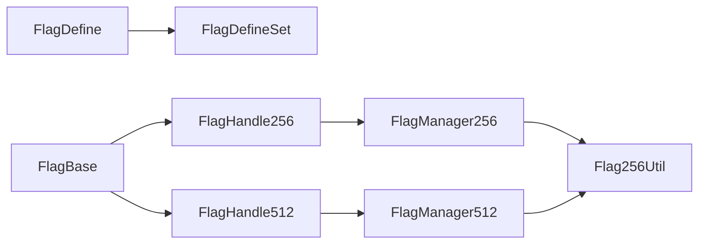

# 标志位配置系统

<cite>
**本文引用的文件**
- [FlagDefine.cs](file://Assets/Plugins/PJR/BitwiseFlags/FlagDefine.cs)
- [FlagDefineSet.cs](file://Assets/Plugins/PJR/BitwiseFlags/FlagDefineSet.cs)
- [FlagBase.cs](file://Assets/Plugins/PJR/BitwiseFlags/FlagBase.cs)
- [FlagHandle.cs](file://Assets/Plugins/PJR/BitwiseFlags/FlagHandle.cs)
- [Flag256Util.cs](file://Assets/Plugins/PJR/BitwiseFlags/Flag256Util.cs)
- [FlagManager256.cs](file://Assets/Plugins/PJR/BitwiseFlags/Gen/FlagManager256.cs)
- [FlagManager512.cs](file://Assets/Plugins/PJR/BitwiseFlags/Gen/FlagManager512.cs)
- [FlagIDInfo.cs](file://Assets/Plugins/PJR/BitwiseFlags/FlagIDInfo.cs)
- [InputFlag.asset](file://Assets/Dev/Flag/InputFlag.asset)
</cite>

## 目录
1. [简介](#简介)
2. [项目结构](#项目结构)
3. [核心组件](#核心组件)
4. [架构总览](#架构总览)
5. [详细组件分析](#详细组件分析)
6. [依赖关系分析](#依赖关系分析)
7. [性能考量](#性能考量)
8. [故障排查指南](#故障排查指南)
9. [结论](#结论)
10. [附录](#附录)

## 简介
本文件系统性阐述 ProjectR 项目的“标志位配置系统”，围绕以下目标展开：
- 设计理念与应用场景：游戏状态标记、开关控制、条件判断
- FlagConfig 的实现机制：标志位的定义、设置与查询
- 标志位资产的创建与管理：命名规范与分类管理
- 使用指南与最佳实践：在游戏逻辑中的应用
- 流程控制中的作用：关卡解锁、成就系统、剧情推进
- 性能与内存优化策略

该系统以位运算为核心，通过“键到位索引”的映射，将字符串键安全地映射到固定宽度的位向量（256/512位），从而实现高效的状态标记与组合判断。

## 项目结构
标志位配置系统主要由以下模块构成：
- 定义层：FlagDefine、FlagDefineSet 提供标志位的元数据与集合管理
- 运行时层：FlagBase、FlagHandle 提供运行时的标志位封装与编辑器可视化
- 管理层：FlagManager256、FlagManager512 负责键到标志位的映射与缓存
- 辅助层：Flag256Util、FlagIDInfo 提供位索引计算与 ID 解析工具
- 示例资产：InputFlag.asset 展示了如何在工程中创建与引用标志位配置

图表来源
- [FlagDefine.cs:1-114](file://Assets/Plugins/PJR/BitwiseFlags/FlagDefine.cs#L1-L114)
- [FlagDefineSet.cs:1-136](file://Assets/Plugins/PJR/BitwiseFlags/FlagDefineSet.cs#L1-L136)
- [FlagBase.cs:1-156](file://Assets/Plugins/PJR/BitwiseFlags/FlagBase.cs#L1-L156)
- [FlagHandle.cs:1-420](file://Assets/Plugins/PJR/BitwiseFlags/FlagHandle.cs#L1-L420)
- [FlagManager256.cs:1-115](file://Assets/Plugins/PJR/BitwiseFlags/Gen/FlagManager256.cs#L1-L115)
- [FlagManager512.cs:1-129](file://Assets/Plugins/PJR/BitwiseFlags/Gen/FlagManager512.cs#L1-L129)
- [Flag256Util.cs:1-54](file://Assets/Plugins/PJR/BitwiseFlags/Flag256Util.cs#L1-L54)
- [FlagIDInfo.cs:1-80](file://Assets/Plugins/PJR/BitwiseFlags/FlagIDInfo.cs#L1-L80)
- [InputFlag.asset:1-31](file://Assets/Dev/Flag/InputFlag.asset#L1-L31)

章节来源
- [FlagDefine.cs:1-114](file://Assets/Plugins/PJR/BitwiseFlags/FlagDefine.cs#L1-L114)
- [FlagDefineSet.cs:1-136](file://Assets/Plugins/PJR/BitwiseFlags/FlagDefineSet.cs#L1-L136)
- [FlagBase.cs:1-156](file://Assets/Plugins/PJR/BitwiseFlags/FlagBase.cs#L1-L156)
- [FlagHandle.cs:1-420](file://Assets/Plugins/PJR/BitwiseFlags/FlagHandle.cs#L1-L420)
- [FlagManager256.cs:1-115](file://Assets/Plugins/PJR/BitwiseFlags/Gen/FlagManager256.cs#L1-L115)
- [FlagManager512.cs:1-129](file://Assets/Plugins/PJR/BitwiseFlags/Gen/FlagManager512.cs#L1-L129)
- [Flag256Util.cs:1-54](file://Assets/Plugins/PJR/BitwiseFlags/Flag256Util.cs#L1-L54)
- [FlagIDInfo.cs:1-80](file://Assets/Plugins/PJR/BitwiseFlags/FlagIDInfo.cs#L1-L80)
- [InputFlag.asset:1-31](file://Assets/Dev/Flag/InputFlag.asset#L1-L31)

## 核心组件
- 标志位定义与集合
  - FlagDefine：单个标志位的元数据，包含 id、名称、Key 等，提供校验与键访问接口
  - FlagDefineSet：标志位集合，支持列表增删与编辑器校验提示
- 运行时封装与操作
  - FlagBase：抽象基类，提供设置、包含、重叠、添加、移除等位运算操作
  - FlagHandle256/FlagHandle512：运行时句柄，负责从管理器解析并缓存标志位，提供编辑器可视化与选择器
- 管理与映射
  - FlagManager256/FlagManager512：按类别维护键到标志位的映射，支持批量与单键转换
  - Flag256Util：提供便捷的位索引与标志位生成工具
- ID 解析
  - FlagIDInfo：解析统一格式的标志位 ID，拆分为大类、小类、类型三段式信息

章节来源
- [FlagDefine.cs:10-114](file://Assets/Plugins/PJR/BitwiseFlags/FlagDefine.cs#L10-L114)
- [FlagDefineSet.cs:11-136](file://Assets/Plugins/PJR/BitwiseFlags/FlagDefineSet.cs#L11-L136)
- [FlagBase.cs:6-120](file://Assets/Plugins/PJR/BitwiseFlags/FlagBase.cs#L6-L120)
- [FlagHandle.cs:12-420](file://Assets/Plugins/PJR/BitwiseFlags/FlagHandle.cs#L12-L420)
- [FlagManager256.cs:2-115](file://Assets/Plugins/PJR/BitwiseFlags/Gen/FlagManager256.cs#L2-L115)
- [FlagManager512.cs:2-129](file://Assets/Plugins/PJR/BitwiseFlags/Gen/FlagManager512.cs#L2-L129)
- [Flag256Util.cs:5-54](file://Assets/Plugins/PJR/BitwiseFlags/Flag256Util.cs#L5-L54)
- [FlagIDInfo.cs:1-80](file://Assets/Plugins/PJR/BitwiseFlags/FlagIDInfo.cs#L1-L80)

## 架构总览
系统采用“定义-映射-句柄-操作”的分层架构：
- 定义层：通过 FlagDefine/FlagDefineSet 维护标志位元数据
- 映射层：FlagManagerXxx 将 Key 映射到具体位向量，缓存位索引
- 句柄层：FlagHandleXxx 提供运行时访问与编辑器交互
- 操作层：FlagBase 提供位运算语义（包含、重叠、或/与/非）

图表来源
- [FlagDefine.cs:10-114](file://Assets/Plugins/PJR/BitwiseFlags/FlagDefine.cs#L10-L114)
- [FlagDefineSet.cs:11-136](file://Assets/Plugins/PJR/BitwiseFlags/FlagDefineSet.cs#L11-L136)
- [FlagBase.cs:6-120](file://Assets/Plugins/PJR/BitwiseFlags/FlagBase.cs#L6-L120)
- [FlagHandle.cs:12-420](file://Assets/Plugins/PJR/BitwiseFlags/FlagHandle.cs#L12-L420)
- [FlagManager256.cs:2-115](file://Assets/Plugins/PJR/BitwiseFlags/Gen/FlagManager256.cs#L2-L115)
- [FlagManager512.cs:2-129](file://Assets/Plugins/PJR/BitwiseFlags/Gen/FlagManager512.cs#L2-L129)
- [Flag256Util.cs:5-54](file://Assets/Plugins/PJR/BitwiseFlags/Flag256Util.cs#L5-L54)
- [FlagIDInfo.cs:1-80](file://Assets/Plugins/PJR/BitwiseFlags/FlagIDInfo.cs#L1-L80)

## 详细组件分析

### 标志位定义与集合
- FlagDefine
  - 字段：id、nameStr、Key；提供 IDStr 缓存、FlagIDInfo 访问
  - 接口：IFlagDefine，提供 ID、Name、IsValid、GetKey、GetKeys
  - 编辑器：OnGUI 支持可视化编辑与选择按钮
- FlagDefineSet
  - 字段：id、nameStr、Key、FlagDefines 列表
  - 编辑器：自动生成新 ID、列表元素校验、保存资产
  - 接口：继承 IFlagDefine，聚合多个 FlagDefine 的 Key

章节来源
- [FlagDefine.cs:10-114](file://Assets/Plugins/PJR/BitwiseFlags/FlagDefine.cs#L10-L114)
- [FlagDefineSet.cs:11-136](file://Assets/Plugins/PJR/BitwiseFlags/FlagDefineSet.cs#L11-L136)

### 运行时封装与操作
- FlagBase
  - 抽象泛型基类，约束 FlagType 实现 IBitwiseFlag
  - 提供 Set/Set(List)/Set(string[]) 设置标志位
  - 提供 Contains/Overlaps 判断包含关系
  - 提供 AddFlag/RemoveFlag 执行位运算
- FlagHandle256/FlagHandle512
  - 通过 FlagManagerXxx 将 FlagID 解析为 FlagXxx
  - 提供 Valid 校验、编辑器可视化与选择器
  - FlagHandle512 额外暴露 CategoryID/Kind/Type 解析能力

图表来源
- [FlagHandle.cs:147-420](file://Assets/Plugins/PJR/BitwiseFlags/FlagHandle.cs#L147-L420)
- [FlagManager512.cs:15-49](file://Assets/Plugins/PJR/BitwiseFlags/Gen/FlagManager512.cs#L15-L49)

章节来源
- [FlagBase.cs:6-120](file://Assets/Plugins/PJR/BitwiseFlags/FlagBase.cs#L6-L120)
- [FlagHandle.cs:12-420](file://Assets/Plugins/PJR/BitwiseFlags/FlagHandle.cs#L12-L420)

### 管理与映射
- FlagManager256/FlagManager512
  - 单例式按类别管理，提供 GetFlag 与 StringToFlag
  - 内部维护 key->Flag 与 bitIndex->Flag 的双映射缓存
  - 位索引递增分配，上限受位宽限制
- Flag256Util
  - 提供 RequireFlag 与 Flag(bitIndex) 工具
  - 用于快速生成或复用特定位索引对应的标志位

图表来源
- [FlagManager256.cs:70-113](file://Assets/Plugins/PJR/BitwiseFlags/Gen/FlagManager256.cs#L70-L113)
- [FlagManager512.cs:76-101](file://Assets/Plugins/PJR/BitwiseFlags/Gen/FlagManager512.cs#L76-L101)
- [Flag256Util.cs:13-30](file://Assets/Plugins/PJR/BitwiseFlags/Flag256Util.cs#L13-L30)

章节来源
- [FlagManager256.cs:1-115](file://Assets/Plugins/PJR/BitwiseFlags/Gen/FlagManager256.cs#L1-L115)
- [FlagManager512.cs:1-129](file://Assets/Plugins/PJR/BitwiseFlags/Gen/FlagManager512.cs#L1-L129)
- [Flag256Util.cs:1-54](file://Assets/Plugins/PJR/BitwiseFlags/Flag256Util.cs#L1-L54)

### ID 解析与命名规范
- FlagIDInfo
  - 统一 ID 格式：category + kind + type（如 6003001）
  - 提供 GetInfo(id) 解析三段式信息，以及 categoryID 计算
- 命名规范与分类建议
  - Key：使用“命名空间.子命名空间...”的层级结构，便于生成器与查询
  - 名称：nameStr 使用“分类/子分类/具体项”的层级路径，利于编辑器菜单组织
  - ID：遵循 7 位以上数字，前缀为大类，中间为小类，末尾为类型

章节来源
- [FlagIDInfo.cs:37-79](file://Assets/Plugins/PJR/BitwiseFlags/FlagIDInfo.cs#L37-L79)
- [FlagDefine.cs:14-17](file://Assets/Plugins/PJR/BitwiseFlags/FlagDefine.cs#L14-L17)

### 示例资产与创建流程
- InputFlag.asset
  - 展示了 FlagDefineSet 的典型结构，包含 id、nameStr、FlagDefines 列表
  - FlagDefines 中的每个条目包含 id、nameStr、Key
- 创建与管理流程
  - 在编辑器中新建 FlagDefineSet 资产，添加 FlagDefine 条目
  - 填写 Key 与 nameStr，确保 Key 具备唯一性与可读性
  - 通过 FlagHandle 在运行时引用并查询标志位

章节来源
- [InputFlag.asset:27-31](file://Assets/Dev/Flag/InputFlag.asset#L27-L31)
- [FlagDefineSet.cs:18-89](file://Assets/Plugins/PJR/BitwiseFlags/FlagDefineSet.cs#L18-L89)

## 依赖关系分析
- 组件耦合
  - FlagDefine/FlagDefineSet 与 FlagHandle 弱耦合：通过 ID 与 Key 解耦
  - FlagHandle 依赖 FlagManagerXxx 进行解析，管理器内部依赖 Flag256Util
  - FlagBase 仅依赖 IBitwiseFlag 约束，便于扩展不同位宽实现
- 外部依赖
  - 编辑器可视化依赖 Sirenix Odin Inspector
  - Unity 资产系统用于 FlagDefineSet 的持久化与保存

图表来源
- [FlagDefine.cs:10-114](file://Assets/Plugins/PJR/BitwiseFlags/FlagDefine.cs#L10-L114)
- [FlagDefineSet.cs:11-136](file://Assets/Plugins/PJR/BitwiseFlags/FlagDefineSet.cs#L11-L136)
- [FlagHandle.cs:12-420](file://Assets/Plugins/PJR/BitwiseFlags/FlagHandle.cs#L12-L420)
- [FlagManager256.cs:2-115](file://Assets/Plugins/PJR/BitwiseFlags/Gen/FlagManager256.cs#L2-L115)
- [FlagManager512.cs:2-129](file://Assets/Plugins/PJR/BitwiseFlags/Gen/FlagManager512.cs#L2-L129)
- [Flag256Util.cs:5-54](file://Assets/Plugins/PJR/BitwiseFlags/Flag256Util.cs#L5-L54)
- [FlagBase.cs:6-120](file://Assets/Plugins/PJR/BitwiseFlags/FlagBase.cs#L6-L120)

## 性能考量
- 时间复杂度
  - 键到标志位映射：哈希表查找 O(1)，首次分配位索引 O(1)
  - 位运算：或/与/非/补集均为 O(1)
- 空间复杂度
  - FlagManagerXxx 维护两个字典：key->Flag 与 bitIndex->Flag，容量上限受位宽限制
  - Flag256Util 维护位索引到 Flag 的静态缓存，减少重复计算
- 优化建议
  - 合理规划 Key 命名，避免过长字符串导致哈希冲突
  - 控制标志位数量，优先使用 256 位版本以节省内存
  - 批量操作时合并多次 Set/Or，减少中间对象创建
  - 在编辑器中使用 FlagHandle 的 Valid 校验，避免无效查询

[本节为通用性能讨论，不直接分析具体文件]

## 故障排查指南
- 常见问题
  - Key 为空或无效：FlagDefine.IsValid 返回 false，GetKey 返回空
  - FlagID 未初始化或为空：FlagHandle.Valid=false，应检查 FlagManager 解析链路
  - 位索引越界：FlagManagerXxx 在超过位宽时返回空标志位并记录错误
- 定位步骤
  - 检查 FlagDefineSet 的 FlagDefines 列表与 Key 填写
  - 在编辑器中打开 FlagHandle，确认 FlagDefine 解析与菜单名称显示
  - 使用 FlagManager 的 GetFlag 方法验证 ID->Flag 解析
- 相关实现参考
  - FlagDefine 校验与键访问
  - FlagHandle 编辑器可视化与选择器
  - FlagManager 的越界保护与缓存逻辑

章节来源
- [FlagDefine.cs:60-81](file://Assets/Plugins/PJR/BitwiseFlags/FlagDefine.cs#L60-L81)
- [FlagHandle.cs:75-143](file://Assets/Plugins/PJR/BitwiseFlags/FlagHandle.cs#L75-L143)
- [FlagManager256.cs:74-78](file://Assets/Plugins/PJR/BitwiseFlags/Gen/FlagManager256.cs#L74-L78)
- [FlagManager512.cs:80-84](file://Assets/Plugins/PJR/BitwiseFlags/Gen/FlagManager512.cs#L80-L84)

## 结论
标志位配置系统通过“定义-映射-句柄-操作”的清晰分层，提供了高效、可维护的游戏状态标记方案。其核心优势在于：
- 以位运算实现 O(1) 的状态判断与组合
- 以 Key 与 ID 规范化管理，提升可读性与可维护性
- 编辑器友好，支持可视化选择与校验
- 可扩展性强，支持 256/512 位两种宽度

在实际项目中，建议结合关卡解锁、成就系统、剧情推进等场景，合理设计 Key 与 ID 分类，严格遵循命名规范，并充分利用缓存与批量操作以获得最佳性能。

[本节为总结性内容，不直接分析具体文件]

## 附录
- 应用场景示例
  - 游戏状态标记：角色状态、行为许可、环境交互
  - 开关控制：功能开关、难度等级、模组启用
  - 条件判断：任务完成条件、道具使用条件、剧情触发条件
- 最佳实践
  - Key 使用“领域.子域.具体项”的层级命名
  - ID 使用 7 位以上数字，前缀大类、中间小类、末尾类型
  - 优先使用 FlagHandle 的 Valid 校验，避免无效查询
  - 对高频判断进行缓存，减少重复解析

[本节为概念性内容，不直接分析具体文件]