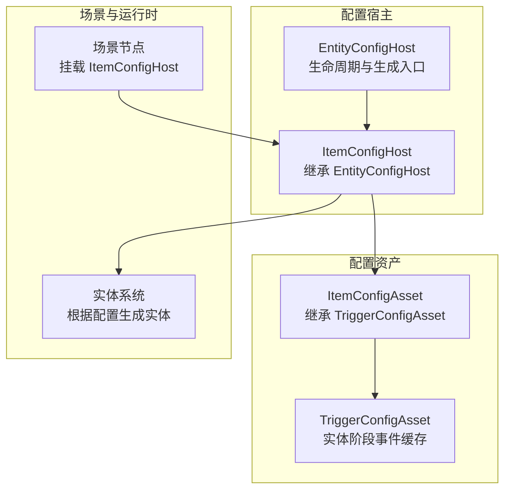
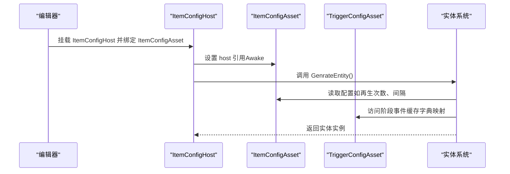
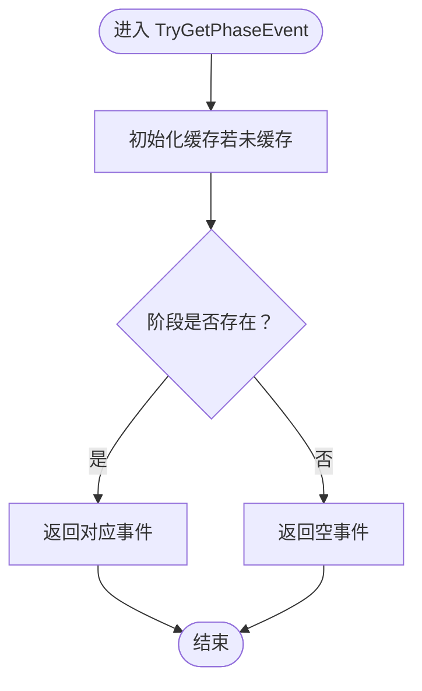
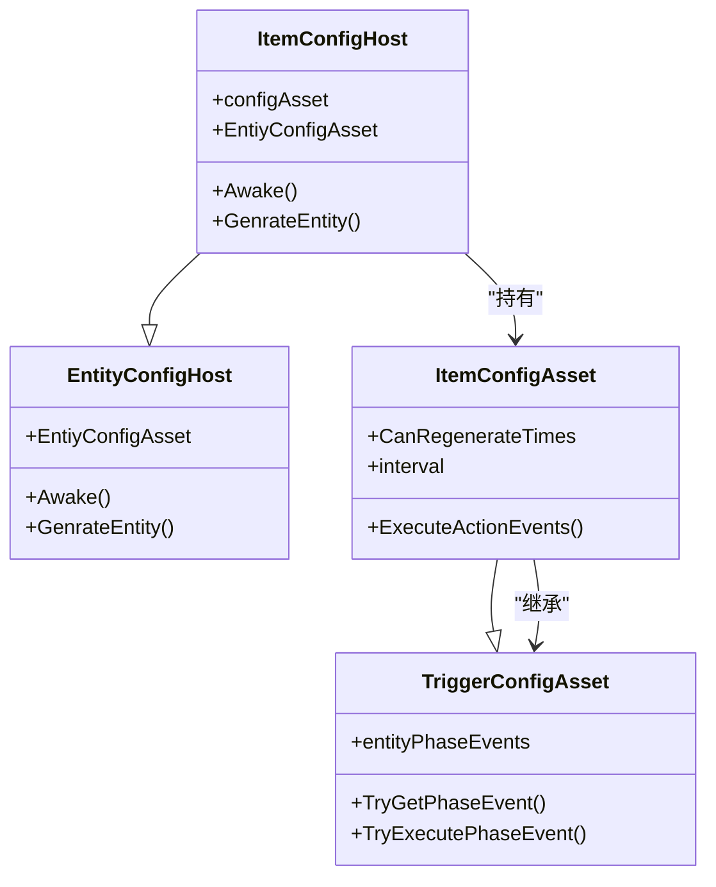
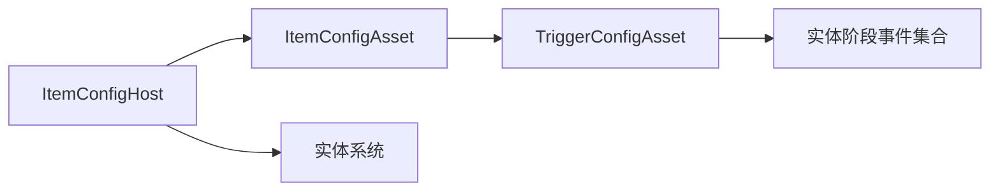

# 物品配置系统

<cite>
**本文引用的文件**
- [ItemConfigHost.cs](file://Assets/Scripts/Modules/Items/ItemConfigHost.cs)
- [ItemConfigAsset.cs](file://Assets/Scripts/Modules/Items/ItemConfigAsset.cs)
- [TriggerConfigAsset.cs](file://Assets/Scripts/Config/Entity/TriggerConfigAsset.cs)
- [EntityConfigHost.cs](file://Assets/Scripts/Mmodules/Entity/Scene/EntityConfigHost.cs)
- [ItemConfig_Star.asset](file://Assets/Dev/Assets_/ItemConfig_Star.asset)
- [TestDataItem.cs](file://Assets/Dev/Lab/Scripts/TestDataItem.cs)
</cite>

## 目录
1. [引言](#引言)
2. [项目结构](#项目结构)
3. [核心组件](#核心组件)
4. [架构总览](#架构总览)
5. [详细组件分析](#详细组件分析)
6. [依赖关系分析](#依赖关系分析)
7. [性能考虑](#性能考虑)
8. [故障排查指南](#故障排查指南)
9. [结论](#结论)
10. [附录](#附录)

## 引言
本文件系统性梳理 ProjectR 的“物品配置系统”，聚焦于道具、陷阱与触发类物品的配置数据结构、分类体系、加载与注册机制、查询流程以及扩展与集成方法。文档同时给出在商店系统、背包管理与战斗效果中的应用建议，并总结性能优化与数据一致性保障策略。

## 项目结构
物品配置系统围绕“配置资产（ScriptableObject）+ 配置宿主（EntityConfigHost 子类）”展开，采用“按模块分层”的组织方式：
- 配置资产：位于 Modules/Items 下的 ItemConfigAsset，继承自 TriggerConfigAsset，用于承载物品的可再生次数、再生间隔等属性。
- 配置宿主：位于 Modules/Items 下的 ItemConfigHost，继承自 EntityConfigHost，作为场景中挂载的配置容器，负责将配置资产绑定到运行时实体生成流程。
- 基础设施：TriggerConfigAsset 提供实体阶段事件（EntityPhaseEvent）的缓存与查询能力；EntityConfigHost 负责生命周期与实体生成入口。

图示来源
- [ItemConfigAsset.cs:12-31](file://Assets/Scripts/Modules/Items/ItemConfigAsset.cs#L12-L31)
- [TriggerConfigAsset.cs:9-42](file://Assets/Scripts/Config/Entity/TriggerConfigAsset.cs#L9-L42)
- [ItemConfigHost.cs:5-11](file://Assets/Scripts/Modules/Items/ItemConfigHost.cs#L5-L11)
- [EntityConfigHost.cs:6-31](file://Assets/Scripts/Mmodules/Entity/Scene/EntityConfigHost.cs#L6-L31)

章节来源
- [ItemConfigHost.cs:1-12](file://Assets/Scripts/Modules/Items/ItemConfigHost.cs#L1-L12)
- [ItemConfigAsset.cs:1-34](file://Assets/Scripts/Modules/Items/ItemConfigAsset.cs#L1-L34)
- [TriggerConfigAsset.cs:1-42](file://Assets/Scripts/Config/Entity/TriggerConfigAsset.cs#L1-L42)
- [EntityConfigHost.cs:1-32](file://Assets/Scripts/Mmodules/Entity/Scene/EntityConfigHost.cs#L1-L32)

## 核心组件
- ItemConfigAsset（物品配置资产）
  - 继承 TriggerConfigAsset，新增“可再生次数”“再生间隔”等字段，支持编辑器菜单快速创建。
  - 提供执行阶段事件的扩展点（ExecuteActionEvents），默认委托基类实现。
- TriggerConfigAsset（触发类配置基类）
  - 管理实体阶段事件列表（entityPhaseEvents），内部以字典缓存阶段到事件映射，提供 TryGetPhaseEvent/TryExecutePhaseEvent 等查询与执行接口。
- ItemConfigHost（物品配置宿主）
  - 绑定 ItemConfigAsset，作为场景节点挂载，负责将配置资产与实体生成流程对接。
- EntityConfigHost（实体配置宿主基类）
  - 统一处理配置资产的生命周期绑定与实体生成入口（GenrateEntity）。

章节来源
- [ItemConfigAsset.cs:12-31](file://Assets/Scripts/Modules/Items/ItemConfigAsset.cs#L12-L31)
- [TriggerConfigAsset.cs:9-42](file://Assets/Scripts/Config/Entity/TriggerConfigAsset.cs#L9-L42)
- [ItemConfigHost.cs:5-11](file://Assets/Scripts/Modules/Items/ItemConfigHost.cs#L5-L11)
- [EntityConfigHost.cs:6-31](file://Assets/Scripts/Mmodules/Entity/Scene/EntityConfigHost.cs#L6-L31)

## 架构总览
物品配置系统遵循“资产-宿主-系统”的分层架构：
- 资产层：以 ScriptableObject 承载配置数据，便于在编辑器中可视化编辑与版本管理。
- 宿主层：以 EntityConfigHost 子类作为场景节点，负责将资产注入到运行时系统。
- 系统层：实体系统根据配置生成实体，执行阶段事件或触发使用效果。

图示来源
- [EntityConfigHost.cs:14-30](file://Assets/Scripts/Mmodules/Entity/Scene/EntityConfigHost.cs#L14-L30)
- [ItemConfigHost.cs:5-11](file://Assets/Scripts/Modules/Items/ItemConfigHost.cs#L5-L11)
- [ItemConfigAsset.cs:12-31](file://Assets/Scripts/Modules/Items/ItemConfigAsset.cs#L12-L31)
- [TriggerConfigAsset.cs:22-42](file://Assets/Scripts/Config/Entity/TriggerConfigAsset.cs#L22-L42)

## 详细组件分析

### ItemConfigAsset（物品配置资产）
- 职责
  - 定义物品的可再生属性（次数、间隔）。
  - 提供编辑器菜单项，一键创建新的物品配置资产。
  - 扩展执行阶段事件的处理逻辑（默认委托基类）。
- 关键字段
  - 可再生次数：整型，<=0 表示无限次，>0 表示固定次数。
  - 再生间隔：浮点数，控制再生时间间隔。
- 复杂度与性能
  - 字段访问为 O(1)，执行阶段事件通过缓存字典查找为 O(1)。

章节来源
- [ItemConfigAsset.cs:12-31](file://Assets/Scripts/Modules/Items/ItemConfigAsset.cs#L12-L31)

### TriggerConfigAsset（触发类配置基类）
- 职责
  - 维护实体阶段事件列表，并在首次访问时构建阶段到事件的字典缓存。
  - 提供查询与执行阶段事件的接口，避免重复遍历。
- 数据结构与复杂度
  - 缓存结构：Dictionary<PhyEntityPhase, EntityPhaseEvent>，初始化后查询为 O(1)。
  - 初始化开销：单次 O(n) 构建缓存，后续查询摊还 O(1)。
- 错误处理
  - 未初始化时自动初始化缓存，避免空引用。

图示来源
- [TriggerConfigAsset.cs:22-40](file://Assets/Scripts/Config/Entity/TriggerConfigAsset.cs#L22-L40)

章节来源
- [TriggerConfigAsset.cs:9-42](file://Assets/Scripts/Config/Entity/TriggerConfigAsset.cs#L9-L42)

### ItemConfigHost（物品配置宿主）
- 职责
  - 绑定 ItemConfigAsset，作为场景节点承载配置。
  - 将配置资产与实体生成流程对接，统一调用 GenrateEntity。
- 生命周期
  - Awake 中将 host 引用回设给配置资产，确保资产侧可访问宿主信息。
  - GenrateEntity 默认委托给配置资产执行。

图示来源
- [EntityConfigHost.cs:6-31](file://Assets/Scripts/Mmodules/Entity/Scene/EntityConfigHost.cs#L6-L31)
- [ItemConfigHost.cs:5-11](file://Assets/Scripts/Modules/Items/ItemConfigHost.cs#L5-L11)
- [ItemConfigAsset.cs:12-31](file://Assets/Scripts/Modules/Items/ItemConfigAsset.cs#L12-L31)
- [TriggerConfigAsset.cs:9-42](file://Assets/Scripts/Config/Entity/TriggerConfigAsset.cs#L9-L42)

章节来源
- [ItemConfigHost.cs:1-12](file://Assets/Scripts/Modules/Items/ItemConfigHost.cs#L1-L12)
- [EntityConfigHost.cs:1-32](file://Assets/Scripts/Mmodules/Entity/Scene/EntityConfigHost.cs#L1-L32)

### 配置资产示例与编辑器集成
- 示例资产
  - ItemConfig_Star.asset 展示了实体阶段事件与引用对象（如 ItemMethod_Star）的配置方式，包含速度、持续时间、朝向锐度等参数。
- 编辑器工具
  - TestDataItem.cs 展示了编辑器标签与内联编辑器的使用方式，可用于验证编辑器集成与序列化行为。

章节来源
- [ItemConfig_Star.asset:15-31](file://Assets/Dev/Assets_/ItemConfig_Star.asset#L15-L31)
- [TestDataItem.cs:4-12](file://Assets/Dev/Lab/Scripts/TestDataItem.cs#L4-L12)

## 依赖关系分析
- 组件耦合
  - ItemConfigHost 与 ItemConfigAsset 强耦合（持有关系）。
  - ItemConfigAsset 与 TriggerConfigAsset 弱耦合（继承关系）。
  - TriggerConfigAsset 与实体阶段事件模型弱耦合（数据持有）。
- 外部依赖
  - 编辑器菜单项依赖 OdinInspector。
  - 运行时依赖实体系统进行实体生成与事件执行。

图示来源
- [ItemConfigHost.cs:5-11](file://Assets/Scripts/Modules/Items/ItemConfigHost.cs#L5-L11)
- [ItemConfigAsset.cs:12-31](file://Assets/Scripts/Modules/Items/ItemConfigAsset.cs#L12-L31)
- [TriggerConfigAsset.cs:9-42](file://Assets/Scripts/Config/Entity/TriggerConfigAsset.cs#L9-L42)

章节来源
- [ItemConfigHost.cs:1-12](file://Assets/Scripts/Modules/Items/ItemConfigHost.cs#L1-L12)
- [ItemConfigAsset.cs:1-34](file://Assets/Scripts/Modules/Items/ItemConfigAsset.cs#L1-L34)
- [TriggerConfigAsset.cs:1-42](file://Assets/Scripts/Config/Entity/TriggerConfigAsset.cs#L1-L42)

## 性能考虑
- 查询缓存
  - 实体阶段事件通过字典缓存，避免每次查询都遍历列表，提升查询效率。
- 初始化成本摊销
  - 首次访问时一次性构建缓存，后续查询摊还 O(1)，适合高频查询场景。
- 资源占用
  - 配置资产为 ScriptableObject，常驻内存；建议合理拆分资产数量，避免过大配置对象。
- 冗余字段
  - 可再生次数与间隔字段为简单数值类型，访问成本极低，适合热路径使用。

## 故障排查指南
- 配置资产为空
  - 现象：生成实体时报错“配置资产为空”。
  - 排查：确认场景节点上已挂载 ItemConfigHost 并正确绑定 ItemConfigAsset。
  - 参考
    - [EntityConfigHost.cs:22-29](file://Assets/Scripts/Mmodules/Entity/Scene/EntityConfigHost.cs#L22-L29)
- 阶段事件未生效
  - 现象：实体阶段事件未被触发。
  - 排查：检查 TriggerConfigAsset 是否已初始化缓存；确认实体阶段是否匹配。
  - 参考
    - [TriggerConfigAsset.cs:22-42](file://Assets/Scripts/Config/Entity/TriggerConfigAsset.cs#L22-L42)
- 再生逻辑异常
  - 现象：物品无法按预期再生。
  - 排查：核对 CanRegenerateTimes 与 interval 的值；确认实体系统是否正确读取配置。
  - 参考
    - [ItemConfigAsset.cs:14-18](file://Assets/Scripts/Modules/Items/ItemConfigAsset.cs#L14-L18)

章节来源
- [EntityConfigHost.cs:22-30](file://Assets/Scripts/Mmodules/Entity/Scene/EntityConfigHost.cs#L22-L30)
- [TriggerConfigAsset.cs:22-42](file://Assets/Scripts/Config/Entity/TriggerConfigAsset.cs#L22-L42)
- [ItemConfigAsset.cs:14-18](file://Assets/Scripts/Modules/Items/ItemConfigAsset.cs#L14-L18)

## 结论
物品配置系统以“资产-宿主-系统”三层架构清晰分离关注点：资产层负责数据与编辑器体验，宿主层负责场景集成与生命周期，系统层负责实体生成与事件执行。通过字典缓存与简单的数值字段设计，系统在查询与运行时性能上具备良好表现。结合示例资产与编辑器工具，开发者可快速扩展自定义物品类型并接入效果系统。

## 附录

### 物品配置字段说明（核心）
- 物品ID：由资产命名与资源索引决定（示例：ItemConfig_Star.asset）。
- 名称：资产名称（如 ItemConfig_Star）。
- 描述：可通过编辑器注释或附加文本资产补充。
- 图标：可通过编辑器内联预览或资源引用配置。
- 使用效果：通过实体阶段事件与引用对象（如 ItemMethod_Star）定义，包含速度、持续时间、朝向锐度等参数。

章节来源
- [ItemConfig_Star.asset:13-31](file://Assets/Dev/Assets_/ItemConfig_Star.asset#L13-L31)

### 扩展指南：自定义物品类型与效果系统集成
- 新增物品类型
  - 步骤：新建继承自 TriggerConfigAsset 的配置资产类，添加所需字段；在编辑器中提供创建菜单项。
  - 参考
    - [ItemConfigAsset.cs:20-26](file://Assets/Scripts/Modules/Items/ItemConfigAsset.cs#L20-L26)
- 集成效果系统
  - 在实体阶段事件中绑定具体效果类（如 ItemMethod_Star），并在实体系统中按阶段执行。
  - 参考
    - [TriggerConfigAsset.cs:13-14](file://Assets/Scripts/Config/Entity/TriggerConfigAsset.cs#L13-L14)
    - [ItemConfig_Star.asset:22-31](file://Assets/Dev/Assets_/ItemConfig_Star.asset#L22-L31)

### 应用场景建议
- 商店系统
  - 使用物品配置资产作为商品模板，读取名称、图标与价格字段，动态生成购买界面。
- 背包管理
  - 以物品ID为键，结合可再生次数与间隔控制显示与使用状态。
- 战斗效果
  - 在实体阶段事件中触发使用效果，如临时属性加成、位移或控制。