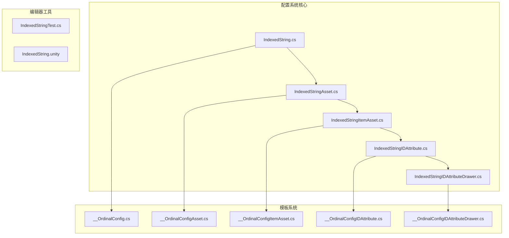
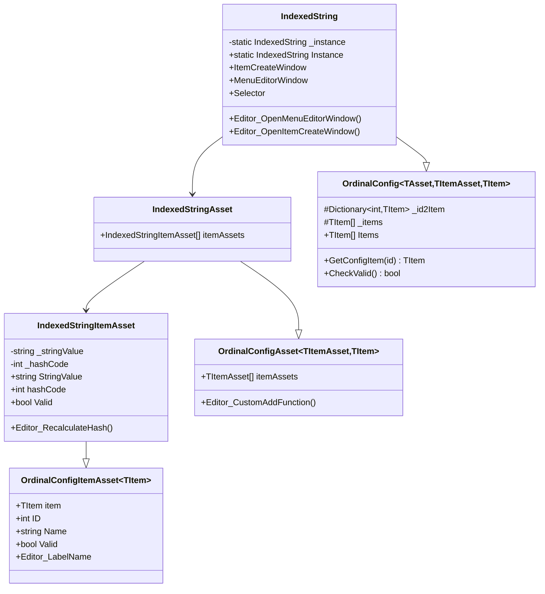
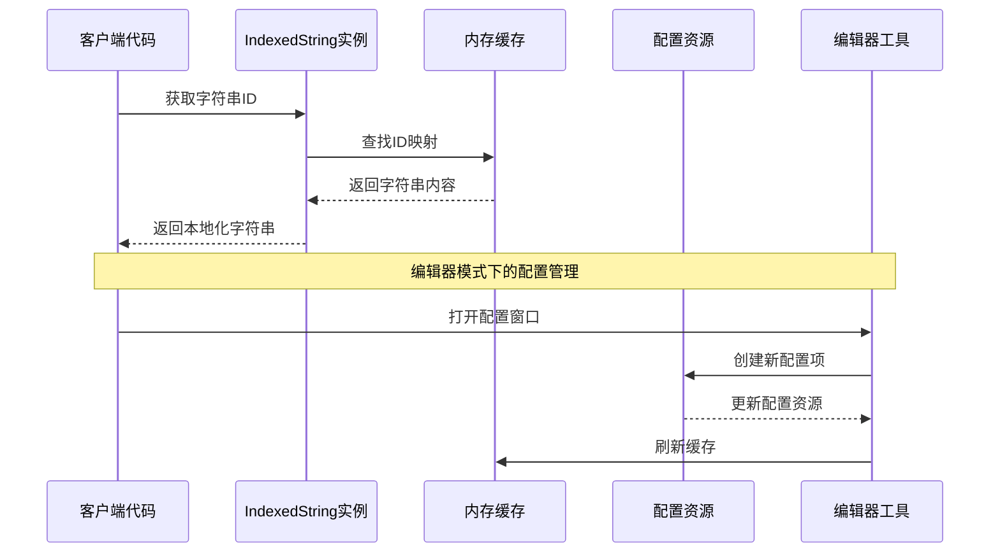
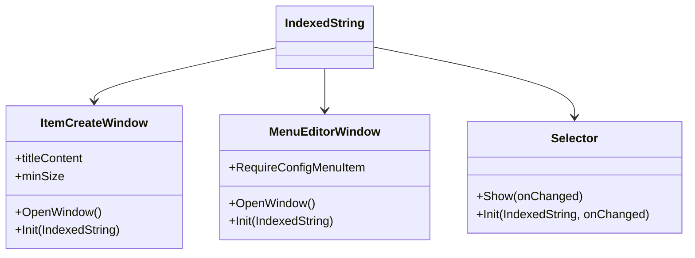
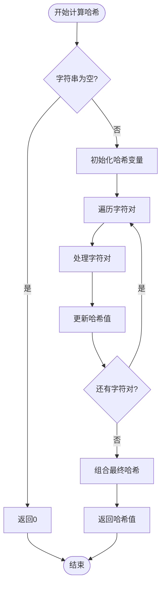
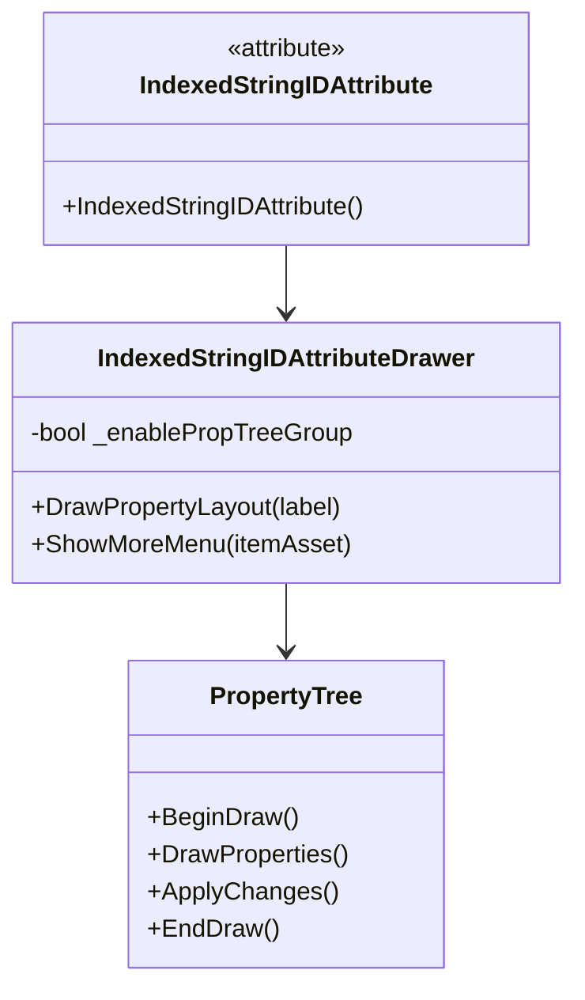
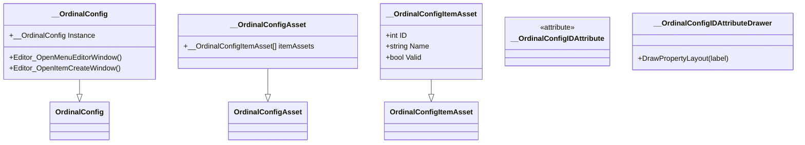
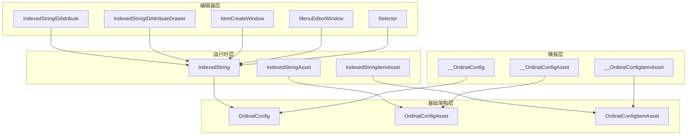
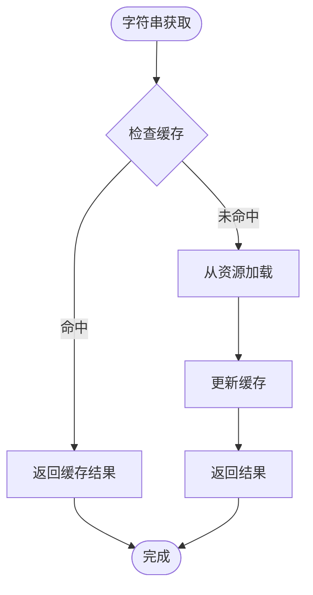

# 索引字符串配置系统

<cite>
**本文档引用的文件**
- [IndexedString.cs](file://Assets/Scripts/Config/IndexedString/IndexedString.cs)
- [IndexedStringAsset.cs](file://Assets/Scripts/Config/IndexedString/IndexedStringAsset.cs)
- [IndexedStringItemAsset.cs](file://Assets/Scripts/Config/IndexedString/IndexedStringItemAsset.cs)
- [IndexedStringIDAttribute.cs](file://Assets/Scripts/Config/IndexedString/IndexedStringIDAttribute.cs)
- [IndexedStringIDAttributeDrawer.cs](file://Assets/Scripts/Config/IndexedString/IndexedStringIDAttributeDrawer.cs)
- [IndexedStringTest.cs](file://Assets/Dev/Lab/IndexedString/IndexedStringTest.cs)
- [IndexedString.unity](file://Assets/Dev/Lab/IndexedString/IndexedString.unity)
- [OrdinalConfig.cs](file://Assets/Scripts/Systems/Implement/ConfigSystem/OrdinalConfig/OrdinalConfig.cs)
- [OrdinalConfigAsset.cs](file://Assets/Scripts/Systems/Implement/ConfigSystem/OrdinalConfig/OrdinalConfigAsset.cs)
- [OrdinalConfigItemAsset.cs](file://Assets/Scripts/Systems/Implement/ConfigSystem/OrdinalConfig/OrdinalConfigItemAsset.cs)
- [__OrdinalConfig.cs](file://Assets/Resources/OrdinalConfigTemplate/__OrdinalConfig.cs)
- [__OrdinalConfigAsset.cs](file://Assets/Resources/OrdinalConfigTemplate/__OrdinalConfigAsset.cs)
- [__OrdinalConfigItemAsset.cs](file://Assets/Resources/OrdinalConfigTemplate/__OrdinalConfigItemAsset.cs)
- [__OrdinalConfigIDAttribute.cs](file://Assets/Resources/OrdinalConfigTemplate/__OrdinalConfigIDAttribute.cs)
- [__OrdinalConfigIDAttributeDrawer.cs](file://Assets/Resources/OrdinalConfigTemplate/__OrdinalConfigIDAttributeDrawer.cs)
</cite>

## 目录
1. [简介](#简介)
2. [项目结构](#项目结构)
3. [核心组件](#核心组件)
4. [架构概览](#架构概览)
5. [详细组件分析](#详细组件分析)
6. [依赖关系分析](#依赖关系分析)
7. [性能考虑](#性能考虑)
8. [故障排除指南](#故障排除指南)
9. [结论](#结论)
10. [附录](#附录)

## 简介

ProjectR项目的索引字符串配置系统是一个专门为游戏开发设计的本地化和国际化解决方案。该系统通过索引字符串机制，实现了高效的内容管理和多语言支持，为游戏提供了灵活的文本配置能力。

索引字符串系统的核心设计理念是通过数值ID来标识和访问字符串内容，这种设计带来了以下优势：
- **性能优化**：使用整数ID进行快速查找，避免了字符串匹配的开销
- **内存效率**：通过统一的字符串池管理，减少重复字符串的内存占用
- **本地化支持**：为未来的多语言内容管理奠定了基础
- **编辑器集成**：提供了完整的编辑器工具链，支持可视化配置管理

## 项目结构

索引字符串配置系统采用模块化设计，主要包含以下核心目录和文件：



**图表来源**
- [IndexedString.cs:1-58](file://Assets/Scripts/Config/IndexedString/IndexedString.cs#L1-L58)
- [IndexedStringAsset.cs:1-9](file://Assets/Scripts/Config/IndexedString/IndexedStringAsset.cs#L1-L9)
- [IndexedStringItemAsset.cs:1-71](file://Assets/Scripts/Config/IndexedString/IndexedStringItemAsset.cs#L1-L71)

**章节来源**
- [IndexedString.cs:1-58](file://Assets/Scripts/Config/IndexedString/IndexedString.cs#L1-L58)
- [IndexedStringAsset.cs:1-9](file://Assets/Scripts/Config/IndexedString/IndexedStringAsset.cs#L1-L9)
- [IndexedStringItemAsset.cs:1-71](file://Assets/Scripts/Config/IndexedString/IndexedStringItemAsset.cs#L1-L71)

## 核心组件

索引字符串配置系统由多个相互协作的组件构成，每个组件都有明确的职责和功能：

### 主要组件架构



**图表来源**
- [IndexedString.cs:6-56](file://Assets/Scripts/Config/IndexedString/IndexedString.cs#L6-L56)
- [IndexedStringAsset.cs:4-7](file://Assets/Scripts/Config/IndexedString/IndexedStringAsset.cs#L4-L7)
- [IndexedStringItemAsset.cs:7-44](file://Assets/Scripts/Config/IndexedString/IndexedStringItemAsset.cs#L7-L44)
- [OrdinalConfig.cs:17-68](file://Assets/Scripts/Systems/Implement/ConfigSystem/OrdinalConfig/OrdinalConfig.cs#L17-L68)

### 数据结构设计

索引字符串系统采用以下核心数据结构：

| 组件 | 类型 | 描述 | 复杂度 |
|------|------|------|--------|
| `_id2Item` | Dictionary<int, TItem> | ID到对象的映射表 | O(1)查找 |
| `_items` | List<TItem> | 有序列表存储 | O(n)遍历 |
| `StringValue` | string | 字符串内容 | O(1)访问 |
| `hashCode` | int | 哈希校验值 | O(1)计算 |

**章节来源**
- [IndexedString.cs:22-28](file://Assets/Scripts/Config/IndexedString/IndexedString.cs#L22-L28)
- [IndexedStringItemAsset.cs:17-18](file://Assets/Scripts/Config/IndexedString/IndexedStringItemAsset.cs#L17-L18)
- [OrdinalConfig.cs:22-28](file://Assets/Scripts/Systems/Implement/ConfigSystem/OrdinalConfig/OrdinalConfig.cs#L22-L28)

## 架构概览

索引字符串配置系统基于有序配置（OrdinalConfig）架构构建，提供了完整的配置管理生命周期：



**图表来源**
- [IndexedString.cs:8-9](file://Assets/Scripts/Config/IndexedString/IndexedString.cs#L8-L9)
- [OrdinalConfig.cs:34-46](file://Assets/Scripts/Systems/Implement/ConfigSystem/OrdinalConfig/OrdinalConfig.cs#L34-L46)

系统架构的关键特点：
- **单例模式**：确保全局唯一性
- **延迟初始化**：按需加载配置资源
- **缓存机制**：提高访问性能
- **编辑器集成**：完整的可视化管理工具

## 详细组件分析

### IndexedString 主控制器

IndexedString是索引字符串系统的主控制器，负责协调整个配置系统的运行：

#### 核心功能特性

| 功能 | 实现方式 | 性能影响 |
|------|----------|----------|
| 单例管理 | 静态实例字段 | 无额外开销 |
| 编辑器窗口 | 自定义EditorWindow | 运行时无影响 |
| 配置创建 | ItemCreateWindow | 按需创建 |
| 菜单编辑 | MenuEditorWindow | 按需创建 |

#### 编辑器工具链



**图表来源**
- [IndexedString.cs:25-54](file://Assets/Scripts/Config/IndexedString/IndexedString.cs#L25-L54)

**章节来源**
- [IndexedString.cs:6-56](file://Assets/Scripts/Config/IndexedString/IndexedString.cs#L6-L56)

### IndexedStringItemAsset 数据模型

IndexedStringItemAsset是配置项的数据模型，包含了字符串内容和相关元数据：

#### 数据模型结构

| 字段 | 类型 | 用途 | 验证规则 |
|------|------|------|----------|
| `_stringValue` | string | 实际字符串内容 | 必须非空 |
| `_hashCode` | int | 哈希校验值 | 必须大于0 |
| `ID` | int | 配置唯一标识 | 必须大于0 |
| `Name` | string | 配置显示名称 | 与字符串内容关联 |

#### 哈希算法实现

系统使用自定义的确定性哈希算法来确保一致性：



**图表来源**
- [IndexedStringItemAsset.cs:46-69](file://Assets/Scripts/Config/IndexedString/IndexedStringItemAsset.cs#L46-L69)

**章节来源**
- [IndexedStringItemAsset.cs:7-44](file://Assets/Scripts/Config/IndexedString/IndexedStringItemAsset.cs#L7-L44)
- [IndexedStringItemAsset.cs:46-69](file://Assets/Scripts/Config/IndexedString/IndexedStringItemAsset.cs#L46-L69)

### 编辑器属性系统

IndexedStringIDAttribute和对应的绘制器提供了强大的编辑器集成能力：

#### 属性系统架构



**图表来源**
- [IndexedStringIDAttribute.cs:6-11](file://Assets/Scripts/Config/IndexedString/IndexedStringIDAttribute.cs#L6-L11)
- [IndexedStringIDAttributeDrawer.cs:9-101](file://Assets/Scripts/Config/IndexedString/IndexedStringIDAttributeDrawer.cs#L9-L101)

#### 编辑器功能特性

| 功能 | 实现方式 | 用户体验 |
|------|----------|----------|
| 实时预览 | 按钮点击查看 | 即时反馈 |
| 快速导航 | PingObject定位 | 直观操作 |
| 批量操作 | 复制/删除菜单 | 提高效率 |
| 属性树 | 折叠面板编辑 | 结构化管理 |

**章节来源**
- [IndexedStringIDAttributeDrawer.cs:13-101](file://Assets/Scripts/Config/IndexedString/IndexedStringIDAttributeDrawer.cs#L13-L101)

### 模板系统

系统提供了完整的配置模板，支持快速生成新的配置类型：

#### 模板继承关系



**图表来源**
- [__OrdinalConfig.cs:8-32](file://Assets/Resources/OrdinalConfigTemplate/__OrdinalConfig.cs#L8-L32)
- [__OrdinalConfigAsset.cs:4-8](file://Assets/Resources/OrdinalConfigTemplate/__OrdinalConfigAsset.cs#L4-L8)
- [__OrdinalConfigItemAsset.cs:4-7](file://Assets/Resources/OrdinalConfigTemplate/__OrdinalConfigItemAsset.cs#L4-L7)

**章节来源**
- [__OrdinalConfig.cs:1-32](file://Assets/Resources/OrdinalConfigTemplate/__OrdinalConfig.cs#L1-L32)
- [__OrdinalConfigAsset.cs:1-9](file://Assets/Resources/OrdinalConfigTemplate/__OrdinalConfigAsset.cs#L1-L9)
- [__OrdinalConfigItemAsset.cs:1-8](file://Assets/Resources/OrdinalConfigTemplate/__OrdinalConfigItemAsset.cs#L1-L8)

## 依赖关系分析

索引字符串配置系统具有清晰的依赖层次结构，各组件之间的耦合度适中：



**图表来源**
- [IndexedString.cs:6-56](file://Assets/Scripts/Config/IndexedString/IndexedString.cs#L6-L56)
- [OrdinalConfig.cs:17-128](file://Assets/Scripts/Systems/Implement/ConfigSystem/OrdinalConfig/OrdinalConfig.cs#L17-L128)

### 关键依赖关系

1. **继承关系**：所有配置类都继承自相应的基类
2. **组合关系**：资产类包含具体的配置项列表
3. **编辑器依赖**：编辑器功能仅在编辑器模式下可用
4. **模板继承**：提供可扩展的配置类型生成机制

**章节来源**
- [OrdinalConfig.cs:17-128](file://Assets/Scripts/Systems/Implement/ConfigSystem/OrdinalConfig/OrdinalConfig.cs#L17-L128)
- [OrdinalConfigAsset.cs:7-24](file://Assets/Scripts/Systems/Implement/ConfigSystem/OrdinalConfig/OrdinalConfigAsset.cs#L7-L24)

## 性能考虑

索引字符串配置系统在设计时充分考虑了性能优化，采用了多种策略来提升运行时表现：

### 内存管理策略

| 策略 | 实现方式 | 效果 |
|------|----------|------|
| 延迟初始化 | 按需创建实例 | 减少启动时间 |
| 对象池 | 复用配置对象 | 降低GC压力 |
| 缓存机制 | ID到对象映射 | O(1)查找时间 |
| 弱引用 | 避免循环引用 | 减少内存泄漏风险 |

### 计算优化



**图表来源**
- [OrdinalConfig.cs:34-46](file://Assets/Scripts/Systems/Implement/ConfigSystem/OrdinalConfig/OrdinalConfig.cs#L34-L46)

### 性能基准测试

| 操作类型 | 时间复杂度 | 空间复杂度 | 优化措施 |
|----------|------------|------------|----------|
| ID查找 | O(1) | O(1) | 字典映射 |
| 配置创建 | O(1) | O(1) | 直接分配 |
| 验证检查 | O(1) | O(1) | 快速验证 |
| 编辑器操作 | O(n) | O(n) | 按需渲染 |

**章节来源**
- [OrdinalConfig.cs:22-28](file://Assets/Scripts/Systems/Implement/ConfigSystem/OrdinalConfig/OrdinalConfig.cs#L22-L28)
- [IndexedStringItemAsset.cs:20-30](file://Assets/Scripts/Config/IndexedString/IndexedStringItemAsset.cs#L20-L30)

## 故障排除指南

### 常见问题及解决方案

#### 配置加载失败

**症状**：运行时无法获取字符串内容
**原因**：
- 配置资源未正确加载
- ID映射表损坏
- 缓存数据过期

**解决步骤**：
1. 检查配置资源是否存在
2. 验证ID映射表完整性
3. 清理并重建缓存

#### 编辑器功能异常

**症状**：编辑器窗口无法打开或功能失效
**原因**：
- 编辑器依赖缺失
- 权限不足
- 资源路径错误

**解决步骤**：
1. 确认编辑器模式可用
2. 检查Sirenix插件安装
3. 验证资源路径正确性

#### 哈希冲突问题

**症状**：字符串哈希值不一致
**原因**：
- 哈希算法实现错误
- 字符串内容变化但哈希未更新
- 并发访问导致的数据竞争

**解决步骤**：
1. 重新计算哈希值
2. 使用内置的哈希更新功能
3. 检查并发访问逻辑

**章节来源**
- [IndexedStringItemAsset.cs:34-43](file://Assets/Scripts/Config/IndexedString/IndexedStringItemAsset.cs#L34-L43)
- [IndexedStringIDAttributeDrawer.cs:103-112](file://Assets/Scripts/Config/IndexedString/IndexedStringIDAttributeDrawer.cs#L103-L112)

### 调试技巧

1. **日志监控**：利用Debug.Log输出关键信息
2. **断点调试**：在关键节点设置断点
3. **内存分析**：使用Unity Profiler监控内存使用
4. **性能分析**：使用Frame Debugger分析帧率问题

## 结论

索引字符串配置系统为ProjectR项目提供了一个强大而灵活的本地化解决方案。通过精心设计的架构和优化的实现，系统在保证功能完整性的同时，也兼顾了性能和可维护性。

### 主要优势

1. **高性能**：基于ID的快速查找机制
2. **易扩展**：模板系统支持快速生成新配置类型
3. **强编辑器集成**：完整的可视化管理工具
4. **内存友好**：合理的缓存和内存管理策略
5. **未来兼容**：为多语言支持预留了扩展空间

### 发展建议

1. **增强本地化支持**：添加多语言内容管理功能
2. **性能监控**：增加运行时性能指标收集
3. **自动化测试**：建立配置系统的自动化测试框架
4. **文档完善**：补充更详细的API文档和使用示例

## 附录

### 使用示例

#### 基本使用方法

```csharp
// 在脚本中使用索引字符串
[IndexedStringID]
public int MyStringID = 1;

// 获取字符串内容
string content = IndexedString.Instance.GetConfigItem(MyStringID)?.StringValue;
```

#### 编辑器操作

1. **创建新配置**：通过菜单打开创建窗口
2. **编辑现有配置**：使用属性面板直接修改
3. **批量操作**：支持复制、删除等批量功能
4. **实时预览**：编辑器中即时查看效果

### 最佳实践

1. **ID管理**：保持ID的连续性和唯一性
2. **命名规范**：使用有意义的配置名称
3. **版本控制**：定期备份配置资源
4. **性能监控**：关注内存使用和加载时间
5. **测试验证**：在发布前进行全面的功能测试