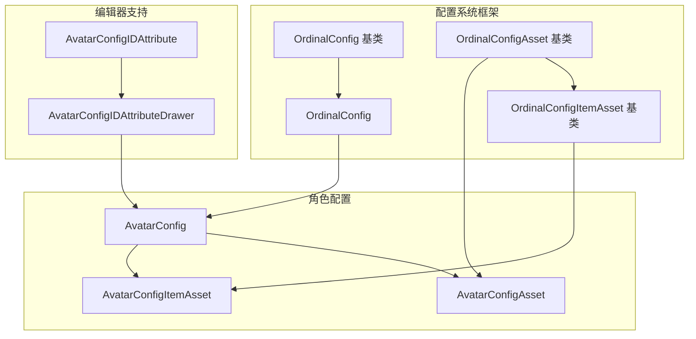
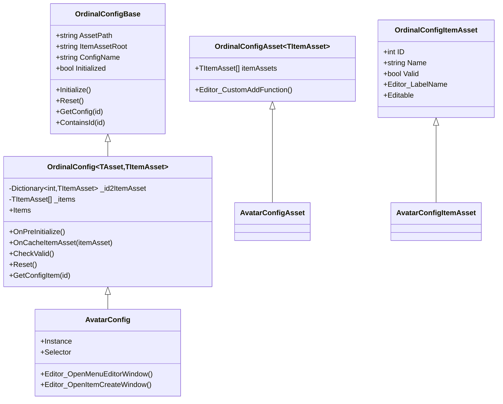
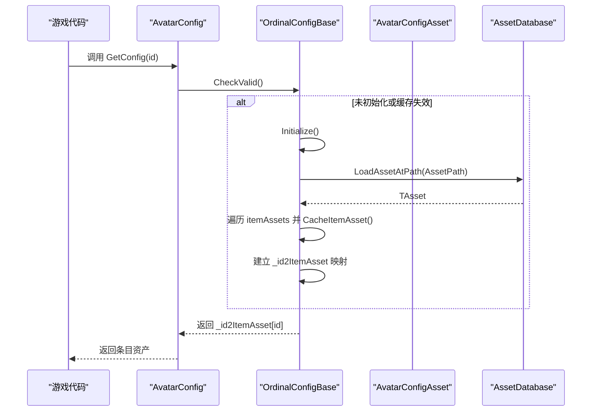
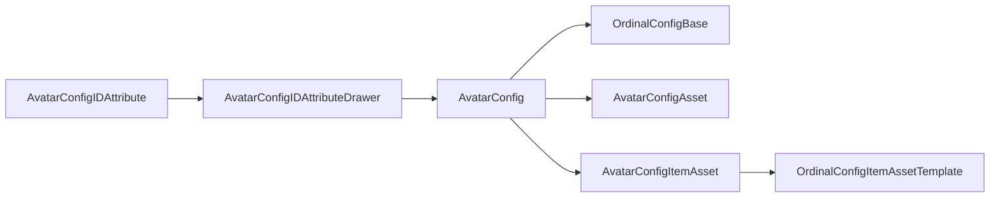
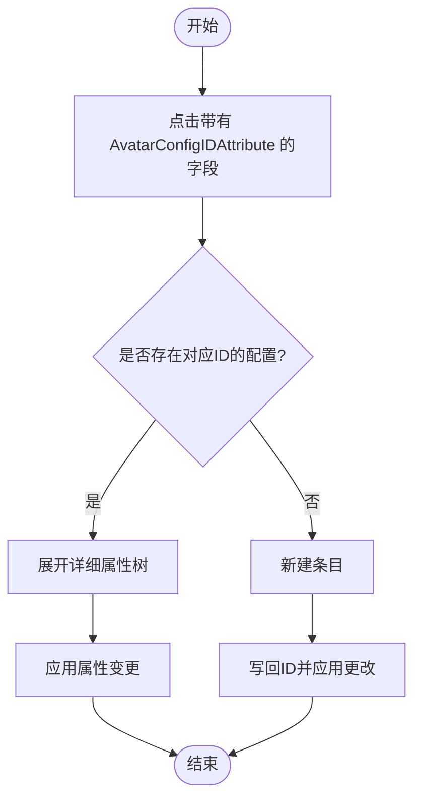

# 角色配置系统

<cite>
**本文引用的文件**
- [AvatarConfig.cs](file://Assets/Scripts/Config/AvatarConfig/AvatarConfig.cs)
- [AvatarConfigAsset.cs](file://Assets/Scripts/Config/AvatarConfig/AvatarConfigAsset.cs)
- [AvatarConfigItemAsset.cs](file://Assets/Scripts/Config/AvatarConfig/AvatarConfigItemAsset.cs)
- [AvatarConfigIDAttribute.cs](file://Assets/Scripts/Config/AvatarConfig/AvatarConfigIDAttribute.cs)
- [AvatarConfigIDAttributeDrawer.cs](file://Assets/Scripts/Config/AvatarConfig/AvatarConfigIDAttributeDrawer.cs)
- [OrdinalConfig.cs](file://Assets/Scripts/Systems/Implement/ConfigSystem/OrdinalConfig/OrdinalConfig.cs)
- [OrdinalConfigAsset.cs](file://Assets/Scripts/Systems/Implement/ConfigSystem/OrdinalConfig/OrdinalConfigAsset.cs)
- [OrdinalConfigBase.cs](file://Assets/Scripts/Systems/Implement/ConfigSystem/OrdinalConfig/OrdinalConfigBase.cs)
- [OrdinalConfigItemAsset.cs](file://Assets/Scripts/Systems/Implement/ConfigSystem/OrdinalConfig/OrdinalConfigItemAsset.cs)
- [AvatarConfigAsset.asset](file://Assets/Dev/Config/AvatarConfig/AvatarConfigAsset.asset)
- [AvatarConfigItemAsset_20250911_112549_406.asset](file://Assets/Dev/Config/AvatarConfig/AvatarConfigItemAsset_20250911_112549_406.asset)
</cite>

## 目录
1. [简介](#简介)
2. [项目结构](#项目结构)
3. [核心组件](#核心组件)
4. [架构总览](#架构总览)
5. [详细组件分析](#详细组件分析)
6. [依赖关系分析](#依赖关系分析)
7. [性能考虑](#性能考虑)
8. [故障排查指南](#故障排查指南)
9. [结论](#结论)
10. [附录](#附录)

## 简介
本文件面向ProjectR项目的“角色配置系统”，系统性阐述角色配置的数据结构与字段定义、AvatarConfigAsset的配置项（角色ID、名称、描述与视觉效果参数）、配置加载与缓存机制、扩展方法（自定义属性与校验规则）、在游戏中的典型应用场景（角色创建、属性计算、外观切换），以及性能优化与内存管理策略。文档同时提供可视化图示，帮助不同背景的读者快速理解与使用该系统。

## 项目结构
角色配置系统位于“配置系统”框架之上，采用“配置资产 + 条目资产”的分层设计：
- 配置资产（AvatarConfigAsset）：承载所有角色条目的集合，负责在编辑器中组织与持久化。
- 条目资产（AvatarConfigItemAsset）：单个角色的配置单元，包含角色ID、名称、描述及外观参数等。
- 配置实例（AvatarConfig）：运行时访问入口，负责加载、缓存与查询角色配置。
- 编辑器工具链：提供菜单、选择器、创建器、属性树等编辑体验。

图表来源
- [OrdinalConfigBase.cs:15-634](file://Assets/Scripts/Systems/Implement/ConfigSystem/OrdinalConfig/OrdinalConfigBase.cs#L15-L634)
- [OrdinalConfig.cs:17-128](file://Assets/Scripts/Systems/Implement/ConfigSystem/OrdinalConfig/OrdinalConfig.cs#L17-L128)
- [OrdinalConfigAsset.cs:7-25](file://Assets/Scripts/Systems/Implement/ConfigSystem/OrdinalConfig/OrdinalConfigAsset.cs#L7-L25)
- [OrdinalConfigItemAsset.cs:30-57](file://Assets/Scripts/Systems/Implement/ConfigSystem/OrdinalConfig/OrdinalConfigItemAsset.cs#L30-L57)
- [AvatarConfig.cs:6-49](file://Assets/Scripts/Config/AvatarConfig/AvatarConfig.cs#L6-L49)
- [AvatarConfigAsset.cs:3-7](file://Assets/Scripts/Config/AvatarConfig/AvatarConfigAsset.cs#L3-L7)
- [AvatarConfigItemAsset.cs:5-12](file://Assets/Scripts/Config/AvatarConfig/AvatarConfigItemAsset.cs#L5-L12)
- [AvatarConfigIDAttribute.cs:5-12](file://Assets/Scripts/Config/AvatarConfig/AvatarConfigIDAttribute.cs#L5-L12)
- [AvatarConfigIDAttributeDrawer.cs:10-133](file://Assets/Scripts/Config/AvatarConfig/AvatarConfigIDAttributeDrawer.cs#L10-L133)

章节来源
- [AvatarConfig.cs:6-49](file://Assets/Scripts/Config/AvatarConfig/AvatarConfig.cs#L6-L49)
- [OrdinalConfigBase.cs:15-634](file://Assets/Scripts/Systems/Implement/ConfigSystem/OrdinalConfig/OrdinalConfigBase.cs#L15-L634)

## 核心组件
- AvatarConfig：角色配置的运行时入口，继承自泛型OrdinalConfig，提供单例访问、编辑器窗口与选择器等能力。
- AvatarConfigAsset：角色配置资产，继承自OrdinalConfigAsset，承载条目列表。
- AvatarConfigItemAsset：角色条目资产，继承自OrdinalConfigItemAssetTemplate，包含AvatarAssetName等外观参数。
- AvatarConfigIDAttribute：用于在编辑器中显示与操作角色ID的自定义属性。
- AvatarConfigIDAttributeDrawer：与AvatarConfigIDAttribute配套的Odin绘制器，提供“新建/复制/选择/删除/详细属性树”等交互。

章节来源
- [AvatarConfig.cs:6-49](file://Assets/Scripts/Config/AvatarConfig/AvatarConfig.cs#L6-L49)
- [AvatarConfigAsset.cs:3-7](file://Assets/Scripts/Config/AvatarConfig/AvatarConfigAsset.cs#L3-L7)
- [AvatarConfigItemAsset.cs:5-12](file://Assets/Scripts/Config/AvatarConfig/AvatarConfigItemAsset.cs#L5-L12)
- [AvatarConfigIDAttribute.cs:5-12](file://Assets/Scripts/Config/AvatarConfig/AvatarConfigIDAttribute.cs#L5-L12)
- [AvatarConfigIDAttributeDrawer.cs:10-133](file://Assets/Scripts/Config/AvatarConfig/AvatarConfigIDAttributeDrawer.cs#L10-L133)

## 架构总览
角色配置系统基于“顺序表配置”范式，以List存储配置项，并建立ID到条目的字典映射，实现O(1)查询与稳定的遍历顺序。配置资产在编辑器中自动创建与维护，条目资产通过统一的创建/复制/纠错流程保证一致性。

图表来源
- [OrdinalConfigBase.cs:15-634](file://Assets/Scripts/Systems/Implement/ConfigSystem/OrdinalConfig/OrdinalConfigBase.cs#L15-L634)
- [OrdinalConfig.cs:17-128](file://Assets/Scripts/Systems/Implement/ConfigSystem/OrdinalConfig/OrdinalConfig.cs#L17-L128)
- [OrdinalConfigAsset.cs:7-25](file://Assets/Scripts/Systems/Implement/ConfigSystem/OrdinalConfig/OrdinalConfigAsset.cs#L7-L25)
- [OrdinalConfigItemAsset.cs:30-57](file://Assets/Scripts/Systems/Implement/ConfigSystem/OrdinalConfig/OrdinalConfigItemAsset.cs#L30-L57)
- [AvatarConfig.cs:6-49](file://Assets/Scripts/Config/AvatarConfig/AvatarConfig.cs#L6-L49)
- [AvatarConfigAsset.cs:3-7](file://Assets/Scripts/Config/AvatarConfig/AvatarConfigAsset.cs#L3-L7)
- [AvatarConfigItemAsset.cs:5-12](file://Assets/Scripts/Config/AvatarConfig/AvatarConfigItemAsset.cs#L5-L12)

## 详细组件分析

### 数据结构与字段定义
- 角色ID与名称
  - ID：全局唯一标识，用于查询与引用。
  - Name：角色名称，用于编辑器标签与展示。
- 角色外观参数
  - AvatarAssetName：角色资源名称，用于绑定模型/动画/材质等资源。
- 角色描述
  - 当前条目资产未显式声明描述字段；如需描述，可在AvatarConfigItemAsset中扩展。

章节来源
- [OrdinalConfigItemAsset.cs:30-57](file://Assets/Scripts/Systems/Implement/ConfigSystem/OrdinalConfig/OrdinalConfigItemAsset.cs#L30-L57)
- [AvatarConfigItemAsset.cs:5-12](file://Assets/Scripts/Config/AvatarConfig/AvatarConfigItemAsset.cs#L5-L12)

### AvatarConfigAsset 的配置项
- 承载角色条目集合：itemAssets，用于在编辑器中组织与持久化。
- 编辑器扩展点：可重写Editor_CustomAddFunction以控制新增条目的行为。

章节来源
- [OrdinalConfigAsset.cs:16-23](file://Assets/Scripts/Systems/Implement/ConfigSystem/OrdinalConfig/OrdinalConfigAsset.cs#L16-L23)
- [AvatarConfigAsset.cs:3-7](file://Assets/Scripts/Config/AvatarConfig/AvatarConfigAsset.cs#L3-L7)

### 加载流程与缓存机制
- 资产加载
  - 运行时：当前AvatarConfig未实现资源系统同步加载，保留扩展点注释。
  - 编辑器：通过AssetDatabase按相对路径加载配置资产，若不存在则自动创建。
- 初始化与缓存
  - 初始化：遍历配置资产中的条目列表，逐个缓存。
  - 缓存策略：建立ID到条目的字典映射，确保O(1)查询；同时维护条目列表以保持顺序。
  - 重复ID检测：若发现重复ID，记录错误日志并阻止覆盖。
- 查询接口
  - GetConfig(id)：按ID获取条目资产。
  - GetConfigItem(id)：按ID获取运行时条目（OrdinalConfig<TAsset,TItemAsset,TItem>提供的能力）。

图表来源
- [OrdinalConfigBase.cs:36-90](file://Assets/Scripts/Systems/Implement/ConfigSystem/OrdinalConfig/OrdinalConfigBase.cs#L36-L90)
- [OrdinalConfig.cs:34-48](file://Assets/Scripts/Systems/Implement/ConfigSystem/OrdinalConfig/OrdinalConfig.cs#L34-L48)
- [AvatarConfig.cs:6-9](file://Assets/Scripts/Config/AvatarConfig/AvatarConfig.cs#L6-L9)

章节来源
- [OrdinalConfigBase.cs:36-90](file://Assets/Scripts/Systems/Implement/ConfigSystem/OrdinalConfig/OrdinalConfigBase.cs#L36-L90)
- [OrdinalConfig.cs:34-48](file://Assets/Scripts/Systems/Implement/ConfigSystem/OrdinalConfig/OrdinalConfig.cs#L34-L48)

### 扩展方法：自定义属性与校验规则
- 自定义属性
  - 在AvatarConfigItemAsset中添加新的字段（如描述、外观参数等），即可在编辑器中通过Odin绘制器进行编辑。
  - 若需运行时访问，可在OrdinalConfig<TAsset,TItemAsset,TItem>派生类中扩展OnCacheItemAsset以建立TItem映射。
- 校验规则
  - 条目有效性：ID>0视为有效；可通过重写Valid或在派生类中增加更多约束。
  - 重复ID检测：系统在缓存阶段对重复ID输出错误日志，避免覆盖。
  - 编辑器校验：创建/复制/纠错流程包含多项校验，确保ID唯一与ItemAsset合法。

章节来源
- [OrdinalConfigItemAsset.cs:30-57](file://Assets/Scripts/Systems/Implement/ConfigSystem/OrdinalConfig/OrdinalConfigItemAsset.cs#L30-L57)
- [OrdinalConfigBase.cs:96-107](file://Assets/Scripts/Systems/Implement/ConfigSystem/OrdinalConfig/OrdinalConfigBase.cs#L96-L107)
- [OrdinalConfig.cs:49-56](file://Assets/Scripts/Systems/Implement/ConfigSystem/OrdinalConfig/OrdinalConfig.cs#L49-L56)

### 实际应用场景
- 角色创建
  - 使用AvatarConfig.Selector在编辑器中选择角色条目，或通过AvatarConfigIDAttribute在Inspector中直接选择。
- 属性计算
  - 在AvatarConfig派生类中扩展OnCacheItemAsset，将条目资产映射为运行时条目，以便在游戏逻辑中进行属性计算。
- 外观切换
  - AvatarAssetName作为外观参数的载体，可用于绑定模型、动画控制器、材质等资源，实现角色外观切换。

章节来源
- [AvatarConfig.cs:38-46](file://Assets/Scripts/Config/AvatarConfig/AvatarConfig.cs#L38-L46)
- [AvatarConfigIDAttributeDrawer.cs:14-81](file://Assets/Scripts/Config/AvatarConfig/AvatarConfigIDAttributeDrawer.cs#L14-L81)
- [AvatarConfigItemAsset.cs:7-10](file://Assets/Scripts/Config/AvatarConfig/AvatarConfigItemAsset.cs#L7-L10)

## 依赖关系分析
- 组件耦合
  - AvatarConfig依赖OrdinalConfig框架完成加载与缓存。
  - AvatarConfigItemAsset依赖OrdinalConfigItemAssetTemplate提供默认ID/Name字段与编辑器标签。
  - AvatarConfigIDAttributeDrawer依赖AvatarConfig进行查询与编辑操作。
- 外部依赖
  - 编辑器工具链：Odin Inspector（PropertyTree、OdinEditorWindow等）。
  - Unity编辑器API：AssetDatabase、EditorUtility、GenericMenu等。

图表来源
- [AvatarConfig.cs:6-49](file://Assets/Scripts/Config/AvatarConfig/AvatarConfig.cs#L6-L49)
- [OrdinalConfigBase.cs:15-634](file://Assets/Scripts/Systems/Implement/ConfigSystem/OrdinalConfig/OrdinalConfigBase.cs#L15-L634)
- [AvatarConfigItemAsset.cs:5-12](file://Assets/Scripts/Config/AvatarConfig/AvatarConfigItemAsset.cs#L5-L12)
- [AvatarConfigIDAttributeDrawer.cs:10-133](file://Assets/Scripts/Config/AvatarConfig/AvatarConfigIDAttributeDrawer.cs#L10-L133)

章节来源
- [OrdinalConfigBase.cs:15-634](file://Assets/Scripts/Systems/Implement/ConfigSystem/OrdinalConfig/OrdinalConfigBase.cs#L15-L634)
- [AvatarConfigIDAttributeDrawer.cs:10-133](file://Assets/Scripts/Config/AvatarConfig/AvatarConfigIDAttributeDrawer.cs#L10-L133)

## 性能考虑
- 查询复杂度
  - ID到条目的字典映射提供O(1)查询，适合频繁查找场景。
- 初始化成本
  - 首次Initialize会遍历所有条目并建立映射，建议在启动阶段集中执行，避免在热路径中触发。
- 内存占用
  - 字典与列表各保存一次条目引用，空间换时间；可结合对象池与延迟加载进一步优化。
- 编辑器体验
  - PropertyTree缓存于editor_id2PropertyTree，减少重复构建开销。
- 资源加载
  - 运行时加载部分当前为占位符，建议接入资源系统并实现异步加载与缓存复用。

## 故障排查指南
- “找不到ID对应配置”
  - 检查ID是否正确、是否存在重复ID、条目是否被正确收录至配置资产。
- “重复ID警告”
  - 系统会在缓存阶段输出错误日志，需修正ID或删除冲突条目。
- “编辑器无法打开配置窗口”
  - 确认AvatarConfig已实现Editor_OpenMenuEditorWindow与Editor_OpenItemCreateWindow。
- “复制/创建失败”
  - 检查Editor_IsItemCreatable与Editor_CopyItemAsset的返回错误码，确保ID唯一且路径有效。

章节来源
- [OrdinalConfigBase.cs:96-107](file://Assets/Scripts/Systems/Implement/ConfigSystem/OrdinalConfig/OrdinalConfigBase.cs#L96-L107)
- [OrdinalConfigBase.cs:346-356](file://Assets/Scripts/Systems/Implement/ConfigSystem/OrdinalConfig/OrdinalConfigBase.cs#L346-L356)
- [AvatarConfigIDAttributeDrawer.cs:83-96](file://Assets/Scripts/Config/AvatarConfig/AvatarConfigIDAttributeDrawer.cs#L83-L96)

## 结论
角色配置系统以“顺序表配置”为核心，通过AvatarConfig、AvatarConfigAsset与AvatarConfigItemAsset形成清晰的层次结构，并借助编辑器工具链提供高效、可视化的配置体验。系统具备良好的扩展性与可维护性，适用于角色创建、属性计算与外观切换等多种场景。建议在后续版本中完善运行时资源加载与缓存策略，以进一步提升性能与稳定性。

## 附录
- 示例配置资产
  - AvatarConfigAsset.asset：角色配置资产示例。
  - AvatarConfigItemAsset_20250911_112549_406.asset：角色条目资产示例。
- 关键流程图：编辑器中通过AvatarConfigIDAttributeDrawer选择/创建/复制条目的交互流程。

图表来源
- [AvatarConfigIDAttributeDrawer.cs:14-81](file://Assets/Scripts/Config/AvatarConfig/AvatarConfigIDAttributeDrawer.cs#L14-L81)
- [AvatarConfig.cs:38-46](file://Assets/Scripts/Config/AvatarConfig/AvatarConfig.cs#L38-L46)