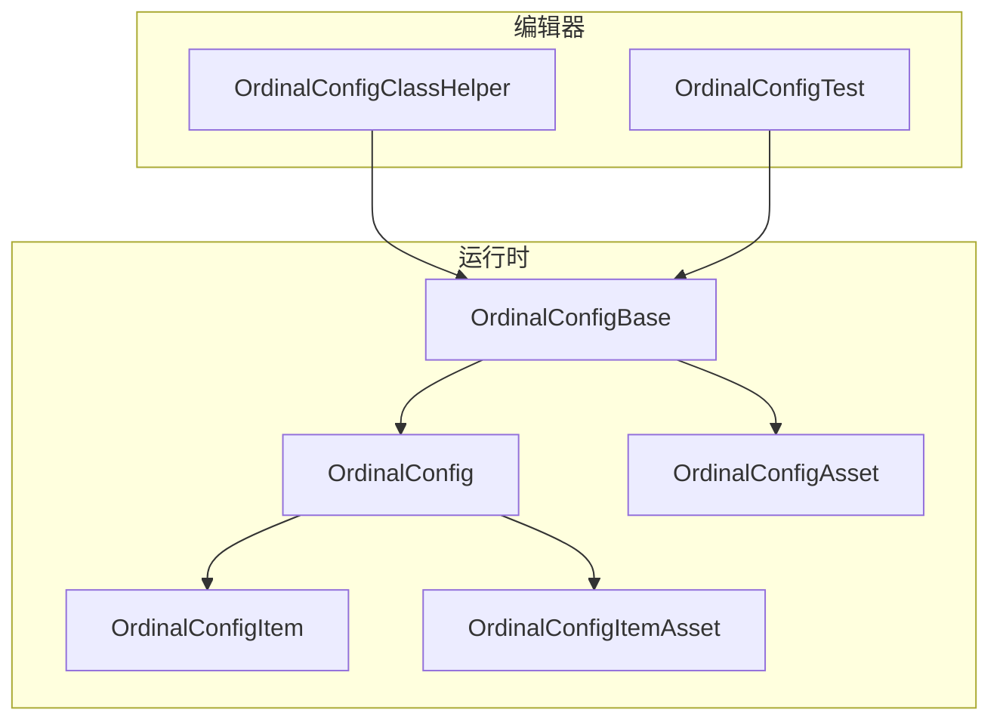
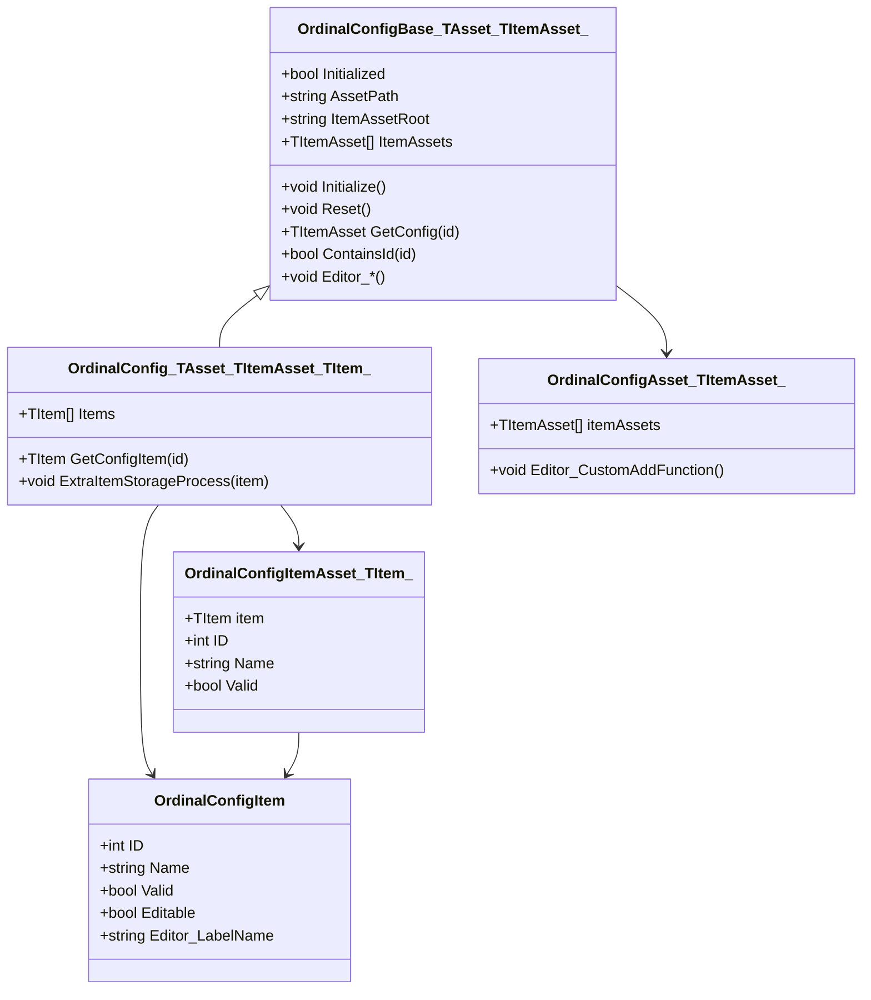
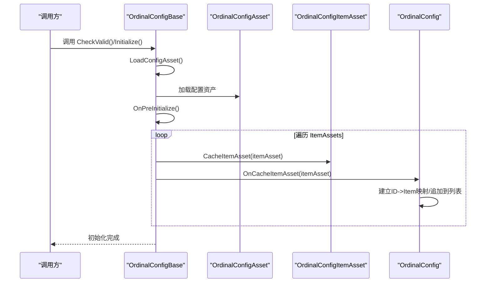
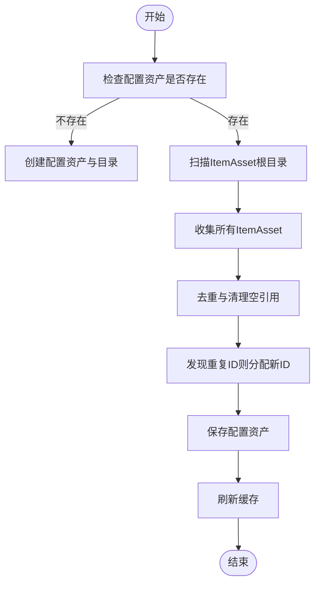
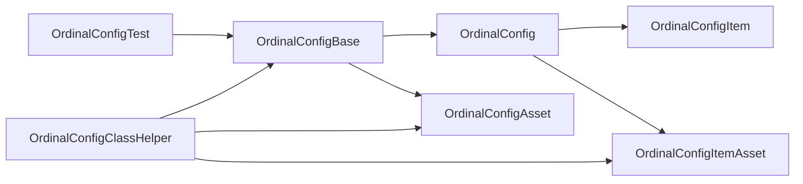

# 配置系统

<cite>
**本文引用的文件**
- [OrdinalConfig.cs](file://Assets/Scripts/Systems/Implement/ConfigSystem/OrdinalConfig/OrdinalConfig.cs)
- [OrdinalConfigBase.cs](file://Assets/Scripts/Systems/Implement/ConfigSystem/OrdinalConfig/OrdinalConfigBase.cs)
- [OrdinalConfigAsset.cs](file://Assets/Scripts/Systems/Implement/ConfigSystem/OrdinalConfig/OrdinalConfigAsset.cs)
- [OrdinalConfigItem.cs](file://Assets/Scripts/Systems/Implement/ConfigSystem/OrdinalConfig/OrdinalConfigItem.cs)
- [OrdinalConfigItemAsset.cs](file://Assets/Scripts/Systems/Implement/ConfigSystem/OrdinalConfig/OrdinalConfigItemAsset.cs)
- [OrdinalConfigIDAttribute.cs](file://Assets/Scripts/Systems/Implement/ConfigSystem/OrdinalConfig/OrdinalConfigIDAttribute.cs)
- [OrdinalConfigClassHelper.cs](file://Assets/Scripts/Editor/Config/OrdinalConfigClassHelper.cs)
- [OrdinalConfigTest.cs](file://Assets/Dev/Lab/Scripts/OrdinalConfigTest.cs)
</cite>

## 目录
1. [简介](#简介)
2. [项目结构](#项目结构)
3. [核心组件](#核心组件)
4. [架构总览](#架构总览)
5. [详细组件分析](#详细组件分析)
6. [依赖关系分析](#依赖关系分析)
7. [性能考量](#性能考量)
8. [故障排查指南](#故障排查指南)
9. [结论](#结论)
10. [附录](#附录)

## 简介
本文件面向ProjectR项目的配置系统，系统采用“顺序表配置”设计，围绕 OrdinalConfig 模板体系构建，提供配置资产的加载、解析与缓存机制；并支持编辑器侧的可视化创建、复制、纠错与刷新流程。本文将深入讲解 OrdinalConfig 模板系统的工作原理，覆盖配置项的定义、序列化与反序列化过程，并对角色配置、实体配置、陷阱配置、物品配置等典型配置类型的结构与使用方法进行说明。同时给出扩展机制、配置热更新与版本管理建议，以及性能优化与最佳实践。

## 项目结构
配置系统位于运行时与编辑器两部分：
- 运行时：OrdinalConfig 基类与泛型模板，负责加载与缓存配置资产。
- 编辑器：工具类与窗口，负责生成配置类模板、创建/复制/纠错配置资产、打开编辑器窗口等。

**图表来源**
- [OrdinalConfigBase.cs:15-18](file://Assets/Scripts/Systems/Implement/ConfigSystem/OrdinalConfig/OrdinalConfigBase.cs#L15-L18)
- [OrdinalConfig.cs:17-21](file://Assets/Scripts/Systems/Implement/ConfigSystem/OrdinalConfig/OrdinalConfig.cs#L17-L21)
- [OrdinalConfigItem.cs:9-36](file://Assets/Scripts/Systems/Implement/ConfigSystem/OrdinalConfig/OrdinalConfigItem.cs#L9-L36)
- [OrdinalConfigItemAsset.cs:7-42](file://Assets/Scripts/Systems/Implement/ConfigSystem/OrdinalConfig/OrdinalConfigItemAsset.cs#L7-L42)
- [OrdinalConfigAsset.cs:7-24](file://Assets/Scripts/Systems/Implement/ConfigSystem/OrdinalConfig/OrdinalConfigAsset.cs#L7-L24)
- [OrdinalConfigClassHelper.cs:13-240](file://Assets/Scripts/Editor/Config/OrdinalConfigClassHelper.cs#L13-L240)
- [OrdinalConfigTest.cs:6-58](file://Assets/Dev/Lab/Scripts/OrdinalConfigTest.cs#L6-L58)

**章节来源**
- [OrdinalConfigBase.cs:15-634](file://Assets/Scripts/Systems/Implement/ConfigSystem/OrdinalConfig/OrdinalConfigBase.cs#L15-L634)
- [OrdinalConfig.cs:17-128](file://Assets/Scripts/Systems/Implement/ConfigSystem/OrdinalConfig/OrdinalConfig.cs#L17-L128)
- [OrdinalConfigAsset.cs:7-25](file://Assets/Scripts/Systems/Implement/ConfigSystem/OrdinalConfig/OrdinalConfigAsset.cs#L7-L25)
- [OrdinalConfigItem.cs:9-36](file://Assets/Scripts/Systems/Implement/ConfigSystem/OrdinalConfig/OrdinalConfigItem.cs#L9-L36)
- [OrdinalConfigItemAsset.cs:7-57](file://Assets/Scripts/Systems/Implement/ConfigSystem/OrdinalConfig/OrdinalConfigItemAsset.cs#L7-L57)
- [OrdinalConfigIDAttribute.cs:6-31](file://Assets/Scripts/Systems/Implement/ConfigSystem/OrdinalConfig/OrdinalConfigIDAttribute.cs#L6-L31)
- [OrdinalConfigClassHelper.cs:13-240](file://Assets/Scripts/Editor/Config/OrdinalConfigClassHelper.cs#L13-L240)
- [OrdinalConfigTest.cs:6-58](file://Assets/Dev/Lab/Scripts/OrdinalConfigTest.cs#L6-L58)

## 核心组件
- OrdinalConfigBase<TAsset,TItemAsset>：抽象基类，负责加载配置资产、建立ID到ItemAsset的映射、初始化缓存、提供编辑器能力（创建、复制、纠错、刷新、打开脚本等）。
- OrdinalConfig<TAsset,TItemAsset,TItem>：泛型扩展，增加从ItemAsset提取具体Item并建立ID到Item的映射，提供按ID查询接口。
- OrdinalConfigAsset<TItemAsset>：配置资产容器，包含若干ItemAsset列表。
- OrdinalConfigItemAsset<TItem>：配置项资产包装，持有具体Item对象。
- OrdinalConfigItem：配置项数据模型，包含ID、名称、有效性校验、可编辑标记等。
- OrdinalConfigIDAttribute：编辑器ID字段显示选项属性，控制创建/复制/选择/详情按钮的显示。
- OrdinalConfigClassHelper：编辑器工具，提供“顺序表类创建窗口”，基于模板生成配置类文件。
- OrdinalConfigTest：演示如何在运行时或编辑器环境下查找程序集与类。

**章节来源**
- [OrdinalConfigBase.cs:15-18](file://Assets/Scripts/Systems/Implement/ConfigSystem/OrdinalConfig/OrdinalConfigBase.cs#L15-L18)
- [OrdinalConfig.cs:17-21](file://Assets/Scripts/Systems/Implement/ConfigSystem/OrdinalConfig/OrdinalConfig.cs#L17-L21)
- [OrdinalConfigAsset.cs:7-24](file://Assets/Scripts/Systems/Implement/ConfigSystem/OrdinalConfig/OrdinalConfigAsset.cs#L7-L24)
- [OrdinalConfigItemAsset.cs:7-42](file://Assets/Scripts/Systems/Implement/ConfigSystem/OrdinalConfig/OrdinalConfigItemAsset.cs#L7-L42)
- [OrdinalConfigItem.cs:9-36](file://Assets/Scripts/Systems/Implement/ConfigSystem/OrdinalConfig/OrdinalConfigItem.cs#L9-L36)
- [OrdinalConfigIDAttribute.cs:6-31](file://Assets/Scripts/Systems/Implement/ConfigSystem/OrdinalConfig/OrdinalConfigIDAttribute.cs#L6-L31)
- [OrdinalConfigClassHelper.cs:13-240](file://Assets/Scripts/Editor/Config/OrdinalConfigClassHelper.cs#L13-L240)
- [OrdinalConfigTest.cs:6-58](file://Assets/Dev/Lab/Scripts/OrdinalConfigTest.cs#L6-L58)

## 架构总览
配置系统采用“资产-条目”的分层结构：配置资产（Asset）包含多个条目资产（ItemAsset），条目资产封装具体配置项（Item）。系统在初始化阶段扫描配置资产中的条目资产，建立ID到条目资产与ID到条目的双映射，从而实现O(1)的按ID查询。

**图表来源**
- [OrdinalConfigBase.cs:15-18](file://Assets/Scripts/Systems/Implement/ConfigSystem/OrdinalConfig/OrdinalConfigBase.cs#L15-L18)
- [OrdinalConfig.cs:17-21](file://Assets/Scripts/Systems/Implement/ConfigSystem/OrdinalConfig/OrdinalConfig.cs#L17-L21)
- [OrdinalConfigAsset.cs:7-24](file://Assets/Scripts/Systems/Implement/ConfigSystem/OrdinalConfig/OrdinalConfigAsset.cs#L7-L24)
- [OrdinalConfigItemAsset.cs:7-42](file://Assets/Scripts/Systems/Implement/ConfigSystem/OrdinalConfig/OrdinalConfigItemAsset.cs#L7-L42)
- [OrdinalConfigItem.cs:9-36](file://Assets/Scripts/Systems/Implement/ConfigSystem/OrdinalConfig/OrdinalConfigItem.cs#L9-L36)

## 详细组件分析

### 加载与初始化流程
- 资产加载：根据相对路径定位配置资产，若不存在则在编辑器模式下自动创建。
- 条目扫描：遍历配置资产中的条目资产列表，逐个进行缓存。
- 映射建立：维护两个字典：ID到条目资产、ID到条目对象；同时检测重复ID并记录错误。
- 初始化完成：标记为已初始化，后续查询直接命中缓存。

**图表来源**
- [OrdinalConfigBase.cs:66-90](file://Assets/Scripts/Systems/Implement/ConfigSystem/OrdinalConfig/OrdinalConfigBase.cs#L66-L90)
- [OrdinalConfig.cs:25-48](file://Assets/Scripts/Systems/Implement/ConfigSystem/OrdinalConfig/OrdinalConfig.cs#L25-L48)

**章节来源**
- [OrdinalConfigBase.cs:36-90](file://Assets/Scripts/Systems/Implement/ConfigSystem/OrdinalConfig/OrdinalConfigBase.cs#L36-L90)
- [OrdinalConfig.cs:25-48](file://Assets/Scripts/Systems/Implement/ConfigSystem/OrdinalConfig/OrdinalConfig.cs#L25-L48)

### 序列化与反序列化
- 配置资产与条目资产均为Unity的SerializedScriptableObject，支持Unity序列化系统。
- 配置项（Item）为可序列化类，包含ID、名称、有效性等字段。
- 条目资产（ItemAsset）通过字段持有具体Item对象，形成“资产包装+数据对象”的结构，便于编辑器可视化与持久化。

**章节来源**
- [OrdinalConfigAsset.cs:13-24](file://Assets/Scripts/Systems/Implement/ConfigSystem/OrdinalConfig/OrdinalConfigAsset.cs#L13-L24)
- [OrdinalConfigItemAsset.cs:7-42](file://Assets/Scripts/Systems/Implement/ConfigSystem/OrdinalConfig/OrdinalConfigItemAsset.cs#L7-L42)
- [OrdinalConfigItem.cs:9-36](file://Assets/Scripts/Systems/Implement/ConfigSystem/OrdinalConfig/OrdinalConfigItem.cs#L9-L36)

### 查询与缓存
- 按ID查询：通过ID字典快速返回条目资产或条目对象。
- 列表访问：提供条目列表以便顺序遍历。
- 重置与重建：支持重置缓存并在必要时重新初始化。

**章节来源**
- [OrdinalConfigBase.cs:134-145](file://Assets/Scripts/Systems/Implement/ConfigSystem/OrdinalConfig/OrdinalConfigBase.cs#L134-L145)
- [OrdinalConfig.cs:63-68](file://Assets/Scripts/Systems/Implement/ConfigSystem/OrdinalConfig/OrdinalConfig.cs#L63-L68)

### 编辑器工作流
- 创建配置资产：若不存在则自动创建目录与资产文件。
- 新建条目资产：生成带时间戳的唯一文件名，写入资产并加入配置资产列表。
- 复制条目资产：支持在同一目录或默认目录下复制并分配新ID。
- 纠错与去重：扫描根目录下所有条目资产，补录缺失项、修正非法项、去重并保存。
- 打开脚本：根据类型名在工程中查找并打开对应脚本文件。
- 属性树：为指定ID生成PropertyTree，用于Odin可视化编辑。

**图表来源**
- [OrdinalConfigBase.cs:511-567](file://Assets/Scripts/Systems/Implement/ConfigSystem/OrdinalConfig/OrdinalConfigBase.cs#L511-L567)

**章节来源**
- [OrdinalConfigBase.cs:148-631](file://Assets/Scripts/Systems/Implement/ConfigSystem/OrdinalConfig/OrdinalConfigBase.cs#L148-L631)

### 模板系统与类生成
- 模板来源：编辑器工具从资源模板加载模板文本，替换类名占位符后生成新配置类文件。
- 生成内容：包含配置类、配置资产类、条目资产类、ID属性类及其编辑器绘制器。
- 类名约定：通过统一前缀生成类名，确保命名一致性。

**章节来源**
- [OrdinalConfigClassHelper.cs:13-240](file://Assets/Scripts/Editor/Config/OrdinalConfigClassHelper.cs#L13-L240)

### ID属性与编辑器交互
- ID属性：提供显示选项枚举，控制创建、复制、选择、详情按钮的显示。
- 字段/属性：可用于标注需要选择配置ID的字段或属性，配合编辑器绘制器使用。

**章节来源**
- [OrdinalConfigIDAttribute.cs:6-31](file://Assets/Scripts/Systems/Implement/ConfigSystem/OrdinalConfig/OrdinalConfigIDAttribute.cs#L6-L31)

### 示例：运行时反射与类查找
- 示例脚本展示了如何在运行时或编辑器环境下查找指定程序集与类，辅助动态加载与调试。

**章节来源**
- [OrdinalConfigTest.cs:6-58](file://Assets/Dev/Lab/Scripts/OrdinalConfigTest.cs#L6-L58)

## 依赖关系分析
- 组件耦合：OrdinalConfig 泛型类依赖 OrdinalConfigBase 的加载与缓存能力；条目资产依赖条目对象。
- 编辑器依赖：编辑器工具依赖Unity编辑器API与Odin Inspector进行可视化与脚本打开。
- 外部依赖：Odin Inspector用于可视化与属性树生成；Unity编辑器API用于资产创建、复制、刷新与保存。

**图表来源**
- [OrdinalConfigBase.cs:15-18](file://Assets/Scripts/Systems/Implement/ConfigSystem/OrdinalConfig/OrdinalConfigBase.cs#L15-L18)
- [OrdinalConfig.cs:17-21](file://Assets/Scripts/Systems/Implement/ConfigSystem/OrdinalConfig/OrdinalConfig.cs#L17-L21)
- [OrdinalConfigAsset.cs:7-24](file://Assets/Scripts/Systems/Implement/ConfigSystem/OrdinalConfig/OrdinalConfigAsset.cs#L7-L24)
- [OrdinalConfigItemAsset.cs:7-42](file://Assets/Scripts/Systems/Implement/ConfigSystem/OrdinalConfig/OrdinalConfigItemAsset.cs#L7-L42)
- [OrdinalConfigClassHelper.cs:13-240](file://Assets/Scripts/Editor/Config/OrdinalConfigClassHelper.cs#L13-L240)
- [OrdinalConfigTest.cs:6-58](file://Assets/Dev/Lab/Scripts/OrdinalConfigTest.cs#L6-L58)

**章节来源**
- [OrdinalConfigBase.cs:15-634](file://Assets/Scripts/Systems/Implement/ConfigSystem/OrdinalConfig/OrdinalConfigBase.cs#L15-L634)
- [OrdinalConfig.cs:17-128](file://Assets/Scripts/Systems/Implement/ConfigSystem/OrdinalConfig/OrdinalConfig.cs#L17-L128)
- [OrdinalConfigAsset.cs:7-25](file://Assets/Scripts/Systems/Implement/ConfigSystem/OrdinalConfig/OrdinalConfigAsset.cs#L7-L25)
- [OrdinalConfigItemAsset.cs:7-57](file://Assets/Scripts/Systems/Implement/ConfigSystem/OrdinalConfig/OrdinalConfigItemAsset.cs#L7-L57)
- [OrdinalConfigClassHelper.cs:13-240](file://Assets/Scripts/Editor/Config/OrdinalConfigClassHelper.cs#L13-L240)
- [OrdinalConfigTest.cs:6-58](file://Assets/Dev/Lab/Scripts/OrdinalConfigTest.cs#L6-L58)

## 性能考量
- 查询复杂度：ID字典查询为O(1)，适合高频查询场景。
- 初始化成本：初始化时会遍历所有条目资产，建议在编辑器侧批量纠错后再进入运行时，减少初始化开销。
- 缓存复用：初始化完成后缓存常驻内存，避免重复IO；如需热更新，应提供显式重置与重新初始化入口。
- 资产数量：条目资产过多时，建议拆分配置类型或按场景分包，降低单次初始化压力。
- 序列化体积：尽量保持配置项字段精简，避免冗余引用导致序列化体积膨胀。

## 故障排查指南
- 重复ID：初始化阶段检测到重复ID会输出错误日志，需在编辑器侧使用“收集+纠错”功能修复。
- 无效配置：条目资产或其内部配置项无效时会输出错误日志，需检查ID与必填字段。
- 资产未找到：若配置资产不存在，编辑器会提示创建；若路径异常，需检查相对路径与目录结构。
- 编辑器脚本打开失败：需确保工程中存在与类名完全一致的脚本文件，否则无法通过工具打开。

**章节来源**
- [OrdinalConfigBase.cs:98-104](file://Assets/Scripts/Systems/Implement/ConfigSystem/OrdinalConfig/OrdinalConfigBase.cs#L98-L104)
- [OrdinalConfigBase.cs:511-567](file://Assets/Scripts/Systems/Implement/ConfigSystem/OrdinalConfig/OrdinalConfigBase.cs#L511-L567)
- [OrdinalConfigBase.cs:148-177](file://Assets/Scripts/Systems/Implement/ConfigSystem/OrdinalConfig/OrdinalConfigBase.cs#L148-L177)

## 结论
ProjectR的配置系统以 OrdinalConfig 模板为核心，提供了清晰的“资产-条目-数据对象”三层结构与完善的编辑器工具链。通过ID字典实现高效查询，结合编辑器的创建、复制、纠错与刷新能力，显著提升了配置开发效率与质量。对于扩展与热更新，建议遵循现有模板与命名规范，确保ID唯一性与数据有效性，并在运行时提供可控的重置与重建入口。

## 附录

### 不同类型配置的结构与使用要点
- 角色配置：通常包含角色基础属性、成长曲线、技能列表等。建议将角色作为条目对象，条目资产承载具体角色实例。
- 实体配置：描述实体的行为参数、状态机节点、动画映射等。建议拆分为行为配置与表现配置两类资产，便于维护。
- 陷阱配置：包含触发条件、效果范围、冷却时间等。建议将公共参数抽取为共享资产，减少重复。
- 物品配置：包含基础属性、品质、合成配方等。建议引入“物品模板”与“物品实例”的分层设计，支持动态叠加属性。

### 扩展机制与最佳实践
- 自定义配置类型：使用“顺序表类创建窗口”生成新配置类，遵循现有命名与继承约定，确保编辑器工具可用。
- 验证规则：在配置项中实现有效性校验，利用编辑器侧的“收集+纠错”功能自动修复常见问题。
- 热更新与版本管理：建议在运行时暴露重置与重建接口，结合资源版本号或配置版本字段，在更新时触发重建；对破坏性变更提供向后兼容映射。
- 性能优化：优先使用ID字典查询；对大型配置进行分片加载；避免在主线程频繁执行大量IO操作。