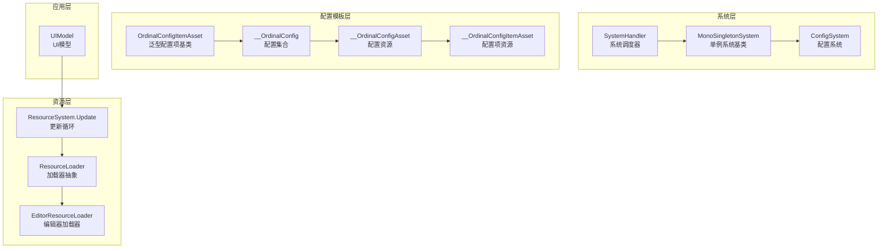
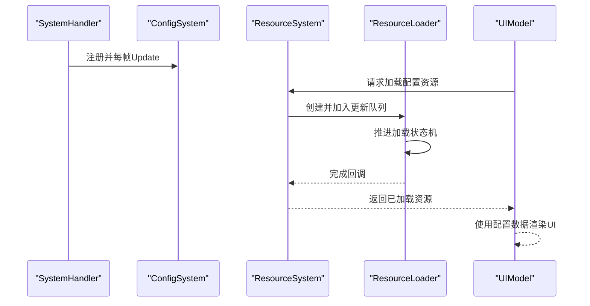
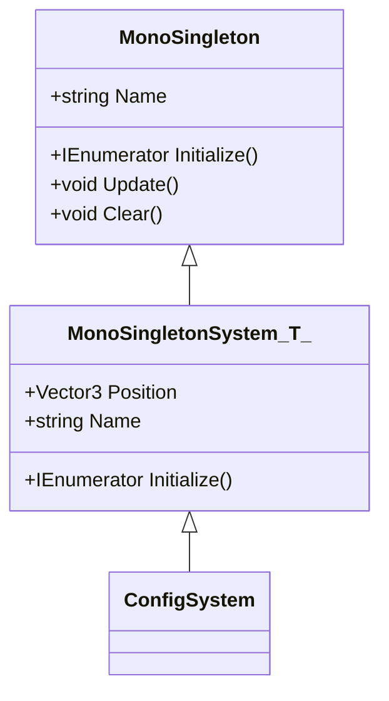
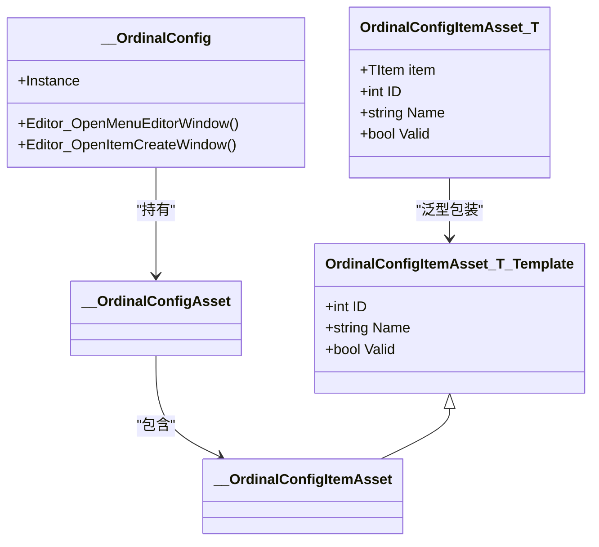
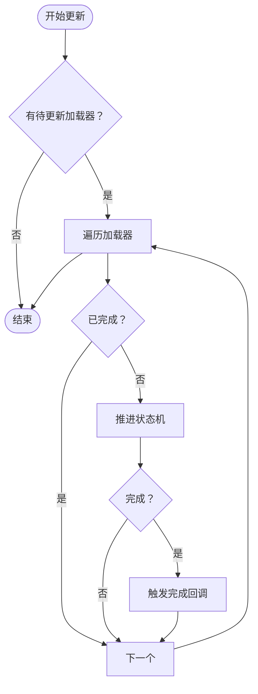
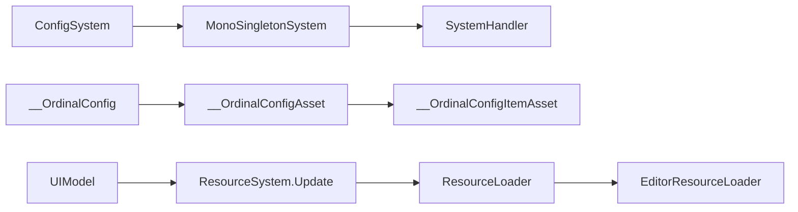

# 配置系统概览

<cite>
**本文档引用的文件**
- [ConfigSystem.cs](file://Assets/Scripts/Systems/Implement/ConfigSystem/ConfigSystem.cs)
- [MonoSingletonSystem.cs](file://Assets/Scripts/Systems/MonoSingletonSystem.cs)
- [MonoSingleton.cs](file://Assets/Scripts/Core/MonoSingleton.cs)
- [SystemHandler.cs](file://Assets/Scripts/Systems/SystemHandler.cs)
- [__OrdinalConfig.cs](file://Assets/Resources/OrdinalConfigTemplate/__OrdinalConfig.cs)
- [__OrdinalConfigAsset.cs](file://Assets/Resources/OrdinalConfigTemplate/__OrdinalConfigAsset.cs)
- [__OrdinalConfigItemAsset.cs](file://Assets/Resources/OrdinalConfigTemplate/__OrdinalConfigItemAsset.cs)
- [OrdinalConfigItemAsset.cs](file://Assets/Scripts/Systems/Implement/ConfigSystem/OrdinalConfig/OrdinalConfigItemAsset.cs)
- [OrdinalConfigClassHelper.cs](file://Assets/Scripts/Editor/Config/OrdinalConfigClassHelper.cs)
- [ResourceSystem.Update.cs](file://Assets/Scripts/Systems/Implement/ResourceSystem/ResourceSystem.Update.cs)
- [ResourceLoader.cs](file://Assets/Scripts/Systems/Implement/ResourceSystem/ResourceLoader.cs)
- [EditorResourceLoader.cs](file://Assets/Scripts/Systems/Implement/ResourceSystem/EditorResourceLoader.cs)
- [UIModel.cs](file://Assets/Scripts/UI/UIModel.cs)
</cite>

## 目录
1. [简介](#简介)
2. [项目结构](#项目结构)
3. [核心组件](#核心组件)
4. [架构总览](#架构总览)
5. [详细组件分析](#详细组件分析)
6. [依赖关系分析](#依赖关系分析)
7. [性能考虑](#性能考虑)
8. [故障排查指南](#故障排查指南)
9. [结论](#结论)

## 简介
本文件面向ProjectR项目的配置系统，提供从架构设计、初始化流程、配置加载与缓存策略，到与资源系统、实体系统、UI系统等核心模块的集成关系说明。同时给出性能优化建议、内存管理策略以及错误处理与调试工具的使用方法，帮助开发者快速理解并高效使用配置系统。

## 项目结构
配置系统位于系统的“Implement”层中，采用单例系统模式挂载于全局系统调度器之下；配置数据以Unity资源形式存在（如Asset），并通过编辑器模板生成器进行批量创建与维护。资源系统负责异步加载与缓存，UI系统通过资源系统获取配置数据驱动界面展示。

图表来源
- [SystemHandler.cs:1-70](file://Assets/Scripts/Systems/SystemHandler.cs#L1-L70)
- [MonoSingletonSystem.cs:1-36](file://Assets/Scripts/Systems/MonoSingletonSystem.cs#L1-L36)
- [ConfigSystem.cs:1-12](file://Assets/Scripts/Systems/Implement/ConfigSystem/ConfigSystem.cs#L1-L12)
- [__OrdinalConfig.cs:1-61](file://Assets/Resources/OrdinalConfigTemplate/__OrdinalConfig.cs#L1-L61)
- [__OrdinalConfigAsset.cs:1-9](file://Assets/Resources/OrdinalConfigTemplate/__OrdinalConfigAsset.cs#L1-L9)
- [__OrdinalConfigItemAsset.cs:1-8](file://Assets/Resources/OrdinalConfigTemplate/__OrdinalConfigItemAsset.cs#L1-L8)
- [OrdinalConfigItemAsset.cs:1-38](file://Assets/Scripts/Systems/Implement/ConfigSystem/OrdinalConfig/OrdinalConfigItemAsset.cs#L1-L38)
- [ResourceSystem.Update.cs:1-43](file://Assets/Scripts/Systems/Implement/ResourceSystem/ResourceSystem.Update.cs#L1-L43)
- [ResourceLoader.cs:1-42](file://Assets/Scripts/Systems/Implement/ResourceSystem/ResourceLoader.cs#L1-L42)
- [EditorResourceLoader.cs:1-41](file://Assets/Scripts/Systems/Implement/ResourceSystem/EditorResourceLoader.cs#L1-L41)
- [UIModel.cs:1-45](file://Assets/Scripts/UI/UIModel.cs#L1-L45)

章节来源
- [ConfigSystem.cs:1-12](file://Assets/Scripts/Systems/Implement/ConfigSystem/ConfigSystem.cs#L1-L12)
- [MonoSingletonSystem.cs:1-36](file://Assets/Scripts/Systems/MonoSingletonSystem.cs#L1-L36)
- [SystemHandler.cs:1-70](file://Assets/Scripts/Systems/SystemHandler.cs#L1-L70)

## 核心组件
- 单例系统基类：提供统一的生命周期钩子（实例化、初始化、每帧更新、清理）与系统注册机制。
- 配置系统：作为系统层的一个单例系统，负责承载配置数据与访问入口。
- 配置模板：通过编辑器模板生成配置集合、配置资源与配置项资源，支持可视化编辑与菜单操作。
- 资源系统：负责异步加载、状态机推进与缓存释放，为配置系统提供数据读取能力。
- UI系统：通过资源系统按需加载配置资源，驱动UI展示。

章节来源
- [MonoSingleton.cs:46-66](file://Assets/Scripts/Core/MonoSingleton.cs#L46-L66)
- [MonoSingletonSystem.cs:18-34](file://Assets/Scripts/Systems/MonoSingletonSystem.cs#L18-L34)
- [ConfigSystem.cs:7-9](file://Assets/Scripts/Systems/Implement/ConfigSystem/ConfigSystem.cs#L7-L9)
- [__OrdinalConfig.cs:8-11](file://Assets/Resources/OrdinalConfigTemplate/__OrdinalConfig.cs#L8-L11)
- [ResourceSystem.Update.cs:10-17](file://Assets/Scripts/Systems/Implement/ResourceSystem/ResourceSystem.Update.cs#L10-L17)

## 架构总览
配置系统采用“系统单例 + 资源配置 + 模板生成”的架构：
- 系统单例：ConfigSystem继承MonoSingletonSystem，由SystemHandler统一调度。
- 配置数据：以SerializedScriptableObject形式存储在Resources下，通过Asset资源引用。
- 模板生成：编辑器侧提供模板文件，自动生成配置集合、资源与项资源，便于批量维护。
- 数据流：UI或其他系统通过资源系统异步加载配置资源，完成数据消费。

图表来源
- [SystemHandler.cs:50-68](file://Assets/Scripts/Systems/SystemHandler.cs#L50-L68)
- [ConfigSystem.cs:7-9](file://Assets/Scripts/Systems/Implement/ConfigSystem/ConfigSystem.cs#L7-L9)
- [ResourceSystem.Update.cs:18-43](file://Assets/Scripts/Systems/Implement/ResourceSystem/ResourceSystem.Update.cs#L18-L43)
- [ResourceLoader.cs:29-42](file://Assets/Scripts/Systems/Implement/ResourceSystem/ResourceLoader.cs#L29-L42)
- [UIModel.cs:20-37](file://Assets/Scripts/UI/UIModel.cs#L20-L37)

## 详细组件分析

### 配置系统（ConfigSystem）
- 角色定位：作为系统层单例，负责配置数据的集中管理与对外暴露。
- 生命周期：通过MonoSingletonSystem的Initialize钩子进行初始化；SystemHandler每帧驱动其Update。
- 设计要点：当前实现为空壳，后续可扩展为配置索引、缓存策略与查询接口。

图表来源
- [MonoSingleton.cs:46-66](file://Assets/Scripts/Core/MonoSingleton.cs#L46-L66)
- [MonoSingletonSystem.cs:6-35](file://Assets/Scripts/Systems/MonoSingletonSystem.cs#L6-L35)
- [ConfigSystem.cs:7-9](file://Assets/Scripts/Systems/Implement/ConfigSystem/ConfigSystem.cs#L7-L9)

章节来源
- [ConfigSystem.cs:7-9](file://Assets/Scripts/Systems/Implement/ConfigSystem/ConfigSystem.cs#L7-L9)
- [MonoSingletonSystem.cs:18-34](file://Assets/Scripts/Systems/MonoSingletonSystem.cs#L18-L34)
- [SystemHandler.cs:25-49](file://Assets/Scripts/Systems/SystemHandler.cs#L25-L49)

### 配置模板与生成（OrdinalConfig系列）
- 配置集合：__OrdinalConfig定义了编辑器菜单入口、创建窗口与选择器，便于可视化管理配置。
- 配置资源：__OrdinalConfigAsset承载配置项集合。
- 配置项资源：__OrdinalConfigItemAsset基于模板基类，提供ID、名称等字段。
- 泛型基类：OrdinalConfigItemAsset<T>将配置项与运行时数据对象绑定，便于类型安全访问。

图表来源
- [__OrdinalConfig.cs:8-11](file://Assets/Resources/OrdinalConfigTemplate/__OrdinalConfig.cs#L8-L11)
- [__OrdinalConfigAsset.cs:4-7](file://Assets/Resources/OrdinalConfigTemplate/__OrdinalConfigAsset.cs#L4-L7)
- [__OrdinalConfigItemAsset.cs:4-6](file://Assets/Resources/OrdinalConfigTemplate/__OrdinalConfigItemAsset.cs#L4-L6)
- [OrdinalConfigItemAsset.cs:7-17](file://Assets/Scripts/Systems/Implement/ConfigSystem/OrdinalConfig/OrdinalConfigItemAsset.cs#L7-L17)
- [OrdinalConfigItemAsset.cs:19-27](file://Assets/Scripts/Systems/Implement/ConfigSystem/OrdinalConfig/OrdinalConfigItemAsset.cs#L19-L27)

章节来源
- [__OrdinalConfig.cs:14-58](file://Assets/Resources/OrdinalConfigTemplate/__OrdinalConfig.cs#L14-L58)
- [__OrdinalConfigAsset.cs:4-7](file://Assets/Resources/OrdinalConfigTemplate/__OrdinalConfigAsset.cs#L4-L7)
- [__OrdinalConfigItemAsset.cs:4-6](file://Assets/Resources/OrdinalConfigTemplate/__OrdinalConfigItemAsset.cs#L4-L6)
- [OrdinalConfigItemAsset.cs:30-38](file://Assets/Scripts/Systems/Implement/ConfigSystem/OrdinalConfig/OrdinalConfigItemAsset.cs#L30-L38)

### 编辑器模板生成器（OrdinalConfigClassHelper）
- 功能：扫描模板文件路径，加载模板文本，用于生成新的配置集合、资源与项资源。
- 作用：提升配置开发效率，减少重复劳动，保证命名与结构一致性。

章节来源
- [OrdinalConfigClassHelper.cs:156-182](file://Assets/Scripts/Editor/Config/OrdinalConfigClassHelper.cs#L156-L182)

### 资源系统与加载器（ResourceSystem/ResourceLoader）
- 更新循环：ResourceSystem.Update遍历待更新加载器，推进其状态机并触发完成回调。
- 加载器状态：包含下载、加载、加载资源、错误、完成、释放等状态，支持编辑器与运行时差异化实现。
- 编辑器加载器：EditorResourceLoader在编辑器环境下直接从AssetDatabase加载资源，便于开发调试。

图表来源
- [ResourceSystem.Update.cs:10-43](file://Assets/Scripts/Systems/Implement/ResourceSystem/ResourceSystem.Update.cs#L10-L43)
- [ResourceLoader.cs:29-42](file://Assets/Scripts/Systems/Implement/ResourceSystem/ResourceLoader.cs#L29-L42)
- [EditorResourceLoader.cs:17-29](file://Assets/Scripts/Systems/Implement/ResourceSystem/EditorResourceLoader.cs#L17-L29)

章节来源
- [ResourceSystem.Update.cs:10-43](file://Assets/Scripts/Systems/Implement/ResourceSystem/ResourceSystem.Update.cs#L10-L43)
- [ResourceLoader.cs:19-42](file://Assets/Scripts/Systems/Implement/ResourceSystem/ResourceLoader.cs#L19-L42)
- [EditorResourceLoader.cs:11-30](file://Assets/Scripts/Systems/Implement/ResourceSystem/EditorResourceLoader.cs#L11-L30)

### UI系统对配置的使用
- UIModel通过ResourceSystem异步加载预制体等资源，同样可复用到配置资源的加载流程。
- 建议：将UI使用的配置资源也走资源系统，确保生命周期与缓存策略一致。

章节来源
- [UIModel.cs:20-45](file://Assets/Scripts/UI/UIModel.cs#L20-L45)

## 依赖关系分析
- ConfigSystem依赖MonoSingletonSystem与SystemHandler，形成系统单例生命周期。
- 配置模板与生成器相互依赖，模板生成器依赖模板文件路径与编辑器API。
- 资源系统与加载器构成配置数据的读取通道，UI系统通过资源系统间接消费配置。

图表来源
- [ConfigSystem.cs:7-9](file://Assets/Scripts/Systems/Implement/ConfigSystem/ConfigSystem.cs#L7-L9)
- [MonoSingletonSystem.cs:18-34](file://Assets/Scripts/Systems/MonoSingletonSystem.cs#L18-L34)
- [SystemHandler.cs:25-49](file://Assets/Scripts/Systems/SystemHandler.cs#L25-L49)
- [__OrdinalConfig.cs:8-11](file://Assets/Resources/OrdinalConfigTemplate/__OrdinalConfig.cs#L8-L11)
- [__OrdinalConfigAsset.cs:4-7](file://Assets/Resources/OrdinalConfigTemplate/__OrdinalConfigAsset.cs#L4-L7)
- [__OrdinalConfigItemAsset.cs:4-6](file://Assets/Resources/OrdinalConfigTemplate/__OrdinalConfigItemAsset.cs#L4-L6)
- [ResourceSystem.Update.cs:10-17](file://Assets/Scripts/Systems/Implement/ResourceSystem/ResourceSystem.Update.cs#L10-L17)
- [ResourceLoader.cs:19-42](file://Assets/Scripts/Systems/Implement/ResourceSystem/ResourceLoader.cs#L19-L42)
- [EditorResourceLoader.cs:11-30](file://Assets/Scripts/Systems/Implement/ResourceSystem/EditorResourceLoader.cs#L11-L30)
- [UIModel.cs:20-37](file://Assets/Scripts/UI/UIModel.cs#L20-L37)

## 性能考虑
- 异步加载与状态机：资源系统通过状态机推进加载流程，避免阻塞主线程，适合配置数据的延迟加载。
- 批量更新：每帧统一遍历待更新加载器，减少频繁分配与GC压力。
- 缓存策略：建议在配置系统层增加轻量缓存（如字典按ID/名称索引），避免重复加载与解析。
- 内存管理：及时释放不再使用的加载器与资源引用，配合资源系统的释放逻辑，防止内存泄漏。
- UI与配置耦合：UI模型应复用资源系统加载流程，统一缓存与生命周期管理。

## 故障排查指南
- 加载失败日志：编辑器加载器在找不到资源时会记录错误信息，便于定位资源路径或类型问题。
- 回调异常捕获：资源系统在触发完成回调时进行异常捕获，避免异常传播影响其他加载器。
- 调试建议：在编辑器中打开配置集合的菜单窗口，检查配置项是否存在、ID是否唯一、名称是否正确。

章节来源
- [EditorResourceLoader.cs:23-27](file://Assets/Scripts/Systems/Implement/ResourceSystem/EditorResourceLoader.cs#L23-L27)
- [ResourceSystem.Update.cs:35-43](file://Assets/Scripts/Systems/Implement/ResourceSystem/ResourceSystem.Update.cs#L35-L43)

## 结论
ProjectR的配置系统以“系统单例 + 资源配置 + 模板生成”为核心设计，结合资源系统的异步加载与状态机推进，提供了清晰、可扩展的配置数据管理方案。建议在现有基础上完善配置系统自身的缓存与查询接口，并统一UI与配置的加载流程，以获得更佳的性能与可维护性。