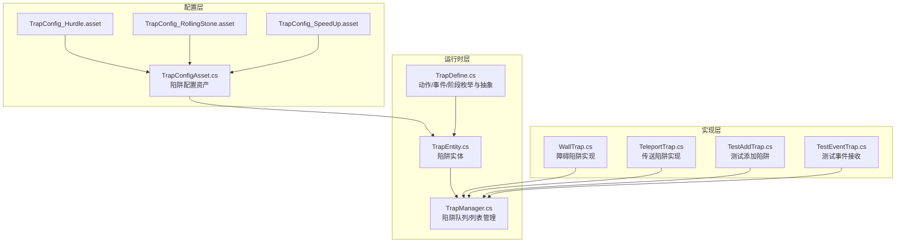
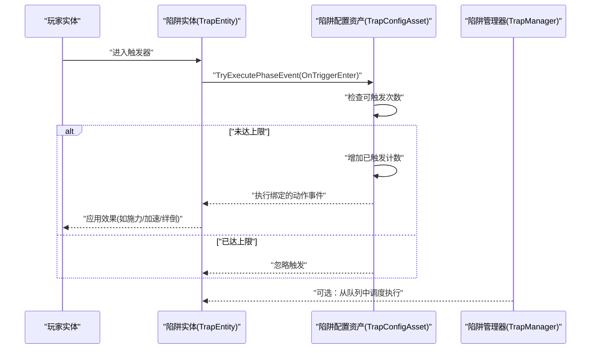
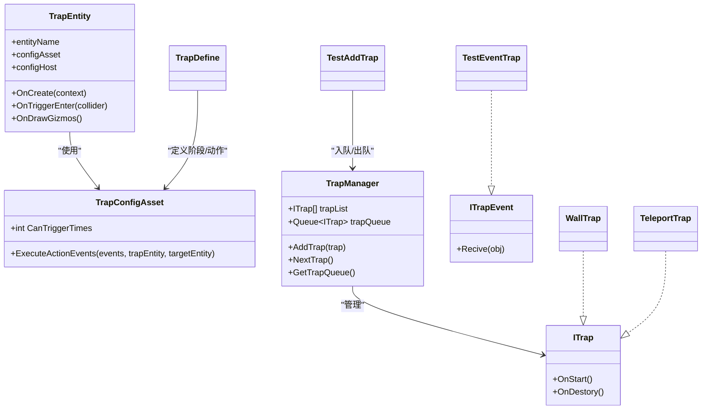

# 陷阱配置系统

<cite>
**本文引用的文件**
- [TrapConfigAsset.cs](file://Assets/Scripts/Config/Entity/Trap/TrapConfigAsset.cs)
- [TrapDefine.cs](file://Assets/Scripts/Modules/Traps/TrapDefine.cs)
- [TrapManager.cs](file://Assets/Scripts/Modules/Traps/TrapManager.cs)
- [TrapEntity.cs](file://Assets/Scripts/Modules/Traps/TrapEntity.cs)
- [WallTrap.cs](file://Assets/Scripts/Modules/Traps/WallTrap.cs)
- [TestAddTrap.cs](file://Assets/Scripts/Modules/Traps/TestAddTrap.cs)
- [TestEventTrap.cs](file://Assets/Scripts/Modules/Traps/TestEventTrap.cs)
- [TeleportTrap.cs](file://Assets/Scripts/Modules/Traps/TeleportTrap.cs)
- [TrapConfig_Hurdle.asset](file://Assets/Dev/Assets_/TrapConfig_Hurdle.asset)
- [TrapConfig_RollingStone.asset](file://Assets/Dev/Assets_/TrapConfig_RollingStone.asset)
- [TrapConfig_SpeedUp.asset](file://Assets/Dev/Assets_/TrapConfig_SpeedUp.asset)
</cite>

## 目录
1. [简介](#简介)
2. [项目结构](#项目结构)
3. [核心组件](#核心组件)
4. [架构总览](#架构总览)
5. [详细组件分析](#详细组件分析)
6. [依赖关系分析](#依赖关系分析)
7. [性能考量](#性能考量)
8. [故障排查指南](#故障排查指南)
9. [结论](#结论)
10. [附录](#附录)

## 简介
本文件系统性梳理 ProjectR 项目的“陷阱配置系统”，覆盖数据结构与类型分类（如障碍陷阱、滚动石陷阱、加速陷阱等）、配置参数（触发条件、伤害/效果数值、持续时间、视觉反馈）、加载与实例化流程、扩展方法（新增陷阱类型与配置校验）、关卡设计应用（布局、难度平衡、玩家体验）以及性能优化与调试技巧。文档以代码为依据，结合可视化图示帮助读者快速理解并高效使用该系统。

## 项目结构
陷阱系统主要由“配置资产”“运行时实体与管理器”“具体陷阱实现”三部分构成，并通过“事件-动作-实现方法”的分层结构组织行为逻辑。

图表来源
- [TrapConfigAsset.cs:1-41](file://Assets/Scripts/Config/Entity/Trap/TrapConfigAsset.cs#L1-L41)
- [TrapEntity.cs:1-42](file://Assets/Scripts/Modules/Traps/TrapEntity.cs#L1-L42)
- [TrapManager.cs:1-43](file://Assets/Scripts/Modules/Traps/TrapManager.cs#L1-L43)
- [TrapDefine.cs:1-84](file://Assets/Scripts/Modules/Traps/TrapDefine.cs#L1-L84)
- [WallTrap.cs:1-25](file://Assets/Scripts/Modules/Traps/WallTrap.cs#L1-L25)
- [TeleportTrap.cs:1-17](file://Assets/Scripts/Modules/Traps/TeleportTrap.cs#L1-L17)
- [TestAddTrap.cs:1-32](file://Assets/Scripts/Modules/Traps/TestAddTrap.cs#L1-L32)
- [TestEventTrap.cs:1-23](file://Assets/Scripts/Modules/Traps/TestEventTrap.cs#L1-L23)
- [TrapConfig_Hurdle.asset:1-27](file://Assets/Dev/Assets_/TrapConfig_Hurdle.asset#L1-L27)
- [TrapConfig_RollingStone.asset:1-31](file://Assets/Dev/Assets_/TrapConfig_RollingStone.asset#L1-L31)
- [TrapConfig_SpeedUp.asset:1-31](file://Assets/Dev/Assets_/TrapConfig_SpeedUp.asset#L1-L31)

章节来源
- [TrapConfigAsset.cs:1-41](file://Assets/Scripts/Config/Entity/Trap/TrapConfigAsset.cs#L1-L41)
- [TrapEntity.cs:1-42](file://Assets/Scripts/Modules/Traps/TrapEntity.cs#L1-L42)
- [TrapManager.cs:1-43](file://Assets/Scripts/Modules/Traps/TrapManager.cs#L1-L43)
- [TrapDefine.cs:1-84](file://Assets/Scripts/Modules/Traps/TrapDefine.cs#L1-L84)
- [WallTrap.cs:1-25](file://Assets/Scripts/Modules/Traps/WallTrap.cs#L1-L25)
- [TeleportTrap.cs:1-17](file://Assets/Scripts/Modules/Traps/TeleportTrap.cs#L1-L17)
- [TestAddTrap.cs:1-32](file://Assets/Scripts/Modules/Traps/TestAddTrap.cs#L1-L32)
- [TestEventTrap.cs:1-23](file://Assets/Scripts/Modules/Traps/TestEventTrap.cs#L1-L23)
- [TrapConfig_Hurdle.asset:1-27](file://Assets/Dev/Assets_/TrapConfig_Hurdle.asset#L1-L27)
- [TrapConfig_RollingStone.asset:1-31](file://Assets/Dev/Assets_/TrapConfig_RollingStone.asset#L1-L31)
- [TrapConfig_SpeedUp.asset:1-31](file://Assets/Dev/Assets_/TrapConfig_SpeedUp.asset#L1-L31)

## 核心组件
- 配置资产与执行控制
  - 陷阱配置资产负责统一的触发计数与事件执行入口，支持“可触发次数上限”控制。
  - 配置资产通过“实体阶段事件”绑定到不同生命周期阶段（如进入触发器），并在满足条件时执行对应动作。
- 运行时实体
  - 陷阱实体继承逻辑实体，创建物理实体并挂接触发器回调；在进入触发器时根据配置执行相应阶段事件。
- 动作/事件/阶段定义
  - 定义了动作类型（如施力、绊倒、加速、无敌星、注册事件、广播事件）、实体阶段（进入/退出碰撞、更新距离、动画事件等）以及事件-动作-实现方法的抽象层次。
- 管理器与实现
  - 陷阱管理器维护陷阱队列与列表，提供入队、出队与获取队列接口。
  - 具体陷阱实现（如障碍、传送）作为 ITrap 接口的承载者，可被管理器调度。

章节来源
- [TrapConfigAsset.cs:15-38](file://Assets/Scripts/Config/Entity/Trap/TrapConfigAsset.cs#L15-L38)
- [TrapEntity.cs:11-31](file://Assets/Scripts/Modules/Traps/TrapEntity.cs#L11-L31)
- [TrapDefine.cs:11-82](file://Assets/Scripts/Modules/Traps/TrapDefine.cs#L11-L82)
- [TrapManager.cs:20-37](file://Assets/Scripts/Modules/Traps/TrapManager.cs#L20-L37)

## 架构总览
陷阱系统采用“配置驱动 + 生命周期事件 + 动作实现”的分层架构：配置资产描述行为，实体在运行时响应生命周期事件，调用动作实现完成具体效果。

图表来源
- [TrapEntity.cs:26-31](file://Assets/Scripts/Modules/Traps/TrapEntity.cs#L26-L31)
- [TrapConfigAsset.cs:31-38](file://Assets/Scripts/Config/Entity/Trap/TrapConfigAsset.cs#L31-L38)
- [TrapManager.cs:20-37](file://Assets/Scripts/Modules/Traps/TrapManager.cs#L20-L37)

## 详细组件分析

### 数据结构与类型分类
- 动作类型（EActionType）
  - 施加外力、绊倒、实体加速、无敌星、注册事件、广播游戏事件。
- 实体阶段（PhyEntityPhase）
  - 碰撞进入/退出、触发器进入/退出、更新与玩家距离、固定帧开始、Lua回调、动画剪辑事件等。
- 事件-动作-实现方法
  - EActionEvent 包含可序列化的动作实现；ActionApproach 抽象动作执行；TrapApproach/ItemApproach 提供陷阱/物品动作的细分。

章节来源
- [TrapDefine.cs:11-82](file://Assets/Scripts/Modules/Traps/TrapDefine.cs#L11-L82)

### 配置资产与加载机制
- 可触发次数
  - 配置资产提供“可触发次数”字段，小于 0 表示无限次；每次触发前会检查并递增计数。
- 阶段事件
  - 配置资产将事件绑定到实体的不同生命周期阶段；OnTriggerEnter 是最常用的触发点。
- 资产示例
  - 障碍陷阱：仅一次触发，触发后执行“绊倒”动作。
  - 滚动石陷阱：物理陷阱，无限触发，触发后执行“滚动石”动作。
  - 加速陷阱：非物理陷阱，无限触发，触发后执行“加速”动作，携带速度、持续时间、朝向锐度等参数。

章节来源
- [TrapConfigAsset.cs:15-38](file://Assets/Scripts/Config/Entity/Trap/TrapConfigAsset.cs#L15-L38)
- [TrapConfig_Hurdle.asset:16-21](file://Assets/Dev/Assets_/TrapConfig_Hurdle.asset#L16-L21)
- [TrapConfig_RollingStone.asset:16-21](file://Assets/Dev/Assets_/TrapConfig_RollingStone.asset#L16-L21)
- [TrapConfig_SpeedUp.asset:15-21](file://Assets/Dev/Assets_/TrapConfig_SpeedUp.asset#L15-L21)

### 实例化与生命周期
- 陷阱实体创建
  - 陷阱实体在创建时获取物理实体实例，创建外观（Avatar），并挂接触发器回调。
- 触发执行
  - 当检测到触发器进入时，实体根据配置执行对应阶段事件；若达到触发上限则忽略。
- 可视化调试
  - 通过绘制 BoxCollider 的 Gizmos 辅助调试碰撞体积。

章节来源
- [TrapEntity.cs:11-39](file://Assets/Scripts/Modules/Traps/TrapEntity.cs#L11-L39)

### 具体陷阱实现
- 障碍陷阱（WallTrap）
  - 承载 ITrap 接口，具备尺寸与碰撞体属性，用于阻挡或改变玩家路径。
- 传送陷阱（TeleportTrap）
  - 作为 ITrap 的占位实现，可用于场景传送或位置重定向。
- 测试陷阱（TestAddTrap/TestEventTrap）
  - 提供入队/出队与事件广播的演示，便于开发调试。

章节来源
- [WallTrap.cs:3-24](file://Assets/Scripts/Modules/Traps/WallTrap.cs#L3-L24)
- [TeleportTrap.cs:3-16](file://Assets/Scripts/Modules/Traps/TeleportTrap.cs#L3-L16)
- [TestAddTrap.cs:6-19](file://Assets/Scripts/Modules/Traps/TestAddTrap.cs#L6-L19)
- [TestEventTrap.cs:5-22](file://Assets/Scripts/Modules/Traps/TestEventTrap.cs#L5-L22)

### 扩展方法：新增陷阱类型与配置验证
- 新增陷阱类型
  - 实现 ITrap 接口并接入陷阱管理器队列；在需要时通过出队执行 OnStart/OnDestroy。
- 新增动作实现
  - 继承 ActionApproach 并实现 ExecuteActionEvent；在配置资产中将动作事件绑定到目标阶段。
- 配置验证建议
  - 校验“可触发次数”是否合理（负数表示无限，非负数需大于等于已触发计数）。
  - 校验阶段事件与动作实现的匹配性（例如物理陷阱不应绑定非物理动作）。
  - 校验参数范围（如加速陷阱的速度与持续时间应在合理区间）。

章节来源
- [ITrap.cs:1-6](file://Assets/Scripts/Modules/Traps/ITrap.cs#L1-L6)
- [ITrapEvent.cs:1-5](file://Assets/Scripts/Modules/Traps/ITrapEvent.cs#L1-L5)
- [TrapDefine.cs:44-58](file://Assets/Scripts/Modules/Traps/TrapDefine.cs#L44-L58)
- [TrapConfigAsset.cs:15-17](file://Assets/Scripts/Config/Entity/Trap/TrapConfigAsset.cs#L15-L17)

### 关卡设计应用
- 布局策略
  - 利用“可触发次数”控制陷阱回收与重复利用；对一次性陷阱（如障碍）与持续陷阱（如加速）进行组合布置。
- 难度平衡
  - 通过阶段事件与动作实现的组合调整难度曲线；例如在高风险区域放置滚动石陷阱，在安全区域放置加速陷阱以提升流畅度。
- 玩家体验
  - 结合视觉反馈（Gizmos 调试）与听觉提示，确保陷阱触发时机与反馈明确；避免过度密集导致挫败感。

章节来源
- [TrapConfigAsset.cs:15-17](file://Assets/Scripts/Config/Entity/Trap/TrapConfigAsset.cs#L15-L17)
- [TrapEntity.cs:33-39](file://Assets/Scripts/Modules/Traps/TrapEntity.cs#L33-L39)

## 依赖关系分析
陷阱系统的关键依赖关系如下：

图表来源
- [TrapConfigAsset.cs:13-38](file://Assets/Scripts/Config/Entity/Trap/TrapConfigAsset.cs#L13-L38)
- [TrapEntity.cs:6-39](file://Assets/Scripts/Modules/Traps/TrapEntity.cs#L6-L39)
- [TrapManager.cs:4-37](file://Assets/Scripts/Modules/Traps/TrapManager.cs#L4-L37)
- [ITrap.cs:1-6](file://Assets/Scripts/Modules/Traps/ITrap.cs#L1-L6)
- [ITrapEvent.cs:1-5](file://Assets/Scripts/Modules/Traps/ITrapEvent.cs#L1-L5)
- [WallTrap.cs:3-24](file://Assets/Scripts/Modules/Traps/WallTrap.cs#L3-L24)
- [TeleportTrap.cs:3-16](file://Assets/Scripts/Modules/Traps/TeleportTrap.cs#L3-L16)
- [TestAddTrap.cs:4-19](file://Assets/Scripts/Modules/Traps/TestAddTrap.cs#L4-L19)
- [TestEventTrap.cs:5-22](file://Assets/Scripts/Modules/Traps/TestEventTrap.cs#L5-L22)
- [TrapDefine.cs:11-82](file://Assets/Scripts/Modules/Traps/TrapDefine.cs#L11-L82)

章节来源
- [TrapConfigAsset.cs:13-38](file://Assets/Scripts/Config/Entity/Trap/TrapConfigAsset.cs#L13-L38)
- [TrapEntity.cs:6-39](file://Assets/Scripts/Modules/Traps/TrapEntity.cs#L6-L39)
- [TrapManager.cs:4-37](file://Assets/Scripts/Modules/Traps/TrapManager.cs#L4-L37)
- [ITrap.cs:1-6](file://Assets/Scripts/Modules/Traps/ITrap.cs#L1-L6)
- [ITrapEvent.cs:1-5](file://Assets/Scripts/Modules/Traps/ITrapEvent.cs#L1-L5)
- [WallTrap.cs:3-24](file://Assets/Scripts/Modules/Traps/WallTrap.cs#L3-L24)
- [TeleportTrap.cs:3-16](file://Assets/Scripts/Modules/Traps/TeleportTrap.cs#L3-L16)
- [TestAddTrap.cs:4-19](file://Assets/Scripts/Modules/Traps/TestAddTrap.cs#L4-L19)
- [TestEventTrap.cs:5-22](file://Assets/Scripts/Modules/Traps/TestEventTrap.cs#L5-L22)
- [TrapDefine.cs:11-82](file://Assets/Scripts/Modules/Traps/TrapDefine.cs#L11-L82)

## 性能考量
- 触发频率控制
  - 使用“可触发次数”限制频繁触发，避免重复计算与状态抖动。
- 物理开销
  - 非必要时避免启用物理陷阱；对物理陷阱应减少复杂刚体与碰撞体数量。
- 事件链路
  - 将动作实现尽量轻量化，避免在事件中执行重型计算；必要时拆分为多阶段或延迟处理。
- 调试可视化
  - 利用 Gizmos 快速定位陷阱体积与触发范围，减少反复构建与运行调试的时间成本。

## 故障排查指南
- 触发无效
  - 检查实体阶段事件是否绑定到正确的阶段（如 OnTriggerEnter）。
  - 检查“可触发次数”是否已达到上限。
- 触发过快或过于频繁
  - 调整“可触发次数”与动作实现的节奏；必要时引入冷却或延迟。
- 调试陷阱体积
  - 使用 OnDrawGizmos 绘制 BoxCollider，确认触发器大小与位置。
- 事件广播问题
  - 确认事件接收方是否正确注册；使用测试事件接收器验证消息通路。

章节来源
- [TrapEntity.cs:33-39](file://Assets/Scripts/Modules/Traps/TrapEntity.cs#L33-L39)
- [TrapConfigAsset.cs:31-38](file://Assets/Scripts/Config/Entity/Trap/TrapConfigAsset.cs#L31-L38)
- [TestEventTrap.cs:13-22](file://Assets/Scripts/Modules/Traps/TestEventTrap.cs#L13-L22)

## 结论
陷阱配置系统通过“配置资产 + 生命周期事件 + 动作实现”的分层设计，实现了灵活、可扩展且易于调试的陷阱机制。开发者可通过配置资产快速定义陷阱行为，通过实体在运行时响应事件并执行动作，再配合管理器进行调度与扩展。在关卡设计中，合理运用可触发次数、阶段事件与动作组合，可在保证挑战性的同时提升玩家体验。

## 附录
- 示例配置要点
  - 障碍陷阱：一次触发，执行“绊倒”动作。
  - 滚动石陷阱：物理陷阱，无限触发，执行“滚动石”动作。
  - 加速陷阱：非物理陷阱，无限触发，执行“加速”动作，携带速度、持续时间、朝向锐度等参数。

章节来源
- [TrapConfig_Hurdle.asset:16-21](file://Assets/Dev/Assets_/TrapConfig_Hurdle.asset#L16-L21)
- [TrapConfig_RollingStone.asset:16-21](file://Assets/Dev/Assets_/TrapConfig_RollingStone.asset#L16-L21)
- [TrapConfig_SpeedUp.asset:15-21](file://Assets/Dev/Assets_/TrapConfig_SpeedUp.asset#L15-L21)