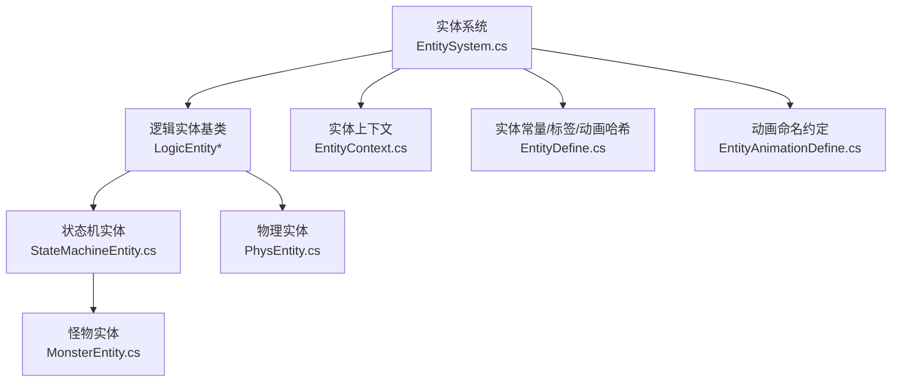
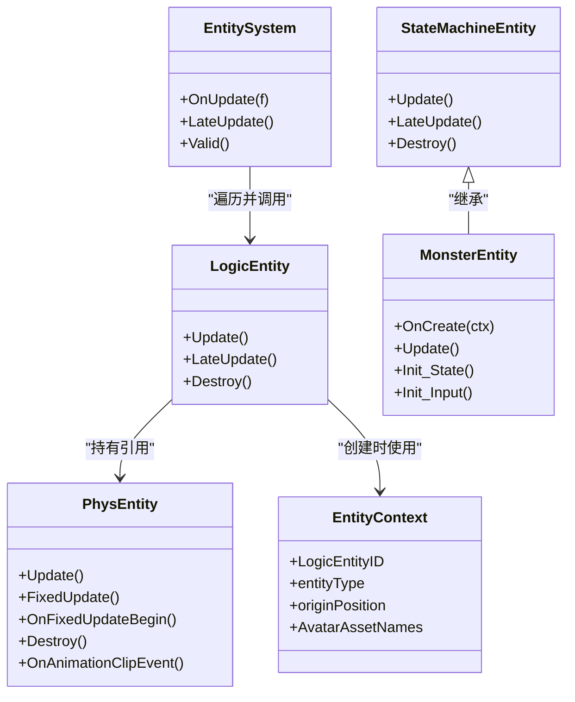
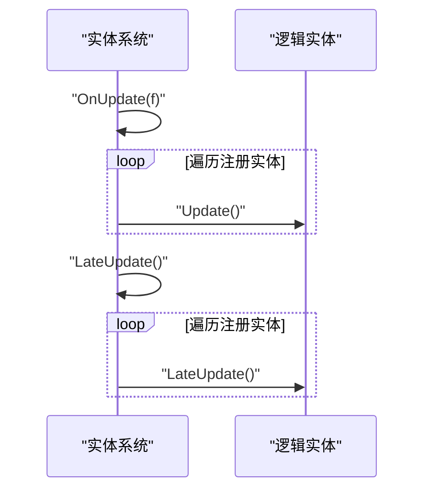
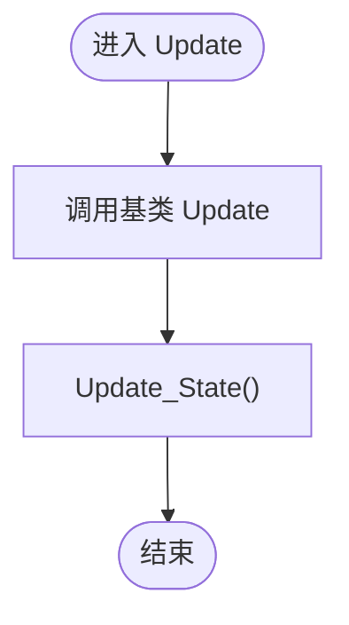
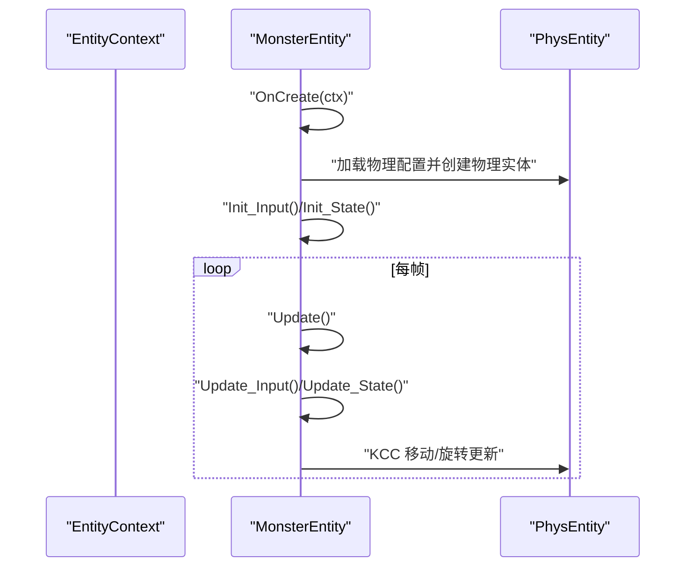
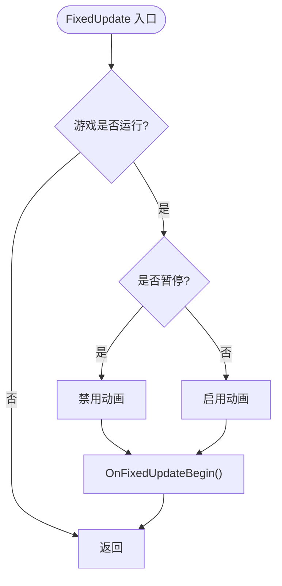
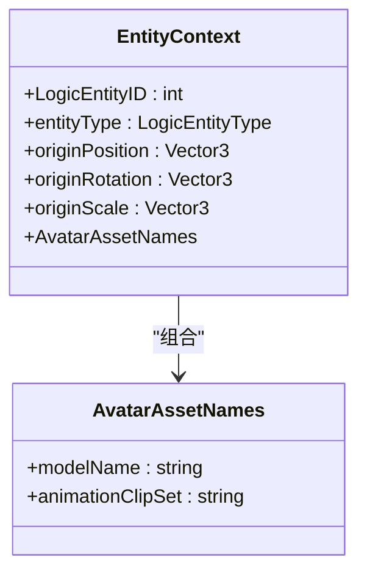
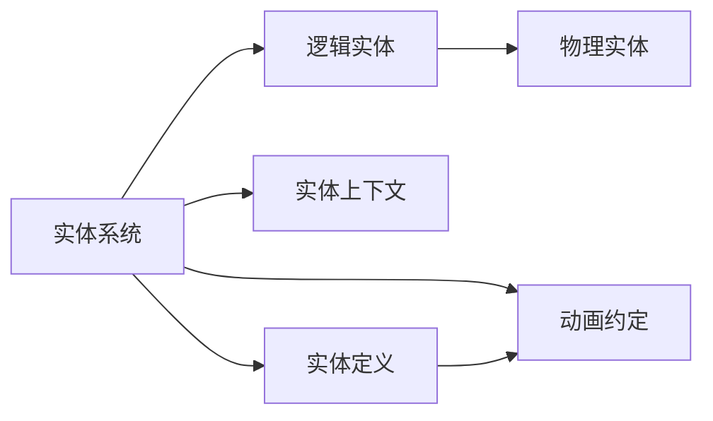

# 实体模块

<cite>
**本文引用的文件**   
- [EntitySystem.cs](file://Assets/Scripts/Systems/Implement/EntitySystem/EntitySystem.cs)
- [EntityDefine.cs](file://Assets/Scripts/Modules/Entity/EntityDefine.cs)
- [EntityAnimationDefine.cs](file://Assets/Scripts/Modules/Entity/EntityAnimationDefine.cs)
- [MonsterEntity.cs](file://Assets/Scripts/Modules/Enemy/MonsterEntity.cs)
- [StateMachineEntity.cs](file://Assets/Scripts/Systems/Implement/EntitySystem/LogicEntity/PlayerEntity/StateMachineEntity.cs)
- [PhysEntity.cs](file://Assets/Scripts/Systems/Implement/EntitySystem/PhysEntity/PhysEntity.cs)
- [EntityContext.cs](file://Assets/Scripts/Systems/Implement/EntitySystem/LogicEntity/EntityContext.cs)
</cite>

## 目录
1. [引言](#引言)
2. [项目结构](#项目结构)
3. [核心组件](#核心组件)
4. [架构总览](#架构总览)
5. [详细组件分析](#详细组件分析)
6. [依赖关系分析](#依赖关系分析)
7. [性能考量](#性能考量)
8. [故障排查指南](#故障排查指南)
9. [结论](#结论)
10. [附录：扩展开发指南](#附录扩展开发指南)

## 引言
本文件面向ProjectR项目的实体模块，系统性阐述实体系统的设计与实现，覆盖角色、怪物、陷阱、物品等实体类型；解释实体生命周期、状态机控制、物理与碰撞处理、动画集成；梳理配置系统、工厂与实体池化思路；并提供可扩展的开发指南与性能优化建议。

## 项目结构
实体系统由“逻辑层-物理层-场景层”三层协作构成：
- 逻辑层：负责实体行为、状态机、输入与业务逻辑（如玩家与怪物实体）
- 物理层：封装物理运动、碰撞、平台效应器、动画事件回调等
- 系统层：统一调度实体的更新与销毁，维护实体注册表

图表来源
- [EntitySystem.cs:1-42](file://Assets/Scripts/Systems/Implement/EntitySystem/EntitySystem.cs#L1-L42)
- [StateMachineEntity.cs:1-78](file://Assets/Scripts/Systems/Implement/EntitySystem/LogicEntity/PlayerEntity/StateMachineEntity.cs#L1-L78)
- [MonsterEntity.cs:1-82](file://Assets/Scripts/Modules/Enemy/MonsterEntity.cs#L1-L82)
- [PhysEntity.cs:1-132](file://Assets/Scripts/Systems/Implement/EntitySystem/PhysEntity/PhysEntity.cs#L1-L132)
- [EntityContext.cs:1-141](file://Assets/Scripts/Systems/Implement/EntitySystem/LogicEntity/EntityContext.cs#L1-L141)
- [EntityDefine.cs:1-64](file://Assets/Scripts/Modules/Entity/EntityDefine.cs#L1-L64)
- [EntityAnimationDefine.cs:1-67](file://Assets/Scripts/Modules/Entity/EntityAnimationDefine.cs#L1-L67)

章节来源
- [EntitySystem.cs:1-42](file://Assets/Scripts/Systems/Implement/EntitySystem/EntitySystem.cs#L1-L42)
- [EntityDefine.cs:1-64](file://Assets/Scripts/Modules/Entity/EntityDefine.cs#L1-L64)

## 核心组件
- 实体系统（EntitySystem）：单例系统，统一驱动所有逻辑实体的Update/LateUpdate，负责实体注册与释放
- 逻辑实体（LogicEntity）：抽象实体逻辑，派生出状态机实体与具体实体类型（如怪物）
- 物理实体（PhysEntity）：封装物理运动、固定帧更新、动画事件、平台效应器、碰撞掩码等
- 实体上下文（EntityContext）：承载实体创建所需的ID、类型、初始姿态、Avatar资源名等
- 实体定义（EntityDefine/EntityAnimationDefine）：统一实体标签、场景节点命名、动画哈希与名称规范

章节来源
- [EntitySystem.cs:17-40](file://Assets/Scripts/Systems/Implement/EntitySystem/EntitySystem.cs#L17-L40)
- [StateMachineEntity.cs:11-35](file://Assets/Scripts/Systems/Implement/EntitySystem/LogicEntity/PlayerEntity/StateMachineEntity.cs#L11-L35)
- [PhysEntity.cs:10-132](file://Assets/Scripts/Systems/Implement/EntitySystem/PhysEntity/PhysEntity.cs#L10-L132)
- [EntityContext.cs:11-56](file://Assets/Scripts/Systems/Implement/EntitySystem/LogicEntity/EntityContext.cs#L11-L56)
- [EntityDefine.cs:5-63](file://Assets/Scripts/Modules/Entity/EntityDefine.cs#L5-L63)
- [EntityAnimationDefine.cs:3-66](file://Assets/Scripts/Modules/Entity/EntityAnimationDefine.cs#L3-L66)

## 架构总览
实体系统采用“逻辑-物理”分离设计，通过系统层统一调度，逻辑实体持有物理实体引用以完成运动与动画同步。状态机实体在逻辑层承担状态切换与输入处理，怪物实体继承状态机实体并注入KCC移动与旋转逻辑。

图表来源
- [EntitySystem.cs:5-41](file://Assets/Scripts/Systems/Implement/EntitySystem/EntitySystem.cs#L5-L41)
- [StateMachineEntity.cs:11-35](file://Assets/Scripts/Systems/Implement/EntitySystem/LogicEntity/PlayerEntity/StateMachineEntity.cs#L11-L35)
- [MonsterEntity.cs:4-35](file://Assets/Scripts/Modules/Enemy/MonsterEntity.cs#L4-L35)
- [PhysEntity.cs:10-132](file://Assets/Scripts/Systems/Implement/EntitySystem/PhysEntity/PhysEntity.cs#L10-L132)
- [EntityContext.cs:11-56](file://Assets/Scripts/Systems/Implement/EntitySystem/LogicEntity/EntityContext.cs#L11-L56)

## 详细组件分析

### 实体系统（EntitySystem）
- 职责：在运行时循环遍历已注册逻辑实体，统一调用其Update/LateUpdate
- 安全校验：非运行时调用会记录错误日志
- 生命周期：通过系统层集中管理实体的创建与销毁

图表来源
- [EntitySystem.cs:17-39](file://Assets/Scripts/Systems/Implement/EntitySystem/EntitySystem.cs#L17-L39)

章节来源
- [EntitySystem.cs:7-40](file://Assets/Scripts/Systems/Implement/EntitySystem/EntitySystem.cs#L7-L40)

### 逻辑实体与状态机实体（StateMachineEntity）
- 职责：封装实体的更新、销毁与状态机生命周期；在销毁时释放物理实体
- 可视化调试：编辑器下绘制速度、状态等信息，辅助调试
- 与系统层交互：通过系统层统一更新

图表来源
- [StateMachineEntity.cs:17-26](file://Assets/Scripts/Systems/Implement/EntitySystem/LogicEntity/PlayerEntity/StateMachineEntity.cs#L17-L26)

章节来源
- [StateMachineEntity.cs:11-35](file://Assets/Scripts/Systems/Implement/EntitySystem/LogicEntity/PlayerEntity/StateMachineEntity.cs#L11-L35)

### 怪物实体（MonsterEntity）
- 继承状态机实体，扩展输入与状态初始化
- 在创建阶段加载物理配置，要求完整物理组件
- 注入KCC移动与旋转逻辑，结合额外速度与状态机进行运动控制

图表来源
- [MonsterEntity.cs:26-50](file://Assets/Scripts/Modules/Enemy/MonsterEntity.cs#L26-L50)
- [MonsterEntity.cs:51-80](file://Assets/Scripts/Modules/Enemy/MonsterEntity.cs#L51-L80)

章节来源
- [MonsterEntity.cs:4-35](file://Assets/Scripts/Modules/Enemy/MonsterEntity.cs#L4-L35)
- [MonsterEntity.cs:36-82](file://Assets/Scripts/Modules/Enemy/MonsterEntity.cs#L36-L82)

### 物理实体（PhysEntity）
- 固定帧更新：在FixedUpdate中根据游戏状态启用/禁用动画
- 动画事件：提供动画剪辑事件回调入口
- 平台效应器：支持动态修改碰撞掩码，适配平台穿透/落空等需求
- 生命周期：销毁时停止动画

图表来源
- [PhysEntity.cs:52-70](file://Assets/Scripts/Systems/Implement/EntitySystem/PhysEntity/PhysEntity.cs#L52-L70)
- [PhysEntity.cs:77-96](file://Assets/Scripts/Systems/Implement/EntitySystem/PhysEntity/PhysEntity.cs#L77-L96)

章节来源
- [PhysEntity.cs:10-132](file://Assets/Scripts/Systems/Implement/EntitySystem/PhysEntity/PhysEntity.cs#L10-L132)

### 实体上下文（EntityContext）
- 承载实体创建所需的关键信息：实体ID、类型、初始位置/旋转/缩放、Avatar资源名等
- 提供Avatar资源名容器，便于在编辑器中选择模型与动画集合

图表来源
- [EntityContext.cs:11-56](file://Assets/Scripts/Systems/Implement/EntitySystem/LogicEntity/EntityContext.cs#L11-L56)
- [EntityContext.cs:62-141](file://Assets/Scripts/Systems/Implement/EntitySystem/LogicEntity/EntityContext.cs#L62-L141)

章节来源
- [EntityContext.cs:11-141](file://Assets/Scripts/Systems/Implement/EntitySystem/LogicEntity/EntityContext.cs#L11-L141)

### 实体定义与动画约定（EntityDefine/EntityAnimationDefine）
- 统一实体类型枚举、场景节点命名、标签与额外值键名
- 提供动画哈希常量与方向化动画名称集，确保动画系统一致性

章节来源
- [EntityDefine.cs:5-63](file://Assets/Scripts/Modules/Entity/EntityDefine.cs#L5-L63)
- [EntityAnimationDefine.cs:3-66](file://Assets/Scripts/Modules/Entity/EntityAnimationDefine.cs#L3-L66)

## 依赖关系分析
- 系统层对逻辑层：系统层持有逻辑实体集合，统一调度其生命周期
- 逻辑层对物理层：逻辑实体持有物理实体引用，驱动运动与动画
- 配置层对逻辑层：通过EntityContext与配置资源（如物理配置）参与实体创建
- 动画层对逻辑层：通过动画哈希与名称约定，驱动动画播放与事件

图表来源
- [EntitySystem.cs:5-41](file://Assets/Scripts/Systems/Implement/EntitySystem/EntitySystem.cs#L5-L41)
- [EntityDefine.cs:5-63](file://Assets/Scripts/Modules/Entity/EntityDefine.cs#L5-L63)
- [EntityAnimationDefine.cs:3-66](file://Assets/Scripts/Modules/Entity/EntityAnimationDefine.cs#L3-L66)

章节来源
- [EntitySystem.cs:17-39](file://Assets/Scripts/Systems/Implement/EntitySystem/EntitySystem.cs#L17-L39)
- [EntityDefine.cs:1-64](file://Assets/Scripts/Modules/Entity/EntityDefine.cs#L1-L64)
- [EntityAnimationDefine.cs:1-67](file://Assets/Scripts/Modules/Entity/EntityAnimationDefine.cs#L1-L67)

## 性能考量
- 固定帧更新控制：在物理层根据游戏运行/暂停状态决定是否启用动画，避免暂停时仍执行动画计算
- 循环遍历开销：系统层按注册顺序遍历实体，建议在实体数量较多时减少无效实体数量或分层管理
- 动画事件回调：通过统一回调入口触发，避免在每帧检查动画状态
- 资源加载：实体创建阶段按需加载物理配置，避免重复加载与内存抖动

章节来源
- [PhysEntity.cs:52-70](file://Assets/Scripts/Systems/Implement/EntitySystem/PhysEntity/PhysEntity.cs#L52-L70)
- [EntitySystem.cs:17-39](file://Assets/Scripts/Systems/Implement/EntitySystem/EntitySystem.cs#L17-L39)

## 故障排查指南
- 非运行时调用系统函数：系统会在日志中输出错误提示，确认仅在运行时调用
- 物理实体未加载完成：物理层在未完成Avatar加载时跳过更新，检查Avatar资源路径与加载流程
- 动画事件未触发：确认动画剪辑事件回调入口被正确绑定
- 平台效应器异常：检查平台效应器的碰撞掩码设置是否符合当前场景需求

章节来源
- [EntitySystem.cs:7-15](file://Assets/Scripts/Systems/Implement/EntitySystem/EntitySystem.cs#L7-L15)
- [PhysEntity.cs:40-48](file://Assets/Scripts/Systems/Implement/EntitySystem/PhysEntity/PhysEntity.cs#L40-L48)
- [PhysEntity.cs:108-121](file://Assets/Scripts/Systems/Implement/EntitySystem/PhysEntity/PhysEntity.cs#L108-L121)

## 结论
实体模块通过清晰的“逻辑-物理-系统”分层，实现了角色、怪物、陷阱、物品等实体的统一管理与扩展。系统层负责生命周期与更新调度，逻辑层承载行为与状态机，物理层提供运动与动画支撑。配合统一的配置与动画约定，模块具备良好的可维护性与扩展性。

## 附录：扩展开发指南
- 创建新实体类型
  - 继承状态机实体或逻辑实体，实现必要的生命周期方法
  - 在创建阶段加载所需配置（如物理配置），并初始化输入与状态
  - 在每帧更新中调用输入与状态更新逻辑
- 使用实体上下文
  - 通过EntityContext传递实体ID、类型与Avatar资源名，确保创建流程一致
- 物理与动画集成
  - 在物理层处理运动与平台效应器，在逻辑层驱动动画与事件
- 性能优化建议
  - 控制实体数量与更新频率，避免在暂停状态下执行动画
  - 合理组织场景节点（如敌人、陷阱、物品根节点），便于批量管理与回收

章节来源
- [StateMachineEntity.cs:17-35](file://Assets/Scripts/Systems/Implement/EntitySystem/LogicEntity/PlayerEntity/StateMachineEntity.cs#L17-L35)
- [EntityContext.cs:11-56](file://Assets/Scripts/Systems/Implement/EntitySystem/LogicEntity/EntityContext.cs#L11-L56)
- [PhysEntity.cs:52-70](file://Assets/Scripts/Systems/Implement/EntitySystem/PhysEntity/PhysEntity.cs#L52-L70)