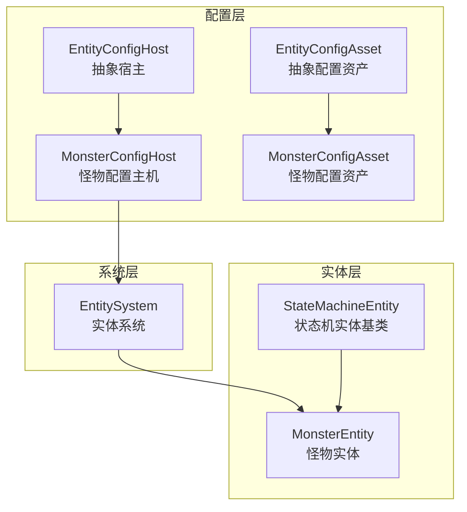
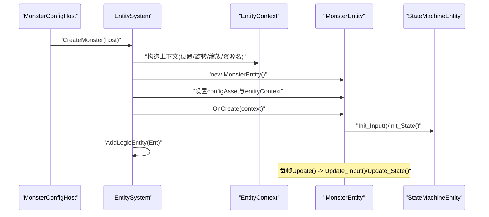
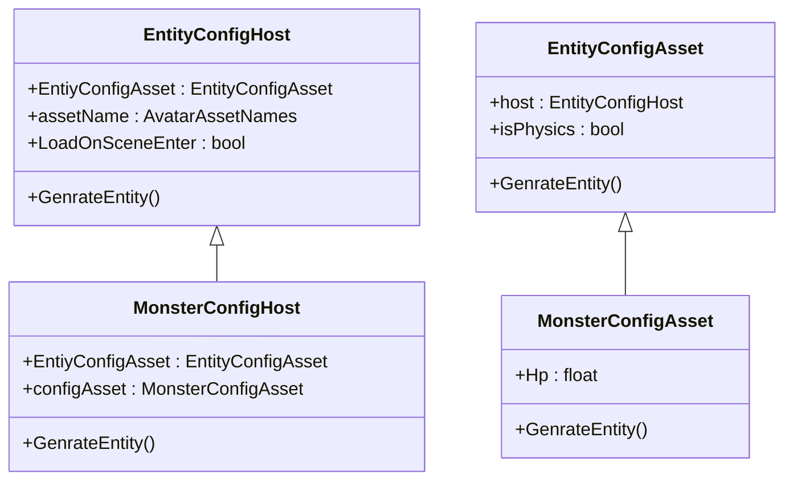
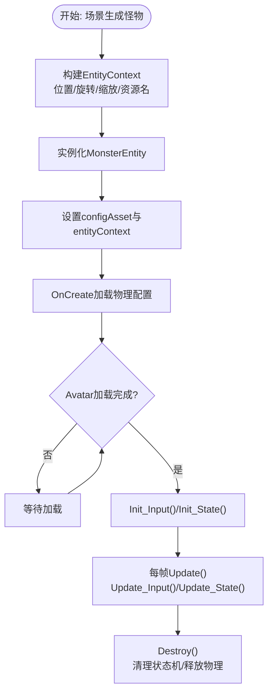
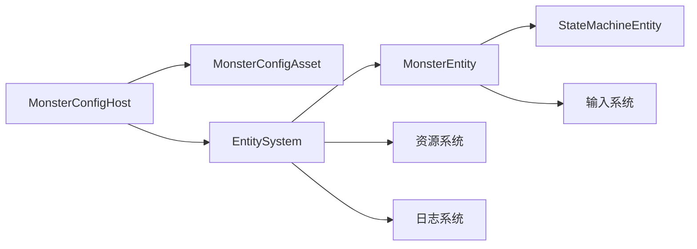

# 怪物实体

<cite>
**本文引用的文件**
- [MonsterConfigHost.cs](file://Assets/Scripts/Modules/Enemy/MonsterConfigHost.cs)
- [MonsterConfigAsset.cs](file://Assets/Scripts/Modules/Enemy/MonsterConfigAsset.cs)
- [MonsterEntity.cs](file://Assets/Scripts/Modules/Enemy/MonsterEntity.cs)
- [EntityConfigHost.cs](file://Assets/Scripts/Modules/Entity/Scene/EntityConfigHost.cs)
- [EntityConfigAsset.cs](file://Assets/Scripts/Config/Entity/EntityConfigAsset.cs)
- [EntitySystem.Logic.Funcs.cs](file://Assets/Scripts/Systems/Implement/EntitySystem/EntitySystem.Logic.Funcs.cs)
- [StateMachineEntity.cs](file://Assets/Scripts/Systems/Implement/EntitySystem/LogicEntity/StateMachineEntity.cs)
- [MonsterConfig_SlimeBoss.asset](file://Assets/Dev/Assets_/MonsterConfig_SlimeBoss.asset)
</cite>

## 目录
1. [简介](#简介)
2. [项目结构](#项目结构)
3. [核心组件](#核心组件)
4. [架构总览](#架构总览)
5. [详细组件分析](#详细组件分析)
6. [依赖关系分析](#依赖关系分析)
7. [性能考量](#性能考量)
8. [故障排查指南](#故障排查指南)
9. [结论](#结论)
10. [附录](#附录)

## 简介
本文件面向ProjectR项目的怪物实体系统，系统性梳理怪物实体的设计架构与运行机制，重点覆盖以下方面：
- 怪物配置主机与配置资产：如何通过配置主机与配置资产驱动实体生成与初始化。
- 怪物实体生命周期：从场景加载到实体创建、物理与输入绑定、状态机初始化、每帧更新与销毁。
- AI行为与状态机：当前实现中怪物实体继承状态机基类，但AI行为尚未在代码中具体展开；本文给出可扩展路径与建议。
- 攻击检测与死亡处理：当前仓库未发现明确的“攻击检测”与“死亡处理”实现，本文提供扩展建议与最佳实践。
- 配置资产结构与参数：以SlimeBoss配置为例，说明属性与可视化资源的组织方式。
- 扩展开发指南：如何新增自定义怪物类型、如何定制AI行为与动画集成。
- 性能优化与平衡性调整：结合现有实现提出可行的优化策略与调参建议。

## 项目结构
怪物实体系统主要由三部分构成：
- 配置层：EntityConfigHost（抽象）与MonsterConfigHost（具体），EntityConfigAsset（抽象）与MonsterConfigAsset（具体）。
- 实体层：MonsterEntity（怪物逻辑实体），继承自StateMachineEntity（状态机实体基类）。
- 系统层：EntitySystem（实体工厂与注册中心），负责根据配置创建实体并加入系统管理。

图表来源
- [EntityConfigHost.cs:1-33](file://Assets/Scripts/Modules/Entity/Scene/EntityConfigHost.cs#L1-L33)
- [MonsterConfigHost.cs:1-23](file://Assets/Scripts/Modules/Enemy/MonsterConfigHost.cs#L1-L23)
- [EntityConfigAsset.cs:1-19](file://Assets/Scripts/Config/Entity/EntityConfigAsset.cs#L1-L19)
- [MonsterConfigAsset.cs:1-27](file://Assets/Scripts/Modules/Enemy/MonsterConfigAsset.cs#L1-L27)
- [StateMachineEntity.cs:1-54](file://Assets/Scripts/Systems/Implement/EntitySystem/LogicEntity/StateMachineEntity.cs#L1-L54)
- [MonsterEntity.cs:1-82](file://Assets/Scripts/Modules/Enemy/MonsterEntity.cs#L1-L82)
- [EntitySystem.Logic.Funcs.cs:38-58](file://Assets/Scripts/Systems/Implement/EntitySystem/EntitySystem.Logic.Funcs.cs#L38-L58)

章节来源
- [EntityConfigHost.cs:1-33](file://Assets/Scripts/Modules/Entity/Scene/EntityConfigHost.cs#L1-L33)
- [EntityConfigAsset.cs:1-19](file://Assets/Scripts/Config/Entity/EntityConfigAsset.cs#L1-L19)
- [MonsterConfigHost.cs:1-23](file://Assets/Scripts/Modules/Enemy/MonsterConfigHost.cs#L1-L23)
- [MonsterConfigAsset.cs:1-27](file://Assets/Scripts/Modules/Enemy/MonsterConfigAsset.cs#L1-L27)
- [StateMachineEntity.cs:1-54](file://Assets/Scripts/Systems/Implement/EntitySystem/LogicEntity/StateMachineEntity.cs#L1-L54)
- [MonsterEntity.cs:1-82](file://Assets/Scripts/Modules/Enemy/MonsterEntity.cs#L1-L82)
- [EntitySystem.Logic.Funcs.cs:38-58](file://Assets/Scripts/Systems/Implement/EntitySystem/EntitySystem.Logic.Funcs.cs#L38-L58)

## 核心组件
- 配置主机（MonsterConfigHost）
  - 负责持有怪物配置资产，并在调用生成接口时委托给实体系统创建怪物实体。
  - 提供场景放置后直接生成实体的能力。
- 配置资产（MonsterConfigAsset）
  - 继承自EntityConfigAsset，承载怪物的基础属性（如生命值等）与通用标记（如是否参与物理）。
  - 提供编辑器菜单用于快速创建配置资源。
- 实体系统（EntitySystem）
  - 提供CreateMonster静态方法，封装实体上下文构建、实体实例化、注册等流程。
- 怪物实体（MonsterEntity）
  - 继承StateMachineEntity，绑定物理更新回调（速度、旋转），并在Avatar加载完成后完成输入与状态机初始化。
  - 当前未实现具体AI行为，仅保留状态机扩展点。
- 状态机实体基类（StateMachineEntity）
  - 提供实体生命周期中的状态更新与销毁清理，以及对物理配置的访问。

章节来源
- [MonsterConfigHost.cs:13-21](file://Assets/Scripts/Modules/Enemy/MonsterConfigHost.cs#L13-L21)
- [MonsterConfigAsset.cs:9-24](file://Assets/Scripts/Modules/Enemy/MonsterConfigAsset.cs#L9-L24)
- [EntitySystem.Logic.Funcs.cs:38-58](file://Assets/Scripts/Systems/Implement/EntitySystem/EntitySystem.Logic.Funcs.cs#L38-L58)
- [MonsterEntity.cs:6-43](file://Assets/Scripts/Modules/Enemy/MonsterEntity.cs#L6-L43)
- [StateMachineEntity.cs:17-35](file://Assets/Scripts/Systems/Implement/EntitySystem/LogicEntity/StateMachineEntity.cs#L17-L35)

## 架构总览
下图展示了从场景配置到实体运行的关键交互链路：

图表来源
- [EntitySystem.Logic.Funcs.cs:38-58](file://Assets/Scripts/Systems/Implement/EntitySystem/EntitySystem.Logic.Funcs.cs#L38-L58)
- [MonsterEntity.cs:26-50](file://Assets/Scripts/Modules/Enemy/MonsterEntity.cs#L26-L50)
- [StateMachineEntity.cs:17-22](file://Assets/Scripts/Systems/Implement/EntitySystem/LogicEntity/StateMachineEntity.cs#L17-L22)

## 详细组件分析

### 配置主机与配置资产
- 设计要点
  - 配置主机持有配置资产，负责在场景中触发实体生成。
  - 配置资产继承自通用基类，统一了isPhysics等通用标记。
- 关键行为
  - 生成实体：当配置资产有效时，调用实体系统创建怪物实体。
  - 编辑器支持：提供菜单项快速创建怪物配置资源。

图表来源
- [EntityConfigHost.cs:6-31](file://Assets/Scripts/Modules/Entity/Scene/EntityConfigHost.cs#L6-L31)
- [MonsterConfigHost.cs:6-22](file://Assets/Scripts/Modules/Enemy/MonsterConfigHost.cs#L6-L22)
- [EntityConfigAsset.cs:8-18](file://Assets/Scripts/Config/Entity/EntityConfigAsset.cs#L8-L18)
- [MonsterConfigAsset.cs:9-24](file://Assets/Scripts/Modules/Enemy/MonsterConfigAsset.cs#L9-L24)

章节来源
- [EntityConfigHost.cs:14-30](file://Assets/Scripts/Modules/Entity/Scene/EntityConfigHost.cs#L14-L30)
- [MonsterConfigHost.cs:13-21](file://Assets/Scripts/Modules/Enemy/MonsterConfigHost.cs#L13-L21)
- [EntityConfigAsset.cs:10-17](file://Assets/Scripts/Config/Entity/EntityConfigAsset.cs#L10-L17)
- [MonsterConfigAsset.cs:11-24](file://Assets/Scripts/Modules/Enemy/MonsterConfigAsset.cs#L11-L24)

### 实体系统与实体生命周期
- 生命周期阶段
  - 上下文构建：收集初始位置、旋转、缩放与Avatar资源名。
  - 实体创建：实例化怪物实体，注入配置与上下文。
  - 初始化：OnCreate加载物理配置，设置物理组件需求。
  - 输入与状态机初始化：Avatar加载完成后执行。
  - 运行期：每帧更新输入与状态。
  - 销毁：释放物理实体并清理状态机。
- 关键接口
  - EntitySystem.CreateMonster：封装创建流程。
  - StateMachineEntity.Update/LateUpdate/Destroy：统一生命周期管理。

图表来源
- [EntitySystem.Logic.Funcs.cs:42-57](file://Assets/Scripts/Systems/Implement/EntitySystem/EntitySystem.Logic.Funcs.cs#L42-L57)
- [MonsterEntity.cs:26-50](file://Assets/Scripts/Modules/Enemy/MonsterEntity.cs#L26-L50)
- [StateMachineEntity.cs:17-35](file://Assets/Scripts/Systems/Implement/EntitySystem/LogicEntity/StateMachineEntity.cs#L17-L35)

章节来源
- [EntitySystem.Logic.Funcs.cs:38-58](file://Assets/Scripts/Systems/Implement/EntitySystem/EntitySystem.Logic.Funcs.cs#L38-L58)
- [MonsterEntity.cs:26-82](file://Assets/Scripts/Modules/Enemy/MonsterEntity.cs#L26-L82)
- [StateMachineEntity.cs:17-35](file://Assets/Scripts/Systems/Implement/EntitySystem/LogicEntity/StateMachineEntity.cs#L17-L35)

### AI行为与状态机
- 当前实现
  - 怪物实体继承StateMachineEntity，具备状态机扩展能力，但未在仓库中看到具体AI行为或行为树实现。
  - 物理更新回调中保留了脚本状态机的注释，表明未来可能接入脚本状态机或行为树。
- 可扩展路径
  - 引入脚本状态机：在OnAvatarLoadDone后初始化脚本状态机，将移动、旋转、攻击等行为映射到状态节点。
  - 行为树系统：在EntityContext中挂接行为树控制器，通过黑板传递目标、距离、血量等感知数据。
  - 决策逻辑：基于感知数据与预设权重进行动作选择，例如追击、巡逻、攻击、逃跑。
- 建议的数据通道
  - 使用黑板（BlackBoard）存储感知数据（如最近玩家、障碍物、血量百分比）。
  - 将状态切换事件与动画事件对接，确保动作与状态一致。

章节来源
- [MonsterEntity.cs:8-14](file://Assets/Scripts/Modules/Enemy/MonsterEntity.cs#L8-L14)
- [MonsterEntity.cs:51-80](file://Assets/Scripts/Modules/Enemy/MonsterEntity.cs#L51-L80)
- [StateMachineEntity.cs:17-22](file://Assets/Scripts/Systems/Implement/EntitySystem/LogicEntity/StateMachineEntity.cs#L17-L22)

### 攻击检测与死亡处理
- 攻击检测
  - 建议在怪物实体中增加碰撞/范围检测逻辑，结合配置资产中的攻击参数（伤害、冷却、范围）进行判定。
  - 可使用触发器或射线检测，避免频繁物理碰撞带来的性能开销。
- 死亡处理
  - 在血量归零时触发死亡状态，播放死亡动画并延迟销毁。
  - 清理所有行为树/状态机任务，释放占用资源。
- 与系统解耦
  - 将伤害计算与反馈通过事件或消息系统广播，便于UI与统计模块订阅。

章节来源
- [MonsterConfigAsset.cs:11](file://Assets/Scripts/Modules/Enemy/MonsterConfigAsset.cs#L11)
- [MonsterEntity.cs:26-35](file://Assets/Scripts/Modules/Enemy/MonsterEntity.cs#L26-L35)

### 配置资产结构与参数
- 结构说明
  - isPhysics：决定实体是否参与物理模拟。
  - 其他属性：如Hp等，可在配置资产中按需扩展。
  - Avatar资源：通过AvatarAssetNames在EntityContext中传递，交由资源系统加载。
- 示例：SlimeBoss配置
  - YAML中包含isPhysics与Hp字段，体现基础属性与物理标记。

章节来源
- [EntityConfigAsset.cs:13-14](file://Assets/Scripts/Config/Entity/EntityConfigAsset.cs#L13-L14)
- [MonsterConfigAsset.cs:11](file://Assets/Scripts/Modules/Enemy/MonsterConfigAsset.cs#L11)
- [MonsterConfig_SlimeBoss.asset:15-16](file://Assets/Dev/Assets_/MonsterConfig_SlimeBoss.asset#L15-L16)

### 扩展开发指南
- 新增自定义怪物类型
  - 创建新的配置资产类，继承EntityConfigAsset，添加所需属性。
  - 创建对应的配置主机类，继承EntityConfigHost，绑定新配置资产。
  - 在EntitySystem中扩展创建方法，或复用现有CreateMonster模式。
- AI行为定制
  - 在MonsterEntity中扩展状态机或行为树，定义状态节点与转换条件。
  - 使用黑板传递感知数据，结合配置资产中的行为参数（如视野、攻击间隔）。
- 动画集成
  - 将动画事件与状态切换绑定，确保动作与逻辑一致。
  - 利用Animancer或其他动画系统，将状态机输出映射到动画层。

章节来源
- [EntityConfigAsset.cs:8-18](file://Assets/Scripts/Config/Entity/EntityConfigAsset.cs#L8-L18)
- [EntityConfigHost.cs:6-31](file://Assets/Scripts/Modules/Entity/Scene/EntityConfigHost.cs#L6-L31)
- [EntitySystem.Logic.Funcs.cs:38-58](file://Assets/Scripts/Systems/Implement/EntitySystem/EntitySystem.Logic.Funcs.cs#L38-L58)

## 依赖关系分析
- 组件耦合
  - MonsterConfigHost依赖MonsterConfigAsset与EntitySystem。
  - MonsterEntity依赖StateMachineEntity与物理配置。
  - EntitySystem作为工厂，集中管理实体创建与注册。
- 外部依赖
  - 资源系统：加载EntityPhysicsConfig。
  - 输入系统：注册输入句柄。
  - 日志系统：错误输出。

图表来源
- [MonsterConfigHost.cs:10-21](file://Assets/Scripts/Modules/Enemy/MonsterConfigHost.cs#L10-L21)
- [EntitySystem.Logic.Funcs.cs:38-58](file://Assets/Scripts/Systems/Implement/EntitySystem/EntitySystem.Logic.Funcs.cs#L38-L58)
- [MonsterEntity.cs:26-35](file://Assets/Scripts/Modules/Enemy/MonsterEntity.cs#L26-L35)

章节来源
- [MonsterConfigHost.cs:10-21](file://Assets/Scripts/Modules/Enemy/MonsterConfigHost.cs#L10-L21)
- [EntitySystem.Logic.Funcs.cs:38-58](file://Assets/Scripts/Systems/Implement/EntitySystem/EntitySystem.Logic.Funcs.cs#L38-L58)
- [MonsterEntity.cs:26-35](file://Assets/Scripts/Modules/Enemy/MonsterEntity.cs#L26-L35)

## 性能考量
- 物理与渲染分离
  - isPhysics为false时避免附加刚体，减少物理计算。
  - 合理设置Avatar资源，避免过大贴图与骨骼数量。
- 更新频率控制
  - 将非必要更新移出每帧Update，使用定时器或事件驱动。
- 状态机与行为树
  - 降低状态切换频率，合并相似状态。
  - 对感知区域与决策频率做节流处理。
- 资源加载
  - 使用资源池与异步加载，避免主线程阻塞。

## 故障排查指南
- 配置资产为空
  - 现象：生成实体时报错。
  - 排查：确认配置主机已绑定有效配置资产。
- Avatar加载失败
  - 现象：OnAvatarLoadDone不触发，输入与状态机初始化缺失。
  - 排查：检查Avatar资源名与资源系统配置。
- 物理配置缺失
  - 现象：OnCreate失败日志。
  - 排查：确认EntityPhysicsConfig.asset存在且可被资源系统加载。

章节来源
- [MonsterConfigHost.cs:15-19](file://Assets/Scripts/Modules/Enemy/MonsterConfigHost.cs#L15-L19)
- [MonsterEntity.cs:36-43](file://Assets/Scripts/Modules/Enemy/MonsterEntity.cs#L36-L43)
- [MonsterEntity.cs:28-31](file://Assets/Scripts/Modules/Enemy/MonsterEntity.cs#L28-L31)

## 结论
ProjectR的怪物实体系统采用“配置主机+配置资产+实体系统+实体”的分层设计，具备良好的扩展性。当前实现完成了实体生命周期与物理/输入绑定，AI行为与战斗交互尚未在代码中落地。建议后续引入脚本状态机或行为树系统，完善感知、决策与动画联动，并通过配置资产与系统参数实现平衡性与性能的双重优化。

## 附录
- 快速上手步骤
  - 在场景中放置MonsterConfigHost，绑定MonsterConfigAsset。
  - 在配置资产中设置isPhysics与基础属性（如Hp）。
  - 运行场景，怪物实体将自动创建并进入生命周期。
- 参考文件
  - [MonsterConfig_SlimeBoss.asset](file://Assets/Dev/Assets_/MonsterConfig_SlimeBoss.asset)