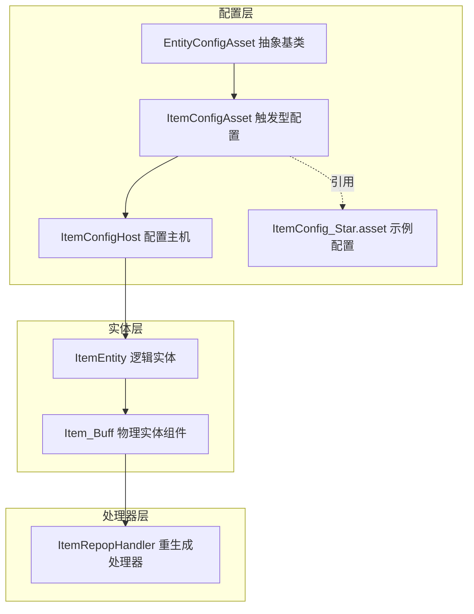
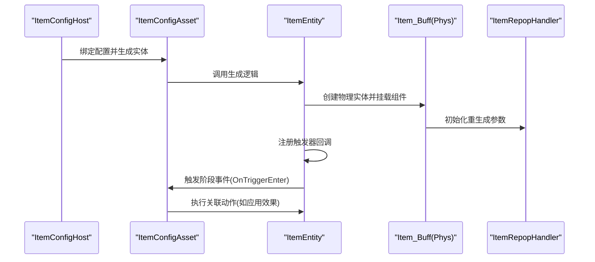
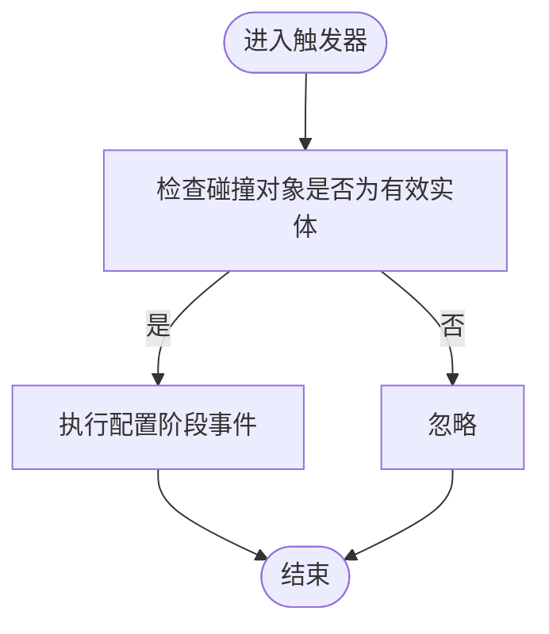
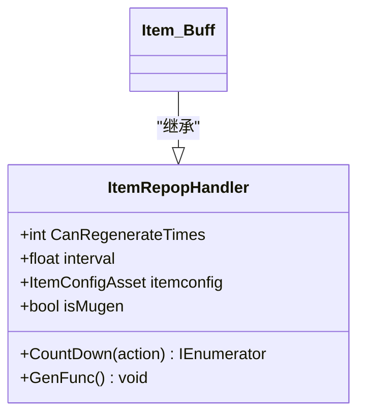
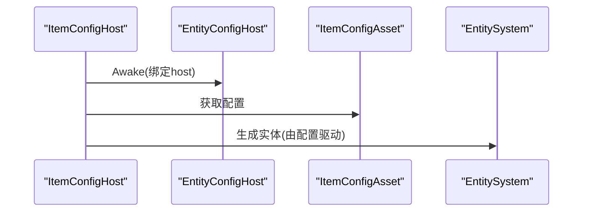
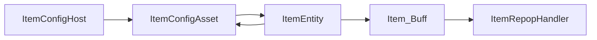

# 物品实体

<cite>
**本文引用的文件**
- [ItemConfigHost.cs](file://Assets/Scripts/Modules/Items/ItemConfigHost.cs)
- [ItemEntity.cs](file://Assets/Scripts/Modules/Items/ItemEntity.cs)
- [Item_Buff.cs](file://Assets/Scripts/Modules/Items/Item_Buff.cs)
- [ItemConfigAsset.cs](file://Assets/Scripts/Modules/Items/ItemConfigAsset.cs)
- [ItemRepopHandler.cs](file://Assets/Scripts/Modules/Items/ItemRepopHandler.cs)
- [EntityConfigHost.cs](file://Assets/Scripts/Modules/Entity/Scene/EntityConfigHost.cs)
- [EntityConfigAsset.cs](file://Assets/Scripts/Config/Entity/EntityConfigAsset.cs)
- [ItemConfig_Star.asset](file://Assets/Dev/Assets_/ItemConfig_Star.asset)
</cite>

## 目录
1. [简介](#简介)
2. [项目结构](#项目结构)
3. [核心组件](#核心组件)
4. [架构总览](#架构总览)
5. [详细组件分析](#详细组件分析)
6. [依赖关系分析](#依赖关系分析)
7. [性能考量](#性能考量)
8. [故障排查指南](#故障排查指南)
9. [结论](#结论)
10. [附录：扩展开发指南](#附录扩展开发指南)

## 简介
本文件面向ProjectR项目的“物品实体”系统，系统围绕三类核心构件展开：物品配置主机（ItemConfigHost）、物品实体（ItemEntity）与物品重生成处理器（ItemRepopHandler）。本文将从架构设计、生命周期管理、拾取检测、效果触发与自动回收机制入手，解释物品配置系统的工作原理，并提供扩展开发指南与性能优化建议。

## 项目结构
物品系统位于模块化目录下，采用“配置资产 + 实体 + 处理器”的分层组织方式：
- 配置层：ItemConfigAsset（触发型配置），EntityConfigAsset（抽象基类）
- 实体层：ItemEntity（逻辑实体），Item_Buff（物理实体上的行为挂载）
- 处理器层：ItemRepopHandler（重生成与倒计时逻辑）

图示来源
- [EntityConfigAsset.cs:1-19](file://Assets/Scripts/Config/Entity/EntityConfigAsset.cs#L1-L19)
- [ItemConfigAsset.cs:1-34](file://Assets/Scripts/Modules/Items/ItemConfigAsset.cs#L1-L34)
- [ItemConfigHost.cs:1-12](file://Assets/Scripts/Modules/Items/ItemConfigHost.cs#L1-L12)
- [ItemEntity.cs:1-44](file://Assets/Scripts/Modules/Items/ItemEntity.cs#L1-L44)
- [Item_Buff.cs:1-12](file://Assets/Scripts/Modules/Items/Item_Buff.cs#L1-L12)
- [ItemRepopHandler.cs:1-37](file://Assets/Scripts/Modules/Items/ItemRepopHandler.cs#L1-L37)
- [ItemConfig_Star.asset:1-31](file://Assets/Dev/Assets_/ItemConfig_Star.asset#L1-L31)

章节来源
- [EntityConfigAsset.cs:1-19](file://Assets/Scripts/Config/Entity/EntityConfigAsset.cs#L1-L19)
- [ItemConfigAsset.cs:1-34](file://Assets/Scripts/Modules/Items/ItemConfigAsset.cs#L1-L34)
- [ItemConfigHost.cs:1-12](file://Assets/Scripts/Modules/Items/ItemConfigHost.cs#L1-L12)
- [ItemEntity.cs:1-44](file://Assets/Scripts/Modules/Items/ItemEntity.cs#L1-L44)
- [Item_Buff.cs:1-12](file://Assets/Scripts/Modules/Items/Item_Buff.cs#L1-L12)
- [ItemRepopHandler.cs:1-37](file://Assets/Scripts/Modules/Items/ItemRepopHandler.cs#L1-L37)
- [ItemConfig_Star.asset:1-31](file://Assets/Dev/Assets_/ItemConfig_Star.asset#L1-L31)

## 核心组件
- 物品配置主机（ItemConfigHost）
  - 继承自EntityConfigHost，负责绑定ItemConfigAsset并驱动实体生成。
- 物品实体（ItemEntity）
  - 继承自LogicEntity，负责创建物理实体、注册触发事件、调用配置的阶段事件。
- 物品重生成处理器（ItemRepopHandler）
  - 提供可再生次数、间隔时间等通用逻辑；具体功能可通过继承扩展（如Item_Buff）。
- 物品配置资产（ItemConfigAsset）
  - 继承自TriggerConfigAsset，承载“可再生次数”、“再生间隔”以及触发阶段事件列表。
- 物理实体组件（Item_Buff）
  - 继承自ItemRepopHandler，作为物理实体上的行为挂载点。

章节来源
- [ItemConfigHost.cs:5-11](file://Assets/Scripts/Modules/Items/ItemConfigHost.cs#L5-L11)
- [ItemEntity.cs:7-41](file://Assets/Scripts/Modules/Items/ItemEntity.cs#L7-L41)
- [ItemRepopHandler.cs:8-26](file://Assets/Scripts/Modules/Items/ItemRepopHandler.cs#L8-L26)
- [ItemConfigAsset.cs:12-31](file://Assets/Scripts/Modules/Items/ItemConfigAsset.cs#L12-L31)
- [Item_Buff.cs:3-9](file://Assets/Scripts/Modules/Items/Item_Buff.cs#L3-L9)

## 架构总览
物品系统遵循“配置驱动 + 触发执行”的模式：
- 配置资产定义物品属性与触发阶段事件；
- 配置主机在场景中绑定配置并生成实体；
- 实体创建物理实体并在触发器中执行配置事件；
- 处理器负责周期性或一次性效果的调度与回收。

图示来源
- [ItemConfigHost.cs:7-10](file://Assets/Scripts/Modules/Items/ItemConfigHost.cs#L7-L10)
- [ItemEntity.cs:12-36](file://Assets/Scripts/Modules/Items/ItemEntity.cs#L12-L36)
- [Item_Buff.cs:3-9](file://Assets/Scripts/Modules/Items/Item_Buff.cs#L3-L9)
- [ItemRepopHandler.cs:17-25](file://Assets/Scripts/Modules/Items/ItemRepopHandler.cs#L17-L25)
- [ItemConfigAsset.cs:27-30](file://Assets/Scripts/Modules/Items/ItemConfigAsset.cs#L27-L30)

## 详细组件分析

### 物品配置主机（ItemConfigHost）
- 职责
  - 将ItemConfigAsset暴露给编辑器进行可视化配置；
  - 通过EntityConfigHost的生成流程创建对应实体。
- 关键点
  - 使用InlineEditor在检视器中直接编辑配置；
  - 重写EntiyConfigAsset以返回当前配置实例。

章节来源
- [ItemConfigHost.cs:5-11](file://Assets/Scripts/Modules/Items/ItemConfigHost.cs#L5-L11)

### 物品实体（ItemEntity）
- 生命周期
  - OnCreate：创建物理实体、注册触发器回调、挂载Item_Buff组件并传递配置。
  - Destroy：销毁GameObject。
- 拾取检测
  - 在触发器进入/停留时，若碰撞对象为有效实体，则尝试执行配置中的阶段事件。
- 效果触发
  - 通过配置资产的TryExecutePhaseEvent按阶段派发事件到目标实体。

图示来源
- [ItemEntity.cs:31-36](file://Assets/Scripts/Modules/Items/ItemEntity.cs#L31-L36)
- [ItemConfigAsset.cs:27-30](file://Assets/Scripts/Modules/Items/ItemConfigAsset.cs#L27-L30)

章节来源
- [ItemEntity.cs:12-41](file://Assets/Scripts/Modules/Items/ItemEntity.cs#L12-L41)

### 物品重生成处理器（ItemRepopHandler）
- 属性
  - 可再生次数（CanRegenerateTimes）：小于等于0表示无限次；
  - 再生间隔（interval）：倒计时时间；
  - 关联配置（itemconfig）：用于读取配置参数。
- 方法
  - CountDown：基于协程的倒计时调度，到期后执行传入动作；
  - GenFunc：预留的生成函数入口，可在子类中覆盖实现具体逻辑。

图示来源
- [ItemRepopHandler.cs:8-26](file://Assets/Scripts/Modules/Items/ItemRepopHandler.cs#L8-L26)
- [Item_Buff.cs:3-9](file://Assets/Scripts/Modules/Items/Item_Buff.cs#L3-L9)

章节来源
- [ItemRepopHandler.cs:8-37](file://Assets/Scripts/Modules/Items/ItemRepopHandler.cs#L8-L37)
- [Item_Buff.cs:1-12](file://Assets/Scripts/Modules/Items/Item_Buff.cs#L1-L12)

### 物品配置资产（ItemConfigAsset）
- 字段
  - CanRegenerateTimes：可再生次数；
  - interval：再生间隔；
  - 触发阶段事件列表：在特定阶段对碰撞实体执行动作。
- 行为
  - 重写执行逻辑以支持动作事件链式处理；
  - 编辑器菜单项用于快速创建配置资源。

章节来源
- [ItemConfigAsset.cs:14-18](file://Assets/Scripts/Modules/Items/ItemConfigAsset.cs#L14-L18)
- [ItemConfigAsset.cs:27-30](file://Assets/Scripts/Modules/Items/ItemConfigAsset.cs#L27-L30)
- [ItemConfigAsset.cs:21-25](file://Assets/Scripts/Modules/Items/ItemConfigAsset.cs#L21-L25)

### 配置主机与实体生成流程
- EntityConfigHost
  - 抽象主机，负责在Awake时将host指回自身；
  - GenrateEntity默认委托给配置资产执行。
- ItemConfigHost
  - 返回ItemConfigAsset并驱动生成。

图示来源
- [EntityConfigHost.cs:14-31](file://Assets/Scripts/Modules/Entity/Scene/EntityConfigHost.cs#L14-L31)
- [ItemConfigHost.cs:7-10](file://Assets/Scripts/Modules/Items/ItemConfigHost.cs#L7-L10)

章节来源
- [EntityConfigHost.cs:6-31](file://Assets/Scripts/Modules/Entity/Scene/EntityConfigHost.cs#L6-L31)
- [ItemConfigHost.cs:5-11](file://Assets/Scripts/Modules/Items/ItemConfigHost.cs#L5-L11)

### 示例：Star道具配置
- 配置包含一个阶段事件（OnTriggerEnter）与一个动作（ItemMethod_Star）；
- 动作参数包括速度、持续时间、朝向锐度等。

章节来源
- [ItemConfig_Star.asset:15-31](file://Assets/Dev/Assets_/ItemConfig_Star.asset#L15-L31)

## 依赖关系分析
- 组件耦合
  - ItemEntity依赖ItemConfigAsset与ItemRepopHandler；
  - Item_Buff继承ItemRepopHandler，作为物理实体组件；
  - ItemConfigHost依赖ItemConfigAsset并继承EntityConfigHost。
- 外部依赖
  - 触发器事件来自物理实体（PhysEntity）；
  - 配置资产通过引用表指向具体动作类型。

图示来源
- [ItemConfigHost.cs:7-10](file://Assets/Scripts/Modules/Items/ItemConfigHost.cs#L7-L10)
- [ItemEntity.cs:10-29](file://Assets/Scripts/Modules/Items/ItemEntity.cs#L10-L29)
- [Item_Buff.cs:3-9](file://Assets/Scripts/Modules/Items/Item_Buff.cs#L3-L9)
- [ItemRepopHandler.cs:8-26](file://Assets/Scripts/Modules/Items/ItemRepopHandler.cs#L8-L26)

章节来源
- [ItemEntity.cs:10-29](file://Assets/Scripts/Modules/Items/ItemEntity.cs#L10-L29)
- [ItemRepopHandler.cs:8-26](file://Assets/Scripts/Modules/Items/ItemRepopHandler.cs#L8-L26)

## 性能考量
- 触发器回调频率控制
  - 建议在OnTriggerStay中避免高频计算，必要时使用节流或帧间隔判断。
- 协程与倒计时
  - 利用CountDown进行非阻塞等待；注意在销毁时取消协程以避免悬挂。
- 对象池与回收
  - 物品实体销毁后应确保所有引用清理，避免内存泄漏。
- 配置热更新
  - 配置资产变更需谨慎，避免频繁重建实体导致GC抖动。

## 故障排查指南
- 实体创建失败
  - 若物理实体创建失败，日志会输出错误信息；检查实体系统初始化与资源路径。
- 触发无效
  - 确认触发器已正确注册，且碰撞对象具备有效逻辑实体；
  - 检查配置阶段事件是否正确绑定。
- 效果不生效
  - 核对配置动作类型与参数是否匹配；
  - 确认动作执行链路未被中断。

章节来源
- [ItemEntity.cs:14-19](file://Assets/Scripts/Modules/Items/ItemEntity.cs#L14-L19)
- [ItemEntity.cs:31-36](file://Assets/Scripts/Modules/Items/ItemEntity.cs#L31-L36)

## 结论
物品实体系统通过“配置驱动 + 触发执行 + 处理器调度”的架构实现了灵活的道具效果与再生机制。其模块化设计便于扩展与维护，同时保留了良好的性能与可调试性。后续可在处理器层扩展更多效果类型，在配置层增加更丰富的动作与参数，以满足多样化的游戏需求。

## 附录：扩展开发指南
- 自定义物品类型
  - 新建继承自ItemRepopHandler的行为类，覆盖GenFunc实现具体效果；
  - 在ItemConfigAsset中添加新的阶段事件与动作引用。
- 交互逻辑实现
  - 在ItemEntity的触发器回调中根据需要扩展条件判断；
  - 通过配置资产的阶段事件链路将逻辑解耦。
- 效果配置
  - 使用编辑器菜单快速创建配置资源；
  - 在配置资产中填写可再生次数、间隔与动作参数。
- 代码示例路径
  - 生成与挂载：[ItemEntity.cs:12-29](file://Assets/Scripts/Modules/Items/ItemEntity.cs#L12-L29)
  - 触发执行：[ItemEntity.cs:31-36](file://Assets/Scripts/Modules/Items/ItemEntity.cs#L31-L36)
  - 倒计时调度：[ItemRepopHandler.cs:21-25](file://Assets/Scripts/Modules/Items/ItemRepopHandler.cs#L21-L25)
  - 示例配置：[ItemConfig_Star.asset:15-31](file://Assets/Dev/Assets_/ItemConfig_Star.asset#L15-L31)