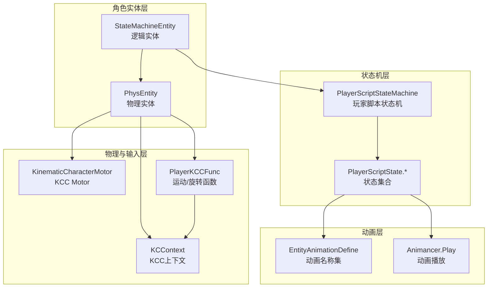
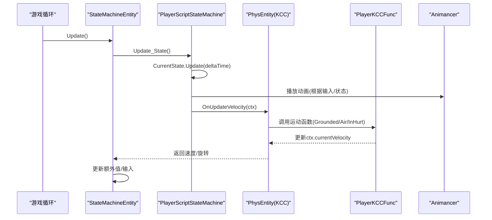
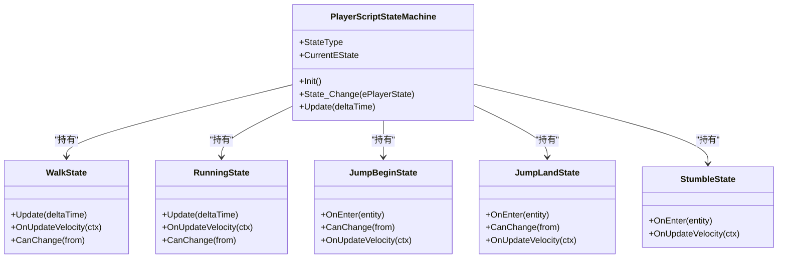
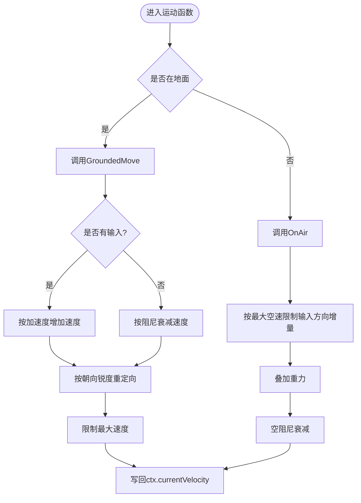
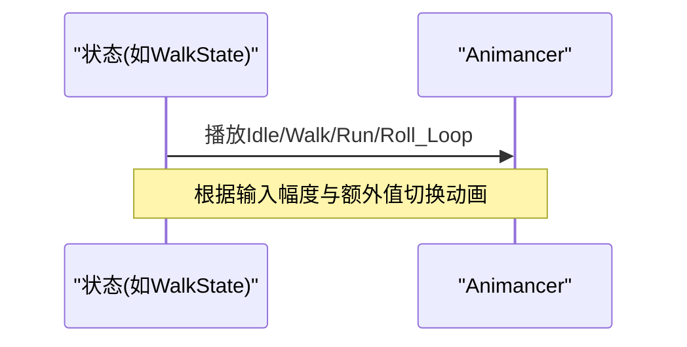
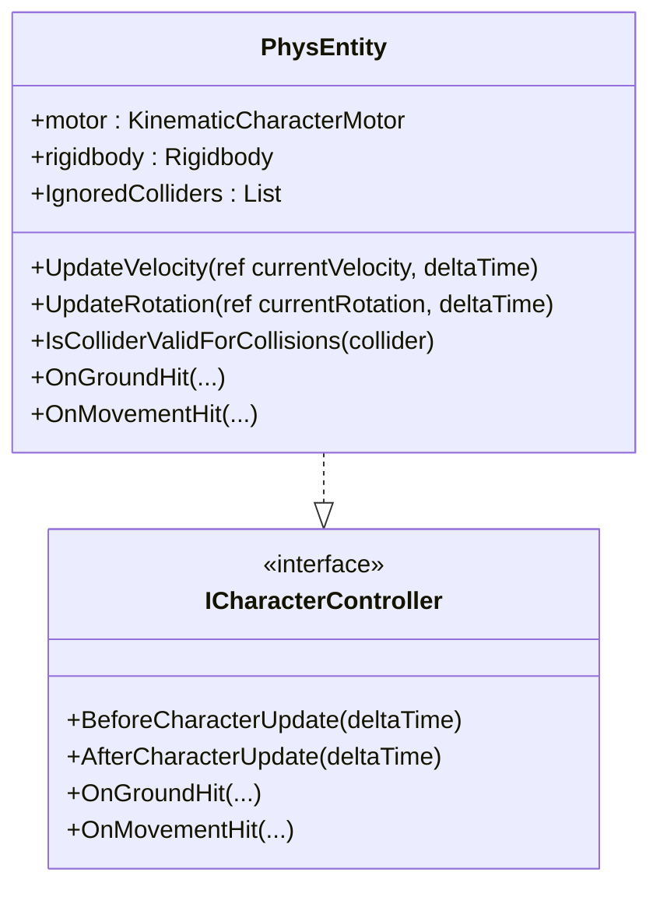
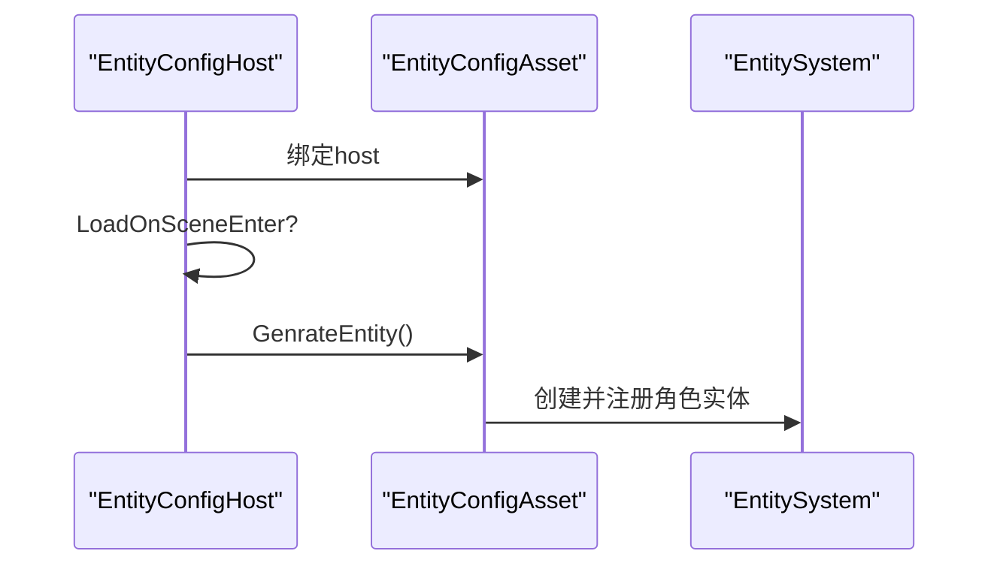
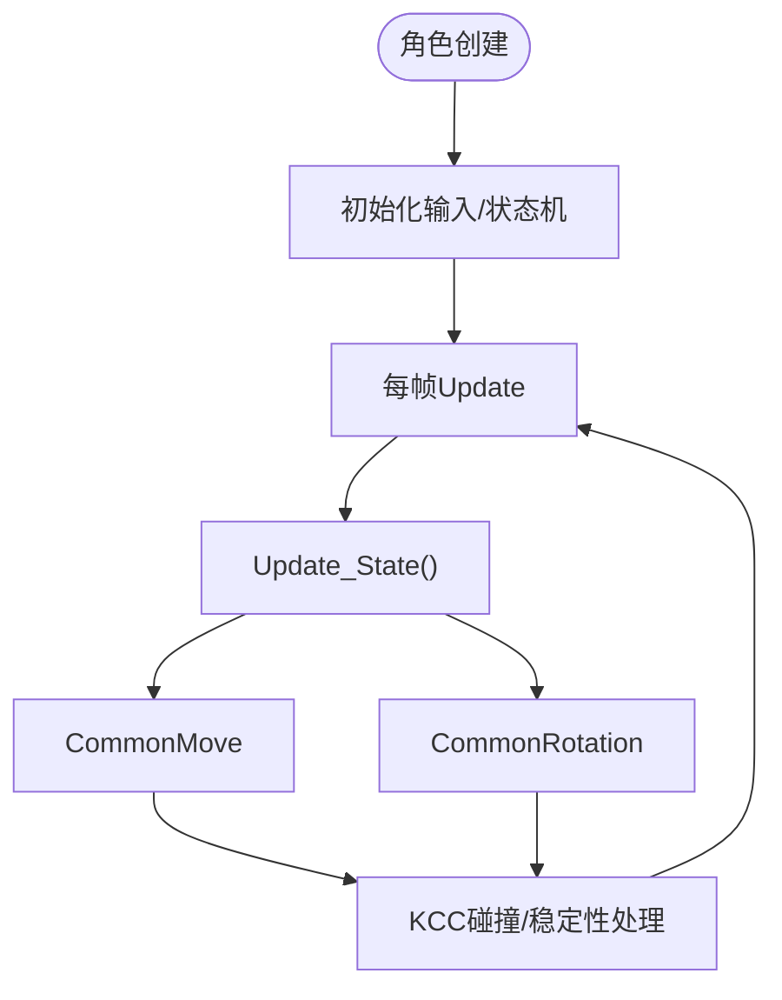
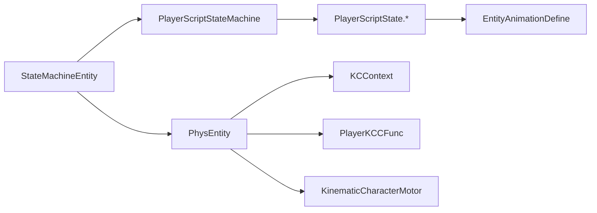

# 角色实体

<cite>
**本文引用的文件**
- [PlayerScriptStateMachine.cs](file://Assets/Scripts/StateMachine/PlayerScriptStateMachine.cs)
- [PlayerScriptState.Imp.cs](file://Assets/Scripts/StateMachine/ScriptState/PlayerScriptState.Imp.cs)
- [EntityAnimationDefine.cs](file://Assets/Scripts/Mmodules/Entity/EntityAnimationDefine.cs)
- [EntityDefine.cs](file://Assets/Scripts/Mmodules/Entity/EntityDefine.cs)
- [PlayerKCCFunc.cs](file://Assets/Scripts/Mmodules/Entity/KCC/PlayerKCCFunc.cs)
- [KCContext.cs](file://Assets/Scripts/Systems/Implement/EntitySystem/PhysEntity/KCContext.cs)
- [PhysEntity.KCC.cs](file://Assets/Scripts/Systems/Implement/EntitySystem/PhysEntity/PhysEntity.KCC.cs)
- [StateMachineEntity.cs](file://Assets/Scripts/Systems/Implement/EntitySystem/LogicEntity/PlayerEntity/StateMachineEntity.cs)
- [EntityConfigHost.cs](file://Assets/Scripts/Mmodules/Entity/Scene/EntityConfigHost.cs)
- [PlayerLoopUpdateAgentSystem.cs](file://Assets/Scripts/Systems/Implement/UpdateAgent/PlayerLoopUpdateAgentSystem.cs)
- [PlayerLoopTree.cs](file://Assets/Scripts/Core/PlayerLoopAgent/PlayerLoopTree.cs)
- [MonsterEntity.cs](file://Assets/Scripts/Modules/Enemy/MonsterEntity.cs)
</cite>

## 目录
1. [简介](#简介)
2. [项目结构](#项目结构)
3. [核心组件](#核心组件)
4. [架构总览](#架构总览)
5. [详细组件分析](#详细组件分析)
6. [依赖关系分析](#依赖关系分析)
7. [性能考虑](#性能考虑)
8. [故障排查指南](#故障排查指南)
9. [结论](#结论)
10. [附录：扩展开发指南](#附录扩展开发指南)

## 简介
本文件面向ProjectR的角色实体系统，聚焦玩家角色实体（StateMachineEntity）的设计与实现，系统性阐述以下主题：
- 角色控制器（KCC）体系：基于KinematicCharacterController的运动与旋转控制
- 动画状态机：脚本驱动的状态机与动画播放控制
- 物理碰撞处理：角色与环境的碰撞检测与稳定性报告
- 场景管理集成：角色配置主机（EntityConfigHost）与场景加载流程
- 角色状态转换逻辑：状态迁移条件与上下文传递
- 生命周期管理：创建、更新、销毁与资源回收
- 输入响应机制：输入轴与触发器到状态机的映射
- 动画播放控制：动画名称集与方向化动画切换
- 性能优化策略与调试技巧
- 扩展开发指南：自定义角色类型与配置参数设置

## 项目结构
角色系统围绕“逻辑实体（LogicEntity）+ 物理实体（PhysEntity）+ 脚本状态机（ScriptEntityStateMachine）”三层组织，配合KCC上下文（KCContext）与动画定义（EntityAnimationDefine）协同工作。

图示来源
- [StateMachineEntity.cs:11-35](file://Assets/Scripts/Systems/Implement/EntitySystem/LogicEntity/PlayerEntity/StateMachineEntity.cs#L11-L35)
- [PlayerScriptStateMachine.cs:7-92](file://Assets/Scripts/StateMachine/PlayerScriptStateMachine.cs#L7-L92)
- [PlayerScriptState.Imp.cs:53-258](file://Assets/Scripts/StateMachine/ScriptState/PlayerScriptState.Imp.cs#L53-L258)
- [KCContext.cs:7-33](file://Assets/Scripts/Systems/Implement/EntitySystem/PhysEntity/KCContext.cs#L7-L33)
- [PhysEntity.KCC.cs:10-112](file://Assets/Scripts/Systems/Implement/EntitySystem/PhysEntity/PhysEntity.KCC.cs#L10-L112)
- [PlayerKCCFunc.cs:9-191](file://Assets/Scripts/Mmodules/Entity/KCC/PlayerKCCFunc.cs#L9-L191)
- [EntityAnimationDefine.cs:3-66](file://Assets/Scripts/Mmodules/Entity/EntityAnimationDefine.cs#L3-L66)

章节来源
- [StateMachineEntity.cs:11-35](file://Assets/Scripts/Systems/Implement/EntitySystem/LogicEntity/PlayerEntity/StateMachineEntity.cs#L11-L35)
- [PlayerScriptStateMachine.cs:7-92](file://Assets/Scripts/StateMachine/PlayerScriptStateMachine.cs#L7-L92)
- [PlayerScriptState.Imp.cs:53-258](file://Assets/Scripts/StateMachine/ScriptState/PlayerScriptState.Imp.cs#L53-L258)
- [KCContext.cs:7-33](file://Assets/Scripts/Systems/Implement/EntitySystem/PhysEntity/KCContext.cs#L7-L33)
- [PhysEntity.KCC.cs:10-112](file://Assets/Scripts/Systems/Implement/EntitySystem/PhysEntity/PhysEntity.KCC.cs#L10-L112)
- [PlayerKCCFunc.cs:9-191](file://Assets/Scripts/Mmodules/Entity/KCC/PlayerKCCFunc.cs#L9-L191)
- [EntityAnimationDefine.cs:3-66](file://Assets/Scripts/Mmodules/Entity/EntityAnimationDefine.cs#L3-L66)

## 核心组件
- 逻辑实体（StateMachineEntity）
  - 负责角色生命周期（Awake/Update/Destroy）、状态机更新与物理实体释放
  - 提供编辑器Gizmos可视化状态信息
- 物理实体（PhysEntity）
  - 封装KCC Motor与刚体，提供速度/旋转回调接口
  - 在UpdateVelocity/UpdateRotation中注入KCContext并调用外部逻辑
- 脚本状态机（PlayerScriptStateMachine）
  - 基于枚举状态（EPlayerState）的脚本状态机，维护状态表与转移列表
  - 初始化时注册各状态及其可转移目标
- 状态实现（PlayerScriptState.*）
  - WalkState/RunningState/JumpBeginState/JumpLandState/Stumble等
  - 在Update中驱动动画，在OnUpdateVelocity中调用KCC运动函数
- KCC上下文（KCContext）
  - 汇聚逻辑实体、物理实体、输入、时间步长、配置等
  - 作为KCC函数与状态机之间的数据通道
- KCC函数（PlayerKCCFunc）
  - 地面移动、空中移动、受伤减速、旋转等统一逻辑
- 动画定义（EntityAnimationDefine）
  - 统一管理动画名称常量与方向化动画集
- 配置主机（EntityConfigHost）
  - 场景级角色配置加载入口，绑定配置资产并生成实体

章节来源
- [StateMachineEntity.cs:11-78](file://Assets/Scripts/Systems/Implement/EntitySystem/LogicEntity/PlayerEntity/StateMachineEntity.cs#L11-L78)
- [PhysEntity.KCC.cs:10-112](file://Assets/Scripts/Systems/Implement/EntitySystem/PhysEntity/PhysEntity.KCC.cs#L10-L112)
- [PlayerScriptStateMachine.cs:7-121](file://Assets/Scripts/StateMachine/PlayerScriptStateMachine.cs#L7-L121)
- [PlayerScriptState.Imp.cs:53-258](file://Assets/Scripts/StateMachine/ScriptState/PlayerScriptState.Imp.cs#L53-L258)
- [KCContext.cs:7-42](file://Assets/Scripts/Systems/Implement/EntitySystem/PhysEntity/KCContext.cs#L7-L42)
- [PlayerKCCFunc.cs:9-191](file://Assets/Scripts/Mmodules/Entity/KCC/PlayerKCCFunc.cs#L9-L191)
- [EntityAnimationDefine.cs:3-66](file://Assets/Scripts/Mmodules/Entity/EntityAnimationDefine.cs#L3-L66)
- [EntityConfigHost.cs:6-31](file://Assets/Scripts/Mmodules/Entity/Scene/EntityConfigHost.cs#L6-L31)

## 架构总览
角色实体系统采用“逻辑-物理-状态机-动画”的分层设计，通过KCContext在各层间传递数据；PlayerKCCFunc集中处理运动与旋转；状态机根据输入与物理状态进行状态迁移，并驱动动画播放。

图示来源
- [StateMachineEntity.cs:17-26](file://Assets/Scripts/Systems/Implement/EntitySystem/LogicEntity/PlayerEntity/StateMachineEntity.cs#L17-L26)
- [PlayerScriptStateMachine.cs:38-45](file://Assets/Scripts/StateMachine/PlayerScriptStateMachine.cs#L38-L45)
- [PlayerScriptState.Imp.cs:55-78](file://Assets/Scripts/StateMachine/ScriptState/PlayerScriptState.Imp.cs#L55-L78)
- [PhysEntity.KCC.cs:95-109](file://Assets/Scripts/Systems/Implement/EntitySystem/PhysEntity/PhysEntity.KCC.cs#L95-L109)
- [PlayerKCCFunc.cs:25-182](file://Assets/Scripts/Mmodules/Entity/KCC/PlayerKCCFunc.cs#L25-L182)

## 详细组件分析

### 状态机与状态转换
- 状态类型与初始化
  - 状态机以枚举（EPlayerState）为索引，预分配状态数组并建立转移表
  - 初始状态为Idle，随后根据输入触发Running/Walking等状态
- 状态转换条件
  - 各状态的CanChange根据当前地面状态、输入幅度或额外值（如冲刺）判定
  - 转移使用ScriptTransition，支持正向与逆向（inverse）配置
- 典型状态行为
  - WalkState：根据输入幅度播放行走/空闲动画，调用地面移动
  - RunningState：检测SpeedModify额外值决定是否播放滚动循环动画
  - JumpBeginState/JumpLandState：根据地面稳定状态与输入控制起跳/落地动画与速度
  - StumbleState：受伤阶段的速度衰减与动画播放

图示来源
- [PlayerScriptStateMachine.cs:7-121](file://Assets/Scripts/StateMachine/PlayerScriptStateMachine.cs#L7-L121)
- [PlayerScriptState.Imp.cs:53-258](file://Assets/Scripts/StateMachine/ScriptState/PlayerScriptState.Imp.cs#L53-L258)

章节来源
- [PlayerScriptStateMachine.cs:15-92](file://Assets/Scripts/StateMachine/PlayerScriptStateMachine.cs#L15-L92)
- [PlayerScriptState.Imp.cs:53-258](file://Assets/Scripts/StateMachine/ScriptState/PlayerScriptState.Imp.cs#L53-L258)

### KCC控制器与运动函数
- 运动模式
  - 地面移动：GroundedMove，综合输入方向、朝向锐度、加速度与阻尼
  - 空中移动：OnAir，限制最大速度、防止爬坡、应用重力与阻尼
  - 受伤减速：InHurt，对速度施加阻尼
  - 起跳过渡：EnterToAir，依据地面法线方向修正初速度
- 旋转控制
  - CommonRotation，结合朝向锐度与输入方向平滑旋转
- 上下文传递
  - KCContext封装逻辑实体、物理实体、输入、时间步长与配置，贯穿状态机与KCC函数

图示来源
- [PlayerKCCFunc.cs:25-182](file://Assets/Scripts/Mmodules/Entity/KCC/PlayerKCCFunc.cs#L25-L182)
- [KCContext.cs:7-33](file://Assets/Scripts/Systems/Implement/EntitySystem/PhysEntity/KCContext.cs#L7-L33)

章节来源
- [PlayerKCCFunc.cs:9-191](file://Assets/Scripts/Mmodules/Entity/KCC/PlayerKCCFunc.cs#L9-L191)
- [KCContext.cs:7-42](file://Assets/Scripts/Systems/Implement/EntitySystem/PhysEntity/KCContext.cs#L7-L42)

### 动画状态机与播放控制
- 动画名称集
  - 统一管理Idle、Jump系列、Walk/Dash方向化动画等
- 播放策略
  - 状态的Update根据输入与额外值（如冲刺）选择对应动画
  - 动画事件用于状态切换（例如JumpLand在动画结束后结束阶段）

图示来源
- [PlayerScriptState.Imp.cs:55-118](file://Assets/Scripts/StateMachine/ScriptState/PlayerScriptState.Imp.cs#L55-L118)
- [EntityAnimationDefine.cs:7-66](file://Assets/Scripts/Mmodules/Entity/EntityAnimationDefine.cs#L7-L66)

章节来源
- [EntityAnimationDefine.cs:3-66](file://Assets/Scripts/Mmodules/Entity/EntityAnimationDefine.cs#L3-L66)
- [PlayerScriptState.Imp.cs:53-258](file://Assets/Scripts/StateMachine/ScriptState/PlayerScriptState.Imp.cs#L53-L258)

### 物理碰撞处理与稳定性
- 碰撞接口
  - PhysEntity实现ICharacterController接口，提供Before/AfterCharacterUpdate、OnGroundHit、OnMovementHit等回调
- 碰撞过滤
  - 支持忽略特定Collider，避免与自身或不需要参与碰撞的对象交互
- 稳定性报告
  - ProcessHitStabilityReport可用于进一步稳定角色站立或滑动行为

图示来源
- [PhysEntity.KCC.cs:10-112](file://Assets/Scripts/Systems/Implement/EntitySystem/PhysEntity/PhysEntity.KCC.cs#L10-L112)

章节来源
- [PhysEntity.KCC.cs:10-112](file://Assets/Scripts/Systems/Implement/EntitySystem/PhysEntity/PhysEntity.KCC.cs#L10-L112)

### 场景管理集成与配置主机
- 配置主机（EntityConfigHost）
  - 场景进入时可选择自动加载角色配置资产并生成实体
  - 将host与配置资产关联，便于后续实例化
- 实体生成流程
  - 通过配置资产触发实体生成，确保角色在场景中正确初始化

图示来源
- [EntityConfigHost.cs:6-31](file://Assets/Scripts/Mmodules/Entity/Scene/EntityConfigHost.cs#L6-L31)

章节来源
- [EntityConfigHost.cs:6-31](file://Assets/Scripts/Mmodules/Entity/Scene/EntityConfigHost.cs#L6-L31)

### 生命周期管理与输入响应
- 生命周期
  - StateMachineEntity在Update中驱动状态机，在Destroy中清理状态机与物理实体
  - 编辑器下提供Gizmos显示速度与当前状态，辅助调试
- 输入响应
  - 状态通过inputHandle读取Move轴，结合EntityDefine中的键位与动画哈希
  - 旋转与速度分别由PlayerKCCFunc.CommonRotation与CommonMove统一处理

图示来源
- [StateMachineEntity.cs:17-35](file://Assets/Scripts/Systems/Implement/EntitySystem/LogicEntity/PlayerEntity/StateMachineEntity.cs#L17-L35)
- [PlayerKCCFunc.cs:189-191](file://Assets/Scripts/Mmodules/Entity/KCC/PlayerKCCFunc.cs#L189-L191)
- [EntityDefine.cs:43-63](file://Assets/Scripts/Mmodules/Entity/EntityDefine.cs#L43-L63)

章节来源
- [StateMachineEntity.cs:11-78](file://Assets/Scripts/Systems/Implement/EntitySystem/LogicEntity/PlayerEntity/StateMachineEntity.cs#L11-L78)
- [EntityDefine.cs:5-63](file://Assets/Scripts/Mmodules/Entity/EntityDefine.cs#L5-L63)

## 依赖关系分析
- 组件耦合
  - StateMachineEntity依赖PlayerScriptStateMachine与PhysEntity
  - PlayerScriptStateMachine依赖PlayerScriptState.*与EntityAnimationDefine
  - PhysEntity依赖KCContext与PlayerKCCFunc
- 外部依赖
  - KinematicCharacterController（KCC Motor/接口）
  - Animancer（动画播放）
- 循环依赖
  - 未见直接循环依赖；状态机与动画通过字符串常量解耦

图示来源
- [StateMachineEntity.cs:11-35](file://Assets/Scripts/Systems/Implement/EntitySystem/LogicEntity/PlayerEntity/StateMachineEntity.cs#L11-L35)
- [PlayerScriptStateMachine.cs:7-92](file://Assets/Scripts/StateMachine/PlayerScriptStateMachine.cs#L7-L92)
- [PlayerScriptState.Imp.cs:53-258](file://Assets/Scripts/StateMachine/ScriptState/PlayerScriptState.Imp.cs#L53-L258)
- [EntityAnimationDefine.cs:3-66](file://Assets/Scripts/Mmodules/Entity/EntityAnimationDefine.cs#L3-L66)
- [PhysEntity.KCC.cs:10-112](file://Assets/Scripts/Systems/Implement/EntitySystem/PhysEntity/PhysEntity.KCC.cs#L10-L112)
- [PlayerKCCFunc.cs:9-191](file://Assets/Scripts/Mmodules/Entity/KCC/PlayerKCCFunc.cs#L9-L191)

章节来源
- [StateMachineEntity.cs:11-35](file://Assets/Scripts/Systems/Implement/EntitySystem/LogicEntity/PlayerEntity/StateMachineEntity.cs#L11-L35)
- [PlayerScriptStateMachine.cs:7-92](file://Assets/Scripts/StateMachine/PlayerScriptStateMachine.cs#L7-L92)
- [PlayerScriptState.Imp.cs:53-258](file://Assets/Scripts/StateMachine/ScriptState/PlayerScriptState.Imp.cs#L53-L258)
- [EntityAnimationDefine.cs:3-66](file://Assets/Scripts/Mmodules/Entity/EntityAnimationDefine.cs#L3-L66)
- [PhysEntity.KCC.cs:10-112](file://Assets/Scripts/Systems/Implement/EntitySystem/PhysEntity/PhysEntity.KCC.cs#L10-L112)
- [PlayerKCCFunc.cs:9-191](file://Assets/Scripts/Mmodules/Entity/KCC/PlayerKCCFunc.cs#L9-L191)

## 性能考虑
- 状态机更新
  - 仅在非空状态时执行CurrentState.Update，避免无效调用
- 运动函数
  - 使用指数衰减与阻尼，减少每帧计算开销；限制最大速度避免过量插值
- 动画播放
  - 通过字符串常量与方向化名称集减少硬编码，提升可维护性
- 碰撞处理
  - 合理设置IgnoredColliders，避免与自身或无关对象反复检测
- PlayerLoop集成
  - 通过PlayerLoopUpdateAgentSystem与PlayerLoopTree将更新挂载到合适的PlayerLoop阶段，降低调度成本

章节来源
- [PlayerScriptStateMachine.cs:38-45](file://Assets/Scripts/StateMachine/PlayerScriptStateMachine.cs#L38-L45)
- [PlayerKCCFunc.cs:64-83](file://Assets/Scripts/Mmodules/Entity/KCC/PlayerKCCFunc.cs#L64-L83)
- [PhysEntity.KCC.cs:48-61](file://Assets/Scripts/Systems/Implement/EntitySystem/PhysEntity/PhysEntity.KCC.cs#L48-L61)
- [PlayerLoopUpdateAgentSystem.cs:1-117](file://Assets/Scripts/Systems/Implement/UpdateAgent/PlayerLoopUpdateAgentSystem.cs#L1-L117)
- [PlayerLoopTree.cs:86-123](file://Assets/Scripts/Core/PlayerLoopAgent/PlayerLoopTree.cs#L86-L123)

## 故障排查指南
- 状态不切换
  - 检查CanChange条件与输入轴是否正确读取
  - 确认ScriptTransition配置（含inverse）是否符合预期
- 动画不播放
  - 核对EntityAnimationDefine中的动画名称与实际资源一致
  - 确认状态Update中根据输入/额外值选择了正确的动画
- 移动异常
  - 检查Grounded/OnAir分支是否被正确调用
  - 核对OrientationSharpness、SpeedDamping等配置参数
- 碰撞问题
  - 排查IgnoredColliders列表是否包含不应忽略的碰撞体
  - 关注OnGroundHit/OnMovementHit回调是否被正确实现
- 调试可视化
  - 使用StateMachineEntity的Gizmos输出速度与当前状态，快速定位问题

章节来源
- [PlayerScriptState.Imp.cs:85-88](file://Assets/Scripts/StateMachine/ScriptState/PlayerScriptState.Imp.cs#L85-L88)
- [EntityAnimationDefine.cs:7-66](file://Assets/Scripts/Mmodules/Entity/EntityAnimationDefine.cs#L7-L66)
- [PlayerKCCFunc.cs:25-182](file://Assets/Scripts/Mmodules/Entity/KCC/PlayerKCCFunc.cs#L25-L182)
- [PhysEntity.KCC.cs:48-81](file://Assets/Scripts/Systems/Implement/EntitySystem/PhysEntity/PhysEntity.KCC.cs#L48-L81)
- [StateMachineEntity.cs:37-78](file://Assets/Scripts/Systems/Implement/EntitySystem/LogicEntity/PlayerEntity/StateMachineEntity.cs#L37-L78)

## 结论
ProjectR的角色实体系统通过清晰的分层与职责划分，实现了稳定的运动控制、灵活的状态机与直观的动画播放。KCC上下文与PlayerKCCFunc提供了统一的物理与输入处理通道，EntityConfigHost则将角色配置与场景加载无缝衔接。该架构易于扩展与维护，适合在多角色、多状态的复杂游戏中持续演进。

## 附录：扩展开发指南
- 自定义角色类型
  - 新建逻辑实体类继承LogicEntity，复用StateMachineEntity的生命周期与状态机框架
  - 在PhysEntity中注册自定义的UpdateVelocity/UpdateRotation回调
- 自定义状态
  - 定义新的状态类，实现Update/OnUpdateVelocity/CanChange等方法
  - 在PlayerScriptStateMachine.Init中注册状态与转移条件
- 配置参数设置
  - 通过EntityPhysicsConfigAsset调整GroundedMoveACCSpeed、MaxAirMoveSpeed、SpeedDamping等
  - 使用EntityDefine与EntityAnimationDefine统一管理键位与动画名称
- 动画播放控制
  - 在状态Update中根据输入与额外值选择EntityAnimationDefine中的动画名称
  - 对需要事件驱动的状态（如JumpLand），在动画事件中调用ToPhaseEnd或状态切换

章节来源
- [StateMachineEntity.cs:11-35](file://Assets/Scripts/Systems/Implement/EntitySystem/LogicEntity/PlayerEntity/StateMachineEntity.cs#L11-L35)
- [PlayerScriptStateMachine.cs:15-92](file://Assets/Scripts/StateMachine/PlayerScriptStateMachine.cs#L15-L92)
- [PlayerScriptState.Imp.cs:53-258](file://Assets/Scripts/StateMachine/ScriptState/PlayerScriptState.Imp.cs#L53-L258)
- [EntityDefine.cs:5-63](file://Assets/Scripts/Mmodules/Entity/EntityDefine.cs#L5-L63)
- [EntityAnimationDefine.cs:3-66](file://Assets/Scripts/Mmodules/Entity/EntityAnimationDefine.cs#L3-L66)
- [PhysEntity.KCC.cs:10-112](file://Assets/Scripts/Systems/Implement/EntitySystem/PhysEntity/PhysEntity.KCC.cs#L10-L112)
- [MonsterEntity.cs:44-81](file://Assets/Scripts/Modules/Enemy/MonsterEntity.cs#L44-L81)