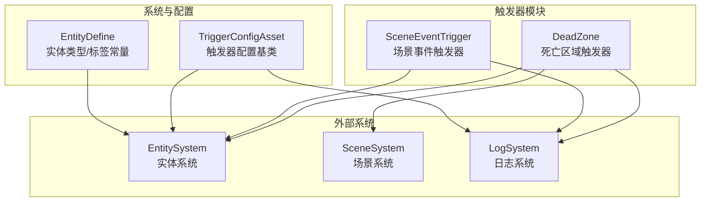
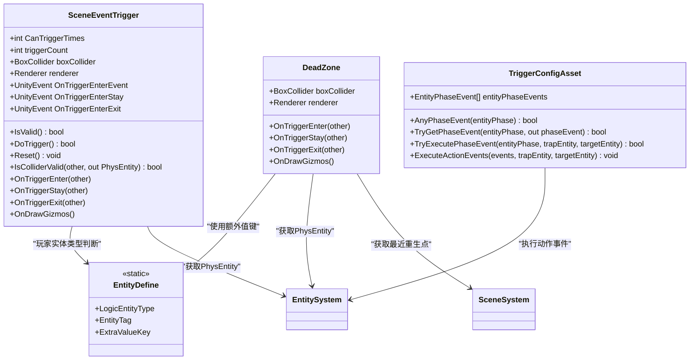
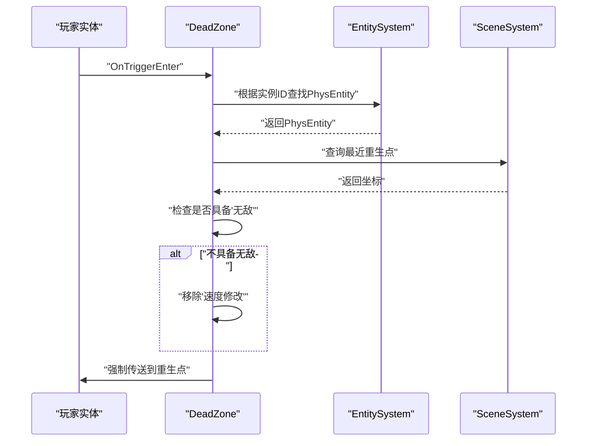
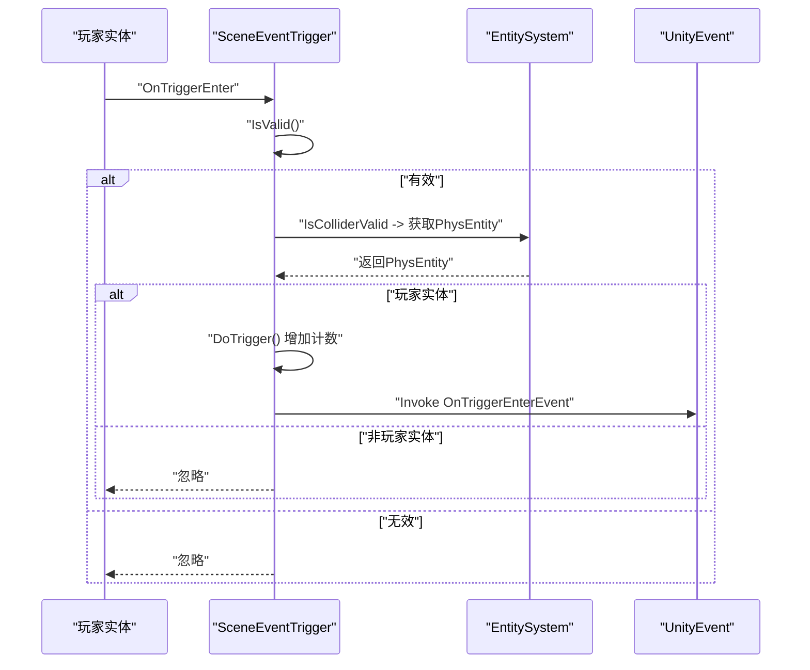
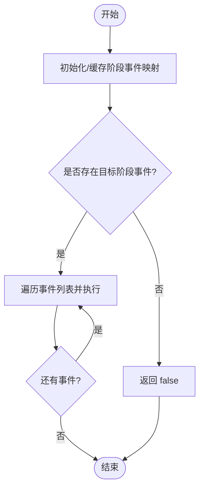
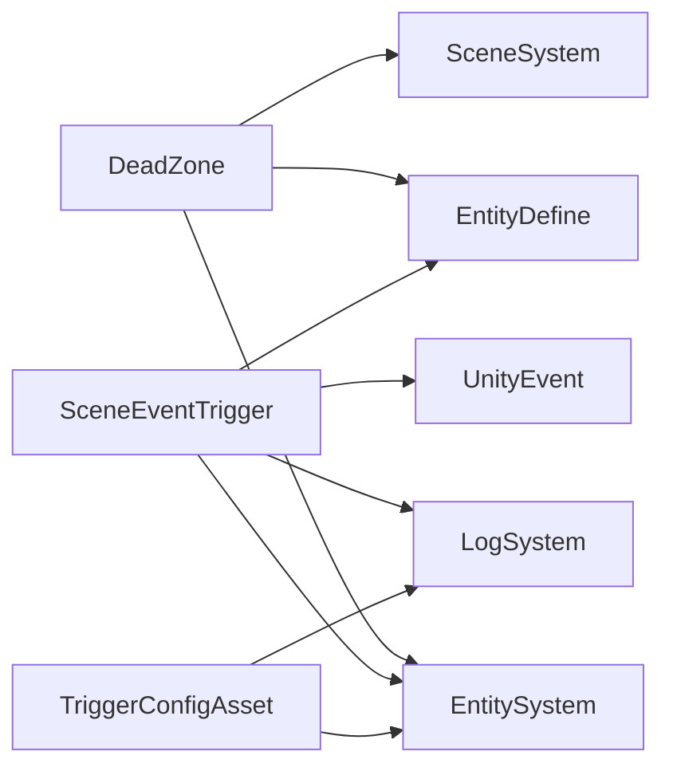

# 触发器系统

<cite>
**本文引用的文件**
- [DeadZone.cs](file://Assets/Scripts/Modules/Triggers/DeadZone.cs)
- [SceneEventTrigger.cs](file://Assets/Scripts/Modules/Triggers/SceneEventTrigger.cs)
- [TriggerConfigAsset.cs](file://Assets/Scripts/Config/Entity/TriggerConfigAsset.cs)
- [EntityDefine.cs](file://Assets/Scripts/Modules/Entity/EntityDefine.cs)
</cite>

## 目录
1. [简介](#简介)
2. [项目结构](#项目结构)
3. [核心组件](#核心组件)
4. [架构总览](#架构总览)
5. [详细组件分析](#详细组件分析)
6. [依赖关系分析](#依赖关系分析)
7. [性能考量](#性能考量)
8. [故障排查指南](#故障排查指南)
9. [结论](#结论)
10. [附录：扩展开发指南](#附录扩展开发指南)

## 简介
本文件面向 ProjectR 的触发器系统，系统性阐述两类核心触发器的设计与实现：死亡区域（DeadZone）与场景事件触发器（SceneEventTrigger）。文档从架构、事件处理机制、检测与响应流程、应用场景与配置方法、扩展开发到性能优化与调试方法进行完整覆盖，帮助开发者快速理解并高效使用与扩展触发器体系。

## 项目结构
触发器系统位于模块层的 Triggers 目录中，并与实体系统、场景系统、日志系统等存在交互。核心文件如下：
- 死亡区域触发器：Assets/Scripts/Modules/Triggers/DeadZone.cs
- 场景事件触发器：Assets/Scripts/Modules/Triggers/SceneEventTrigger.cs
- 触发器配置基类：Assets/Scripts/Config/Entity/TriggerConfigAsset.cs
- 实体类型与标签常量：Assets/Scripts/Modules/Entity/EntityDefine.cs

图表来源
- [DeadZone.cs:10-44](file://Assets/Scripts/Modules/Triggers/DeadZone.cs#L10-L44)
- [SceneEventTrigger.cs:13-122](file://Assets/Scripts/Modules/Triggers/SceneEventTrigger.cs#L13-L122)
- [TriggerConfigAsset.cs:9-68](file://Assets/Scripts/Config/Entity/TriggerConfigAsset.cs#L9-L68)
- [EntityDefine.cs:5-63](file://Assets/Scripts/Modules/Entity/EntityDefine.cs#L5-L63)

章节来源
- [DeadZone.cs:1-63](file://Assets/Scripts/Modules/Triggers/DeadZone.cs#L1-L63)
- [SceneEventTrigger.cs:1-141](file://Assets/Scripts/Modules/Triggers/SceneEventTrigger.cs#L1-L141)
- [TriggerConfigAsset.cs:1-70](file://Assets/Scripts/Config/Entity/TriggerConfigAsset.cs#L1-L70)
- [EntityDefine.cs:1-64](file://Assets/Scripts/Modules/Entity/EntityDefine.cs#L1-L64)

## 核心组件
- 死亡区域触发器（DeadZone）
  - 职责：检测进入其触发体积的实体，定位最近重生点并强制传送至该点；在实体不具备“无敌”状态时移除“速度修改”附加值。
  - 关键点：基于 Unity Collider 的 OnTriggerEnter 回调；通过 EntitySystem 查找物理实体；通过 SceneSystem 获取最近重生点；使用 Renderer 隐藏可视化渲染以避免干扰。
- 场景事件触发器（SceneEventTrigger）
  - 职责：对玩家实体进行条件校验后，按触发次数上限发放进入/停留/退出事件；支持不限次触发与重置。
  - 关键点：可配置触发次数上限；仅允许玩家实体触发；通过 UnityEvent 分发事件；异常安全包装，捕获并记录错误。
- 触发器配置基类（TriggerConfigAsset）
  - 职责：为实体周期阶段绑定动作事件集合，提供按阶段查询与执行能力；内部缓存阶段到事件映射，提升查询效率。
  - 关键点：延迟初始化与缓存；统一的动作事件执行入口；空对象保护与日志提示。
- 实体类型与标签常量（EntityDefine）
  - 职责：集中定义实体类型、标签、额外值键名等常量，为触发器判定提供依据。
  - 关键点：玩家实体类型与标签；额外值键如“无敌”“速度修改”等。

章节来源
- [DeadZone.cs:10-44](file://Assets/Scripts/Modules/Triggers/DeadZone.cs#L10-L44)
- [SceneEventTrigger.cs:13-122](file://Assets/Scripts/Modules/Triggers/SceneEventTrigger.cs#L13-L122)
- [TriggerConfigAsset.cs:9-68](file://Assets/Scripts/Config/Entity/TriggerConfigAsset.cs#L9-L68)
- [EntityDefine.cs:5-63](file://Assets/Scripts/Modules/Entity/EntityDefine.cs#L5-L63)

## 架构总览
触发器系统采用“模块化触发器 + 配置驱动 + 系统协作”的架构：
- 触发器模块：提供具体触发器行为（DeadZone、SceneEventTrigger）。
- 配置模块：提供按阶段分发动作事件的能力（TriggerConfigAsset），可被触发器或实体逻辑复用。
- 系统协作：EntitySystem 提供实体检索与逻辑实体访问；SceneSystem 提供场景级信息（如重生点）；LogSystem 统一记录错误。

图表来源
- [DeadZone.cs:10-44](file://Assets/Scripts/Modules/Triggers/DeadZone.cs#L10-L44)
- [SceneEventTrigger.cs:13-122](file://Assets/Scripts/Modules/Triggers/SceneEventTrigger.cs#L13-L122)
- [TriggerConfigAsset.cs:9-68](file://Assets/Scripts/Config/Entity/TriggerConfigAsset.cs#L9-L68)
- [EntityDefine.cs:5-63](file://Assets/Scripts/Modules/Entity/EntityDefine.cs#L5-L63)

## 详细组件分析

### 死亡区域触发器（DeadZone）
- 设计要点
  - 使用 BoxCollider 作为触发体积，隐藏渲染器以不参与视觉绘制。
  - 进入触发体积时，定位最近重生点并强制传送；若实体不具备“无敌”状态，则移除“速度修改”附加值。
- 处理流程
  - 触发回调：OnTriggerEnter → 查找 PhysEntity → 获取最近重生点 → 条件移除附加值 → 强制传送。
  - Stay/Exit：当前版本为空实现，便于后续扩展。
- 可视化与编辑器支持
  - OnDrawGizmos 绘制触发体积线框；编辑器下通过自定义编辑器在场景中高亮显示触发体积。

图表来源
- [DeadZone.cs:20-30](file://Assets/Scripts/Modules/Triggers/DeadZone.cs#L20-L30)

章节来源
- [DeadZone.cs:10-44](file://Assets/Scripts/Modules/Triggers/DeadZone.cs#L10-L44)

### 场景事件触发器（SceneEventTrigger）
- 设计要点
  - 支持限制触发次数（小于0表示无限）；仅允许玩家实体触发；提供进入/停留/退出三种事件。
  - 内部维护触发计数与有效性判断；异常安全地调用 UnityEvent 并记录错误。
- 处理流程
  - 触发回调：OnTriggerEnter/Stay/Exit → 校验有效性 → 校验玩家实体 → 增加计数 → 发出对应事件。
- 可视化与编辑器支持
  - OnDrawGizmos 绘制触发体积线框；编辑器下通过自定义编辑器在场景中高亮显示触发体积。

图表来源
- [SceneEventTrigger.cs:67-82](file://Assets/Scripts/Modules/Triggers/SceneEventTrigger.cs#L67-L82)

章节来源
- [SceneEventTrigger.cs:13-122](file://Assets/Scripts/Modules/Triggers/SceneEventTrigger.cs#L13-L122)

### 触发器配置基类（TriggerConfigAsset）
- 设计要点
  - 将实体的“阶段事件”映射为字典，延迟初始化并缓存，提高查询效率。
  - 提供按阶段查询与执行动作事件的方法；对空项进行日志告警，保证健壮性。
- 应用场景
  - 可用于陷阱/道具/环境事件在不同阶段触发一系列动作（如播放音效、播放动画、生成资源等）。

图表来源
- [TriggerConfigAsset.cs:22-49](file://Assets/Scripts/Config/Entity/TriggerConfigAsset.cs#L22-L49)

章节来源
- [TriggerConfigAsset.cs:9-68](file://Assets/Scripts/Config/Entity/TriggerConfigAsset.cs#L9-L68)

### 实体类型与标签常量（EntityDefine）
- 设计要点
  - 集中管理实体类型（玩家、陷阱、物品、敌人）、标签、额外值键名等，为触发器判定与逻辑控制提供统一常量。
- 在触发器中的作用
  - DeadZone 通过额外值键判断是否移除“速度修改”；
  - SceneEventTrigger 通过实体类型判断是否允许触发。

章节来源
- [EntityDefine.cs:5-63](file://Assets/Scripts/Modules/Entity/EntityDefine.cs#L5-L63)

## 依赖关系分析
- DeadZone 依赖
  - EntitySystem：获取 PhysEntity。
  - SceneSystem：查询最近重生点。
  - EntityDefine：判断额外值键（如“无敌”）。
  - Renderer：隐藏渲染器。
- SceneEventTrigger 依赖
  - EntitySystem：获取 PhysEntity 并校验实体类型。
  - EntityDefine：玩家实体类型判断。
  - UnityEvent：事件分发。
  - LogSystem：异常捕获与记录。
- TriggerConfigAsset 依赖
  - EntitySystem：执行动作事件时需要访问逻辑实体。
  - 日志系统：对空事件与空方法进行告警。

图表来源
- [DeadZone.cs:20-30](file://Assets/Scripts/Modules/Triggers/DeadZone.cs#L20-L30)
- [SceneEventTrigger.cs:67-82](file://Assets/Scripts/Modules/Triggers/SceneEventTrigger.cs#L67-L82)
- [TriggerConfigAsset.cs:40-67](file://Assets/Scripts/Config/Entity/TriggerConfigAsset.cs#L40-L67)

章节来源
- [DeadZone.cs:10-44](file://Assets/Scripts/Modules/Triggers/DeadZone.cs#L10-L44)
- [SceneEventTrigger.cs:13-122](file://Assets/Scripts/Modules/Triggers/SceneEventTrigger.cs#L13-L122)
- [TriggerConfigAsset.cs:9-68](file://Assets/Scripts/Config/Entity/TriggerConfigAsset.cs#L9-L68)

## 性能考量
- 触发器体积与数量
  - 合理设计触发体积大小，避免过多重叠导致频繁 Enter/Stay/Exit 切换。
  - 对于高频触发场景，建议合并触发器或使用更粗粒度的事件分发。
- 查询与缓存
  - TriggerConfigAsset 已采用延迟初始化与字典缓存，减少重复构建映射的成本。
- 事件调用开销
  - SceneEventTrigger 对 UnityEvent 的调用已做异常捕获，避免异常中断事件链；建议在事件链中避免重型同步操作。
- 渲染与可视化
  - DeadZone 与 SceneEventTrigger 默认隐藏渲染器，减少不必要的渲染开销；OnDrawGizmos 仅在编辑器中生效，不影响运行时性能。

## 故障排查指南
- 症状：进入触发器无响应
  - 排查项：确认 Collider 是否标记为 Trigger；确认实体是否为玩家类型；检查触发次数上限是否已达。
  - 参考路径：[SceneEventTrigger.cs:36-40](file://Assets/Scripts/Modules/Triggers/SceneEventTrigger.cs#L36-L40)、[SceneEventTrigger.cs:67-66](file://Assets/Scripts/Modules/Triggers/SceneEventTrigger.cs#L67-L66)
- 症状：死亡区域未传送
  - 排查项：确认 SceneSystem 是否能查询到最近重生点；确认实体是否存在 PhysEntity；检查“无敌”状态是否阻止了速度修改移除。
  - 参考路径：[DeadZone.cs:25-30](file://Assets/Scripts/Modules/Triggers/DeadZone.cs#L25-L30)、[EntityDefine.cs:35-40](file://Assets/Scripts/Modules/Entity/EntityDefine.cs#L35-L40)
- 症状：事件抛出异常
  - 排查项：查看日志输出；确认 UnityEvent 的订阅者是否抛出异常；确保事件链中无空引用。
  - 参考路径：[SceneEventTrigger.cs:74-81](file://Assets/Scripts/Modules/Triggers/SceneEventTrigger.cs#L74-L81)、[TriggerConfigAsset.cs:50-67](file://Assets/Scripts/Config/Entity/TriggerConfigAsset.cs#L50-L67)

章节来源
- [SceneEventTrigger.cs:67-114](file://Assets/Scripts/Modules/Triggers/SceneEventTrigger.cs#L67-L114)
- [DeadZone.cs:20-30](file://Assets/Scripts/Modules/Triggers/DeadZone.cs#L20-L30)
- [TriggerConfigAsset.cs:50-67](file://Assets/Scripts/Config/Entity/TriggerConfigAsset.cs#L50-L67)

## 结论
触发器系统通过模块化的 DeadZone 与 SceneEventTrigger，结合配置驱动的 TriggerConfigAsset 与统一的实体常量定义，实现了边界检测、区域触发与事件联动的清晰分离。系统在易用性与扩展性之间取得平衡：既可通过 UnityEvent 快速连接业务逻辑，又可通过配置基类实现阶段化事件编排。配合完善的日志与可视化工具，能够满足多数关卡与玩法的触发需求。

## 附录：扩展开发指南
- 自定义触发器类型
  - 命名与职责：遵循现有命名风格（如 XyzTrigger），明确单一职责（边界/区域/事件联动）。
  - 组件要求：继承 MonoBehaviour，添加必要的 Collider（推荐使用 Trigger）与 Renderer（如需可视化）。
  - 参考路径：[DeadZone.cs:9-19](file://Assets/Scripts/Modules/Triggers/DeadZone.cs#L9-L19)、[SceneEventTrigger.cs:12-40](file://Assets/Scripts/Modules/Triggers/SceneEventTrigger.cs#L12-L40)
- 检测逻辑编写
  - 实体过滤：优先通过 EntitySystem 获取 PhysEntity，并按实体类型/标签进行过滤。
  - 触发条件：支持次数上限、阶段状态、额外值键等多维判定。
  - 参考路径：[SceneEventTrigger.cs:58-66](file://Assets/Scripts/Modules/Triggers/SceneEventTrigger.cs#L58-L66)、[EntityDefine.cs:7-13](file://Assets/Scripts/Modules/Entity/EntityDefine.cs#L7-L13)
- 事件处理实现
  - 使用 UnityEvent 分发事件；对异常进行捕获与记录，保证事件链稳定。
  - 参考路径：[SceneEventTrigger.cs:29-31](file://Assets/Scripts/Modules/Triggers/SceneEventTrigger.cs#L29-L31)、[SceneEventTrigger.cs:74-81](file://Assets/Scripts/Modules/Triggers/SceneEventTrigger.cs#L74-L81)
- 部署与验证
  - 在场景中放置触发器，调整 Collider 体积与位置；在 Inspector 中配置触发次数等参数；在 Play 模式下进行交互验证。
  - 参考路径：[SceneEventTrigger.cs:15-17](file://Assets/Scripts/Modules/Triggers/SceneEventTrigger.cs#L15-L17)、[DeadZone.cs:38-43](file://Assets/Scripts/Modules/Triggers/DeadZone.cs#L38-L43)