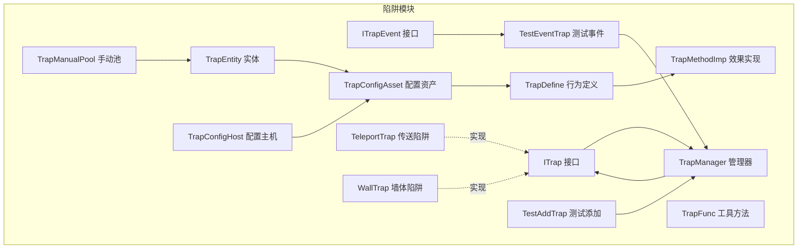
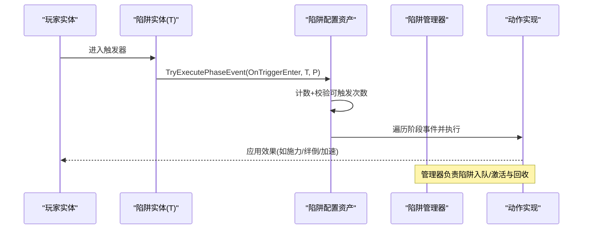
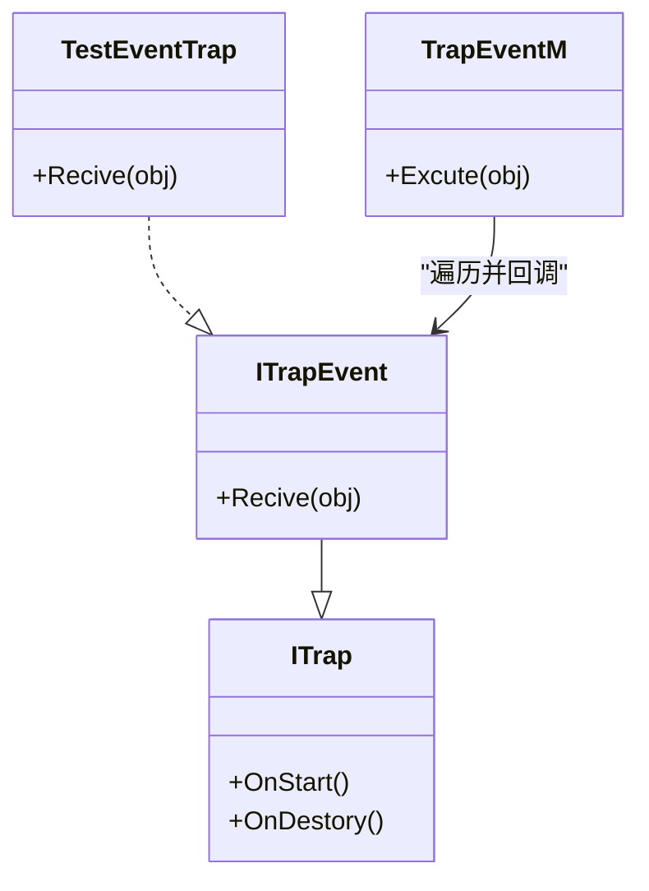
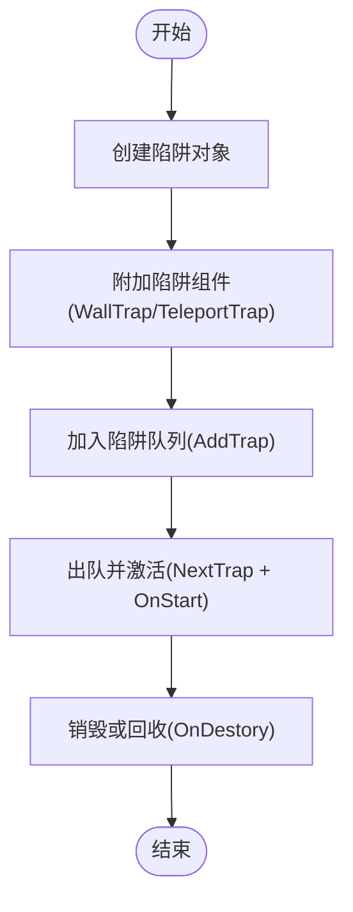
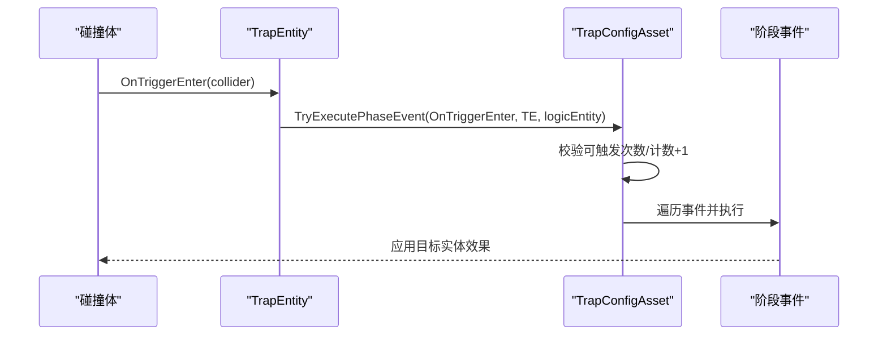
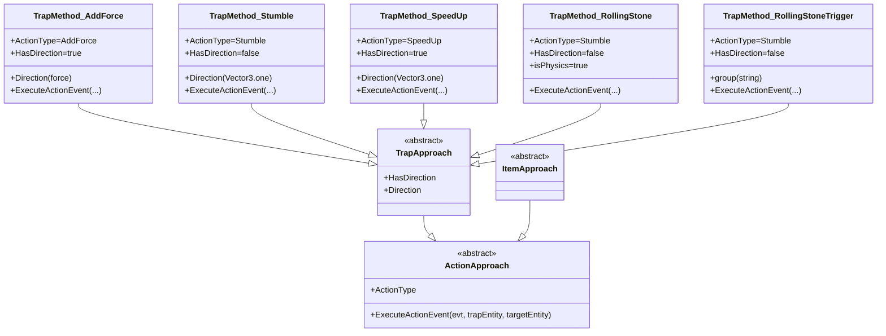
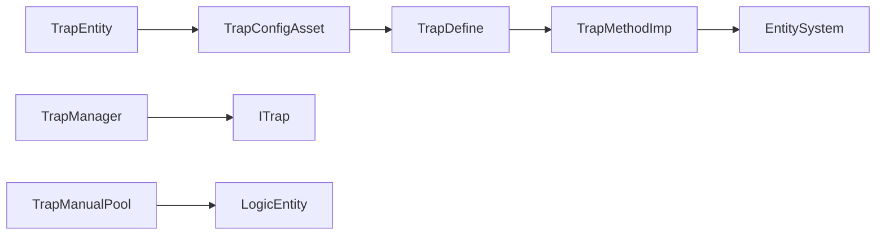

# 陷阱实体

<cite>
**本文引用的文件**
- [ITrap.cs](file://Assets/Scripts/Modules/Traps/ITrap.cs)
- [TrapManager.cs](file://Assets/Scripts/Modules/Traps/TrapManager.cs)
- [TrapConfigHost.cs](file://Assets/Scripts/Modules/Traps/TrapConfigHost.cs)
- [TrapEntity.cs](file://Assets/Scripts/Modules/Traps/TrapEntity.cs)
- [TrapDefine.cs](file://Assets/Scripts/Modules/Traps/TrapDefine.cs)
- [TrapMethodImp.cs](file://Assets/Scripts/Modules/Traps/TrapMethodImp.cs)
- [TeleportTrap.cs](file://Assets/Scripts/Modules/Traps/TeleportTrap.cs)
- [WallTrap.cs](file://Assets/Scripts/Modules/Traps/WallTrap.cs)
- [TestAddTrap.cs](file://Assets/Scripts/Modules/Traps/TestAddTrap.cs)
- [ITrapEvent.cs](file://Assets/Scripts/Modules/Traps/ITrapEvent.cs)
- [TestEventTrap.cs](file://Assets/Scripts/Modules/Traps/TestEventTrap.cs)
- [TrapManualPool.cs](file://Assets/Scripts/Modules/Traps/TrapManualPool.cs)
- [TrapFunc.cs](file://Assets/Scripts/Modules/Traps/TrapFunc.cs)
- [TrapConfigAsset.cs](file://Assets/Scripts/Config/Entity/Trap/TrapConfigAsset.cs)
</cite>

## 目录
1. [引言](#引言)
2. [项目结构](#项目结构)
3. [核心组件](#核心组件)
4. [架构总览](#架构总览)
5. [详细组件分析](#详细组件分析)
6. [依赖关系分析](#依赖关系分析)
7. [性能考虑](#性能考虑)
8. [故障排查指南](#故障排查指南)
9. [结论](#结论)
10. [附录：扩展开发指南](#附录扩展开发指南)

## 引言
本文件系统化梳理 ProjectR 的陷阱实体系统，围绕“陷阱配置主机（TrapConfigHost）”、“陷阱接口（ITrap）”、“陷阱管理器（TrapManager）”展开，深入解析陷阱实体的生命周期、触发条件、效果执行与回收机制，并给出传送陷阱、墙体陷阱等类型实现要点与扩展开发指南。同时提供部署、激活与销毁流程的示例路径，以及性能优化与平衡性设计建议。

## 项目结构
陷阱系统主要位于模块层的 Traps 目录中，配合配置资产与实体系统协同工作。关键文件职责概览：
- 接口与管理：ITrap、ITrapEvent、TrapManager
- 实体与配置：TrapEntity、TrapConfigHost、TrapConfigAsset
- 行为定义与实现：TrapDefine、TrapMethodImp
- 示例与工具：TeleportTrap、WallTrap、TestAddTrap、TestEventTrap、TrapManualPool、TrapFunc

图表来源
- [ITrap.cs:1-6](file://Assets/Scripts/Modules/Traps/ITrap.cs#L1-L6)
- [TrapManager.cs:1-43](file://Assets/Scripts/Modules/Traps/TrapManager.cs#L1-L43)
- [TrapEntity.cs:1-42](file://Assets/Scripts/Modules/Traps/TrapEntity.cs#L1-L42)
- [TrapConfigHost.cs:1-13](file://Assets/Scripts/Modules/Traps/TrapConfigHost.cs#L1-L13)
- [TrapDefine.cs:1-84](file://Assets/Scripts/Modules/Traps/TrapDefine.cs#L1-L84)
- [TrapMethodImp.cs:1-148](file://Assets/Scripts/Modules/Traps/TrapMethodImp.cs#L1-L148)
- [TeleportTrap.cs:1-17](file://Assets/Scripts/Modules/Traps/TeleportTrap.cs#L1-L17)
- [WallTrap.cs:1-25](file://Assets/Scripts/Modules/Traps/WallTrap.cs#L1-L25)
- [TestAddTrap.cs:1-32](file://Assets/Scripts/Modules/Traps/TestAddTrap.cs#L1-L32)
- [ITrapEvent.cs:1-5](file://Assets/Scripts/Modules/Traps/ITrapEvent.cs#L1-L5)
- [TestEventTrap.cs:1-23](file://Assets/Scripts/Modules/Traps/TestEventTrap.cs#L1-L23)
- [TrapManualPool.cs:1-29](file://Assets/Scripts/Modules/Traps/TrapManualPool.cs#L1-L29)
- [TrapFunc.cs:1-8](file://Assets/Scripts/Modules/Traps/TrapFunc.cs#L1-L8)
- [TrapConfigAsset.cs:1-41](file://Assets/Scripts/Config/Entity/Trap/TrapConfigAsset.cs#L1-L41)

章节来源
- [ITrap.cs:1-6](file://Assets/Scripts/Modules/Traps/ITrap.cs#L1-L6)
- [TrapManager.cs:1-43](file://Assets/Scripts/Modules/Traps/TrapManager.cs#L1-L43)
- [TrapEntity.cs:1-42](file://Assets/Scripts/Modules/Traps/TrapEntity.cs#L1-L42)
- [TrapConfigHost.cs:1-13](file://Assets/Scripts/Modules/Traps/TrapConfigHost.cs#L1-L13)
- [TrapDefine.cs:1-84](file://Assets/Scripts/Modules/Traps/TrapDefine.cs#L1-L84)
- [TrapMethodImp.cs:1-148](file://Assets/Scripts/Modules/Traps/TrapMethodImp.cs#L1-L148)
- [TeleportTrap.cs:1-17](file://Assets/Scripts/Modules/Traps/TeleportTrap.cs#L1-L17)
- [WallTrap.cs:1-25](file://Assets/Scripts/Modules/Traps/WallTrap.cs#L1-L25)
- [TestAddTrap.cs:1-32](file://Assets/Scripts/Modules/Traps/TestAddTrap.cs#L1-L32)
- [ITrapEvent.cs:1-5](file://Assets/Scripts/Modules/Traps/ITrapEvent.cs#L1-L5)
- [TestEventTrap.cs:1-23](file://Assets/Scripts/Modules/Traps/TestEventTrap.cs#L1-L23)
- [TrapManualPool.cs:1-29](file://Assets/Scripts/Modules/Traps/TrapManualPool.cs#L1-L29)
- [TrapFunc.cs:1-8](file://Assets/Scripts/Modules/Traps/TrapFunc.cs#L1-L8)
- [TrapConfigAsset.cs:1-41](file://Assets/Scripts/Config/Entity/Trap/TrapConfigAsset.cs#L1-L41)

## 核心组件
- 陷阱接口 ITrap：定义陷阱生命周期钩子（启动/销毁），作为所有陷阱行为的统一契约。
- 陷阱接口 ITrapEvent：用于接收事件通知，支持事件广播与订阅。
- 陷阱管理器 TrapManager：维护陷阱队列与列表，负责陷阱的入队、出队与激活。
- 陷阱实体 TrapEntity：基于逻辑实体封装，挂接物理触发器，将碰撞事件映射到配置资产的阶段事件。
- 陷阱配置主机 TrapConfigHost：承载陷阱配置资产，供编辑器可视化配置与运行时读取。
- 陷阱配置资产 TrapConfigAsset：定义可触发次数、阶段事件执行与计数逻辑。
- 行为定义与实现 TrapDefine/TrapMethodImp：定义动作类型、实体阶段、抽象实现类与具体陷阱效果（如施力、绊倒、加速、滚石、滚石触发等）。
- 示例陷阱 TeleportTrap、WallTrap：演示不同陷阱类型的实现形态。
- 手动池 TrapManualPool：按键值管理陷阱实体，便于手动编组与控制。
- 工具方法 TrapFunc：提供系统级辅助能力。

章节来源
- [ITrap.cs:1-6](file://Assets/Scripts/Modules/Traps/ITrap.cs#L1-L6)
- [ITrapEvent.cs:1-5](file://Assets/Scripts/Modules/Traps/ITrapEvent.cs#L1-L5)
- [TrapManager.cs:1-43](file://Assets/Scripts/Modules/Traps/TrapManager.cs#L1-L43)
- [TrapEntity.cs:1-42](file://Assets/Scripts/Modules/Traps/TrapEntity.cs#L1-L42)
- [TrapConfigHost.cs:1-13](file://Assets/Scripts/Modules/Traps/TrapConfigHost.cs#L1-L13)
- [TrapConfigAsset.cs:1-41](file://Assets/Scripts/Config/Entity/Trap/TrapConfigAsset.cs#L1-L41)
- [TrapDefine.cs:1-84](file://Assets/Scripts/Modules/Traps/TrapDefine.cs#L1-L84)
- [TrapMethodImp.cs:1-148](file://Assets/Scripts/Modules/Traps/TrapMethodImp.cs#L1-L148)
- [TeleportTrap.cs:1-17](file://Assets/Scripts/Modules/Traps/TeleportTrap.cs#L1-L17)
- [WallTrap.cs:1-25](file://Assets/Scripts/Modules/Traps/WallTrap.cs#L1-L25)
- [TrapManualPool.cs:1-29](file://Assets/Scripts/Modules/Traps/TrapManualPool.cs#L1-L29)
- [TrapFunc.cs:1-8](file://Assets/Scripts/Modules/Traps/TrapFunc.cs#L1-L8)

## 架构总览
陷阱系统采用“配置驱动 + 实体触发 + 动作实现”的分层架构：
- 配置层：通过 TrapConfigAsset 定义阶段事件与可触发次数；TrapConfigHost 将配置资产绑定到实体。
- 触发层：TrapEntity 在物理触发器上监听进入事件，调用配置资产的阶段事件执行。
- 行为层：TrapDefine 定义动作类型与阶段枚举，TrapMethodImp 提供具体陷阱效果实现。
- 生命周期层：ITrap/ITrapEvent 定义生命周期与事件回调；TrapManager 负责陷阱的入队与激活；手动池支持按组管理。

图表来源
- [TrapEntity.cs:26-31](file://Assets/Scripts/Modules/Traps/TrapEntity.cs#L26-L31)
- [TrapConfigAsset.cs:31-38](file://Assets/Scripts/Config/Entity/Trap/TrapConfigAsset.cs#L31-L38)
- [TrapManager.cs:20-33](file://Assets/Scripts/Modules/Traps/TrapManager.cs#L20-L33)
- [TrapMethodImp.cs:23-39](file://Assets/Scripts/Modules/Traps/TrapMethodImp.cs#L23-L39)

## 详细组件分析

### 组件一：陷阱接口与事件系统
- ITrap：提供生命周期钩子，作为所有陷阱行为的统一基线。
- ITrapEvent：在 ITrap 基础上增加事件接收能力，便于广播与订阅。
- TestEventTrap/TrapEventM：演示事件接收与广播的使用方式。

图表来源
- [ITrap.cs:1-6](file://Assets/Scripts/Modules/Traps/ITrap.cs#L1-L6)
- [ITrapEvent.cs:1-5](file://Assets/Scripts/Modules/Traps/ITrapEvent.cs#L1-L5)
- [TestEventTrap.cs:5-22](file://Assets/Scripts/Modules/Traps/TestEventTrap.cs#L5-L22)

章节来源
- [ITrap.cs:1-6](file://Assets/Scripts/Modules/Traps/ITrap.cs#L1-L6)
- [ITrapEvent.cs:1-5](file://Assets/Scripts/Modules/Traps/ITrapEvent.cs#L1-L5)
- [TestEventTrap.cs:1-23](file://Assets/Scripts/Modules/Traps/TestEventTrap.cs#L1-L23)

### 组件二：陷阱管理器与生命周期
- TrapManager：维护陷阱队列与列表，提供入队、出队与获取队列的方法；负责陷阱的激活与回收入口。
- TestAddTrap：演示如何创建陷阱对象并加入管理器队列，随后激活。
- TrapManualPool：按键值存储陷阱实体，支持按组管理与快速检索。

图表来源
- [TrapManager.cs:20-33](file://Assets/Scripts/Modules/Traps/TrapManager.cs#L20-L33)
- [TestAddTrap.cs:6-19](file://Assets/Scripts/Modules/Traps/TestAddTrap.cs#L6-L19)
- [WallTrap.cs:8-11](file://Assets/Scripts/Modules/Traps/WallTrap.cs#L8-L11)
- [TeleportTrap.cs:1-17](file://Assets/Scripts/Modules/Traps/TeleportTrap.cs#L1-L17)

章节来源
- [TrapManager.cs:1-43](file://Assets/Scripts/Modules/Traps/TrapManager.cs#L1-L43)
- [TestAddTrap.cs:1-32](file://Assets/Scripts/Modules/Traps/TestAddTrap.cs#L1-L32)
- [TrapManualPool.cs:1-29](file://Assets/Scripts/Modules/Traps/TrapManualPool.cs#L1-L29)

### 组件三：陷阱实体与触发机制
- TrapEntity：继承逻辑实体，创建物理实体并挂接触发器；在 OnTriggerEnter 中调用配置资产的阶段事件。
- TrapConfigAsset：扩展执行逻辑，限制可触发次数并递增触发计数。
- TrapConfigHost：将配置资产绑定到实体，供编辑器与运行时使用。

图表来源
- [TrapEntity.cs:26-31](file://Assets/Scripts/Modules/Traps/TrapEntity.cs#L26-L31)
- [TrapConfigAsset.cs:31-38](file://Assets/Scripts/Config/Entity/Trap/TrapConfigAsset.cs#L31-L38)

章节来源
- [TrapEntity.cs:1-42](file://Assets/Scripts/Modules/Traps/TrapEntity.cs#L1-L42)
- [TrapConfigAsset.cs:1-41](file://Assets/Scripts/Config/Entity/Trap/TrapConfigAsset.cs#L1-L41)
- [TrapConfigHost.cs:1-13](file://Assets/Scripts/Modules/Traps/TrapConfigHost.cs#L1-L13)

### 组件四：行为定义与效果实现
- TrapDefine：定义动作类型（施力、绊倒、加速、无敌星、事件注册、广播事件）、实体阶段（碰撞进入/退出、触发器进入/退出、更新距离、固定帧开始、Lua回调、动画事件）与抽象实现类（ActionApproach、TrapApproach、ItemApproach）。
- TrapMethodImp：提供具体陷阱效果实现，如施加力、绊倒、加速、滚石与滚石触发等。

图表来源
- [TrapDefine.cs:44-82](file://Assets/Scripts/Modules/Traps/TrapDefine.cs#L44-L82)
- [TrapMethodImp.cs:12-147](file://Assets/Scripts/Modules/Traps/TrapMethodImp.cs#L12-L147)

章节来源
- [TrapDefine.cs:1-84](file://Assets/Scripts/Modules/Traps/TrapDefine.cs#L1-L84)
- [TrapMethodImp.cs:1-148](file://Assets/Scripts/Modules/Traps/TrapMethodImp.cs#L1-L148)

### 组件五：示例陷阱类型
- 墙体陷阱 WallTrap：实现 ITrap，具备尺寸参数与生命周期钩子，用于阻挡或改变路径。
- 传送陷阱 TeleportTrap：当前为空实现，预留传送逻辑扩展点。

章节来源
- [WallTrap.cs:1-25](file://Assets/Scripts/Modules/Traps/WallTrap.cs#L1-L25)
- [TeleportTrap.cs:1-17](file://Assets/Scripts/Modules/Traps/TeleportTrap.cs#L1-L17)

### 组件六：测试与验证
- TestAddTrap：提供按钮式测试入口，演示添加陷阱与激活流程。
- TestEventTrap/TrapEventM：演示事件接收与广播。

章节来源
- [TestAddTrap.cs:1-32](file://Assets/Scripts/Modules/Traps/TestAddTrap.cs#L1-L32)
- [TestEventTrap.cs:1-23](file://Assets/Scripts/Modules/Traps/TestEventTrap.cs#L1-L23)

## 依赖关系分析
陷阱系统的关键依赖链如下：
- TrapEntity 依赖 TrapConfigAsset 与实体系统，负责触发事件的转发与执行。
- TrapConfigAsset 依赖阶段事件与动作实现，控制触发次数与执行顺序。
- TrapManager 依赖 ITrap，负责陷阱的入队、激活与回收。
- TrapMethodImp 依赖实体系统与状态机，对目标实体施加效果。
- TrapManualPool 依赖实体系统，提供按组管理与检索。

图表来源
- [TrapEntity.cs:1-42](file://Assets/Scripts/Modules/Traps/TrapEntity.cs#L1-L42)
- [TrapConfigAsset.cs:1-41](file://Assets/Scripts/Config/Entity/Trap/TrapConfigAsset.cs#L1-L41)
- [TrapDefine.cs:1-84](file://Assets/Scripts/Modules/Traps/TrapDefine.cs#L1-L84)
- [TrapMethodImp.cs:1-148](file://Assets/Scripts/Modules/Traps/TrapMethodImp.cs#L1-L148)
- [TrapManager.cs:1-43](file://Assets/Scripts/Modules/Traps/TrapManager.cs#L1-L43)
- [TrapManualPool.cs:1-29](file://Assets/Scripts/Modules/Traps/TrapManualPool.cs#L1-L29)

章节来源
- [TrapEntity.cs:1-42](file://Assets/Scripts/Modules/Traps/TrapEntity.cs#L1-L42)
- [TrapConfigAsset.cs:1-41](file://Assets/Scripts/Config/Entity/Trap/TrapConfigAsset.cs#L1-L41)
- [TrapDefine.cs:1-84](file://Assets/Scripts/Modules/Traps/TrapDefine.cs#L1-L84)
- [TrapMethodImp.cs:1-148](file://Assets/Scripts/Modules/Traps/TrapMethodImp.cs#L1-L148)
- [TrapManager.cs:1-43](file://Assets/Scripts/Modules/Traps/TrapManager.cs#L1-L43)
- [TrapManualPool.cs:1-29](file://Assets/Scripts/Modules/Traps/TrapManualPool.cs#L1-L29)

## 性能考虑
- 触发频率控制：通过配置资产限制可触发次数，避免重复触发带来的开销。
- 动作实现优化：在动作实现中尽量减少每帧计算量，使用缓存与延迟处理。
- 对象池与手动池：利用手动池按组管理陷阱实体，降低频繁创建销毁成本。
- 物理触发器：合理设置触发器体积与形状，减少无效碰撞检测。
- 状态切换：对状态机切换进行节流，避免频繁状态变更导致的性能抖动。

## 故障排查指南
- 触发无响应
  - 检查 TrapEntity 是否正确挂接触发器与回调。
  - 确认 TrapConfigAsset 的阶段事件是否配置且可触发次数未达上限。
- 效果不生效
  - 核对动作实现是否匹配动作类型与阶段。
  - 检查目标实体是否存在与状态是否允许应用效果。
- 陷阱未激活
  - 确认通过 TrapManager 的入队与出队流程是否正确执行。
  - 检查 ITrap 的 OnStart/OnDestory 是否被调用。
- 事件未广播
  - 核对 ITrapEvent 的订阅与 TrapEventM 的广播逻辑。

章节来源
- [TrapEntity.cs:26-31](file://Assets/Scripts/Modules/Traps/TrapEntity.cs#L26-L31)
- [TrapConfigAsset.cs:31-38](file://Assets/Scripts/Config/Entity/Trap/TrapConfigAsset.cs#L31-L38)
- [TrapManager.cs:20-33](file://Assets/Scripts/Modules/Traps/TrapManager.cs#L20-L33)
- [ITrapEvent.cs:1-5](file://Assets/Scripts/Modules/Traps/ITrapEvent.cs#L1-L5)
- [TestEventTrap.cs:13-22](file://Assets/Scripts/Modules/Traps/TestEventTrap.cs#L13-L22)

## 结论
陷阱实体系统以配置驱动为核心，结合实体触发与动作实现，形成清晰的生命周期与触发链路。通过管理器与手动池实现资源管理与按组控制，配合行为定义与多种陷阱效果，满足多样化的关卡设计需求。建议在扩展新陷阱类型时遵循现有接口与配置模式，确保一致的触发体验与性能表现。

## 附录：扩展开发指南

### 创建自定义陷阱类型
- 步骤
  - 新建类实现 ITrap 或 ITrapEvent（根据是否需要事件接收）。
  - 在 OnStart 中完成初始化（如启用/禁用组件、设置状态）。
  - 在 OnDestory 中完成清理（如移除状态、释放资源）。
  - 可参考墙体陷阱与传送陷阱的实现方式。

章节来源
- [ITrap.cs:1-6](file://Assets/Scripts/Modules/Traps/ITrap.cs#L1-L6)
- [WallTrap.cs:1-25](file://Assets/Scripts/Modules/Traps/WallTrap.cs#L1-L25)
- [TeleportTrap.cs:1-17](file://Assets/Scripts/Modules/Traps/TeleportTrap.cs#L1-L17)

### 编写触发逻辑
- 使用 TrapEntity 的 OnTriggerEnter 将触发事件转发至配置资产。
- 在配置资产中定义阶段事件（如 OnTriggerEnter）与可触发次数。
- 通过 TrapManager 管理陷阱的入队与激活。

章节来源
- [TrapEntity.cs:26-31](file://Assets/Scripts/Modules/Traps/TrapEntity.cs#L26-L31)
- [TrapConfigAsset.cs:15-38](file://Assets/Scripts/Config/Entity/Trap/TrapConfigAsset.cs#L15-L38)
- [TrapManager.cs:20-33](file://Assets/Scripts/Modules/Traps/TrapManager.cs#L20-L33)

### 实现效果
- 在 TrapMethodImp 中新增动作实现类，继承 TrapApproach 并重写 ExecuteActionEvent。
- 明确 HasDirection 与 Direction 的语义，以便 UI 展示与逻辑判断。
- 对目标实体应用状态、属性或动画效果，必要时使用实体系统提供的状态机与数值扩展。

章节来源
- [TrapDefine.cs:44-82](file://Assets/Scripts/Modules/Traps/TrapDefine.cs#L44-L82)
- [TrapMethodImp.cs:12-147](file://Assets/Scripts/Modules/Traps/TrapMethodImp.cs#L12-L147)

### 部署、激活与销毁流程示例路径
- 部署：通过测试脚本添加陷阱并加入队列
  - [TestAddTrap.cs:6-13](file://Assets/Scripts/Modules/Traps/TestAddTrap.cs#L6-L13)
- 激活：从队列取出并调用 OnStart
  - [TestAddTrap.cs:14-19](file://Assets/Scripts/Modules/Traps/TestAddTrap.cs#L14-L19)
  - [TrapManager.cs:24-33](file://Assets/Scripts/Modules/Traps/TrapManager.cs#L24-L33)
- 销毁：在 OnDestory 中清理资源
  - [ITrap.cs:3-4](file://Assets/Scripts/Modules/Traps/ITrap.cs#L3-L4)
  - [WallTrap.cs:8-11](file://Assets/Scripts/Modules/Traps/WallTrap.cs#L8-L11)

### 性能优化策略与平衡性设计原则
- 性能
  - 控制触发频率与动作复杂度，避免每帧高成本操作。
  - 使用对象池与手动池减少创建销毁开销。
  - 合理设置触发器体积与检测频率。
- 平衡性
  - 为不同陷阱设定合理的可触发次数与冷却时间。
  - 在动作实现中考虑目标实体的抗性与状态，避免过于强力的效果。
  - 通过配置资产集中管理参数，便于调试与平衡调整。