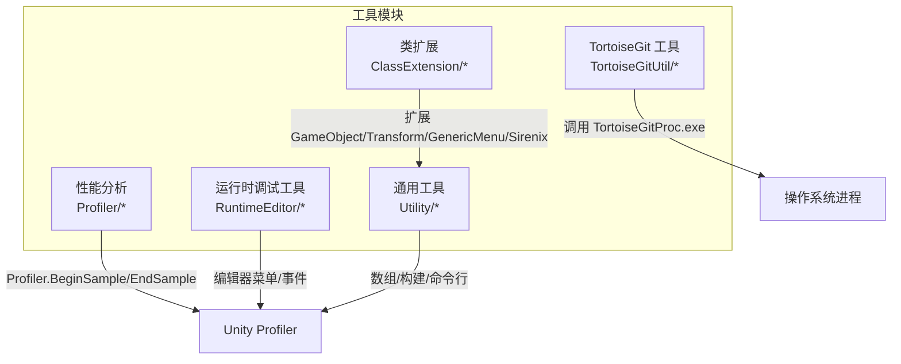
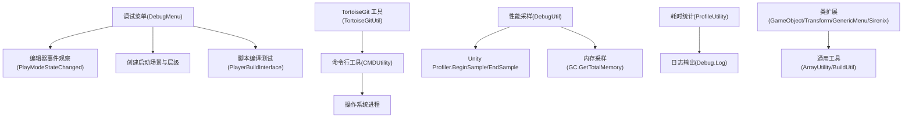
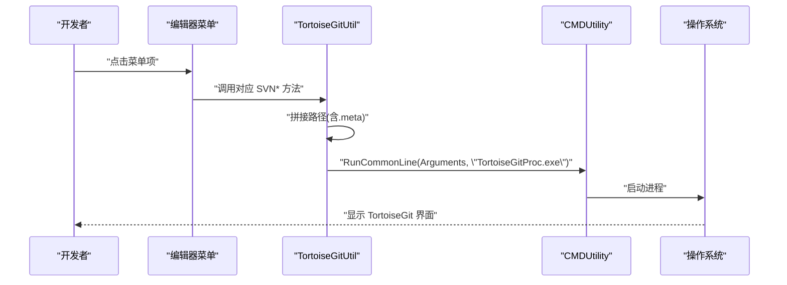
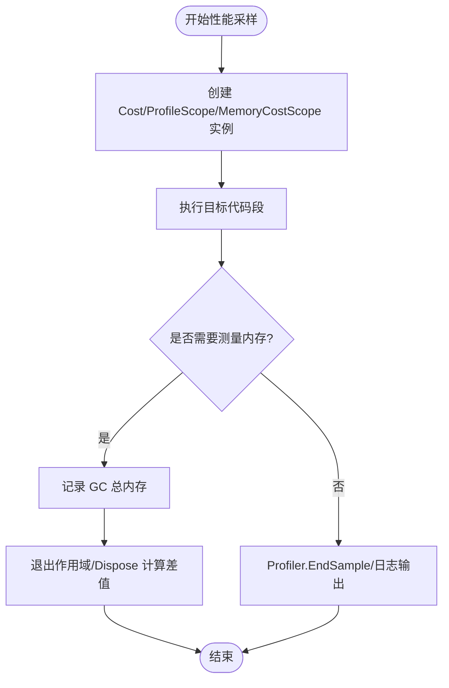
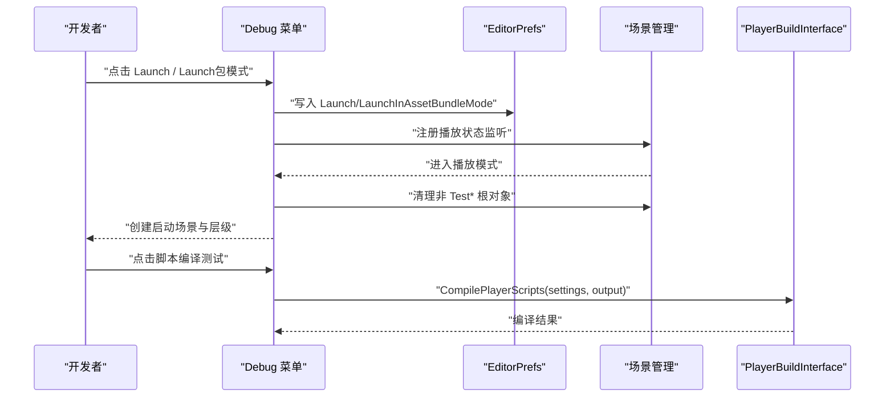
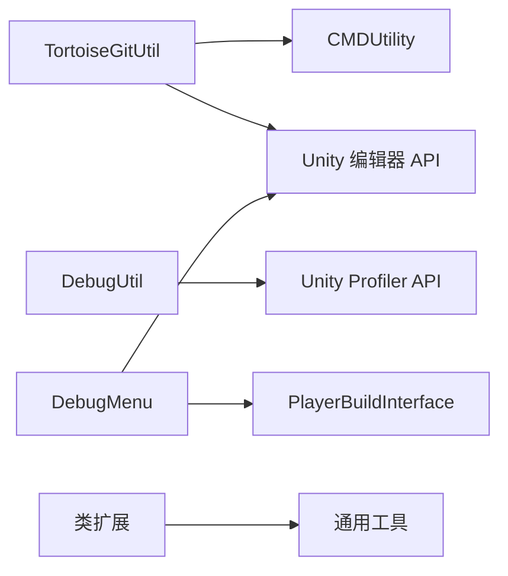

# 工具模块

<cite>
**本文引用的文件**
- [ProfileUtility.cs](file://Assets/Scripts/Profiler/ProfileUtility.cs)
- [DebugUtil.cs](file://Assets/Scripts/RuntimeEditor/DebugUtil.cs)
- [DebugMenu.cs](file://Assets/Scripts/RuntimeEditor/DebugMenu.cs)
- [TortoiseGitUtil.cs](file://Assets/Scripts/Utility/TortoiseGitUtil.cs)
- [CMDUtility.cs](file://Assets/Scripts/Utility/CMDUtility.cs)
- [ArrayUtility.cs](file://Assets/Scripts/Utility/ArrayUtility.cs)
- [BuildUtil.cs](file://Assets/Scripts/Utility/BuildUtil.cs)
- [TransformUtility.cs](file://Assets/Scripts/Utility/TortoiseGitUtil/TransformUtility.cs)
- [ProjectTortoiseGitMenu.cs](file://Assets/Scripts/Utility/TortoiseGitUtil/Editor/ProjectTortoiseGitMenu.cs)
- [GameObjectExtension.cs](file://Assets/Scripts/Utility/ClassExtension/GameObjectExtension.cs)
- [TransformExtension.cs](file://Assets/Scripts/Utility/ClassExtension/TransformExtension.cs)
- [GenericMenuExtension.cs](file://Assets/Scripts/Utility/ClassExtension/GenericMenuExtension.cs)
- [SirenixExtension.cs](file://Assets/Scripts/Utility/ClassExtension/SirenixExtension.cs)
</cite>

## 目录
1. [简介](#简介)
2. [项目结构](#项目结构)
3. [核心组件](#核心组件)
4. [架构总览](#架构总览)
5. [详细组件分析](#详细组件分析)
6. [依赖关系分析](#依赖关系分析)
7. [性能考量](#性能考量)
8. [故障排查指南](#故障排查指南)
9. [结论](#结论)
10. [附录](#附录)

## 简介
本文件系统化梳理 ProjectR 项目中的工具模块，覆盖以下方面：
- 类扩展方法：对常用 Unity 对象（如 GameObject、Transform、GenericMenu）进行能力增强与便捷封装。
- Git 版本控制工具：基于 TortoiseGit 的命令行调用，提供日志、提交、回滚、拉取、推送等操作入口，并在编辑器菜单中集成。
- 性能分析工具：提供轻量级耗时统计与内存消耗采样，便于快速定位性能瓶颈。
- 开发辅助工具：包含构建辅助、数组工具、命令行执行工具以及调试菜单，提升日常开发效率。

本指南面向不同层次的开发者，既提供高层概览，也给出可直接参考的使用路径与最佳实践。

## 项目结构
工具模块主要分布在以下路径：
- 类扩展：Assets/Scripts/Utility/ClassExtension
- Git 工具：Assets/Scripts/Utility/TortoiseGitUtil 与 TortoiseGitUtil/Editor
- 性能分析：Assets/Scripts/Profiler 与 Assets/Scripts/RuntimeEditor
- 构建与通用工具：Assets/Scripts/Utility 下的 BuildUtil、ArrayUtility、CMDUtility 等

**图表来源**
- [TortoiseGitUtil.cs:1-127](file://Assets/Scripts/Utility/TortoiseGitUtil.cs#L1-L127)
- [DebugUtil.cs:1-34](file://Assets/Scripts/RuntimeEditor/DebugUtil.cs#L1-L34)
- [DebugMenu.cs:1-165](file://Assets/Scripts/RuntimeEditor/DebugMenu.cs#L1-L165)
- [ProfileUtility.cs:1-28](file://Assets/Scripts/Profiler/ProfileUtility.cs#L1-L28)
- [ArrayUtility.cs](file://Assets/Scripts/Utility/ArrayUtility.cs)
- [BuildUtil.cs](file://Assets/Scripts/Utility/BuildUtil.cs)
- [CMDUtility.cs](file://Assets/Scripts/Utility/CMDUtility.cs)

**章节来源**
- [TortoiseGitUtil.cs:1-127](file://Assets/Scripts/Utility/TortoiseGitUtil.cs#L1-L127)
- [DebugUtil.cs:1-34](file://Assets/Scripts/RuntimeEditor/DebugUtil.cs#L1-L34)
- [DebugMenu.cs:1-165](file://Assets/Scripts/RuntimeEditor/DebugMenu.cs#L1-L165)
- [ProfileUtility.cs:1-28](file://Assets/Scripts/Profiler/ProfileUtility.cs#L1-L28)

## 核心组件
- 类扩展方法：通过静态扩展方法为 GameObject、Transform、GenericMenu、Sirenix 等类型提供易用接口，减少重复代码。
- TortoiseGit 工具：封装常用 SVN 操作，支持批量选择资源并自动附加 .meta 文件路径，一键打开 TortoiseGit 界面。
- 性能分析工具：提供时间成本与内存成本两种采样方式，配合 Unity Profiler 使用，便于定位热点。
- 调试菜单：在编辑器中提供一键启动、包模式启动、脚本编译测试等功能，简化联调与验证流程。
- 通用工具：包含数组处理、构建辅助、命令行执行等基础能力，支撑上层工具与业务逻辑。

**章节来源**
- [GameObjectExtension.cs](file://Assets/Scripts/Utility/ClassExtension/GameObjectExtension.cs)
- [TransformExtension.cs](file://Assets/Scripts/Utility/ClassExtension/TransformExtension.cs)
- [GenericMenuExtension.cs](file://Assets/Scripts/Utility/ClassExtension/GenericMenuExtension.cs)
- [SirenixExtension.cs](file://Assets/Scripts/Utility/ClassExtension/SirenixExtension.cs)
- [TortoiseGitUtil.cs:1-127](file://Assets/Scripts/Utility/TortoiseGitUtil.cs#L1-L127)
- [DebugUtil.cs:1-34](file://Assets/Scripts/RuntimeEditor/DebugUtil.cs#L1-L34)
- [DebugMenu.cs:1-165](file://Assets/Scripts/RuntimeEditor/DebugMenu.cs#L1-L165)
- [ArrayUtility.cs](file://Assets/Scripts/Utility/ArrayUtility.cs)
- [BuildUtil.cs](file://Assets/Scripts/Utility/BuildUtil.cs)
- [CMDUtility.cs](file://Assets/Scripts/Utility/CMDUtility.cs)

## 架构总览
工具模块采用“分层+组合”的设计：
- 展示层（编辑器菜单/快捷键）：DebugMenu 提供用户入口。
- 命令层（TortoiseGit/CMD/构建）：统一通过 CMDUtility 或平台命令行执行。
- 分析层（Profiler/内存采样）：通过 Unity Profiler 接口或 GC API 进行采样。
- 扩展层（类扩展）：以静态扩展形式注入到常用类型，降低侵入性。

**图表来源**
- [DebugMenu.cs:1-165](file://Assets/Scripts/RuntimeEditor/DebugMenu.cs#L1-L165)
- [TortoiseGitUtil.cs:1-127](file://Assets/Scripts/Utility/TortoiseGitUtil.cs#L1-L127)
- [CMDUtility.cs](file://Assets/Scripts/Utility/CMDUtility.cs)
- [DebugUtil.cs:1-34](file://Assets/Scripts/RuntimeEditor/DebugUtil.cs#L1-L34)
- [ProfileUtility.cs:1-28](file://Assets/Scripts/Profiler/ProfileUtility.cs#L1-L28)
- [ArrayUtility.cs](file://Assets/Scripts/Utility/ArrayUtility.cs)
- [BuildUtil.cs](file://Assets/Scripts/Utility/BuildUtil.cs)
- [GameObjectExtension.cs](file://Assets/Scripts/Utility/ClassExtension/GameObjectExtension.cs)
- [TransformExtension.cs](file://Assets/Scripts/Utility/ClassExtension/TransformExtension.cs)
- [GenericMenuExtension.cs](file://Assets/Scripts/Utility/ClassExtension/GenericMenuExtension.cs)
- [SirenixExtension.cs](file://Assets/Scripts/Utility/ClassExtension/SirenixExtension.cs)

## 详细组件分析

### 类扩展方法
- 设计理念：以静态扩展的方式为常用 Unity 类型提供便捷方法，避免在业务代码中重复编写样板逻辑。
- 典型场景：
  - GameObject/Transform 扩展：用于层级管理、查找、克隆、销毁等高频操作。
  - GenericMenu 扩展：快速生成菜单项，绑定回调。
  - Sirenix 扩展：与序列化/属性绘制相关的能力补充。
- 使用建议：
  - 将扩展方法集中在对应文件中，命名清晰、职责单一。
  - 避免在扩展中引入复杂状态或副作用，保持纯函数式风格更利于维护。

**章节来源**
- [GameObjectExtension.cs](file://Assets/Scripts/Utility/ClassExtension/GameObjectExtension.cs)
- [TransformExtension.cs](file://Assets/Scripts/Utility/ClassExtension/TransformExtension.cs)
- [GenericMenuExtension.cs](file://Assets/Scripts/Utility/ClassExtension/GenericMenuExtension.cs)
- [SirenixExtension.cs](file://Assets/Scripts/Utility/ClassExtension/SirenixExtension.cs)

### TortoiseGit 工具
- 功能概述：
  - 支持日志、提交、回滚、拉取、推送等常用操作。
  - 编辑器菜单集成，一键打开 TortoiseGit 界面。
  - 自动拼接所选资源路径并附加 .meta 文件，确保元数据同步。
- 关键接口与行为：
  - SVNLog/SVNCommit/SVNRevert/SVNPull/SVNPush：分别调用对应 TortoiseGit 命令。
  - RunTortoiseGitProc：统一执行命令，内部委托 CMDUtility.RunCommonLine。
  - GetAssetMetaFilePath/CombineWithMeta：处理 .meta 文件路径拼接。
  - 菜单项：Assets/TortoiseGit/Log、Commit、Revert、Pull、Push。
- 使用示例（路径参考）：
  - 在编辑器中右键资源 → Assets/TortoiseGit/Commit，即可打开 TortoiseGit 提交窗口。
  - 通过调用 TortoiseGitUtil.SVNLog/Commit/Revert/Pull/Push 并传入资源路径字符串。

**图表来源**
- [TortoiseGitUtil.cs:1-127](file://Assets/Scripts/Utility/TortoiseGitUtil.cs#L1-L127)
- [CMDUtility.cs](file://Assets/Scripts/Utility/CMDUtility.cs)

**章节来源**
- [TortoiseGitUtil.cs:1-127](file://Assets/Scripts/Utility/TortoiseGitUtil.cs#L1-L127)
- [ProjectTortoiseGitMenu.cs](file://Assets/Scripts/Utility/TortoiseGitUtil/Editor/ProjectTortoiseGitMenu.cs)
- [TransformUtility.cs](file://Assets/Scripts/Utility/TortoiseGitUtil/TransformUtility.cs)

### 性能分析工具
- 时间成本统计（ProfileUtility.Cost）：
  - 通过构造函数记录起始时间，Dispose 时计算耗时并输出日志。
  - 支持命名参数，便于区分多个计时点。
- 内存成本采样（RuntimeEditor.DebugUtil）：
  - ProfileScope：使用 Profiler.BeginSample/EndSample 包裹一段代码，便于在 Unity Profiler 中查看。
  - MemoryCostScope：在进入时记录 GC 总内存，退出时计算差值并输出 KB 单位的日志。
- 使用建议：
  - 在关键路径（如帧更新、场景切换、资源加载）前后包裹 ProfileScope/MemoryCostScope。
  - 合理命名 name 参数，结合 Unity Profiler 的采样视图定位热点。

**图表来源**
- [ProfileUtility.cs:1-28](file://Assets/Scripts/Profiler/ProfileUtility.cs#L1-L28)
- [DebugUtil.cs:1-34](file://Assets/Scripts/RuntimeEditor/DebugUtil.cs#L1-L34)

**章节来源**
- [ProfileUtility.cs:1-28](file://Assets/Scripts/Profiler/ProfileUtility.cs#L1-L28)
- [DebugUtil.cs:1-34](file://Assets/Scripts/RuntimeEditor/DebugUtil.cs#L1-L34)

### 调试菜单（开发辅助）
- 主要功能：
  - 一键启动/停止播放模式，并根据偏好设置决定是否以包模式启动。
  - 场景清理：在进入播放前清除非 Test 前缀的根对象，保留测试对象。
  - 脚本编译测试：针对当前平台编译 Player 脚本，输出到临时目录，便于快速验证。
- 关键接口与行为：
  - DebugMenu.Lanuch/LanuchInABMode：设置 EditorPrefs 标记并在播放状态变化时触发场景创建。
  - CreateLanuchSceneAndHierarchy：清理场景并触发事件 OnCreateLanuchSceneAndHierarchy。
  - PlayerScriptCompileTest：调用 PlayerBuildInterface.CompilePlayerScripts 进行编译测试。
- 使用建议：
  - 在联调阶段使用 Launch/包模式 Launch 快速切换运行环境。
  - 将测试对象命名为 Test* 前缀，避免被自动清理逻辑移除。

**图表来源**
- [DebugMenu.cs:1-165](file://Assets/Scripts/RuntimeEditor/DebugMenu.cs#L1-L165)

**章节来源**
- [DebugMenu.cs:1-165](file://Assets/Scripts/RuntimeEditor/DebugMenu.cs#L1-L165)

### 通用工具
- 数组工具（ArrayUtility）：提供数组处理的常用方法，便于在工具链中复用。
- 构建工具（BuildUtil）：封装构建流程中的通用步骤，降低构建脚本复杂度。
- 命令行工具（CMDUtility）：统一执行外部进程，作为 TortoiseGitUtil 等工具的底层支撑。

**章节来源**
- [ArrayUtility.cs](file://Assets/Scripts/Utility/ArrayUtility.cs)
- [BuildUtil.cs](file://Assets/Scripts/Utility/BuildUtil.cs)
- [CMDUtility.cs](file://Assets/Scripts/Utility/CMDUtility.cs)

## 依赖关系分析
- 组件耦合与内聚：
  - TortoiseGitUtil 依赖 CMDUtility 执行系统命令；菜单入口依赖 Unity 编辑器 API。
  - DebugUtil 依赖 Unity Profiler API；DebugMenu 依赖编辑器事件与构建接口。
  - 类扩展方法与通用工具之间为松耦合，仅通过类型扩展与公共接口交互。
- 外部依赖：
  - Unity 编辑器 API（MenuItem、EditorApplication、EditorSceneManager 等）。
  - Unity Profiler API（BeginSample/EndSample）。
  - 操作系统进程（TortoiseGitProc.exe）。
- 循环依赖：
  - 当前模块未见循环依赖迹象，各工具模块边界清晰。

**图表来源**
- [TortoiseGitUtil.cs:1-127](file://Assets/Scripts/Utility/TortoiseGitUtil.cs#L1-L127)
- [CMDUtility.cs](file://Assets/Scripts/Utility/CMDUtility.cs)
- [DebugUtil.cs:1-34](file://Assets/Scripts/RuntimeEditor/DebugUtil.cs#L1-L34)
- [DebugMenu.cs:1-165](file://Assets/Scripts/RuntimeEditor/DebugMenu.cs#L1-L165)
- [GameObjectExtension.cs](file://Assets/Scripts/Utility/ClassExtension/GameObjectExtension.cs)
- [TransformExtension.cs](file://Assets/Scripts/Utility/ClassExtension/TransformExtension.cs)
- [GenericMenuExtension.cs](file://Assets/Scripts/Utility/ClassExtension/GenericMenuExtension.cs)
- [SirenixExtension.cs](file://Assets/Scripts/Utility/ClassExtension/SirenixExtension.cs)
- [ArrayUtility.cs](file://Assets/Scripts/Utility/ArrayUtility.cs)
- [BuildUtil.cs](file://Assets/Scripts/Utility/BuildUtil.cs)

**章节来源**
- [TortoiseGitUtil.cs:1-127](file://Assets/Scripts/Utility/TortoiseGitUtil.cs#L1-L127)
- [DebugUtil.cs:1-34](file://Assets/Scripts/RuntimeEditor/DebugUtil.cs#L1-L34)
- [DebugMenu.cs:1-165](file://Assets/Scripts/RuntimeEditor/DebugMenu.cs#L1-L165)
- [ArrayUtility.cs](file://Assets/Scripts/Utility/ArrayUtility.cs)
- [BuildUtil.cs](file://Assets/Scripts/Utility/BuildUtil.cs)
- [CMDUtility.cs](file://Assets/Scripts/Utility/CMDUtility.cs)
- [GameObjectExtension.cs](file://Assets/Scripts/Utility/ClassExtension/GameObjectExtension.cs)
- [TransformExtension.cs](file://Assets/Scripts/Utility/ClassExtension/TransformExtension.cs)
- [GenericMenuExtension.cs](file://Assets/Scripts/Utility/ClassExtension/GenericMenuExtension.cs)
- [SirenixExtension.cs](file://Assets/Scripts/Utility/ClassExtension/SirenixExtension.cs)

## 性能考量
- 日志开销：频繁的 Debug.Log 会带来额外开销，建议在发布版本关闭或减少日志输出。
- Profiler 采样：ProfileScope 与 MemoryCostScope 仅在编辑器或开发构建中有效，避免在运行时引入不必要的性能负担。
- 进程调用：TortoiseGitUtil 通过外部进程执行命令，存在系统调用开销，建议在批量操作时合并路径参数，减少进程启动次数。
- 清理场景：DebugMenu 在进入播放前清理场景，避免冗余对象影响帧率，但注意不要删除必要的测试对象。

[本节为通用性能建议，无需特定文件引用]

## 故障排查指南
- TortoiseGit 工具无法启动：
  - 确认已安装 TortoiseGit，并且 TortoiseGitProc.exe 可在系统 PATH 中找到。
  - 检查 RunTortoiseGitProc 的返回值与日志警告，确认 Arguments 不为空。
  - 若资源路径包含空格或特殊字符，确保路径已被正确转义或引用。
- 编辑器菜单不可用：
  - 确保脚本位于 Editor 目录或包含 Editor 前缀的命名空间/程序集定义。
  - 检查菜单项优先级与冲突，必要时调整优先级或重命名菜单项。
- 性能采样无效：
  - ProfileScope 仅在编辑器或启用 Profiler 的构建中生效，请在 Unity Profiler 中查看采样结果。
  - MemoryCostScope 依赖 GC.GetTotalMemory，注意其返回值受 GC 策略影响，仅作相对比较。
- 场景清理误删对象：
  - 确保测试对象名称以 Test* 前缀命名，避免被自动清理逻辑移除。
  - 如需保留某些对象，将其移动到 Test* 根节点下或调整清理逻辑。

**章节来源**
- [TortoiseGitUtil.cs:1-127](file://Assets/Scripts/Utility/TortoiseGitUtil.cs#L1-L127)
- [DebugMenu.cs:1-165](file://Assets/Scripts/RuntimeEditor/DebugMenu.cs#L1-L165)
- [DebugUtil.cs:1-34](file://Assets/Scripts/RuntimeEditor/DebugUtil.cs#L1-L34)

## 结论
ProjectR 的工具模块围绕“易用、可扩展、低侵入”展开，通过类扩展、Git 工具、性能分析与调试菜单四大方向，显著提升了开发效率与问题定位能力。建议在团队内统一使用规范的命名与调用约定，并在 CI/CD 流程中集成脚本编译测试，持续保障构建质量。

[本节为总结性内容，无需特定文件引用]

## 附录
- 自定义工具开发指导：
  - 采用静态扩展模式：将工具方法定义为静态扩展，减少实例化成本。
  - 明确边界与职责：每个工具模块只负责单一领域，避免过度耦合。
  - 提供清晰的使用路径：在 README 或注释中给出调用示例与注意事项。
  - 兼容性与平台差异：对外部进程或编辑器 API 的调用需考虑跨平台与版本差异。
- 最佳实践建议：
  - 在关键路径使用 ProfileScope/MemoryCostScope 进行采样，结合 Unity Profiler 观察趋势。
  - 使用 DebugMenu 的 Launch/包模式 Launch 快速切换运行环境，提高联调效率。
  - 对 TortoiseGit 的批量操作尽量合并路径，减少进程启动次数。

[本节为通用建议，无需特定文件引用]