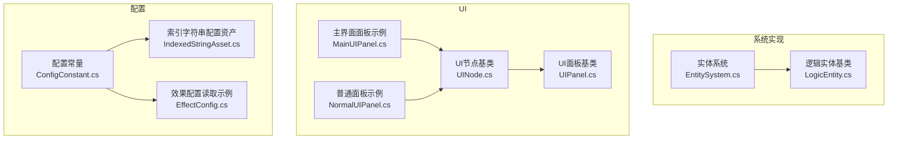
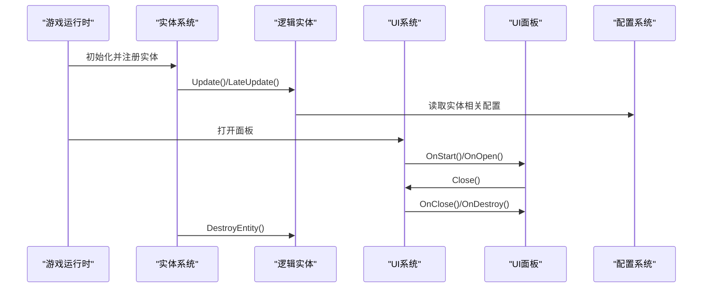
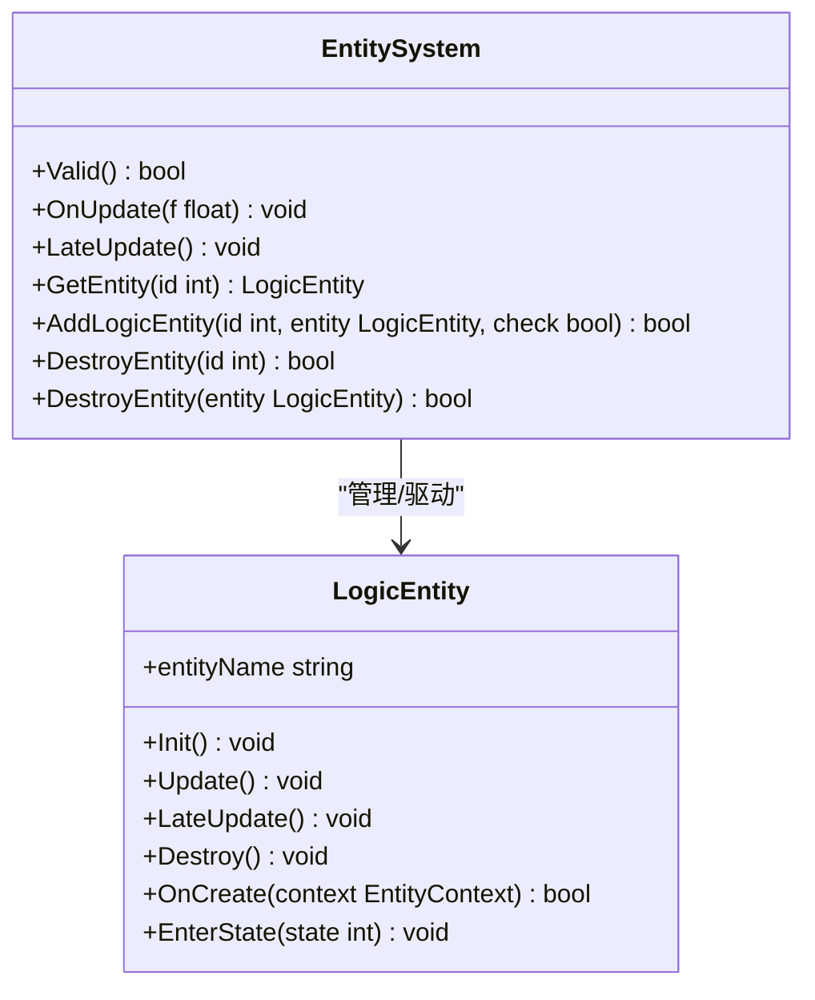
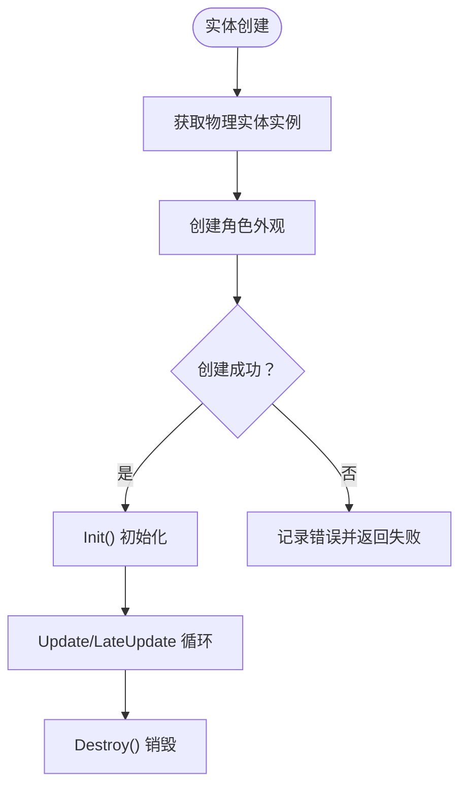
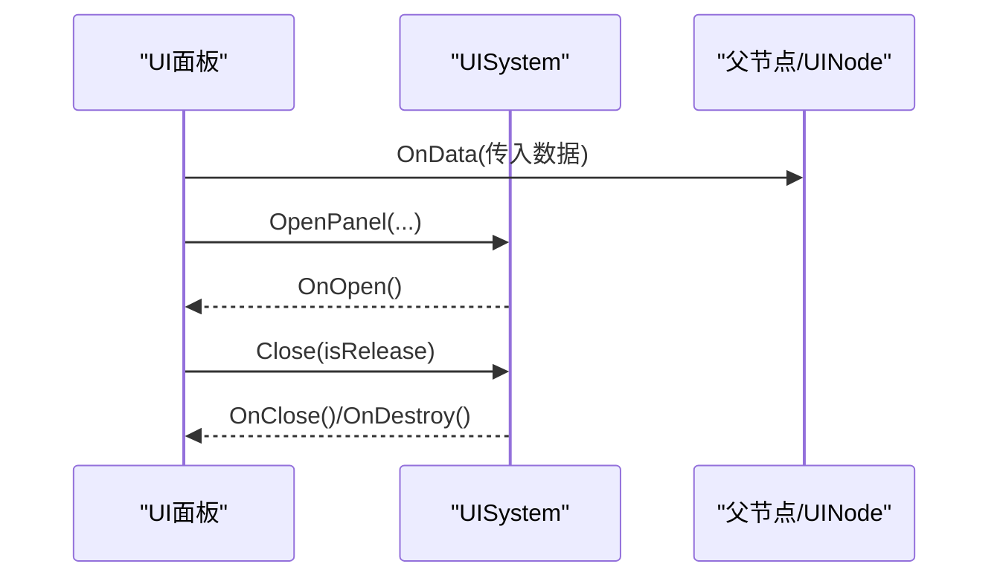
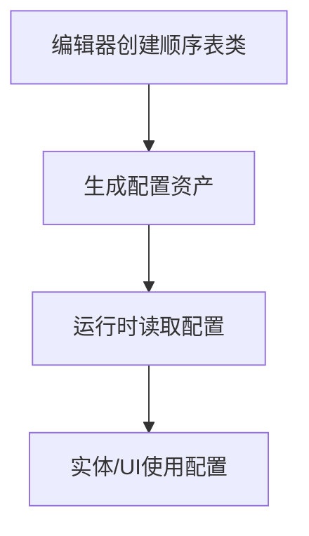
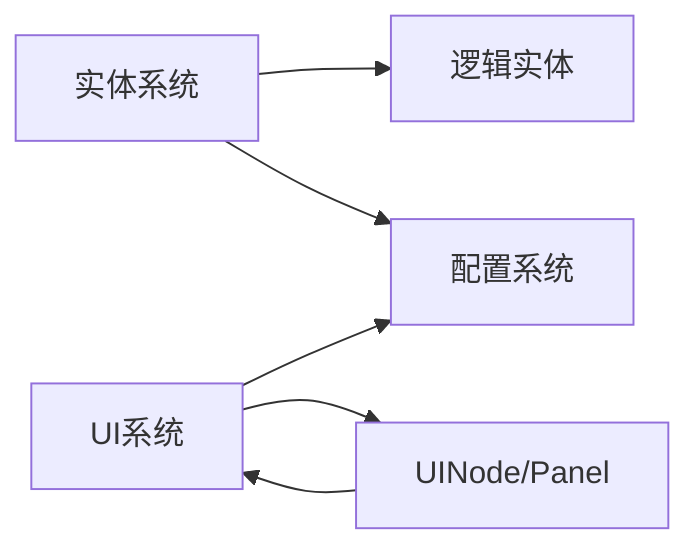

# 游戏模块

<cite>
**本文引用的文件**
- [EntitySystem.cs](file://Assets/Scripts/Systems/Implement/EntitySystem/EntitySystem.cs)
- [EntitySystem.Logic.cs](file://Assets/Scripts/Systems/Implement/EntitySystem/EntitySystem.Logic.cs)
- [LogicEntity.cs](file://Assets/Scripts/Systems/Implement/EntitySystem/LogicEntity/LogicEntity.cs)
- [LogicEntity.LogicUnit.cs](file://Assets/Scripts/Systems/Implement/EntitySystem/LogicEntity/LogicEntity.LogicUnit.cs)
- [UINode.cs](file://Assets/Scripts/UI/UINode.cs)
- [UIPanel.cs](file://Assets/Scripts/UI/UIPanel.cs)
- [NormalUIPanel.cs](file://Assets/Scripts/UI/NormalUIPanel.cs)
- [MainUIPanel.cs](file://Assets/Scripts/UI/MainUI/MainUIPanel.cs)
- [IndexedStringAsset.cs](file://Assets/Scripts/Config/IndexedString/IndexedStringAsset.cs)
- [ConfigConstant.cs](file://Assets/Scripts/Systems/Implement/ConfigSystem/ConfigConstant.cs)
- [EffectConfig.cs](file://Assets/Scripts/Systems/Implement/ConfigSystem/JsonConfigImpl/EffectConfig.cs)
- [__info__.json（系统实现）](file://Assets/Scripts/Systems/Implement/__info__.json)
- [__info__.json（配置）](file://Assets/Scripts/Config/__info__.json)
- [__info__.json（模块）](file://Assets/Scripts/Modules/__info__.json)
</cite>

## 目录
1. [引言](#引言)
2. [项目结构](#项目结构)
3. [核心组件](#核心组件)
4. [架构总览](#架构总览)
5. [详细组件分析](#详细组件分析)
6. [依赖分析](#依赖分析)
7. [性能考虑](#性能考虑)
8. [故障排查指南](#故障排查指南)
9. [结论](#结论)
10. [附录](#附录)

## 引言
本文件面向ProjectR项目的游戏模块，系统性梳理实体模块、UI模块与配置模块的设计理念、实现方式与交互关系。文档旨在帮助开发者快速理解模块职责、接口规范与使用方法，并提供扩展与二次开发的实践指导。

## 项目结构
ProjectR采用分层与模块化组织方式：
- 系统实现层：集中于“Systems/Implement”，包含实体系统、配置系统等运行时系统实现。
- UI层：位于“UI”目录，提供统一的UI节点与面板抽象，配合UISystem进行打开/关闭管理。
- 配置层：位于“Config”目录，包含顺序表配置、索引字符串配置等，支持编辑器工具与运行时读取。
- 模块层：位于“Modules”，当前标记为过时，建议迁移至Dev或具体场景。

图表来源
- [EntitySystem.cs:1-42](file://Assets/Scripts/Systems/Implement/EntitySystem/EntitySystem.cs#L1-L42)
- [LogicEntity.cs:1-42](file://Assets/Scripts/Systems/Implement/EntitySystem/LogicEntity/LogicEntity.cs#L1-L42)
- [UINode.cs:1-107](file://Assets/Scripts/UI/UINode.cs#L1-L107)
- [UIPanel.cs:1-8](file://Assets/Scripts/UI/UIPanel.cs#L1-L8)
- [MainUIPanel.cs:1-38](file://Assets/Scripts/UI/MainUI/MainUIPanel.cs#L1-L38)
- [NormalUIPanel.cs:1-34](file://Assets/Scripts/UI/NormalUIPanel.cs#L1-L34)
- [IndexedStringAsset.cs:1-8](file://Assets/Scripts/Config/IndexedString/IndexedStringAsset.cs#L1-L8)
- [ConfigConstant.cs:1-7](file://Assets/Scripts/Systems/Implement/ConfigSystem/ConfigConstant.cs#L1-L7)
- [EffectConfig.cs:85-100](file://Assets/Scripts/Systems/Implement/ConfigSystem/JsonConfigImpl/EffectConfig.cs#L85-L100)

章节来源
- [__info__.json（系统实现）:1-3](file://Assets/Scripts/Systems/Implement/__info__.json#L1-L3)
- [__info__.json（配置）:1-7](file://Assets/Scripts/Config/__info__.json#L1-L7)
- [__info__.json（模块）:1-4](file://Assets/Scripts/Modules/__info__.json#L1-L4)

## 核心组件
- 实体系统（EntitySystem）
  - 职责：统一调度逻辑实体的更新与延迟更新；维护逻辑实体ID到实体实例的映射；提供实体创建、销毁与查询能力。
  - 关键点：在非运行态调用会记录错误日志；遍历映射表驱动实体生命周期。
- 逻辑实体（LogicEntity）
  - 职责：封装实体的物理外观、输入处理、状态机、物理配置与额外数值等；负责实体创建、销毁与绘制辅助。
  - 关键点：通过实体上下文与物理实体协作；可挂载脚本状态机以驱动行为。
- UI系统（UINode/Panel）
  - 职责：提供UI节点生命周期回调（初始化、启动、打开、关闭、销毁）；统一关闭入口；支持数据传递与父子关系。
  - 关键点：通过UISystem进行打开/关闭；面板可继承UINode并覆盖回调。
- 配置系统（Config）
  - 职责：提供顺序表配置、索引字符串配置与JSON配置读取能力；定义配置根路径常量。
  - 关键点：支持编辑器工具生成顺序表类；运行时按名称或键值检索配置项。

章节来源
- [EntitySystem.cs:1-42](file://Assets/Scripts/Systems/Implement/EntitySystem/EntitySystem.cs#L1-L42)
- [EntitySystem.Logic.cs:1-71](file://Assets/Scripts/Systems/Implement/EntitySystem/EntitySystem.Logic.cs#L1-L71)
- [LogicEntity.cs:1-42](file://Assets/Scripts/Systems/Implement/EntitySystem/LogicEntity/LogicEntity.cs#L1-L42)
- [UINode.cs:1-107](file://Assets/Scripts/UI/UINode.cs#L1-L107)
- [UIPanel.cs:1-8](file://Assets/Scripts/UI/UIPanel.cs#L1-L8)
- [IndexedStringAsset.cs:1-8](file://Assets/Scripts/Config/IndexedString/IndexedStringAsset.cs#L1-L8)
- [ConfigConstant.cs:1-7](file://Assets/Scripts/Systems/Implement/ConfigSystem/ConfigConstant.cs#L1-L7)
- [EffectConfig.cs:85-100](file://Assets/Scripts/Systems/Implement/ConfigSystem/JsonConfigImpl/EffectConfig.cs#L85-L100)

## 架构总览
下图展示实体系统与UI系统的交互概览，以及配置系统对实体与UI的支撑作用。

图表来源
- [EntitySystem.cs:17-39](file://Assets/Scripts/Systems/Implement/EntitySystem/EntitySystem.cs#L17-L39)
- [LogicEntity.cs:22-39](file://Assets/Scripts/Systems/Implement/EntitySystem/LogicEntity/LogicEntity.cs#L22-L39)
- [UINode.cs:40-55](file://Assets/Scripts/UI/UINode.cs#L40-L55)
- [MainUIPanel.cs:14-30](file://Assets/Scripts/UI/MainUI/MainUIPanel.cs#L14-L30)
- [EffectConfig.cs:88-98](file://Assets/Scripts/Systems/Implement/ConfigSystem/JsonConfigImpl/EffectConfig.cs#L88-L98)

## 详细组件分析

### 实体系统（EntitySystem）
- 设计要点
  - 单例系统：继承MonoSingletonSystem，确保全局唯一。
  - 生命周期：在每帧更新中遍历所有逻辑实体并调用其Update/LateUpdate。
  - 安全检查：非运行态调用会输出错误日志。
  - 实体管理：维护逻辑实体ID到实体实例的字典；提供查询、添加与销毁接口。
- 接口与使用
  - 查询实体：通过实体ID从映射表获取实体。
  - 销毁实体：传入实体ID或实体实例均可销毁；销毁后从映射表移除。
  - 添加实体：校验实体有效性与ID唯一性后加入映射表。
- 复杂度与性能
  - 更新复杂度：O(N)，N为当前存活实体数量；建议避免在热路径频繁创建/销毁实体。
  - 内存占用：字典存储实体实例，注意及时销毁不再使用的实体。
- 扩展建议
  - 可增加实体池化策略，减少GC压力。
  - 可引入事件总线，在实体创建/销毁时广播通知其他系统。

图表来源
- [EntitySystem.cs:5-41](file://Assets/Scripts/Systems/Implement/EntitySystem/EntitySystem.cs#L5-L41)
- [EntitySystem.Logic.cs:7-69](file://Assets/Scripts/Systems/Implement/EntitySystem/EntitySystem.Logic.cs#L7-L69)
- [LogicEntity.cs:8-40](file://Assets/Scripts/Systems/Implement/EntitySystem/LogicEntity/LogicEntity.cs#L8-L40)

章节来源
- [EntitySystem.cs:1-42](file://Assets/Scripts/Systems/Implement/EntitySystem/EntitySystem.cs#L1-L42)
- [EntitySystem.Logic.cs:1-71](file://Assets/Scripts/Systems/Implement/EntitySystem/EntitySystem.Logic.cs#L1-L71)
- [LogicEntity.cs:1-42](file://Assets/Scripts/Systems/Implement/EntitySystem/LogicEntity/LogicEntity.cs#L1-L42)

### 逻辑实体（LogicEntity）
- 设计要点
  - 抽象基类：定义实体名称、物理实体、输入处理、状态机、物理配置与额外数值等。
  - 创建流程：通过实体系统获取物理实体实例，创建角色外观并回调。
  - 状态机：支持脚本状态机驱动行为切换。
- 使用方法
  - 继承LogicEntity并重写生命周期方法（Init/Update/LateUpdate/Destroy）。
  - 在OnCreate中完成外观与配置加载。
  - 使用EnterState进入特定行为状态。
- 注意事项
  - 若物理实体创建失败，需记录错误并中止初始化。
  - 额外数值可通过ExtraValueMap扩展。

图表来源
- [LogicEntity.cs:22-39](file://Assets/Scripts/Systems/Implement/EntitySystem/LogicEntity/LogicEntity.cs#L22-L39)

章节来源
- [LogicEntity.cs:1-42](file://Assets/Scripts/Systems/Implement/EntitySystem/LogicEntity/LogicEntity.cs#L1-L42)
- [LogicEntity.LogicUnit.cs:1-10](file://Assets/Scripts/Systems/Implement/EntitySystem/LogicEntity/LogicEntity.LogicUnit.cs#L1-L10)

### UI系统（UINode/Panel）
- 设计要点
  - UINode：统一的UI节点抽象，提供初始化、启动、打开、关闭、销毁等生命周期回调；支持数据传递与父子关系。
  - UIPanel：UI面板基类，可直接继承并覆盖回调。
  - 示例面板：MainUIPanel与NormalUIPanel演示了按钮绑定、数据传递与打开其他面板的典型用法。
- 接口与使用
  - 打开面板：通过UISystem.OpenPanel触发。
  - 关闭面板：调用Close(isRelease)由UISystem执行关闭与释放。
  - 数据传递：通过OnData接收父节点或外部传入的数据对象。
- 扩展建议
  - 可引入UI动画系统与层级管理（UILayer）以提升体验。
  - 建议统一资源字典UIAssetDict以集中管理预制体资源。

图表来源
- [UINode.cs:25-55](file://Assets/Scripts/UI/UINode.cs#L25-L55)
- [MainUIPanel.cs:14-30](file://Assets/Scripts/UI/MainUI/MainUIPanel.cs#L14-L30)
- [NormalUIPanel.cs:8-30](file://Assets/Scripts/UI/NormalUIPanel.cs#L8-L30)

章节来源
- [UINode.cs:1-107](file://Assets/Scripts/UI/UINode.cs#L1-L107)
- [UIPanel.cs:1-8](file://Assets/Scripts/UI/UIPanel.cs#L1-L8)
- [NormalUIPanel.cs:1-34](file://Assets/Scripts/UI/NormalUIPanel.cs#L1-L34)
- [MainUIPanel.cs:1-38](file://Assets/Scripts/UI/MainUI/MainUIPanel.cs#L1-L38)

### 配置系统（Config）
- 设计要点
  - 顺序表配置：IndexedStringAsset基于OrdinalConfig体系，支持编辑器工具生成顺序表类。
  - 配置常量：ConfigConstant定义配置根路径，便于统一管理。
  - JSON配置：EffectConfig提供按资源名检索配置项的示例方法。
- 使用方法
  - 编辑器侧：通过菜单创建顺序表类，生成对应配置资产。
  - 运行时侧：通过ConfigConstant定位配置根目录，按需读取配置项。
- 扩展建议
  - 可引入缓存机制减少重复读取。
  - 可增加配置变更监听，动态刷新UI或实体属性。

图表来源
- [IndexedStringAsset.cs:1-8](file://Assets/Scripts/Config/IndexedString/IndexedStringAsset.cs#L1-L8)
- [ConfigConstant.cs:3-6](file://Assets/Scripts/Systems/Implement/ConfigSystem/ConfigConstant.cs#L3-L6)
- [EffectConfig.cs:88-98](file://Assets/Scripts/Systems/Implement/ConfigSystem/JsonConfigImpl/EffectConfig.cs#L88-L98)

章节来源
- [IndexedStringAsset.cs:1-8](file://Assets/Scripts/Config/IndexedString/IndexedStringAsset.cs#L1-L8)
- [ConfigConstant.cs:1-7](file://Assets/Scripts/Systems/Implement/ConfigSystem/ConfigConstant.cs#L1-L7)
- [EffectConfig.cs:85-100](file://Assets/Scripts/Systems/Implement/ConfigSystem/JsonConfigImpl/EffectConfig.cs#L85-L100)
- [__info__.json（配置）:1-7](file://Assets/Scripts/Config/__info__.json#L1-L7)

## 依赖分析
- 实体系统依赖逻辑实体与物理实体（通过EntitySystem获取），并在运行时驱动其生命周期。
- UI系统依赖UINode/Panel抽象，通过UISystem进行统一管理；面板间通过数据传递与OpenPanel进行交互。
- 配置系统为实体与UI提供数据支撑，通过常量与工具类实现统一访问。

图表来源
- [EntitySystem.cs:17-39](file://Assets/Scripts/Systems/Implement/EntitySystem/EntitySystem.cs#L17-L39)
- [LogicEntity.cs:22-39](file://Assets/Scripts/Systems/Implement/EntitySystem/LogicEntity/LogicEntity.cs#L22-L39)
- [UINode.cs:25-55](file://Assets/Scripts/UI/UINode.cs#L25-L55)
- [ConfigConstant.cs:3-6](file://Assets/Scripts/Systems/Implement/ConfigSystem/ConfigConstant.cs#L3-L6)

章节来源
- [EntitySystem.cs:1-42](file://Assets/Scripts/Systems/Implement/EntitySystem/EntitySystem.cs#L1-L42)
- [LogicEntity.cs:1-42](file://Assets/Scripts/Systems/Implement/EntitySystem/LogicEntity/LogicEntity.cs#L1-L42)
- [UINode.cs:1-107](file://Assets/Scripts/UI/UINode.cs#L1-L107)
- [ConfigConstant.cs:1-7](file://Assets/Scripts/Systems/Implement/ConfigSystem/ConfigConstant.cs#L1-L7)

## 性能考虑
- 实体系统
  - 更新复杂度为O(N)，建议控制实体数量与更新频率；对不必要实体使用懒加载或延迟初始化。
  - 物理实体创建失败需尽早返回，避免无效开销。
- UI系统
  - 面板打开/关闭应避免频繁实例化/销毁；可采用对象池与资源字典降低GC与IO。
  - 回调链路尽量短，避免在OnStart/OnOpen中执行耗时操作。
- 配置系统
  - 运行时读取配置应避免重复解析；可引入缓存与异步加载策略。

## 故障排查指南
- 实体系统
  - 非运行态调用：若出现“非Playmode调用”错误，请确认调用发生在运行时。
  - 实体销毁失败：检查实体是否为空或ID是否有效；确认映射表中是否存在该实体。
- UI系统
  - 面板无法关闭：确认Close调用是否正确；检查UISystem的关闭流程是否被拦截。
  - 数据传递异常：确认OnData接收类型与传入对象一致；避免空引用。
- 配置系统
  - 配置读取不到：核对ConfigConstant中的根路径是否正确；确认资源名匹配。

章节来源
- [EntitySystem.cs:7-15](file://Assets/Scripts/Systems/Implement/EntitySystem/EntitySystem.cs#L7-L15)
- [EntitySystem.Logic.cs:28-39](file://Assets/Scripts/Systems/Implement/EntitySystem/EntitySystem.Logic.cs#L28-L39)
- [UINode.cs:52-55](file://Assets/Scripts/UI/UINode.cs#L52-L55)
- [EffectConfig.cs:88-98](file://Assets/Scripts/Systems/Implement/ConfigSystem/JsonConfigImpl/EffectConfig.cs#L88-L98)

## 结论
ProjectR的游戏模块以实体系统为核心，结合UI系统与配置系统形成清晰的职责边界与交互路径。通过统一的生命周期管理、标准化的UI节点抽象与可扩展的配置体系，开发者可以高效地构建与扩展游戏内容。建议在实际工程中遵循对象池化、缓存与异步加载等最佳实践，持续优化性能与可维护性。

## 附录
- 模块迁移提示
  - “Modules”目录当前标记为过时，建议将模块实现迁移至“Dev”或其他场景专用目录，保持结构清晰。
- 开发者建议
  - 在新增实体类型时，优先复用现有物理实体与状态机框架。
  - 在新增UI面板时，遵循UINode生命周期并统一资源管理。
  - 在新增配置项时，使用顺序表与索引字符串工具提升可维护性。

章节来源
- [__info__.json（模块）:1-4](file://Assets/Scripts/Modules/__info__.json#L1-L4)