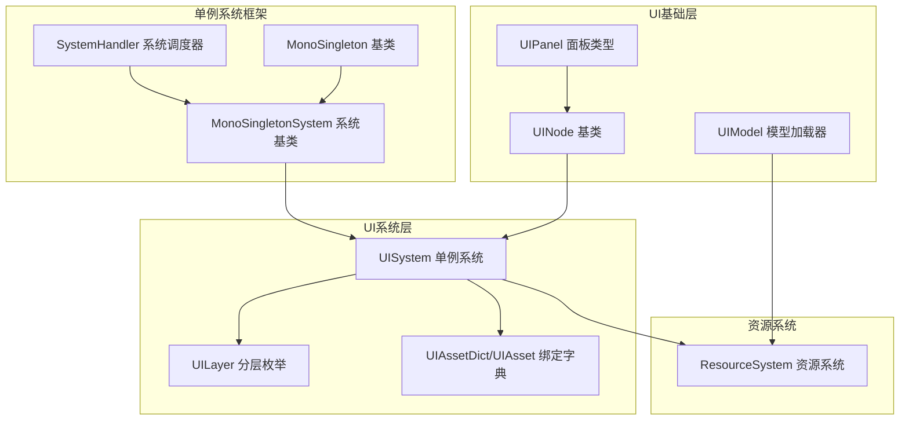
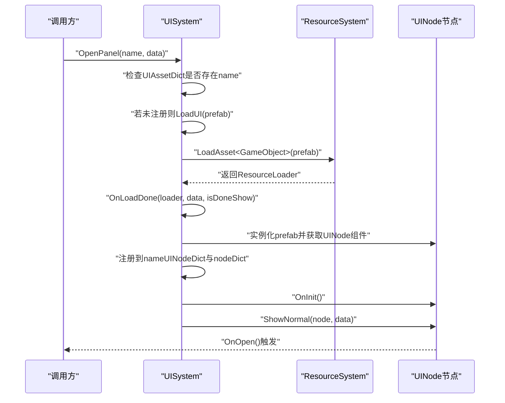
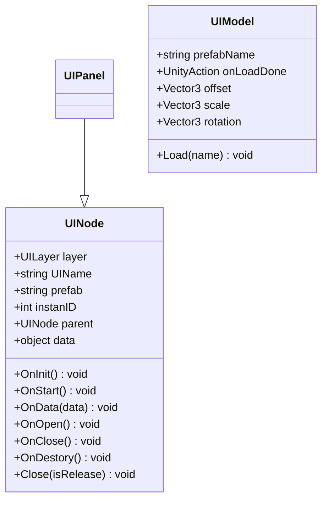
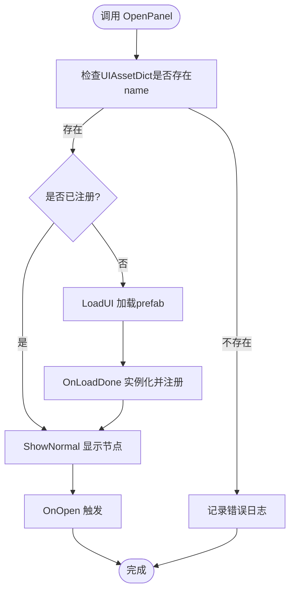
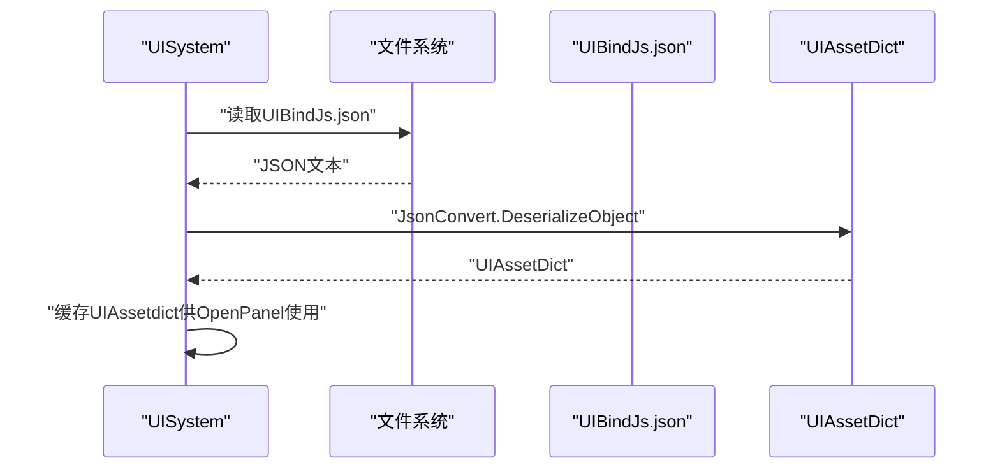
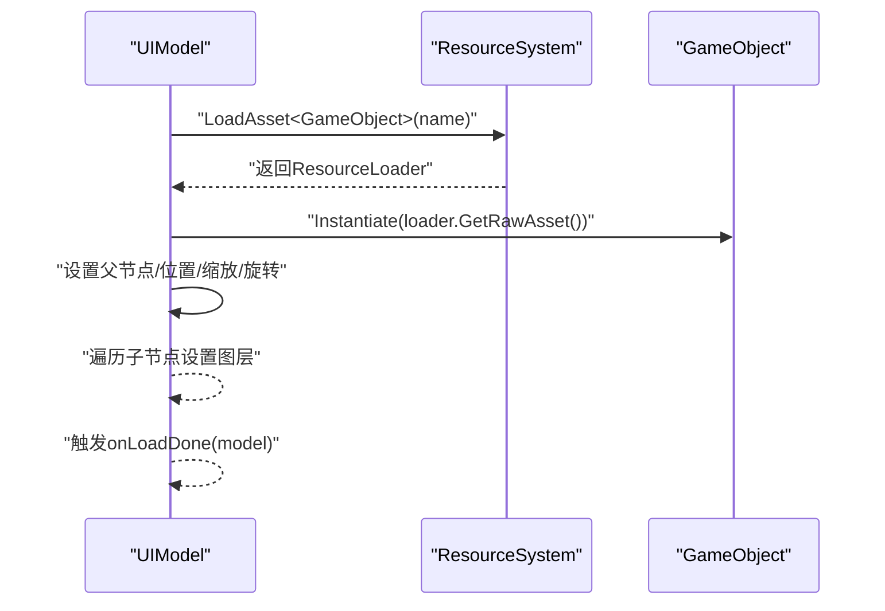
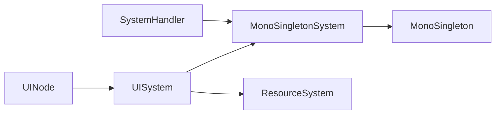

# UI节点系统

<cite>
**本文档引用的文件**
- [UINode.cs](file://Assets/Scripts/UI/UINode.cs)
- [UIPanel.cs](file://Assets/Scripts/UI/UIPanel.cs)
- [UIModel.cs](file://Assets/Scripts/UI/UIModel.cs)
- [NormalUIPanel.cs](file://Assets/Scripts/UI/NormalUIPanel.cs)
- [MainUIPanel.cs](file://Assets/Scripts/UI/MainUI/MainUIPanel.cs)
- [UISystem.cs](file://Assets/Scripts/Systems/Implement/UISystem/UISystem.cs)
- [MonoSingletonSystem.cs](file://Assets/Scripts/Systems/MonoSingletonSystem.cs)
- [SystemHandler.cs](file://Assets/Scripts/Systems/SystemHandler.cs)
- [MonoSingleton.cs](file://Assets/Scripts/Core/MonoSingleton.cs)
- [ResourceSystem.cs](file://Assets/Scripts/Systems/Implement/ResourceSystem/ResourceSystem.cs)
- [UIBindJs.json](file://Assets/Scripts/UI/UIBindJs.json)
</cite>

## 目录
1. [简介](#简介)
2. [项目结构](#项目结构)
3. [核心组件](#核心组件)
4. [架构总览](#架构总览)
5. [详细组件分析](#详细组件分析)
6. [依赖分析](#依赖分析)
7. [性能考虑](#性能考虑)
8. [故障排查指南](#故障排查指南)
9. [结论](#结论)
10. [附录](#附录)

## 简介
本文件系统性阐述ProjectR项目的UI节点系统，围绕UINode基类、UIModel数据模型层、UIPanel面板管理层展开，深入解析UI节点的层次结构、父子关系管理与生命周期控制；详解UI绑定机制（UIBindJs.json）的配置格式、数据绑定规则与事件绑定流程；提供扩展开发指南，包括自定义UI节点类型、节点间通信与数据传递方式；并给出创建、注册、显示、隐藏与销毁的完整流程示例路径，最后总结性能优化策略、内存管理与资源回收机制。

## 项目结构
UI节点系统主要由以下模块构成：
- UI基础层：UINode（节点基类）、UIPanel（面板类型）、UIModel（模型加载器）
- UI系统层：UISystem（单例系统，负责UI根节点、分层容器、事件系统、相机、资源加载与节点生命周期管理）
- 单例系统框架：MonoSingleton、MonoSingletonSystem、SystemHandler
- 资源系统：ResourceSystem（YooAsset封装，提供异步资源加载与Loader管理）

**图表来源**
- [UINode.cs:1-107](file://Assets/Scripts/UI/UINode.cs#L1-L107)
- [UIPanel.cs:1-9](file://Assets/Scripts/UI/UIPanel.cs#L1-L9)
- [UIModel.cs:1-63](file://Assets/Scripts/UI/UIModel.cs#L1-L63)
- [UISystem.cs:1-280](file://Assets/Scripts/Systems/Implement/UISystem/UISystem.cs#L1-L280)
- [MonoSingletonSystem.cs:1-36](file://Assets/Scripts/Systems/MonoSingletonSystem.cs#L1-L36)
- [SystemHandler.cs:1-70](file://Assets/Scripts/Systems/SystemHandler.cs#L1-L70)
- [MonoSingleton.cs:1-69](file://Assets/Scripts/Core/MonoSingleton.cs#L1-L69)
- [ResourceSystem.cs:1-485](file://Assets/Scripts/Systems/Implement/ResourceSystem/ResourceSystem.cs#L1-L485)

**章节来源**
- [UINode.cs:1-107](file://Assets/Scripts/UI/UINode.cs#L1-L107)
- [UIPanel.cs:1-9](file://Assets/Scripts/UI/UIPanel.cs#L1-L9)
- [UIModel.cs:1-63](file://Assets/Scripts/UI/UIModel.cs#L1-L63)
- [UISystem.cs:1-280](file://Assets/Scripts/Systems/Implement/UISystem/UISystem.cs#L1-L280)
- [MonoSingletonSystem.cs:1-36](file://Assets/Scripts/Systems/MonoSingletonSystem.cs#L1-L36)
- [SystemHandler.cs:1-70](file://Assets/Scripts/Systems/SystemHandler.cs#L1-L70)
- [MonoSingleton.cs:1-69](file://Assets/Scripts/Core/MonoSingleton.cs#L1-L69)
- [ResourceSystem.cs:1-485](file://Assets/Scripts/Systems/Implement/ResourceSystem/ResourceSystem.cs#L1-L485)

## 核心组件
- UINode：所有UI节点的基类，提供生命周期钩子（OnInit、OnStart、OnData、OnOpen、OnClose、OnDestory）、父子关系管理（parent字段）、关闭接口（Close）以及UI标识（UIName、instanID、layer、prefab、data）。
- UIPanel：UINode的专用面板类型，用于承载具体UI逻辑。
- UIModel：基于ResourceSystem的UI模型加载器，支持异步加载预制体、实例化、定位与层级设置，并通过回调通知加载完成。
- UISystem：UI系统核心，负责创建Canvas与分层根节点、事件系统、UI相机、资源加载、节点注册与显示/隐藏/销毁、数据传递（SetData）等。

关键职责与关系：
- UINode派生类通过UISystem.OpenPanel进行注册与显示；UISystem根据UIBindJs.json中的UIAssetDict映射加载对应prefab。
- UISystem维护按层（UILayer）与按名称（UIName）的节点索引，确保同一层内仅激活一个节点，其他节点隐藏。
- UIModel通过ResourceSystem异步加载UI预制体，完成后回调UISystem.OnLoadDone以完成节点初始化与布局。

**章节来源**
- [UINode.cs:9-57](file://Assets/Scripts/UI/UINode.cs#L9-L57)
- [UIPanel.cs:3-6](file://Assets/Scripts/UI/UIPanel.cs#L3-L6)
- [UIModel.cs:9-60](file://Assets/Scripts/UI/UIModel.cs#L9-L60)
- [UISystem.cs:21-48](file://Assets/Scripts/Systems/Implement/UISystem/UISystem.cs#L21-L48)

## 架构总览
UI节点系统采用“单例系统 + 分层容器 + 资源系统”的架构模式。系统启动时，UISystem初始化Canvas、分层根节点、事件系统与UI相机；UI节点通过OpenPanel按名称打开，系统从UIBindJs.json中查找对应prefab并异步加载；加载完成后，UISystem将节点注册到nameUINodeDict与nodeDict，并根据UILayer进行显示与层级管理。

**图表来源**
- [UISystem.cs:161-246](file://Assets/Scripts/Systems/Implement/UISystem/UISystem.cs#L161-L246)
- [ResourceSystem.cs:1-485](file://Assets/Scripts/Systems/Implement/ResourceSystem/ResourceSystem.cs#L1-L485)
- [UINode.cs:25-41](file://Assets/Scripts/UI/UINode.cs#L25-L41)

**章节来源**
- [UISystem.cs:161-246](file://Assets/Scripts/Systems/Implement/UISystem/UISystem.cs#L161-L246)
- [ResourceSystem.cs:1-485](file://Assets/Scripts/Systems/Implement/ResourceSystem/ResourceSystem.cs#L1-L485)

## 详细组件分析

### UINode基类与生命周期
- 关键字段：layer（UILayer）、UIName（唯一标识）、prefab（预制体名）、instanID（实例ID）、parent（父节点）、data（传入数据）。
- 生命周期钩子：
  - OnInit：初始化instanID等
  - OnStart：Start阶段默认将RectTransform本地位置置零
  - OnData：接收父节点或数据对象（可识别UINode或UINodeData）
  - OnOpen/OnClose/OnDestory：显示/关闭/销毁阶段回调
- 关闭接口：Close(isRelease)，委托给UISystem执行释放或隐藏逻辑。

**图表来源**
- [UINode.cs:9-57](file://Assets/Scripts/UI/UINode.cs#L9-L57)
- [UIPanel.cs:3-6](file://Assets/Scripts/UI/UIPanel.cs#L3-L6)
- [UIModel.cs:9-60](file://Assets/Scripts/UI/UIModel.cs#L9-L60)

**章节来源**
- [UINode.cs:9-57](file://Assets/Scripts/UI/UINode.cs#L9-L57)
- [UIModel.cs:9-60](file://Assets/Scripts/UI/UIModel.cs#L9-L60)

### UISystem系统与分层管理
- 分层容器：Main、Game、Top、MessageTop四层，每层生成独立根节点，按z轴深度区分层级。
- 显示策略：ShowNormal遍历同层节点，仅激活目标节点并置顶，其余隐藏。
- 生命周期：OpenPanel -> LoadUI -> OnLoadDone -> 注册 -> ShowNormal -> OnOpen；Close支持隐藏或释放。
- 数据绑定：SetData按UIName写入节点data并触发OnData回调。

**图表来源**
- [UISystem.cs:161-246](file://Assets/Scripts/Systems/Implement/UISystem/UISystem.cs#L161-L246)

**章节来源**
- [UISystem.cs:14-20](file://Assets/Scripts/Systems/Implement/UISystem/UISystem.cs#L14-L20)
- [UISystem.cs:115-143](file://Assets/Scripts/Systems/Implement/UISystem/UISystem.cs#L115-L143)
- [UISystem.cs:145-160](file://Assets/Scripts/Systems/Implement/UISystem/UISystem.cs#L145-L160)
- [UISystem.cs:252-264](file://Assets/Scripts/Systems/Implement/UISystem/UISystem.cs#L252-L264)

### UI绑定机制与配置
- 配置文件：UIBindJs.json，结构为assets字典，键为UI名称（如MainPanel），值为UIAsset对象（包含name与prefab）。
- 加载流程：UIAssetDataFunc读取UIBindJs.json并反序列化为UIAssetDict；UISystem在Initialize时加载该字典；OpenPanel按名称查找prefab并加载。

**图表来源**
- [UISystem.cs:38-48](file://Assets/Scripts/Systems/Implement/UISystem/UISystem.cs#L38-L48)
- [UISystem.cs:266-277](file://Assets/Scripts/Systems/Implement/UISystem/UISystem.cs#L266-L277)
- [UIBindJs.json:1-32](file://Assets/Scripts/UI/UIBindJs.json#L1-L32)

**章节来源**
- [UIBindJs.json:1-32](file://Assets/Scripts/UI/UIBindJs.json#L1-L32)
- [UISystem.cs:38-48](file://Assets/Scripts/Systems/Implement/UISystem/UISystem.cs#L38-L48)
- [UISystem.cs:266-277](file://Assets/Scripts/Systems/Implement/UISystem/UISystem.cs#L266-L277)

### UIModel数据模型层
- 功能：异步加载UI预制体，实例化后设置父节点、位置、缩放、旋转，并将子节点图层统一设置为UI层；完成后通过回调onLoadDone通知调用方。
- 依赖：ResourceSystem.LoadAsset<GameObject>异步加载，完成后Instantiate实例化。

**图表来源**
- [UIModel.cs:20-59](file://Assets/Scripts/UI/UIModel.cs#L20-L59)
- [ResourceSystem.cs:1-485](file://Assets/Scripts/Systems/Implement/ResourceSystem/ResourceSystem.cs#L1-L485)

**章节来源**
- [UIModel.cs:20-59](file://Assets/Scripts/UI/UIModel.cs#L20-L59)
- [ResourceSystem.cs:1-485](file://Assets/Scripts/Systems/Implement/ResourceSystem/ResourceSystem.cs#L1-L485)

### 具体使用示例（流程路径）
- 创建与注册：通过UISystem.OpenPanel("MainPanel")触发注册与显示；若未注册则异步加载prefab并实例化UINode。
- 显示与隐藏：ShowNormal仅激活目标节点并置顶，其他同层节点隐藏；Close支持隐藏或释放。
- 销毁：Close(isRelease=true)时，调用OnClose、OnDestory，从nodeDict与nameUINodeDict移除，并销毁GameObject。
- 数据传递：SetData按UIName写入data并触发OnData；节点可通过OnData处理字符串或UINodeData等对象。

参考路径：
- 打开面板：[UISystem.cs:161-178](file://Assets/Scripts/Systems/Implement/UISystem/UISystem.cs#L161-L178)
- 显示逻辑：[UISystem.cs:115-143](file://Assets/Scripts/Systems/Implement/UISystem/UISystem.cs#L115-L143)
- 关闭逻辑：[UISystem.cs:145-160](file://Assets/Scripts/Systems/Implement/UISystem/UISystem.cs#L145-L160)
- 设置数据：[UISystem.cs:252-264](file://Assets/Scripts/Systems/Implement/UISystem/UISystem.cs#L252-L264)
- 节点生命周期：[UINode.cs:25-51](file://Assets/Scripts/UI/UINode.cs#L25-L51)

**章节来源**
- [UISystem.cs:115-160](file://Assets/Scripts/Systems/Implement/UISystem/UISystem.cs#L115-L160)
- [UINode.cs:25-51](file://Assets/Scripts/UI/UINode.cs#L25-L51)

## 依赖分析
- 单例系统：MonoSingleton提供全局唯一实例与生命周期管理；MonoSingletonSystem扩展了系统初始化与注册；SystemHandler集中管理所有系统实例的Update循环。
- 资源系统：ResourceSystem封装YooAsset，提供异步加载、Loader队列管理与非引用Loader定期释放。
- UI系统：依赖资源系统进行UI预制体加载，依赖单例系统框架进行初始化与注册。

**图表来源**
- [MonoSingletonSystem.cs:1-36](file://Assets/Scripts/Systems/MonoSingletonSystem.cs#L1-L36)
- [SystemHandler.cs:23-41](file://Assets/Scripts/Systems/SystemHandler.cs#L23-L41)
- [MonoSingleton.cs:46-69](file://Assets/Scripts/Core/MonoSingleton.cs#L46-L69)
- [UISystem.cs:21-48](file://Assets/Scripts/Systems/Implement/UISystem/UISystem.cs#L21-L48)
- [ResourceSystem.cs:1-485](file://Assets/Scripts/Systems/Implement/ResourceSystem/ResourceSystem.cs#L1-L485)

**章节来源**
- [MonoSingletonSystem.cs:1-36](file://Assets/Scripts/Systems/MonoSingletonSystem.cs#L1-L36)
- [SystemHandler.cs:1-70](file://Assets/Scripts/Systems/SystemHandler.cs#L1-L70)
- [MonoSingleton.cs:1-69](file://Assets/Scripts/Core/MonoSingleton.cs#L1-L69)
- [ResourceSystem.cs:1-485](file://Assets/Scripts/Systems/Implement/ResourceSystem/ResourceSystem.cs#L1-L485)

## 性能考虑
- 异步加载与延迟实例化：UIModel与UISystem均采用协程异步加载，避免主线程阻塞；资源系统定期释放无引用Loader，降低内存压力。
- 同层节点管理：ShowNormal仅激活目标节点并置顶，其他节点隐藏，减少渲染与事件计算开销。
- 图层与相机：UI相机仅渲染UI层，避免无关对象参与渲染与拾取。
- 非引用Loader清理：ResourceSystem按固定帧间隔清理无引用Loader，防止Loader列表膨胀。

优化建议：
- 尽量复用已加载的UI节点（通过nameUINodeDict），避免重复实例化。
- 对频繁切换的面板使用隐藏而非释放，以减少加载开销。
- 控制UI层级数量，避免过多同层节点同时存在。

**章节来源**
- [UISystem.cs:115-143](file://Assets/Scripts/Systems/Implement/UISystem/UISystem.cs#L115-L143)
- [ResourceSystem.cs:57-73](file://Assets/Scripts/Systems/Implement/ResourceSystem/ResourceSystem.cs#L57-L73)

## 故障排查指南
常见问题与定位方法：
- UI未显示：检查UIBindJs.json中是否存在对应name；确认OpenPanel调用参数正确；查看UISystem日志输出。
- 节点无法关闭：确认Close调用参数（isRelease）是否符合预期；检查OnClose/OnDestory是否被覆盖导致逻辑异常。
- 数据未传递：确认SetData的接收方UIName是否正确；检查节点OnData实现是否处理了传入数据类型。
- 资源加载失败：查看ResourceSystem日志，确认prefab路径与名称正确；检查YooAsset包状态。

**章节来源**
- [UISystem.cs:174-178](file://Assets/Scripts/Systems/Implement/UISystem/UISystem.cs#L174-L178)
- [UISystem.cs:252-264](file://Assets/Scripts/Systems/Implement/UISystem/UISystem.cs#L252-L264)
- [ResourceSystem.cs:183-210](file://Assets/Scripts/Systems/Implement/ResourceSystem/ResourceSystem.cs#L183-L210)

## 结论
UI节点系统通过UINode基类抽象、UISystem统一管理、UIBindJs.json配置驱动与ResourceSystem异步加载，构建了清晰的UI层次结构与生命周期控制体系。系统具备良好的扩展性与性能表现，适合在复杂UI场景中进行模块化开发与高效迭代。

## 附录

### UI节点扩展开发指南
- 自定义UI节点类型：继承UINode或UIPanel，重写OnInit、OnStart、OnData、OnOpen、OnClose、OnDestory等生命周期钩子，按需实现业务逻辑。
- 节点间通信：通过UISystem.SetData按UIName发送数据，接收方在OnData中处理；也可在节点内部直接持有引用（谨慎使用，避免循环依赖）。
- 数据传递方式：支持任意object类型，建议定义明确的UINodeData派生类以增强类型安全与可维护性。
- 生命周期最佳实践：在OnInit中初始化ID与引用，在OnStart中绑定事件，在OnOpen中执行显示逻辑，在OnClose中清理事件与订阅，在OnDestory中释放资源与引用。

**章节来源**
- [UINode.cs:25-51](file://Assets/Scripts/UI/UINode.cs#L25-L51)
- [UISystem.cs:252-264](file://Assets/Scripts/Systems/Implement/UISystem/UISystem.cs#L252-L264)